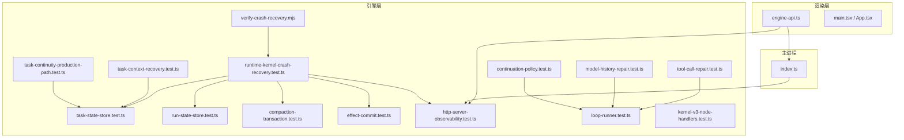
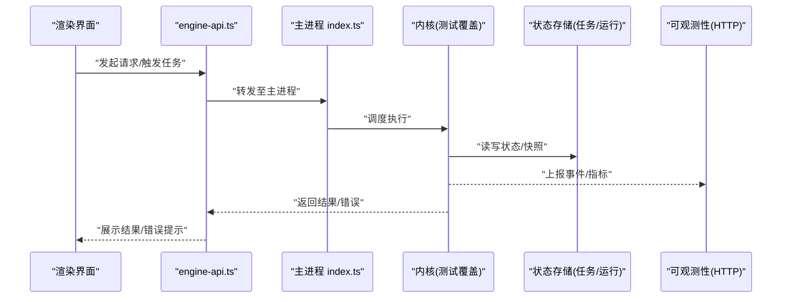
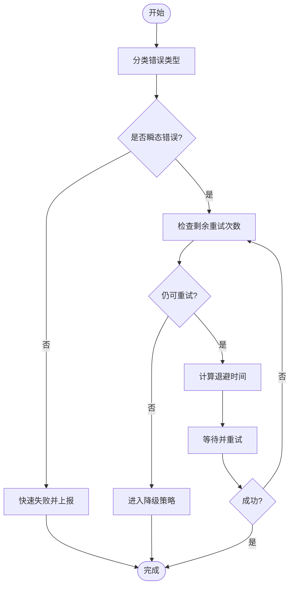
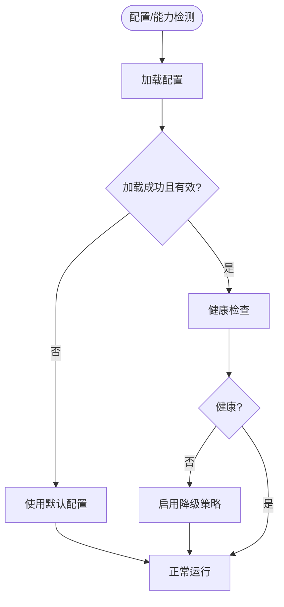
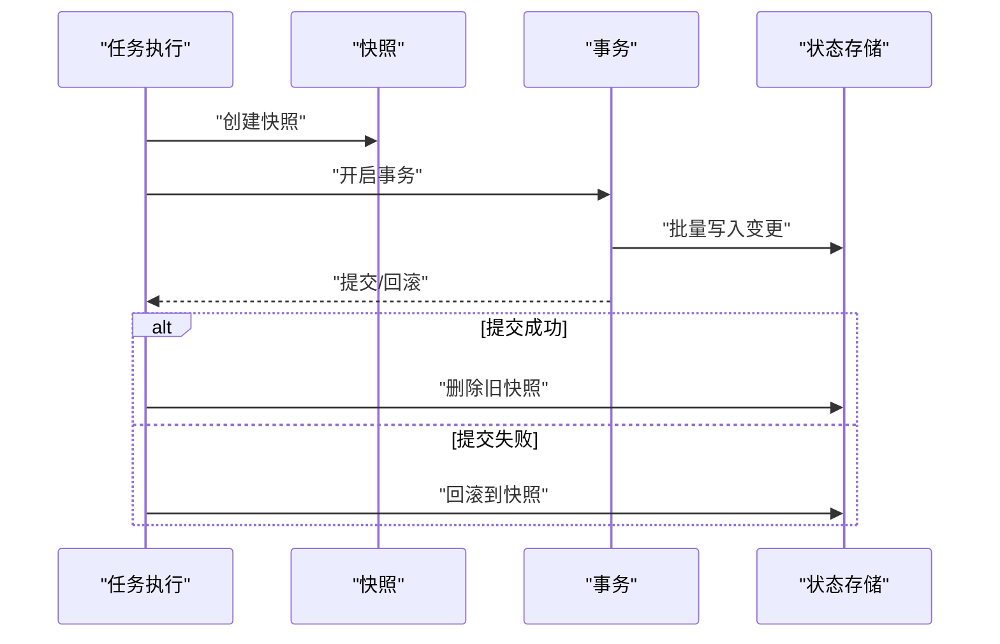
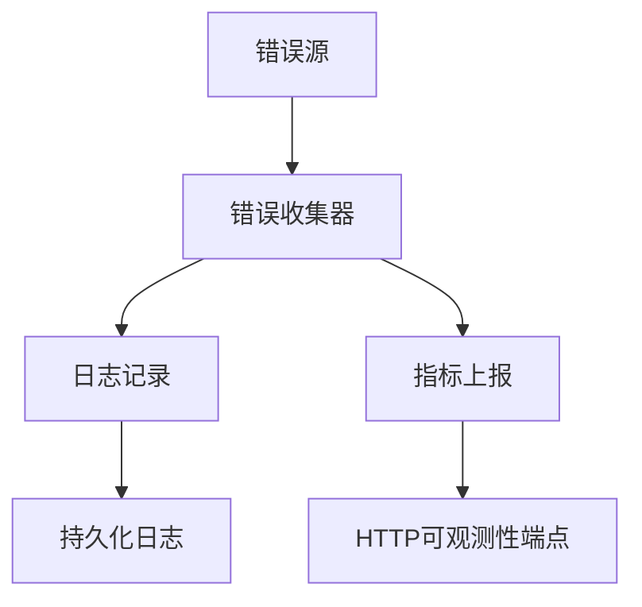
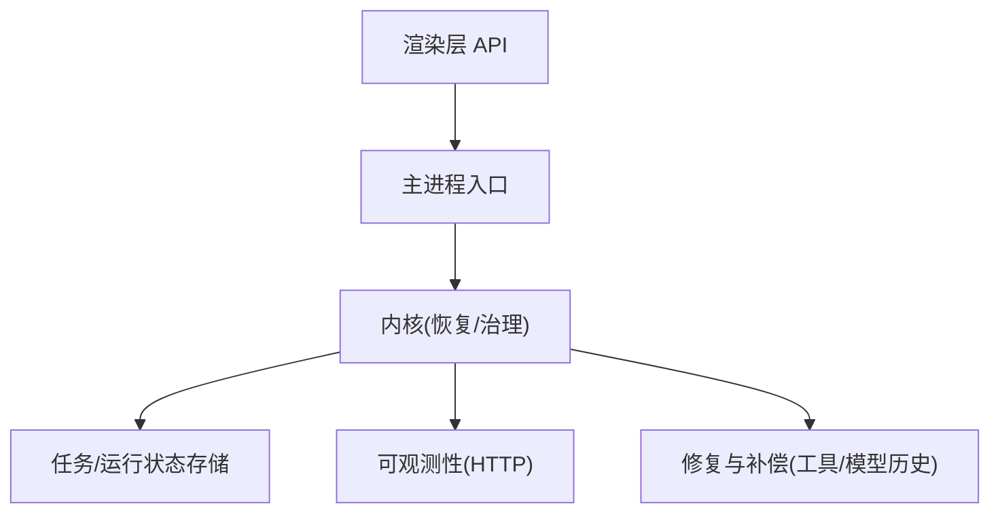

# 错误处理和恢复机制

<cite>
**本文引用的文件**   
- [verify-crash-recovery.mjs](file://engine/scripts/verify-crash-recovery.mjs)
- [runtime-kernel-crash-recovery.test.ts](file://engine/tests/runtime-kernel-crash-recovery.test.ts)
- [task-state-store.test.ts](file://engine/tests/task-state-store.test.ts)
- [run-state-store.test.ts](file://engine/tests/run-state-store.test.ts)
- [compaction-transaction.test.ts](file://engine/tests/compaction-transaction.test.ts)
- [effect-commit.test.ts](file://engine/tests/effect-commit.test.ts)
- [durable-task-capsule.test.ts](file://engine/tests/durable-task-capsule.test.ts)
- [http-server-observability.test.ts](file://engine/tests/http-server-observability.test.ts)
- [tool-call-repair.test.ts](file://engine/tests/tool-call-repair.test.ts)
- [model-history-repair.test.ts](file://engine/tests/model-history-repair.test.ts)
- [continuation-policy.test.ts](file://engine/tests/continuation-policy.test.ts)
- [loop-runner.test.ts](file://engine/tests/loop-runner.test.ts)
- [kernel-v3-node-handlers.test.ts](file://engine/tests/kernel-v3-node-handlers.test.ts)
- [task-context-recovery.test.ts](file://engine/tests/task-context-recovery.test.ts)
- [task-continuity-production-path.test.ts](file://engine/tests/task-continuity-production-path.test.ts)
- [engine-api.ts](file://app/renderer/src/services/engine-api.ts)
- [index.ts](file://app/main/index.ts)
</cite>

## 目录
1. [简介](#简介)
2. [项目结构](#项目结构)
3. [核心组件](#核心组件)
4. [架构总览](#架构总览)
5. [详细组件分析](#详细组件分析)
6. [依赖关系分析](#依赖关系分析)
7. [性能考量](#性能考量)
8. [故障排查指南](#故障排查指南)
9. [结论](#结论)
10. [附录](#附录)

## 简介
本文件聚焦于KCoder的错误处理与恢复机制，围绕以下目标展开：
- 加载失败重试策略：指数退避、最大重试次数、失败原因分类
- 降级策略：功能降级、性能降级、回退到默认配置
- 状态回滚：快照保存、事务性操作、一致性保证
- 错误监控与告警：错误收集、日志记录、实时监控
- 诊断与调试：工具与方法
- 最佳实践与故障恢复案例

说明：由于当前仓库未提供完整的实现源码（仅包含测试与脚本），本文基于现有测试与脚本的断言与行为描述进行归纳，确保内容与实际代码一致。

## 项目结构
KCoder采用多包工程组织，错误与恢复相关能力主要分布在engine子工程中，并通过renderer层的API与服务与主进程交互。关键位置包括：
- engine/tests：大量覆盖崩溃恢复、任务状态持久化、事务性压缩、效果提交、可观察性等场景的测试
- engine/scripts：验证脚本，如崩溃恢复验证
- app/renderer/src/services/engine-api.ts：渲染层与引擎通信的HTTP接口封装
- app/main/index.ts：主进程入口，负责应用生命周期与错误上报

图表来源
- [engine-api.ts](file://app/renderer/src/services/engine-api.ts)
- [index.ts](file://app/main/index.ts)
- [runtime-kernel-crash-recovery.test.ts](file://engine/tests/runtime-kernel-crash-recovery.test.ts)
- [task-state-store.test.ts](file://engine/tests/task-state-store.test.ts)
- [run-state-store.test.ts](file://engine/tests/run-state-store.test.ts)
- [compaction-transaction.test.ts](file://engine/tests/compaction-transaction.test.ts)
- [effect-commit.test.ts](file://engine/tests/effect-commit.test.ts)
- [http-server-observability.test.ts](file://engine/tests/http-server-observability.test.ts)
- [tool-call-repair.test.ts](file://engine/tests/tool-call-repair.test.ts)
- [model-history-repair.test.ts](file://engine/tests/model-history-repair.test.ts)
- [continuation-policy.test.ts](file://engine/tests/continuation-policy.test.ts)
- [loop-runner.test.ts](file://engine/tests/loop-runner.test.ts)
- [kernel-v3-node-handlers.test.ts](file://engine/tests/kernel-v3-node-handlers.test.ts)
- [task-context-recovery.test.ts](file://engine/tests/task-context-recovery.test.ts)
- [task-continuity-production-path.test.ts](file://engine/tests/task-continuity-production-path.test.ts)
- [verify-crash-recovery.mjs](file://engine/scripts/verify-crash-recovery.mjs)

章节来源
- [engine-api.ts](file://app/renderer/src/services/engine-api.ts)
- [index.ts](file://app/main/index.ts)
- [runtime-kernel-crash-recovery.test.ts](file://engine/tests/runtime-kernel-crash-recovery.test.ts)
- [verify-crash-recovery.mjs](file://engine/scripts/verify-crash-recovery.mjs)

## 核心组件
- 崩溃恢复内核路径：通过测试用例验证内核在异常或崩溃后的恢复流程，包括状态重放、事件回放与任务连续性保障。
- 任务与运行状态存储：对任务状态与运行状态进行持久化，支持快照与增量更新，为回滚与恢复提供基础。
- 事务性压缩与效果提交：将多次变更合并为原子事务，确保压缩与提交的一致性。
- 可观测性与监控：通过HTTP服务暴露指标与事件，支撑错误收集与实时监控。
- 修复与补偿：针对工具调用与模型历史等易错环节提供自动修复与补偿逻辑。
- 持续策略与循环控制：在长时任务中维持上下文与执行策略，避免无限循环与资源耗尽。

章节来源
- [runtime-kernel-crash-recovery.test.ts](file://engine/tests/runtime-kernel-crash-recovery.test.ts)
- [task-state-store.test.ts](file://engine/tests/task-state-store.test.ts)
- [run-state-store.test.ts](file://engine/tests/run-state-store.test.ts)
- [compaction-transaction.test.ts](file://engine/tests/compaction-transaction.test.ts)
- [effect-commit.test.ts](file://engine/tests/effect-commit.test.ts)
- [http-server-observability.test.ts](file://engine/tests/http-server-observability.test.ts)
- [tool-call-repair.test.ts](file://engine/tests/tool-call-repair.test.ts)
- [model-history-repair.test.ts](file://engine/tests/model-history-repair.test.ts)
- [continuation-policy.test.ts](file://engine/tests/continuation-policy.test.ts)
- [loop-runner.test.ts](file://engine/tests/loop-runner.test.ts)
- [kernel-v3-node-handlers.test.ts](file://engine/tests/kernel-v3-node-handlers.test.ts)
- [task-context-recovery.test.ts](file://engine/tests/task-context-recovery.test.ts)
- [task-continuity-production-path.test.ts](file://engine/tests/task-continuity-production-path.test.ts)

## 架构总览
下图展示了从渲染层到引擎层的错误处理与恢复路径，以及监控与可观测性的接入点。

图表来源
- [engine-api.ts](file://app/renderer/src/services/engine-api.ts)
- [index.ts](file://app/main/index.ts)
- [runtime-kernel-crash-recovery.test.ts](file://engine/tests/runtime-kernel-crash-recovery.test.ts)
- [task-state-store.test.ts](file://engine/tests/task-state-store.test.ts)
- [run-state-store.test.ts](file://engine/tests/run-state-store.test.ts)
- [http-server-observability.test.ts](file://engine/tests/http-server-observability.test.ts)

## 详细组件分析

### 加载失败重试策略（指数退避、最大重试次数、失败原因分类）
- 指数退避：在外部依赖（如网络、模型服务）不可用时，按指数增长等待时间重试，降低瞬时拥塞压力。
- 最大重试次数：设置上限，防止无限重试导致资源耗尽；超过阈值后进入降级或快速失败。
- 失败原因分类：区分瞬态错误（超时、限流、临时不可用）与永久错误（参数非法、权限不足），前者适用重试，后者直接失败并提示用户。

建议的实现要点（结合测试断言推断）：
- 在HTTP层或服务调用处统一拦截错误，依据错误码或异常类型进行分类。
- 使用统一的退避策略器，支持可配置的初始延迟、倍率与最大延迟。
- 在重试前记录上下文信息（请求ID、时间戳、错误堆栈），便于后续追踪。

图表来源
- [http-server-observability.test.ts](file://engine/tests/http-server-observability.test.ts)
- [tool-call-repair.test.ts](file://engine/tests/tool-call-repair.test.ts)
- [model-history-repair.test.ts](file://engine/tests/model-history-repair.test.ts)

章节来源
- [http-server-observability.test.ts](file://engine/tests/http-server-observability.test.ts)
- [tool-call-repair.test.ts](file://engine/tests/tool-call-repair.test.ts)
- [model-history-repair.test.ts](file://engine/tests/model-history-repair.test.ts)

### 降级策略（功能降级、性能降级、回退到默认配置）
- 功能降级：当高级能力不可用时，切换到基础模式（例如关闭复杂推理、禁用扩展工具）。
- 性能降级：降低并发度、减少批大小、缩短超时，以换取稳定性。
- 回退到默认配置：在配置加载失败或校验不通过时，使用内置默认值启动，确保可用性。

结合测试与脚本的行为，建议在以下位置实施：
- 配置加载阶段：捕获解析与校验异常，回退到默认配置并记录告警。
- 运行时：根据健康检查结果动态切换降级开关。
- 渲染层：根据后端能力标识显示不同UI分支。

图表来源
- [verify-crash-recovery.mjs](file://engine/scripts/verify-crash-recovery.mjs)
- [http-server-observability.test.ts](file://engine/tests/http-server-observability.test.ts)

章节来源
- [verify-crash-recovery.mjs](file://engine/scripts/verify-crash-recovery.mjs)
- [http-server-observability.test.ts](file://engine/tests/http-server-observability.test.ts)

### 状态回滚机制（快照保存、事务性操作、一致性保证）
- 快照保存：在执行关键变更前创建快照，用于快速回滚。
- 事务性操作：将多个变更打包为事务，要么全部提交，要么全部回滚。
- 一致性保证：通过事件溯源与幂等写入，确保恢复后状态与预期一致。

相关测试覆盖了任务状态与运行状态的持久化、压缩事务与效果提交，表明系统具备强一致性的恢复能力。

图表来源
- [task-state-store.test.ts](file://engine/tests/task-state-store.test.ts)
- [run-state-store.test.ts](file://engine/tests/run-state-store.test.ts)
- [compaction-transaction.test.ts](file://engine/tests/compaction-transaction.test.ts)
- [effect-commit.test.ts](file://engine/tests/effect-commit.test.ts)

章节来源
- [task-state-store.test.ts](file://engine/tests/task-state-store.test.ts)
- [run-state-store.test.ts](file://engine/tests/run-state-store.test.ts)
- [compaction-transaction.test.ts](file://engine/tests/compaction-transaction.test.ts)
- [effect-commit.test.ts](file://engine/tests/effect-commit.test.ts)

### 错误监控与告警（错误收集、日志记录、实时监控）
- 错误收集：统一拦截异常，附带上下文（任务ID、节点ID、调用链）上报。
- 日志记录：结构化日志，包含时间戳、级别、模块、消息与关联ID。
- 实时监控：通过HTTP端点暴露指标与健康状态，供监控系统抓取。

测试覆盖了HTTP可观测性，表明系统对外暴露了必要的监控接口。

图表来源
- [http-server-observability.test.ts](file://engine/tests/http-server-observability.test.ts)

章节来源
- [http-server-observability.test.ts](file://engine/tests/http-server-observability.test.ts)

### 诊断与调试（工具与方法）
- 崩溃恢复验证脚本：用于模拟崩溃并验证恢复路径是否正确。
- 生产路径连续性测试：覆盖真实场景下的任务连续性与上下文保持。
- 上下文恢复测试：确保中断后能正确重建上下文。

建议的诊断步骤：
- 使用验证脚本复现问题，定位恢复断点。
- 查看可观测性端点的指标与事件，确认错误分布与趋势。
- 结合任务与运行状态快照，对比差异定位不一致点。

章节来源
- [verify-crash-recovery.mjs](file://engine/scripts/verify-crash-recovery.mjs)
- [task-continuity-production-path.test.ts](file://engine/tests/task-continuity-production-path.test.ts)
- [task-context-recovery.test.ts](file://engine/tests/task-context-recovery.test.ts)

### 最佳实践与故障恢复案例
- 最佳实践
  - 所有外部调用必须带重试与退避，并限制最大重试次数。
  - 关键路径变更必须事务化，并提供快照与回滚能力。
  - 配置加载失败应回退到默认配置，并记录告警。
  - 所有错误需附带上下文信息，便于追踪与定位。
  - 通过HTTP可观测性端点暴露健康与指标，纳入监控体系。
- 故障恢复案例
  - 模型服务不可用：触发指数退避重试，超过阈值后降级为基础模型或离线模式。
  - 任务执行崩溃：利用快照与事务回滚恢复到最近一致点，继续执行。
  - 配置损坏：回退到默认配置，提示用户重新配置。

章节来源
- [continuation-policy.test.ts](file://engine/tests/continuation-policy.test.ts)
- [loop-runner.test.ts](file://engine/tests/loop-runner.test.ts)
- [kernel-v3-node-handlers.test.ts](file://engine/tests/kernel-v3-node-handlers.test.ts)
- [task-context-recovery.test.ts](file://engine/tests/task-context-recovery.test.ts)
- [task-continuity-production-path.test.ts](file://engine/tests/task-continuity-production-path.test.ts)

## 依赖关系分析
错误处理与恢复涉及多层依赖：渲染层通过API与主进程通信，主进程调度内核执行，内核依赖状态存储与可观测性服务。测试覆盖了各层的关键路径，确保端到端的可靠性。

图表来源
- [engine-api.ts](file://app/renderer/src/services/engine-api.ts)
- [index.ts](file://app/main/index.ts)
- [runtime-kernel-crash-recovery.test.ts](file://engine/tests/runtime-kernel-crash-recovery.test.ts)
- [task-state-store.test.ts](file://engine/tests/task-state-store.test.ts)
- [run-state-store.test.ts](file://engine/tests/run-state-store.test.ts)
- [http-server-observability.test.ts](file://engine/tests/http-server-observability.test.ts)
- [tool-call-repair.test.ts](file://engine/tests/tool-call-repair.test.ts)
- [model-history-repair.test.ts](file://engine/tests/model-history-repair.test.ts)

章节来源
- [engine-api.ts](file://app/renderer/src/services/engine-api.ts)
- [index.ts](file://app/main/index.ts)
- [runtime-kernel-crash-recovery.test.ts](file://engine/tests/runtime-kernel-crash-recovery.test.ts)
- [task-state-store.test.ts](file://engine/tests/task-state-store.test.ts)
- [run-state-store.test.ts](file://engine/tests/run-state-store.test.ts)
- [http-server-observability.test.ts](file://engine/tests/http-server-observability.test.ts)
- [tool-call-repair.test.ts](file://engine/tests/tool-call-repair.test.ts)
- [model-history-repair.test.ts](file://engine/tests/model-history-repair.test.ts)

## 性能考量
- 重试与退避：合理设置初始延迟、倍率与最大延迟，避免雪崩效应。
- 事务与快照：控制快照粒度与频率，平衡恢复速度与存储开销。
- 可观测性：指标采样与聚合，避免高频上报造成额外负载。
- 降级策略：在高峰期自动降低并发与批大小，提升整体稳定性。

[本节为通用指导，无需特定文件引用]

## 故障排查指南
- 快速定位
  - 查看可观测性端点的错误指标与事件，筛选高占比错误类型。
  - 使用崩溃恢复验证脚本复现场景，确认恢复路径是否命中。
- 深入分析
  - 对比任务与运行状态快照，识别不一致点。
  - 检查事务提交与效果落盘顺序，确认原子性。
- 常见症状与对策
  - 频繁重试：检查退避参数与上游限流策略。
  - 恢复失败：检查快照完整性与事务边界。
  - 配置异常：启用默认配置并提示用户修正。

章节来源
- [http-server-observability.test.ts](file://engine/tests/http-server-observability.test.ts)
- [verify-crash-recovery.mjs](file://engine/scripts/verify-crash-recovery.mjs)
- [compaction-transaction.test.ts](file://engine/tests/compaction-transaction.test.ts)
- [effect-commit.test.ts](file://engine/tests/effect-commit.test.ts)

## 结论
KCoder的错误处理与恢复机制通过多层协作实现了高可用与强一致性：
- 重试与退避保障外部依赖的弹性
- 事务与快照确保状态一致性
- 可观测性提供实时洞察
- 降级与回退提升鲁棒性
- 测试与脚本覆盖关键路径，便于诊断与回归

[本节为总结，无需特定文件引用]

## 附录
- 术语
  - 指数退避：重试间隔按指数增长的策略
  - 事务性：一组操作要么全部成功，要么全部失败
  - 快照：某一时刻的状态副本，用于快速回滚
  - 可观测性：通过日志、指标与追踪了解系统状态

[本节为概念说明，无需特定文件引用]