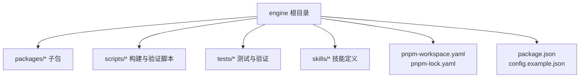
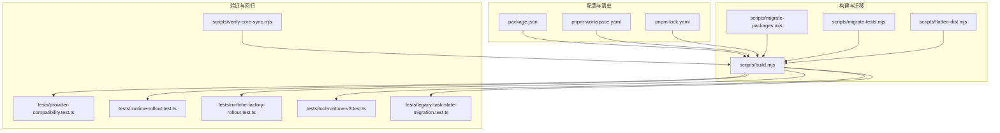
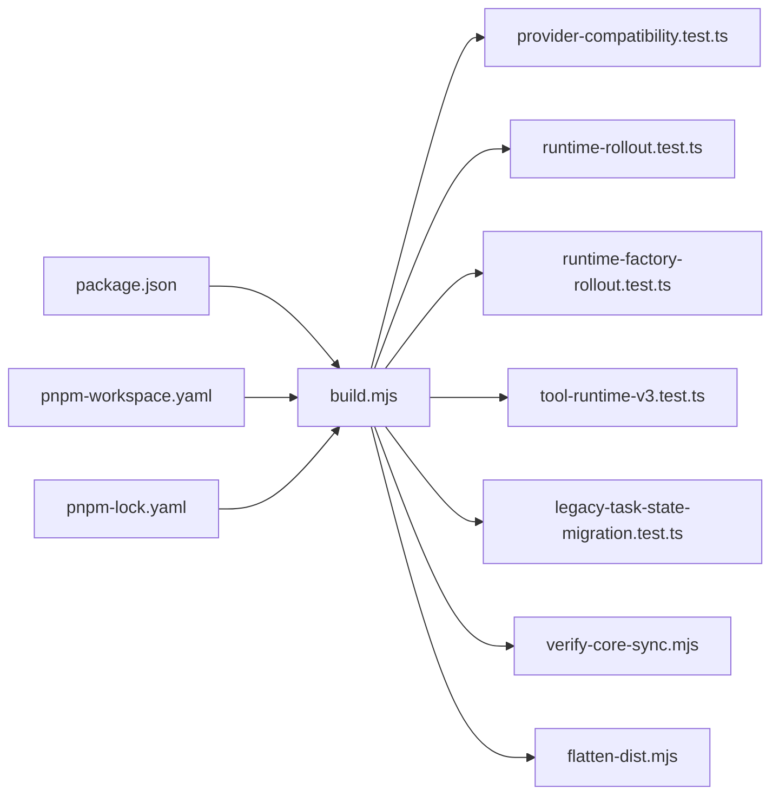

# 版本管理系统

<cite>
**本文引用的文件**   
- [package.json](file://engine/package.json)
- [pnpm-workspace.yaml](file://engine/pnpm-workspace.yaml)
- [pnpm-lock.yaml](file://engine/pnpm-lock.yaml)
- [README.md](file://engine/README.md)
- [config.example.json](file://engine/config.example.json)
- [scripts/build.mjs](file://engine/scripts/build.mjs)
- [scripts/migrate-packages.mjs](file://engine/scripts/migrate-packages.mjs)
- [scripts/migrate-tests.mjs](file://engine/scripts/migrate-tests.mjs)
- [scripts/scaffold-packages.mjs](file://engine/scripts/scaffold-packages.mjs)
- [scripts/verify-core-sync.mjs](file://engine/scripts/verify-core-sync.mjs)
- [scripts/verify-crash-recovery.mjs](file://engine/scripts/verify-crash-recovery.mjs)
- [scripts/verify-evented-a2a.mjs](file://engine/scripts/verify-evented-a2a.mjs)
- [scripts/verify-sqlite.mjs](file://engine/scripts/verify-sqlite.mjs)
- [scripts/transcript-diff.mjs](file://engine/scripts/transcript-diff.mjs)
- [scripts/flatten-dist.mjs](file://engine/scripts/flatten-dist.mjs)
- [tests/manifest.test.ts](file://engine/tests/manifest.test.ts)
- [tests/provider-compatibility.test.ts](file://engine/tests/provider-compatibility.test.ts)
- [tests/runtime-kernel.test.ts](file://engine/tests/runtime-kernel.test.ts)
- [tests/tool-runtime-v3.test.ts](file://engine/tests/tool-runtime-v3.test.ts)
- [tests/runtime-rollout.test.ts](file://engine/tests/runtime-rollout.test.ts)
- [tests/runtime-factory-rollout.test.ts](file://engine/tests/runtime-factory-rollout.test.ts)
- [tests/legacy-task-state-migration.test.ts](file://engine/tests/legacy-task-state-migration.test.ts)
</cite>

## 目录
1. [简介](#简介)
2. [项目结构](#项目结构)
3. [核心组件](#核心组件)
4. [架构总览](#架构总览)
5. [详细组件分析](#详细组件分析)
6. [依赖分析](#依赖分析)
7. [性能考虑](#性能考虑)
8. [故障诊断指南](#故障诊断指南)
9. [结论](#结论)
10. [附录](#附录)

## 简介
本技术文档围绕KCoder的版本管理系统，系统性阐述语义化版本控制、向后兼容性检查、升级与降级策略、版本冲突解决、版本锁定机制、CLI工具与API接口、发布自动化流程与最佳实践，以及迁移示例与故障诊断方法。文档以仓库中现有脚本、测试与配置为依据，提供可操作的工程化建议与可视化图示，帮助读者快速理解并落地版本管理方案。

## 项目结构
KCoder采用多包工作区组织（pnpm workspace），引擎层位于 engine 目录，包含多个子包（packages）、构建与验证脚本（scripts）、技能定义（skills）与测试用例（tests）。版本管理相关的关键位置包括：
- 工作区与工作区锁：pnpm-workspace.yaml、pnpm-lock.yaml
- 包清单与元数据：各包的 package.json（以根级示例为入口）
- 构建与迁移脚本：scripts/*.mjs
- 兼容性与回滚验证：tests/*rollout*.test.ts、tests/provider-compatibility.test.ts、tests/legacy-task-state-migration.test.ts

图表来源
- [pnpm-workspace.yaml](file://engine/pnpm-workspace.yaml)
- [pnpm-lock.yaml](file://engine/pnpm-lock.yaml)
- [package.json](file://engine/package.json)
- [config.example.json](file://engine/config.example.json)

章节来源
- [README.md](file://engine/README.md)
- [package.json](file://engine/package.json)
- [pnpm-workspace.yaml](file://engine/pnpm-workspace.yaml)
- [pnpm-lock.yaml](file://engine/pnpm-lock.yaml)

## 核心组件
本节聚焦版本管理的核心能力与实现要点，结合仓库中的脚本与测试进行说明。

- 语义化版本控制
  - 版本号解析与比较：通过工作区与包清单的依赖声明驱动，配合 pnpm 的解析与比较逻辑完成。
  - 范围匹配：在依赖声明中使用语义化范围表达式，由包管理器统一解析与选择满足条件的版本。
  - 参考路径：[package.json](file://engine/package.json)、[pnpm-workspace.yaml](file://engine/pnpm-workspace.yaml)

- 向后兼容性检查
  - API变更检测：通过 provider-compatibility 测试覆盖不同提供者间的协议差异与行为一致性。
  - 行为差异分析：通过 runtime 与 tool 运行时测试对比新旧行为的等价性。
  - 迁移脚本生成：基于 migrate-* 脚本对包结构与测试进行迁移，确保演进过程中的稳定性。
  - 参考路径：[tests/provider-compatibility.test.ts](file://engine/tests/provider-compatibility.test.ts)、[tests/tool-runtime-v3.test.ts](file://engine/tests/tool-runtime-v3.test.ts)、[scripts/migrate-packages.mjs](file://engine/scripts/migrate-packages.mjs)、[scripts/migrate-tests.mjs](file://engine/scripts/migrate-tests.mjs)

- 升级与降级策略
  - 自动升级：通过工作区与锁文件的原子更新，保证依赖一致性与可重复构建。
  - 手动确认：在关键变更时引入验证脚本（如 verify-*）作为门禁。
  - 回滚机制：利用 pnpm-lock.yaml 的确定性快照与测试矩阵快速回退到已知稳定状态。
  - 参考路径：[tests/runtime-rollout.test.ts](file://engine/tests/runtime-rollout.test.ts)、[tests/runtime-factory-rollout.test.ts](file://engine/tests/runtime-factory-rollout.test.ts)、[pnpm-lock.yaml](file://engine/pnpm-lock.yaml)

- 版本冲突解决算法
  - 最小版本选择：由包管理器根据语义化范围与锁定文件选择满足约束的最小可用版本。
  - 依赖树优化：通过工作区内包间版本对齐与扁平化分发减少冗余。
  - 冲突报告生成：在构建或安装失败时输出冲突详情，辅助定位与修复。
  - 参考路径：[pnpm-workspace.yaml](file://engine/pnpm-workspace.yaml)、[pnpm-lock.yaml](file://engine/pnpm-lock.yaml)、[scripts/build.mjs](file://engine/scripts/build.mjs)

- 版本锁定机制
  - 锁文件格式：pnpm-lock.yaml 记录精确版本与依赖图，确保跨环境一致性。
  - 一致性检查：通过 verify-core-sync 等脚本校验核心包同步状态。
  - 并发安全：在CI流水线中串行执行安装与构建步骤，避免并发写锁导致的损坏。
  - 参考路径：[pnpm-lock.yaml](file://engine/pnpm-lock.yaml)、[scripts/verify-core-sync.mjs](file://engine/scripts/verify-core-sync.mjs)

章节来源
- [package.json](file://engine/package.json)
- [pnpm-workspace.yaml](file://engine/pnpm-workspace.yaml)
- [pnpm-lock.yaml](file://engine/pnpm-lock.yaml)
- [scripts/build.mjs](file://engine/scripts/build.mjs)
- [scripts/migrate-packages.mjs](file://engine/scripts/migrate-packages.mjs)
- [scripts/migrate-tests.mjs](file://engine/scripts/migrate-tests.mjs)
- [scripts/verify-core-sync.mjs](file://engine/scripts/verify-core-sync.mjs)
- [tests/provider-compatibility.test.ts](file://engine/tests/provider-compatibility.test.ts)
- [tests/tool-runtime-v3.test.ts](file://engine/tests/tool-runtime-v3.test.ts)
- [tests/runtime-rollout.test.ts](file://engine/tests/runtime-rollout.test.ts)
- [tests/runtime-factory-rollout.test.ts](file://engine/tests/runtime-factory-rollout.test.ts)

## 架构总览
下图展示了版本管理在KCoder中的整体架构：从包清单与工作区配置出发，经由构建与验证脚本，驱动测试与发布流程，最终产出确定性的产物与锁文件。

图表来源
- [package.json](file://engine/package.json)
- [pnpm-workspace.yaml](file://engine/pnpm-workspace.yaml)
- [pnpm-lock.yaml](file://engine/pnpm-lock.yaml)
- [scripts/build.mjs](file://engine/scripts/build.mjs)
- [scripts/migrate-packages.mjs](file://engine/scripts/migrate-packages.mjs)
- [scripts/migrate-tests.mjs](file://engine/scripts/migrate-tests.mjs)
- [scripts/flatten-dist.mjs](file://engine/scripts/flatten-dist.mjs)
- [scripts/verify-core-sync.mjs](file://engine/scripts/verify-core-sync.mjs)
- [tests/provider-compatibility.test.ts](file://engine/tests/provider-compatibility.test.ts)
- [tests/runtime-rollout.test.ts](file://engine/tests/runtime-rollout.test.ts)
- [tests/runtime-factory-rollout.test.ts](file://engine/tests/runtime-factory-rollout.test.ts)
- [tests/tool-runtime-v3.test.ts](file://engine/tests/tool-runtime-v3.test.ts)
- [tests/legacy-task-state-migration.test.ts](file://engine/tests/legacy-task-state-migration.test.ts)

## 详细组件分析

### 语义化版本控制与范围匹配
- 版本号解析与比较
  - 通过包清单中的依赖声明与 pnpm 的解析器共同完成，遵循语义化版本规范。
  - 工作区内的包相互引用时，使用本地路径或版本范围，确保内部依赖的一致性。
- 范围匹配
  - 支持常用语义化范围表达式，由包管理器在安装阶段解析并写入锁文件。
  - 在构建前可通过验证脚本检查范围是否收敛到预期版本集合。
- 参考路径
  - [package.json](file://engine/package.json)
  - [pnpm-workspace.yaml](file://engine/pnpm-workspace.yaml)
  - [pnpm-lock.yaml](file://engine/pnpm-lock.yaml)

章节来源
- [package.json](file://engine/package.json)
- [pnpm-workspace.yaml](file://engine/pnpm-workspace.yaml)
- [pnpm-lock.yaml](file://engine/pnpm-lock.yaml)

### 向后兼容性检查
- API变更检测
  - 通过 provider-compatibility 测试对不同提供者的协议与行为进行断言，确保新实现不破坏既有契约。
- 行为差异分析
  - 借助 tool-runtime-v3 与 runtime 相关测试，对比新旧运行时的输出与状态机转换，识别潜在差异。
- 迁移脚本生成
  - migrate-packages 与 migrate-tests 用于批量更新包结构与测试用例，降低人工迁移成本。
- 参考路径
  - [tests/provider-compatibility.test.ts](file://engine/tests/provider-compatibility.test.ts)
  - [tests/tool-runtime-v3.test.ts](file://engine/tests/tool-runtime-v3.test.ts)
  - [scripts/migrate-packages.mjs](file://engine/scripts/migrate-packages.mjs)
  - [scripts/migrate-tests.mjs](file://engine/scripts/migrate-tests.mjs)

章节来源
- [tests/provider-compatibility.test.ts](file://engine/tests/provider-compatibility.test.ts)
- [tests/tool-runtime-v3.test.ts](file://engine/tests/tool-runtime-v3.test.ts)
- [scripts/migrate-packages.mjs](file://engine/scripts/migrate-packages.mjs)
- [scripts/migrate-tests.mjs](file://engine/scripts/migrate-tests.mjs)

### 升级与降级策略
- 自动升级
  - 在工作区层面统一升级依赖，并通过锁文件固化结果，保证可重复构建。
- 手动确认
  - 在关键变更分支上引入 verify-* 脚本作为质量门禁，必要时要求人工复核。
- 回滚机制
  - 基于锁文件的确定性快照，快速回退到上一稳定版本；配合 rollout 测试验证回滚后的行为一致性。
- 参考路径
  - [pnpm-lock.yaml](file://engine/pnpm-lock.yaml)
  - [scripts/verify-core-sync.mjs](file://engine/scripts/verify-core-sync.mjs)
  - [tests/runtime-rollout.test.ts](file://engine/tests/runtime-rollout.test.ts)
  - [tests/runtime-factory-rollout.test.ts](file://engine/tests/runtime-factory-rollout.test.ts)

章节来源
- [pnpm-lock.yaml](file://engine/pnpm-lock.yaml)
- [scripts/verify-core-sync.mjs](file://engine/scripts/verify-core-sync.mjs)
- [tests/runtime-rollout.test.ts](file://engine/tests/runtime-rollout.test.ts)
- [tests/runtime-factory-rollout.test.ts](file://engine/tests/runtime-factory-rollout.test.ts)

### 版本冲突解决算法
- 最小版本选择
  - 在满足语义化范围的前提下，优先选择最小可用版本以降低风险与体积。
- 依赖树优化
  - 工作区内共享依赖尽量提升复用度，减少重复安装与版本分裂。
- 冲突报告生成
  - 当范围无法收敛时，构建或安装过程会输出冲突信息，指导开发者调整范围或解耦依赖。
- 参考路径
  - [pnpm-workspace.yaml](file://engine/pnpm-workspace.yaml)
  - [pnpm-lock.yaml](file://engine/pnpm-lock.yaml)
  - [scripts/build.mjs](file://engine/scripts/build.mjs)

章节来源
- [pnpm-workspace.yaml](file://engine/pnpm-workspace.yaml)
- [pnpm-lock.yaml](file://engine/pnpm-lock.yaml)
- [scripts/build.mjs](file://engine/scripts/build.mjs)

### 版本锁定机制
- 锁文件格式
  - pnpm-lock.yaml 记录每个依赖的精确版本、完整性校验与依赖关系图。
- 一致性检查
  - 通过 verify-core-sync 等脚本校验核心包在不同环境下的同步状态。
- 并发安全
  - 在CI中串行执行安装与构建，避免并发写锁导致的不一致。
- 参考路径
  - [pnpm-lock.yaml](file://engine/pnpm-lock.yaml)
  - [scripts/verify-core-sync.mjs](file://engine/scripts/verify-core-sync.mjs)

章节来源
- [pnpm-lock.yaml](file://engine/pnpm-lock.yaml)
- [scripts/verify-core-sync.mjs](file://engine/scripts/verify-core-sync.mjs)

### CLI工具与API接口
- CLI工具
  - 构建与验证脚本可作为命令行入口，用于触发构建、迁移与验证流程。
  - 参考路径：[scripts/build.mjs](file://engine/scripts/build.mjs)、[scripts/verify-core-sync.mjs](file://engine/scripts/verify-core-sync.mjs)
- API接口
  - 当前仓库未暴露对外API；如需集成版本管理能力，可在现有脚本基础上封装REST或gRPC接口，并在CI中调用。
  - 参考路径：[scripts/build.mjs](file://engine/scripts/build.mjs)

章节来源
- [scripts/build.mjs](file://engine/scripts/build.mjs)
- [scripts/verify-core-sync.mjs](file://engine/scripts/verify-core-sync.mjs)

### 版本发布的自动化流程与最佳实践
- 自动化流程
  - 安装依赖 → 构建产物 → 运行验证脚本 → 生成锁文件 → 打包与归档。
  - 参考路径：[scripts/build.mjs](file://engine/scripts/build.mjs)、[scripts/flatten-dist.mjs](file://engine/scripts/flatten-dist.mjs)
- 最佳实践
  - 使用语义化版本标记发布分支；在合并前强制通过兼容性、回滚与迁移测试；保留锁文件于版本库以确保可重现构建。
  - 参考路径：[pnpm-lock.yaml](file://engine/pnpm-lock.yaml)、[tests/runtime-rollout.test.ts](file://engine/tests/runtime-rollout.test.ts)

章节来源
- [scripts/build.mjs](file://engine/scripts/build.mjs)
- [scripts/flatten-dist.mjs](file://engine/scripts/flatten-dist.mjs)
- [pnpm-lock.yaml](file://engine/pnpm-lock.yaml)
- [tests/runtime-rollout.test.ts](file://engine/tests/runtime-rollout.test.ts)

### 迁移示例与回滚操作
- 迁移示例
  - 使用 migrate-packages 与 migrate-tests 对包结构与测试进行批量更新，随后运行构建与验证脚本确认无回归。
  - 参考路径：[scripts/migrate-packages.mjs](file://engine/scripts/migrate-packages.mjs)、[scripts/migrate-tests.mjs](file://engine/scripts/migrate-tests.mjs)
- 回滚操作
  - 恢复到上一个稳定版本的锁文件，重新安装依赖并运行 rollout 测试，确保系统行为一致。
  - 参考路径：[pnpm-lock.yaml](file://engine/pnpm-lock.yaml)、[tests/runtime-rollout.test.ts](file://engine/tests/runtime-rollout.test.ts)

章节来源
- [scripts/migrate-packages.mjs](file://engine/scripts/migrate-packages.mjs)
- [scripts/migrate-tests.mjs](file://engine/scripts/migrate-tests.mjs)
- [pnpm-lock.yaml](file://engine/pnpm-lock.yaml)
- [tests/runtime-rollout.test.ts](file://engine/tests/runtime-rollout.test.ts)

## 依赖分析
下图展示版本管理与构建、测试之间的依赖关系，突出关键脚本与测试用例的耦合点。

图表来源
- [package.json](file://engine/package.json)
- [pnpm-workspace.yaml](file://engine/pnpm-workspace.yaml)
- [pnpm-lock.yaml](file://engine/pnpm-lock.yaml)
- [scripts/build.mjs](file://engine/scripts/build.mjs)
- [scripts/verify-core-sync.mjs](file://engine/scripts/verify-core-sync.mjs)
- [scripts/flatten-dist.mjs](file://engine/scripts/flatten-dist.mjs)
- [tests/provider-compatibility.test.ts](file://engine/tests/provider-compatibility.test.ts)
- [tests/runtime-rollout.test.ts](file://engine/tests/runtime-rollout.test.ts)
- [tests/runtime-factory-rollout.test.ts](file://engine/tests/runtime-factory-rollout.test.ts)
- [tests/tool-runtime-v3.test.ts](file://engine/tests/tool-runtime-v3.test.ts)
- [tests/legacy-task-state-migration.test.ts](file://engine/tests/legacy-task-state-migration.test.ts)

章节来源
- [package.json](file://engine/package.json)
- [pnpm-workspace.yaml](file://engine/pnpm-workspace.yaml)
- [pnpm-lock.yaml](file://engine/pnpm-lock.yaml)
- [scripts/build.mjs](file://engine/scripts/build.mjs)
- [scripts/verify-core-sync.mjs](file://engine/scripts/verify-core-sync.mjs)
- [scripts/flatten-dist.mjs](file://engine/scripts/flatten-dist.mjs)
- [tests/provider-compatibility.test.ts](file://engine/tests/provider-compatibility.test.ts)
- [tests/runtime-rollout.test.ts](file://engine/tests/runtime-rollout.test.ts)
- [tests/runtime-factory-rollout.test.ts](file://engine/tests/runtime-factory-rollout.test.ts)
- [tests/tool-runtime-v3.test.ts](file://engine/tests/tool-runtime-v3.test.ts)
- [tests/legacy-task-state-migration.test.ts](file://engine/tests/legacy-task-state-migration.test.ts)

## 性能考虑
- 依赖解析与安装
  - 使用工作区缓存与锁文件可减少重复解析与下载，提高构建速度。
- 并行与串行
  - 安装与构建阶段建议串行执行以避免锁竞争；测试阶段可按模块并行以提升吞吐。
- 产物体积
  - 通过 flatten-dist 等脚本对产物进行扁平化处理，减少冗余与加载开销。

## 故障诊断指南
- 常见问题
  - 依赖冲突：检查语义化范围是否过宽或存在互斥约束，必要时缩小范围或解耦依赖。
  - 锁文件不一致：清理缓存后重新安装，确保锁文件与依赖树一致。
  - 兼容性失败：查看 provider-compatibility 与 tool-runtime-v3 测试输出，定位具体差异点。
  - 回滚失败：确认回滚到的锁文件有效，并重新运行 rollout 测试验证。
- 诊断步骤
  - 运行构建脚本并观察错误日志。
  - 单独执行 verify-core-sync 与相关测试，逐步缩小问题范围。
  - 对比前后版本的锁文件差异，定位新增或变更的依赖。
- 参考路径
  - [scripts/build.mjs](file://engine/scripts/build.mjs)
  - [scripts/verify-core-sync.mjs](file://engine/scripts/verify-core-sync.mjs)
  - [tests/provider-compatibility.test.ts](file://engine/tests/provider-compatibility.test.ts)
  - [tests/tool-runtime-v3.test.ts](file://engine/tests/tool-runtime-v3.test.ts)
  - [tests/runtime-rollout.test.ts](file://engine/tests/runtime-rollout.test.ts)

章节来源
- [scripts/build.mjs](file://engine/scripts/build.mjs)
- [scripts/verify-core-sync.mjs](file://engine/scripts/verify-core-sync.mjs)
- [tests/provider-compatibility.test.ts](file://engine/tests/provider-compatibility.test.ts)
- [tests/tool-runtime-v3.test.ts](file://engine/tests/tool-runtime-v3.test.ts)
- [tests/runtime-rollout.test.ts](file://engine/tests/runtime-rollout.test.ts)

## 结论
KCoder的版本管理系统以语义化版本为核心，依托pnpm工作区与锁文件实现确定性构建与回滚能力。通过丰富的构建与验证脚本、全面的兼容性测试与迁移工具，系统在演进过程中保持了较高的稳定性与可维护性。建议在发布流程中持续强化自动化门禁与回滚演练，进一步提升交付质量与效率。

## 附录
- 配置参考
  - 示例配置可用于初始化与调试环境，便于快速上手。
  - 参考路径：[config.example.json](file://engine/config.example.json)
- 文档参考
  - 项目自述文件提供总体说明与使用说明。
  - 参考路径：[README.md](file://engine/README.md)

章节来源
- [config.example.json](file://engine/config.example.json)
- [README.md](file://engine/README.md)