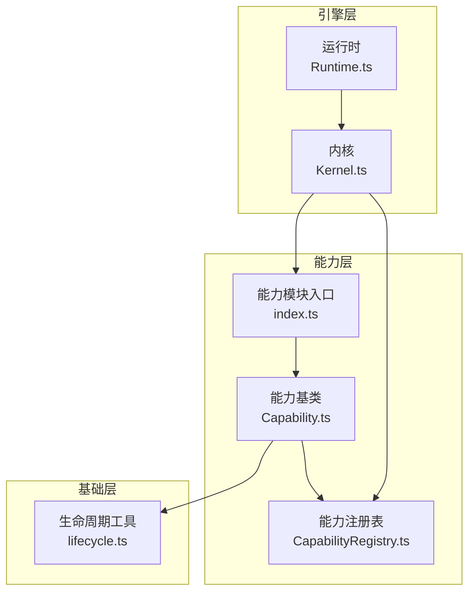
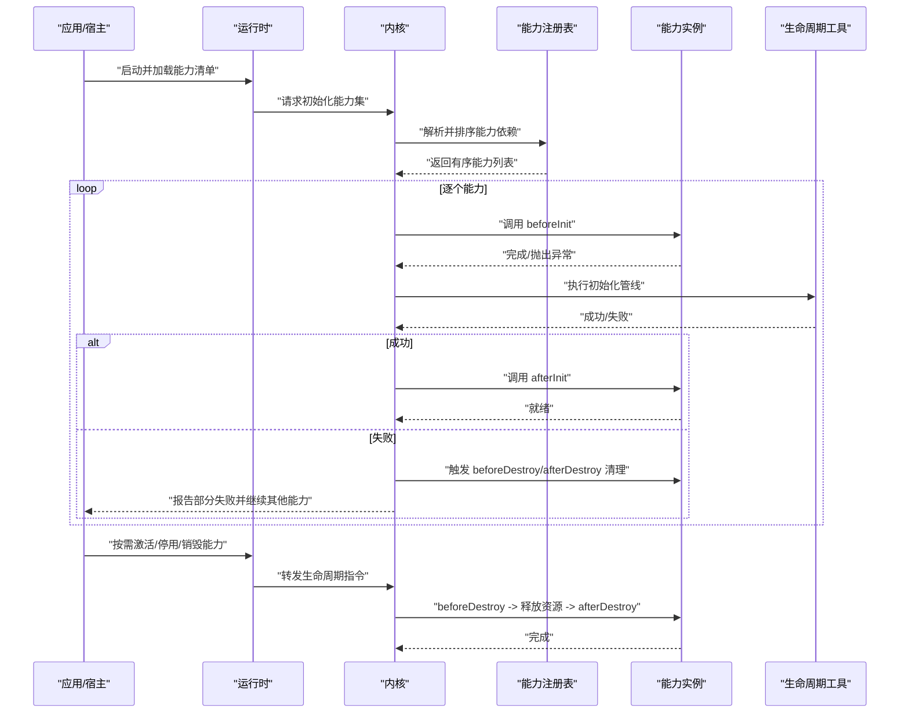
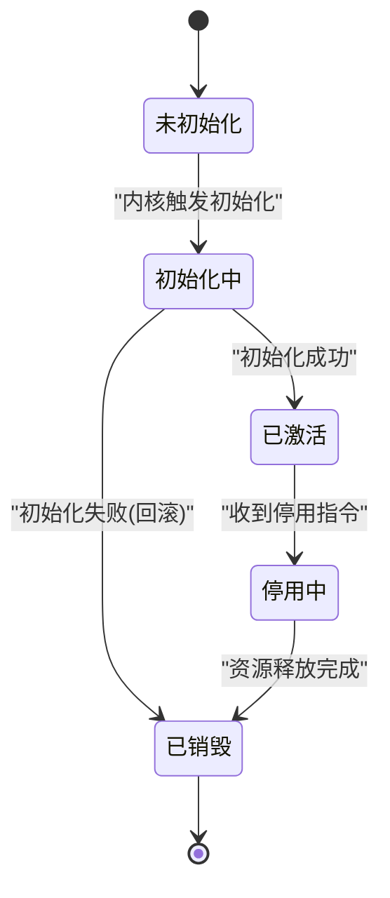
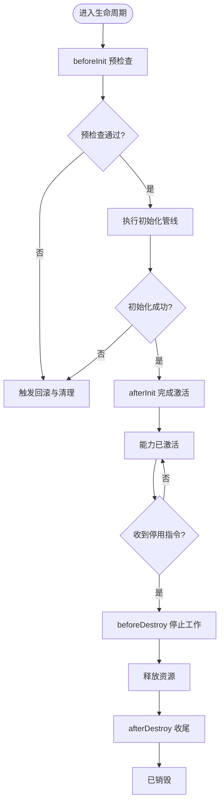
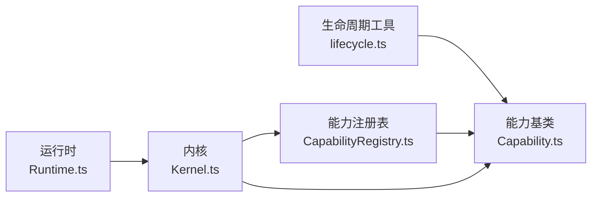

# 生命周期管理

<cite>
**本文引用的文件**   
- [engine/packages/capabilities/index.ts](file://engine/packages/capabilities/index.ts)
- [engine/packages/capabilities/Capability.ts](file://engine/packages/capabilities/Capability.ts)
- [engine/packages/engine/Kernel.ts](file://engine/packages/engine/Kernel.ts)
- [engine/packages/engine/Runtime.ts](file://engine/packages/engine/Runtime.ts)
- [engine/packages/foundation/lifecycle.ts](file://engine/packages/foundation/lifecycle.ts)
- [engine/packages/domain-layer/CapabilityRegistry.ts](file://engine/packages/domain-layer/CapabilityRegistry.ts)
- [engine/tests/capabilities.test.ts](file://engine/tests/capabilities.test.ts)
- [engine/tests/capability-registry.test.ts](file://engine/tests/capability-registry.test.ts)
</cite>

## 目录
1. [简介](#简介)
2. [项目结构](#项目结构)
3. [核心组件](#核心组件)
4. [架构总览](#架构总览)
5. [详细组件分析](#详细组件分析)
6. [依赖关系分析](#依赖关系分析)
7. [性能考虑](#性能考虑)
8. [故障排查指南](#故障排查指南)
9. [结论](#结论)
10. [附录](#附录)

## 简介
本文件面向KCoder的能力（Capability）生命周期管理，系统性阐述能力状态机、生命周期钩子、资源绑定与回收、并发安全与线程模型、异常处理与恢复策略、API与事件订阅机制、性能监控与统计，以及示例与调试技巧。目标是帮助开发者正确实现与集成自定义能力，确保在复杂运行时环境中具备可预测的生命周期行为与高可靠性。

## 项目结构
围绕能力生命周期，仓库中关键位置如下：
- 能力抽象与基础实现位于 engine/packages/capabilities 目录，提供能力基类、注册表与通用生命周期编排。
- 引擎内核位于 engine/packages/engine 目录，负责能力的加载、激活、停用与销毁流程编排。
- 领域层注册表位于 engine/packages/domain-layer，提供能力注册与发现。
- 测试用例位于 engine/tests，覆盖能力生命周期与注册表行为。

图表来源
- [engine/packages/capabilities/Capability.ts](file://engine/packages/capabilities/Capability.ts)
- [engine/packages/capabilities/index.ts](file://engine/packages/capabilities/index.ts)
- [engine/packages/domain-layer/CapabilityRegistry.ts](file://engine/packages/domain-layer/CapabilityRegistry.ts)
- [engine/packages/engine/Kernel.ts](file://engine/packages/engine/Kernel.ts)
- [engine/packages/engine/Runtime.ts](file://engine/packages/engine/Runtime.ts)
- [engine/packages/foundation/lifecycle.ts](file://engine/packages/foundation/lifecycle.ts)

章节来源
- [engine/packages/capabilities/index.ts](file://engine/packages/capabilities/index.ts)
- [engine/packages/capabilities/Capability.ts](file://engine/packages/capabilities/Capability.ts)
- [engine/packages/domain-layer/CapabilityRegistry.ts](file://engine/packages/domain-layer/CapabilityRegistry.ts)
- [engine/packages/engine/Kernel.ts](file://engine/packages/engine/Kernel.ts)
- [engine/packages/engine/Runtime.ts](file://engine/packages/engine/Runtime.ts)
- [engine/packages/foundation/lifecycle.ts](file://engine/packages/foundation/lifecycle.ts)

## 核心组件
- 能力基类：定义能力生命周期状态、钩子方法与资源持有者，提供统一的初始化、激活、停用、销毁语义。
- 能力注册表：维护能力声明、版本、依赖与实例化策略，支持按命名空间或标签进行查询与过滤。
- 内核：协调能力从“已注册”到“可用”的完整流程，包括前置校验、依赖解析、顺序启动与错误回滚。
- 运行时：对外暴露能力启停控制面，承载并发调度与上下文隔离。
- 生命周期工具：封装通用的钩子执行器、错误边界与清理管线，保证幂等与健壮性。

章节来源
- [engine/packages/capabilities/Capability.ts](file://engine/packages/capabilities/Capability.ts)
- [engine/packages/domain-layer/CapabilityRegistry.ts](file://engine/packages/domain-layer/CapabilityRegistry.ts)
- [engine/packages/engine/Kernel.ts](file://engine/packages/engine/Kernel.ts)
- [engine/packages/engine/Runtime.ts](file://engine/packages/engine/Runtime.ts)
- [engine/packages/foundation/lifecycle.ts](file://engine/packages/foundation/lifecycle.ts)

## 架构总览
下图展示能力从注册到销毁的关键路径与交互角色。

图表来源
- [engine/packages/engine/Kernel.ts](file://engine/packages/engine/Kernel.ts)
- [engine/packages/engine/Runtime.ts](file://engine/packages/engine/Runtime.ts)
- [engine/packages/domain-layer/CapabilityRegistry.ts](file://engine/packages/domain-layer/CapabilityRegistry.ts)
- [engine/packages/capabilities/Capability.ts](file://engine/packages/capabilities/Capability.ts)
- [engine/packages/foundation/lifecycle.ts](file://engine/packages/foundation/lifecycle.ts)

## 详细组件分析

### 能力状态机设计
- 状态集合
  - 未初始化：能力已注册但尚未开始初始化。
  - 初始化中：正在执行初始化阶段，可能包含多个步骤。
  - 已激活：能力已完成初始化并处于可用状态。
  - 停用中：正在执行停用流程，准备释放资源。
  - 已销毁：能力实例已被彻底清理，不可再使用。
- 转换条件与触发事件
  - 未初始化 → 初始化中：由内核在启动阶段触发，或在热加载场景下显式调用。
  - 初始化中 → 已激活：所有初始化步骤成功完成后进入。
  - 初始化中 → 已销毁：初始化过程中发生致命错误，触发回滚与清理。
  - 已激活 → 停用中：收到停用指令或系统关闭信号。
  - 停用中 → 已销毁：资源释放与后置清理完成。
- 幂等性与可重入
  - 所有状态转换需幂等；重复进入同一阶段应快速返回或跳过。
  - 对并发调用进行保护，避免竞态导致的状态不一致。

图表来源
- [engine/packages/capabilities/Capability.ts](file://engine/packages/capabilities/Capability.ts)
- [engine/packages/engine/Kernel.ts](file://engine/packages/engine/Kernel.ts)

章节来源
- [engine/packages/capabilities/Capability.ts](file://engine/packages/capabilities/Capability.ts)
- [engine/packages/engine/Kernel.ts](file://engine/packages/engine/Kernel.ts)

### 生命周期钩子与执行时机
- 钩子函数
  - beforeInit：用于预检查、依赖注入、上下文准备。
  - afterInit：用于注册服务、建立连接、预热缓存。
  - beforeDestroy：用于停止任务、断开外部依赖、保存状态。
  - afterDestroy：用于释放内存、关闭句柄、清理临时数据。
- 执行顺序与错误处理
  - 初始化阶段：beforeInit → 初始化管线 → afterInit。任一阶段失败将触发回滚与清理。
  - 销毁阶段：beforeDestroy → 资源释放 → afterDestroy。即使中间失败也需尽量完成后续清理。
- 钩子容错
  - 钩子内抛出的异常会被捕获并记录，不影响其他钩子的执行。
  - 支持超时与取消，防止长时间阻塞。

图表来源
- [engine/packages/foundation/lifecycle.ts](file://engine/packages/foundation/lifecycle.ts)
- [engine/packages/capabilities/Capability.ts](file://engine/packages/capabilities/Capability.ts)

章节来源
- [engine/packages/foundation/lifecycle.ts](file://engine/packages/foundation/lifecycle.ts)
- [engine/packages/capabilities/Capability.ts](file://engine/packages/capabilities/Capability.ts)

### 资源管理机制
- 内存分配
  - 能力应在 afterInit 中完成大对象分配，并在 beforeDestroy 中主动置空引用，辅助垃圾回收。
- 文件句柄
  - 打开的文件句柄需在 beforeDestroy 中关闭，afterDestroy 中确认句柄已释放。
- 网络连接
  - 连接池或长连接应在 afterInit 中建立，在 beforeDestroy 中优雅关闭，等待未完成请求完成后再退出。
- 资源绑定与追踪
  - 建议为每个能力维护资源清单，统一在销毁阶段遍历回收，避免遗漏。
- 资源泄漏防护
  - 使用作用域与自动清理机制，确保异常路径也能释放资源。

章节来源
- [engine/packages/capabilities/Capability.ts](file://engine/packages/capabilities/Capability.ts)
- [engine/packages/foundation/lifecycle.ts](file://engine/packages/foundation/lifecycle.ts)

### 并发安全与线程模型
- 状态同步
  - 能力内部状态变更需加锁或使用原子操作，避免多线程读写竞争。
- 锁机制
  - 细粒度锁优先，减少临界区范围；避免在持有锁时执行I/O。
- 死锁预防
  - 固定加锁顺序；禁止循环依赖；必要时引入超时与降级。
- 异步与事件驱动
  - 使用事件总线或消息队列解耦耗时操作，避免阻塞主线程。
- 上下文隔离
  - 不同能力间共享状态需明确边界，建议使用只读视图或拷贝。

章节来源
- [engine/packages/capabilities/Capability.ts](file://engine/packages/capabilities/Capability.ts)
- [engine/packages/engine/Kernel.ts](file://engine/packages/engine/Kernel.ts)

### 异常处理与恢复策略
- 部分失败处理
  - 单个能力初始化失败不应阻止其他能力启动；内核应记录错误并继续。
- 状态清理
  - 失败路径必须执行必要的清理，确保不留下半初始化状态。
- 资源回收
  - 无论成功或失败，均需在 finally 或等效结构中释放资源。
- 重试与退避
  - 对瞬时错误（如网络抖动）支持有限次重试与指数退避。
- 可观测性
  - 记录异常堆栈、上下文信息与指标，便于定位问题。

章节来源
- [engine/packages/engine/Kernel.ts](file://engine/packages/engine/Kernel.ts)
- [engine/packages/foundation/lifecycle.ts](file://engine/packages/foundation/lifecycle.ts)

### API 文档与事件订阅
- 能力API
  - 初始化：提供统一的初始化接口，内部编排 beforeInit、初始化管线、afterInit。
  - 激活/停用：提供显式的激活与停用方法，供运行时或上层控制器调用。
  - 销毁：提供销毁接口，确保资源完全释放。
- 事件订阅
  - 能力可发布生命周期事件（如 initialized、destroyed），供监听者消费。
  - 事件总线应具备去重、超时与错误隔离能力。
- 配置与元数据
  - 能力需提供元数据（名称、版本、依赖、描述），用于注册表管理与可视化。

章节来源
- [engine/packages/capabilities/Capability.ts](file://engine/packages/capabilities/Capability.ts)
- [engine/packages/domain-layer/CapabilityRegistry.ts](file://engine/packages/domain-layer/CapabilityRegistry.ts)

### 性能监控与资源使用统计
- 指标采集
  - 记录各阶段耗时、错误率、资源占用峰值。
- 采样与聚合
  - 采用采样策略降低开销，定期聚合上报。
- 告警与阈值
  - 设置阈值触发告警，如初始化超时、内存增长异常。
- 诊断信息
  - 输出能力快照（状态、资源清单、最近错误），便于排障。

章节来源
- [engine/packages/foundation/lifecycle.ts](file://engine/packages/foundation/lifecycle.ts)
- [engine/packages/engine/Kernel.ts](file://engine/packages/engine/Kernel.ts)

### 完整生命周期示例与调试技巧
- 示例流程
  - 注册能力 → 内核初始化 → 依次执行钩子 → 能力就绪 → 接收业务请求 → 收到停用指令 → 执行销毁钩子 → 能力销毁。
- 调试技巧
  - 启用详细日志，打印每个钩子进入与退出时间戳。
  - 使用断点与堆栈快照定位卡住或泄漏的资源。
  - 构造最小复现用例，隔离第三方依赖影响。
- 验证手段
  - 单元测试覆盖正常与异常路径，模拟超时与失败。
  - 集成测试验证多能力并发下的稳定性。

章节来源
- [engine/tests/capabilities.test.ts](file://engine/tests/capabilities.test.ts)
- [engine/tests/capability-registry.test.ts](file://engine/tests/capability-registry.test.ts)

## 依赖关系分析
- 直接依赖
  - 能力基类依赖生命周期工具与注册表。
  - 内核依赖注册表与能力基类，编排生命周期。
  - 运行时依赖内核，暴露控制面。
- 间接依赖
  - 能力可能依赖外部服务（数据库、网络、文件系统），这些依赖应在初始化阶段建立并在销毁阶段释放。
- 潜在循环依赖
  - 应避免能力之间相互强依赖，必要时通过事件或接口解耦。

图表来源
- [engine/packages/foundation/lifecycle.ts](file://engine/packages/foundation/lifecycle.ts)
- [engine/packages/capabilities/Capability.ts](file://engine/packages/capabilities/Capability.ts)
- [engine/packages/domain-layer/CapabilityRegistry.ts](file://engine/packages/domain-layer/CapabilityRegistry.ts)
- [engine/packages/engine/Kernel.ts](file://engine/packages/engine/Kernel.ts)
- [engine/packages/engine/Runtime.ts](file://engine/packages/engine/Runtime.ts)

章节来源
- [engine/packages/capabilities/Capability.ts](file://engine/packages/capabilities/Capability.ts)
- [engine/packages/domain-layer/CapabilityRegistry.ts](file://engine/packages/domain-layer/CapabilityRegistry.ts)
- [engine/packages/engine/Kernel.ts](file://engine/packages/engine/Kernel.ts)
- [engine/packages/engine/Runtime.ts](file://engine/packages/engine/Runtime.ts)
- [engine/packages/foundation/lifecycle.ts](file://engine/packages/foundation/lifecycle.ts)

## 性能考虑
- 初始化批量化
  - 批量初始化能力以减少串行等待，同时限制并发度避免过载。
- 懒加载与按需激活
  - 对重型能力采用懒加载，仅在需要时激活。
- 资源复用
  - 连接池、线程池、缓存等跨能力复用，降低创建成本。
- 背压与限流
  - 对上游输入进行限流，防止突发流量导致资源耗尽。
- 监控与调优
  - 基于指标持续优化，关注热点路径与瓶颈点。

[本节为通用指导，无需特定文件来源]

## 故障排查指南
- 常见问题
  - 初始化超时：检查依赖服务可用性、网络延迟与资源配额。
  - 资源泄漏：确认所有打开的句柄与连接均在销毁阶段关闭。
  - 死锁：审查加锁顺序与临界区长度，移除不必要的阻塞。
- 定位方法
  - 查看能力快照与最近错误日志。
  - 使用性能剖析工具识别CPU与内存热点。
  - 复现最小用例，逐步缩小范围。
- 恢复策略
  - 重启失败能力，保留上下文以便恢复。
  - 降级非关键功能，保障核心链路稳定。

章节来源
- [engine/packages/engine/Kernel.ts](file://engine/packages/engine/Kernel.ts)
- [engine/packages/foundation/lifecycle.ts](file://engine/packages/foundation/lifecycle.ts)

## 结论
通过明确的状态机、严格的钩子编排、完善的资源管理与并发安全策略，KCoder的能力生命周期管理能够在复杂环境下保持稳定与高效。结合可观测性与完善的测试覆盖，开发者可以快速定位与修复问题，持续提升系统的可靠性与可维护性。

[本节为总结，无需特定文件来源]

## 附录
- 术语
  - 能力：具有明确职责与边界的模块化功能单元。
  - 钩子：在生命周期关键节点执行的回调函数。
  - 注册表：管理能力元数据与实例化的中央目录。
- 参考
  - 相关测试用例可作为最佳实践参考，覆盖常见场景与边界条件。

章节来源
- [engine/tests/capabilities.test.ts](file://engine/tests/capabilities.test.ts)
- [engine/tests/capability-registry.test.ts](file://engine/tests/capability-registry.test.ts)