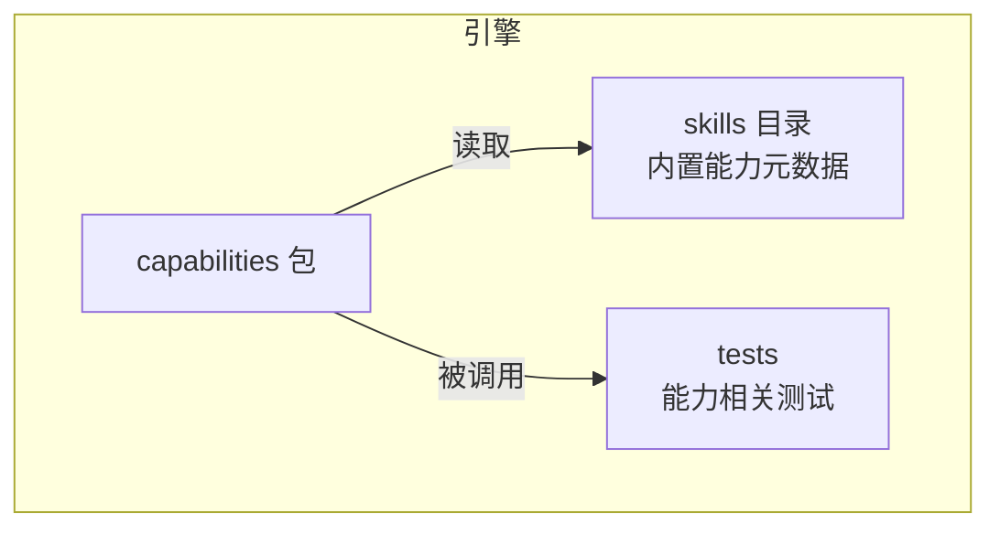
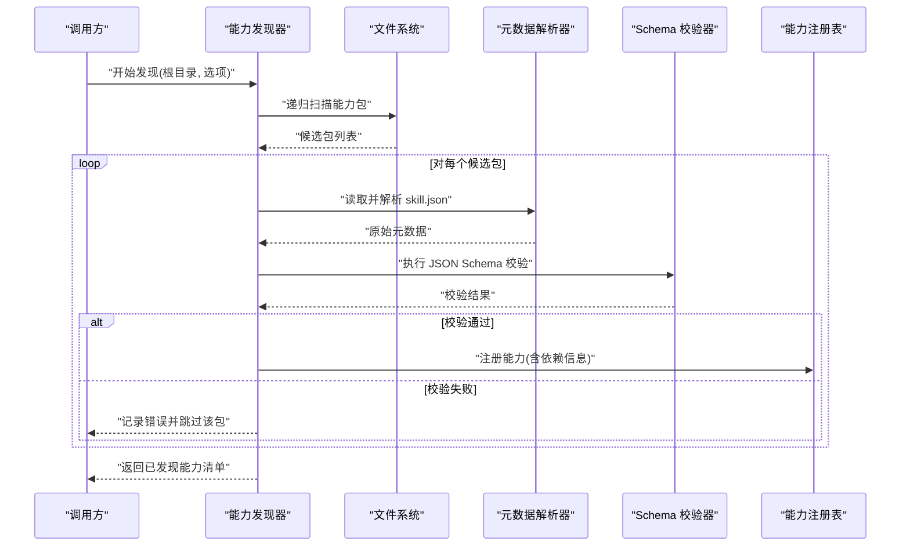
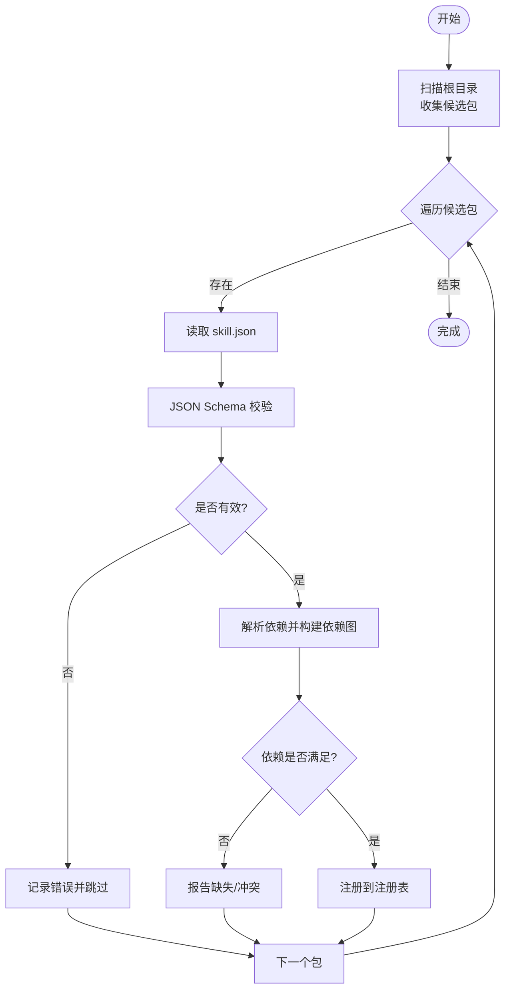
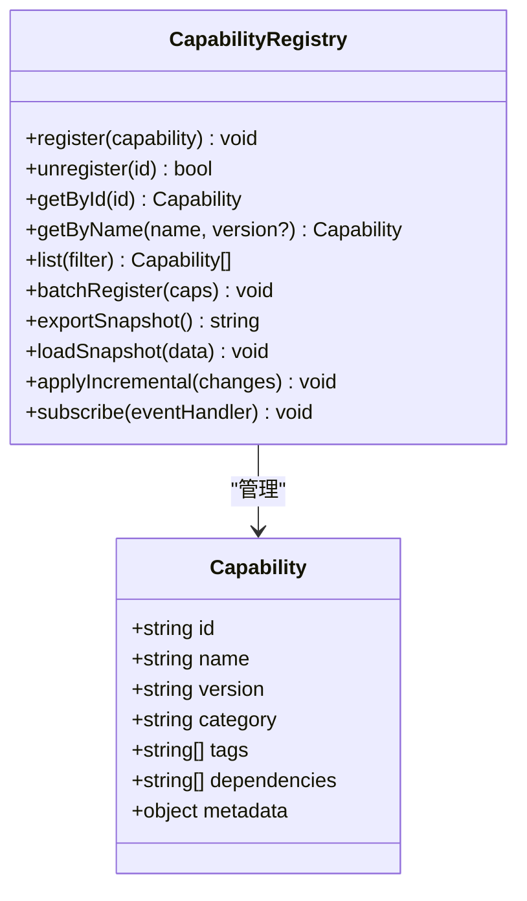
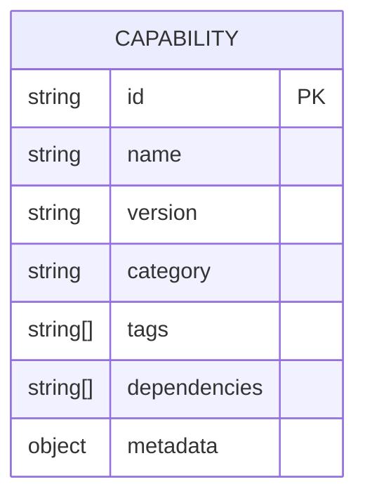
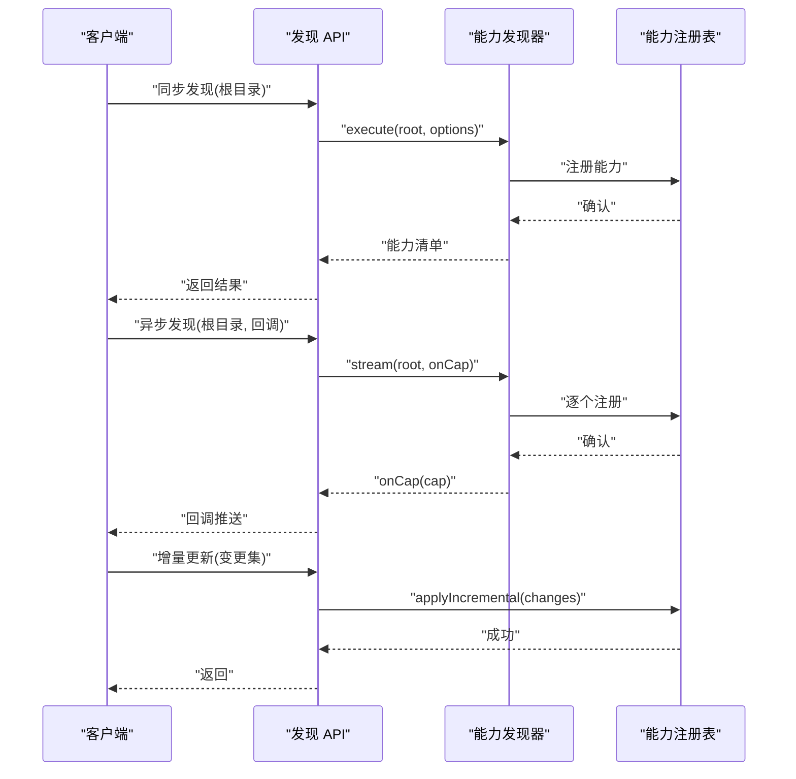
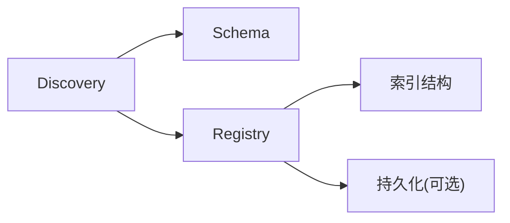

# 能力发现机制

<cite>
**本文引用的文件**   
- [engine/packages/capabilities/src/index.ts](file://engine/packages/capabilities/src/index.ts)
- [engine/packages/capabilities/src/registry.ts](file://engine/packages/capabilities/src/registry.ts)
- [engine/packages/capabilities/src/discovery.ts](file://engine/packages/capabilities/src/discovery.ts)
- [engine/packages/capabilities/src/schema.ts](file://engine/packages/capabilities/src/schema.ts)
- [engine/skills/code-review/skill.json](file://engine/skills/code-review/skill.json)
- [engine/skills/debugging/skill.json](file://engine/skills/debugging/skill.json)
- [engine/skills/tdd/skill.json](file://engine/skills/tdd/skill.json)
- [engine/tests/capability-registry.test.ts](file://engine/tests/capability-registry.test.ts)
- [engine/tests/capabilities.test.ts](file://engine/tests/capabilities.test.ts)
</cite>

## 目录
1. [简介](#简介)
2. [项目结构](#项目结构)
3. [核心组件](#核心组件)
4. [架构总览](#架构总览)
5. [详细组件分析](#详细组件分析)
6. [依赖关系分析](#依赖关系分析)
7. [性能考虑](#性能考虑)
8. [故障排查指南](#故障排查指南)
9. [结论](#结论)
10. [附录](#附录)

## 简介
本技术文档聚焦于 KCoder 的“能力发现机制”，系统性阐述能力的扫描与发现流程（文件系统扫描、元数据解析、依赖关系分析）、能力注册表的实现（内存存储、持久化、索引优化）、能力描述格式规范（JSON Schema、必填字段、可选配置）、分类与标签体系（预定义类别、自定义标签、搜索过滤），以及对外暴露的发现 API（同步/异步、批量、增量更新）。同时提供性能优化策略与缓存机制，并给出最佳实践与示例路径。

## 项目结构
围绕能力发现的核心代码位于 engine 子仓库中：
- capabilities 包：封装能力发现、注册表、Schema 校验等核心逻辑
- skills 目录：内置能力的元数据样例（skill.json）
- tests：覆盖能力注册表与发现流程的测试用例

**图表来源**
- [engine/packages/capabilities/src/index.ts](file://engine/packages/capabilities/src/index.ts)
- [engine/packages/capabilities/src/registry.ts](file://engine/packages/capabilities/src/registry.ts)
- [engine/packages/capabilities/src/discovery.ts](file://engine/packages/capabilities/src/discovery.ts)
- [engine/packages/capabilities/src/schema.ts](file://engine/packages/capabilities/src/schema.ts)
- [engine/skills/code-review/skill.json](file://engine/skills/code-review/skill.json)
- [engine/tests/capability-registry.test.ts](file://engine/tests/capability-registry.test.ts)
- [engine/tests/capabilities.test.ts](file://engine/tests/capabilities.test.ts)

**章节来源**
- [engine/packages/capabilities/src/index.ts](file://engine/packages/capabilities/src/index.ts)
- [engine/packages/capabilities/src/registry.ts](file://engine/packages/capabilities/src/registry.ts)
- [engine/packages/capabilities/src/discovery.ts](file://engine/packages/capabilities/src/discovery.ts)
- [engine/packages/capabilities/src/schema.ts](file://engine/packages/capabilities/src/schema.ts)
- [engine/skills/code-review/skill.json](file://engine/skills/code-review/skill.json)
- [engine/tests/capability-registry.test.ts](file://engine/tests/capability-registry.test.ts)
- [engine/tests/capabilities.test.ts](file://engine/tests/capabilities.test.ts)

## 核心组件
- 能力发现器（Discovery）
  - 职责：遍历能力源目录，定位每个能力的元数据文件，进行解析与校验，构建能力清单。
  - 关键流程：文件系统扫描 → 元数据加载 → JSON Schema 校验 → 依赖关系分析 → 产出能力条目。
- 能力注册表（Registry）
  - 职责：维护已发现的能力集合，提供增删改查、按条件检索、版本选择、批量操作与增量更新接口。
  - 存储：内存为主，支持持久化快照与增量合并；内部维护多索引以加速查询。
- 能力描述 Schema（Schema）
  - 职责：定义能力元数据的 JSON Schema，约束必填字段、类型与取值范围，确保一致性。
- 能力样例（Skills）
  - 职责：提供一组内置能力及其 skill.json 元数据，用于演示与验证发现流程。

**章节来源**
- [engine/packages/capabilities/src/discovery.ts](file://engine/packages/capabilities/src/discovery.ts)
- [engine/packages/capabilities/src/registry.ts](file://engine/packages/capabilities/src/registry.ts)
- [engine/packages/capabilities/src/schema.ts](file://engine/packages/capabilities/src/schema.ts)
- [engine/skills/code-review/skill.json](file://engine/skills/code-review/skill.json)
- [engine/skills/debugging/skill.json](file://engine/skills/debugging/skill.json)
- [engine/skills/tdd/skill.json](file://engine/skills/tdd/skill.json)

## 架构总览
能力发现的整体流程如下：
- 扫描阶段：从指定根目录递归扫描能力包（通常包含 skill.json 的目录）。
- 解析阶段：读取并解析每个包的 skill.json，执行 JSON Schema 校验。
- 依赖分析：根据元数据中的依赖声明，构建能力间的依赖图，检测循环依赖与缺失依赖。
- 注册阶段：将合法能力注册到注册表，建立索引（名称、版本、标签、分类等）。
- 查询阶段：提供同步/异步查询、过滤、分页、批量与增量更新接口。

**图表来源**
- [engine/packages/capabilities/src/discovery.ts](file://engine/packages/capabilities/src/discovery.ts)
- [engine/packages/capabilities/src/schema.ts](file://engine/packages/capabilities/src/schema.ts)
- [engine/packages/capabilities/src/registry.ts](file://engine/packages/capabilities/src/registry.ts)

## 详细组件分析

### 能力发现器（Discovery）
- 扫描策略
  - 基于目录约定：包含 skill.json 的目录视为一个能力包。
  - 可配置忽略规则与并发度，提升大目录扫描性能。
- 元数据解析
  - 读取 skill.json，解析为结构化对象。
  - 支持相对路径解析与资源引用（如说明文档、入口脚本等）。
- 依赖关系分析
  - 依据元数据中的依赖声明，构建有向无环图（DAG）。
  - 检测循环依赖与缺失依赖，输出诊断信息。
- 输出
  - 生成能力条目数组，包含标识、版本、分类、标签、依赖、状态等。

**图表来源**
- [engine/packages/capabilities/src/discovery.ts](file://engine/packages/capabilities/src/discovery.ts)
- [engine/packages/capabilities/src/schema.ts](file://engine/packages/capabilities/src/schema.ts)
- [engine/packages/capabilities/src/registry.ts](file://engine/packages/capabilities/src/registry.ts)

**章节来源**
- [engine/packages/capabilities/src/discovery.ts](file://engine/packages/capabilities/src/discovery.ts)
- [engine/packages/capabilities/src/schema.ts](file://engine/packages/capabilities/src/schema.ts)
- [engine/packages/capabilities/src/registry.ts](file://engine/packages/capabilities/src/registry.ts)

### 能力注册表（Registry）
- 内存存储
  - 使用高效数据结构维护能力映射（按 id、名称、版本等键）。
  - 维护多索引：名称索引、版本索引、标签索引、分类索引、依赖反向索引。
- 持久化机制
  - 支持导出快照（全量）与增量变更日志。
  - 启动时可选择加载快照或回放增量日志恢复状态。
- 索引优化
  - 针对高频查询（按标签/分类/名称前缀）建立倒排索引。
  - 延迟计算与增量更新，避免全量重建。
- 并发与一致性
  - 读写分离或锁粒度控制，保证高并发下的吞吐与一致性。
- 接口概览
  - 同步：注册、删除、查询、过滤、批量注册/删除。
  - 异步：流式注册、增量合并、后台索引重建。
  - 事件：能力变更事件（新增、更新、删除）供订阅者消费。

**图表来源**
- [engine/packages/capabilities/src/registry.ts](file://engine/packages/capabilities/src/registry.ts)

**章节来源**
- [engine/packages/capabilities/src/registry.ts](file://engine/packages/capabilities/src/registry.ts)

### 能力描述格式规范（Schema）
- JSON Schema 定义
  - 约束能力元数据的结构与类型，确保所有能力具备一致的可发现性与可组合性。
- 必填字段
  - 标识（id）、名称（name）、版本（version）、分类（category）、标签（tags）、依赖（dependencies）、元数据（metadata）等。
- 可选配置
  - 扩展字段、运行时参数、权限要求、资源路径等。
- 校验行为
  - 不满足必填或类型错误的元数据将被拒绝，并附带错误位置与提示。

**图表来源**
- [engine/packages/capabilities/src/schema.ts](file://engine/packages/capabilities/src/schema.ts)
- [engine/skills/code-review/skill.json](file://engine/skills/code-review/skill.json)
- [engine/skills/debugging/skill.json](file://engine/skills/debugging/skill.json)
- [engine/skills/tdd/skill.json](file://engine/skills/tdd/skill.json)

**章节来源**
- [engine/packages/capabilities/src/schema.ts](file://engine/packages/capabilities/src/schema.ts)
- [engine/skills/code-review/skill.json](file://engine/skills/code-review/skill.json)
- [engine/skills/debugging/skill.json](file://engine/skills/debugging/skill.json)
- [engine/skills/tdd/skill.json](file://engine/skills/tdd/skill.json)

### 能力分类与标签系统
- 预定义类别
  - 例如：代码审查、调试、TDD、规划、重构、安全审查、Web 等。
- 自定义标签
  - 允许在能力元数据中附加任意标签，便于细粒度筛选与聚合。
- 搜索与过滤
  - 支持按名称、版本、分类、标签、依赖等进行组合过滤。
  - 支持模糊匹配、前缀匹配与正则表达式（视实现而定）。

**章节来源**
- [engine/skills/code-review/skill.json](file://engine/skills/code-review/skill.json)
- [engine/skills/debugging/skill.json](file://engine/skills/debugging/skill.json)
- [engine/skills/tdd/skill.json](file://engine/skills/tdd/skill.json)
- [engine/packages/capabilities/src/registry.ts](file://engine/packages/capabilities/src/registry.ts)

### 能力发现的 API 接口
- 同步发现
  - 一次性扫描并返回能力清单，适合小范围或开发环境。
- 异步发现
  - 支持流式回调或 Promise 序列，适合大规模目录扫描与长耗时任务。
- 批量操作
  - 批量注册/删除能力，减少多次 I/O 与索引重建开销。
- 增量更新
  - 监听文件系统变更或接收外部变更事件，仅处理受影响的能力包。
- 查询接口
  - 提供按 id、名称、版本、分类、标签、依赖等条件的查询与分页。

**图表来源**
- [engine/packages/capabilities/src/discovery.ts](file://engine/packages/capabilities/src/discovery.ts)
- [engine/packages/capabilities/src/registry.ts](file://engine/packages/capabilities/src/registry.ts)

**章节来源**
- [engine/packages/capabilities/src/discovery.ts](file://engine/packages/capabilities/src/discovery.ts)
- [engine/packages/capabilities/src/registry.ts](file://engine/packages/capabilities/src/registry.ts)

## 依赖关系分析
- 组件耦合
  - Discovery 依赖 Schema 校验与 Registry 注册。
  - Registry 依赖多索引结构与持久化模块（若启用）。
- 外部依赖
  - 文件系统访问、JSON 解析、Schema 校验库。
- 潜在循环依赖
  - 应避免 Discovery 与 Registry 之间的直接循环调用，采用事件或回调解耦。
- 集成点
  - 与上层引擎或服务层通过 API 暴露发现与查询能力。

**图表来源**
- [engine/packages/capabilities/src/discovery.ts](file://engine/packages/capabilities/src/discovery.ts)
- [engine/packages/capabilities/src/schema.ts](file://engine/packages/capabilities/src/schema.ts)
- [engine/packages/capabilities/src/registry.ts](file://engine/packages/capabilities/src/registry.ts)

**章节来源**
- [engine/packages/capabilities/src/discovery.ts](file://engine/packages/capabilities/src/discovery.ts)
- [engine/packages/capabilities/src/schema.ts](file://engine/packages/capabilities/src/schema.ts)
- [engine/packages/capabilities/src/registry.ts](file://engine/packages/capabilities/src/registry.ts)

## 性能考虑
- 扫描优化
  - 并行扫描目录与文件，限制最大并发数以避免 IO 风暴。
  - 使用忽略规则排除无关目录与文件。
- 解析与校验
  - 懒加载与缓存已解析的 skill.json，避免重复 I/O。
  - 增量校验：仅对变更包重新校验。
- 索引优化
  - 增量更新索引，避免全量重建。
  - 使用高效的倒排索引与哈希表。
- 缓存机制
  - 内存缓存能力清单与查询结果，设置过期策略与失效触发。
  - 持久化快照定期落盘，缩短冷启动时间。
- 批处理与背压
  - 大批量注册时使用批处理与背压控制，防止内存峰值过高。

[本节为通用性能建议，无需特定文件来源]

## 故障排查指南
- 常见错误
  - 元数据缺失或非法：检查 skill.json 是否存在且符合 JSON Schema。
  - 依赖缺失或循环：查看依赖分析报告，修复缺失或解除循环。
  - 权限问题：确认对能力目录的读权限。
- 日志与诊断
  - 开启详细日志，记录扫描路径、解析错误、校验失败详情。
  - 导出注册表快照与增量日志，辅助定位问题。
- 复现与回归
  - 使用测试用例快速复现问题，验证修复效果。

**章节来源**
- [engine/tests/capability-registry.test.ts](file://engine/tests/capability-registry.test.ts)
- [engine/tests/capabilities.test.ts](file://engine/tests/capabilities.test.ts)

## 结论
KCoder 的能力发现机制通过标准化的元数据与严格的 Schema 校验，结合高效的注册表与索引优化，实现了稳定、可扩展且高性能的能力管理与发现。配合分类与标签体系，用户可按需组织与检索能力；通过同步/异步与增量更新 API，满足不同场景的性能与可用性需求。

[本节为总结性内容，无需特定文件来源]

## 附录
- 示例与最佳实践
  - 参考内置能力样例的 skill.json，遵循命名与版本规范，合理设置分类与标签。
  - 在大型项目中启用增量更新与快照持久化，降低启动时间与扫描开销。
  - 使用批量注册接口减少频繁 I/O，结合背压控制保障稳定性。
- 参考路径
  - 能力发现实现：[engine/packages/capabilities/src/discovery.ts](file://engine/packages/capabilities/src/discovery.ts)
  - 能力注册表实现：[engine/packages/capabilities/src/registry.ts](file://engine/packages/capabilities/src/registry.ts)
  - 能力描述 Schema：[engine/packages/capabilities/src/schema.ts](file://engine/packages/capabilities/src/schema.ts)
  - 内置能力样例：
    - [engine/skills/code-review/skill.json](file://engine/skills/code-review/skill.json)
    - [engine/skills/debugging/skill.json](file://engine/skills/debugging/skill.json)
    - [engine/skills/tdd/skill.json](file://engine/skills/tdd/skill.json)
  - 测试用例：
    - [engine/tests/capability-registry.test.ts](file://engine/tests/capability-registry.test.ts)
    - [engine/tests/capabilities.test.ts](file://engine/tests/capabilities.test.ts)