# 能力注册中心

<cite>
**本文引用的文件**   
- [engine/packages/capabilities/src/index.ts](file://engine/packages/capabilities/src/index.ts)
- [engine/packages/capabilities/src/registry.ts](file://engine/packages/capabilities/src/registry.ts)
- [engine/packages/capabilities/src/loader.ts](file://engine/packages/capabilities/src/loader.ts)
- [engine/packages/capabilities/src/discovery.ts](file://engine/packages/capabilities/src/discovery.ts)
- [engine/packages/capabilities/src/versioning.ts](file://engine/packages/capabilities/src/versioning.ts)
- [engine/packages/capabilities/src/compatibility.ts](file://engine/packages/capabilities/src/compatibility.ts)
- [engine/packages/capabilities/src/lifecycle.ts](file://engine/packages/capabilities/src/lifecycle.ts)
- [engine/packages/capabilities/src/security.ts](file://engine/packages/capabilities/src/security.ts)
- [engine/packages/capabilities/src/marketplace.ts](file://engine/packages/capabilities/src/marketplace.ts)
- [engine/skills/code-review/skill.json](file://engine/skills/code-review/skill.json)
- [engine/skills/debugging/skill.json](file://engine/skills/debugging/skill.json)
- [engine/skills/tdd/skill.json](file://engine/skills/tdd/skill.json)
- [engine/tests/capability-registry.test.ts](file://engine/tests/capability-registry.test.ts)
- [engine/tests/capabilities.test.ts](file://engine/tests/capabilities.test.ts)
- [engine/tests/plugin-host.test.ts](file://engine/tests/plugin-host.test.ts)
- [engine/tests/marketplace.test.ts](file://engine/tests/marketplace.test.ts)
</cite>

## 目录
1. [简介](#简介)
2. [项目结构](#项目结构)
3. [核心组件](#核心组件)
4. [架构总览](#架构总览)
5. [详细组件分析](#详细组件分析)
6. [依赖关系分析](#依赖关系分析)
7. [性能考量](#性能考量)
8. [故障排查指南](#故障排查指南)
9. [结论](#结论)
10. [附录](#附录)

## 简介
本技术文档围绕“能力注册中心”展开，系统性阐述能力发现、加载与注册机制；动态加载（含热重载、版本管理、依赖解析）的实现思路；能力版本管理策略（向后兼容、升级迁移、回滚）；兼容性检查（接口版本检测、功能特性验证、环境依赖检查）；能力生命周期管理（初始化、激活、停用、销毁）；能力间依赖与冲突解决；能力开发规范与测试方法；注册中心API与使用示例；安全沙箱与权限控制；以及能力市场/插件商店的集成方案。

## 项目结构
能力注册中心位于 engine/packages/capabilities 包中，围绕“发现-加载-注册-生命周期-兼容性-安全-市场”等职责进行模块化拆分。技能清单位于 engine/skills 下，作为能力的元数据样例。

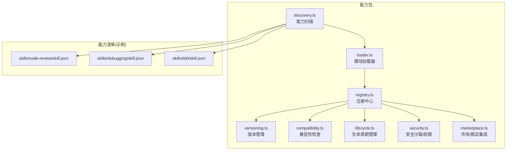

图表来源
- [engine/packages/capabilities/src/discovery.ts](file://engine/packages/capabilities/src/discovery.ts)
- [engine/packages/capabilities/src/loader.ts](file://engine/packages/capabilities/src/loader.ts)
- [engine/packages/capabilities/src/registry.ts](file://engine/packages/capabilities/src/registry.ts)
- [engine/packages/capabilities/src/versioning.ts](file://engine/packages/capabilities/src/versioning.ts)
- [engine/packages/capabilities/src/compatibility.ts](file://engine/packages/capabilities/src/compatibility.ts)
- [engine/packages/capabilities/src/lifecycle.ts](file://engine/packages/capabilities/src/lifecycle.ts)
- [engine/packages/capabilities/src/security.ts](file://engine/packages/capabilities/src/security.ts)
- [engine/packages/capabilities/src/marketplace.ts](file://engine/packages/capabilities/src/marketplace.ts)
- [engine/skills/code-review/skill.json](file://engine/skills/code-review/skill.json)
- [engine/skills/debugging/skill.json](file://engine/skills/debugging/skill.json)
- [engine/skills/tdd/skill.json](file://engine/skills/tdd/skill.json)

章节来源
- [engine/packages/capabilities/src/index.ts](file://engine/packages/capabilities/src/index.ts)
- [engine/packages/capabilities/src/registry.ts](file://engine/packages/capabilities/src/registry.ts)
- [engine/packages/capabilities/src/loader.ts](file://engine/packages/capabilities/src/loader.ts)
- [engine/packages/capabilities/src/discovery.ts](file://engine/packages/capabilities/src/discovery.ts)
- [engine/packages/capabilities/src/versioning.ts](file://engine/packages/capabilities/src/versioning.ts)
- [engine/packages/capabilities/src/compatibility.ts](file://engine/packages/capabilities/src/compatibility.ts)
- [engine/packages/capabilities/src/lifecycle.ts](file://engine/packages/capabilities/src/lifecycle.ts)
- [engine/packages/capabilities/src/security.ts](file://engine/packages/capabilities/src/security.ts)
- [engine/packages/capabilities/src/marketplace.ts](file://engine/packages/capabilities/src/marketplace.ts)
- [engine/skills/code-review/skill.json](file://engine/skills/code-review/skill.json)
- [engine/skills/debugging/skill.json](file://engine/skills/debugging/skill.json)
- [engine/skills/tdd/skill.json](file://engine/skills/tdd/skill.json)

## 核心组件
- 能力发现：负责扫描能力清单与资源，产出候选能力集合。
- 模块加载器：按策略加载能力模块，支持按需与预取，提供缓存与失效策略。
- 注册中心：维护能力实例、版本、状态、依赖图与事件总线，对外暴露注册/查询/卸载等API。
- 版本管理：解析能力版本、计算兼容区间、执行升级/回滚流程。
- 兼容性检查：校验接口版本、能力特性与环境依赖是否满足。
- 生命周期管理：统一编排初始化、激活、停用、销毁等阶段钩子。
- 安全沙箱：隔离能力运行上下文，实施最小权限与审计。
- 市场集成：对接能力市场/插件商店，实现拉取、安装、更新与卸载。

章节来源
- [engine/packages/capabilities/src/registry.ts](file://engine/packages/capabilities/src/registry.ts)
- [engine/packages/capabilities/src/loader.ts](file://engine/packages/capabilities/src/loader.ts)
- [engine/packages/capabilities/src/discovery.ts](file://engine/packages/capabilities/src/discovery.ts)
- [engine/packages/capabilities/src/versioning.ts](file://engine/packages/capabilities/src/versioning.ts)
- [engine/packages/capabilities/src/compatibility.ts](file://engine/packages/capabilities/src/compatibility.ts)
- [engine/packages/capabilities/src/lifecycle.ts](file://engine/packages/capabilities/src/lifecycle.ts)
- [engine/packages/capabilities/src/security.ts](file://engine/packages/capabilities/src/security.ts)
- [engine/packages/capabilities/src/marketplace.ts](file://engine/packages/capabilities/src/marketplace.ts)

## 架构总览
能力注册中心采用分层与事件驱动结合的设计：发现层产出候选项，加载层完成模块装载，注册中心作为中枢协调版本、兼容性与生命周期，并通过安全沙箱约束能力行为。市场层提供外部扩展入口。

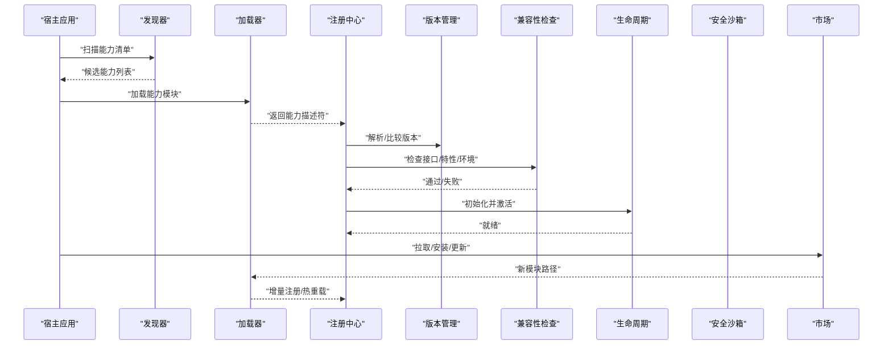

图表来源
- [engine/packages/capabilities/src/discovery.ts](file://engine/packages/capabilities/src/discovery.ts)
- [engine/packages/capabilities/src/loader.ts](file://engine/packages/capabilities/src/loader.ts)
- [engine/packages/capabilities/src/registry.ts](file://engine/packages/capabilities/src/registry.ts)
- [engine/packages/capabilities/src/versioning.ts](file://engine/packages/capabilities/src/versioning.ts)
- [engine/packages/capabilities/src/compatibility.ts](file://engine/packages/capabilities/src/compatibility.ts)
- [engine/packages/capabilities/src/lifecycle.ts](file://engine/packages/capabilities/src/lifecycle.ts)
- [engine/packages/capabilities/src/security.ts](file://engine/packages/capabilities/src/security.ts)
- [engine/packages/capabilities/src/marketplace.ts](file://engine/packages/capabilities/src/marketplace.ts)

## 详细组件分析

### 能力发现机制
- 扫描范围：基于能力清单目录与约定式命名规则，收集能力元数据与资源索引。
- 去重与合并：按能力标识与版本进行去重，合并多来源清单。
- 输出产物：标准化后的候选能力集合，供后续加载与注册。

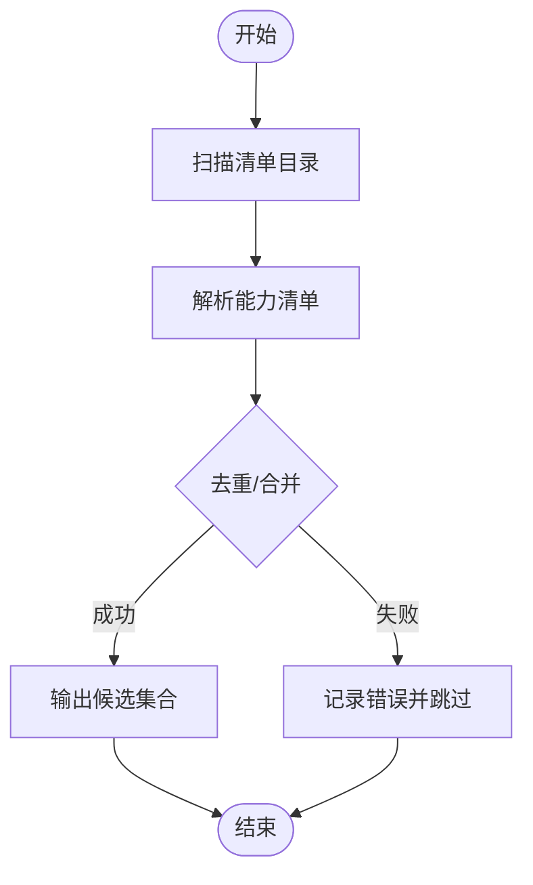

图表来源
- [engine/packages/capabilities/src/discovery.ts](file://engine/packages/capabilities/src/discovery.ts)

章节来源
- [engine/packages/capabilities/src/discovery.ts](file://engine/packages/capabilities/src/discovery.ts)
- [engine/skills/code-review/skill.json](file://engine/skills/code-review/skill.json)
- [engine/skills/debugging/skill.json](file://engine/skills/debugging/skill.json)
- [engine/skills/tdd/skill.json](file://engine/skills/tdd/skill.json)

### 动态加载与热重载
- 加载策略：支持同步/异步加载、按需加载与预取，内置缓存键由能力标识+版本组成。
- 热重载：监听变更事件，对受影响能力执行增量卸载与重新注册，保持服务连续性。
- 依赖解析：基于声明式依赖图进行拓扑排序，确保加载顺序正确。

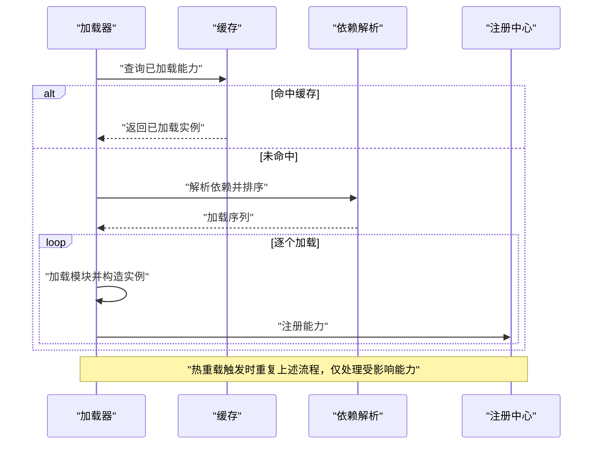

图表来源
- [engine/packages/capabilities/src/loader.ts](file://engine/packages/capabilities/src/loader.ts)
- [engine/packages/capabilities/src/registry.ts](file://engine/packages/capabilities/src/registry.ts)

章节来源
- [engine/packages/capabilities/src/loader.ts](file://engine/packages/capabilities/src/loader.ts)
- [engine/packages/capabilities/src/registry.ts](file://engine/packages/capabilities/src/registry.ts)

### 能力版本管理
- 版本解析：从能力清单或包元信息中提取主/次/补丁版本及预发布标签。
- 兼容区间：根据能力声明的兼容矩阵，计算可接受版本范围。
- 升级/回滚：在注册中心内维护版本快照，支持原子切换与回滚。

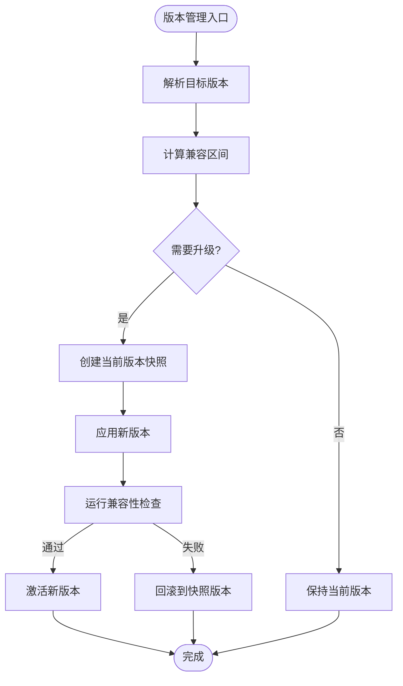

图表来源
- [engine/packages/capabilities/src/versioning.ts](file://engine/packages/capabilities/src/versioning.ts)
- [engine/packages/capabilities/src/compatibility.ts](file://engine/packages/capabilities/src/compatibility.ts)
- [engine/packages/capabilities/src/registry.ts](file://engine/packages/capabilities/src/registry.ts)

章节来源
- [engine/packages/capabilities/src/versioning.ts](file://engine/packages/capabilities/src/versioning.ts)
- [engine/packages/capabilities/src/compatibility.ts](file://engine/packages/capabilities/src/compatibility.ts)
- [engine/packages/capabilities/src/registry.ts](file://engine/packages/capabilities/src/registry.ts)

### 兼容性检查
- 接口版本检测：对比能力接口契约与宿主期望版本，拒绝不兼容版本。
- 功能特性验证：依据能力声明的特性开关，判断运行时是否具备所需能力。
- 环境依赖检查：校验平台、运行时、第三方库等依赖是否满足。

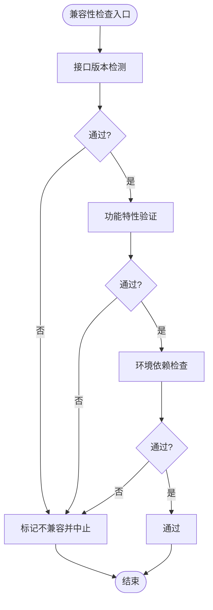

图表来源
- [engine/packages/capabilities/src/compatibility.ts](file://engine/packages/capabilities/src/compatibility.ts)

章节来源
- [engine/packages/capabilities/src/compatibility.ts](file://engine/packages/capabilities/src/compatibility.ts)

### 生命周期管理
- 阶段定义：初始化、激活、运行、停用、销毁。
- 钩子编排：在各阶段前后执行用户自定义钩子，保证幂等与异常隔离。
- 状态机：严格的状态转换与并发保护，避免竞态条件。

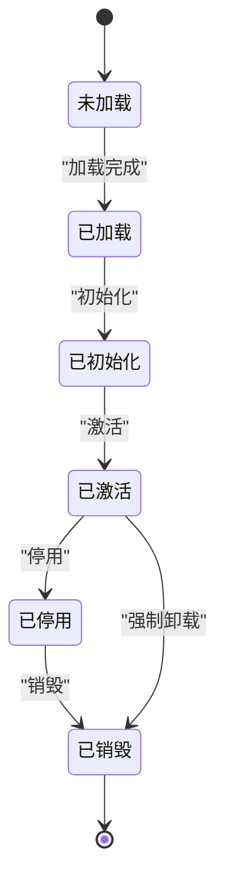

图表来源
- [engine/packages/capabilities/src/lifecycle.ts](file://engine/packages/capabilities/src/lifecycle.ts)
- [engine/packages/capabilities/src/registry.ts](file://engine/packages/capabilities/src/registry.ts)

章节来源
- [engine/packages/capabilities/src/lifecycle.ts](file://engine/packages/capabilities/src/lifecycle.ts)
- [engine/packages/capabilities/src/registry.ts](file://engine/packages/capabilities/src/registry.ts)

### 安全沙箱与权限控制
- 运行隔离：为每个能力提供独立上下文与作用域，限制全局访问。
- 权限模型：基于声明式权限清单，最小授权原则，细粒度控制能力调用。
- 审计与熔断：记录关键操作日志，异常时快速熔断并降级。

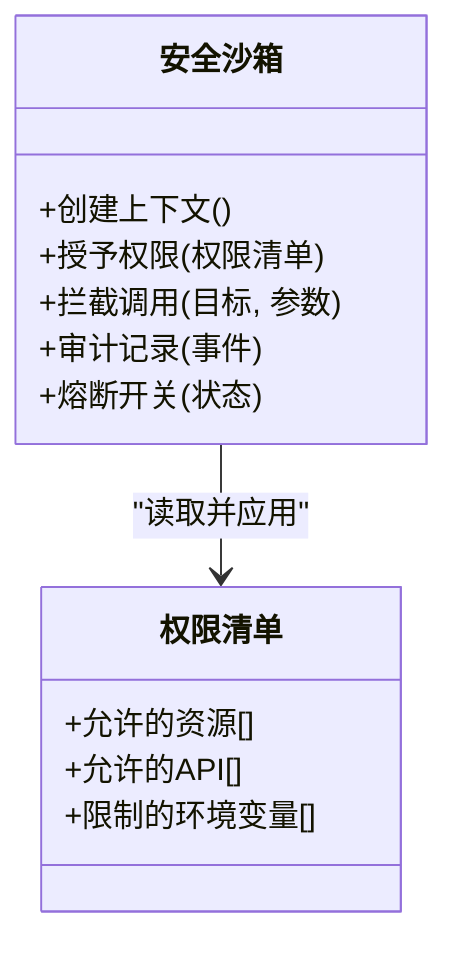

图表来源
- [engine/packages/capabilities/src/security.ts](file://engine/packages/capabilities/src/security.ts)

章节来源
- [engine/packages/capabilities/src/security.ts](file://engine/packages/capabilities/src/security.ts)

### 能力市场/插件商店集成
- 拉取与安装：从市场获取能力包，校验签名与完整性后安装至本地。
- 更新与卸载：支持增量更新与一键卸载，清理残留资源。
- 版本选择：根据兼容区间自动选择最佳版本。

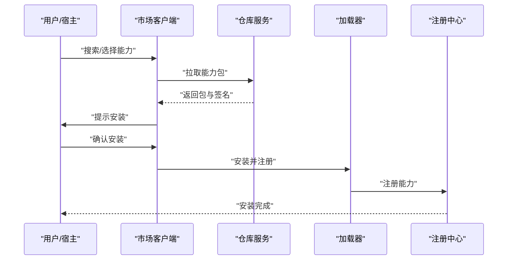

图表来源
- [engine/packages/capabilities/src/marketplace.ts](file://engine/packages/capabilities/src/marketplace.ts)
- [engine/packages/capabilities/src/loader.ts](file://engine/packages/capabilities/src/loader.ts)
- [engine/packages/capabilities/src/registry.ts](file://engine/packages/capabilities/src/registry.ts)

章节来源
- [engine/packages/capabilities/src/marketplace.ts](file://engine/packages/capabilities/src/marketplace.ts)
- [engine/packages/capabilities/src/loader.ts](file://engine/packages/capabilities/src/loader.ts)
- [engine/packages/capabilities/src/registry.ts](file://engine/packages/capabilities/src/registry.ts)

### 能力间的依赖与冲突解决
- 依赖图构建：基于能力声明的依赖关系构建有向无环图。
- 冲突检测：识别同一能力不同版本的共存需求，优先选择兼容版本。
- 解决策略：向上兼容优先、显式覆盖、回退到稳定分支。

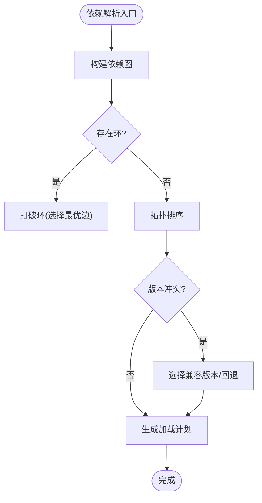

图表来源
- [engine/packages/capabilities/src/loader.ts](file://engine/packages/capabilities/src/loader.ts)
- [engine/packages/capabilities/src/registry.ts](file://engine/packages/capabilities/src/registry.ts)

章节来源
- [engine/packages/capabilities/src/loader.ts](file://engine/packages/capabilities/src/loader.ts)
- [engine/packages/capabilities/src/registry.ts](file://engine/packages/capabilities/src/registry.ts)

### 能力开发指南
- 能力定义：遵循清单格式与能力契约，明确版本、依赖、权限与特性。
- 接口规范：定义稳定的API边界，提供向前/向后兼容策略。
- 测试方法：单元测试覆盖核心逻辑，集成测试验证注册/生命周期/兼容性。

章节来源
- [engine/skills/code-review/skill.json](file://engine/skills/code-review/skill.json)
- [engine/skills/debugging/skill.json](file://engine/skills/debugging/skill.json)
- [engine/skills/tdd/skill.json](file://engine/skills/tdd/skill.json)
- [engine/tests/capabilities.test.ts](file://engine/tests/capabilities.test.ts)
- [engine/tests/capability-registry.test.ts](file://engine/tests/capability-registry.test.ts)
- [engine/tests/plugin-host.test.ts](file://engine/tests/plugin-host.test.ts)

### 注册中心API与使用示例
- 注册能力：传入能力描述符与实例，完成注册与激活。
- 查询能力：按标识、版本或特性过滤查询。
- 卸载能力：停止并释放资源，清理注册表条目。
- 事件订阅：监听能力生命周期与市场事件。

章节来源
- [engine/packages/capabilities/src/registry.ts](file://engine/packages/capabilities/src/registry.ts)
- [engine/tests/capability-registry.test.ts](file://engine/tests/capability-registry.test.ts)

## 依赖关系分析
注册中心与各模块之间的耦合关系如下：

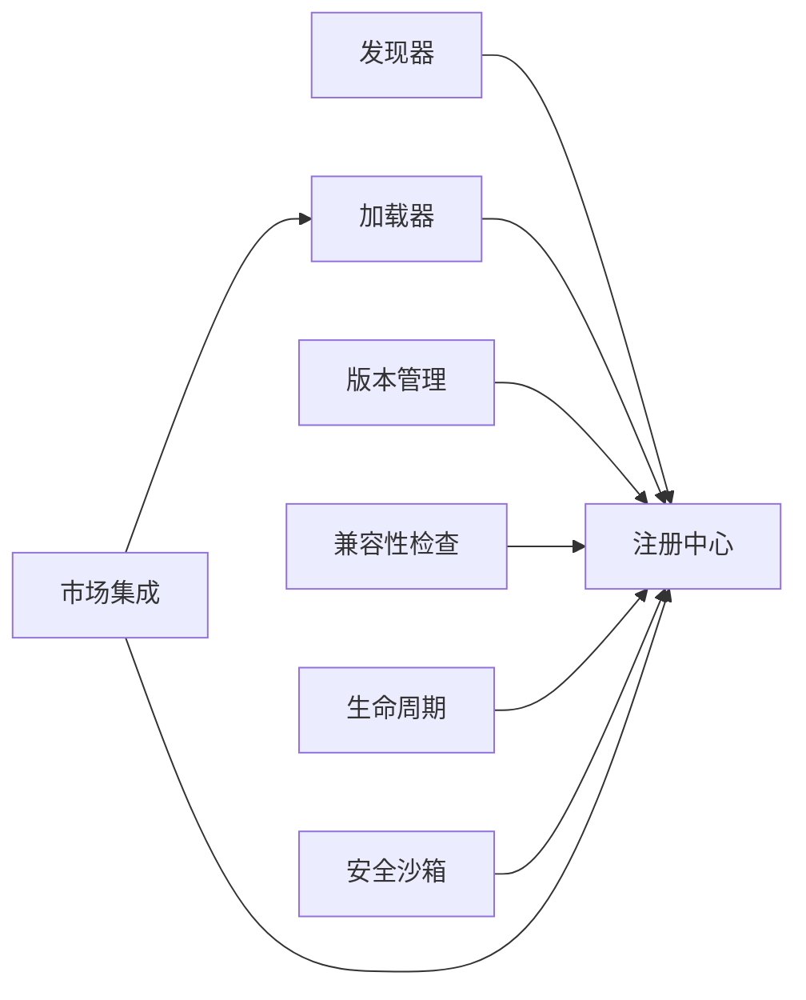

图表来源
- [engine/packages/capabilities/src/discovery.ts](file://engine/packages/capabilities/src/discovery.ts)
- [engine/packages/capabilities/src/loader.ts](file://engine/packages/capabilities/src/loader.ts)
- [engine/packages/capabilities/src/registry.ts](file://engine/packages/capabilities/src/registry.ts)
- [engine/packages/capabilities/src/versioning.ts](file://engine/packages/capabilities/src/versioning.ts)
- [engine/packages/capabilities/src/compatibility.ts](file://engine/packages/capabilities/src/compatibility.ts)
- [engine/packages/capabilities/src/lifecycle.ts](file://engine/packages/capabilities/src/lifecycle.ts)
- [engine/packages/capabilities/src/security.ts](file://engine/packages/capabilities/src/security.ts)
- [engine/packages/capabilities/src/marketplace.ts](file://engine/packages/capabilities/src/marketplace.ts)

章节来源
- [engine/packages/capabilities/src/registry.ts](file://engine/packages/capabilities/src/registry.ts)
- [engine/packages/capabilities/src/loader.ts](file://engine/packages/capabilities/src/loader.ts)
- [engine/packages/capabilities/src/discovery.ts](file://engine/packages/capabilities/src/discovery.ts)
- [engine/packages/capabilities/src/versioning.ts](file://engine/packages/capabilities/src/versioning.ts)
- [engine/packages/capabilities/src/compatibility.ts](file://engine/packages/capabilities/src/compatibility.ts)
- [engine/packages/capabilities/src/lifecycle.ts](file://engine/packages/capabilities/src/lifecycle.ts)
- [engine/packages/capabilities/src/security.ts](file://engine/packages/capabilities/src/security.ts)
- [engine/packages/capabilities/src/marketplace.ts](file://engine/packages/capabilities/src/marketplace.ts)

## 性能考量
- 缓存与复用：对已加载能力实例与解析结果进行缓存，减少重复开销。
- 增量更新：热重载仅处理受影响能力，避免全量重启。
- 并行加载：在依赖无环前提下并行加载非冲突能力，缩短启动时间。
- 资源回收：在停用/销毁阶段及时释放句柄与内存，防止泄漏。

[本节为通用指导，无需特定文件引用]

## 故障排查指南
- 常见错误：
  - 兼容性失败：检查接口版本与特性开关是否满足。
  - 依赖冲突：查看依赖图是否存在环或不可解的版本冲突。
  - 权限不足：核对能力权限清单与实际调用是否匹配。
- 定位手段：
  - 启用详细日志，关注注册中心事件流。
  - 使用测试用例复现问题，逐步缩小范围。
  - 通过市场日志追踪拉取与安装过程。

章节来源
- [engine/tests/capability-registry.test.ts](file://engine/tests/capability-registry.test.ts)
- [engine/tests/capabilities.test.ts](file://engine/tests/capabilities.test.ts)
- [engine/tests/plugin-host.test.ts](file://engine/tests/plugin-host.test.ts)
- [engine/tests/marketplace.test.ts](file://engine/tests/marketplace.test.ts)

## 结论
能力注册中心以“发现-加载-注册-生命周期-兼容性-安全-市场”为主线，形成可扩展、可观测、可治理的能力生态。通过严格的版本管理与兼容性检查，配合安全沙箱与权限控制，保障系统稳定性与安全性。建议在实际部署中完善监控与告警，持续优化加载与热重载性能。

[本节为总结性内容，无需特定文件引用]

## 附录
- 术语说明：
  - 能力：可插拔的功能单元，具备明确的接口与生命周期。
  - 清单：描述能力元数据的结构化文件。
  - 兼容区间：允许使用的版本范围。
- 参考清单样例：
  - [engine/skills/code-review/skill.json](file://engine/skills/code-review/skill.json)
  - [engine/skills/debugging/skill.json](file://engine/skills/debugging/skill.json)
  - [engine/skills/tdd/skill.json](file://engine/skills/tdd/skill.json)