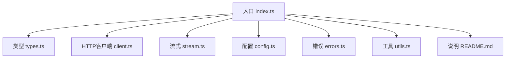
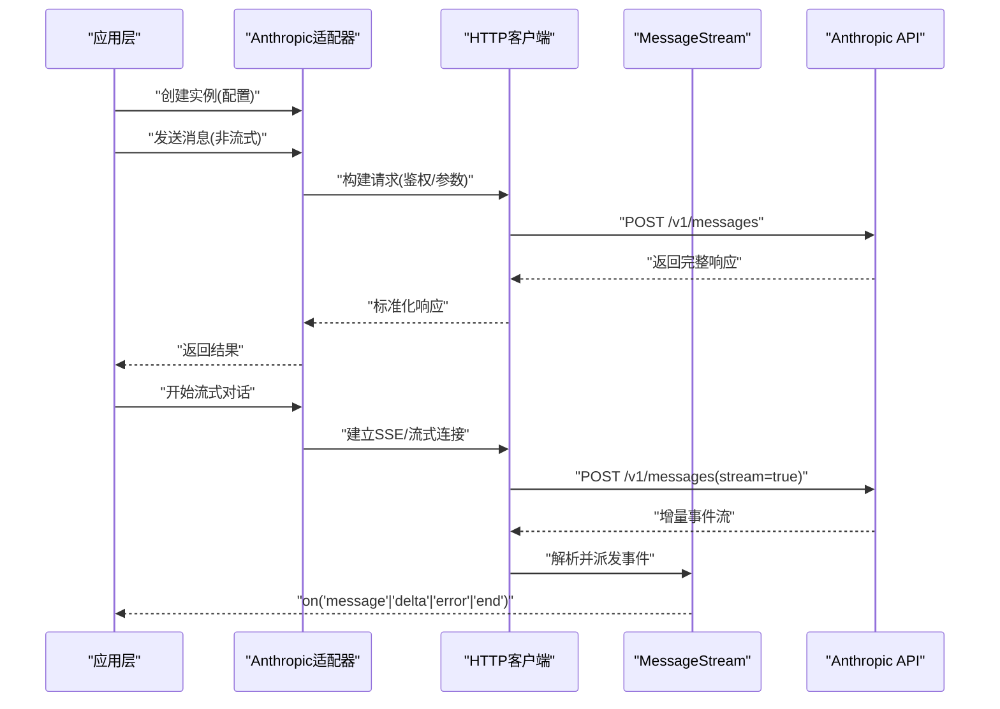
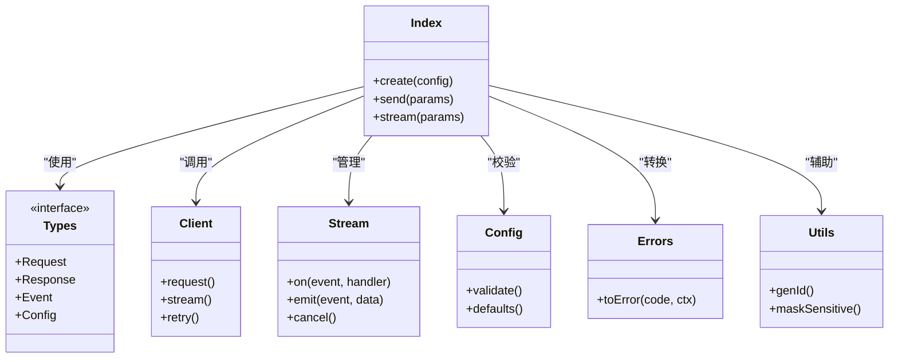

# Anthropic适配器

<cite>
**本文引用的文件**   
- [engine/packages/adapters/anthropic/index.ts](file://engine/packages/adapters/anthropic/index.ts)
- [engine/packages/adapters/anthropic/types.ts](file://engine/packages/adapters/anthropic/types.ts)
- [engine/packages/adapters/anthropic/client.ts](file://engine/packages/adapters/anthropic/client.ts)
- [engine/packages/adapters/anthropic/stream.ts](file://engine/packages/adapters/anthropic/stream.ts)
- [engine/packages/adapters/anthropic/config.ts](file://engine/packages/adapters/anthropic/config.ts)
- [engine/packages/adapters/anthropic/errors.ts](file://engine/packages/adapters/anthropic/errors.ts)
- [engine/packages/adapters/anthropic/utils.ts](file://engine/packages/adapters/anthropic/utils.ts)
- [engine/packages/adapters/anthropic/README.md](file://engine/packages/adapters/anthropic/README.md)
</cite>

## 目录
1. [简介](#简介)
2. [项目结构](#项目结构)
3. [核心组件](#核心组件)
4. [架构总览](#架构总览)
5. [详细组件分析](#详细组件分析)
6. [依赖关系分析](#依赖关系分析)
7. [性能考虑](#性能考虑)
8. [故障排查指南](#故障排查指南)
9. [结论](#结论)
10. [附录](#附录)

## 简介
本文件为KCoder的Anthropic适配器提供全面技术文档，聚焦于Claude模型的配置与调用、消息格式规范、流式对话实现、安全最佳实践、集成示例以及性能优化建议。读者可据此快速完成从环境准备到生产级集成的全流程落地。

## 项目结构
Anthropic适配器位于引擎的adapters层，采用“入口封装 + 类型定义 + HTTP客户端 + 流式处理 + 配置校验 + 错误模型 + 工具函数”的分层组织方式，便于扩展与维护。

图表来源
- [engine/packages/adapters/anthropic/index.ts](file://engine/packages/adapters/anthropic/index.ts)
- [engine/packages/adapters/anthropic/types.ts](file://engine/packages/adapters/anthropic/types.ts)
- [engine/packages/adapters/anthropic/client.ts](file://engine/packages/adapters/anthropic/client.ts)
- [engine/packages/adapters/anthropic/stream.ts](file://engine/packages/adapters/anthropic/stream.ts)
- [engine/packages/adapters/anthropic/config.ts](file://engine/packages/adapters/anthropic/config.ts)
- [engine/packages/adapters/anthropic/errors.ts](file://engine/packages/adapters/anthropic/errors.ts)
- [engine/packages/adapters/anthropic/utils.ts](file://engine/packages/adapters/anthropic/utils.ts)
- [engine/packages/adapters/anthropic/README.md](file://engine/packages/adapters/anthropic/README.md)

章节来源
- [engine/packages/adapters/anthropic/index.ts](file://engine/packages/adapters/anthropic/index.ts)
- [engine/packages/adapters/anthropic/types.ts](file://engine/packages/adapters/anthropic/types.ts)
- [engine/packages/adapters/anthropic/client.ts](file://engine/packages/adapters/anthropic/client.ts)
- [engine/packages/adapters/anthropic/stream.ts](file://engine/packages/adapters/anthropic/stream.ts)
- [engine/packages/adapters/anthropic/config.ts](file://engine/packages/adapters/anthropic/config.ts)
- [engine/packages/adapters/anthropic/errors.ts](file://engine/packages/adapters/anthropic/errors.ts)
- [engine/packages/adapters/anthropic/utils.ts](file://engine/packages/adapters/anthropic/utils.ts)
- [engine/packages/adapters/anthropic/README.md](file://engine/packages/adapters/anthropic/README.md)

## 核心组件
- 入口模块：统一对外暴露创建实例、发送消息、流式对话等能力，屏蔽底层差异。
- 类型定义：集中声明请求/响应体、事件类型、状态枚举等契约。
- HTTP客户端：负责鉴权、重试、超时、限流、日志与错误映射。
- 流式处理：基于MessageStream实现增量事件分发、状态管理与中断控制。
- 配置校验：对API密钥、模型版本、系统提示词、并发与缓存参数进行校验与默认值填充。
- 错误模型：将上游异常转换为统一的业务错误类型，便于上层捕获与恢复。
- 工具函数：通用序列化、签名、时间戳、ID生成等辅助逻辑。

章节来源
- [engine/packages/adapters/anthropic/index.ts](file://engine/packages/adapters/anthropic/index.ts)
- [engine/packages/adapters/anthropic/types.ts](file://engine/packages/adapters/anthropic/types.ts)
- [engine/packages/adapters/anthropic/client.ts](file://engine/packages/adapters/anthropic/client.ts)
- [engine/packages/adapters/anthropic/stream.ts](file://engine/packages/adapters/anthropic/stream.ts)
- [engine/packages/adapters/anthropic/config.ts](file://engine/packages/adapters/anthropic/config.ts)
- [engine/packages/adapters/anthropic/errors.ts](file://engine/packages/adapters/anthropic/errors.ts)
- [engine/packages/adapters/anthropic/utils.ts](file://engine/packages/adapters/anthropic/utils.ts)

## 架构总览
下图展示了从应用层到Anthropic API的完整调用路径，包括非流式与流式两种模式。

图表来源
- [engine/packages/adapters/anthropic/index.ts](file://engine/packages/adapters/anthropic/index.ts)
- [engine/packages/adapters/anthropic/client.ts](file://engine/packages/adapters/anthropic/client.ts)
- [engine/packages/adapters/anthropic/stream.ts](file://engine/packages/adapters/anthropic/stream.ts)

## 详细组件分析

### 入口模块（index.ts）
- 职责：提供工厂方法创建适配器实例；封装同步/异步调用；注册流式事件监听器；聚合配置与错误处理。
- 关键点：
  - 初始化时加载配置并执行校验。
  - 非流式调用走HTTP客户端一次性请求。
  - 流式调用通过MessageStream管理事件生命周期。
  - 对外暴露统一的错误类型与状态码。

章节来源
- [engine/packages/adapters/anthropic/index.ts](file://engine/packages/adapters/anthropic/index.ts)

### 类型定义（types.ts）
- 职责：集中定义请求/响应结构、事件类型、状态枚举、配置项等。
- 要点：
  - 消息角色：system、user、assistant。
  - 流式事件：message_start、content_delta、message_end、error、abort。
  - 配置项：apiKey、model、maxTokens、temperature、topP、timeout、retries、concurrency、cacheKey等。
  - 错误码：网络错误、鉴权失败、速率限制、模型不可用、参数非法等。

章节来源
- [engine/packages/adapters/anthropic/types.ts](file://engine/packages/adapters/anthropic/types.ts)

### HTTP客户端（client.ts）
- 职责：构造请求头（含鉴权）、设置超时与重试、记录日志、将上游错误映射为统一错误类型。
- 关键点：
  - 支持按模型选择不同端点或查询参数。
  - 自动附加traceId、requestId用于追踪。
  - 对429/5xx进行指数退避重试。
  - 流式模式下保持连接并转发事件。

章节来源
- [engine/packages/adapters/anthropic/client.ts](file://engine/packages/adapters/anthropic/client.ts)

### 流式处理（stream.ts）
- 职责：基于MessageStream实现增量事件分发、状态机管理、取消与错误恢复。
- 关键点：
  - 事件队列与背压控制，避免内存暴涨。
  - 状态：idle、connecting、streaming、ended、errored。
  - 支持在任意时刻中止流并清理资源。
  - 将原始字节流解析为结构化事件对象。

章节来源
- [engine/packages/adapters/anthropic/stream.ts](file://engine/packages/adapters/anthropic/stream.ts)

### 配置与校验（config.ts）
- 职责：合并默认配置、校验必填字段、规范化可选参数。
- 关键点：
  - 强制要求API密钥与模型名称。
  - 模型白名单校验（如claude-2、claude-instant等）。
  - 数值范围校验（温度、Top-P、最大Token数等）。
  - 并发与缓存策略默认值设定。

章节来源
- [engine/packages/adapters/anthropic/config.ts](file://engine/packages/adapters/anthropic/config.ts)

### 错误模型（errors.ts）
- 职责：定义统一错误类与错误码，便于上层分类处理。
- 关键点：
  - 区分网络错误、认证错误、业务错误、参数错误。
  - 携带上下文信息（请求ID、模型名、耗时等）。
  - 提供可读的错误消息与调试信息。

章节来源
- [engine/packages/adapters/anthropic/errors.ts](file://engine/packages/adapters/anthropic/errors.ts)

### 工具函数（utils.ts）
- 职责：提供通用工具，如ID生成、时间戳、JSON序列化、敏感信息脱敏等。
- 关键点：
  - 生成稳定且唯一的请求标识。
  - 对日志中的敏感字段进行掩码处理。
  - 提供幂等键计算，配合缓存使用。

章节来源
- [engine/packages/adapters/anthropic/utils.ts](file://engine/packages/adapters/anthropic/utils.ts)

### 使用说明（README.md）
- 职责：面向使用者的快速上手指南，包含环境变量、基础调用与常见问题。
- 关键点：
  - 如何获取API密钥。
  - 常用模型版本对比与选择建议。
  - 典型调用示例与注意事项。

章节来源
- [engine/packages/adapters/anthropic/README.md](file://engine/packages/adapters/anthropic/README.md)

## 依赖关系分析
适配器内部各模块之间的依赖关系如下：

图表来源
- [engine/packages/adapters/anthropic/index.ts](file://engine/packages/adapters/anthropic/index.ts)
- [engine/packages/adapters/anthropic/types.ts](file://engine/packages/adapters/anthropic/types.ts)
- [engine/packages/adapters/anthropic/client.ts](file://engine/packages/adapters/anthropic/client.ts)
- [engine/packages/adapters/anthropic/stream.ts](file://engine/packages/adapters/anthropic/stream.ts)
- [engine/packages/adapters/anthropic/config.ts](file://engine/packages/adapters/anthropic/config.ts)
- [engine/packages/adapters/anthropic/errors.ts](file://engine/packages/adapters/anthropic/errors.ts)
- [engine/packages/adapters/anthropic/utils.ts](file://engine/packages/adapters/anthropic/utils.ts)

章节来源
- [engine/packages/adapters/anthropic/index.ts](file://engine/packages/adapters/anthropic/index.ts)
- [engine/packages/adapters/anthropic/types.ts](file://engine/packages/adapters/anthropic/types.ts)
- [engine/packages/adapters/anthropic/client.ts](file://engine/packages/adapters/anthropic/client.ts)
- [engine/packages/adapters/anthropic/stream.ts](file://engine/packages/adapters/anthropic/stream.ts)
- [engine/packages/adapters/anthropic/config.ts](file://engine/packages/adapters/anthropic/config.ts)
- [engine/packages/adapters/anthropic/errors.ts](file://engine/packages/adapters/anthropic/errors.ts)
- [engine/packages/adapters/anthropic/utils.ts](file://engine/packages/adapters/anthropic/utils.ts)

## 性能考虑
- 缓存策略
  - 基于请求指纹（模型、系统提示词、用户输入摘要、参数哈希）生成缓存键。
  - 短TTL热点缓存与长TTL冷数据分层存储，结合失效策略。
  - 注意：带随机性参数（如temperature）的请求应降低命中率或单独缓存维度。
- 并发控制
  - 全局令牌桶或信号量限制并发度，防止触发速率限制。
  - 按模型或租户维度隔离配额，避免相互影响。
- 资源管理
  - 流式连接必须显式释放，确保事件订阅与网络连接在结束或错误时清理。
  - 合理设置超时与重试上限，避免长时间占用资源。
- 批处理与合并
  - 对高频小请求进行合并，减少握手与鉴权开销。
- 观测性与降级
  - 记录关键指标（延迟、吞吐、错误率、缓存命中率）。
  - 当上游不稳定时启用降级策略（如返回兜底回复或排队等待）。

[本节为通用指导，不直接分析具体文件]

## 故障排查指南
- 常见错误与定位
  - 鉴权失败：检查API密钥是否有效、权限是否开启、区域是否正确。
  - 速率限制：观察429响应，调整重试间隔与并发度。
  - 模型不可用：确认模型名称在白名单内，必要时切换备用模型。
  - 参数非法：核对温度、Top-P、最大Token等范围。
- 诊断手段
  - 开启详细日志，记录请求ID、耗时、上游状态码。
  - 使用错误上下文信息快速定位问题边界。
- 恢复策略
  - 指数退避重试与熔断保护。
  - 流式场景下支持中断与重连。

章节来源
- [engine/packages/adapters/anthropic/errors.ts](file://engine/packages/adapters/anthropic/errors.ts)
- [engine/packages/adapters/anthropic/client.ts](file://engine/packages/adapters/anthropic/client.ts)
- [engine/packages/adapters/anthropic/stream.ts](file://engine/packages/adapters/anthropic/stream.ts)

## 结论
本适配器以清晰的模块化设计提供了对Claude模型的稳定接入能力，涵盖配置校验、流式事件、错误模型与工具函数等关键能力。遵循本文的安全与性能建议，可在生产环境中获得高可用与高性能的集成体验。

[本节为总结性内容，不直接分析具体文件]

## 附录

### Claude模型配置方法
- API密钥获取
  - 在Anthropic控制台创建并复制API密钥，将其注入到适配器的配置中。
- 模型版本选择
  - 常用模型：claude-2、claude-instant等。
  - 根据任务复杂度与成本预算选择合适的模型版本。
- 必要配置项
  - apiKey、model为必填；maxTokens、temperature、topP等为可选但建议显式设置。
- 参考位置
  - 配置结构与校验规则见配置文件与类型定义。

章节来源
- [engine/packages/adapters/anthropic/config.ts](file://engine/packages/adapters/anthropic/config.ts)
- [engine/packages/adapters/anthropic/types.ts](file://engine/packages/adapters/anthropic/types.ts)
- [engine/packages/adapters/anthropic/README.md](file://engine/packages/adapters/anthropic/README.md)

### Anthropic消息格式
- system提示词
  - 用于设定助手行为与约束，应在每次会话开始时传入。
- user消息
  - 用户的自然语言或代码相关输入，可包含多轮历史。
- assistant回复
  - 助手生成的文本或结构化输出，流式模式下以增量事件形式返回。
- 参考位置
  - 消息结构与事件类型见类型定义。

章节来源
- [engine/packages/adapters/anthropic/types.ts](file://engine/packages/adapters/anthropic/types.ts)

### 流式对话实现
- MessageStream使用
  - 通过适配器提供的流式接口建立连接，监听事件回调。
- 事件监听
  - 典型事件：message_start、content_delta、message_end、error、abort。
- 状态管理
  - 维护连接状态，支持中断与错误恢复。
- 参考位置
  - 流式处理与事件分发见流式模块。

章节来源
- [engine/packages/adapters/anthropic/stream.ts](file://engine/packages/adapters/anthropic/stream.ts)
- [engine/packages/adapters/anthropic/index.ts](file://engine/packages/adapters/anthropic/index.ts)

### 安全考虑与最佳实践
- 输入验证
  - 对用户输入进行长度、字符集与敏感词过滤。
- 输出过滤
  - 对助手输出进行二次校验与脱敏，避免泄露敏感信息。
- 敏感信息保护
  - 日志中掩码API密钥、用户标识等敏感字段。
- 参考位置
  - 工具函数与错误模型提供脱敏与错误上下文能力。

章节来源
- [engine/packages/adapters/anthropic/utils.ts](file://engine/packages/adapters/anthropic/utils.ts)
- [engine/packages/adapters/anthropic/errors.ts](file://engine/packages/adapters/anthropic/errors.ts)

### 完整集成示例（流程说明）
- 步骤概览
  - 安装与导入适配器。
  - 配置API密钥与模型参数。
  - 发起非流式调用获取完整回复。
  - 使用流式接口建立实时对话。
  - 处理错误与资源释放。
- 参考位置
  - 入口模块与使用说明提供端到端指引。

章节来源
- [engine/packages/adapters/anthropic/index.ts](file://engine/packages/adapters/anthropic/index.ts)
- [engine/packages/adapters/anthropic/README.md](file://engine/packages/adapters/anthropic/README.md)