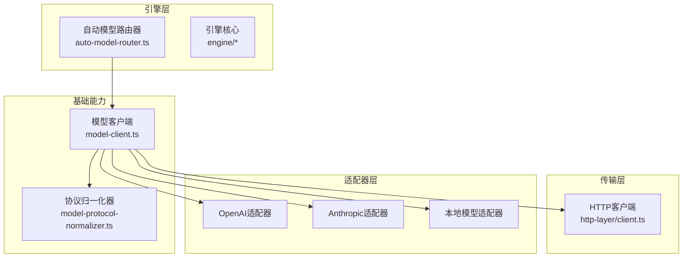
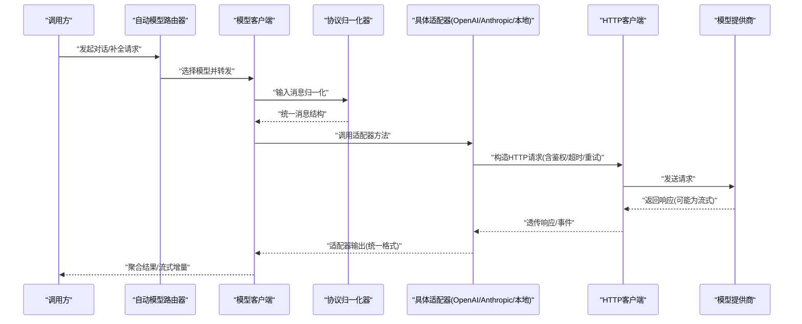
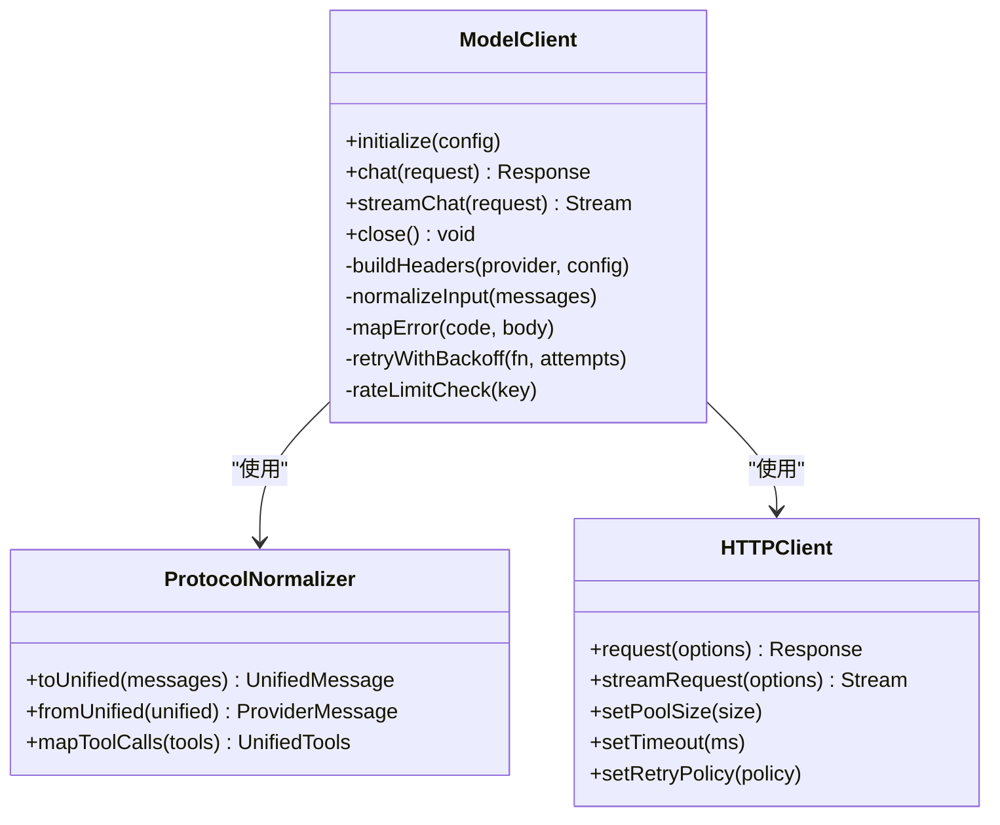
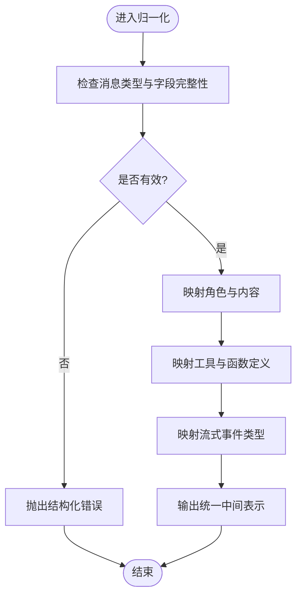
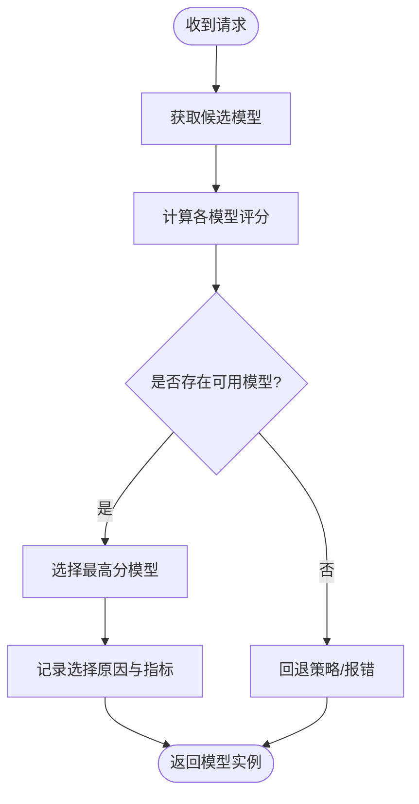
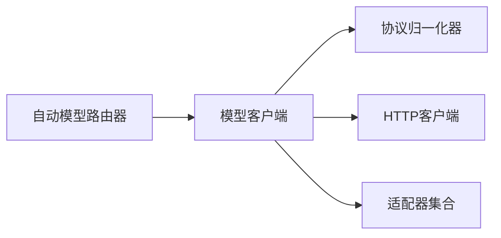

# LLM提供商适配器

<cite>
**本文引用的文件**   
- [engine/packages/adapters/README.md](file://engine/packages/adapters/README.md)
- [engine/packages/foundation/src/model-client.ts](file://engine/packages/foundation/src/model-client.ts)
- [engine/packages/foundation/src/model-protocol-normalizer.ts](file://engine/packages/foundation/src/model-protocol-normalizer.ts)
- [engine/packages/engine/src/auto-model-router.ts](file://engine/packages/engine/src/auto-model-router.ts)
- [engine/packages/http-layer/src/client.ts](file://engine/packages/http-layer/src/client.ts)
- [engine/tests/model-client.test.ts](file://engine/tests/model-client.test.ts)
- [engine/tests/auto-model-router.test.ts](file://engine/tests/auto-model-router.test.ts)
- [engine/tests/model-protocol-normalizer.test.ts](file://engine/tests/model-protocol-normalizer.test.ts)
- [engine/config.example.json](file://engine/config.example.json)
</cite>

## 目录
1. [简介](#简介)
2. [项目结构](#项目结构)
3. [核心组件](#核心组件)
4. [架构总览](#架构总览)
5. [详细组件分析](#详细组件分析)
6. [依赖关系分析](#依赖关系分析)
7. [性能考虑](#性能考虑)
8. [故障排除指南](#故障排除指南)
9. [结论](#结论)
10. [附录：新模型提供商集成指南](#附录新模型提供商集成指南)

## 简介
本技术文档面向KCoder的LLM提供商适配器子系统，目标是帮助开发者理解并扩展多模型接入能力。内容覆盖：
- 支持的模型提供商（OpenAI、Anthropic、本地模型等）及其配置与认证方式
- 统一接口抽象设计（消息格式转换、流式响应处理、错误码映射）
- 模型客户端实现（连接池、重试、超时、速率限制）
- 多模型路由与负载均衡（自动选择、成本优化、性能监控）
- 新模型提供商集成步骤（API文档分析、SDK集成、测试验证）
- 性能调优与故障排除实践建议

## 项目结构
KCoder引擎采用分层与模块化组织，LLM适配相关代码主要分布在以下包中：
- adapters：各模型提供商的具体适配器实现
- foundation：通用基础能力，包括模型客户端、协议归一化、错误与指标
- engine：编排与策略层，包含自动模型路由、任务执行上下文等
- http-layer：HTTP传输层封装，提供连接管理、重试、超时、限流等通用能力
- tests：针对关键路径的单元测试与集成测试

图表来源
- [engine/packages/engine/src/auto-model-router.ts](file://engine/packages/engine/src/auto-model-router.ts)
- [engine/packages/foundation/src/model-client.ts](file://engine/packages/foundation/src/model-client.ts)
- [engine/packages/foundation/src/model-protocol-normalizer.ts](file://engine/packages/foundation/src/model-protocol-normalizer.ts)
- [engine/packages/http-layer/src/client.ts](file://engine/packages/http-layer/src/client.ts)

章节来源
- [engine/packages/adapters/README.md](file://engine/packages/adapters/README.md)
- [engine/packages/foundation/src/model-client.ts](file://engine/packages/foundation/src/model-client.ts)
- [engine/packages/foundation/src/model-protocol-normalizer.ts](file://engine/packages/foundation/src/model-protocol-normalizer.ts)
- [engine/packages/engine/src/auto-model-router.ts](file://engine/packages/engine/src/auto-model-router.ts)
- [engine/packages/http-layer/src/client.ts](file://engine/packages/http-layer/src/client.ts)

## 核心组件
- 模型客户端（ModelClient）
  - 职责：对外暴露统一的调用接口；负责请求构建、认证注入、重试与超时控制、流式响应聚合、错误码标准化、用量统计。
  - 关键特性：
    - 连接池管理：复用底层HTTP连接，减少握手开销
    - 重试策略：可配置最大重试次数与退避算法
    - 超时控制：请求级与流式分片级超时
    - 速率限制：令牌桶或滑动窗口限流，避免触发上游配额
    - 错误码映射：将上游差异化的错误码统一为内部标准码
    - 流式处理：支持SSE/Server-Sent Events或分块响应，增量消费
- 协议归一化器（ProtocolNormalizer）
  - 职责：将不同提供商的消息格式、参数、返回体转换为统一中间表示
  - 关键点：系统提示、用户/助手消息、工具调用、函数定义、流式事件类型映射
- 自动模型路由器（AutoModelRouter）
  - 职责：根据策略在多个模型间进行动态选择与负载均衡
  - 策略维度：成本、延迟、可用性、配额、权重、A/B实验分流
- HTTP客户端（HTTP Layer）
  - 职责：封装HTTP请求、连接池、重试、超时、鉴权头注入、代理与TLS设置
  - 关键点：可观测性埋点、指标上报、错误分类

章节来源
- [engine/packages/foundation/src/model-client.ts](file://engine/packages/foundation/src/model-client.ts)
- [engine/packages/foundation/src/model-protocol-normalizer.ts](file://engine/packages/foundation/src/model-protocol-normalizer.ts)
- [engine/packages/engine/src/auto-model-router.ts](file://engine/packages/engine/src/auto-model-router.ts)
- [engine/packages/http-layer/src/client.ts](file://engine/packages/http-layer/src/client.ts)

## 架构总览
下图展示了从上层调用到下游模型的端到端流程，涵盖路由、客户端、归一化、传输与适配器。

图表来源
- [engine/packages/engine/src/auto-model-router.ts](file://engine/packages/engine/src/auto-model-router.ts)
- [engine/packages/foundation/src/model-client.ts](file://engine/packages/foundation/src/model-client.ts)
- [engine/packages/foundation/src/model-protocol-normalizer.ts](file://engine/packages/foundation/src/model-protocol-normalizer.ts)
- [engine/packages/http-layer/src/client.ts](file://engine/packages/http-layer/src/client.ts)

## 详细组件分析

### 模型客户端（ModelClient）
- 设计要点
  - 统一入口：对外仅暴露少量方法，屏蔽下游差异
  - 生命周期：初始化时加载配置、建立连接池、注册适配器
  - 错误处理：捕获网络/协议/业务错误，映射为标准错误码，附带诊断信息
  - 可观测性：记录耗时、字节数、token计数、重试次数、失败原因
- 关键行为
  - 连接池：按目标域名/密钥维度维护连接集合，控制并发上限
  - 重试与退避：指数退避+抖动，区分可重试与不可重试错误
  - 超时控制：整体请求超时与流式分片超时
  - 速率限制：基于令牌桶或滑动窗口，结合配额与历史成功率动态调整
  - 流式响应：增量解析事件，支持中断与取消
- 典型错误码映射
  - 4xx：参数错误、鉴权失败、配额不足
  - 5xx：服务不可用、超时、内部错误
  - 自定义：模型不支持的工具调用、上下文超限、安全拦截

图表来源
- [engine/packages/foundation/src/model-client.ts](file://engine/packages/foundation/src/model-client.ts)
- [engine/packages/foundation/src/model-protocol-normalizer.ts](file://engine/packages/foundation/src/model-protocol-normalizer.ts)
- [engine/packages/http-layer/src/client.ts](file://engine/packages/http-layer/src/client.ts)

章节来源
- [engine/packages/foundation/src/model-client.ts](file://engine/packages/foundation/src/model-client.ts)
- [engine/tests/model-client.test.ts](file://engine/tests/model-client.test.ts)

### 协议归一化器（ProtocolNormalizer）
- 职责
  - 将不同提供商的消息结构（角色、内容、工具调用、函数定义）转换为统一中间表示
  - 将统一中间表示转换为特定提供商的API格式
- 关键映射
  - 角色映射：system/user/assistant/tool_result -> 提供商对应字段
  - 工具调用：function_call/tool_use -> 统一工具描述与参数
  - 流式事件：delta/content_chunk -> 统一增量片段
- 异常与边界
  - 缺失字段：提供默认值或拒绝请求
  - 非法类型：严格校验并抛出结构化错误
  - 超大上下文：提前检测并截断或提示

图表来源
- [engine/packages/foundation/src/model-protocol-normalizer.ts](file://engine/packages/foundation/src/model-protocol-normalizer.ts)

章节来源
- [engine/packages/foundation/src/model-protocol-normalizer.ts](file://engine/packages/foundation/src/model-protocol-normalizer.ts)
- [engine/tests/model-protocol-normalizer.test.ts](file://engine/tests/model-protocol-normalizer.test.ts)

### 自动模型路由器（AutoModelRouter）
- 策略维度
  - 成本优先：选择单位token成本最低的可用模型
  - 延迟优先：选择历史P95延迟最低的模型
  - 可用性优先：基于健康检查与失败率选择
  - 配额感知：避开即将耗尽配额的模型
  - 权重分流：按比例分配流量用于A/B或灰度
- 决策流程
  - 收集候选模型列表
  - 计算评分（加权组合成本、延迟、可用性、配额余量）
  - 选择最高分模型，必要时回退至次优
  - 记录选择原因与指标，便于后续优化

图表来源
- [engine/packages/engine/src/auto-model-router.ts](file://engine/packages/engine/src/auto-model-router.ts)

章节来源
- [engine/packages/engine/src/auto-model-router.ts](file://engine/packages/engine/src/auto-model-router.ts)
- [engine/tests/auto-model-router.test.ts](file://engine/tests/auto-model-router.test.ts)

### HTTP客户端（HTTP Layer）
- 功能
  - 连接池：按目标主机/端口/协议维度复用连接，控制并发
  - 重试：可配置最大次数、退避策略、重试条件（如5xx、超时）
  - 超时：连接、读写、流式分片超时
  - 鉴权：注入Authorization、API Key、签名头等
  - 代理与TLS：支持企业代理与证书配置
- 可观测性
  - 指标：请求数、成功/失败、延迟分布、连接池利用率
  - 日志：关键路径与错误堆栈

章节来源
- [engine/packages/http-layer/src/client.ts](file://engine/packages/http-layer/src/client.ts)

## 依赖关系分析
- 耦合与内聚
  - 模型客户端对协议归一化器与HTTP客户端存在强依赖，但通过接口隔离降低耦合
  - 自动模型路由器与模型客户端松耦合，仅依赖其统一接口
- 外部依赖
  - 各提供商SDK或REST API
  - 指标与日志系统（可选）
- 潜在循环依赖
  - 当前分层清晰，未发现循环依赖

图表来源
- [engine/packages/engine/src/auto-model-router.ts](file://engine/packages/engine/src/auto-model-router.ts)
- [engine/packages/foundation/src/model-client.ts](file://engine/packages/foundation/src/model-client.ts)
- [engine/packages/foundation/src/model-protocol-normalizer.ts](file://engine/packages/foundation/src/model-protocol-normalizer.ts)
- [engine/packages/http-layer/src/client.ts](file://engine/packages/http-layer/src/client.ts)

章节来源
- [engine/packages/engine/src/auto-model-router.ts](file://engine/packages/engine/src/auto-model-router.ts)
- [engine/packages/foundation/src/model-client.ts](file://engine/packages/foundation/src/model-client.ts)
- [engine/packages/foundation/src/model-protocol-normalizer.ts](file://engine/packages/foundation/src/model-protocol-normalizer.ts)
- [engine/packages/http-layer/src/client.ts](file://engine/packages/http-layer/src/client.ts)

## 性能考虑
- 连接池
  - 合理设置最大连接数与每主机连接上限，避免过多上下文切换
  - 监控连接等待时间与空闲回收
- 重试与退避
  - 区分幂等与非幂等请求，谨慎重试写操作
  - 使用指数退避+随机抖动，避免雪崩
- 超时控制
  - 根据模型响应特征设置合理的整体与分片超时
  - 流式场景下，分片超时应小于整体超时
- 速率限制
  - 基于令牌桶或滑动窗口，结合配额与历史失败率动态调整
  - 对热点模型实施更严格的限流
- 缓存与去重
  - 对相同请求进行短期缓存（需评估一致性）
  - 对工具调用结果进行缓存，减少重复计算
- 可观测性
  - 采集延迟分位、吞吐、错误率、重试率、配额使用率
  - 对慢查询与热点模型进行告警

[本节为通用指导，不直接分析具体文件]

## 故障排除指南
- 常见问题
  - 鉴权失败：检查API Key、签名、时间戳、IP白名单
  - 配额不足：查看配额剩余与限流策略，扩容或降级
  - 超时：调整超时阈值，检查网络质量与模型负载
  - 流式中断：检查分片超时与网络稳定性，增加重试与缓冲
- 定位方法
  - 启用详细日志与指标，关注错误码映射与重试次数
  - 使用最小复现用例，逐步剥离非关键逻辑
  - 对比不同提供商的行为差异，确认是否为适配问题
- 恢复策略
  - 自动回退到其他模型
  - 降级模式：关闭工具调用或简化提示词
  - 熔断：当失败率超过阈值时暂停向该模型发请求

章节来源
- [engine/tests/model-client.test.ts](file://engine/tests/model-client.test.ts)
- [engine/tests/auto-model-router.test.ts](file://engine/tests/auto-model-router.test.ts)
- [engine/tests/model-protocol-normalizer.test.ts](file://engine/tests/model-protocol-normalizer.test.ts)

## 结论
KCoder的LLM提供商适配器通过统一接口、协议归一化、智能路由与稳健的传输层，实现了多模型的高效接入与灵活调度。建议在持续演进中完善可观测性与自动化测试，确保在不同提供商与网络环境下的稳定表现。

[本节为总结，不直接分析具体文件]

## 附录：新模型提供商集成指南
- 步骤概览
  - 分析API文档：明确消息格式、流式事件、错误码、配额与限流规则
  - 创建适配器：实现统一接口的适配方法，完成消息与返回体的双向转换
  - 集成到客户端：注册适配器，配置鉴权与连接参数
  - 配置与认证：在配置文件中添加提供商密钥、端点、重试与超时策略
  - 测试验证：编写单测与集成测试，覆盖正常、异常与边界场景
  - 上线与监控：接入指标与日志，观察延迟、错误率与配额使用情况
- 配置示例参考
  - 参考配置文件中的提供商条目，补充必要字段（如base_url、api_key、timeout、max_retries、rate_limit）
- 测试清单
  - 基本对话与补全
  - 工具调用与函数定义
  - 流式响应与中断
  - 鉴权失败、配额不足、超时、网络错误
  - 路由回退与负载均衡效果

章节来源
- [engine/config.example.json](file://engine/config.example.json)
- [engine/packages/adapters/README.md](file://engine/packages/adapters/README.md)