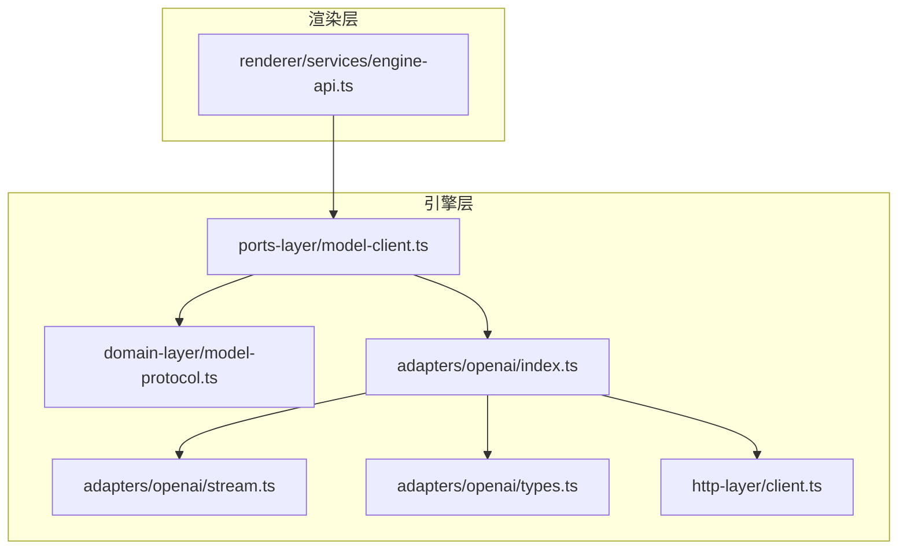
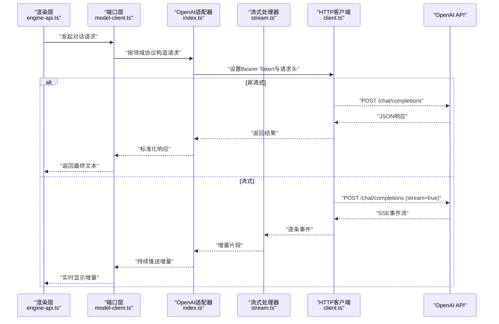
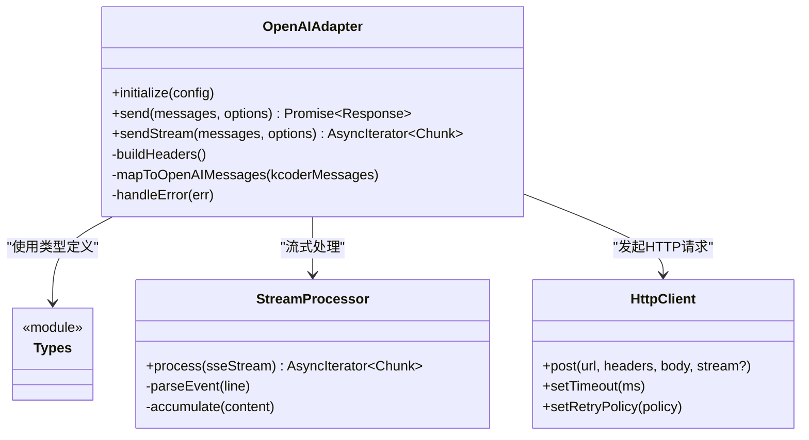
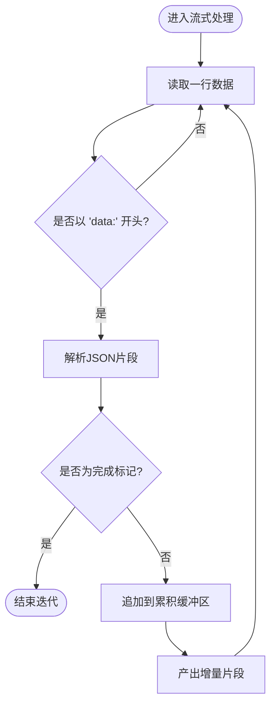
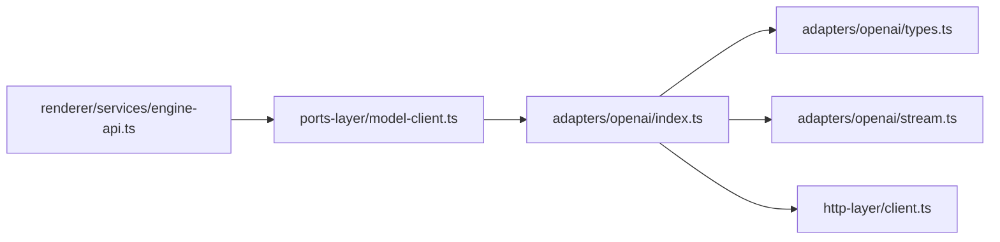

# OpenAI适配器

<cite>
**本文引用的文件**   
- [engine/packages/adapters/openai/index.ts](file://engine/packages/adapters/openai/index.ts)
- [engine/packages/adapters/openai/types.ts](file://engine/packages/adapters/openai/types.ts)
- [engine/packages/adapters/openai/stream.ts](file://engine/packages/adapters/openai/stream.ts)
- [engine/packages/ports-layer/model-client.ts](file://engine/packages/ports-layer/model-client.ts)
- [engine/packages/domain-layer/model-protocol.ts](file://engine/packages/domain-layer/model-protocol.ts)
- [engine/packages/http-layer/client.ts](file://engine/packages/http-layer/client.ts)
- [app/renderer/src/services/engine-api.ts](file://app/renderer/src/services/engine-api.ts)
</cite>

## 目录
1. [简介](#简介)
2. [项目结构](#项目结构)
3. [核心组件](#核心组件)
4. [架构总览](#架构总览)
5. [详细组件分析](#详细组件分析)
6. [依赖关系分析](#依赖关系分析)
7. [性能考虑](#性能考虑)
8. [故障排查指南](#故障排查指南)
9. [结论](#结论)
10. [附录](#附录)

## 简介
本技术文档面向KCoder的OpenAI适配器，系统性说明以下方面：
- OpenAI API配置方式（API密钥、模型选择、参数）
- 消息格式转换（KCoder内部消息到OpenAI ChatCompletionRequest）
- 流式响应处理（SSE事件解析、增量拼接、错误中断）
- 认证与请求头（Bearer Token、速率限制）
- 完整使用示例（初始化客户端、发送消息、处理响应）
- 错误处理策略（网络超时、限流、模型不可用等）

## 项目结构
OpenAI适配器位于引擎层的adapters包中，并通过ports-layer暴露统一接口；HTTP层负责底层网络通信；渲染层通过engine-api调用引擎服务。

图表来源
- [engine/packages/ports-layer/model-client.ts](file://engine/packages/ports-layer/model-client.ts)
- [engine/packages/domain-layer/model-protocol.ts](file://engine/packages/domain-layer/model-protocol.ts)
- [engine/packages/adapters/openai/index.ts](file://engine/packages/adapters/openai/index.ts)
- [engine/packages/adapters/openai/stream.ts](file://engine/packages/adapters/openai/stream.ts)
- [engine/packages/adapters/openai/types.ts](file://engine/packages/adapters/openai/types.ts)
- [engine/packages/http-layer/client.ts](file://engine/packages/http-layer/client.ts)
- [app/renderer/src/services/engine-api.ts](file://app/renderer/src/services/engine-api.ts)

章节来源
- [engine/packages/ports-layer/model-client.ts](file://engine/packages/ports-layer/model-client.ts)
- [engine/packages/domain-layer/model-protocol.ts](file://engine/packages/domain-layer/model-protocol.ts)
- [engine/packages/adapters/openai/index.ts](file://engine/packages/adapters/openai/index.ts)
- [engine/packages/adapters/openai/stream.ts](file://engine/packages/adapters/openai/stream.ts)
- [engine/packages/adapters/openai/types.ts](file://engine/packages/adapters/openai/types.ts)
- [engine/packages/http-layer/client.ts](file://engine/packages/http-layer/client.ts)
- [app/renderer/src/services/engine-api.ts](file://app/renderer/src/services/engine-api.ts)

## 核心组件
- OpenAI适配器入口：负责将领域协议中的消息转换为OpenAI请求，管理认证、重试、流式与非流式调用。
- 类型定义：包含OpenAI相关请求/响应类型、适配器配置项、错误码等。
- 流式处理器：解析SSE事件流，聚合增量内容并透传至上层。
- HTTP客户端：封装基础HTTP能力（连接池、超时、重试、鉴权头等）。
- 端口层模型客户端：对外暴露统一的模型调用接口，屏蔽具体适配器差异。
- 领域协议：定义KCoder内部的消息结构与交互契约。

章节来源
- [engine/packages/adapters/openai/index.ts](file://engine/packages/adapters/openai/index.ts)
- [engine/packages/adapters/openai/types.ts](file://engine/packages/adapters/openai/types.ts)
- [engine/packages/adapters/openai/stream.ts](file://engine/packages/adapters/openai/stream.ts)
- [engine/packages/http-layer/client.ts](file://engine/packages/http-layer/client.ts)
- [engine/packages/ports-layer/model-client.ts](file://engine/packages/ports-layer/model-client.ts)
- [engine/packages/domain-layer/model-protocol.ts](file://engine/packages/domain-layer/model-protocol.ts)

## 架构总览
下图展示了从渲染层到OpenAI服务的端到端调用路径，包括认证、请求构建、流式处理与错误传播。

图表来源
- [engine/packages/ports-layer/model-client.ts](file://engine/packages/ports-layer/model-client.ts)
- [engine/packages/adapters/openai/index.ts](file://engine/packages/adapters/openai/index.ts)
- [engine/packages/adapters/openai/stream.ts](file://engine/packages/adapters/openai/stream.ts)
- [engine/packages/http-layer/client.ts](file://engine/packages/http-layer/client.ts)
- [app/renderer/src/services/engine-api.ts](file://app/renderer/src/services/engine-api.ts)

## 详细组件分析

### OpenAI适配器入口（index.ts）
职责与要点
- 配置加载：读取API密钥、Base URL、默认模型、并发与超时等。
- 认证与请求头：自动注入Authorization: Bearer <token>，必要时附加自定义头部。
- 消息映射：将KCoder内部消息数组转换为OpenAI ChatCompletionRequest所需的messages字段。
- 流式控制：根据配置决定是否启用流式；若启用，委托流式处理器处理SSE。
- 错误处理：对网络异常、超时、限流、模型不可用等进行分类与重试策略。

关键流程（类图）

图表来源
- [engine/packages/adapters/openai/index.ts](file://engine/packages/adapters/openai/index.ts)
- [engine/packages/adapters/openai/types.ts](file://engine/packages/adapters/openai/types.ts)
- [engine/packages/adapters/openai/stream.ts](file://engine/packages/adapters/openai/stream.ts)
- [engine/packages/http-layer/client.ts](file://engine/packages/http-layer/client.ts)

章节来源
- [engine/packages/adapters/openai/index.ts](file://engine/packages/adapters/openai/index.ts)
- [engine/packages/adapters/openai/types.ts](file://engine/packages/adapters/openai/types.ts)

### 类型定义（types.ts）
- 适配器配置：包含apiKey、baseUrl、defaultModel、timeout、maxRetries、headers等。
- 请求/响应：定义ChatCompletionRequest、ChatCompletionResponse、SSE事件结构等。
- 错误枚举：区分网络错误、认证失败、限流、模型不可用等。

章节来源
- [engine/packages/adapters/openai/types.ts](file://engine/packages/adapters/openai/types.ts)

### 流式处理器（stream.ts）
职责与要点
- SSE事件解析：识别data行，解析JSON片段。
- 增量拼接：维护累积缓冲区，避免重复或乱序。
- 结束与错误：检测[done]或error事件，正确终止迭代器并向上抛出错误。
- 背压与节流：结合上游HTTP流控，避免内存暴涨。

流程图（算法）

图表来源
- [engine/packages/adapters/openai/stream.ts](file://engine/packages/adapters/openai/stream.ts)

章节来源
- [engine/packages/adapters/openai/stream.ts](file://engine/packages/adapters/openai/stream.ts)

### HTTP客户端（client.ts）
职责与要点
- 连接与超时：可配置连接超时、读写超时、最大空闲时间。
- 重试策略：指数退避、抖动、针对特定状态码（如429、5xx）重试。
- 鉴权头：统一注入Authorization与可选自定义头。
- 流式支持：返回ReadableStream或AsyncIterable，供上层消费。

章节来源
- [engine/packages/http-layer/client.ts](file://engine/packages/http-layer/client.ts)

### 端口层模型客户端（model-client.ts）
职责与要点
- 统一接口：对外暴露send/sendStream方法，屏蔽具体适配器实现。
- 协议适配：将领域协议消息转换为适配器所需格式。
- 生命周期：管理适配器实例化、配置合并、资源清理。

章节来源
- [engine/packages/ports-layer/model-client.ts](file://engine/packages/ports-layer/model-client.ts)

### 领域协议（model-protocol.ts）
职责与要点
- 消息结构：定义角色、内容、工具调用等字段。
- 选项：temperature、top_p、max_tokens、stream等。
- 响应规范：定义文本块、工具调用结果、元数据等。

章节来源
- [engine/packages/domain-layer/model-protocol.ts](file://engine/packages/domain-layer/model-protocol.ts)

### 渲染层调用入口（engine-api.ts）
职责与要点
- 调用引擎：封装对后端模型的调用，支持流式增量更新UI。
- 错误展示：捕获并提示用户可见的错误信息。
- 取消与中断：在用户停止生成时及时中断流。

章节来源
- [app/renderer/src/services/engine-api.ts](file://app/renderer/src/services/engine-api.ts)

## 依赖关系分析

图表来源
- [engine/packages/ports-layer/model-client.ts](file://engine/packages/ports-layer/model-client.ts)
- [engine/packages/adapters/openai/index.ts](file://engine/packages/adapters/openai/index.ts)
- [engine/packages/adapters/openai/types.ts](file://engine/packages/adapters/openai/types.ts)
- [engine/packages/adapters/openai/stream.ts](file://engine/packages/adapters/openai/stream.ts)
- [engine/packages/http-layer/client.ts](file://engine/packages/http-layer/client.ts)
- [app/renderer/src/services/engine-api.ts](file://app/renderer/src/services/engine-api.ts)

章节来源
- [engine/packages/ports-layer/model-client.ts](file://engine/packages/ports-layer/model-client.ts)
- [engine/packages/adapters/openai/index.ts](file://engine/packages/adapters/openai/index.ts)
- [engine/packages/adapters/openai/types.ts](file://engine/packages/adapters/openai/types.ts)
- [engine/packages/adapters/openai/stream.ts](file://engine/packages/adapters/openai/stream.ts)
- [engine/packages/http-layer/client.ts](file://engine/packages/http-layer/client.ts)
- [app/renderer/src/services/engine-api.ts](file://app/renderer/src/services/engine-api.ts)

## 性能考虑
- 流式优先：长回复场景务必启用流式，降低首字节延迟与内存占用。
- 合理超时：根据模型与网络环境设置合理的连接/读写超时。
- 重试与退避：对瞬时错误采用指数退避+抖动，避免雪崩。
- 并发控制：限制同时进行的请求数，防止触发服务端限流。
- 增量渲染：前端按需渲染增量片段，避免一次性拼接大字符串。

## 故障排查指南
常见问题与定位步骤
- 认证失败（401）
  - 检查API密钥是否正确配置且未过期。
  - 确认请求头包含正确的Authorization: Bearer <token>。
- 限流（429）
  - 观察重试策略是否生效，适当增大退避间隔。
  - 调整并发度与QPS上限。
- 模型不可用（404/503）
  - 校验模型名称与配额可用性。
  - 切换备用模型或等待恢复。
- 网络超时
  - 提升超时阈值或优化网络链路。
  - 开启重试与断点续传（如适用）。
- 流式中断
  - 检查SSE事件是否完整，确保[done]或error事件被正确处理。
  - 在前端增加重连与去抖逻辑。

章节来源
- [engine/packages/adapters/openai/index.ts](file://engine/packages/adapters/openai/index.ts)
- [engine/packages/adapters/openai/stream.ts](file://engine/packages/adapters/openai/stream.ts)
- [engine/packages/http-layer/client.ts](file://engine/packages/http-layer/client.ts)

## 结论
OpenAI适配器通过清晰的层次划分与职责分离，实现了KCoder内部协议与OpenAI API之间的稳定桥接。其重点在于：
- 明确的配置与认证机制
- 可靠的SSE流式处理
- 完善的错误分类与重试策略
- 可扩展的适配器设计，便于接入更多模型提供方

## 附录

### 配置清单
- API密钥：用于Bearer Token验证。
- Base URL：OpenAI兼容服务地址。
- 默认模型：GPT-4、GPT-3.5-turbo等。
- 超时与重试：连接/读写超时、最大重试次数、退避策略。
- 自定义请求头：如需附加追踪ID或租户标识。

章节来源
- [engine/packages/adapters/openai/types.ts](file://engine/packages/adapters/openai/types.ts)

### 消息格式转换要点
- 将KCoder消息数组映射为OpenAI messages字段，包含role与content。
- 工具调用与函数参数需按OpenAI规范序列化。
- 系统提示词置于system角色消息中。

章节来源
- [engine/packages/adapters/openai/index.ts](file://engine/packages/adapters/openai/index.ts)
- [engine/packages/domain-layer/model-protocol.ts](file://engine/packages/domain-layer/model-protocol.ts)

### 流式响应处理要点
- 监听SSE data事件，解析JSON片段。
- 增量拼接输出，遇到[done]或error事件终止。
- 保持背压，避免内存溢出。

章节来源
- [engine/packages/adapters/openai/stream.ts](file://engine/packages/adapters/openai/stream.ts)

### 认证与请求头
- Authorization: Bearer <apiKey>
- 可选：X-Request-ID、X-Tenant-ID等自定义头

章节来源
- [engine/packages/http-layer/client.ts](file://engine/packages/http-layer/client.ts)

### 使用示例（步骤指引）
- 初始化适配器：传入配置（apiKey、baseUrl、defaultModel、超时与重试）。
- 发送消息：调用统一接口，传入领域协议消息与选项。
- 处理响应：
  - 非流式：等待完整响应后渲染。
  - 流式：逐段增量渲染，支持中断与重试。

章节来源
- [engine/packages/ports-layer/model-client.ts](file://engine/packages/ports-layer/model-client.ts)
- [app/renderer/src/services/engine-api.ts](file://app/renderer/src/services/engine-api.ts)