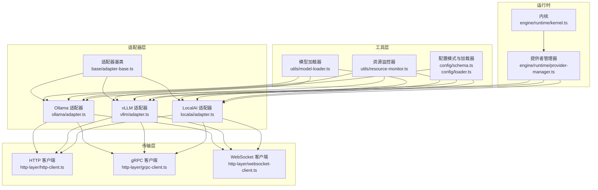
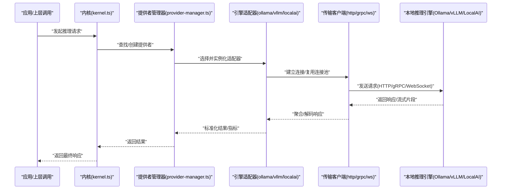
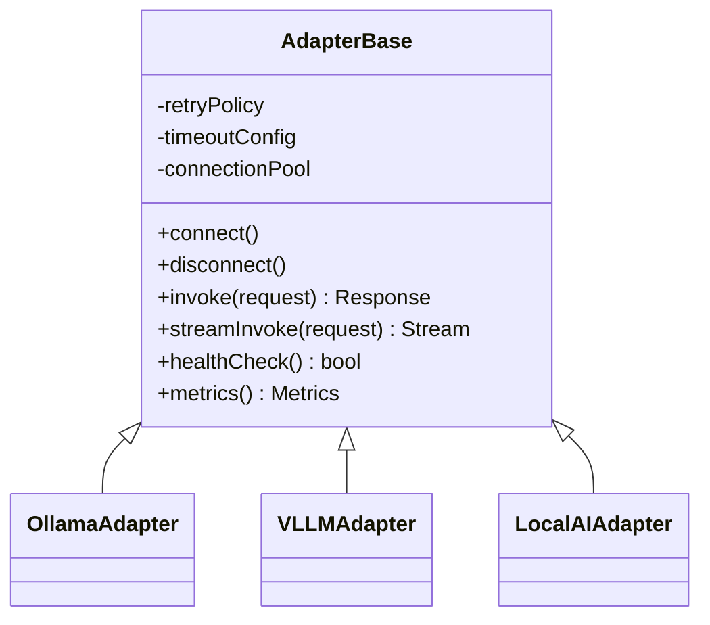
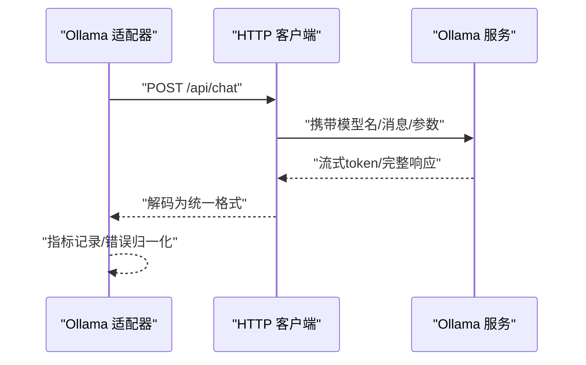
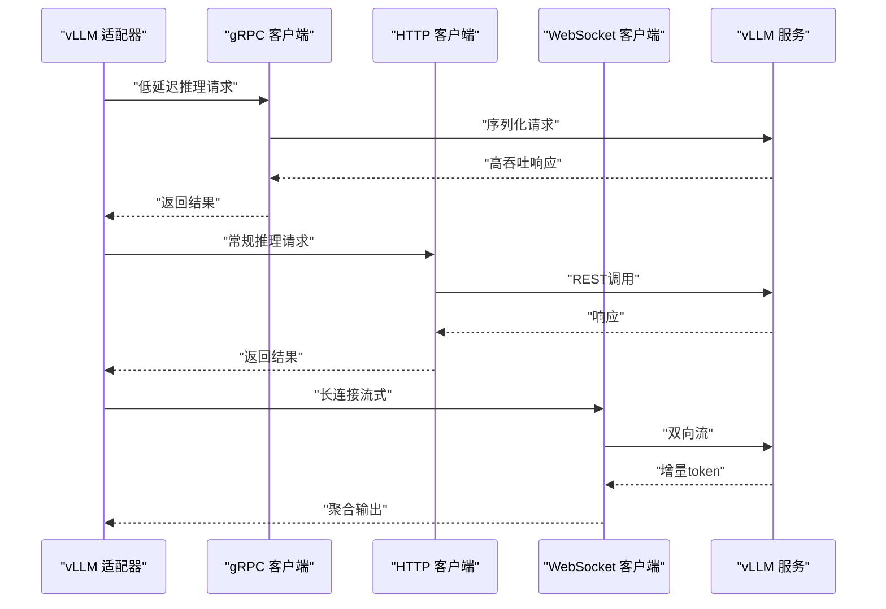
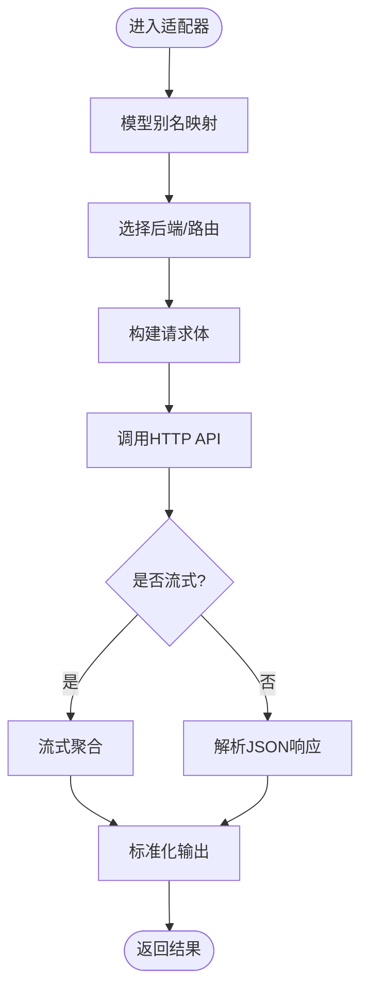
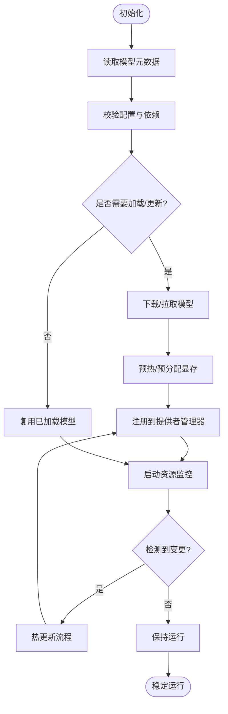
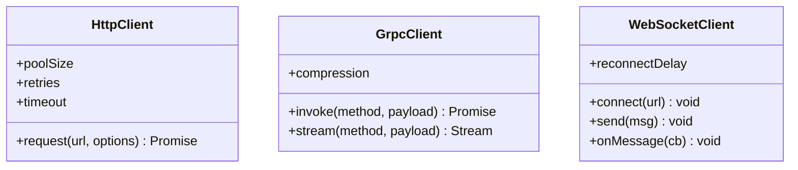
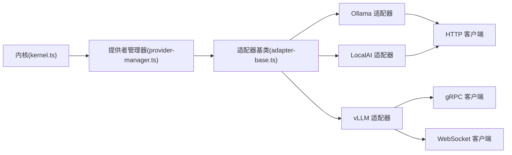

# 本地模型适配器

<cite>
**本文引用的文件**   
- [engine/packages/adapters/README.md](file://engine/packages/adapters/README.md)
- [engine/packages/adapters/package.json](file://engine/packages/adapters/package.json)
- [engine/packages/adapters/src/index.ts](file://engine/packages/adapters/src/index.ts)
- [engine/packages/adapters/src/types.ts](file://engine/packages/adapters/src/types.ts)
- [engine/packages/adapters/src/ollama/adapter.ts](file://engine/packages/adapters/src/ollama/adapter.ts)
- [engine/packages/adapters/src/vllm/adapter.ts](file://engine/packages/adapters/src/vllm/adapter.ts)
- [engine/packages/adapters/src/localai/adapter.ts](file://engine/packages/adapters/src/localai/adapter.ts)
- [engine/packages/adapters/src/base/adapter-base.ts](file://engine/packages/adapters/src/base/adapter-base.ts)
- [engine/packages/adapters/src/utils/model-loader.ts](file://engine/packages/adapters/src/utils/model-loader.ts)
- [engine/packages/adapters/src/utils/resource-monitor.ts](file://engine/packages/adapters/src/utils/resource-monitor.ts)
- [engine/packages/adapters/src/config/schema.ts](file://engine/packages/adapters/src/config/schema.ts)
- [engine/packages/adapters/src/config/loader.ts](file://engine/packages/adapters/src/config/loader.ts)
- [engine/packages/http-layer/src/client/http-client.ts](file://engine/packages/http-layer/src/client/http-client.ts)
- [engine/packages/http-layer/src/client/grpc-client.ts](file://engine/packages/http-layer/src/client/grpc-client.ts)
- [engine/packages/http-layer/src/client/websocket-client.ts](file://engine/packages/http-layer/src/client/websocket-client.ts)
- [engine/packages/engine/src/runtime/kernel.ts](file://engine/packages/engine/src/runtime/kernel.ts)
- [engine/packages/engine/src/runtime/provider-manager.ts](file://engine/packages/engine/src/runtime/provider-manager.ts)
- [engine/tests/auto-model-router.test.ts](file://engine/tests/auto-model-router.test.ts)
- [engine/tests/model-client.test.ts](file://engine/tests/model-client.test.ts)
- [engine/tests/http-server.test.ts](file://engine/tests/http-server.test.ts)
</cite>

## 目录
1. [简介](#简介)
2. [项目结构](#项目结构)
3. [核心组件](#核心组件)
4. [架构总览](#架构总览)
5. [详细组件分析](#详细组件分析)
6. [依赖关系分析](#依赖关系分析)
7. [性能考虑](#性能考虑)
8. [故障排除指南](#故障排除指南)
9. [结论](#结论)
10. [附录](#附录)

## 简介
本技术文档面向KCoder的“本地模型适配器”子系统，聚焦于将多种本地推理引擎（如Ollama、vLLM、LocalAI）统一接入到KCoder引擎中。文档覆盖：
- 支持的本地模型框架与集成方式
- 模型部署配置（GPU加速、内存管理、并发控制）
- 模型加载与管理机制（动态加载、热更新、资源监控）
- 与本地推理引擎的通信协议（HTTP API、gRPC、WebSocket）
- 不同模型的配置示例与性能调优建议
- 常见问题的故障排除手册

## 项目结构
本地模型适配器位于 engine/packages/adapters 下，采用“按能力分层 + 按引擎分模块”的组织方式：
- base：抽象基类与通用能力（连接池、重试、超时、指标上报等）
- ollama / vllm / localai：各引擎的具体适配实现
- utils：模型加载器、资源监控器等通用工具
- config：配置模式定义与加载器
- http-layer：统一的HTTP/gRPC/WebSocket客户端封装
- engine：运行时内核与提供者管理器，负责发现、注册、路由与生命周期管理

图表来源
- [engine/packages/adapters/src/base/adapter-base.ts](file://engine/packages/adapters/src/base/adapter-base.ts)
- [engine/packages/adapters/src/ollama/adapter.ts](file://engine/packages/adapters/src/ollama/adapter.ts)
- [engine/packages/adapters/src/vllm/adapter.ts](file://engine/packages/adapters/src/vllm/adapter.ts)
- [engine/packages/adapters/src/localai/adapter.ts](file://engine/packages/adapters/src/localai/adapter.ts)
- [engine/packages/adapters/src/utils/model-loader.ts](file://engine/packages/adapters/src/utils/model-loader.ts)
- [engine/packages/adapters/src/utils/resource-monitor.ts](file://engine/packages/adapters/src/utils/resource-monitor.ts)
- [engine/packages/adapters/src/config/schema.ts](file://engine/packages/adapters/src/config/schema.ts)
- [engine/packages/adapters/src/config/loader.ts](file://engine/packages/adapters/src/config/loader.ts)
- [engine/packages/http-layer/src/client/http-client.ts](file://engine/packages/http-layer/src/client/http-client.ts)
- [engine/packages/http-layer/src/client/grpc-client.ts](file://engine/packages/http-layer/src/client/grpc-client.ts)
- [engine/packages/http-layer/src/client/websocket-client.ts](file://engine/packages/http-layer/src/client/websocket-client.ts)
- [engine/packages/engine/src/runtime/kernel.ts](file://engine/packages/engine/src/runtime/kernel.ts)
- [engine/packages/engine/src/runtime/provider-manager.ts](file://engine/packages/engine/src/runtime/provider-manager.ts)

章节来源
- [engine/packages/adapters/README.md](file://engine/packages/adapters/README.md)
- [engine/packages/adapters/package.json](file://engine/packages/adapters/package.json)

## 核心组件
- 适配器基类：提供统一的连接管理、重试与退避、超时控制、指标采集、错误归一化等能力，所有具体引擎适配器均继承该基类。
- 引擎适配器：针对Ollama、vLLM、LocalAI分别实现协议细节、参数映射、流式响应处理与错误码转换。
- 模型加载器：负责模型元数据解析、按需下载/预热、版本选择与缓存策略。
- 资源监控器：采集CPU/GPU/显存/进程句柄等指标，触发告警与自动降级。
- 配置系统：基于schema校验的配置加载器，支持多环境、热重载与默认值合并。
- 传输客户端：对HTTP、gRPC、WebSocket进行统一封装，提供连接池、重试、熔断与可观测性。
- 运行时集成：内核与提供者管理器负责适配器的注册、发现、路由与生命周期管理。

章节来源
- [engine/packages/adapters/src/base/adapter-base.ts](file://engine/packages/adapters/src/base/adapter-base.ts)
- [engine/packages/adapters/src/ollama/adapter.ts](file://engine/packages/adapters/src/ollama/adapter.ts)
- [engine/packages/adapters/src/vllm/adapter.ts](file://engine/packages/adapters/src/vllm/adapter.ts)
- [engine/packages/adapters/src/localai/adapter.ts](file://engine/packages/adapters/src/localai/adapter.ts)
- [engine/packages/adapters/src/utils/model-loader.ts](file://engine/packages/adapters/src/utils/model-loader.ts)
- [engine/packages/adapters/src/utils/resource-monitor.ts](file://engine/packages/adapters/src/utils/resource-monitor.ts)
- [engine/packages/adapters/src/config/schema.ts](file://engine/packages/adapters/src/config/schema.ts)
- [engine/packages/adapters/src/config/loader.ts](file://engine/packages/adapters/src/config/loader.ts)
- [engine/packages/http-layer/src/client/http-client.ts](file://engine/packages/http-layer/src/client/http-client.ts)
- [engine/packages/http-layer/src/client/grpc-client.ts](file://engine/packages/http-layer/src/client/grpc-client.ts)
- [engine/packages/http-layer/src/client/websocket-client.ts](file://engine/packages/http-layer/src/client/websocket-client.ts)
- [engine/packages/engine/src/runtime/kernel.ts](file://engine/packages/engine/src/runtime/kernel.ts)
- [engine/packages/engine/src/runtime/provider-manager.ts](file://engine/packages/engine/src/runtime/provider-manager.ts)

## 架构总览
下图展示了从上层调用到本地推理引擎的端到端流程，包括请求路由、适配器选择、传输层调用与结果回传。

图表来源
- [engine/packages/engine/src/runtime/kernel.ts](file://engine/packages/engine/src/runtime/kernel.ts)
- [engine/packages/engine/src/runtime/provider-manager.ts](file://engine/packages/engine/src/runtime/provider-manager.ts)
- [engine/packages/adapters/src/ollama/adapter.ts](file://engine/packages/adapters/src/ollama/adapter.ts)
- [engine/packages/adapters/src/vllm/adapter.ts](file://engine/packages/adapters/src/vllm/adapter.ts)
- [engine/packages/adapters/src/localai/adapter.ts](file://engine/packages/adapters/src/localai/adapter.ts)
- [engine/packages/http-layer/src/client/http-client.ts](file://engine/packages/http-layer/src/client/http-client.ts)
- [engine/packages/http-layer/src/client/grpc-client.ts](file://engine/packages/http-layer/src/client/grpc-client.ts)
- [engine/packages/http-layer/src/client/websocket-client.ts](file://engine/packages/http-layer/src/client/websocket-client.ts)

## 详细组件分析

### 适配器基类与类型契约
- 职责：定义统一的适配器接口、连接生命周期、重试/超时/熔断策略、指标上报、错误归一化。
- 关键点：
  - 连接池与最大并发限制
  - 指数退避与快速失败
  - 结构化错误码与诊断信息
  - 可插拔的中间件（日志、追踪、限流）

图表来源
- [engine/packages/adapters/src/base/adapter-base.ts](file://engine/packages/adapters/src/base/adapter-base.ts)
- [engine/packages/adapters/src/ollama/adapter.ts](file://engine/packages/adapters/src/ollama/adapter.ts)
- [engine/packages/adapters/src/vllm/adapter.ts](file://engine/packages/adapters/src/vllm/adapter.ts)
- [engine/packages/adapters/src/localai/adapter.ts](file://engine/packages/adapters/src/localai/adapter.ts)

章节来源
- [engine/packages/adapters/src/types.ts](file://engine/packages/adapters/src/types.ts)
- [engine/packages/adapters/src/base/adapter-base.ts](file://engine/packages/adapters/src/base/adapter-base.ts)

### Ollama 适配器
- 协议：优先使用HTTP API；在特定场景下可通过gRPC或WebSocket扩展。
- 关键特性：
  - 模型名称映射与上下文长度对齐
  - 流式生成与增量输出
  - GPU设备选择与批大小控制
  - 健康检查与自动重连

图表来源
- [engine/packages/adapters/src/ollama/adapter.ts](file://engine/packages/adapters/src/ollama/adapter.ts)
- [engine/packages/http-layer/src/client/http-client.ts](file://engine/packages/http-layer/src/client/http-client.ts)

章节来源
- [engine/packages/adapters/src/ollama/adapter.ts](file://engine/packages/adapters/src/ollama/adapter.ts)

### vLLM 适配器
- 协议：HTTP API为主，支持gRPC以获取更低延迟；WebSocket用于长连接流式场景。
- 关键特性：
  - 张量并行与流水线并行参数映射
  - KV缓存与连续批处理优化
  - 显存水位监控与自适应降速
  - 批量请求与优先级队列

图表来源
- [engine/packages/adapters/src/vllm/adapter.ts](file://engine/packages/adapters/src/vllm/adapter.ts)
- [engine/packages/http-layer/src/client/grpc-client.ts](file://engine/packages/http-layer/src/client/grpc-client.ts)
- [engine/packages/http-layer/src/client/http-client.ts](file://engine/packages/http-layer/src/client/http-client.ts)
- [engine/packages/http-layer/src/client/websocket-client.ts](file://engine/packages/http-layer/src/client/websocket-client.ts)

章节来源
- [engine/packages/adapters/src/vllm/adapter.ts](file://engine/packages/adapters/src/vllm/adapter.ts)

### LocalAI 适配器
- 协议：兼容OpenAI风格的HTTP API，便于无缝迁移。
- 关键特性：
  - 模型别名与后端路由
  - 多后端切换与负载均衡
  - 流式与非流式统一封装
  - 错误码映射与重试策略

图表来源
- [engine/packages/adapters/src/localai/adapter.ts](file://engine/packages/adapters/src/localai/adapter.ts)
- [engine/packages/http-layer/src/client/http-client.ts](file://engine/packages/http-layer/src/client/http-client.ts)

章节来源
- [engine/packages/adapters/src/localai/adapter.ts](file://engine/packages/adapters/src/localai/adapter.ts)

### 模型加载与管理机制
- 动态加载：根据请求上下文与策略选择模型，支持多版本并存与灰度发布。
- 热更新：在不中断服务的情况下替换模型权重或调整参数，通过提供者管理器滚动重启适配器实例。
- 资源监控：采集GPU显存、CPU占用、I/O等待等指标，结合阈值触发扩容或降级。

图表来源
- [engine/packages/adapters/src/utils/model-loader.ts](file://engine/packages/adapters/src/utils/model-loader.ts)
- [engine/packages/engine/src/runtime/provider-manager.ts](file://engine/packages/engine/src/runtime/provider-manager.ts)
- [engine/packages/adapters/src/utils/resource-monitor.ts](file://engine/packages/adapters/src/utils/resource-monitor.ts)

章节来源
- [engine/packages/adapters/src/utils/model-loader.ts](file://engine/packages/adapters/src/utils/model-loader.ts)
- [engine/packages/adapters/src/utils/resource-monitor.ts](file://engine/packages/adapters/src/utils/resource-monitor.ts)
- [engine/packages/engine/src/runtime/provider-manager.ts](file://engine/packages/engine/src/runtime/provider-manager.ts)

### 配置系统与示例
- 配置模式：通过schema定义字段、类型、默认值与约束，loader负责合并多源配置与环境变量注入。
- 典型字段：
  - 基础连接：地址、端口、认证、超时、重试次数
  - 模型参数：上下文长度、温度、TopP、最大生成长度
  - 资源限制：最大并发、批大小、显存上限、GPU设备ID
  - 高级选项：启用流式、启用缓存、启用追踪
- 示例路径（不含代码内容）：
  - Ollama配置示例：[engine/packages/adapters/src/config/schema.ts](file://engine/packages/adapters/src/config/schema.ts)
  - vLLM配置示例：[engine/packages/adapters/src/config/schema.ts](file://engine/packages/adapters/src/config/schema.ts)
  - LocalAI配置示例：[engine/packages/adapters/src/config/schema.ts](file://engine/packages/adapters/src/config/schema.ts)

章节来源
- [engine/packages/adapters/src/config/schema.ts](file://engine/packages/adapters/src/config/schema.ts)
- [engine/packages/adapters/src/config/loader.ts](file://engine/packages/adapters/src/config/loader.ts)

### 传输层客户端
- HTTP客户端：连接池、重试、熔断、指标上报、超时控制。
- gRPC客户端：低延迟通道、流式双向通信、压缩与背压。
- WebSocket客户端：长连接、心跳保活、断线重连、消息分片。

图表来源
- [engine/packages/http-layer/src/client/http-client.ts](file://engine/packages/http-layer/src/client/http-client.ts)
- [engine/packages/http-layer/src/client/grpc-client.ts](file://engine/packages/http-layer/src/client/grpc-client.ts)
- [engine/packages/http-layer/src/client/websocket-client.ts](file://engine/packages/http-layer/src/client/websocket-client.ts)

章节来源
- [engine/packages/http-layer/src/client/http-client.ts](file://engine/packages/http-layer/src/client/http-client.ts)
- [engine/packages/http-layer/src/client/grpc-client.ts](file://engine/packages/http-layer/src/client/grpc-client.ts)
- [engine/packages/http-layer/src/client/websocket-client.ts](file://engine/packages/http-layer/src/client/websocket-client.ts)

## 依赖关系分析
- 耦合与内聚：
  - 适配器与传输层解耦，通过统一接口调用，提升可测试性与可替换性。
  - 配置与加载器独立，便于单元测试与多环境验证。
  - 运行时内核与适配器通过提供者管理器交互，避免直接依赖。
- 外部依赖：
  - Ollama/vLLM/LocalAI服务作为外部系统，需保证可用性与版本兼容性。
  - 操作系统级GPU驱动与CUDA/cuDNN版本匹配。

图表来源
- [engine/packages/engine/src/runtime/kernel.ts](file://engine/packages/engine/src/runtime/kernel.ts)
- [engine/packages/engine/src/runtime/provider-manager.ts](file://engine/packages/engine/src/runtime/provider-manager.ts)
- [engine/packages/adapters/src/base/adapter-base.ts](file://engine/packages/adapters/src/base/adapter-base.ts)
- [engine/packages/adapters/src/ollama/adapter.ts](file://engine/packages/adapters/src/ollama/adapter.ts)
- [engine/packages/adapters/src/vllm/adapter.ts](file://engine/packages/adapters/src/vllm/adapter.ts)
- [engine/packages/adapters/src/localai/adapter.ts](file://engine/packages/adapters/src/localai/adapter.ts)
- [engine/packages/http-layer/src/client/http-client.ts](file://engine/packages/http-layer/src/client/http-client.ts)
- [engine/packages/http-layer/src/client/grpc-client.ts](file://engine/packages/http-layer/src/client/grpc-client.ts)
- [engine/packages/http-layer/src/client/websocket-client.ts](file://engine/packages/http-layer/src/client/websocket-client.ts)

章节来源
- [engine/packages/engine/src/runtime/kernel.ts](file://engine/packages/engine/src/runtime/kernel.ts)
- [engine/packages/engine/src/runtime/provider-manager.ts](file://engine/packages/engine/src/runtime/provider-manager.ts)
- [engine/packages/adapters/src/base/adapter-base.ts](file://engine/packages/adapters/src/base/adapter-base.ts)

## 性能考虑
- GPU加速设置：
  - 合理设置批大小与上下文长度，避免显存碎片化。
  - 启用KV缓存与连续批处理（vLLM），降低重复计算开销。
  - 多卡并行时注意负载均衡与通信开销。
- 内存管理：
  - 监控显存水位，超过阈值时触发降级（减少并发或缩短上下文）。
  - 及时释放未使用的模型实例，避免内存泄漏。
- 并发控制：
  - 基于令牌桶或漏桶算法限制QPS，防止过载。
  - 区分高优先级与低优先级请求，保障关键任务SLA。
- 网络与序列化：
  - 使用gRPC替代HTTP以降低延迟与序列化开销。
  - 开启压缩与连接复用，减少握手成本。
- 指标与可观测性：
  - 采集P95/P99延迟、吞吐、错误率、资源利用率。
  - 结合分布式追踪定位瓶颈。

## 故障排除指南
- 模型加载失败：
  - 检查模型名称与版本是否正确，确认远程仓库可达。
  - 查看加载器日志中的校验错误与依赖缺失提示。
  - 参考：[engine/packages/adapters/src/utils/model-loader.ts](file://engine/packages/adapters/src/utils/model-loader.ts)
- 内存溢出（OOM）：
  - 降低批大小与上下文长度，增加显存上限阈值。
  - 启用显存监控与自动回收，观察资源监控器告警。
  - 参考：[engine/packages/adapters/src/utils/resource-monitor.ts](file://engine/packages/adapters/src/utils/resource-monitor.ts)
- 推理超时：
  - 调整超时与重试策略，确保传输层与适配器层一致。
  - 检查网络拥塞与服务端负载，必要时切换到gRPC。
  - 参考：[engine/packages/http-layer/src/client/http-client.ts](file://engine/packages/http-layer/src/client/http-client.ts)、[engine/packages/http-layer/src/client/grpc-client.ts](file://engine/packages/http-layer/src/client/grpc-client.ts)
- 连接不稳定：
  - 启用WebSocket心跳与断线重连，检查防火墙与代理设置。
  - 参考：[engine/packages/http-layer/src/client/websocket-client.ts](file://engine/packages/http-layer/src/client/websocket-client.ts)
- 路由与提供者问题：
  - 验证提供者注册与健康检查状态，确认内核路由策略正确。
  - 参考：[engine/packages/engine/src/runtime/provider-manager.ts](file://engine/packages/engine/src/runtime/provider-manager.ts)、[engine/packages/engine/src/runtime/kernel.ts](file://engine/packages/engine/src/runtime/kernel.ts)
- 自动化测试辅助：
  - 使用现有测试用例复现问题，定位回归点。
  - 参考：[engine/tests/auto-model-router.test.ts](file://engine/tests/auto-model-router.test.ts)、[engine/tests/model-client.test.ts](file://engine/tests/model-client.test.ts)、[engine/tests/http-server.test.ts](file://engine/tests/http-server.test.ts)

章节来源
- [engine/packages/adapters/src/utils/model-loader.ts](file://engine/packages/adapters/src/utils/model-loader.ts)
- [engine/packages/adapters/src/utils/resource-monitor.ts](file://engine/packages/adapters/src/utils/resource-monitor.ts)
- [engine/packages/http-layer/src/client/http-client.ts](file://engine/packages/http-layer/src/client/http-client.ts)
- [engine/packages/http-layer/src/client/grpc-client.ts](file://engine/packages/http-layer/src/client/grpc-client.ts)
- [engine/packages/http-layer/src/client/websocket-client.ts](file://engine/packages/http-layer/src/client/websocket-client.ts)
- [engine/packages/engine/src/runtime/provider-manager.ts](file://engine/packages/engine/src/runtime/provider-manager.ts)
- [engine/packages/engine/src/runtime/kernel.ts](file://engine/packages/engine/src/runtime/kernel.ts)
- [engine/tests/auto-model-router.test.ts](file://engine/tests/auto-model-router.test.ts)
- [engine/tests/model-client.test.ts](file://engine/tests/model-client.test.ts)
- [engine/tests/http-server.test.ts](file://engine/tests/http-server.test.ts)

## 结论
本地模型适配器通过统一的抽象与传输层封装，将Ollama、vLLM、LocalAI等本地推理引擎无缝接入KCoder引擎。借助模型加载器与资源监控器，系统实现了动态加载、热更新与稳定的资源治理。配合完善的配置系统与可观测性，可在不同硬件与业务场景下取得良好的性能与可靠性表现。

## 附录
- 最佳实践清单：
  - 在生产环境启用指标与追踪，定期审查SLO与容量规划。
  - 对关键模型进行灰度发布与A/B测试，逐步放量。
  - 制定回滚策略与应急预案，确保故障快速恢复。
- 相关入口与说明：
  - 适配器包概览与使用说明：[engine/packages/adapters/README.md](file://engine/packages/adapters/README.md)
  - 包依赖与脚本：[engine/packages/adapters/package.json](file://engine/packages/adapters/package.json)