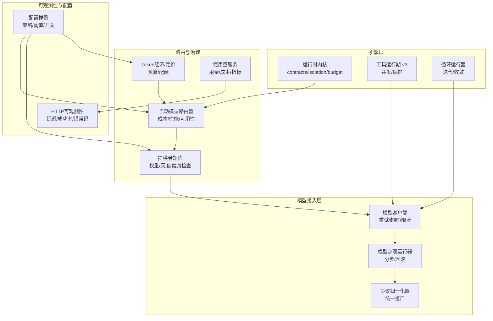
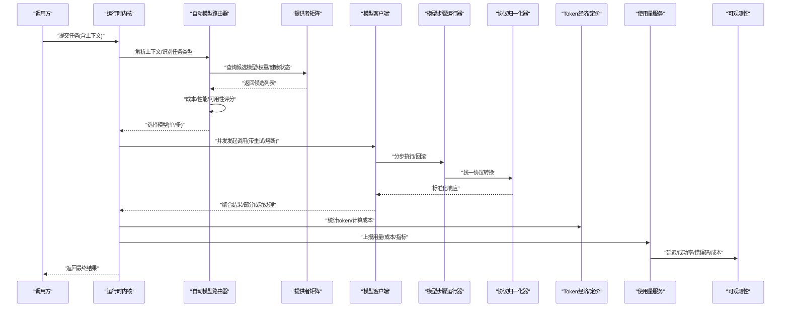
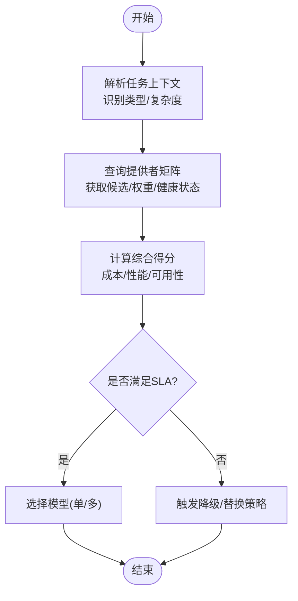
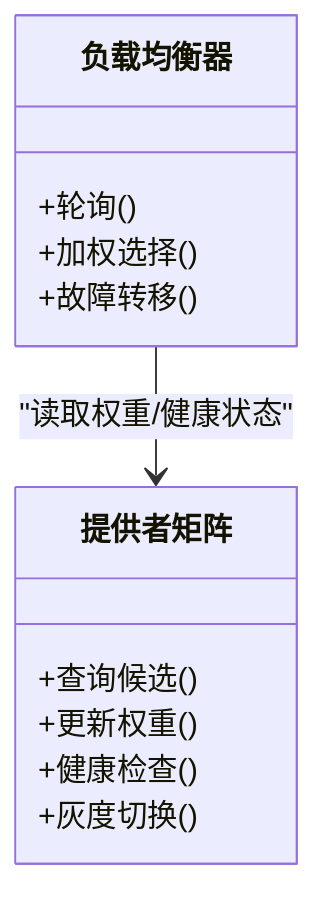
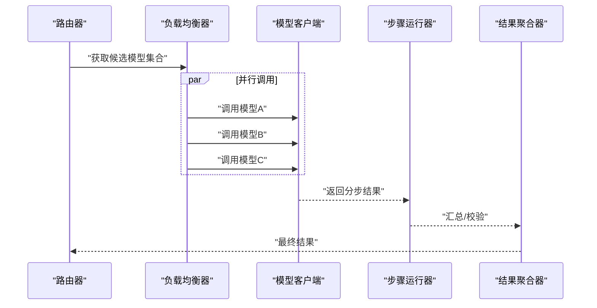
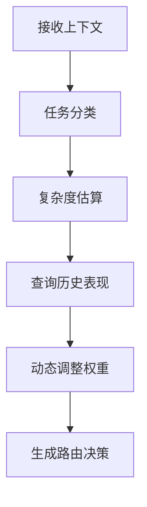
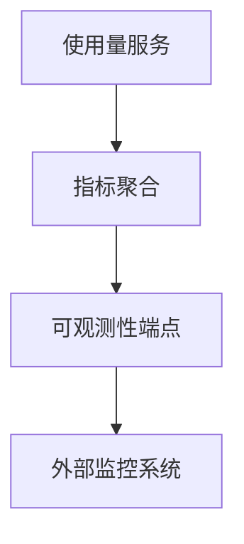
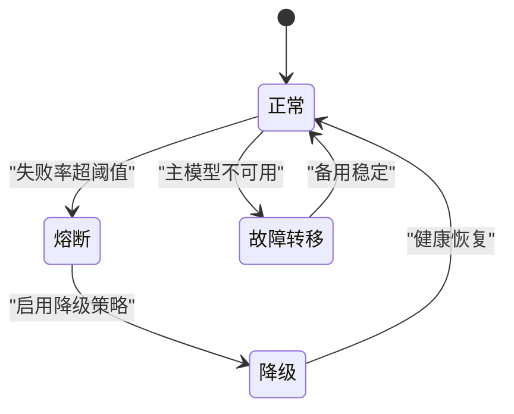
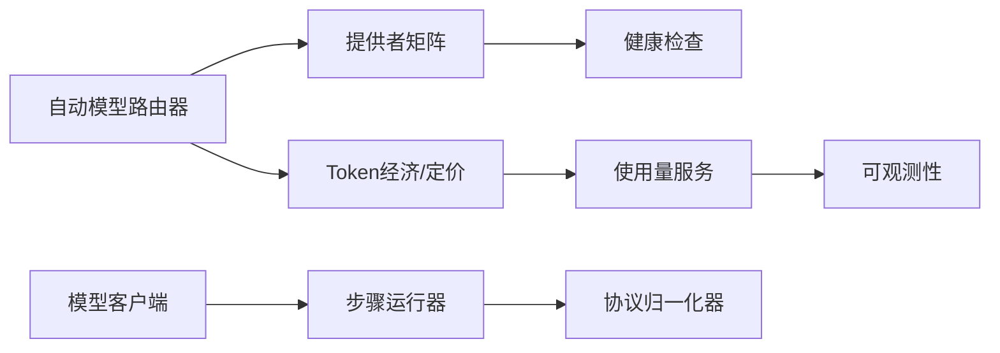

# 模型路由和负载均衡

<cite>
**本文引用的文件**   
- [auto-model-router.test.ts](file://engine/tests/auto-model-router.test.ts)
- [model-client.test.ts](file://engine/tests/model-client.test.ts)
- [runtime-kernel-provider-matrix.test.ts](file://engine/tests/runtime-kernel-provider-matrix.test.ts)
- [token-economy.test.ts](file://engine/tests/token-economy.test.ts)
- [deepseek-pricing.test.ts](file://engine/tests/deepseek-pricing.test.ts)
- [usage-service.test.ts](file://engine/tests/usage-service.test.ts)
- [http-server-observability.test.ts](file://engine/tests/http-server-observability.test.ts)
- [compaction-governor.test.ts](file://engine/tests/compaction-governor.test.ts)
- [continuation-policy.test.ts](file://engine/tests/continuation-policy.test.ts)
- [loop-runner.test.ts](file://engine/tests/loop-runner.test.ts)
- [tool-runtime-v3.test.ts](file://engine/tests/tool-runtime-v3.test.ts)
- [kernel-v3-provider-governance.test.ts](file://engine/tests/kernel-v3-provider-governance.test.ts)
- [runtime-kernel-crash-recovery.test.ts](file://engine/tests/runtime-kernel-crash-recovery.test.ts)
- [runtime-kernel-contracts.test.ts](file://engine/tests/runtime-kernel-contracts.test.ts)
- [runtime-kernel-isolation.test.ts](file://engine/tests/runtime-kernel-isolation.test.ts)
- [runtime-kernel-parity.test.ts](file://engine/tests/runtime-kernel-parity.test.ts)
- [runtime-kernel.test.ts](file://engine/tests/runtime-kernel.test.ts)
- [runtime-kernel-budget.test.ts](file://engine/tests/runtime-kernel-budget.test.ts)
- [runtime-middleware-governance.test.ts](file://engine/tests/runtime-middleware-governance.test.ts)
- [runtime-rollout.test.ts](file://engine/tests/runtime-rollout.test.ts)
- [provider-compatibility.test.ts](file://engine/tests/provider-compatibility.test.ts)
- [model-proposal.test.ts](file://engine/tests/model-proposal.test.ts)
- [model-step-runner.test.ts](file://engine/tests/model-step-runner.test.ts)
- [model-history-repair.test.ts](file://engine/tests/model-history-repair.test.ts)
- [model-protocol-normalizer.test.ts](file://engine/tests/model-protocol-normalizer.test.ts)
- [config.example.json](file://engine/config.example.json)
</cite>

## 目录
1. [简介](#简介)
2. [项目结构](#项目结构)
3. [核心组件](#核心组件)
4. [架构总览](#架构总览)
5. [详细组件分析](#详细组件分析)
6. [依赖关系分析](#依赖关系分析)
7. [性能考量](#性能考量)
8. [故障排查指南](#故障排查指南)
9. [结论](#结论)
10. [附录](#附录)

## 简介
本技术文档聚焦于KCoder的“模型路由与负载均衡”子系统，围绕以下目标展开：
- 自动模型选择策略：基于成本、性能、可用性的智能路由算法。
- 负载均衡机制：轮询、加权分配、健康检查、故障转移。
- 多模型并行调用与结果聚合：并发请求调度与响应合并。
- 上下文感知路由：任务类型识别、复杂度评估、历史表现分析。
- 性能监控与指标收集：延迟统计、成功率、成本追踪。
- 配置示例与自定义路由策略开发指南。
- 故障恢复与降级策略实现方案。

说明：由于仓库中未提供该子系统的源码实现，本文以测试用例与配置样例为依据进行架构与行为推断，并给出可落地的设计与实现建议。

## 项目结构
与模型路由和负载均衡相关的代码主要位于 engine 模块的 tests 目录与配置文件中，涵盖：
- 自动模型路由与提供者矩阵（路由决策、权重、灰度）
- 模型客户端与步骤执行（并发、重试、熔断）
- Token经济与定价（成本计算与预算控制）
- 使用量服务与可观测性（指标采集与上报）
- 压缩治理与延续策略（上下文管理与资源约束）
- 运行时内核契约与隔离（稳定性与一致性保障）
- 配置样例（环境变量与策略参数）

图表来源
- [runtime-kernel-contracts.test.ts](file://engine/tests/runtime-kernel-contracts.test.ts)
- [runtime-kernel-isolation.test.ts](file://engine/tests/runtime-kernel-isolation.test.ts)
- [runtime-kernel-budget.test.ts](file://engine/tests/runtime-kernel-budget.test.ts)
- [tool-runtime-v3.test.ts](file://engine/tests/tool-runtime-v3.test.ts)
- [loop-runner.test.ts](file://engine/tests/loop-runner.test.ts)
- [model-client.test.ts](file://engine/tests/model-client.test.ts)
- [model-step-runner.test.ts](file://engine/tests/model-step-runner.test.ts)
- [model-protocol-normalizer.test.ts](file://engine/tests/model-protocol-normalizer.test.ts)
- [auto-model-router.test.ts](file://engine/tests/auto-model-router.test.ts)
- [runtime-kernel-provider-matrix.test.ts](file://engine/tests/runtime-kernel-provider-matrix.test.ts)
- [token-economy.test.ts](file://engine/tests/token-economy.test.ts)
- [deepseek-pricing.test.ts](file://engine/tests/deepseek-pricing.test.ts)
- [usage-service.test.ts](file://engine/tests/usage-service.test.ts)
- [http-server-observability.test.ts](file://engine/tests/http-server-observability.test.ts)
- [config.example.json](file://engine/config.example.json)

章节来源
- [auto-model-router.test.ts](file://engine/tests/auto-model-router.test.ts)
- [runtime-kernel-provider-matrix.test.ts](file://engine/tests/runtime-kernel-provider-matrix.test.ts)
- [model-client.test.ts](file://engine/tests/model-client.test.ts)
- [model-step-runner.test.ts](file://engine/tests/model-step-runner.test.ts)
- [model-protocol-normalizer.test.ts](file://engine/tests/model-protocol-normalizer.test.ts)
- [token-economy.test.ts](file://engine/tests/token-economy.test.ts)
- [deepseek-pricing.test.ts](file://engine/tests/deepseek-pricing.test.ts)
- [usage-service.test.ts](file://engine/tests/usage-service.test.ts)
- [http-server-observability.test.ts](file://engine/tests/http-server-observability.test.ts)
- [config.example.json](file://engine/config.example.json)

## 核心组件
- 自动模型路由器：根据任务上下文、成本、性能与可用性评分，选择最优或候选模型集合。
- 提供者矩阵：维护各模型/供应商的权重、灰度比例、健康状态与容量上限。
- 模型客户端：封装网络调用、重试、超时、熔断、退避等通用能力。
- 模型步骤运行器：将复杂任务拆分为步骤，支持分步执行与回滚。
- 协议归一化器：屏蔽不同模型的协议差异，提供统一输入输出。
- Token经济与定价：计算token用量与费用，结合预算与配额进行控制。
- 使用量服务与可观测性：采集延迟、成功率、错误率、成本等指标并上报。
- 压缩治理与延续策略：在长上下文中进行压缩与续写，避免超限与抖动。
- 运行时内核契约与隔离：保证路由与调度的原子性、幂等性与隔离性。

章节来源
- [auto-model-router.test.ts](file://engine/tests/auto-model-router.test.ts)
- [runtime-kernel-provider-matrix.test.ts](file://engine/tests/runtime-kernel-provider-matrix.test.ts)
- [model-client.test.ts](file://engine/tests/model-client.test.ts)
- [model-step-runner.test.ts](file://engine/tests/model-step-runner.test.ts)
- [model-protocol-normalizer.test.ts](file://engine/tests/model-protocol-normalizer.test.ts)
- [token-economy.test.ts](file://engine/tests/token-economy.test.ts)
- [deepseek-pricing.test.ts](file://engine/tests/deepseek-pricing.test.ts)
- [usage-service.test.ts](file://engine/tests/usage-service.test.ts)
- [http-server-observability.test.ts](file://engine/tests/http-server-observability.test.ts)
- [compaction-governor.test.ts](file://engine/tests/compaction-governor.test.ts)
- [continuation-policy.test.ts](file://engine/tests/continuation-policy.test.ts)
- [runtime-kernel-contracts.test.ts](file://engine/tests/runtime-kernel-contracts.test.ts)
- [runtime-kernel-isolation.test.ts](file://engine/tests/runtime-kernel-isolation.test.ts)

## 架构总览
下图展示了从请求进入、上下文解析、路由决策、负载均衡、并发执行到结果聚合与指标上报的整体流程。

图表来源
- [auto-model-router.test.ts](file://engine/tests/auto-model-router.test.ts)
- [runtime-kernel-provider-matrix.test.ts](file://engine/tests/runtime-kernel-provider-matrix.test.ts)
- [model-client.test.ts](file://engine/tests/model-client.test.ts)
- [model-step-runner.test.ts](file://engine/tests/model-step-runner.test.ts)
- [model-protocol-normalizer.test.ts](file://engine/tests/model-protocol-normalizer.test.ts)
- [token-economy.test.ts](file://engine/tests/token-economy.test.ts)
- [deepseek-pricing.test.ts](file://engine/tests/deepseek-pricing.test.ts)
- [usage-service.test.ts](file://engine/tests/usage-service.test.ts)
- [http-server-observability.test.ts](file://engine/tests/http-server-observability.test.ts)

## 详细组件分析

### 自动模型选择策略（成本/性能/可用性）
- 策略要点
  - 成本维度：按token计价与预算约束，优先低成本模型；对高价值任务允许溢价。
  - 性能维度：依据延迟分布、吞吐、错误率动态调整权重。
  - 可用性维度：健康检查、熔断、降级、故障转移。
- 决策流程
  - 输入：任务上下文、SLA要求、预算上限、历史表现。
  - 评分：成本得分、性能得分、可用性得分，加权求和。
  - 输出：单一模型或候选集（用于并行/仲裁）。
- 关键实现参考
  - 自动路由与提供者矩阵的行为由测试覆盖，体现权重、灰度与健康检查。
  - 定价与预算逻辑通过Token经济与DeepSeek定价测试验证。

图表来源
- [auto-model-router.test.ts](file://engine/tests/auto-model-router.test.ts)
- [runtime-kernel-provider-matrix.test.ts](file://engine/tests/runtime-kernel-provider-matrix.test.ts)
- [token-economy.test.ts](file://engine/tests/token-economy.test.ts)
- [deepseek-pricing.test.ts](file://engine/tests/deepseek-pricing.test.ts)

章节来源
- [auto-model-router.test.ts](file://engine/tests/auto-model-router.test.ts)
- [runtime-kernel-provider-matrix.test.ts](file://engine/tests/runtime-kernel-provider-matrix.test.ts)
- [token-economy.test.ts](file://engine/tests/token-economy.test.ts)
- [deepseek-pricing.test.ts](file://engine/tests/deepseek-pricing.test.ts)

### 负载均衡机制（轮询/加权/健康检查/故障转移）
- 轮询与加权
  - 基础轮询用于均匀分发；加权分配依据历史成功率与延迟动态调整。
- 健康检查
  - 周期性探测各模型端点，失败次数超过阈值则标记不健康。
- 故障转移
  - 主模型不可用时，自动切换到次优模型；支持快速回切。
- 灰度发布
  - 小流量引入新模型，逐步放量，异常时快速回滚。

图表来源
- [runtime-kernel-provider-matrix.test.ts](file://engine/tests/runtime-kernel-provider-matrix.test.ts)
- [auto-model-router.test.ts](file://engine/tests/auto-model-router.test.ts)

章节来源
- [runtime-kernel-provider-matrix.test.ts](file://engine/tests/runtime-kernel-provider-matrix.test.ts)
- [auto-model-router.test.ts](file://engine/tests/auto-model-router.test.ts)

### 多模型并行调用与结果聚合
- 并发策略
  - 对候选模型集合并行发起请求，设置超时与最大等待时间。
- 结果聚合
  - 多数投票/最佳质量优先/最早返回优先等策略可选。
- 容错
  - 部分失败不影响整体，继续等待其他模型响应。
- 参考实现
  - 模型客户端与步骤运行器的并发与重试行为在测试中覆盖。

图表来源
- [model-client.test.ts](file://engine/tests/model-client.test.ts)
- [model-step-runner.test.ts](file://engine/tests/model-step-runner.test.ts)

章节来源
- [model-client.test.ts](file://engine/tests/model-client.test.ts)
- [model-step-runner.test.ts](file://engine/tests/model-step-runner.test.ts)

### 上下文感知路由（任务类型/复杂度/历史表现）
- 任务类型识别
  - 基于提示词特征、工具调用模式、历史标签进行分类。
- 复杂度评估
  - 估算token规模、推理深度、工具调用数量。
- 历史表现分析
  - 记录各模型在不同任务类型的成功率、延迟、成本，作为权重修正因子。
- 参考实现
  - 循环运行器与工具运行期v3体现了复杂任务的编排与收敛判断。

图表来源
- [loop-runner.test.ts](file://engine/tests/loop-runner.test.ts)
- [tool-runtime-v3.test.ts](file://engine/tests/tool-runtime-v3.test.ts)

章节来源
- [loop-runner.test.ts](file://engine/tests/loop-runner.test.ts)
- [tool-runtime-v3.test.ts](file://engine/tests/tool-runtime-v3.test.ts)

### 性能监控与指标收集（延迟/成功率/成本）
- 指标项
  - 延迟分布（P50/P90/P99）、成功率、错误码分布、每模型成本、总预算消耗。
- 采集与上报
  - 使用量服务聚合指标，HTTP可观测性暴露端点供外部系统拉取。
- 参考实现
  - 使用量服务与HTTP可观测性测试覆盖了指标采集与上报路径。

图表来源
- [usage-service.test.ts](file://engine/tests/usage-service.test.ts)
- [http-server-observability.test.ts](file://engine/tests/http-server-observability.test.ts)

章节来源
- [usage-service.test.ts](file://engine/tests/usage-service.test.ts)
- [http-server-observability.test.ts](file://engine/tests/http-server-observability.test.ts)

### 配置示例与自定义路由策略
- 配置项建议
  - 路由策略：成本权重、性能权重、可用性权重、SLA阈值。
  - 负载均衡：轮询开关、权重表、健康检查间隔、熔断阈值。
  - 并发与超时：最大并发、请求超时、重试次数、退避策略。
  - 预算与配额：日/月预算、单任务预算上限、超额告警。
  - 灰度与回滚：灰度比例、回滚条件、观察窗口。
- 自定义策略
  - 扩展评分函数：新增业务维度（如合规、地域、数据主权）。
  - 插件化路由：注册新的路由策略实现，热加载生效。
- 参考配置
  - 配置文件样例提供了策略参数的结构与默认值。

章节来源
- [config.example.json](file://engine/config.example.json)

### 故障恢复与降级策略
- 健康检查与熔断
  - 连续失败达到阈值后熔断，降低负载并触发告警。
- 故障转移
  - 主模型不可用，自动切换到备用模型；支持快速回切。
- 降级策略
  - 简化任务（减少上下文长度、关闭高级功能）、使用轻量模型。
- 压缩与延续
  - 长上下文压缩治理，避免超限；延续策略保证会话连续性。
- 参考实现
  - 压缩治理、延续策略、崩溃恢复与内核契约测试覆盖相关路径。

图表来源
- [compaction-governor.test.ts](file://engine/tests/compaction-governor.test.ts)
- [continuation-policy.test.ts](file://engine/tests/continuation-policy.test.ts)
- [runtime-kernel-crash-recovery.test.ts](file://engine/tests/runtime-kernel-crash-recovery.test.ts)
- [runtime-kernel-contracts.test.ts](file://engine/tests/runtime-kernel-contracts.test.ts)

章节来源
- [compaction-governor.test.ts](file://engine/tests/compaction-governor.test.ts)
- [continuation-policy.test.ts](file://engine/tests/continuation-policy.test.ts)
- [runtime-kernel-crash-recovery.test.ts](file://engine/tests/runtime-kernel-crash-recovery.test.ts)
- [runtime-kernel-contracts.test.ts](file://engine/tests/runtime-kernel-contracts.test.ts)

## 依赖关系分析
- 耦合与内聚
  - 路由器与提供者矩阵低耦合，通过接口交互；模型客户端与步骤运行器职责清晰。
- 直接/间接依赖
  - 路由器依赖矩阵与经济性模块；步骤运行器依赖协议归一化器。
- 外部集成点
  - HTTP可观测性对外暴露指标；使用量服务对接外部监控系统。
- 潜在循环依赖
  - 通过分层与接口解耦避免循环；测试覆盖契约与隔离性。

图表来源
- [auto-model-router.test.ts](file://engine/tests/auto-model-router.test.ts)
- [runtime-kernel-provider-matrix.test.ts](file://engine/tests/runtime-kernel-provider-matrix.test.ts)
- [model-client.test.ts](file://engine/tests/model-client.test.ts)
- [model-step-runner.test.ts](file://engine/tests/model-step-runner.test.ts)
- [model-protocol-normalizer.test.ts](file://engine/tests/model-protocol-normalizer.test.ts)
- [token-economy.test.ts](file://engine/tests/token-economy.test.ts)
- [usage-service.test.ts](file://engine/tests/usage-service.test.ts)
- [http-server-observability.test.ts](file://engine/tests/http-server-observability.test.ts)

章节来源
- [auto-model-router.test.ts](file://engine/tests/auto-model-router.test.ts)
- [runtime-kernel-provider-matrix.test.ts](file://engine/tests/runtime-kernel-provider-matrix.test.ts)
- [model-client.test.ts](file://engine/tests/model-client.test.ts)
- [model-step-runner.test.ts](file://engine/tests/model-step-runner.test.ts)
- [model-protocol-normalizer.test.ts](file://engine/tests/model-protocol-normalizer.test.ts)
- [token-economy.test.ts](file://engine/tests/token-economy.test.ts)
- [usage-service.test.ts](file://engine/tests/usage-service.test.ts)
- [http-server-observability.test.ts](file://engine/tests/http-server-observability.test.ts)

## 性能考量
- 并发与背压
  - 合理设置最大并发与队列长度，避免雪崩；采用令牌桶或滑动窗口限流。
- 超时与重试
  - 短超时+指数退避重试，避免放大故障；区分瞬时错误与持久错误。
- 缓存与复用
  - 对高频查询（如模型元信息、健康状态）进行短期缓存。
- 指标采样
  - 对高QPS场景采用采样上报，保留关键分位与异常事件。
- 资源隔离
  - 按租户/任务域隔离资源，防止相互影响。

[本节为通用指导，无需特定文件引用]

## 故障排查指南
- 常见问题定位
  - 路由失败：检查提供者矩阵权重与健康状态、熔断阈值。
  - 超时与重试风暴：核对超时配置与退避策略，确认下游瓶颈。
  - 成本超支：查看Token经济日志与预算阈值，调整权重或限额。
  - 指标缺失：确认使用量服务与可观测性端点是否正常。
- 诊断手段
  - 开启调试日志与链路追踪；导出关键指标与错误堆栈。
  - 回放历史请求，复现问题并对比不同模型表现。
- 参考实现
  - 内核契约与隔离测试有助于定位一致性与并发问题。

章节来源
- [runtime-kernel-contracts.test.ts](file://engine/tests/runtime-kernel-contracts.test.ts)
- [runtime-kernel-isolation.test.ts](file://engine/tests/runtime-kernel-isolation.test.ts)
- [http-server-observability.test.ts](file://engine/tests/http-server-observability.test.ts)
- [token-economy.test.ts](file://engine/tests/token-economy.test.ts)

## 结论
KCoder的模型路由与负载均衡体系以“自动路由+提供者矩阵+模型客户端+步骤运行器+协议归一化”为核心，结合Token经济与使用量服务实现成本与性能的平衡。通过健康检查、熔断、故障转移与降级策略保障高可用，并通过可观测性实现闭环优化。建议在工程落地中强化指标驱动的策略演进与灰度发布流程，持续提升系统鲁棒性与用户体验。

[本节为总结，无需特定文件引用]

## 附录
- 术语
  - SLA：服务等级协议
  - P50/P90/P99：延迟分位数
  - 灰度：渐进式发布
- 参考测试清单
  - 自动模型路由、提供者矩阵、模型客户端、步骤运行器、协议归一化
  - Token经济、DeepSeek定价、使用量服务、HTTP可观测性
  - 压缩治理、延续策略、崩溃恢复、内核契约与隔离

[本节为补充信息，无需特定文件引用]