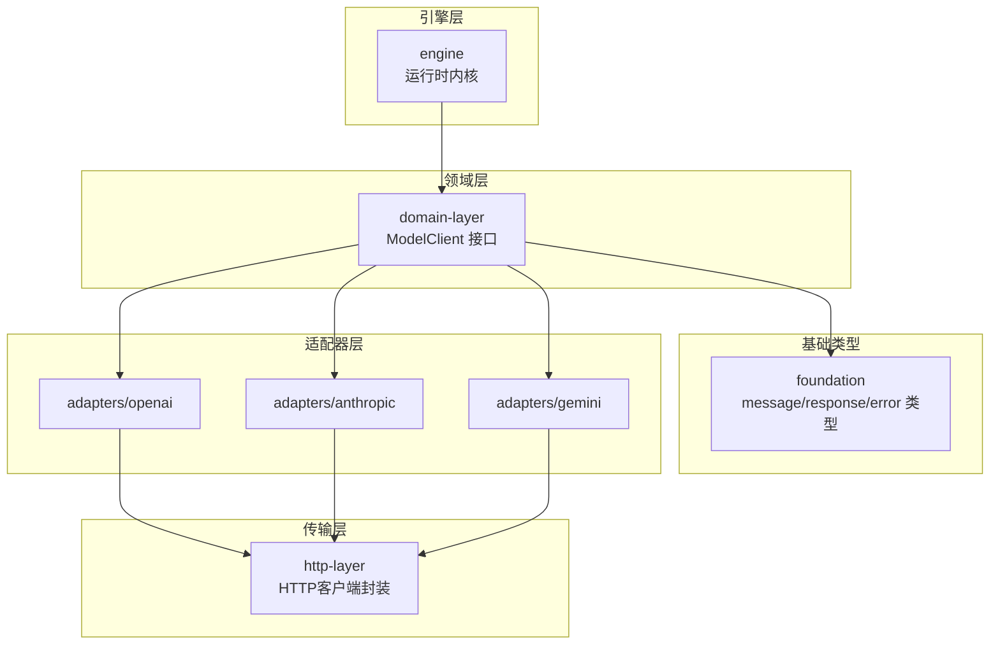
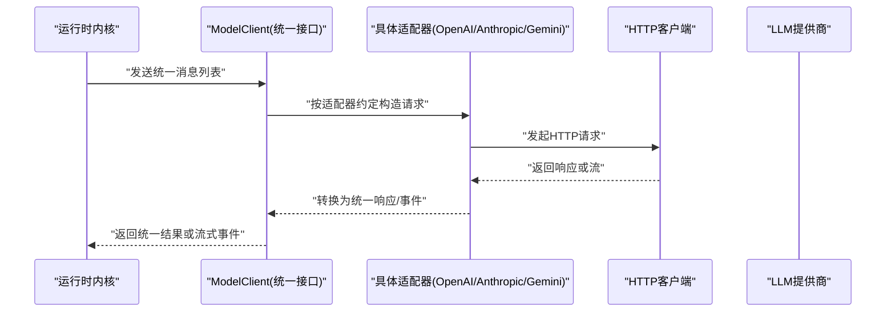
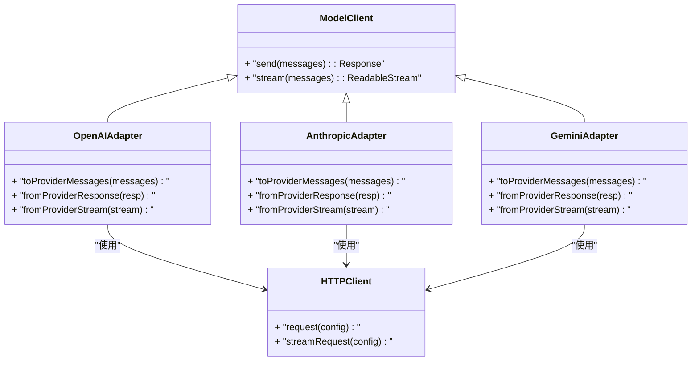
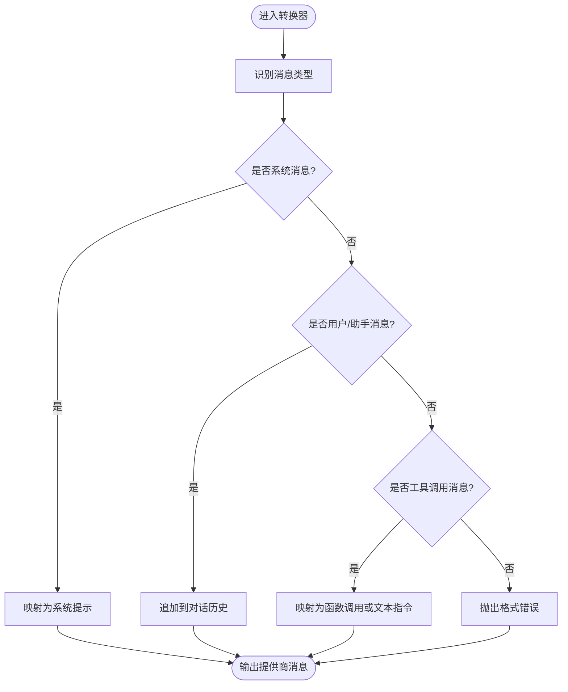
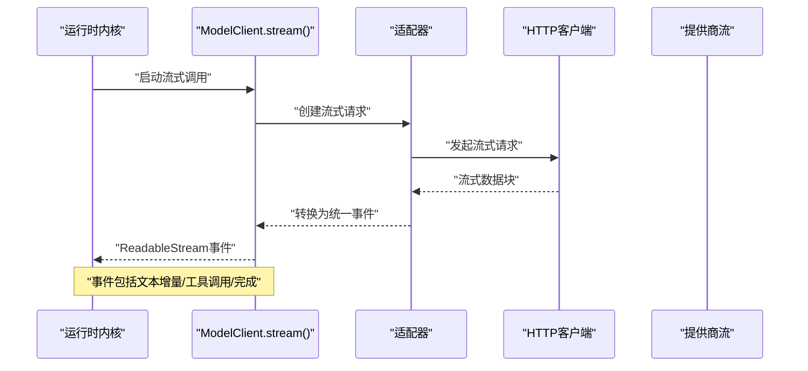
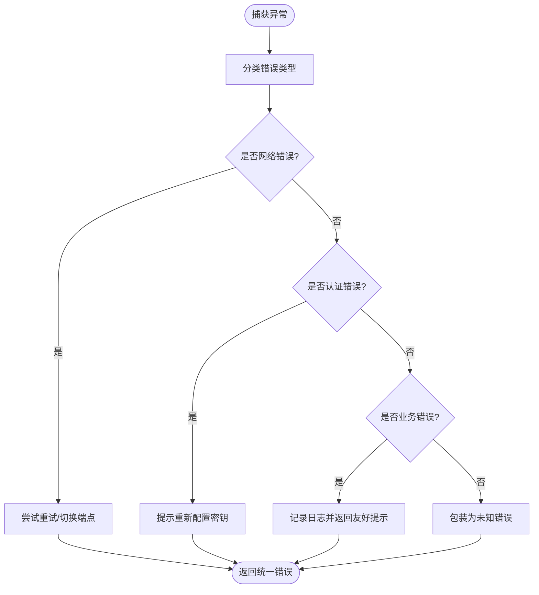
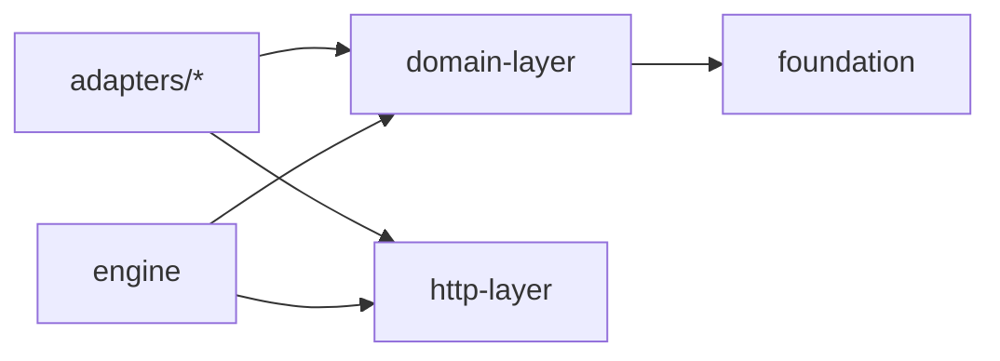

# 统一接口设计

<cite>
**本文引用的文件**   
- [engine/packages/domain-layer/src/model-client.ts](file://engine/packages/domain-layer/src/model-client.ts)
- [engine/packages/adapters/openai/index.ts](file://engine/packages/adapters/openai/index.ts)
- [engine/packages/adapters/anthropic/index.ts](file://engine/packages/adapters/anthropic/index.ts)
- [engine/packages/adapters/gemini/index.ts](file://engine/packages/adapters/gemini/index.ts)
- [engine/packages/foundation/src/types/message.ts](file://engine/packages/foundation/src/types/message.ts)
- [engine/packages/foundation/src/types/response.ts](file://engine/packages/foundation/src/types/response.ts)
- [engine/packages/foundation/src/types/error.ts](file://engine/packages/foundation/src/types/error.ts)
- [engine/packages/http-layer/src/client.ts](file://engine/packages/http-layer/src/client.ts)
- [engine/packages/engine/src/runtime-kernel.ts](file://engine/packages/engine/src/runtime-kernel.ts)
- [engine/tests/model-client.test.ts](file://engine/tests/model-client.test.ts)
- [engine/tests/provider-compatibility.test.ts](file://engine/tests/provider-compatibility.test.ts)
</cite>

## 目录
1. [简介](#简介)
2. [项目结构](#项目结构)
3. [核心组件](#核心组件)
4. [架构总览](#架构总览)
5. [详细组件分析](#详细组件分析)
6. [依赖关系分析](#依赖关系分析)
7. [性能考量](#性能考量)
8. [故障排查指南](#故障排查指南)
9. [结论](#结论)
10. [附录：新适配器开发指南](#附录新适配器开发指南)

## 简介
本文件面向KCoder的LLM统一接口设计与实现，聚焦以下目标：
- 抽象接口设计原则与ModelClient接口的定义
- 消息格式标准化与响应结构的统一
- 适配器模式屏蔽不同提供商差异
- 消息格式转换机制（系统、用户、工具调用）
- 流式处理的抽象设计与事件驱动响应
- 错误处理与异常映射
- 新适配器开发的完整规范与测试要求

## 项目结构
KCoder引擎采用分层与插件化组织方式，核心相关目录如下：
- domain-layer：领域模型与统一接口定义（如ModelClient）
- foundation：基础类型与协议（消息、响应、错误等）
- adapters：各LLM提供商的具体适配器实现
- http-layer：HTTP传输层封装
- engine：运行时内核与编排
- tests：单元测试与兼容性测试

图表来源
- [engine/packages/domain-layer/src/model-client.ts](file://engine/packages/domain-layer/src/model-client.ts)
- [engine/packages/foundation/src/types/message.ts](file://engine/packages/foundation/src/types/message.ts)
- [engine/packages/foundation/src/types/response.ts](file://engine/packages/foundation/src/types/response.ts)
- [engine/packages/foundation/src/types/error.ts](file://engine/packages/foundation/src/types/error.ts)
- [engine/packages/adapters/openai/index.ts](file://engine/packages/adapters/openai/index.ts)
- [engine/packages/adapters/anthropic/index.ts](file://engine/packages/adapters/anthropic/index.ts)
- [engine/packages/adapters/gemini/index.ts](file://engine/packages/adapters/gemini/index.ts)
- [engine/packages/http-layer/src/client.ts](file://engine/packages/http-layer/src/client.ts)
- [engine/packages/engine/src/runtime-kernel.ts](file://engine/packages/engine/src/runtime-kernel.ts)

章节来源
- [engine/packages/domain-layer/src/model-client.ts](file://engine/packages/domain-layer/src/model-client.ts)
- [engine/packages/foundation/src/types/message.ts](file://engine/packages/foundation/src/types/message.ts)
- [engine/packages/foundation/src/types/response.ts](file://engine/packages/foundation/src/types/response.ts)
- [engine/packages/foundation/src/types/error.ts](file://engine/packages/foundation/src/types/error.ts)
- [engine/packages/adapters/openai/index.ts](file://engine/packages/adapters/openai/index.ts)
- [engine/packages/adapters/anthropic/index.ts](file://engine/packages/adapters/anthropic/index.ts)
- [engine/packages/adapters/gemini/index.ts](file://engine/packages/adapters/gemini/index.ts)
- [engine/packages/http-layer/src/client.ts](file://engine/packages/http-layer/src/client.ts)
- [engine/packages/engine/src/runtime-kernel.ts](file://engine/packages/engine/src/runtime-kernel.ts)

## 核心组件
- ModelClient接口：定义统一的对话与流式调用契约，屏蔽底层提供商差异。
- 消息类型：统一的消息表示，包括系统、用户、助手与工具调用等角色。
- 响应类型：统一的文本增量、工具调用、完成状态等响应结构。
- 错误类型：统一的错误分类与上下文信息，便于上层处理。
- HTTP客户端：对请求头、重试、超时、鉴权等进行统一封装。
- 运行时内核：编排调用流程、管理会话历史、协调工具执行与流式输出。

章节来源
- [engine/packages/domain-layer/src/model-client.ts](file://engine/packages/domain-layer/src/model-client.ts)
- [engine/packages/foundation/src/types/message.ts](file://engine/packages/foundation/src/types/message.ts)
- [engine/packages/foundation/src/types/response.ts](file://engine/packages/foundation/src/types/response.ts)
- [engine/packages/foundation/src/types/error.ts](file://engine/packages/foundation/src/types/error.ts)
- [engine/packages/http-layer/src/client.ts](file://engine/packages/http-layer/src/client.ts)
- [engine/packages/engine/src/runtime-kernel.ts](file://engine/packages/engine/src/runtime-kernel.ts)

## 架构总览
统一接口通过适配器模式将不同提供商的API差异隐藏于内部，对外暴露一致的ModelClient能力。

图表来源
- [engine/packages/domain-layer/src/model-client.ts](file://engine/packages/domain-layer/src/model-client.ts)
- [engine/packages/adapters/openai/index.ts](file://engine/packages/adapters/openai/index.ts)
- [engine/packages/adapters/anthropic/index.ts](file://engine/packages/adapters/anthropic/index.ts)
- [engine/packages/adapters/gemini/index.ts](file://engine/packages/adapters/gemini/index.ts)
- [engine/packages/http-layer/src/client.ts](file://engine/packages/http-layer/src/client.ts)
- [engine/packages/engine/src/runtime-kernel.ts](file://engine/packages/engine/src/runtime-kernel.ts)

## 详细组件分析

### ModelClient接口与适配器模式
- 设计原则
  - 单一职责：仅暴露对话与流式调用能力
  - 稳定契约：消息与响应类型在领域层固化，避免随提供商变化
  - 可插拔：新增提供商只需实现适配器，无需改动上层
- 关键方法
  - 非流式对话：接收消息列表，返回统一响应
  - 流式对话：返回ReadableStream，逐块推送增量内容、工具调用与完成信号
- 适配器职责
  - 将统一消息转换为提供商特定格式
  - 将提供商响应转换为统一响应/事件
  - 处理鉴权、重试、超时等横切关注点

图表来源
- [engine/packages/domain-layer/src/model-client.ts](file://engine/packages/domain-layer/src/model-client.ts)
- [engine/packages/adapters/openai/index.ts](file://engine/packages/adapters/openai/index.ts)
- [engine/packages/adapters/anthropic/index.ts](file://engine/packages/adapters/anthropic/index.ts)
- [engine/packages/adapters/gemini/index.ts](file://engine/packages/adapters/gemini/index.ts)
- [engine/packages/http-layer/src/client.ts](file://engine/packages/http-layer/src/client.ts)

章节来源
- [engine/packages/domain-layer/src/model-client.ts](file://engine/packages/domain-layer/src/model-client.ts)
- [engine/packages/adapters/openai/index.ts](file://engine/packages/adapters/openai/index.ts)
- [engine/packages/adapters/anthropic/index.ts](file://engine/packages/adapters/anthropic/index.ts)
- [engine/packages/adapters/gemini/index.ts](file://engine/packages/adapters/gemini/index.ts)
- [engine/packages/http-layer/src/client.ts](file://engine/packages/http-layer/src/client.ts)

### 消息格式标准化与转换规则
- 统一消息类型
  - 系统消息：用于设定行为与约束
  - 用户消息：来自用户的输入
  - 助手消息：模型的历史回复
  - 工具调用消息：包含函数名与参数，以及可选的结果
- 转换规则
  - 系统消息映射到提供商的系统提示字段
  - 用户/助手消息映射为对话历史条目
  - 工具调用消息根据提供商能力选择：
    - 支持函数调用的提供商：以函数调用形式传递并解析返回
    - 不支持的提供商：以文本指令形式表达，并在后续轮次中注入结果
- 注意事项
  - 保持消息顺序与上下文一致性
  - 对超长上下文进行压缩或截断策略（由上层决定）

图表来源
- [engine/packages/foundation/src/types/message.ts](file://engine/packages/foundation/src/types/message.ts)
- [engine/packages/adapters/openai/index.ts](file://engine/packages/adapters/openai/index.ts)
- [engine/packages/adapters/anthropic/index.ts](file://engine/packages/adapters/anthropic/index.ts)
- [engine/packages/adapters/gemini/index.ts](file://engine/packages/adapters/gemini/index.ts)

章节来源
- [engine/packages/foundation/src/types/message.ts](file://engine/packages/foundation/src/types/message.ts)
- [engine/packages/adapters/openai/index.ts](file://engine/packages/adapters/openai/index.ts)
- [engine/packages/adapters/anthropic/index.ts](file://engine/packages/adapters/anthropic/index.ts)
- [engine/packages/adapters/gemini/index.ts](file://engine/packages/adapters/gemini/index.ts)

### 响应结构与流式处理抽象
- 统一响应结构
  - 文本增量：逐步输出的片段
  - 工具调用：函数名与参数
  - 完成信号：标识一轮对话结束
- 流式处理
  - 使用ReadableStream作为统一载体
  - 事件驱动：上游推送事件，下游消费事件
  - 背压控制：确保消费者处理能力匹配生产速率
- 适配器的流式实现
  - 将提供商的SSE/流式响应转换为统一事件序列
  - 合并分片、去重、错误传播

图表来源
- [engine/packages/domain-layer/src/model-client.ts](file://engine/packages/domain-layer/src/model-client.ts)
- [engine/packages/adapters/openai/index.ts](file://engine/packages/adapters/openai/index.ts)
- [engine/packages/adapters/anthropic/index.ts](file://engine/packages/adapters/anthropic/index.ts)
- [engine/packages/adapters/gemini/index.ts](file://engine/packages/adapters/gemini/index.ts)
- [engine/packages/http-layer/src/client.ts](file://engine/packages/http-layer/src/client.ts)
- [engine/packages/engine/src/runtime-kernel.ts](file://engine/packages/engine/src/runtime-kernel.ts)

章节来源
- [engine/packages/domain-layer/src/model-client.ts](file://engine/packages/domain-layer/src/model-client.ts)
- [engine/packages/foundation/src/types/response.ts](file://engine/packages/foundation/src/types/response.ts)
- [engine/packages/http-layer/src/client.ts](file://engine/packages/http-layer/src/client.ts)
- [engine/packages/engine/src/runtime-kernel.ts](file://engine/packages/engine/src/runtime-kernel.ts)

### 错误处理与异常映射
- 统一错误类型
  - 网络错误：连接失败、超时、DNS解析失败
  - 认证错误：密钥无效、权限不足
  - 业务错误：配额超限、模型不可用、参数非法
  - 未知错误：未分类异常
- 映射策略
  - 从提供商响应中提取错误码与消息
  - 包装为统一错误对象，附带上下文（请求ID、时间戳、重试建议）
- 重试与降级
  - 幂等请求自动重试
  - 非幂等请求谨慎重试
  - 提供降级路径（如切换提供商或回退到缓存）

图表来源
- [engine/packages/foundation/src/types/error.ts](file://engine/packages/foundation/src/types/error.ts)
- [engine/packages/http-layer/src/client.ts](file://engine/packages/http-layer/src/client.ts)
- [engine/packages/adapters/openai/index.ts](file://engine/packages/adapters/openai/index.ts)
- [engine/packages/adapters/anthropic/index.ts](file://engine/packages/adapters/anthropic/index.ts)
- [engine/packages/adapters/gemini/index.ts](file://engine/packages/adapters/gemini/index.ts)

章节来源
- [engine/packages/foundation/src/types/error.ts](file://engine/packages/foundation/src/types/error.ts)
- [engine/packages/http-layer/src/client.ts](file://engine/packages/http-layer/src/client.ts)
- [engine/packages/adapters/openai/index.ts](file://engine/packages/adapters/openai/index.ts)
- [engine/packages/adapters/anthropic/index.ts](file://engine/packages/adapters/anthropic/index.ts)
- [engine/packages/adapters/gemini/index.ts](file://engine/packages/adapters/gemini/index.ts)

## 依赖关系分析
- 耦合与内聚
  - 领域层与基础类型低耦合，适配器高内聚地处理提供商细节
  - HTTP层独立于业务逻辑，便于替换传输实现
- 外部依赖
  - 各提供商SDK或REST API
  - 流式传输协议（SSE/Chunked）
- 潜在循环依赖
  - 通过接口隔离避免循环引用
  - 适配器不直接依赖运行时内核，仅通过统一接口交互

图表来源
- [engine/packages/domain-layer/src/model-client.ts](file://engine/packages/domain-layer/src/model-client.ts)
- [engine/packages/foundation/src/types/message.ts](file://engine/packages/foundation/src/types/message.ts)
- [engine/packages/foundation/src/types/response.ts](file://engine/packages/foundation/src/types/response.ts)
- [engine/packages/foundation/src/types/error.ts](file://engine/packages/foundation/src/types/error.ts)
- [engine/packages/adapters/openai/index.ts](file://engine/packages/adapters/openai/index.ts)
- [engine/packages/adapters/anthropic/index.ts](file://engine/packages/adapters/anthropic/index.ts)
- [engine/packages/adapters/gemini/index.ts](file://engine/packages/adapters/gemini/index.ts)
- [engine/packages/http-layer/src/client.ts](file://engine/packages/http-layer/src/client.ts)
- [engine/packages/engine/src/runtime-kernel.ts](file://engine/packages/engine/src/runtime-kernel.ts)

章节来源
- [engine/packages/domain-layer/src/model-client.ts](file://engine/packages/domain-layer/src/model-client.ts)
- [engine/packages/foundation/src/types/message.ts](file://engine/packages/foundation/src/types/message.ts)
- [engine/packages/foundation/src/types/response.ts](file://engine/packages/foundation/src/types/response.ts)
- [engine/packages/foundation/src/types/error.ts](file://engine/packages/foundation/src/types/error.ts)
- [engine/packages/adapters/openai/index.ts](file://engine/packages/adapters/openai/index.ts)
- [engine/packages/adapters/anthropic/index.ts](file://engine/packages/adapters/anthropic/index.ts)
- [engine/packages/adapters/gemini/index.ts](file://engine/packages/adapters/gemini/index.ts)
- [engine/packages/http-layer/src/client.ts](file://engine/packages/http-layer/src/client.ts)
- [engine/packages/engine/src/runtime-kernel.ts](file://engine/packages/engine/src/runtime-kernel.ts)

## 性能考量
- 流式优先：减少首字节延迟，提升用户体验
- 背压控制：防止内存暴涨，确保稳定吞吐
- 连接复用：HTTP层复用连接，降低握手开销
- 批量与批处理：合理合并小消息，减少往返次数
- 资源清理：及时释放流与连接，避免泄漏

## 故障排查指南
- 常见问题定位
  - 认证失败：检查密钥与权限范围
  - 配额限制：查看提供商控制台用量
  - 流中断：确认网络稳定性与超时设置
  - 工具调用失败：核对函数签名与参数校验
- 诊断手段
  - 启用调试日志，记录请求ID与时间戳
  - 对比提供商原始响应与统一响应差异
  - 使用兼容性测试套件验证多提供商行为一致

章节来源
- [engine/tests/model-client.test.ts](file://engine/tests/model-client.test.ts)
- [engine/tests/provider-compatibility.test.ts](file://engine/tests/provider-compatibility.test.ts)

## 结论
通过ModelClient统一接口与适配器模式，KCoder实现了跨提供商的LLM调用抽象。标准化的消息与响应类型、事件驱动的流式处理、完善的错误映射与重试策略，共同保障了系统的可扩展性与稳定性。遵循本文档的设计原则与开发指南，可以快速集成新的LLM提供商并保持行为一致。

## 附录：新适配器开发指南
- 接口实现规范
  - 实现ModelClient约定的方法
  - 提供消息到提供商格式的转换函数
  - 提供响应与流事件的统一转换函数
  - 处理鉴权、重试、超时与错误映射
- 测试要求
  - 单元测试覆盖消息转换与响应解析
  - 端到端测试验证流式事件完整性
  - 兼容性测试确保与其他提供商行为一致
- 文档标准
  - 明确支持的模型与功能矩阵
  - 列出已知限制与替代方案
  - 提供配置示例与故障排查清单

章节来源
- [engine/packages/domain-layer/src/model-client.ts](file://engine/packages/domain-layer/src/model-client.ts)
- [engine/packages/adapters/openai/index.ts](file://engine/packages/adapters/openai/index.ts)
- [engine/packages/adapters/anthropic/index.ts](file://engine/packages/adapters/anthropic/index.ts)
- [engine/packages/adapters/gemini/index.ts](file://engine/packages/adapters/gemini/index.ts)
- [engine/tests/model-client.test.ts](file://engine/tests/model-client.test.ts)
- [engine/tests/provider-compatibility.test.ts](file://engine/tests/provider-compatibility.test.ts)