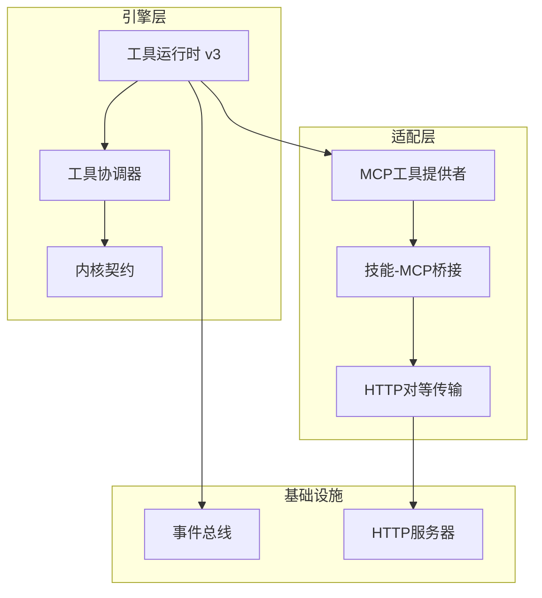
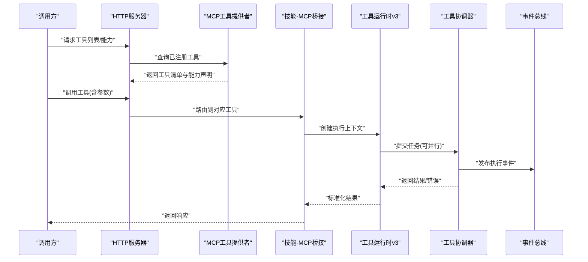
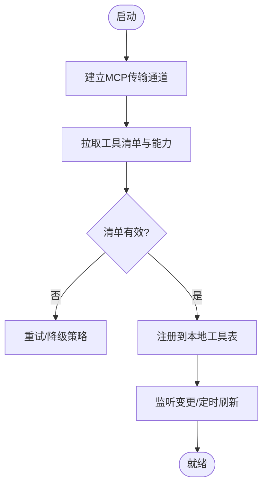
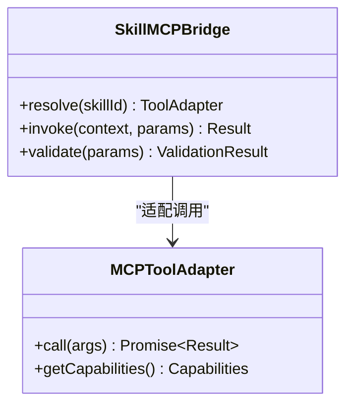
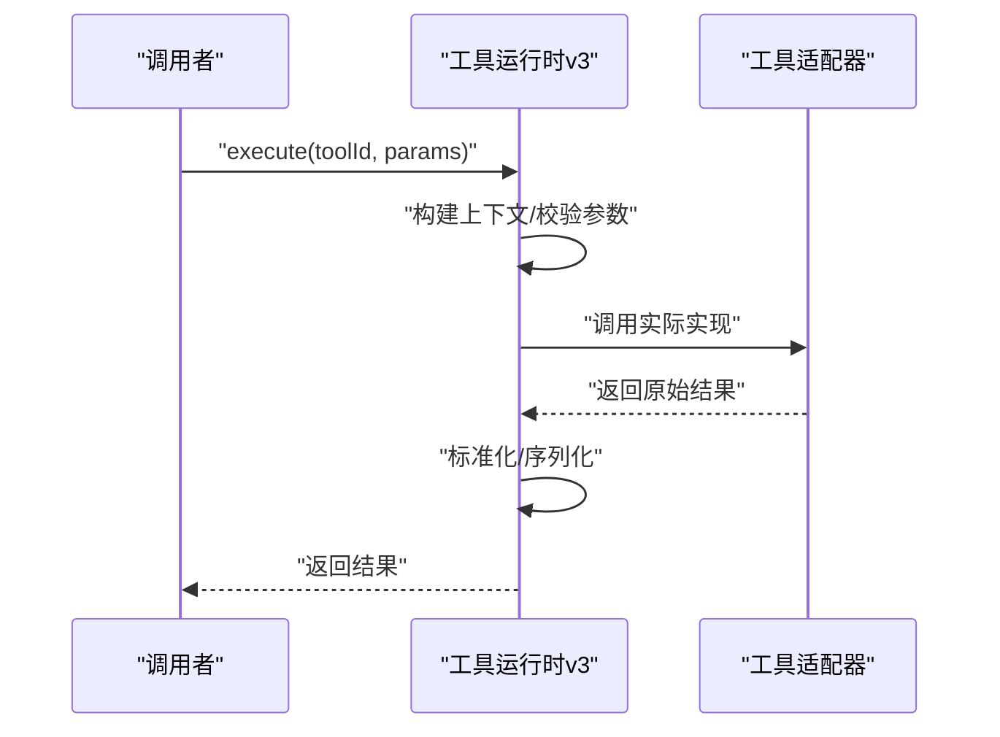
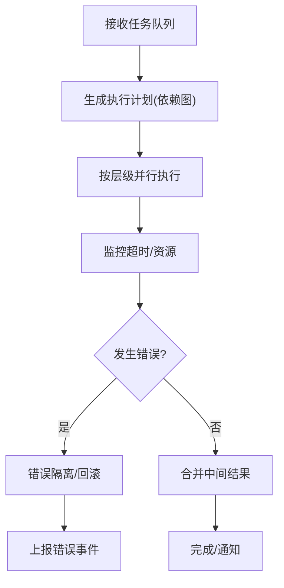
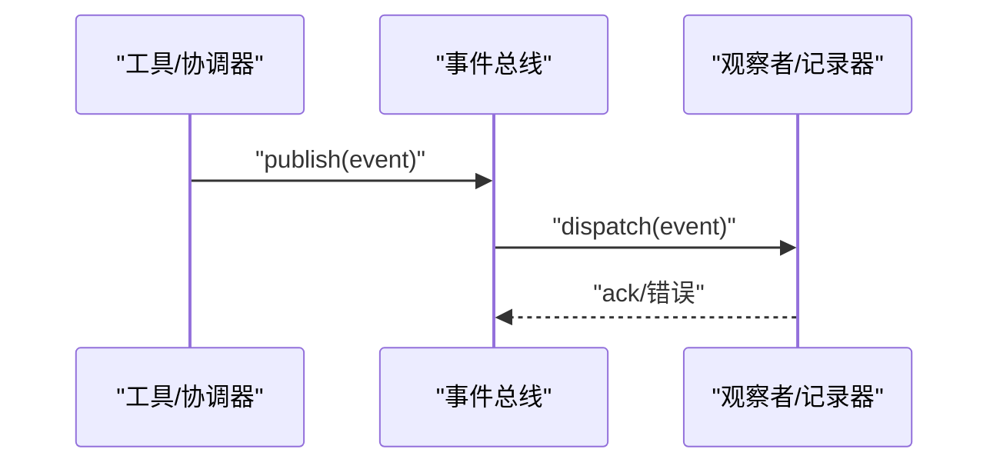
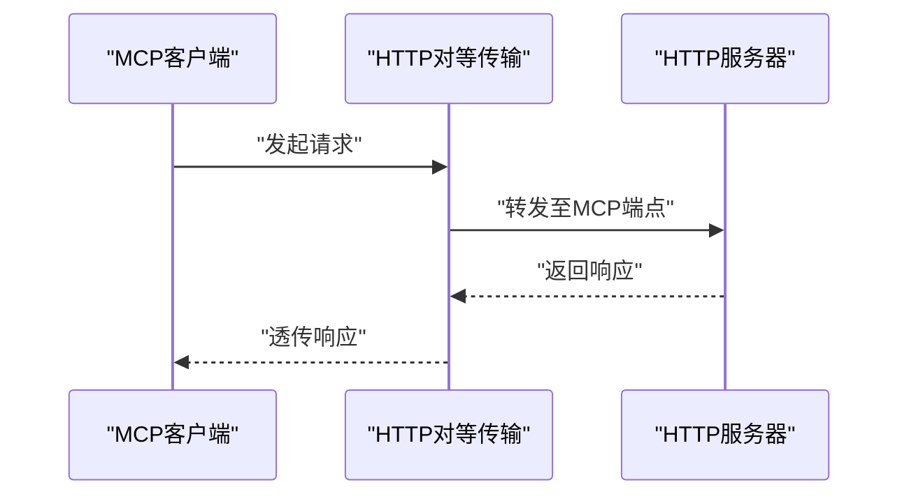
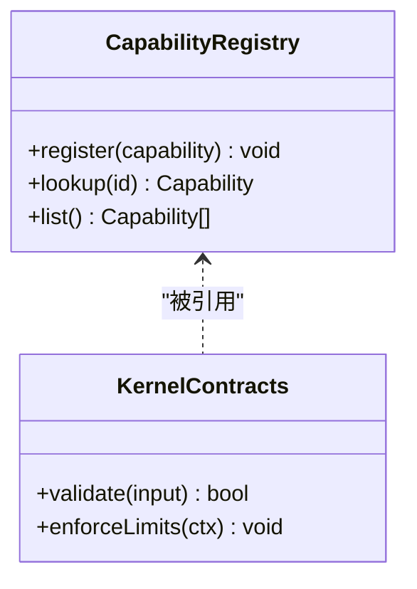
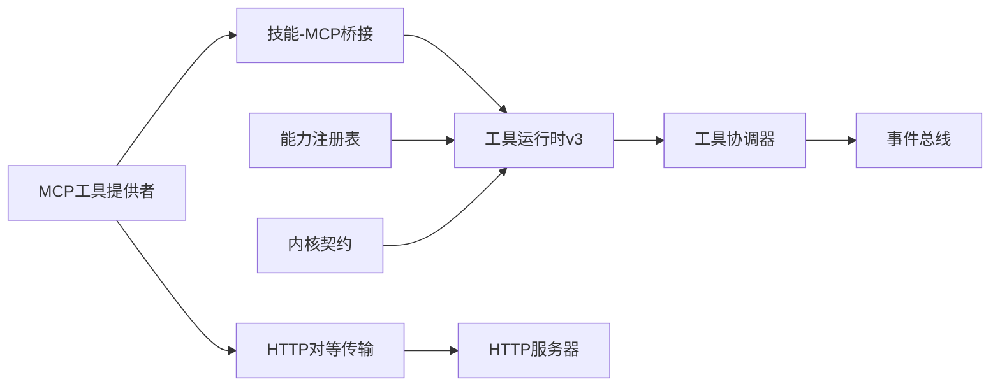

# MCP工具适配器

<cite>
**本文引用的文件**   
- [mcp-tool-provider.test.ts](file://engine/tests/mcp-tool-provider.test.ts)
- [mcp-config.test.ts](file://engine/tests/mcp-config.test.ts)
- [skill-mcp-bridge.test.ts](file://engine/tests/skill-mcp-bridge.test.ts)
- [tool-runtime-v3.test.ts](file://engine/tests/tool-runtime-v3.test.ts)
- [tool-coordinator-runtime.test.ts](file://engine/tests/tool-coordinator-runtime.test.ts)
- [tool-dispatch-errors.test.ts](file://engine/tests/tool-dispatch-errors.test.ts)
- [turn-event-bus.test.ts](file://engine/tests/turn-event-bus.test.ts)
- [http-server.test.ts](file://engine/tests/http-server.test.ts)
- [http-peer-transport.test.ts](file://engine/tests/http-peer-transport.test.ts)
- [runtime-kernel-contracts.test.ts](file://engine/tests/runtime-kernel-contracts.test.ts)
- [capability-registry.test.ts](file://engine/tests/capability-registry.test.ts)
- [builtin-tools.test.ts](file://engine/tests/builtin-tools.test.ts)
</cite>

## 目录
1. [简介](#简介)
2. [项目结构](#项目结构)
3. [核心组件](#核心组件)
4. [架构总览](#架构总览)
5. [详细组件分析](#详细组件分析)
6. [依赖关系分析](#依赖关系分析)
7. [性能考量](#性能考量)
8. [故障诊断指南](#故障诊断指南)
9. [结论](#结论)
10. [附录](#附录)

## 简介
本文件面向KCoder的MCP（Model Context Protocol）工具适配器，系统性阐述协议规范与在KCoder中的实现方式。文档覆盖：
- 工具发现、能力声明、参数校验、结果返回
- 工具生命周期管理：注册、动态加载、版本管理、热更新
- 执行引擎设计：并行执行、错误隔离、资源限制、超时控制
- 工具间通信：事件总线、消息队列、状态同步
- 自定义MCP工具开发指南：定义、权限、测试、部署
- 性能监控与故障诊断方法

## 项目结构
围绕MCP工具适配器的相关代码主要位于engine子仓库中，并通过大量测试用例体现其契约与行为。关键位置包括：
- engine/tests：MCP工具提供者、配置、桥接、运行时、调度、错误处理、事件总线、HTTP传输等测试
- engine/packages：各层包（adapters、capabilities、engine、foundation、http-layer、infrastructure、ports-layer等），承载具体实现（以测试为契约入口进行验证）

图表来源
- [tool-runtime-v3.test.ts](file://engine/tests/tool-runtime-v3.test.ts)
- [tool-coordinator-runtime.test.ts](file://engine/tests/tool-coordinator-runtime.test.ts)
- [runtime-kernel-contracts.test.ts](file://engine/tests/runtime-kernel-contracts.test.ts)
- [mcp-tool-provider.test.ts](file://engine/tests/mcp-tool-provider.test.ts)
- [skill-mcp-bridge.test.ts](file://engine/tests/skill-mcp-bridge.test.ts)
- [http-peer-transport.test.ts](file://engine/tests/http-peer-transport.test.ts)
- [http-server.test.ts](file://engine/tests/http-server.test.ts)
- [turn-event-bus.test.ts](file://engine/tests/turn-event-bus.test.ts)

章节来源
- [mcp-tool-provider.test.ts](file://engine/tests/mcp-tool-provider.test.ts)
- [mcp-config.test.ts](file://engine/tests/mcp-config.test.ts)
- [skill-mcp-bridge.test.ts](file://engine/tests/skill-mcp-bridge.test.ts)
- [tool-runtime-v3.test.ts](file://engine/tests/tool-runtime-v3.test.ts)
- [tool-coordinator-runtime.test.ts](file://engine/tests/tool-coordinator-runtime.test.ts)
- [tool-dispatch-errors.test.ts](file://engine/tests/tool-dispatch-errors.test.ts)
- [turn-event-bus.test.ts](file://engine/tests/turn-event-bus.test.ts)
- [http-server.test.ts](file://engine/tests/http-server.test.ts)
- [http-peer-transport.test.ts](file://engine/tests/http-peer-transport.test.ts)
- [runtime-kernel-contracts.test.ts](file://engine/tests/runtime-kernel-contracts.test.ts)
- [capability-registry.test.ts](file://engine/tests/capability-registry.test.ts)
- [builtin-tools.test.ts](file://engine/tests/builtin-tools.test.ts)

## 核心组件
- MCP工具提供者：负责从外部MCP服务发现并暴露工具，完成能力声明、参数校验与结果映射
- 技能-MCP桥接：将“技能”概念与MCP工具统一抽象，提供一致的调用接口
- HTTP对等传输：基于HTTP的MCP通信通道，支持远程工具发现与调用
- 工具运行时v3：统一的工具执行上下文、生命周期与资源治理
- 工具协调器：编排多工具并发、依赖解析、错误隔离与超时控制
- 事件总线：跨工具的事件分发与状态同步
- HTTP服务器：对外暴露MCP端点，供上层或外部系统接入
- 能力注册表：集中管理可用能力与版本信息
- 内置工具：平台内建能力，作为MCP工具的参考实现

章节来源
- [mcp-tool-provider.test.ts](file://engine/tests/mcp-tool-provider.test.ts)
- [skill-mcp-bridge.test.ts](file://engine/tests/skill-mcp-bridge.test.ts)
- [http-peer-transport.test.ts](file://engine/tests/http-peer-transport.test.ts)
- [tool-runtime-v3.test.ts](file://engine/tests/tool-runtime-v3.test.ts)
- [tool-coordinator-runtime.test.ts](file://engine/tests/tool-coordinator-runtime.test.ts)
- [turn-event-bus.test.ts](file://engine/tests/turn-event-bus.test.ts)
- [http-server.test.ts](file://engine/tests/http-server.test.ts)
- [capability-registry.test.ts](file://engine/tests/capability-registry.test.ts)
- [builtin-tools.test.ts](file://engine/tests/builtin-tools.test.ts)

## 架构总览
下图展示了MCP工具在KCoder中的端到端流程：从能力发现到工具执行、再到结果返回与事件广播。

图表来源
- [http-server.test.ts](file://engine/tests/http-server.test.ts)
- [mcp-tool-provider.test.ts](file://engine/tests/mcp-tool-provider.test.ts)
- [skill-mcp-bridge.test.ts](file://engine/tests/skill-mcp-bridge.test.ts)
- [tool-runtime-v3.test.ts](file://engine/tests/tool-runtime-v3.test.ts)
- [tool-coordinator-runtime.test.ts](file://engine/tests/tool-coordinator-runtime.test.ts)
- [turn-event-bus.test.ts](file://engine/tests/turn-event-bus.test.ts)

## 详细组件分析

### MCP工具提供者
职责
- 连接外部MCP服务，拉取工具清单与能力元数据
- 维护本地工具注册表，支持增量更新
- 参数校验与结果映射，屏蔽底层差异

关键流程
- 初始化时建立传输通道（HTTP对等传输）
- 周期性或按需刷新工具清单
- 将MCP工具映射为内部统一工具模型

图表来源
- [mcp-tool-provider.test.ts](file://engine/tests/mcp-tool-provider.test.ts)
- [http-peer-transport.test.ts](file://engine/tests/http-peer-transport.test.ts)

章节来源
- [mcp-tool-provider.test.ts](file://engine/tests/mcp-tool-provider.test.ts)
- [http-peer-transport.test.ts](file://engine/tests/http-peer-transport.test.ts)

### 技能-MCP桥接
职责
- 将“技能”与“MCP工具”统一抽象，提供一致API
- 处理权限、上下文注入与输出格式化

图表来源
- [skill-mcp-bridge.test.ts](file://engine/tests/skill-mcp-bridge.test.ts)

章节来源
- [skill-mcp-bridge.test.ts](file://engine/tests/skill-mcp-bridge.test.ts)

### 工具运行时v3
职责
- 提供统一的执行上下文、资源管理与生命周期钩子
- 支持参数校验、结果序列化、日志与追踪

图表来源
- [tool-runtime-v3.test.ts](file://engine/tests/tool-runtime-v3.test.ts)

章节来源
- [tool-runtime-v3.test.ts](file://engine/tests/tool-runtime-v3.test.ts)

### 工具协调器
职责
- 编排多工具并发执行、依赖解析
- 错误隔离、超时控制、资源配额
- 与事件总线协作，发布执行阶段事件

图表来源
- [tool-coordinator-runtime.test.ts](file://engine/tests/tool-coordinator-runtime.test.ts)
- [tool-dispatch-errors.test.ts](file://engine/tests/tool-dispatch-errors.test.ts)
- [turn-event-bus.test.ts](file://engine/tests/turn-event-bus.test.ts)

章节来源
- [tool-coordinator-runtime.test.ts](file://engine/tests/tool-coordinator-runtime.test.ts)
- [tool-dispatch-errors.test.ts](file://engine/tests/tool-dispatch-errors.test.ts)
- [turn-event-bus.test.ts](file://engine/tests/turn-event-bus.test.ts)

### 事件总线
职责
- 跨工具事件分发（开始、进度、完成、失败）
- 订阅/发布模式，解耦工具与观察者

图表来源
- [turn-event-bus.test.ts](file://engine/tests/turn-event-bus.test.ts)

章节来源
- [turn-event-bus.test.ts](file://engine/tests/turn-event-bus.test.ts)

### HTTP对等传输与服务器
职责
- 通过HTTP实现MCP客户端与服务端的可靠通信
- 暴露工具发现与调用端点，支持鉴权与限流

图表来源
- [http-peer-transport.test.ts](file://engine/tests/http-peer-transport.test.ts)
- [http-server.test.ts](file://engine/tests/http-server.test.ts)

章节来源
- [http-peer-transport.test.ts](file://engine/tests/http-peer-transport.test.ts)
- [http-server.test.ts](file://engine/tests/http-server.test.ts)

### 能力注册表与内核契约
职责
- 集中管理能力清单、版本兼容性与可用性
- 约束工具运行时的最小契约（输入/输出、错误码、资源上限）

图表来源
- [capability-registry.test.ts](file://engine/tests/capability-registry.test.ts)
- [runtime-kernel-contracts.test.ts](file://engine/tests/runtime-kernel-contracts.test.ts)

章节来源
- [capability-registry.test.ts](file://engine/tests/capability-registry.test.ts)
- [runtime-kernel-contracts.test.ts](file://engine/tests/runtime-kernel-contracts.test.ts)

### 内置工具
职责
- 提供平台内建能力，作为MCP工具的标准参考实现
- 用于回归测试与兼容性验证

章节来源
- [builtin-tools.test.ts](file://engine/tests/builtin-tools.test.ts)

## 依赖关系分析
- 低耦合：工具提供者、桥接、运行时、协调器、事件总线、传输层之间通过明确接口交互
- 高内聚：每个组件职责清晰，便于独立演进与替换
- 外部依赖：HTTP传输依赖网络稳定性；事件总线依赖内存/持久化后端（由测试契约保障）

图表来源
- [mcp-tool-provider.test.ts](file://engine/tests/mcp-tool-provider.test.ts)
- [skill-mcp-bridge.test.ts](file://engine/tests/skill-mcp-bridge.test.ts)
- [tool-runtime-v3.test.ts](file://engine/tests/tool-runtime-v3.test.ts)
- [tool-coordinator-runtime.test.ts](file://engine/tests/tool-coordinator-runtime.test.ts)
- [turn-event-bus.test.ts](file://engine/tests/turn-event-bus.test.ts)
- [http-peer-transport.test.ts](file://engine/tests/http-peer-transport.test.ts)
- [http-server.test.ts](file://engine/tests/http-server.test.ts)
- [capability-registry.test.ts](file://engine/tests/capability-registry.test.ts)
- [runtime-kernel-contracts.test.ts](file://engine/tests/runtime-kernel-contracts.test.ts)

章节来源
- [mcp-tool-provider.test.ts](file://engine/tests/mcp-tool-provider.test.ts)
- [skill-mcp-bridge.test.ts](file://engine/tests/skill-mcp-bridge.test.ts)
- [tool-runtime-v3.test.ts](file://engine/tests/tool-runtime-v3.test.ts)
- [tool-coordinator-runtime.test.ts](file://engine/tests/tool-coordinator-runtime.test.ts)
- [turn-event-bus.test.ts](file://engine/tests/turn-event-bus.test.ts)
- [http-peer-transport.test.ts](file://engine/tests/http-peer-transport.test.ts)
- [http-server.test.ts](file://engine/tests/http-server.test.ts)
- [capability-registry.test.ts](file://engine/tests/capability-registry.test.ts)
- [runtime-kernel-contracts.test.ts](file://engine/tests/runtime-kernel-contracts.test.ts)

## 性能考量
- 并行执行：协调器按依赖图分层并行，减少整体延迟
- 错误隔离：单个工具失败不影响其他分支执行
- 资源限制：通过内核契约与运行时上下文限制CPU/内存/IO
- 超时控制：为单次调用与整体任务设置超时阈值
- 缓存与去重：对幂等工具可引入结果缓存，降低重复开销
- 背压与限流：在高并发场景下对事件总线与HTTP传输进行限流

[本节为通用指导，不直接分析具体文件]

## 故障诊断指南
- 工具发现失败：检查MCP传输连通性、清单格式与版本兼容
- 参数校验失败：核对能力声明与输入契约，定位缺失/类型不匹配字段
- 执行超时：查看协调器日志与事件总线时间线，确认是否被限流或资源不足
- 错误隔离异常：检查错误传播路径与回滚逻辑，确保副作用可控
- 事件丢失：验证事件总线持久化与重试策略
- 服务端异常：检查HTTP服务器健康端点与访问日志

章节来源
- [tool-dispatch-errors.test.ts](file://engine/tests/tool-dispatch-errors.test.ts)
- [turn-event-bus.test.ts](file://engine/tests/turn-event-bus.test.ts)
- [http-server.test.ts](file://engine/tests/http-server.test.ts)

## 结论
KCoder的MCP工具适配器通过清晰的层次划分与严格的契约测试，实现了稳定的工具发现、能力声明、参数校验与结果返回。借助运行时v3与协调器，系统在并行执行、错误隔离、资源限制与超时控制方面具备良好表现。事件总线与HTTP传输进一步增强了可扩展性与可观测性。建议在生产环境结合指标采集与链路追踪，持续优化性能与可靠性。

[本节为总结性内容，不直接分析具体文件]

## 附录

### 自定义MCP工具开发指南
- 工具定义
  - 遵循能力注册表的元数据约定，声明名称、版本、输入/输出Schema与权限
  - 使用技能-MCP桥接提供的统一接口封装实现
- 权限控制
  - 在桥接层注入上下文与权限令牌，拒绝越权调用
- 测试方法
  - 使用工具运行时v3与协调器进行单测与集成测试
  - 利用事件总线断言事件序列与状态一致性
- 部署流程
  - 将工具打包为可发现的服务，通过HTTP对等传输接入
  - 在能力注册表中登记版本，配合内核契约进行上线前校验

章节来源
- [capability-registry.test.ts](file://engine/tests/capability-registry.test.ts)
- [skill-mcp-bridge.test.ts](file://engine/tests/skill-mcp-bridge.test.ts)
- [tool-runtime-v3.test.ts](file://engine/tests/tool-runtime-v3.test.ts)
- [tool-coordinator-runtime.test.ts](file://engine/tests/tool-coordinator-runtime.test.ts)
- [http-peer-transport.test.ts](file://engine/tests/http-peer-transport.test.ts)
- [runtime-kernel-contracts.test.ts](file://engine/tests/runtime-kernel-contracts.test.ts)