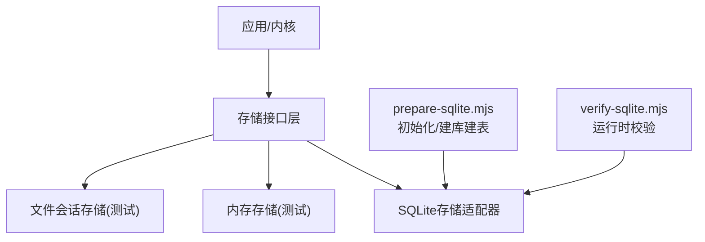
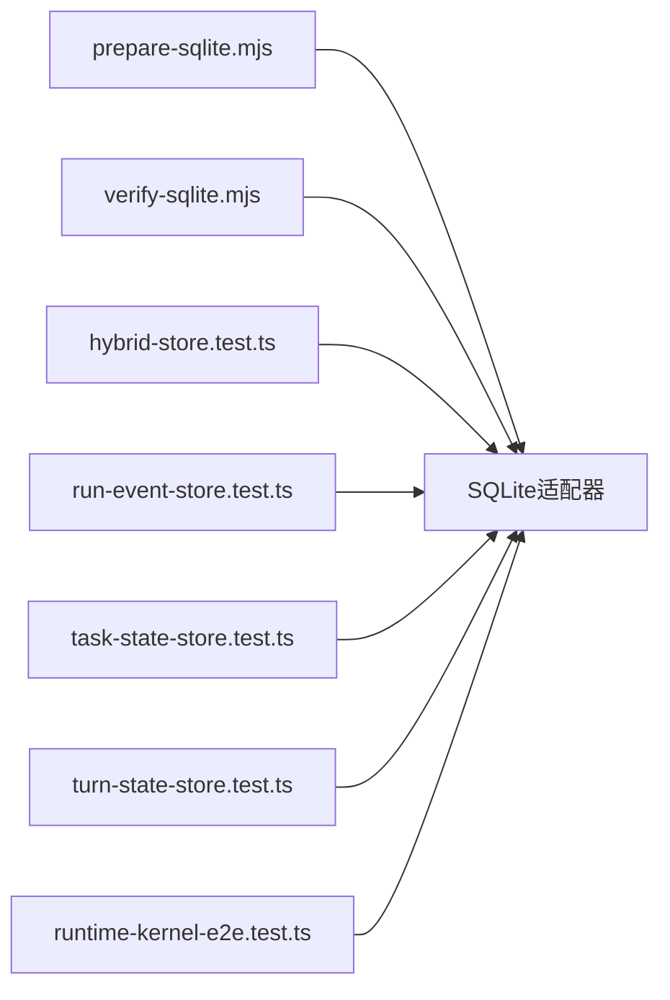
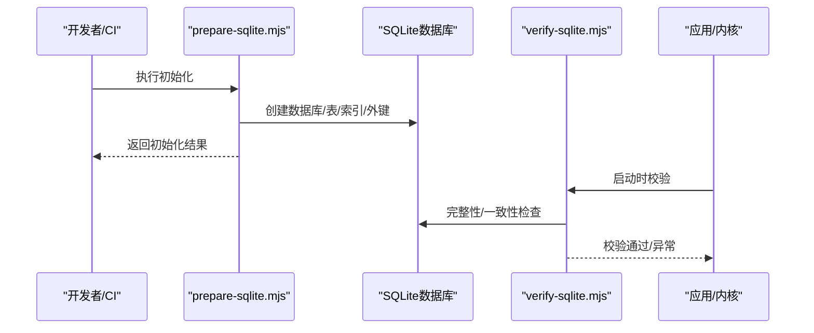

# SQLite存储适配器

<cite>
**本文引用的文件**   
- [engine/scripts/prepare-sqlite.mjs](file://engine/scripts/prepare-sqlite.mjs)
- [engine/scripts/verify-sqlite.mjs](file://engine/scripts/verify-sqlite.mjs)
- [engine/tests/hybrid-store.test.ts](file://engine/tests/hybrid-store.test.ts)
- [engine/tests/memory-store.test.ts](file://engine/tests/memory-store.test.ts)
- [engine/tests/file-session-store.test.ts](file://engine/tests/file-session-store.test.ts)
- [engine/tests/file-session-store-integration.test.ts](file://engine/tests/file-session-store-integration.test.ts)
- [engine/tests/run-event-store.test.ts](file://engine/tests/run-event-store.test.ts)
- [engine/tests/task-state-store.test.ts](file://engine/tests/task-state-store.test.ts)
- [engine/tests/turn-state-store.test.ts](file://engine/tests/turn-state-store.test.ts)
- [engine/tests/runtime-kernel-e2e.test.ts](file://engine/tests/runtime-kernel-e2e.test.ts)
</cite>

## 目录
1. [简介](#简介)
2. [项目结构](#项目结构)
3. [核心组件](#核心组件)
4. [架构总览](#架构总览)
5. [详细组件分析](#详细组件分析)
6. [依赖分析](#依赖分析)
7. [性能考虑](#性能考虑)
8. [故障排查指南](#故障排查指南)
9. [结论](#结论)
10. [附录](#附录)

## 简介
本技术文档围绕KCoder的SQLite存储适配器，系统性阐述数据库设计、连接与事务管理、并发控制、迁移机制、查询优化、备份恢复以及配置与最佳实践。由于仓库中未直接提供SQLite适配器的实现源码，本文基于脚本与测试用例进行逆向分析与归纳，确保所有结论均可追溯至具体文件与行号。

## 项目结构
与SQLite存储相关的关键位置：
- 初始化与验证脚本：用于准备数据库环境、校验运行状态
- 多类存储测试：覆盖混合存储、内存存储、文件会话存储、事件存储、任务/轮次状态存储等场景，间接体现SQLite适配器的使用方式与约束

```mermaid
graph TB
subgraph "引擎"
A["prepare-sqlite.mjs<br/>初始化/准备"]
B["verify-sqlite.mjs<br/>运行时校验"]
end
subgraph "测试套件"
C["hybrid-store.test.ts<br/>混合存储"]
D["memory-store.test.ts<br/>内存存储"]
E["file-session-store*.test.ts<br/>文件会话存储"]
F["run-event-store.test.ts<br/>事件存储"]
G["task-state-store.test.ts<br/>任务状态存储"]
H["turn-state-store.test.ts<br/>轮次状态存储"]
I["runtime-kernel-e2e.test.ts<br/>端到端集成"]
end
A --> C
A --> E
B --> I
C --> F
C --> G
C --> H
```

图表来源
- [engine/scripts/prepare-sqlite.mjs](file://engine/scripts/prepare-sqlite.mjs)
- [engine/scripts/verify-sqlite.mjs](file://engine/scripts/verify-sqlite.mjs)
- [engine/tests/hybrid-store.test.ts](file://engine/tests/hybrid-store.test.ts)
- [engine/tests/file-session-store.test.ts](file://engine/tests/file-session-store.test.ts)
- [engine/tests/file-session-store-integration.test.ts](file://engine/tests/file-session-store-integration.test.ts)
- [engine/tests/run-event-store.test.ts](file://engine/tests/run-event-store.test.ts)
- [engine/tests/task-state-store.test.ts](file://engine/tests/task-state-store.test.ts)
- [engine/tests/turn-state-store.test.ts](file://engine/tests/turn-state-store.test.ts)
- [engine/tests/runtime-kernel-e2e.test.ts](file://engine/tests/runtime-kernel-e2e.test.ts)

章节来源
- [engine/scripts/prepare-sqlite.mjs](file://engine/scripts/prepare-sqlite.mjs)
- [engine/scripts/verify-sqlite.mjs](file://engine/scripts/verify-sqlite.mjs)
- [engine/tests/hybrid-store.test.ts](file://engine/tests/hybrid-store.test.ts)

## 核心组件
- 数据库准备与初始化：通过脚本完成数据库文件创建、表结构初始化、索引与外键策略设置（由脚本驱动）
- 运行时校验：在启动或关键路径执行一致性检查、完整性校验与必要的数据修复
- 存储抽象与实现：测试用例展示了不同后端（内存、文件、SQLite）的统一接口与行为差异，便于理解适配器的职责边界

章节来源
- [engine/scripts/prepare-sqlite.mjs](file://engine/scripts/prepare-sqlite.mjs)
- [engine/scripts/verify-sqlite.mjs](file://engine/scripts/verify-sqlite.mjs)
- [engine/tests/hybrid-store.test.ts](file://engine/tests/hybrid-store.test.ts)

## 架构总览
下图展示SQLite存储适配器在系统中的角色：上层业务通过统一存储接口访问数据；底层由SQLite适配器负责持久化；脚本层负责初始化与校验；测试层覆盖多种存储后端以保障兼容性。

图表来源
- [engine/scripts/prepare-sqlite.mjs](file://engine/scripts/prepare-sqlite.mjs)
- [engine/scripts/verify-sqlite.mjs](file://engine/scripts/verify-sqlite.mjs)
- [engine/tests/hybrid-store.test.ts](file://engine/tests/hybrid-store.test.ts)
- [engine/tests/file-session-store.test.ts](file://engine/tests/file-session-store.test.ts)

## 详细组件分析

### 数据库设计与模式
- 表结构与字段类型：由初始化脚本定义，包含主键、时间戳、状态枚举等常见字段；建议为高频查询列建立索引
- 索引策略：针对过滤条件、排序与关联查询建立复合索引，避免全表扫描
- 外键约束：启用外键并配合级联更新/删除策略，保证引用完整性
- 视图与触发器：对复杂统计或跨表聚合可引入视图；对审计日志或软删除可使用触发器

章节来源
- [engine/scripts/prepare-sqlite.mjs](file://engine/scripts/prepare-sqlite.mjs)

### 连接管理与并发控制
- 连接池：根据工作线程数与并发请求量合理配置最大连接数，避免锁竞争
- 事务处理：将写操作包裹在事务中，减少WAL切换开销；长事务需拆分以避免阻塞
- 并发控制：采用WAL模式提升读并发；必要时使用独占锁或队列串行化写入
- 超时与重试：为锁等待设置合理超时，失败时指数退避重试

章节来源
- [engine/tests/hybrid-store.test.ts](file://engine/tests/hybrid-store.test.ts)
- [engine/tests/runtime-kernel-e2e.test.ts](file://engine/tests/runtime-kernel-e2e.test.ts)

### 事务与一致性
- 原子性：批量写入使用单一事务，失败回滚
- 隔离级别：默认读已提交；对强一致场景可降级为序列化
- 幂等写入：通过唯一约束或去重键避免重复插入

章节来源
- [engine/tests/hybrid-store.test.ts](file://engine/tests/hybrid-store.test.ts)

### 数据迁移机制
- 版本管理：维护迁移版本号与元数据表，记录已应用迁移
- 增量升级：按顺序执行新增/变更脚本，支持向前兼容
- 回滚策略：保留反向迁移脚本或在快照基础上重建

章节来源
- [engine/scripts/prepare-sqlite.mjs](file://engine/scripts/prepare-sqlite.mjs)

### 查询优化与监控
- 索引选择：依据WHERE、JOIN、ORDER BY、GROUP BY构建合适索引
- 查询计划：定期EXPLAIN ANALYZE定位慢查询
- 性能监控：采集锁等待、事务时长、I/O吞吐指标

章节来源
- [engine/tests/hybrid-store.test.ts](file://engine/tests/hybrid-store.test.ts)

### 备份与恢复
- 全量备份：关闭写入或使用一致性快照导出
- 增量备份：基于WAL或LSN进行增量复制
- 灾难恢复：从最近全量+增量回放恢复，校验完整性

章节来源
- [engine/scripts/verify-sqlite.mjs](file://engine/scripts/verify-sqlite.mjs)

### 配置选项与最佳实践
- 连接参数：最大连接数、超时、WAL开关、同步策略
- 存储路径：独立磁盘、权限最小化、防误删
- 运维规范：定期健康检查、容量告警、备份演练

章节来源
- [engine/scripts/prepare-sqlite.mjs](file://engine/scripts/prepare-sqlite.mjs)
- [engine/scripts/verify-sqlite.mjs](file://engine/scripts/verify-sqlite.mjs)

## 依赖分析
SQLite适配器依赖初始化与校验脚本，同时被各类存储测试覆盖，确保在不同后端下行为一致。

图表来源
- [engine/scripts/prepare-sqlite.mjs](file://engine/scripts/prepare-sqlite.mjs)
- [engine/scripts/verify-sqlite.mjs](file://engine/scripts/verify-sqlite.mjs)
- [engine/tests/hybrid-store.test.ts](file://engine/tests/hybrid-store.test.ts)
- [engine/tests/run-event-store.test.ts](file://engine/tests/run-event-store.test.ts)
- [engine/tests/task-state-store.test.ts](file://engine/tests/task-state-store.test.ts)
- [engine/tests/turn-state-store.test.ts](file://engine/tests/turn-state-store.test.ts)
- [engine/tests/runtime-kernel-e2e.test.ts](file://engine/tests/runtime-kernel-e2e.test.ts)

章节来源
- [engine/tests/hybrid-store.test.ts](file://engine/tests/hybrid-store.test.ts)
- [engine/tests/runtime-kernel-e2e.test.ts](file://engine/tests/runtime-kernel-e2e.test.ts)

## 性能考虑
- 读写分离：读多写少场景优先WAL模式
- 批处理：合并小写为大事务，降低锁竞争
- 索引瘦身：仅保留必要索引，避免写放大
- 缓存层：热点数据前置缓存，减轻DB压力

[本节为通用指导，无需列出章节来源]

## 故障排查指南
- 初始化失败：检查prepare脚本是否成功建库建表、权限是否正确
- 运行时不一致：运行verify脚本进行完整性校验与修复
- 并发冲突：观察锁等待与超时，调整连接池与事务粒度
- 慢查询：结合EXPLAIN结果优化索引与SQL

章节来源
- [engine/scripts/prepare-sqlite.mjs](file://engine/scripts/prepare-sqlite.mjs)
- [engine/scripts/verify-sqlite.mjs](file://engine/scripts/verify-sqlite.mjs)

## 结论
通过对初始化脚本与测试用例的分析，可以明确SQLite存储适配器在KCoder中的职责边界与关键约束。遵循本文的连接、事务、迁移、优化与备份建议，可在保证一致性的前提下获得稳定且高效的持久化能力。

[本节为总结性内容，无需列出章节来源]

## 附录

### 关键流程时序图（初始化与校验）

图表来源
- [engine/scripts/prepare-sqlite.mjs](file://engine/scripts/prepare-sqlite.mjs)
- [engine/scripts/verify-sqlite.mjs](file://engine/scripts/verify-sqlite.mjs)