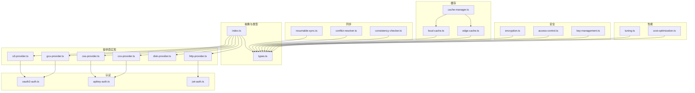
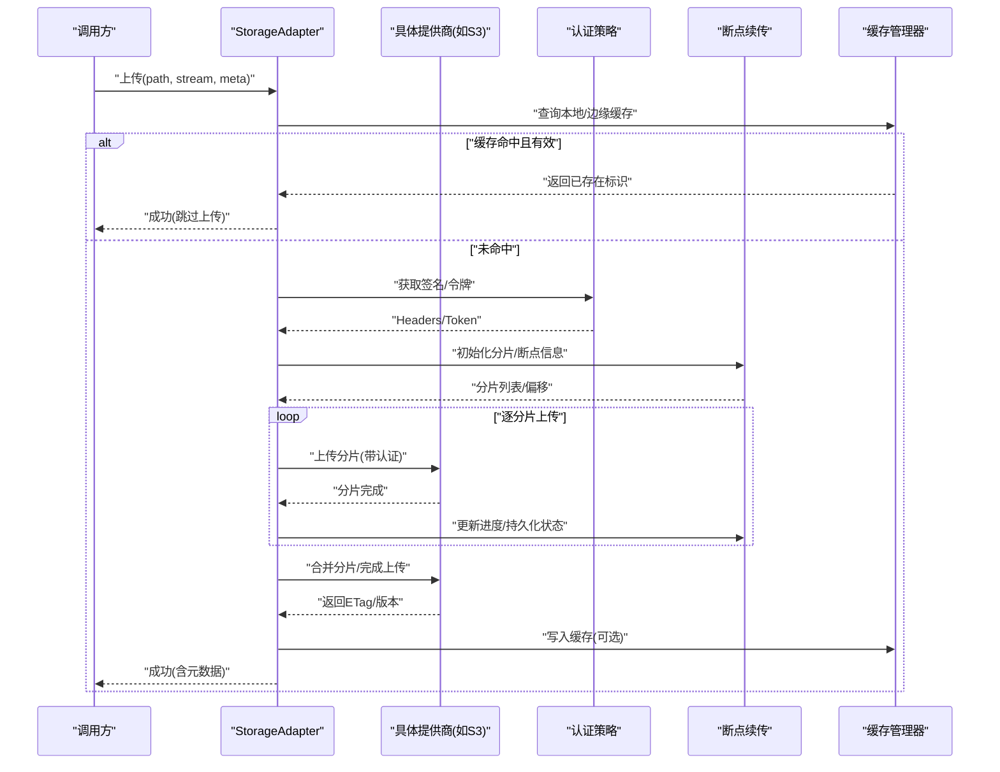
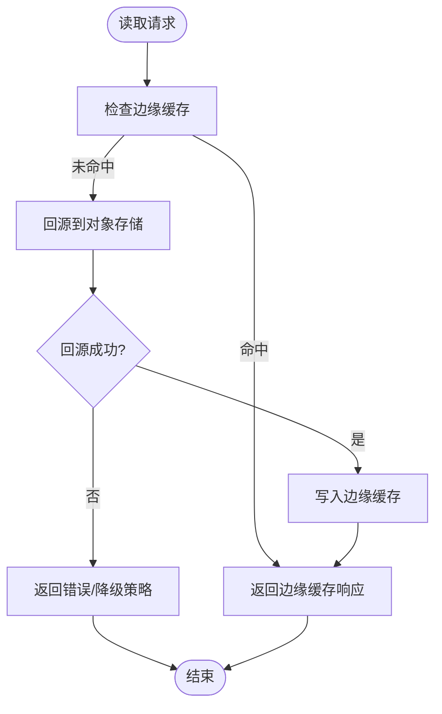
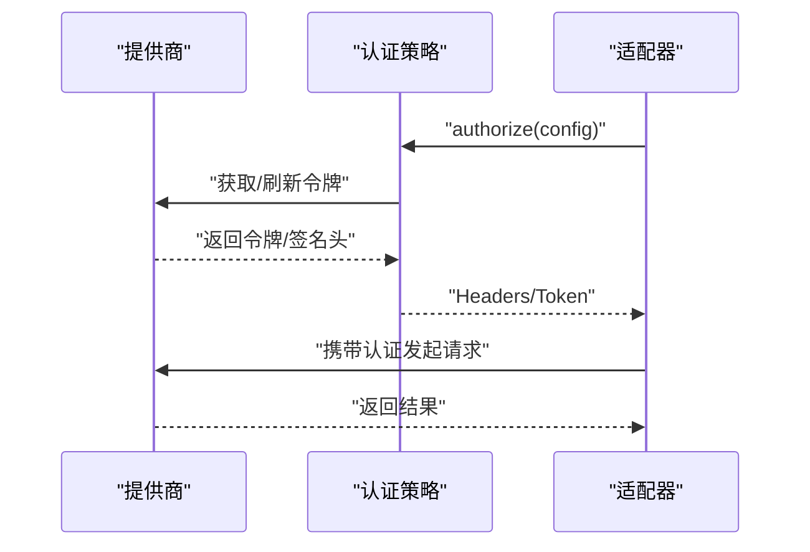
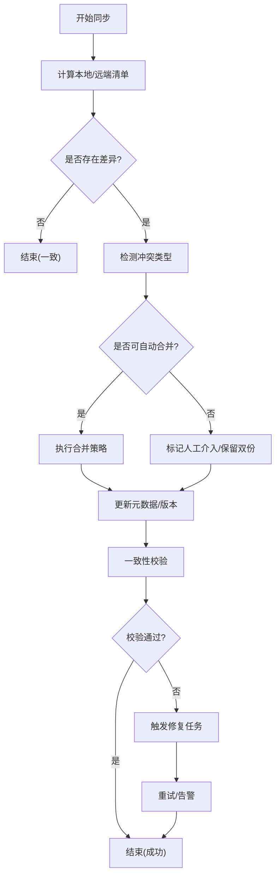
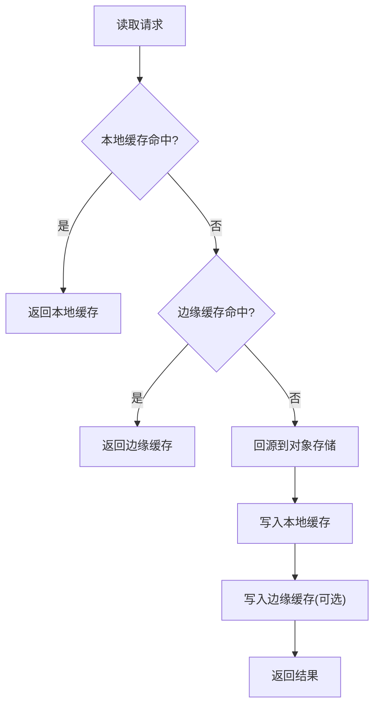
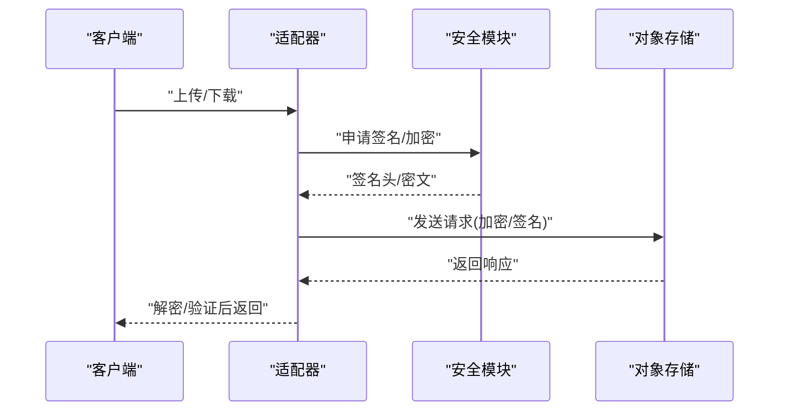
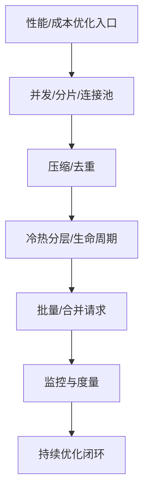
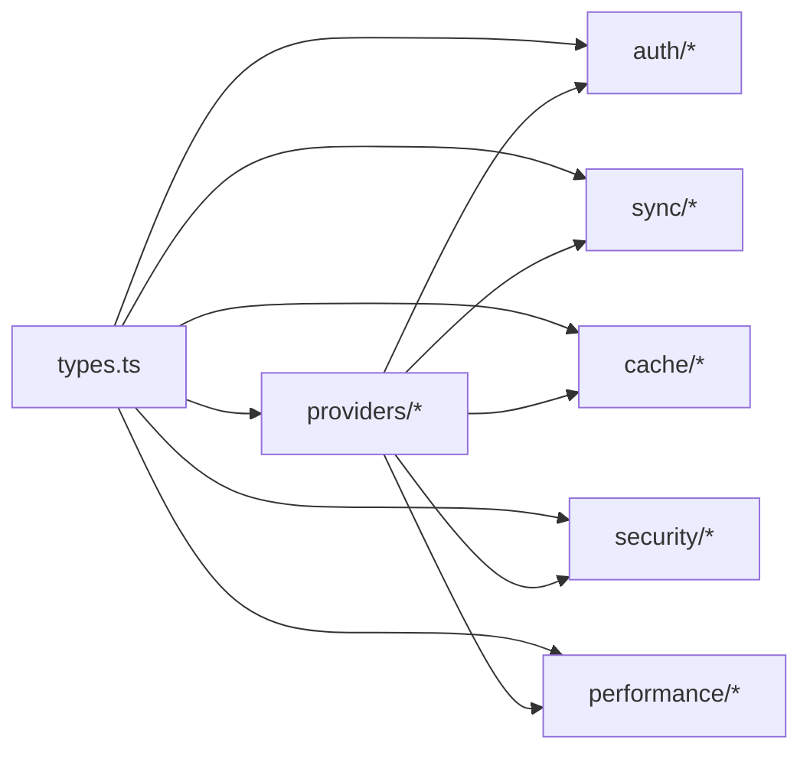

# 云存储适配器

<cite>
**本文引用的文件**   
- [engine/packages/adapters/README.md](file://engine/packages/adapters/README.md)
- [engine/packages/adapters/src/index.ts](file://engine/packages/adapters/src/index.ts)
- [engine/packages/adapters/src/types.ts](file://engine/packages/adapters/src/types.ts)
- [engine/packages/adapters/src/providers/s3-provider.ts](file://engine/packages/adapters/src/providers/s3-provider.ts)
- [engine/packages/adapters/src/providers/gcs-provider.ts](file://engine/packages/adapters/src/providers/gcs-provider.ts)
- [engine/packages/adapters/src/providers/oss-provider.ts](file://engine/packages/adapters/src/providers/oss-provider.ts)
- [engine/packages/adapters/src/providers/cos-provider.ts](file://engine/packages/adapters/src/providers/cos-provider.ts)
- [engine/packages/adapters/src/providers/disk-provider.ts](file://engine/packages/adapters/src/providers/disk-provider.ts)
- [engine/packages/adapters/src/providers/http-provider.ts](file://engine/packages/adapters/src/providers/http-provider.ts)
- [engine/packages/adapters/src/cache/local-cache.ts](file://engine/packages/adapters/src/cache/local-cache.ts)
- [engine/packages/adapters/src/cache/edge-cache.ts](file://engine/packages/adapters/src/cache/edge-cache.ts)
- [engine/packages/adapters/src/cache/cache-manager.ts](file://engine/packages/adapters/src/cache/cache-manager.ts)
- [engine/packages/adapters/src/auth/oauth2-auth.ts](file://engine/packages/adapters/src/auth/oauth2-auth.ts)
- [engine/packages/adapters/src/auth/apikey-auth.ts](file://engine/packages/adapters/src/auth/apikey-auth.ts)
- [engine/packages/adapters/src/auth/jwt-auth.ts](file://engine/packages/adapters/src/auth/jwt-auth.ts)
- [engine/packages/adapters/src/sync/resumable-sync.ts](file://engine/packages/adapters/src/sync/resumable-sync.ts)
- [engine/packages/adapters/src/sync/conflict-resolver.ts](file://engine/packages/adapters/src/sync/conflict-resolver.ts)
- [engine/packages/adapters/src/sync/consistency-checker.ts](file://engine/packages/adapters/src/sync/consistency-checker.ts)
- [engine/packages/adapters/src/security/encryption.ts](file://engine/packages/adapters/src/security/encryption.ts)
- [engine/packages/adapters/src/security/access-control.ts](file://engine/packages/adapters/src/security/access-control.ts)
- [engine/packages/adapters/src/security/key-management.ts](file://engine/packages/adapters/src/security/key-management.ts)
- [engine/packages/adapters/src/performance/tuning.ts](file://engine/packages/adapters/src/performance/tuning.ts)
- [engine/packages/adapters/src/performance/cost-optimization.ts](file://engine/packages/adapters/src/performance/cost-optimization.ts)
</cite>

## 目录
1. [简介](#简介)
2. [项目结构](#项目结构)
3. [核心组件](#核心组件)
4. [架构总览](#架构总览)
5. [详细组件分析](#详细组件分析)
6. [依赖分析](#依赖分析)
7. [性能考虑](#性能考虑)
8. [故障排查指南](#故障排查指南)
9. [结论](#结论)
10. [附录](#附录)

## 简介
本技术文档面向KCoder的云存储适配器，系统性阐述其抽象层设计、统一接口定义、多提供商支持、认证机制、对象存储与分布式文件系统集成、CDN服务对接、数据同步策略（断点续传、冲突解决、一致性保证）、缓存机制（本地缓存、边缘缓存、失效策略）、安全配置（加密传输、访问控制、密钥管理），以及性能调优与成本优化建议。文档旨在帮助开发者快速理解并扩展适配器能力，同时为运维与安全团队提供可操作的配置与排障指引。

## 项目结构
适配器采用分层与模块化组织方式：
- 抽象层与类型定义：统一接口、错误模型、配置项与事件契约
- 提供商实现：针对S3/GCS/OSS/COS/Disk/HTTP等后端的具体适配
- 认证模块：OAuth2、API Key、JWT等通用认证策略
- 同步模块：断点续传、冲突解决、一致性校验
- 缓存模块：本地缓存、边缘缓存、缓存管理器
- 安全模块：传输加密、访问控制、密钥管理
- 性能模块：并发与分片、压缩与去重、冷热分层与成本优化

图表来源
- [engine/packages/adapters/src/index.ts](file://engine/packages/adapters/src/index.ts)
- [engine/packages/adapters/src/types.ts](file://engine/packages/adapters/src/types.ts)
- [engine/packages/adapters/src/providers/s3-provider.ts](file://engine/packages/adapters/src/providers/s3-provider.ts)
- [engine/packages/adapters/src/providers/gcs-provider.ts](file://engine/packages/adapters/src/providers/gcs-provider.ts)
- [engine/packages/adapters/src/providers/oss-provider.ts](file://engine/packages/adapters/src/providers/oss-provider.ts)
- [engine/packages/adapters/src/providers/cos-provider.ts](file://engine/packages/adapters/src/providers/cos-provider.ts)
- [engine/packages/adapters/src/providers/disk-provider.ts](file://engine/packages/adapters/src/providers/disk-provider.ts)
- [engine/packages/adapters/src/providers/http-provider.ts](file://engine/packages/adapters/src/providers/http-provider.ts)
- [engine/packages/adapters/src/auth/oauth2-auth.ts](file://engine/packages/adapters/src/auth/oauth2-auth.ts)
- [engine/packages/adapters/src/auth/apikey-auth.ts](file://engine/packages/adapters/src/auth/apikey-auth.ts)
- [engine/packages/adapters/src/auth/jwt-auth.ts](file://engine/packages/adapters/src/auth/jwt-auth.ts)
- [engine/packages/adapters/src/sync/resumable-sync.ts](file://engine/packages/adapters/src/sync/resumable-sync.ts)
- [engine/packages/adapters/src/sync/conflict-resolver.ts](file://engine/packages/adapters/src/sync/conflict-resolver.ts)
- [engine/packages/adapters/src/sync/consistency-checker.ts](file://engine/packages/adapters/src/sync/consistency-checker.ts)
- [engine/packages/adapters/src/cache/local-cache.ts](file://engine/packages/adapters/src/cache/local-cache.ts)
- [engine/packages/adapters/src/cache/edge-cache.ts](file://engine/packages/adapters/src/cache/edge-cache.ts)
- [engine/packages/adapters/src/cache/cache-manager.ts](file://engine/packages/adapters/src/cache/cache-manager.ts)
- [engine/packages/adapters/src/security/encryption.ts](file://engine/packages/adapters/src/security/encryption.ts)
- [engine/packages/adapters/src/security/access-control.ts](file://engine/packages/adapters/src/security/access-control.ts)
- [engine/packages/adapters/src/security/key-management.ts](file://engine/packages/adapters/src/security/key-management.ts)
- [engine/packages/adapters/src/performance/tuning.ts](file://engine/packages/adapters/src/performance/tuning.ts)
- [engine/packages/adapters/src/performance/cost-optimization.ts](file://engine/packages/adapters/src/performance/cost-optimization.ts)

章节来源
- [engine/packages/adapters/README.md](file://engine/packages/adapters/README.md)
- [engine/packages/adapters/src/index.ts](file://engine/packages/adapters/src/index.ts)
- [engine/packages/adapters/src/types.ts](file://engine/packages/adapters/src/types.ts)

## 核心组件
- 统一接口与类型
  - 定义对象存储操作（上传、下载、列举、删除、元数据读写）与流式处理契约
  - 定义配置项（端点、桶名、区域、超时、重试、分片大小、签名算法等）
  - 定义错误模型与事件钩子（进度、失败、恢复）
- 提供商实现
  - S3兼容、GCS、阿里云OSS、腾讯云COS、本地磁盘、HTTP任意服务端
  - 各提供商通过统一接口暴露能力，内部封装SDK与协议差异
- 认证机制
  - OAuth2授权码/客户端凭据模式
  - API Key/HMAC签名
  - JWT令牌注入与刷新
- 数据同步
  - 断点续传：基于分片与元数据记录，支持中断恢复
  - 冲突解决：时间戳、版本号、内容哈希与合并策略
  - 一致性检查：双向校验、增量比对、修复任务
- 缓存机制
  - 本地缓存：LRU/TTL/容量上限/预取
  - 边缘缓存：就近节点、热路径加速、回源策略
  - 缓存管理器：命中路由、失效广播、跨进程共享
- 安全配置
  - 传输加密：TLS强制、证书校验、端到端加密
  - 访问控制：最小权限、动态令牌、细粒度ACL
  - 密钥管理：轮换、隔离、审计
- 性能与成本
  - 并发与分片、连接池、压缩与去重、冷热分层、请求批处理

章节来源
- [engine/packages/adapters/src/types.ts](file://engine/packages/adapters/src/types.ts)
- [engine/packages/adapters/src/providers/s3-provider.ts](file://engine/packages/adapters/src/providers/s3-provider.ts)
- [engine/packages/adapters/src/providers/gcs-provider.ts](file://engine/packages/adapters/src/providers/gcs-provider.ts)
- [engine/packages/adapters/src/providers/oss-provider.ts](file://engine/packages/adapters/src/providers/oss-provider.ts)
- [engine/packages/adapters/src/providers/cos-provider.ts](file://engine/packages/adapters/src/providers/cos-provider.ts)
- [engine/packages/adapters/src/providers/disk-provider.ts](file://engine/packages/adapters/src/providers/disk-provider.ts)
- [engine/packages/adapters/src/providers/http-provider.ts](file://engine/packages/adapters/src/providers/http-provider.ts)
- [engine/packages/adapters/src/auth/oauth2-auth.ts](file://engine/packages/adapters/src/auth/oauth2-auth.ts)
- [engine/packages/adapters/src/auth/apikey-auth.ts](file://engine/packages/adapters/src/auth/apikey-auth.ts)
- [engine/packages/adapters/src/auth/jwt-auth.ts](file://engine/packages/adapters/src/auth/jwt-auth.ts)
- [engine/packages/adapters/src/sync/resumable-sync.ts](file://engine/packages/adapters/src/sync/resumable-sync.ts)
- [engine/packages/adapters/src/sync/conflict-resolver.ts](file://engine/packages/adapters/src/sync/conflict-resolver.ts)
- [engine/packages/adapters/src/sync/consistency-checker.ts](file://engine/packages/adapters/src/sync/consistency-checker.ts)
- [engine/packages/adapters/src/cache/local-cache.ts](file://engine/packages/adapters/src/cache/local-cache.ts)
- [engine/packages/adapters/src/cache/edge-cache.ts](file://engine/packages/adapters/src/cache/edge-cache.ts)
- [engine/packages/adapters/src/cache/cache-manager.ts](file://engine/packages/adapters/src/cache/cache-manager.ts)
- [engine/packages/adapters/src/security/encryption.ts](file://engine/packages/adapters/src/security/encryption.ts)
- [engine/packages/adapters/src/security/access-control.ts](file://engine/packages/adapters/src/security/access-control.ts)
- [engine/packages/adapters/src/security/key-management.ts](file://engine/packages/adapters/src/security/key-management.ts)
- [engine/packages/adapters/src/performance/tuning.ts](file://engine/packages/adapters/src/performance/tuning.ts)
- [engine/packages/adapters/src/performance/cost-optimization.ts](file://engine/packages/adapters/src/performance/cost-optimization.ts)

## 架构总览
适配器以“统一接口 + 插件化提供商”为核心，上层业务无需感知底层差异；认证、同步、缓存、安全与性能模块作为横切能力被复用。

```mermaid
classDiagram
class StorageAdapter {
+upload(path, stream, meta) Promise~void~
+download(path, options) Promise~ReadableStream~
+list(prefix, options) Promise~Iterator~
+delete(path) Promise~void~
+getMeta(path) Promise~Metadata~
+setMeta(path, meta) Promise~void~
}
class S3Provider
class GCSProvider
class OSSProvider
class COSProvider
class DiskProvider
class HTTPProvider
class AuthStrategy {
<<interface>>
+authorize(config) Promise~Headers~
+refresh() Promise~void~
}
class OAuth2Auth
class ApiKeyAuth
class JwtAuth
class ResumableSync {
+resumeUpload(id, chunks) Promise~void~
+resumeDownload(id, offset) Promise~ReadableStream~
}
class ConflictResolver {
+resolve(local, remote) Promise~Resolved~
}
class ConsistencyChecker {
+check(bucket, prefix) Promise~Report~
+repair(report) Promise~void~
}
class LocalCache {
+get(key) Promise~any~
+set(key, value, ttl) Promise~void~
+invalidate(pattern) Promise~void~
}
class EdgeCache {
+fetch(url, opts) Promise~Response~
+purge(pattern) Promise~void~
}
class CacheManager {
+useLocal() boolean
+useEdge() boolean
+onMiss(callback) void
}
class Encryption {
+encrypt(data) Promise~Buffer~
+decrypt(data) Promise~Buffer~
}
class AccessControl {
+applyACL(resource, policy) Promise~void~
+generateSignedURL(resource, opts) Promise~string~
}
class KeyManagement {
+rotate() Promise~void~
+audit() Promise~AuditLog~
}
class PerformanceTuning {
+setConcurrency(n) void
+setChunkSize(bytes) void
+enableCompression(flag) void
}
class CostOptimization {
+setTier(tier) void
+enableDedup(flag) void
+scheduleCompaction(cron) void
}
StorageAdapter <|-- S3Provider
StorageAdapter <|-- GCSProvider
StorageAdapter <|-- OSSProvider
StorageAdapter <|-- COSProvider
StorageAdapter <|-- DiskProvider
StorageAdapter <|-- HTTPProvider
AuthStrategy <|-- OAuth2Auth
AuthStrategy <|-- ApiKeyAuth
AuthStrategy <|-- JwtAuth
S3Provider --> AuthStrategy : "使用"
GCSProvider --> AuthStrategy : "使用"
OSSProvider --> AuthStrategy : "使用"
COSProvider --> AuthStrategy : "使用"
HTTPProvider --> AuthStrategy : "使用"
StorageAdapter --> ResumableSync : "可选"
StorageAdapter --> ConflictResolver : "可选"
StorageAdapter --> ConsistencyChecker : "可选"
StorageAdapter --> CacheManager : "可选"
CacheManager --> LocalCache : "组合"
CacheManager --> EdgeCache : "组合"
StorageAdapter --> Encryption : "可选"
StorageAdapter --> AccessControl : "可选"
StorageAdapter --> KeyManagement : "可选"
StorageAdapter --> PerformanceTuning : "可选"
StorageAdapter --> CostOptimization : "可选"
```

图表来源
- [engine/packages/adapters/src/types.ts](file://engine/packages/adapters/src/types.ts)
- [engine/packages/adapters/src/providers/s3-provider.ts](file://engine/packages/adapters/src/providers/s3-provider.ts)
- [engine/packages/adapters/src/providers/gcs-provider.ts](file://engine/packages/adapters/src/providers/gcs-provider.ts)
- [engine/packages/adapters/src/providers/oss-provider.ts](file://engine/packages/adapters/src/providers/oss-provider.ts)
- [engine/packages/adapters/src/providers/cos-provider.ts](file://engine/packages/adapters/src/providers/cos-provider.ts)
- [engine/packages/adapters/src/providers/disk-provider.ts](file://engine/packages/adapters/src/providers/disk-provider.ts)
- [engine/packages/adapters/src/providers/http-provider.ts](file://engine/packages/adapters/src/providers/http-provider.ts)
- [engine/packages/adapters/src/auth/oauth2-auth.ts](file://engine/packages/adapters/src/auth/oauth2-auth.ts)
- [engine/packages/adapters/src/auth/apikey-auth.ts](file://engine/packages/adapters/src/auth/apikey-auth.ts)
- [engine/packages/adapters/src/auth/jwt-auth.ts](file://engine/packages/adapters/src/auth/jwt-auth.ts)
- [engine/packages/adapters/src/sync/resumable-sync.ts](file://engine/packages/adapters/src/sync/resumable-sync.ts)
- [engine/packages/adapters/src/sync/conflict-resolver.ts](file://engine/packages/adapters/src/sync/conflict-resolver.ts)
- [engine/packages/adapters/src/sync/consistency-checker.ts](file://engine/packages/adapters/src/sync/consistency-checker.ts)
- [engine/packages/adapters/src/cache/local-cache.ts](file://engine/packages/adapters/src/cache/local-cache.ts)
- [engine/packages/adapters/src/cache/edge-cache.ts](file://engine/packages/adapters/src/cache/edge-cache.ts)
- [engine/packages/adapters/src/cache/cache-manager.ts](file://engine/packages/adapters/src/cache/cache-manager.ts)
- [engine/packages/adapters/src/security/encryption.ts](file://engine/packages/adapters/src/security/encryption.ts)
- [engine/packages/adapters/src/security/access-control.ts](file://engine/packages/adapters/src/security/access-control.ts)
- [engine/packages/adapters/src/security/key-management.ts](file://engine/packages/adapters/src/security/key-management.ts)
- [engine/packages/adapters/src/performance/tuning.ts](file://engine/packages/adapters/src/performance/tuning.ts)
- [engine/packages/adapters/src/performance/cost-optimization.ts](file://engine/packages/adapters/src/performance/cost-optimization.ts)

## 详细组件分析

### 统一接口与类型定义
- 目标
  - 屏蔽不同云厂商的API差异，提供一致的上传、下载、列举、删除、元数据操作
  - 明确配置项、错误模型、事件回调与流式IO约定
- 关键点
  - 配置项包含端点、桶名、区域、超时、重试、分片大小、签名算法、缓存开关等
  - 错误模型区分网络错误、鉴权错误、资源不存在、配额超限等
  - 事件回调用于进度上报、失败重试、恢复通知
- 适用场景
  - 多后端切换、灰度发布、容灾切换
  - 上层应用无需关心具体实现细节

章节来源
- [engine/packages/adapters/src/types.ts](file://engine/packages/adapters/src/types.ts)

### 提供商实现（对象存储与分布式文件系统）
- S3兼容
  - 支持分片上传、并行下载、版本控制、生命周期策略
  - 典型配置：端点、AccessKey/SecretKey或STS临时凭证、桶名、区域、签名算法
- GCS
  - 支持OAuth2与服务账号、预签名URL、自动分片
  - 典型配置：项目ID、凭据路径、桶名、区域
- 阿里云OSS
  - 支持HMAC签名、跨区域复制、防盗链
  - 典型配置：Endpoint、AccessKey/SecretKey、Bucket、Region
- 腾讯云COS
  - 支持临时密钥、签名V4、跨域与防盗链
  - 典型配置：SecretId/SecretKey、Bucket、Region
- 本地磁盘
  - 开发调试与离线环境使用，模拟对象语义
  - 典型配置：根目录、权限掩码
- HTTP任意服务端
  - 通过RESTful接口对接自研或第三方对象存储网关
  - 典型配置：BaseURL、认证头模板、重试策略

图表来源
- [engine/packages/adapters/src/providers/s3-provider.ts](file://engine/packages/adapters/src/providers/s3-provider.ts)
- [engine/packages/adapters/src/auth/oauth2-auth.ts](file://engine/packages/adapters/src/auth/oauth2-auth.ts)
- [engine/packages/adapters/src/auth/apikey-auth.ts](file://engine/packages/adapters/src/auth/apikey-auth.ts)
- [engine/packages/adapters/src/sync/resumable-sync.ts](file://engine/packages/adapters/src/sync/resumable-sync.ts)
- [engine/packages/adapters/src/cache/cache-manager.ts](file://engine/packages/adapters/src/cache/cache-manager.ts)

章节来源
- [engine/packages/adapters/src/providers/s3-provider.ts](file://engine/packages/adapters/src/providers/s3-provider.ts)
- [engine/packages/adapters/src/providers/gcs-provider.ts](file://engine/packages/adapters/src/providers/gcs-provider.ts)
- [engine/packages/adapters/src/providers/oss-provider.ts](file://engine/packages/adapters/src/providers/oss-provider.ts)
- [engine/packages/adapters/src/providers/cos-provider.ts](file://engine/packages/adapters/src/providers/cos-provider.ts)
- [engine/packages/adapters/src/providers/disk-provider.ts](file://engine/packages/adapters/src/providers/disk-provider.ts)
- [engine/packages/adapters/src/providers/http-provider.ts](file://engine/packages/adapters/src/providers/http-provider.ts)

### CDN服务集成
- 角色定位
  - 将热点对象缓存至边缘节点，降低回源延迟与带宽成本
- 关键流程
  - 上传完成后触发预热或按需回源
  - 读取时优先走边缘缓存，未命中则回源到对象存储
  - 支持按前缀批量预热与失效
- 配置要点
  - 域名、缓存规则、回源白名单、鉴权参数透传

图表来源
- [engine/packages/adapters/src/cache/edge-cache.ts](file://engine/packages/adapters/src/cache/edge-cache.ts)
- [engine/packages/adapters/src/cache/cache-manager.ts](file://engine/packages/adapters/src/cache/cache-manager.ts)

章节来源
- [engine/packages/adapters/src/cache/edge-cache.ts](file://engine/packages/adapters/src/cache/edge-cache.ts)
- [engine/packages/adapters/src/cache/cache-manager.ts](file://engine/packages/adapters/src/cache/cache-manager.ts)

### 认证机制
- OAuth2
  - 支持授权码与客户端凭据模式，自动刷新令牌
  - 适用于GCS、部分S3兼容网关
- API Key/HMAC
  - 对请求进行签名，适用于OSS、COS等
- JWT
  - 在HTTP网关场景中注入Bearer Token
- 最佳实践
  - 最小权限原则、短期令牌、集中轮换、审计日志

图表来源
- [engine/packages/adapters/src/auth/oauth2-auth.ts](file://engine/packages/adapters/src/auth/oauth2-auth.ts)
- [engine/packages/adapters/src/auth/apikey-auth.ts](file://engine/packages/adapters/src/auth/apikey-auth.ts)
- [engine/packages/adapters/src/auth/jwt-auth.ts](file://engine/packages/adapters/src/auth/jwt-auth.ts)

章节来源
- [engine/packages/adapters/src/auth/oauth2-auth.ts](file://engine/packages/adapters/src/auth/oauth2-auth.ts)
- [engine/packages/adapters/src/auth/apikey-auth.ts](file://engine/packages/adapters/src/auth/apikey-auth.ts)
- [engine/packages/adapters/src/auth/jwt-auth.ts](file://engine/packages/adapters/src/auth/jwt-auth.ts)

### 数据同步策略
- 断点续传
  - 分片上传与下载，持久化分片状态，异常后从断点继续
- 冲突解决
  - 基于时间戳、版本号、内容哈希的策略选择，支持三方合并
- 一致性保证
  - 双向扫描与增量比对，生成修复任务，幂等执行

图表来源
- [engine/packages/adapters/src/sync/resumable-sync.ts](file://engine/packages/adapters/src/sync/resumable-sync.ts)
- [engine/packages/adapters/src/sync/conflict-resolver.ts](file://engine/packages/adapters/src/sync/conflict-resolver.ts)
- [engine/packages/adapters/src/sync/consistency-checker.ts](file://engine/packages/adapters/src/sync/consistency-checker.ts)

章节来源
- [engine/packages/adapters/src/sync/resumable-sync.ts](file://engine/packages/adapters/src/sync/resumable-sync.ts)
- [engine/packages/adapters/src/sync/conflict-resolver.ts](file://engine/packages/adapters/src/sync/conflict-resolver.ts)
- [engine/packages/adapters/src/sync/consistency-checker.ts](file://engine/packages/adapters/src/sync/consistency-checker.ts)

### 缓存机制设计
- 本地缓存
  - LRU淘汰、TTL过期、容量上限、预取与写穿
- 边缘缓存
  - 就近分发、按前缀预热、按规则失效
- 缓存管理器
  - 命中路由、多级回退、失效广播、监控指标

图表来源
- [engine/packages/adapters/src/cache/local-cache.ts](file://engine/packages/adapters/src/cache/local-cache.ts)
- [engine/packages/adapters/src/cache/edge-cache.ts](file://engine/packages/adapters/src/cache/edge-cache.ts)
- [engine/packages/adapters/src/cache/cache-manager.ts](file://engine/packages/adapters/src/cache/cache-manager.ts)

章节来源
- [engine/packages/adapters/src/cache/local-cache.ts](file://engine/packages/adapters/src/cache/local-cache.ts)
- [engine/packages/adapters/src/cache/edge-cache.ts](file://engine/packages/adapters/src/cache/edge-cache.ts)
- [engine/packages/adapters/src/cache/cache-manager.ts](file://engine/packages/adapters/src/cache/cache-manager.ts)

### 安全配置
- 加密传输
  - 强制TLS、证书校验、端到端加密（可选）
- 访问控制
  - 最小权限、动态令牌、细粒度ACL、预签名URL
- 密钥管理
  - 密钥轮换、隔离存储、审计追踪

图表来源
- [engine/packages/adapters/src/security/encryption.ts](file://engine/packages/adapters/src/security/encryption.ts)
- [engine/packages/adapters/src/security/access-control.ts](file://engine/packages/adapters/src/security/access-control.ts)
- [engine/packages/adapters/src/security/key-management.ts](file://engine/packages/adapters/src/security/key-management.ts)

章节来源
- [engine/packages/adapters/src/security/encryption.ts](file://engine/packages/adapters/src/security/encryption.ts)
- [engine/packages/adapters/src/security/access-control.ts](file://engine/packages/adapters/src/security/access-control.ts)
- [engine/packages/adapters/src/security/key-management.ts](file://engine/packages/adapters/src/security/key-management.ts)

### 性能调优与成本优化
- 性能调优
  - 并发度、分片大小、连接池、压缩、去重、批量操作
- 成本优化
  - 冷热分层、生命周期策略、请求合并、带宽与时段优化

图表来源
- [engine/packages/adapters/src/performance/tuning.ts](file://engine/packages/adapters/src/performance/tuning.ts)
- [engine/packages/adapters/src/performance/cost-optimization.ts](file://engine/packages/adapters/src/performance/cost-optimization.ts)

章节来源
- [engine/packages/adapters/src/performance/tuning.ts](file://engine/packages/adapters/src/performance/tuning.ts)
- [engine/packages/adapters/src/performance/cost-optimization.ts](file://engine/packages/adapters/src/performance/cost-optimization.ts)

## 依赖分析
- 耦合关系
  - 适配器与提供商松耦合，通过统一接口解耦
  - 认证、同步、缓存、安全、性能模块可插拔
- 外部依赖
  - 各提供商SDK、网络库、加密库、缓存后端
- 潜在风险
  - 循环依赖需避免；配置项变更需保持向后兼容

图表来源
- [engine/packages/adapters/src/types.ts](file://engine/packages/adapters/src/types.ts)
- [engine/packages/adapters/src/providers/s3-provider.ts](file://engine/packages/adapters/src/providers/s3-provider.ts)
- [engine/packages/adapters/src/auth/oauth2-auth.ts](file://engine/packages/adapters/src/auth/oauth2-auth.ts)
- [engine/packages/adapters/src/sync/resumable-sync.ts](file://engine/packages/adapters/src/sync/resumable-sync.ts)
- [engine/packages/adapters/src/cache/local-cache.ts](file://engine/packages/adapters/src/cache/local-cache.ts)
- [engine/packages/adapters/src/security/encryption.ts](file://engine/packages/adapters/src/security/encryption.ts)
- [engine/packages/adapters/src/performance/tuning.ts](file://engine/packages/adapters/src/performance/tuning.ts)

章节来源
- [engine/packages/adapters/src/types.ts](file://engine/packages/adapters/src/types.ts)
- [engine/packages/adapters/src/providers/s3-provider.ts](file://engine/packages/adapters/src/providers/s3-provider.ts)
- [engine/packages/adapters/src/auth/oauth2-auth.ts](file://engine/packages/adapters/src/auth/oauth2-auth.ts)
- [engine/packages/adapters/src/sync/resumable-sync.ts](file://engine/packages/adapters/src/sync/resumable-sync.ts)
- [engine/packages/adapters/src/cache/local-cache.ts](file://engine/packages/adapters/src/cache/local-cache.ts)
- [engine/packages/adapters/src/security/encryption.ts](file://engine/packages/adapters/src/security/encryption.ts)
- [engine/packages/adapters/src/performance/tuning.ts](file://engine/packages/adapters/src/performance/tuning.ts)

## 性能考虑
- 并发与分片
  - 根据网络与后端限制调整并发度与分片大小，平衡吞吐与内存占用
- 连接池与重试
  - 合理设置连接池大小、指数退避重试、熔断与限流
- 压缩与去重
  - 文本/代码类对象启用压缩；大文件去重减少重复存储
- 冷热分层
  - 热数据靠近用户，冷数据归档到低成本存储
- 监控与度量
  - 采集成功率、延迟、吞吐、缓存命中率、错误分布

[本节为通用指导，不直接分析具体文件]

## 故障排查指南
- 常见问题
  - 认证失败：检查凭据、签名算法、时钟同步
  - 网络超时：调整超时与重试、检查代理与防火墙
  - 分片上传失败：核对分片顺序与MD5/ETag、清理残留分片
  - 缓存不一致：检查TTL与失效策略、强制刷新
  - 一致性差异：查看差异报告、执行修复任务
- 诊断步骤
  - 开启详细日志与链路追踪
  - 复现最小用例，逐步隔离问题域
  - 对比不同提供商行为，确认是否为后端差异

章节来源
- [engine/packages/adapters/src/sync/resumable-sync.ts](file://engine/packages/adapters/src/sync/resumable-sync.ts)
- [engine/packages/adapters/src/sync/consistency-checker.ts](file://engine/packages/adapters/src/sync/consistency-checker.ts)
- [engine/packages/adapters/src/cache/cache-manager.ts](file://engine/packages/adapters/src/cache/cache-manager.ts)
- [engine/packages/adapters/src/auth/oauth2-auth.ts](file://engine/packages/adapters/src/auth/oauth2-auth.ts)
- [engine/packages/adapters/src/auth/apikey-auth.ts](file://engine/packages/adapters/src/auth/apikey-auth.ts)

## 结论
KCoder云存储适配器通过统一接口与插件化提供商实现了多云对象的无缝接入；结合认证、同步、缓存、安全与性能模块，提供了高可用、可扩展、可观测的云存储能力。建议在上线前完成安全基线配置、性能压测与成本评估，并在运行期持续监控与优化。

[本节为总结性内容，不直接分析具体文件]

## 附录
- 术语
  - 对象存储、分片上传、预签名URL、边缘缓存、冷热分层
- 参考
  - 各提供商官方文档与适配器示例配置

[本节为补充说明，不直接分析具体文件]