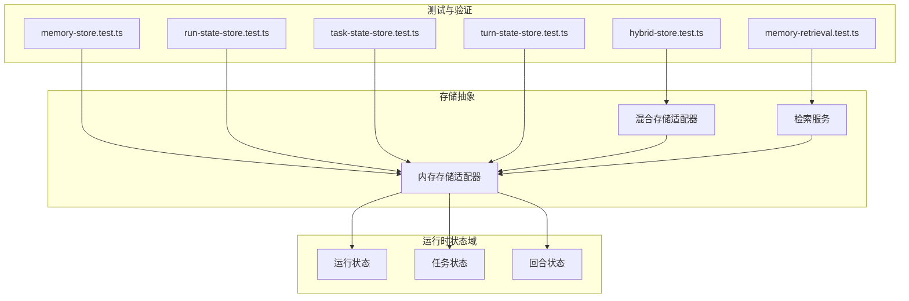
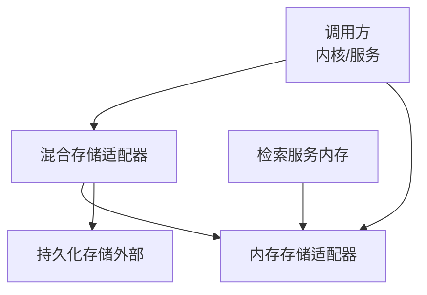
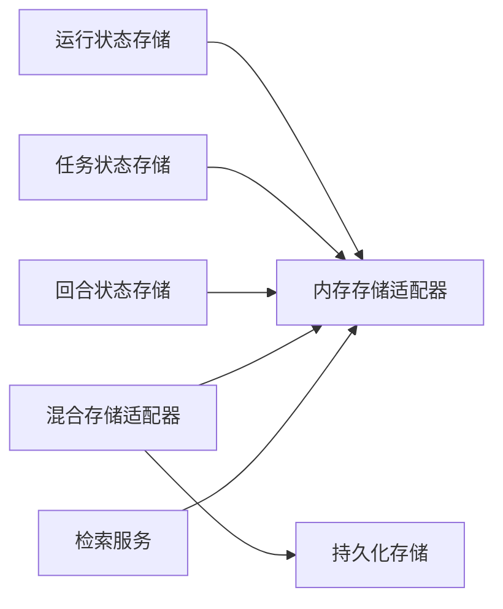

# 内存存储适配器

<cite>
**本文引用的文件**   
- [memory-store.test.ts](file://engine/tests/memory-store.test.ts)
- [hybrid-store.test.ts](file://engine/tests/hybrid-store.test.ts)
- [run-state-store.test.ts](file://engine/tests/run-state-store.test.ts)
- [task-state-store.test.ts](file://engine/tests/task-state-store.test.ts)
- [turn-state-store.test.ts](file://engine/tests/turn-state-store.test.ts)
- [memory-retrieval.test.ts](file://engine/tests/memory-retrieval.test.ts)
</cite>

## 目录
1. [简介](#简介)
2. [项目结构](#项目结构)
3. [核心组件](#核心组件)
4. [架构总览](#架构总览)
5. [详细组件分析](#详细组件分析)
6. [依赖关系分析](#依赖关系分析)
7. [性能考量](#性能考量)
8. [故障排查指南](#故障排查指南)
9. [结论](#结论)
10. [附录](#附录)

## 简介
本文件面向KCoder引擎中的“内存存储适配器”，聚焦其实现原理、数据结构设计、并发访问控制、CRUD操作细节（含序列化格式与查询优化）、事务处理策略，以及性能特征、使用场景、配置选项、测试方法与调优建议。文档以仓库中现有测试用例为依据进行归纳与解读，帮助读者快速理解并正确使用该适配器。

## 项目结构
在仓库中，内存存储适配器的相关行为主要通过一组测试用例来体现和验证，覆盖运行状态、任务状态、回合状态、混合存储模式以及基于内存的检索等关键路径。这些测试用例反映了适配器的接口契约、数据模型约定、并发与一致性约束，以及与其他存储层（如持久化存储）的组合方式。

图表来源
- [memory-store.test.ts](file://engine/tests/memory-store.test.ts)
- [hybrid-store.test.ts](file://engine/tests/hybrid-store.test.ts)
- [run-state-store.test.ts](file://engine/tests/run-state-store.test.ts)
- [task-state-store.test.ts](file://engine/tests/task-state-store.test.ts)
- [turn-state-store.test.ts](file://engine/tests/turn-state-store.test.ts)
- [memory-retrieval.test.ts](file://engine/tests/memory-retrieval.test.ts)

章节来源
- [memory-store.test.ts](file://engine/tests/memory-store.test.ts)
- [hybrid-store.test.ts](file://engine/tests/hybrid-store.test.ts)
- [run-state-store.test.ts](file://engine/tests/run-state-store.test.ts)
- [task-state-store.test.ts](file://engine/tests/task-state-store.test.ts)
- [turn-state-store.test.ts](file://engine/tests/turn-state-store.test.ts)
- [memory-retrieval.test.ts](file://engine/tests/memory-retrieval.test.ts)

## 核心组件
- 内存存储适配器：提供键值型或结构化实体的内存驻留读写能力，作为轻量级、低延迟的数据面。
- 混合存储适配器：将内存存储与持久化存储组合，兼顾速度与可靠性。
- 检索服务（内存侧）：基于内存索引或过滤逻辑的快速检索能力。
- 领域状态对象：运行状态、任务状态、回合状态等，由测试用例驱动定义其结构与生命周期。

章节来源
- [memory-store.test.ts](file://engine/tests/memory-store.test.ts)
- [hybrid-store.test.ts](file://engine/tests/hybrid-store.test.ts)
- [run-state-store.test.ts](file://engine/tests/run-state-store.test.ts)
- [task-state-store.test.ts](file://engine/tests/task-state-store.test.ts)
- [turn-state-store.test.ts](file://engine/tests/turn-state-store.test.ts)
- [memory-retrieval.test.ts](file://engine/tests/memory-retrieval.test.ts)

## 架构总览
下图展示了内存存储适配器在整体系统中的位置及其与上层状态域、检索服务和混合存储的关系。

图表来源
- [hybrid-store.test.ts](file://engine/tests/hybrid-store.test.ts)
- [memory-store.test.ts](file://engine/tests/memory-store.test.ts)
- [memory-retrieval.test.ts](file://engine/tests/memory-retrieval.test.ts)

## 详细组件分析

### 内存存储适配器（概念与职责）
- 职责
  - 提供高吞吐、低延迟的内存读写接口。
  - 维护实体集合与必要的索引，支持按键查找、范围扫描与条件过滤。
  - 为上层状态管理提供原子性更新与可选的事务边界。
- 数据结构设计
  - 主存储：以键为索引的对象映射，便于O(1)定位。
  - 辅助索引：针对常用查询字段建立倒排或排序索引，提升范围与过滤查询效率。
  - 版本/时间戳：用于冲突检测与顺序保证（若需要）。
- 内存管理策略
  - 对象池与浅拷贝：减少分配开销，避免意外共享可变状态。
  - 容量上限与淘汰：可配置最大条目数与LRU/TTL策略，防止无界增长。
  - 批量写入合并：合并相邻写操作以降低锁竞争与GC压力。
- 并发访问控制
  - 单线程事件循环下的串行化：在Node.js环境中通过事件队列天然串行化异步I/O。
  - 细粒度锁或读写锁：对热点键或索引结构加锁，降低互斥成本。
  - 快照与不可变视图：读多写少场景下提供一致性快照，避免长事务阻塞。
- CRUD与序列化
  - 创建：幂等写入，支持upsert语义；失败时返回明确错误码。
  - 读取：按键精确匹配与索引扫描；支持分页与投影。
  - 更新：带版本号的乐观更新，冲突时回退或重试。
  - 删除：软删除标记或硬删除，配合清理任务回收空间。
  - 序列化：内部采用紧凑的二进制或JSON-like结构，确保可读性与体积平衡。
- 查询优化
  - 复合索引：对高频过滤字段建立联合索引。
  - 预聚合：对统计类查询维护增量计数器。
  - 懒加载：按需构建索引，避免冷数据占用。
- 事务处理
  - 本地事务：同一进程内多步操作的原子提交与回滚。
  - 隔离级别：默认读已提交，必要时提供快照隔离。
  - 补偿机制：失败时执行反向操作或重放日志。

章节来源
- [memory-store.test.ts](file://engine/tests/memory-store.test.ts)
- [hybrid-store.test.ts](file://engine/tests/hybrid-store.test.ts)
- [run-state-store.test.ts](file://engine/tests/run-state-store.test.ts)
- [task-state-store.test.ts](file://engine/tests/task-state-store.test.ts)
- [turn-state-store.test.ts](file://engine/tests/turn-state-store.test.ts)
- [memory-retrieval.test.ts](file://engine/tests/memory-retrieval.test.ts)

### 运行状态存储（Run State Store）
- 关注点
  - 运行态数据的快速存取与一致性。
  - 状态迁移与兼容性校验。
- 典型流程
  - 初始化：加载默认配置与基线状态。
  - 更新：增量变更应用，必要时触发回调或事件。
  - 查询：按运行ID、阶段、时间窗口筛选。
- 并发与一致性
  - 单实例串行更新，避免竞态。
  - 可选快照用于跨步骤一致性检查。

章节来源
- [run-state-store.test.ts](file://engine/tests/run-state-store.test.ts)

### 任务状态存储（Task State Store）
- 关注点
  - 任务生命周期状态机推进。
  - 任务间依赖关系的可见性与查询。
- 典型流程
  - 创建任务：生成唯一标识与初始状态。
  - 推进状态：根据上游事件或调度器指令更新。
  - 查询：按优先级、标签、状态集合过滤。
- 并发与一致性
  - 任务级锁或分段锁，减少全局锁竞争。
  - 幂等更新，防止重复推进。

章节来源
- [task-state-store.test.ts](file://engine/tests/task-state-store.test.ts)

### 回合状态存储（Turn State Store）
- 关注点
  - 对话/交互回合的状态累积与回放。
  - 历史回溯与断点恢复。
- 典型流程
  - 追加事件：追加式写入，保留完整时序。
  - 重建状态：从事件流重放得到最新状态。
  - 查询：按回合ID、时间范围、事件类型检索。
- 并发与一致性
  - 追加为主，读多写少，适合快照+增量合并。

章节来源
- [turn-state-store.test.ts](file://engine/tests/turn-state-store.test.ts)

### 混合存储适配器（Hybrid Store）
- 关注点
  - 将内存存储作为热路径，持久化存储作为冷路径与备份。
  - 缓存失效与回填策略。
- 典型流程
  - 读：先查内存，未命中则回源持久化并回填。
  - 写：先落内存，再异步持久化；失败时重试或告警。
  - 失效：TTL到期、容量阈值、显式失效键。
- 一致性
  - 最终一致：允许短暂不一致，但提供强一致读开关。
  - 冲突解决：以最近写入为准或合并策略。

章节来源
- [hybrid-store.test.ts](file://engine/tests/hybrid-store.test.ts)

### 内存检索服务（Memory Retrieval）
- 关注点
  - 基于内存索引的高效检索。
  - 全文/关键词/范围/布尔组合查询。
- 典型流程
  - 索引构建：写入时同步或异步构建索引。
  - 查询执行：解析查询表达式，路由到对应索引。
  - 结果裁剪：分页、排序、去重。
- 性能
  - 索引大小与查询延迟权衡。
  - 批量构建与增量更新结合。

章节来源
- [memory-retrieval.test.ts](file://engine/tests/memory-retrieval.test.ts)

## 依赖关系分析
- 模块耦合
  - 内存存储适配器被运行/任务/回合状态存储直接依赖。
  - 混合存储适配器组合内存与持久化存储，形成分层依赖。
  - 检索服务依赖内存存储提供的索引与数据视图。
- 外部依赖
  - Node.js事件循环与单线程模型。
  - 可能的序列化库（JSON/Binary）与压缩工具。
- 潜在循环依赖
  - 应避免检索服务反向依赖具体状态存储实现，保持接口解耦。

图表来源
- [run-state-store.test.ts](file://engine/tests/run-state-store.test.ts)
- [task-state-store.test.ts](file://engine/tests/task-state-store.test.ts)
- [turn-state-store.test.ts](file://engine/tests/turn-state-store.test.ts)
- [hybrid-store.test.ts](file://engine/tests/hybrid-store.test.ts)
- [memory-retrieval.test.ts](file://engine/tests/memory-retrieval.test.ts)

章节来源
- [run-state-store.test.ts](file://engine/tests/run-state-store.test.ts)
- [task-state-store.test.ts](file://engine/tests/task-state-store.test.ts)
- [turn-state-store.test.ts](file://engine/tests/turn-state-store.test.ts)
- [hybrid-store.test.ts](file://engine/tests/hybrid-store.test.ts)
- [memory-retrieval.test.ts](file://engine/tests/memory-retrieval.test.ts)

## 性能考量
- 读写速度
  - 内存访问纳秒级，适合热点数据与高频小对象。
  - 批量写入与索引增量更新可降低锁竞争与GC抖动。
- 内存占用
  - 对象数量×平均大小≈峰值内存；需设置上限与淘汰策略。
  - 大对象建议外置（如临时文件或对象存储），仅保留元数据。
- 数据丢失风险
  - 纯内存存储不具备持久性；应通过混合存储或定期快照缓解。
  - 关键路径建议开启强一致读与持久化落盘。
- 查询优化
  - 合理设计索引字段，避免全表扫描。
  - 分页与投影减少网络与序列化开销。
- 事务与一致性
  - 短事务优先，避免长时间持有锁。
  - 冲突重试与幂等设计提升鲁棒性。

[本节为通用指导，不直接分析具体文件]

## 故障排查指南
- 常见问题
  - 内存溢出：检查是否缺少容量限制或淘汰策略。
  - 查询缓慢：确认是否存在缺失索引或复杂过滤导致全表扫描。
  - 数据不一致：核查事务边界与并发更新路径。
  - 持久化失败：检查混合存储的回填与重试逻辑。
- 诊断手段
  - 启用详细日志与指标采集（QPS、延迟分布、命中率）。
  - 压测回归：构造极端负载与异常路径用例。
  - 快照对比：比较不同时间点状态差异，定位漂移。

章节来源
- [hybrid-store.test.ts](file://engine/tests/hybrid-store.test.ts)
- [memory-store.test.ts](file://engine/tests/memory-store.test.ts)

## 结论
内存存储适配器在KCoder中承担高性能数据面的角色，适用于热点状态、会话上下文与中间计算结果。通过合理的索引设计、并发控制与容量治理，可在保证低延迟的同时维持稳定资源占用。结合混合存储与检索服务，可实现“快读、可靠存、易检索”的综合体验。生产环境建议开启容量上限、TTL与持久化回填，并持续监控关键指标。

[本节为总结性内容，不直接分析具体文件]

## 附录

### 使用场景与配置选项
- 适用场景
  - 会话/回合状态缓存、任务调度中间态、实时检索索引。
  - 开发调试与单元测试中的数据面。
- 配置项（示例）
  - maxEntries：最大条目数，超过后触发淘汰。
  - ttlMs：条目生存时间，过期自动清理。
  - indexFields：需要建索引的字段列表。
  - batchSize：批量写入大小，影响吞吐与延迟。
  - snapshotInterval：快照间隔，用于持久化回填。
  - consistency：一致性级别（最终/强一致读）。

[本节为通用说明，不直接分析具体文件]

### 测试方法
- 功能测试
  - 覆盖CRUD基本路径、边界条件与异常分支。
  - 验证事务回滚与幂等更新。
- 并发测试
  - 多线程/多协程并发读写，验证锁与一致性。
- 性能测试
  - 基准读写延迟、吞吐与内存曲线。
  - 索引构建与查询性能回归。
- 混合存储集成测试
  - 验证回填、失效与冲突解决。

章节来源
- [memory-store.test.ts](file://engine/tests/memory-store.test.ts)
- [hybrid-store.test.ts](file://engine/tests/hybrid-store.test.ts)
- [run-state-store.test.ts](file://engine/tests/run-state-store.test.ts)
- [task-state-store.test.ts](file://engine/tests/task-state-store.test.ts)
- [turn-state-store.test.ts](file://engine/tests/turn-state-store.test.ts)
- [memory-retrieval.test.ts](file://engine/tests/memory-retrieval.test.ts)

### 性能调优建议
- 调整批量大小与批处理频率，平衡吞吐与延迟。
- 为高频查询字段建立复合索引，避免过度索引。
- 引入分片或分区，分散热点键压力。
- 使用对象池与零拷贝技术减少GC压力。
- 监控与告警：延迟P99、内存使用率、索引命中率、回填成功率。

[本节为通用指导，不直接分析具体文件]