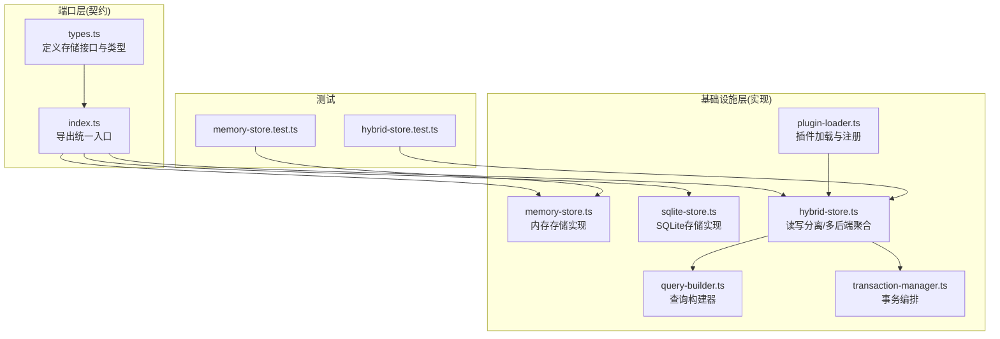
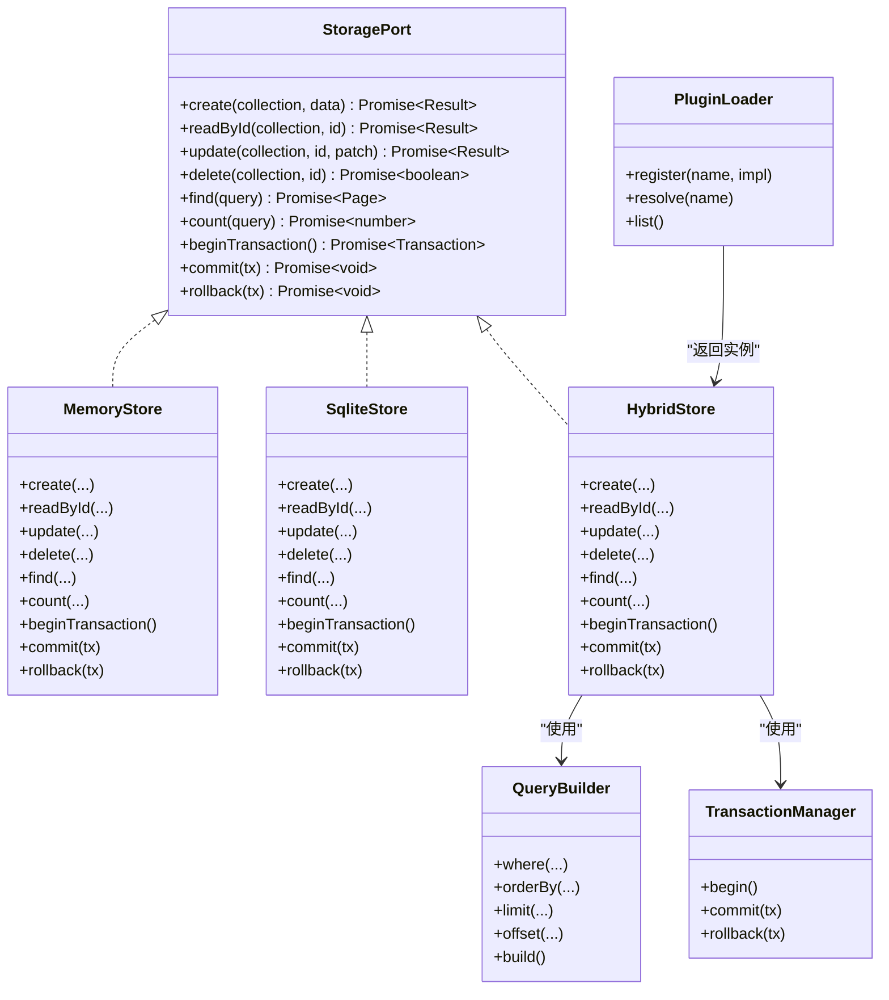
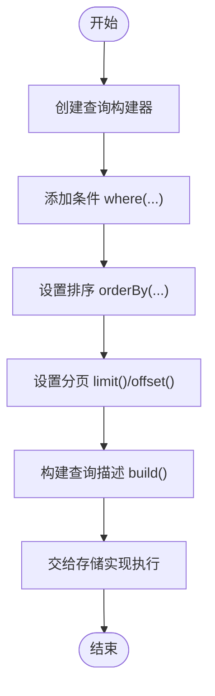
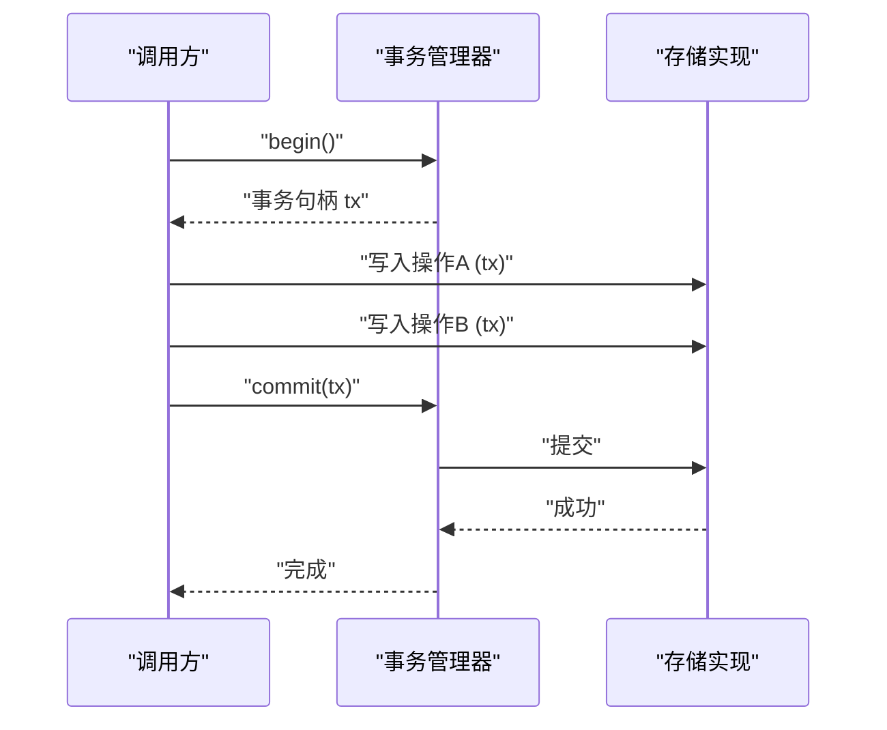
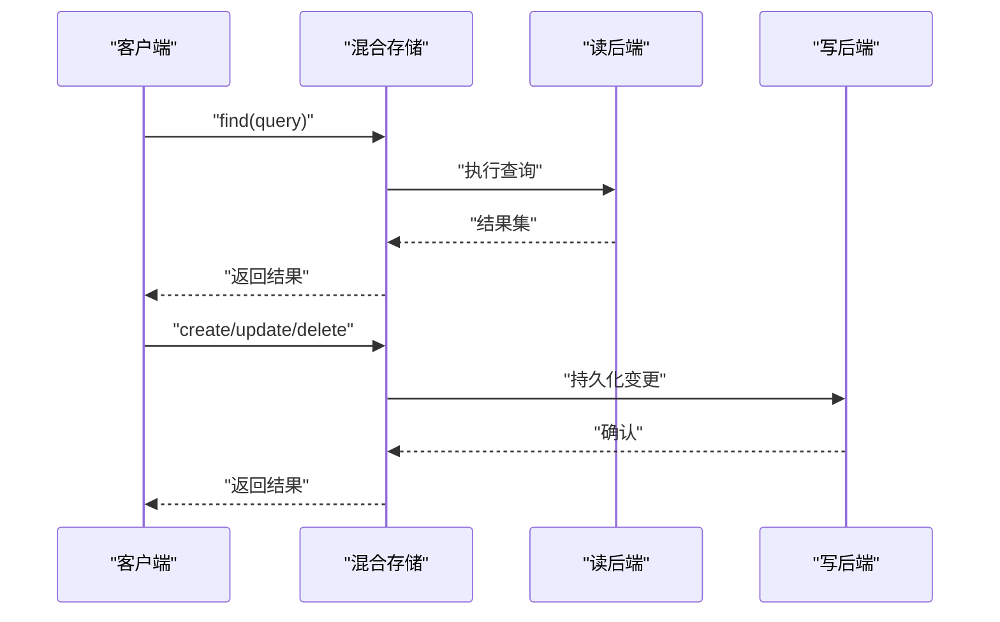
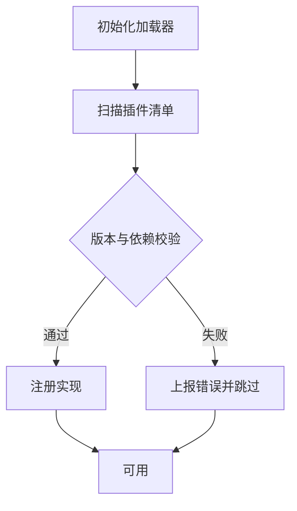
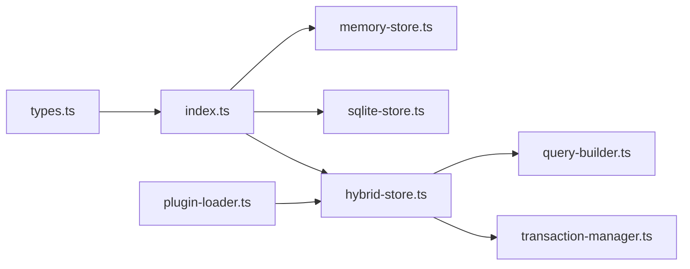

# 存储接口规范

<cite>
**本文引用的文件**   
- [engine/packages/ports-layer/src/storage/types.ts](file://engine/packages/ports-layer/src/storage/types.ts)
- [engine/packages/ports-layer/src/storage/index.ts](file://engine/packages/ports-layer/src/storage/index.ts)
- [engine/packages/infrastructure/src/storage/memory-store.ts](file://engine/packages/infrastructure/src/storage/memory-store.ts)
- [engine/packages/infrastructure/src/storage/sqlite-store.ts](file://engine/packages/infrastructure/src/storage/sqlite-store.ts)
- [engine/packages/infrastructure/src/storage/hybrid-store.ts](file://engine/packages/infrastructure/src/storage/hybrid-store.ts)
- [engine/packages/infrastructure/src/storage/query-builder.ts](file://engine/packages/infrastructure/src/storage/query-builder.ts)
- [engine/packages/infrastructure/src/storage/transaction-manager.ts](file://engine/packages/infrastructure/src/storage/transaction-manager.ts)
- [engine/packages/infrastructure/src/storage/plugin-loader.ts](file://engine/packages/infrastructure/src/storage/plugin-loader.ts)
- [engine/tests/hybrid-store.test.ts](file://engine/tests/hybrid-store.test.ts)
- [engine/tests/memory-store.test.ts](file://engine/tests/memory-store.test.ts)
</cite>

## 目录
1. [引言](#引言)
2. [项目结构](#项目结构)
3. [核心组件](#核心组件)
4. [架构总览](#架构总览)
5. [详细组件分析](#详细组件分析)
6. [依赖关系分析](#依赖关系分析)
7. [性能考量](#性能考量)
8. [故障排查指南](#故障排查指南)
9. [结论](#结论)
10. [附录](#附录)

## 引言
本文件面向KCoder的“存储抽象层”与“存储接口规范”，目标是：
- 统一CRUD接口、事务支持、查询构建器，形成一致的持久化契约
- 明确数据类型规范、错误处理与回调机制
- 提供存储适配器开发指南（实现要求、测试方法、性能基准）
- 说明存储插件机制（动态加载、版本兼容、依赖管理）
- 给出扩展点（自定义类型、查询扩展、事件钩子）
- 总结设计模式与最佳实践

## 项目结构
存储相关代码主要分布在以下包中：
- ports-layer：定义存储端口（接口与类型），作为上层业务与底层实现的契约
- infrastructure：提供基础设施实现（内存、SQLite、混合存储）、查询构建器、事务管理器、插件加载器
- tests：覆盖关键场景（混合存储、内存存储等）

图表来源
- [engine/packages/ports-layer/src/storage/types.ts](file://engine/packages/ports-layer/src/storage/types.ts)
- [engine/packages/ports-layer/src/storage/index.ts](file://engine/packages/ports-layer/src/storage/index.ts)
- [engine/packages/infrastructure/src/storage/memory-store.ts](file://engine/packages/infrastructure/src/storage/memory-store.ts)
- [engine/packages/infrastructure/src/storage/sqlite-store.ts](file://engine/packages/infrastructure/src/storage/sqlite-store.ts)
- [engine/packages/infrastructure/src/storage/hybrid-store.ts](file://engine/packages/infrastructure/src/storage/hybrid-store.ts)
- [engine/packages/infrastructure/src/storage/query-builder.ts](file://engine/packages/infrastructure/src/storage/query-builder.ts)
- [engine/packages/infrastructure/src/storage/transaction-manager.ts](file://engine/packages/infrastructure/src/storage/transaction-manager.ts)
- [engine/packages/infrastructure/src/storage/plugin-loader.ts](file://engine/packages/infrastructure/src/storage/plugin-loader.ts)
- [engine/tests/hybrid-store.test.ts](file://engine/tests/hybrid-store.test.ts)
- [engine/tests/memory-store.test.ts](file://engine/tests/memory-store.test.ts)

章节来源
- [engine/packages/ports-layer/src/storage/types.ts](file://engine/packages/ports-layer/src/storage/types.ts)
- [engine/packages/ports-layer/src/storage/index.ts](file://engine/packages/ports-layer/src/storage/index.ts)
- [engine/packages/infrastructure/src/storage/hybrid-store.ts](file://engine/packages/infrastructure/src/storage/hybrid-store.ts)
- [engine/packages/infrastructure/src/storage/query-builder.ts](file://engine/packages/infrastructure/src/storage/query-builder.ts)
- [engine/packages/infrastructure/src/storage/transaction-manager.ts](file://engine/packages/infrastructure/src/storage/transaction-manager.ts)
- [engine/packages/infrastructure/src/storage/plugin-loader.ts](file://engine/packages/infrastructure/src/storage/plugin-loader.ts)
- [engine/tests/hybrid-store.test.ts](file://engine/tests/hybrid-store.test.ts)
- [engine/tests/memory-store.test.ts](file://engine/tests/memory-store.test.ts)

## 核心组件
- 存储接口与类型（ports-layer）
  - 定义统一的CRUD操作、分页与过滤参数、结果集、错误码与回调约定
  - 通过索引导出，供上层模块以“端口”方式依赖，屏蔽具体实现差异
- 基础实现（infrastructure）
  - 内存存储：轻量、无外部依赖，适合单元测试与快速原型
  - SQLite存储：基于SQLite，具备ACID特性，适合本地持久化
  - 混合存储：将读路径路由至只读副本或缓存，写路径落盘主库，提升读取吞吐
- 通用能力
  - 查询构建器：链式API构造条件、排序、分页、投影等
  - 事务管理器：跨多个集合/表的事务编排与回滚
  - 插件加载器：运行时发现并注册新的存储实现，支持版本兼容与依赖声明

章节来源
- [engine/packages/ports-layer/src/storage/types.ts](file://engine/packages/ports-layer/src/storage/types.ts)
- [engine/packages/ports-layer/src/storage/index.ts](file://engine/packages/ports-layer/src/storage/index.ts)
- [engine/packages/infrastructure/src/storage/memory-store.ts](file://engine/packages/infrastructure/src/storage/memory-store.ts)
- [engine/packages/infrastructure/src/storage/sqlite-store.ts](file://engine/packages/infrastructure/src/storage/sqlite-store.ts)
- [engine/packages/infrastructure/src/storage/hybrid-store.ts](file://engine/packages/infrastructure/src/storage/hybrid-store.ts)
- [engine/packages/infrastructure/src/storage/query-builder.ts](file://engine/packages/infrastructure/src/storage/query-builder.ts)
- [engine/packages/infrastructure/src/storage/transaction-manager.ts](file://engine/packages/infrastructure/src/storage/transaction-manager.ts)
- [engine/packages/infrastructure/src/storage/plugin-loader.ts](file://engine/packages/infrastructure/src/storage/plugin-loader.ts)

## 架构总览
存储抽象层采用“端口-适配”模式：上层仅依赖端口定义，运行时由插件加载器装配具体实现。

图表来源
- [engine/packages/ports-layer/src/storage/types.ts](file://engine/packages/ports-layer/src/storage/types.ts)
- [engine/packages/infrastructure/src/storage/memory-store.ts](file://engine/packages/infrastructure/src/storage/memory-store.ts)
- [engine/packages/infrastructure/src/storage/sqlite-store.ts](file://engine/packages/infrastructure/src/storage/sqlite-store.ts)
- [engine/packages/infrastructure/src/storage/hybrid-store.ts](file://engine/packages/infrastructure/src/storage/hybrid-store.ts)
- [engine/packages/infrastructure/src/storage/query-builder.ts](file://engine/packages/infrastructure/src/storage/query-builder.ts)
- [engine/packages/infrastructure/src/storage/transaction-manager.ts](file://engine/packages/infrastructure/src/storage/transaction-manager.ts)
- [engine/packages/infrastructure/src/storage/plugin-loader.ts](file://engine/packages/infrastructure/src/storage/plugin-loader.ts)

## 详细组件分析

### 存储接口与类型（端口层）
- 职责
  - 定义集合级CRUD、分页查询、计数、事务边界
  - 定义统一的数据类型（文档/记录）、查询条件、排序、分页、结果页
  - 定义错误模型与回调约定（可选）
- 设计要点
  - 所有I/O操作均返回Promise，便于异步编排
  - 查询参数与结果结构稳定，避免实现差异导致上层耦合
  - 错误对象包含可识别的错误码与上下文信息，便于重试与降级

章节来源
- [engine/packages/ports-layer/src/storage/types.ts](file://engine/packages/ports-layer/src/storage/types.ts)
- [engine/packages/ports-layer/src/storage/index.ts](file://engine/packages/ports-layer/src/storage/index.ts)

### 查询构建器
- 职责
  - 提供链式API构建where/orderBy/limit/offset等查询片段
  - 输出与具体存储无关的查询描述，交由各实现解析执行
- 典型用法
  - 组合多条件、分页、排序、字段投影
  - 在事务内复用同一构建器实例，保证一致性

图表来源
- [engine/packages/infrastructure/src/storage/query-builder.ts](file://engine/packages/infrastructure/src/storage/query-builder.ts)

章节来源
- [engine/packages/infrastructure/src/storage/query-builder.ts](file://engine/packages/infrastructure/src/storage/query-builder.ts)

### 事务管理器
- 职责
  - 封装事务生命周期：开始、提交、回滚
  - 为多集合/多表操作提供一致的事务语义
- 行为约定
  - begin返回事务句柄；commit/rollback接受该句柄
  - 异常自动触发回滚（若上层未显式处理）

图表来源
- [engine/packages/infrastructure/src/storage/transaction-manager.ts](file://engine/packages/infrastructure/src/storage/transaction-manager.ts)
- [engine/packages/infrastructure/src/storage/hybrid-store.ts](file://engine/packages/infrastructure/src/storage/hybrid-store.ts)

章节来源
- [engine/packages/infrastructure/src/storage/transaction-manager.ts](file://engine/packages/infrastructure/src/storage/transaction-manager.ts)
- [engine/packages/infrastructure/src/storage/hybrid-store.ts](file://engine/packages/infrastructure/src/storage/hybrid-store.ts)

### 混合存储（Hybrid Store）
- 职责
  - 聚合多种后端：读路径走高性能后端（如内存/缓存），写路径落盘主库（如SQLite）
  - 负责数据一致性策略（如写后失效/延迟同步）
- 关键点
  - 对上层暴露统一StoragePort
  - 内部协调Query与事务，确保读写一致性

图表来源
- [engine/packages/infrastructure/src/storage/hybrid-store.ts](file://engine/packages/infrastructure/src/storage/hybrid-store.ts)

章节来源
- [engine/packages/infrastructure/src/storage/hybrid-store.ts](file://engine/packages/infrastructure/src/storage/hybrid-store.ts)

### 内存存储与SQLite存储
- 内存存储
  - 特点：零依赖、进程内、速度快、重启丢失
  - 适用：单元测试、集成测试、快速原型
- SQLite存储
  - 特点：ACID、单文件数据库、并发受限但足够满足多数场景
  - 适用：本地持久化、离线优先应用

章节来源
- [engine/packages/infrastructure/src/storage/memory-store.ts](file://engine/packages/infrastructure/src/storage/memory-store.ts)
- [engine/packages/infrastructure/src/storage/sqlite-store.ts](file://engine/packages/infrastructure/src/storage/sqlite-store.ts)

### 插件加载器
- 职责
  - 运行时发现并注册存储实现
  - 维护名称到实现的映射，支持按名解析
- 版本兼容与依赖
  - 插件元数据声明最小/最大兼容版本
  - 依赖声明用于启动顺序与可用性检查

图表来源
- [engine/packages/infrastructure/src/storage/plugin-loader.ts](file://engine/packages/infrastructure/src/storage/plugin-loader.ts)

章节来源
- [engine/packages/infrastructure/src/storage/plugin-loader.ts](file://engine/packages/infrastructure/src/storage/plugin-loader.ts)

## 依赖关系分析
- 低耦合：上层仅依赖端口定义（types/index），不感知具体实现
- 可扩展：通过插件加载器动态装配新实现
- 可替换：在相同端口下自由切换内存/SQLite/混合存储

图表来源
- [engine/packages/ports-layer/src/storage/types.ts](file://engine/packages/ports-layer/src/storage/types.ts)
- [engine/packages/ports-layer/src/storage/index.ts](file://engine/packages/ports-layer/src/storage/index.ts)
- [engine/packages/infrastructure/src/storage/memory-store.ts](file://engine/packages/infrastructure/src/storage/memory-store.ts)
- [engine/packages/infrastructure/src/storage/sqlite-store.ts](file://engine/packages/infrastructure/src/storage/sqlite-store.ts)
- [engine/packages/infrastructure/src/storage/hybrid-store.ts](file://engine/packages/infrastructure/src/storage/hybrid-store.ts)
- [engine/packages/infrastructure/src/storage/query-builder.ts](file://engine/packages/infrastructure/src/storage/query-builder.ts)
- [engine/packages/infrastructure/src/storage/transaction-manager.ts](file://engine/packages/infrastructure/src/storage/transaction-manager.ts)
- [engine/packages/infrastructure/src/storage/plugin-loader.ts](file://engine/packages/infrastructure/src/storage/plugin-loader.ts)

章节来源
- [engine/packages/ports-layer/src/storage/types.ts](file://engine/packages/ports-layer/src/storage/types.ts)
- [engine/packages/ports-layer/src/storage/index.ts](file://engine/packages/ports-layer/src/storage/index.ts)
- [engine/packages/infrastructure/src/storage/hybrid-store.ts](file://engine/packages/infrastructure/src/storage/hybrid-store.ts)
- [engine/packages/infrastructure/src/storage/plugin-loader.ts](file://engine/packages/infrastructure/src/storage/plugin-loader.ts)

## 性能考量
- 读多写少场景
  - 使用混合存储，读路径走内存/缓存，写路径落盘主库
  - 合理设置分页大小与索引字段，避免全表扫描
- 事务粒度
  - 尽量缩小事务范围，减少锁竞争与长事务风险
- 批量操作
  - 合并多次写入为批量事务，降低I/O次数
- 连接与资源
  - SQLite注意并发限制，必要时引入队列串行化写操作
  - 及时关闭不必要的连接与释放资源

[本节为通用指导，无需源码引用]

## 故障排查指南
- 常见问题定位
  - 查询结果为空：检查查询构建器的条件与分页参数是否正确
  - 事务未生效：确认是否在同一事务句柄内执行所有操作
  - 插件未加载：核对插件元数据的版本兼容与依赖声明
- 日志与断点
  - 在事务提交/回滚处、插件注册处增加日志
  - 针对混合存储的读写路由路径增加追踪
- 回归测试
  - 使用现有测试用例验证基本CRUD与事务行为
  - 新增自定义类型时，补充对应测试

章节来源
- [engine/tests/hybrid-store.test.ts](file://engine/tests/hybrid-store.test.ts)
- [engine/tests/memory-store.test.ts](file://engine/tests/memory-store.test.ts)

## 结论
通过统一的存储端口、完善的查询与事务能力、以及插件化的实现装配机制，KCoder的存储抽象层实现了高内聚、低耦合与强扩展性。遵循本文档的规范与实践，可在不同运行环境与需求下灵活选择与演进存储方案。

[本节为总结，无需源码引用]

## 附录

### 接口与类型规范（摘要）
- 集合与记录
  - 集合：字符串标识
  - 记录：键值对象，需包含唯一标识字段
- CRUD
  - create：插入新记录，返回已创建记录
  - readById：按ID读取
  - update：按ID更新部分字段
  - delete：按ID删除
- 查询
  - find：支持条件、排序、分页
  - count：统计匹配数量
- 事务
  - begin/commit/rollback：标准事务生命周期
- 错误
  - 统一错误对象，包含错误码、消息与上下文

章节来源
- [engine/packages/ports-layer/src/storage/types.ts](file://engine/packages/ports-layer/src/storage/types.ts)

### 适配器开发指南
- 实现要求
  - 完整实现StoragePort所有方法
  - 严格遵循事务语义与错误模型
  - 保持查询构建器输出的兼容性
- 测试方法
  - 覆盖CRUD、分页、排序、事务、错误分支
  - 使用内存存储作为参考实现进行对比测试
- 性能基准
  - 设定固定数据集规模，测量QPS与P99延迟
  - 对比不同实现在不同负载下的表现

章节来源
- [engine/packages/infrastructure/src/storage/memory-store.ts](file://engine/packages/infrastructure/src/storage/memory-store.ts)
- [engine/packages/infrastructure/src/storage/sqlite-store.ts](file://engine/packages/infrastructure/src/storage/sqlite-store.ts)
- [engine/tests/memory-store.test.ts](file://engine/tests/memory-store.test.ts)

### 插件机制（动态加载、版本兼容、依赖管理）
- 动态加载
  - 启动阶段扫描插件清单，按需注册
- 版本兼容
  - 声明最小/最大兼容版本，不满足则拒绝加载
- 依赖管理
  - 声明依赖项，确保前置依赖就绪后再加载

章节来源
- [engine/packages/infrastructure/src/storage/plugin-loader.ts](file://engine/packages/infrastructure/src/storage/plugin-loader.ts)

### 扩展点
- 自定义类型
  - 在类型定义中扩展记录字段与校验规则
- 查询扩展
  - 在查询构建器中追加新的条件/投影/排序能力
- 事件钩子
  - 在事务提交/回滚、读写完成后触发钩子，用于审计与监控

章节来源
- [engine/packages/ports-layer/src/storage/types.ts](file://engine/packages/ports-layer/src/storage/types.ts)
- [engine/packages/infrastructure/src/storage/query-builder.ts](file://engine/packages/infrastructure/src/storage/query-builder.ts)
- [engine/packages/infrastructure/src/storage/transaction-manager.ts](file://engine/packages/infrastructure/src/storage/transaction-manager.ts)

### 设计模式与最佳实践
- 端口-适配模式：解耦上层与实现
- 工厂/注册表模式：插件加载与实现解析
- 构建器模式：查询构建器链式API
- 事务模式：统一事务边界与一致性
- 最佳实践
  - 始终通过端口访问存储
  - 谨慎使用全局状态，优先依赖注入
  - 为关键路径编写可复用的测试用例

章节来源
- [engine/packages/ports-layer/src/storage/index.ts](file://engine/packages/ports-layer/src/storage/index.ts)
- [engine/packages/infrastructure/src/storage/plugin-loader.ts](file://engine/packages/infrastructure/src/storage/plugin-loader.ts)
- [engine/packages/infrastructure/src/storage/query-builder.ts](file://engine/packages/infrastructure/src/storage/query-builder.ts)
- [engine/packages/infrastructure/src/storage/transaction-manager.ts](file://engine/packages/infrastructure/src/storage/transaction-manager.ts)