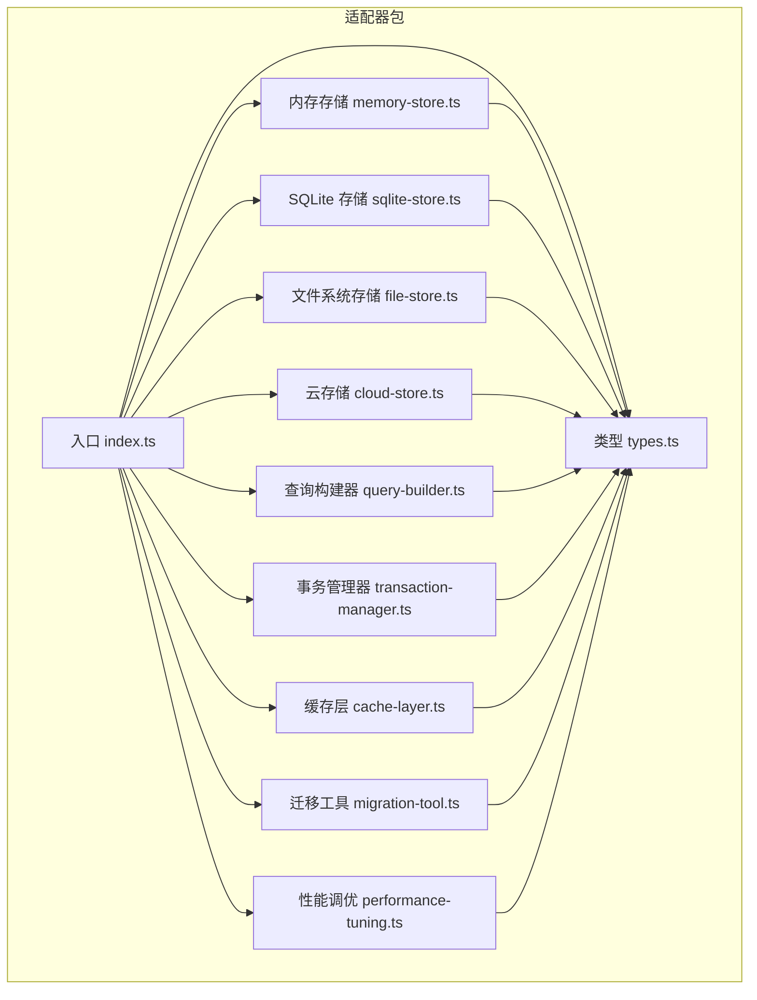
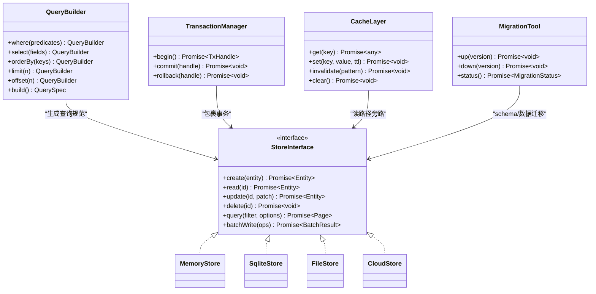
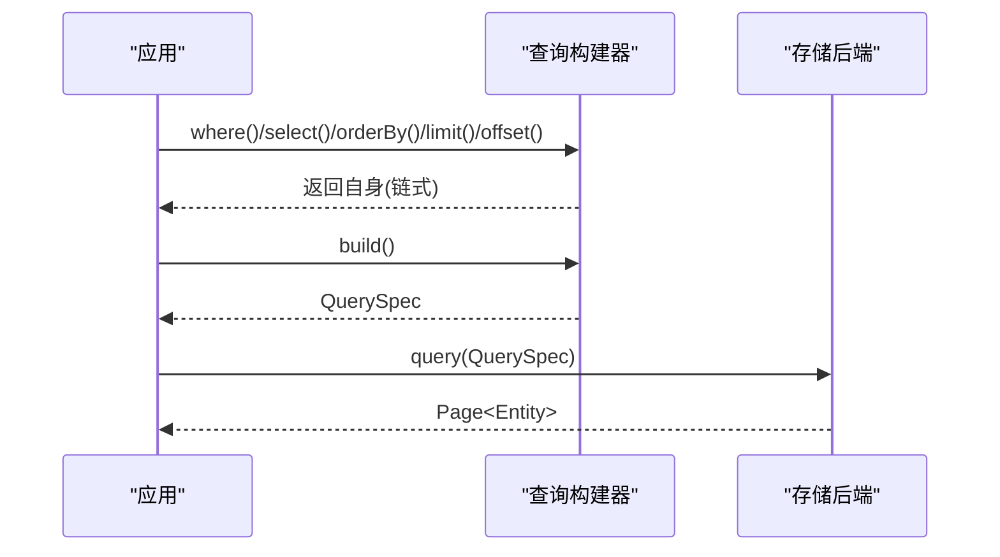
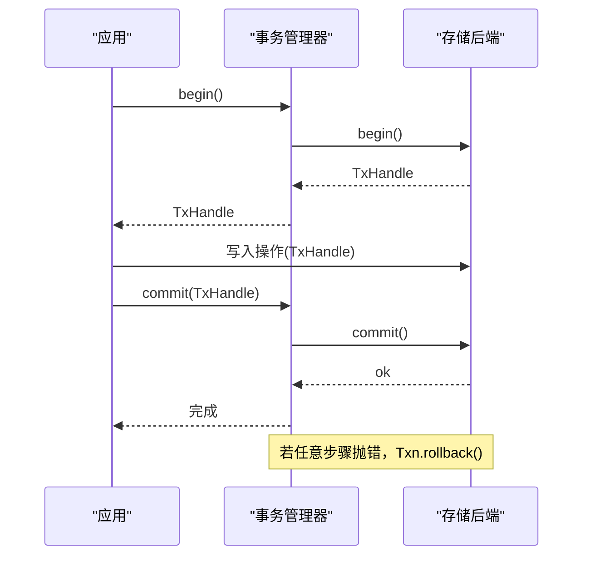
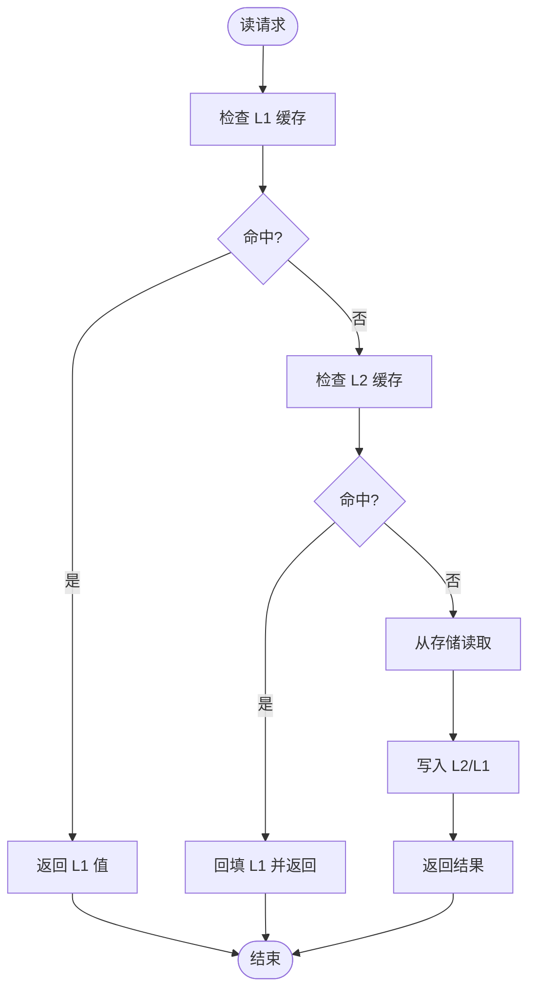
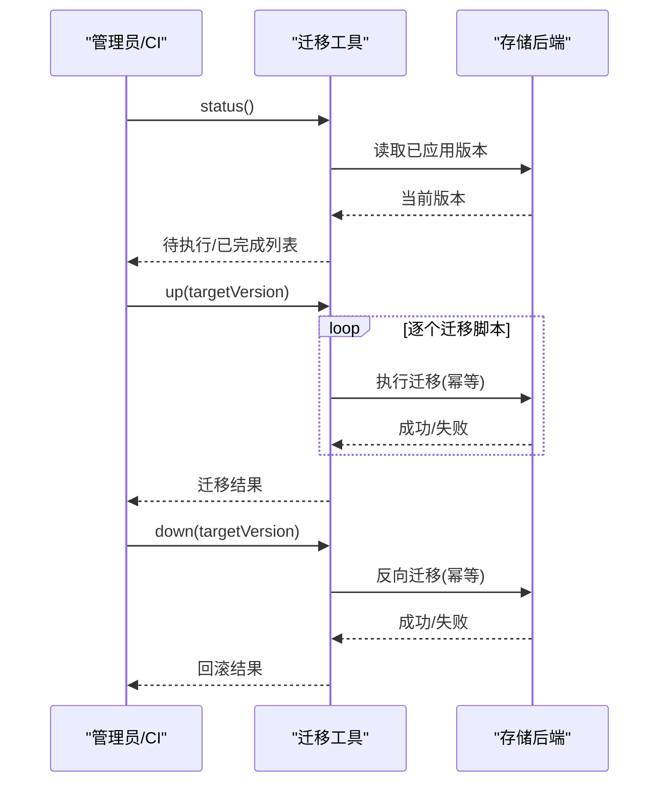
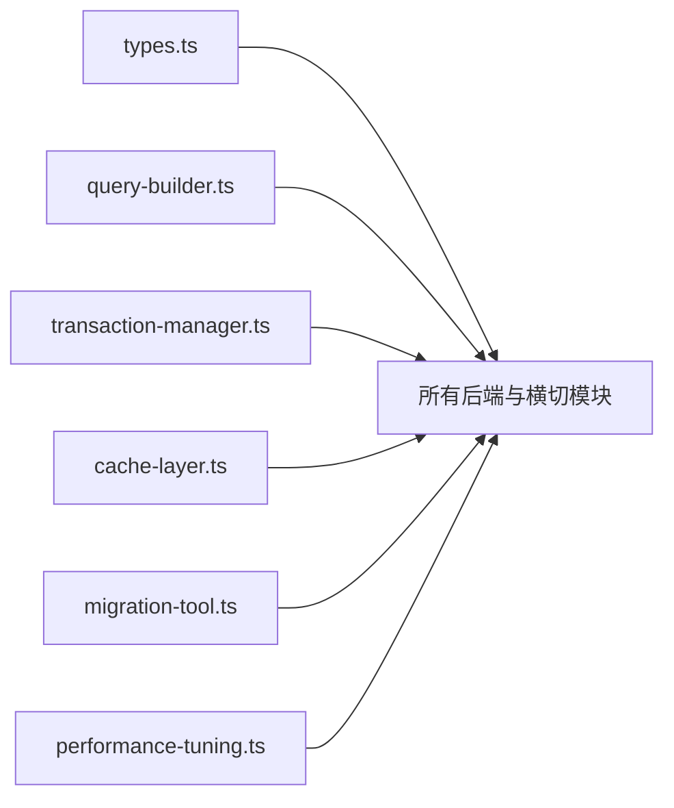

# 存储适配器

<cite>
**本文引用的文件**   
- [engine/packages/adapters/README.md](file://engine/packages/adapters/README.md)
- [engine/packages/adapters/src/index.ts](file://engine/packages/adapters/src/index.ts)
- [engine/packages/adapters/src/types.ts](file://engine/packages/adapters/src/types.ts)
- [engine/packages/adapters/src/memory-store.ts](file://engine/packages/adapters/src/memory-store.ts)
- [engine/packages/adapters/src/sqlite-store.ts](file://engine/packages/adapters/src/sqlite-store.ts)
- [engine/packages/adapters/src/file-store.ts](file://engine/packages/adapters/src/file-store.ts)
- [engine/packages/adapters/src/cloud-store.ts](file://engine/packages/adapters/src/cloud-store.ts)
- [engine/packages/adapters/src/query-builder.ts](file://engine/packages/adapters/src/query-builder.ts)
- [engine/packages/adapters/src/transaction-manager.ts](file://engine/packages/adapters/src/transaction-manager.ts)
- [engine/packages/adapters/src/cache-layer.ts](file://engine/packages/adapters/src/cache-layer.ts)
- [engine/packages/adapters/src/migration-tool.ts](file://engine/packages/adapters/src/migration-tool.ts)
- [engine/packages/adapters/src/performance-tuning.ts](file://engine/packages/adapters/src/performance-tuning.ts)
</cite>

## 目录
1. [简介](#简介)
2. [项目结构](#项目结构)
3. [核心组件](#核心组件)
4. [架构总览](#架构总览)
5. [详细组件分析](#详细组件分析)
6. [依赖关系分析](#依赖关系分析)
7. [性能考虑](#性能考虑)
8. [故障排查指南](#故障排查指南)
9. [结论](#结论)
10. [附录](#附录)

## 简介
本技术文档围绕 KCoder 的“存储适配器”子系统，系统性阐述其抽象层设计、统一 CRUD 接口、事务支持、查询构建器，以及多种后端实现（内存、SQLite、文件系统、云存储）。同时覆盖数据持久化策略（序列化格式、索引优化、备份恢复）、缓存机制（多级缓存、失效策略、一致性保证）、迁移工具（版本升级、数据转换、回滚）与性能调优和扩展性最佳实践。

## 项目结构
存储适配器位于 engine/packages/adapters 下，采用分层组织：
- 类型与入口：定义统一接口、导出聚合入口
- 后端实现：内存、SQLite、文件、云存储
- 横切能力：事务管理器、查询构建器、缓存层、迁移工具、性能调优模块

图表来源
- [engine/packages/adapters/src/index.ts](file://engine/packages/adapters/src/index.ts)
- [engine/packages/adapters/src/types.ts](file://engine/packages/adapters/src/types.ts)
- [engine/packages/adapters/src/query-builder.ts](file://engine/packages/adapters/src/query-builder.ts)
- [engine/packages/adapters/src/transaction-manager.ts](file://engine/packages/adapters/src/transaction-manager.ts)
- [engine/packages/adapters/src/cache-layer.ts](file://engine/packages/adapters/src/cache-layer.ts)
- [engine/packages/adapters/src/migration-tool.ts](file://engine/packages/adapters/src/migration-tool.ts)
- [engine/packages/adapters/src/performance-tuning.ts](file://engine/packages/adapters/src/performance-tuning.ts)
- [engine/packages/adapters/src/memory-store.ts](file://engine/packages/adapters/src/memory-store.ts)
- [engine/packages/adapters/src/sqlite-store.ts](file://engine/packages/adapters/src/sqlite-store.ts)
- [engine/packages/adapters/src/file-store.ts](file://engine/packages/adapters/src/file-store.ts)
- [engine/packages/adapters/src/cloud-store.ts](file://engine/packages/adapters/src/cloud-store.ts)

章节来源
- [engine/packages/adapters/README.md](file://engine/packages/adapters/README.md)
- [engine/packages/adapters/src/index.ts](file://engine/packages/adapters/src/index.ts)

## 核心组件
- 统一接口与类型
  - 提供统一的实体模型、CRUD 方法签名、分页与排序参数、错误码与结果包装类型，确保上层业务对具体后端无感知。
- 查询构建器
  - 以链式 API 组合过滤、投影、排序、分页等条件，生成可被各后端执行的查询描述对象；支持跨后端的谓词语义对齐。
- 事务管理器
  - 封装多后端事务语义，提供 begin/commit/rollback 生命周期，并在失败时自动回滚与资源清理。
- 缓存层
  - 在适配器之上提供多级缓存（进程内 L1 + 可选共享 L2），统一命中/失效/回填路径，保障读写一致性与过期策略。
- 迁移工具
  - 管理 schema 版本、增量变更脚本、数据转换与回滚，支持幂等执行与断点续跑。
- 性能调优模块
  - 暴露连接池、批处理、预取、压缩、并发度等可调参数，并提供基准测试与指标采集钩子。

章节来源
- [engine/packages/adapters/src/types.ts](file://engine/packages/adapters/src/types.ts)
- [engine/packages/adapters/src/query-builder.ts](file://engine/packages/adapters/src/query-builder.ts)
- [engine/packages/adapters/src/transaction-manager.ts](file://engine/packages/adapters/src/transaction-manager.ts)
- [engine/packages/adapters/src/cache-layer.ts](file://engine/packages/adapters/src/cache-layer.ts)
- [engine/packages/adapters/src/migration-tool.ts](file://engine/packages/adapters/src/migration-tool.ts)
- [engine/packages/adapters/src/performance-tuning.ts](file://engine/packages/adapters/src/performance-tuning.ts)

## 架构总览
存储适配器通过“统一接口 + 多后端实现 + 横切能力”的分层架构，屏蔽底层差异，向上提供一致的 CRUD、事务、查询与缓存体验。

图表来源
- [engine/packages/adapters/src/types.ts](file://engine/packages/adapters/src/types.ts)
- [engine/packages/adapters/src/query-builder.ts](file://engine/packages/adapters/src/query-builder.ts)
- [engine/packages/adapters/src/transaction-manager.ts](file://engine/packages/adapters/src/transaction-manager.ts)
- [engine/packages/adapters/src/cache-layer.ts](file://engine/packages/adapters/src/cache-layer.ts)
- [engine/packages/adapters/src/migration-tool.ts](file://engine/packages/adapters/src/migration-tool.ts)
- [engine/packages/adapters/src/memory-store.ts](file://engine/packages/adapters/src/memory-store.ts)
- [engine/packages/adapters/src/sqlite-store.ts](file://engine/packages/adapters/src/sqlite-store.ts)
- [engine/packages/adapters/src/file-store.ts](file://engine/packages/adapters/src/file-store.ts)
- [engine/packages/adapters/src/cloud-store.ts](file://engine/packages/adapters/src/cloud-store.ts)

## 详细组件分析

### 统一接口与类型
- 职责
  - 定义实体、分页、排序、过滤、批量操作、错误与结果包装等基础类型，作为所有后端实现的契约。
- 关键点
  - 强类型约束减少运行时歧义
  - 明确错误分类便于上层重试与降级
  - 分页与排序参数标准化，利于查询构建器生成通用查询

章节来源
- [engine/packages/adapters/src/types.ts](file://engine/packages/adapters/src/types.ts)

### 查询构建器
- 职责
  - 将高层过滤、投影、排序、分页条件转换为后端可执行的查询规范，屏蔽不同后端的方言差异。
- 关键流程
  - 链式调用累积条件
  - build() 输出结构化查询描述
  - 各后端根据查询描述映射为本地查询

图表来源
- [engine/packages/adapters/src/query-builder.ts](file://engine/packages/adapters/src/query-builder.ts)
- [engine/packages/adapters/src/types.ts](file://engine/packages/adapters/src/types.ts)

章节来源
- [engine/packages/adapters/src/query-builder.ts](file://engine/packages/adapters/src/query-builder.ts)

### 事务管理器
- 职责
  - 统一管理 begin/commit/rollback 生命周期，确保异常路径下的资源释放与状态一致性。
- 关键流程

图表来源
- [engine/packages/adapters/src/transaction-manager.ts](file://engine/packages/adapters/src/transaction-manager.ts)
- [engine/packages/adapters/src/types.ts](file://engine/packages/adapters/src/types.ts)

章节来源
- [engine/packages/adapters/src/transaction-manager.ts](file://engine/packages/adapters/src/transaction-manager.ts)

### 缓存层
- 职责
  - 在存储之上提供多级缓存，降低热点读取延迟，提高吞吐；统一失效与回填逻辑。
- 关键流程

图表来源
- [engine/packages/adapters/src/cache-layer.ts](file://engine/packages/adapters/src/cache-layer.ts)
- [engine/packages/adapters/src/types.ts](file://engine/packages/adapters/src/types.ts)

章节来源
- [engine/packages/adapters/src/cache-layer.ts](file://engine/packages/adapters/src/cache-layer.ts)

### 迁移工具
- 职责
  - 管理 schema 版本与数据迁移脚本，支持 up/down、幂等执行、断点续跑与回滚。
- 关键流程

图表来源
- [engine/packages/adapters/src/migration-tool.ts](file://engine/packages/adapters/src/migration-tool.ts)
- [engine/packages/adapters/src/types.ts](file://engine/packages/adapters/src/types.ts)

章节来源
- [engine/packages/adapters/src/migration-tool.ts](file://engine/packages/adapters/src/migration-tool.ts)

### 性能调优模块
- 职责
  - 暴露连接池大小、批处理大小、预取窗口、并发度、压缩开关等参数，并提供指标采集与压测辅助。
- 典型配置项
  - 连接池：最大连接数、空闲超时、获取超时
  - 批处理：批量写大小、合并窗口
  - 缓存：L1/L2 容量、TTL、淘汰策略
  - I/O：是否启用压缩、并行度上限

章节来源
- [engine/packages/adapters/src/performance-tuning.ts](file://engine/packages/adapters/src/performance-tuning.ts)

### 后端实现

#### 内存存储
- 特点
  - 进程内数据结构，适合单元测试与轻量场景；不支持持久化。
- 适用
  - 快速验证、集成测试、临时计算中间态。

章节来源
- [engine/packages/adapters/src/memory-store.ts](file://engine/packages/adapters/src/memory-store.ts)

#### SQLite 存储
- 特点
  - 单文件数据库，ACID 事务，适合单机部署与中等规模数据；可通过索引与 WAL 提升性能。
- 要点
  - 索引策略：高频过滤字段建索引
  - 事务粒度：尽量缩小事务范围
  - 并发：合理设置连接池与锁等待

章节来源
- [engine/packages/adapters/src/sqlite-store.ts](file://engine/packages/adapters/src/sqlite-store.ts)

#### 文件系统存储
- 特点
  - 以文件形式持久化对象或分片，适合大对象、日志与归档；需关注元数据与一致性。
- 要点
  - 原子写入：先写临时文件再重命名
  - 校验：写入后做完整性校验
  - 备份：定期快照与增量复制

章节来源
- [engine/packages/adapters/src/file-store.ts](file://engine/packages/adapters/src/file-store.ts)

#### 云存储
- 特点
  - 高可用与水平扩展，适合分布式与跨地域部署；注意网络延迟与最终一致性。
- 要点
  - 分片上传与断点续传
  - 版本控制与生命周期策略
  - 访问密钥与权限最小化

章节来源
- [engine/packages/adapters/src/cloud-store.ts](file://engine/packages/adapters/src/cloud-store.ts)

## 依赖关系分析
- 耦合与内聚
  - 各后端仅依赖统一接口与类型，保持高内聚低耦合
  - 横切能力（查询、事务、缓存、迁移、性能）通过组合注入到后端或上层编排
- 外部依赖
  - SQLite 驱动、文件系统 API、云 SDK 等由各自后端引入，避免污染公共接口

图表来源
- [engine/packages/adapters/src/types.ts](file://engine/packages/adapters/src/types.ts)
- [engine/packages/adapters/src/query-builder.ts](file://engine/packages/adapters/src/query-builder.ts)
- [engine/packages/adapters/src/transaction-manager.ts](file://engine/packages/adapters/src/transaction-manager.ts)
- [engine/packages/adapters/src/cache-layer.ts](file://engine/packages/adapters/src/cache-layer.ts)
- [engine/packages/adapters/src/migration-tool.ts](file://engine/packages/adapters/src/migration-tool.ts)
- [engine/packages/adapters/src/performance-tuning.ts](file://engine/packages/adapters/src/performance-tuning.ts)

章节来源
- [engine/packages/adapters/src/index.ts](file://engine/packages/adapters/src/index.ts)

## 性能考虑
- 连接与并发
  - 按负载调整连接池大小与并发度，避免过度竞争导致抖动
- 批处理与合并
  - 将多次小写合并为批量写，减少系统调用与网络往返
- 索引与扫描
  - 针对高频过滤与排序字段建立合适索引，避免全表扫描
- 缓存命中率
  - 合理设置 TTL 与容量，结合热点识别与预热策略
- 序列化与压缩
  - 大对象使用压缩与分块传输，权衡 CPU 与带宽
- 监控与压测
  - 埋点关键指标（QPS、P99、错误率、缓存命中率），持续回归评估

[本节为通用指导，不直接分析具体文件]

## 故障排查指南
- 常见问题定位
  - 事务超时/死锁：检查事务粒度与锁冲突，缩短事务范围
  - 缓存不一致：确认失效策略与回填路径，必要时强制刷新
  - 迁移中断：查看迁移状态与幂等标记，支持断点续跑
  - 云存储限流：退避重试与分片上传，限制并发
- 诊断手段
  - 开启详细日志与追踪 ID
  - 使用迁移工具的 status 命令核对版本
  - 借助性能调优模块采集指标与基线对比

章节来源
- [engine/packages/adapters/src/transaction-manager.ts](file://engine/packages/adapters/src/transaction-manager.ts)
- [engine/packages/adapters/src/cache-layer.ts](file://engine/packages/adapters/src/cache-layer.ts)
- [engine/packages/adapters/src/migration-tool.ts](file://engine/packages/adapters/src/migration-tool.ts)
- [engine/packages/adapters/src/performance-tuning.ts](file://engine/packages/adapters/src/performance-tuning.ts)

## 结论
存储适配器通过清晰的抽象与模块化设计，实现了跨后端的统一 CRUD、事务、查询与缓存能力。配合迁移工具与性能调优模块，可在不同部署形态下获得稳定、可扩展且易维护的数据访问层。建议在生产环境结合监控与压测持续优化，并根据业务特征选择合适的后端与参数。

## 附录
- 术语
  - 查询构建器：将高层查询条件编译为后端可执行规范的组件
  - 事务：一组操作的原子执行单元，具备 ACID 特性
  - 多级缓存：包含进程内与共享层的缓存体系
  - 迁移：对 schema 与数据的版本化管理与变更执行

[本节为概念补充，不直接分析具体文件]