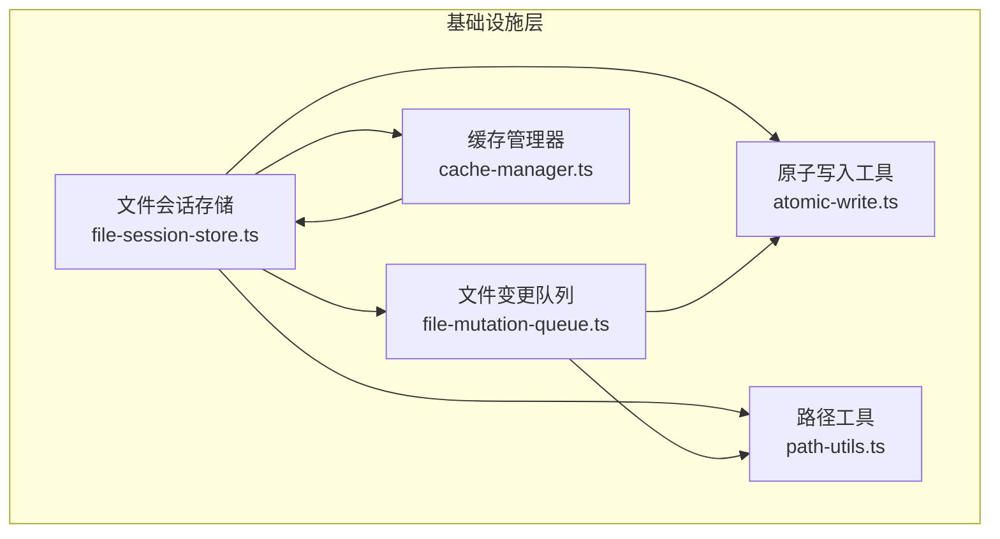
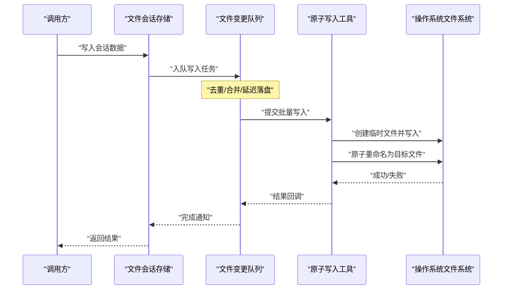
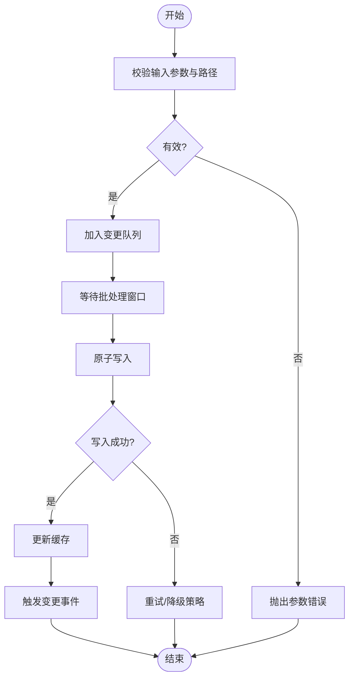
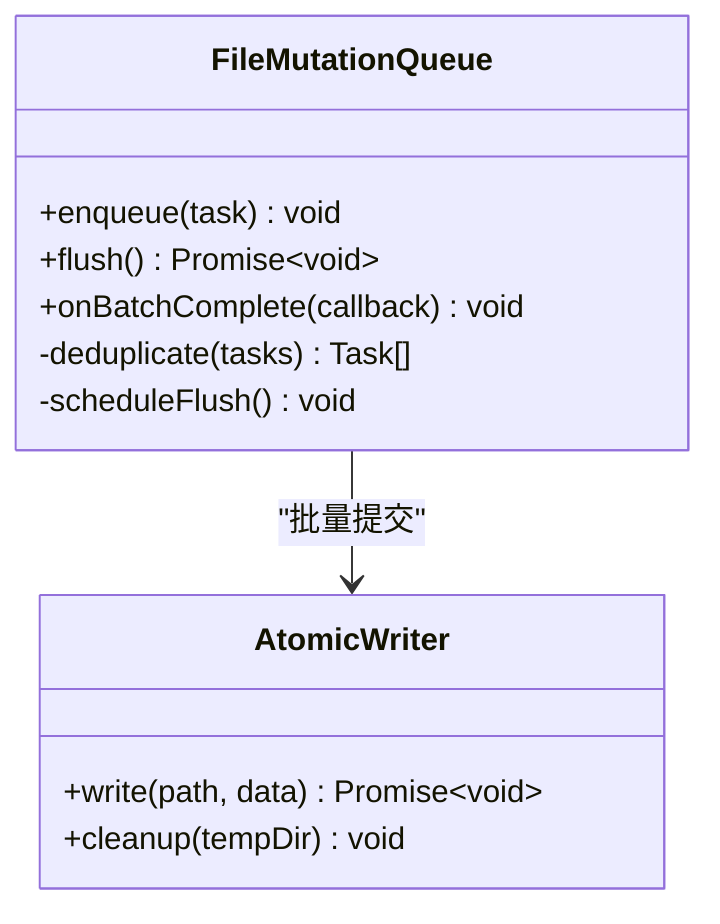
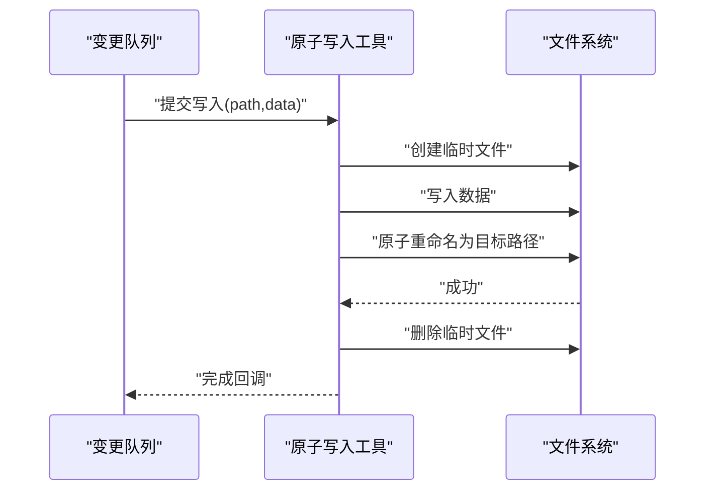
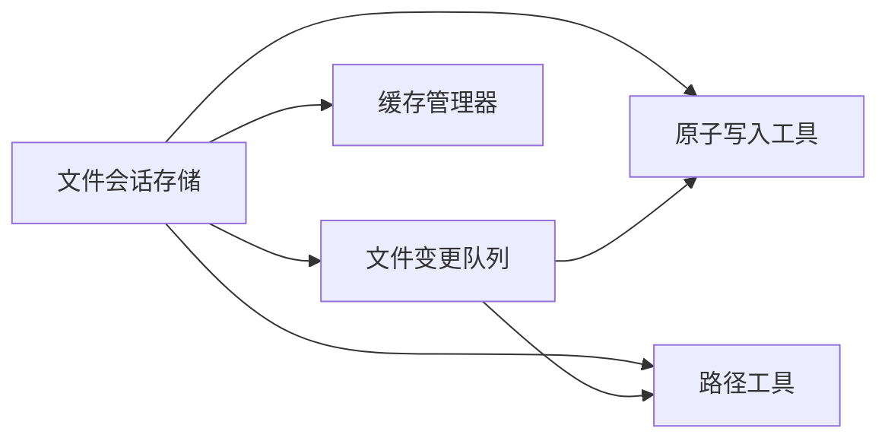

# 文件系统存储适配器

<cite>
**本文引用的文件**   
- [engine/packages/infrastructure/src/file-system-store.ts](file://engine/packages/infrastructure/src/file-system-store.ts)
- [engine/packages/infrastructure/src/file-session-store.ts](file://engine/packages/infrastructure/src/file-session-store.ts)
- [engine/packages/infrastructure/src/file-mutation-queue.ts](file://engine/packages/infrastructure/src/file-mutation-queue.ts)
- [engine/packages/infrastructure/src/atomic-write.ts](file://engine/packages/infrastructure/src/atomic-write.ts)
- [engine/packages/infrastructure/src/path-utils.ts](file://engine/packages/infrastructure/src/path-utils.ts)
- [engine/packages/infrastructure/src/cache-manager.ts](file://engine/packages/infrastructure/src/cache-manager.ts)
- [engine/tests/atomic-write.test.ts](file://engine/tests/atomic-write.test.ts)
- [engine/tests/file-mutation-queue.test.ts](file://engine/tests/file-mutation-queue.test.ts)
- [engine/tests/file-session-store.test.ts](file://engine/tests/file-session-store.test.ts)
- [engine/tests/file-session-store-integration.test.ts](file://engine/tests/file-session-store-integration.test.ts)
</cite>

## 目录
1. [简介](#简介)
2. [项目结构](#项目结构)
3. [核心组件](#核心组件)
4. [架构总览](#架构总览)
5. [详细组件分析](#详细组件分析)
6. [依赖关系分析](#依赖关系分析)
7. [性能考虑](#性能考虑)
8. [故障排查指南](#故障排查指南)
9. [结论](#结论)
10. [附录](#附录)

## 简介
本技术文档聚焦于 KCoder 引擎中的“文件系统存储适配器”，围绕以下目标展开：
- 解释文件存储的设计架构，包括目录结构设计、文件命名规范与元数据管理。
- 详细说明文件操作实现，包括原子写入、批量操作与变更监听机制。
- 介绍文件同步策略，包括冲突解决、版本控制与增量同步。
- 解释文件权限管理，包括访问控制、安全策略与路径验证。
- 提供文件存储的性能优化建议，包括缓存策略、压缩算法与磁盘 I/O 优化。
- 给出文件系统存储的配置选项与使用示例（以接口与行为描述为主）。

## 项目结构
KCoder 的“文件系统存储适配器”位于 engine 子仓库的 infrastructure 包中，主要涉及如下模块：
- 文件会话存储：负责将会话状态持久化为文件系统上的文件，并提供读取、写入与查询能力。
- 文件变更队列：对高频写操作进行批处理与去重，降低磁盘压力。
- 原子写入工具：保证写入操作的原子性与一致性。
- 路径工具：提供路径规范化、校验与安全检查。
- 缓存管理器：为热点数据提供内存级缓存，减少重复 I/O。

图表来源
- [engine/packages/infrastructure/src/file-session-store.ts](file://engine/packages/infrastructure/src/file-session-store.ts)
- [engine/packages/infrastructure/src/file-mutation-queue.ts](file://engine/packages/infrastructure/src/file-mutation-queue.ts)
- [engine/packages/infrastructure/src/atomic-write.ts](file://engine/packages/infrastructure/src/atomic-write.ts)
- [engine/packages/infrastructure/src/path-utils.ts](file://engine/packages/infrastructure/src/path-utils.ts)
- [engine/packages/infrastructure/src/cache-manager.ts](file://engine/packages/infrastructure/src/cache-manager.ts)

章节来源
- [engine/packages/infrastructure/src/file-session-store.ts](file://engine/packages/infrastructure/src/file-session-store.ts)
- [engine/packages/infrastructure/src/file-mutation-queue.ts](file://engine/packages/infrastructure/src/file-mutation-queue.ts)
- [engine/packages/infrastructure/src/atomic-write.ts](file://engine/packages/infrastructure/src/atomic-write.ts)
- [engine/packages/infrastructure/src/path-utils.ts](file://engine/packages/infrastructure/src/path-utils.ts)
- [engine/packages/infrastructure/src/cache-manager.ts](file://engine/packages/infrastructure/src/cache-manager.ts)

## 核心组件
- 文件会话存储
  - 职责：定义并实现基于文件系统的会话数据读写接口；协调目录布局、命名规则与元数据文件；对外暴露一致的 API。
  - 关键能力：按会话维度组织数据、支持批量写入、触发变更事件、与缓存和队列协作。
- 文件变更队列
  - 职责：聚合多次写入请求，执行去重与合并，定时或阈值触发落盘，降低频繁 I/O。
  - 关键能力：任务入队、批处理调度、失败重试与幂等提交。
- 原子写入工具
  - 职责：通过临时文件 + 重命名的方式实现原子写入，确保崩溃恢复后数据一致。
  - 关键能力：临时目录隔离、原子重命名、回滚清理。
- 路径工具
  - 职责：路径规范化、拼接、解析与安全检查，防止路径穿越与非法字符。
  - 关键能力：规范化分隔符、白名单校验、相对路径转绝对路径。
- 缓存管理器
  - 职责：维护热点数据的内存缓存，提供 TTL、失效与统计信息。
  - 关键能力：LRU/LFU 策略、并发安全、与存储层的一致性保障。

章节来源
- [engine/packages/infrastructure/src/file-session-store.ts](file://engine/packages/infrastructure/src/file-session-store.ts)
- [engine/packages/infrastructure/src/file-mutation-queue.ts](file://engine/packages/infrastructure/src/file-mutation-queue.ts)
- [engine/packages/infrastructure/src/atomic-write.ts](file://engine/packages/infrastructure/src/atomic-write.ts)
- [engine/packages/infrastructure/src/path-utils.ts](file://engine/packages/infrastructure/src/path-utils.ts)
- [engine/packages/infrastructure/src/cache-manager.ts](file://engine/packages/infrastructure/src/cache-manager.ts)

## 架构总览
整体采用分层与组合模式：上层业务调用文件会话存储，内部由变更队列缓冲写入，原子写入保证一致性，路径工具保障安全性，缓存提升读性能。

图表来源
- [engine/packages/infrastructure/src/file-session-store.ts](file://engine/packages/infrastructure/src/file-session-store.ts)
- [engine/packages/infrastructure/src/file-mutation-queue.ts](file://engine/packages/infrastructure/src/file-mutation-queue.ts)
- [engine/packages/infrastructure/src/atomic-write.ts](file://engine/packages/infrastructure/src/atomic-write.ts)

## 详细组件分析

### 文件会话存储
- 设计要点
  - 目录结构：按会话 ID 划分根目录，其下包含数据文件与元数据文件，便于快速定位与备份。
  - 文件命名：采用“语义化前缀 + 唯一标识 + 扩展名”的约定，避免冲突且可读性强。
  - 元数据管理：独立元数据文件记录版本、时间戳、校验值等，辅助一致性检查与增量同步。
- 关键流程
  - 写入：先入队，再由队列批量提交；原子写入确保最终一致性。
  - 读取：优先从缓存命中，未命中则从磁盘加载并回填缓存。
  - 变更监听：在写入成功后广播变更事件，供订阅者更新视图或触发后续逻辑。
- 错误处理
  - 捕获 I/O 异常与权限错误，转换为统一错误类型，附带上下文信息以便诊断。
  - 对部分失败的批量写入进行幂等重试与补偿。

图表来源
- [engine/packages/infrastructure/src/file-session-store.ts](file://engine/packages/infrastructure/src/file-session-store.ts)
- [engine/packages/infrastructure/src/file-mutation-queue.ts](file://engine/packages/infrastructure/src/file-mutation-queue.ts)
- [engine/packages/infrastructure/src/atomic-write.ts](file://engine/packages/infrastructure/src/atomic-write.ts)

章节来源
- [engine/packages/infrastructure/src/file-session-store.ts](file://engine/packages/infrastructure/src/file-session-store.ts)
- [engine/tests/file-session-store.test.ts](file://engine/tests/file-session-store.test.ts)
- [engine/tests/file-session-store-integration.test.ts](file://engine/tests/file-session-store-integration.test.ts)

### 文件变更队列
- 设计要点
  - 批处理：按时间窗口或任务数量阈值触发落盘，平衡吞吐与延迟。
  - 去重与合并：相同键的多次写入可合并为一次，减少冗余 I/O。
  - 可靠性：失败重试、幂等提交与顺序保证。
- 关键流程
  - 入队：接收写入任务，计算键并进行去重。
  - 调度：到达阈值或定时器触发时，批量提交到原子写入器。
  - 完成：回调通知上层，并更新缓存与事件总线。

图表来源
- [engine/packages/infrastructure/src/file-mutation-queue.ts](file://engine/packages/infrastructure/src/file-mutation-queue.ts)
- [engine/packages/infrastructure/src/atomic-write.ts](file://engine/packages/infrastructure/src/atomic-write.ts)

章节来源
- [engine/packages/infrastructure/src/file-mutation-queue.ts](file://engine/packages/infrastructure/src/file-mutation-queue.ts)
- [engine/tests/file-mutation-queue.test.ts](file://engine/tests/file-mutation-queue.test.ts)

### 原子写入工具
- 设计要点
  - 临时目录：在同一分区内创建临时文件，确保重命名操作为原子。
  - 一致性：写入完成后替换目标文件，失败时清理临时文件，不污染目标路径。
  - 幂等：同一目标路径的多次写入具备幂等性，避免重复内容导致不必要的刷新。
- 关键流程
  - 生成临时路径 -> 写入数据 -> 校验（可选）-> 原子重命名 -> 清理临时文件。

图表来源
- [engine/packages/infrastructure/src/atomic-write.ts](file://engine/packages/infrastructure/src/atomic-write.ts)
- [engine/tests/atomic-write.test.ts](file://engine/tests/atomic-write.test.ts)

章节来源
- [engine/packages/infrastructure/src/atomic-write.ts](file://engine/packages/infrastructure/src/atomic-write.ts)
- [engine/tests/atomic-write.test.ts](file://engine/tests/atomic-write.test.ts)

### 路径工具
- 设计要点
  - 规范化：统一分隔符、去除多余点段、解析相对路径。
  - 安全校验：禁止路径穿越、限制非法字符、白名单目录约束。
  - 兼容性：跨平台差异处理（大小写敏感、保留字等）。
- 典型用法
  - 构建会话根目录、拼接数据与元数据文件名、校验外部输入路径。

章节来源
- [engine/packages/infrastructure/src/path-utils.ts](file://engine/packages/infrastructure/src/path-utils.ts)

### 缓存管理器
- 设计要点
  - 策略：支持 LRU/LFU 等淘汰策略，配置最大条目数与 TTL。
  - 一致性：写入成功后使相关缓存失效或更新，避免脏读。
  - 监控：提供命中率、容量与过期统计，便于调优。
- 交互
  - 读路径：缓存命中直接返回；未命中则从磁盘加载并回填。
  - 写路径：写入完成后主动失效或更新对应缓存项。

章节来源
- [engine/packages/infrastructure/src/cache-manager.ts](file://engine/packages/infrastructure/src/cache-manager.ts)

## 依赖关系分析
- 组件耦合
  - 文件会话存储依赖变更队列、原子写入、路径工具与缓存管理器，形成松耦合的组合式架构。
  - 变更队列仅依赖原子写入与路径工具，职责单一、内聚度高。
- 外部依赖
  - 操作系统文件系统 API（文件读写、目录操作、重命名）。
  - 可选：加密/压缩库（用于敏感数据保护与体积优化）。
- 潜在循环依赖
  - 当前设计无循环依赖；若引入事件总线需确保单向依赖。

图表来源
- [engine/packages/infrastructure/src/file-session-store.ts](file://engine/packages/infrastructure/src/file-session-store.ts)
- [engine/packages/infrastructure/src/file-mutation-queue.ts](file://engine/packages/infrastructure/src/file-mutation-queue.ts)
- [engine/packages/infrastructure/src/atomic-write.ts](file://engine/packages/infrastructure/src/atomic-write.ts)
- [engine/packages/infrastructure/src/path-utils.ts](file://engine/packages/infrastructure/src/path-utils.ts)
- [engine/packages/infrastructure/src/cache-manager.ts](file://engine/packages/infrastructure/src/cache-manager.ts)

章节来源
- [engine/packages/infrastructure/src/file-session-store.ts](file://engine/packages/infrastructure/src/file-session-store.ts)
- [engine/packages/infrastructure/src/file-mutation-queue.ts](file://engine/packages/infrastructure/src/file-mutation-queue.ts)
- [engine/packages/infrastructure/src/atomic-write.ts](file://engine/packages/infrastructure/src/atomic-write.ts)
- [engine/packages/infrastructure/src/path-utils.ts](file://engine/packages/infrastructure/src/path-utils.ts)
- [engine/packages/infrastructure/src/cache-manager.ts](file://engine/packages/infrastructure/src/cache-manager.ts)

## 性能考虑
- 缓存策略
  - 热点会话数据常驻内存，合理设置 TTL 与容量上限，避免 OOM。
  - 写后失效：批量写入完成后统一失效相关缓存，降低一致性成本。
- 压缩算法
  - 对大文本或日志类数据启用压缩（如 gzip/zstd），权衡 CPU 与磁盘空间。
  - 冷热分层：热数据不压缩，冷数据归档压缩。
- 磁盘 I/O 优化
  - 批量写入与合并：通过变更队列减少系统调用次数。
  - 顺序写与预分配：尽量顺序写入，必要时预分配文件大小以减少碎片。
  - 异步与背压：非阻塞写入，结合背压控制峰值负载。
- 监控与调优
  - 指标：IOPS、延迟分布、缓存命中率、队列积压量。
  - 告警：当队列积压超过阈值或失败率升高时触发告警。

[本节为通用性能指导，无需具体文件引用]

## 故障排查指南
- 常见问题
  - 写入失败：检查路径权限、磁盘空间与原子写入临时目录是否可用。
  - 数据不一致：确认原子写入是否成功、是否存在并发覆盖与幂等问题。
  - 性能退化：观察缓存命中率与队列积压情况，调整批处理窗口与缓存容量。
- 诊断步骤
  - 查看错误日志中的上下文信息与堆栈。
  - 复现最小用例，逐步关闭缓存或队列以定位瓶颈。
  - 使用测试套件验证原子写入与队列行为是否符合预期。

章节来源
- [engine/tests/atomic-write.test.ts](file://engine/tests/atomic-write.test.ts)
- [engine/tests/file-mutation-queue.test.ts](file://engine/tests/file-mutation-queue.test.ts)
- [engine/tests/file-session-store.test.ts](file://engine/tests/file-session-store.test.ts)
- [engine/tests/file-session-store-integration.test.ts](file://engine/tests/file-session-store-integration.test.ts)

## 结论
文件系统存储适配器通过“会话存储 + 变更队列 + 原子写入 + 路径安全 + 缓存”的组合，提供了高可靠、高性能的文件持久化方案。其清晰的职责划分与良好的可扩展性，使其能够适配多种业务场景，并在复杂环境下保持数据一致性与稳定性。

[本节为总结性内容，无需具体文件引用]

## 附录

### 配置选项（建议）
- 基础路径
  - 说明：会话数据根目录。
  - 默认：应用数据目录下的 sessions 子目录。
- 批处理窗口
  - 说明：变更队列触发落盘的时间窗口（毫秒）。
  - 默认：100ms。
- 批处理阈值
  - 说明：达到任务数量阈值立即落盘。
  - 默认：50。
- 缓存容量
  - 说明：缓存最大条目数。
  - 默认：1000。
- 缓存 TTL
  - 说明：缓存项过期时间（秒）。
  - 默认：300。
- 压缩开关
  - 说明：是否对冷数据启用压缩。
  - 默认：false。
- 安全策略
  - 说明：路径白名单、字符集限制与大小写敏感策略。
  - 默认：严格模式。

[本节为概念性配置说明，无需具体文件引用]

### 使用示例（行为描述）
- 初始化
  - 指定基础路径与安全策略，创建文件会话存储实例。
- 写入会话数据
  - 调用写入接口，传入会话 ID 与数据对象；内部自动入队与原子写入。
- 读取会话数据
  - 调用读取接口，优先命中缓存，未命中则从磁盘加载。
- 监听变更
  - 订阅变更事件，在数据更新后执行 UI 刷新或索引重建。
- 批量导入
  - 分批调用写入接口，利用队列合并与去重特性提升吞吐。

[本节为概念性使用示例，无需具体文件引用]