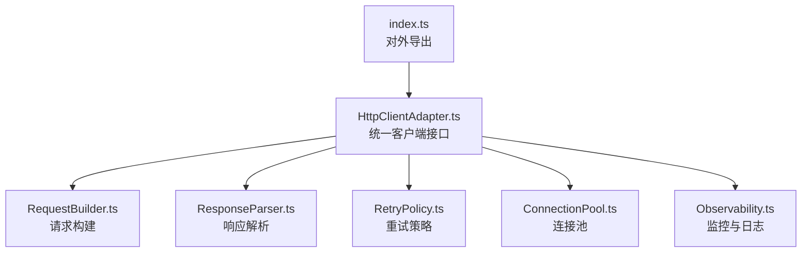
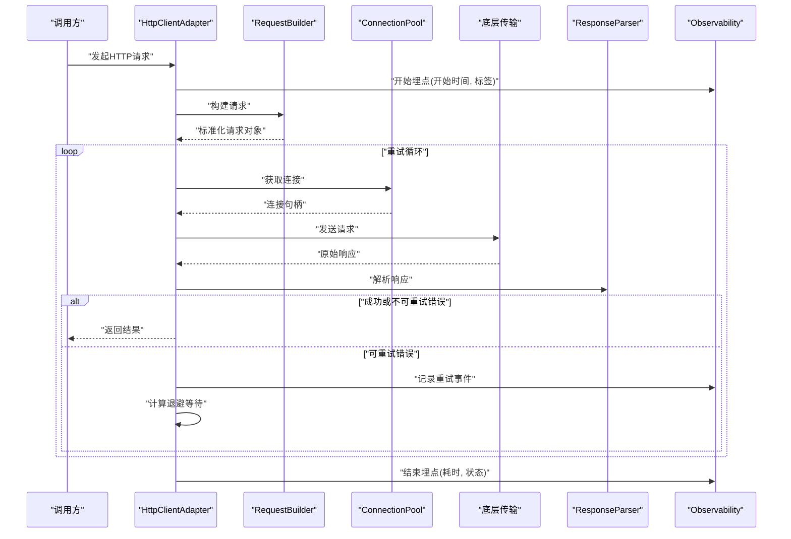
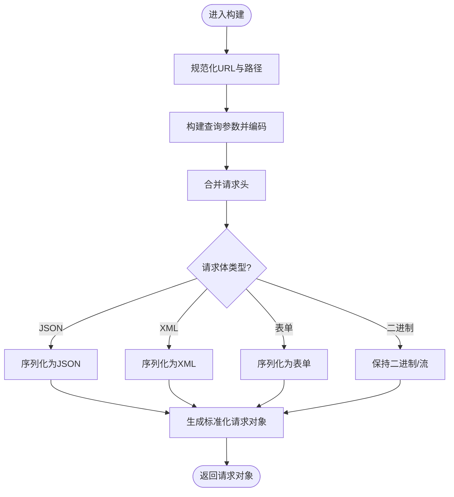
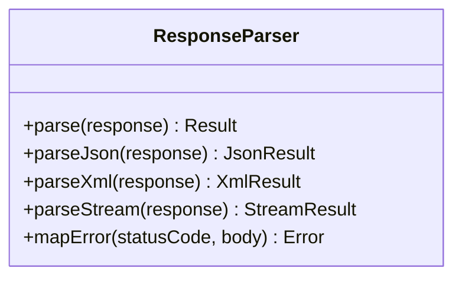
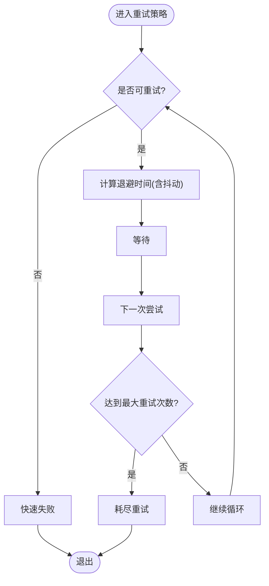
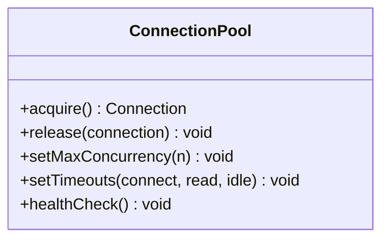
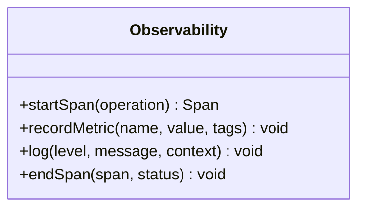
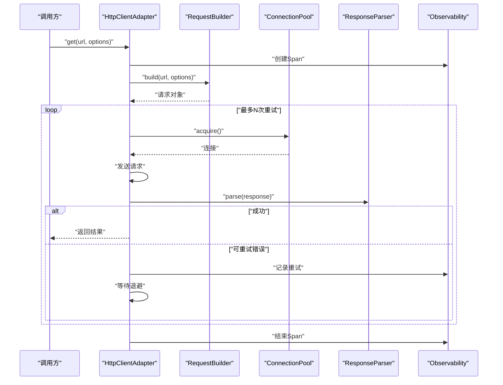
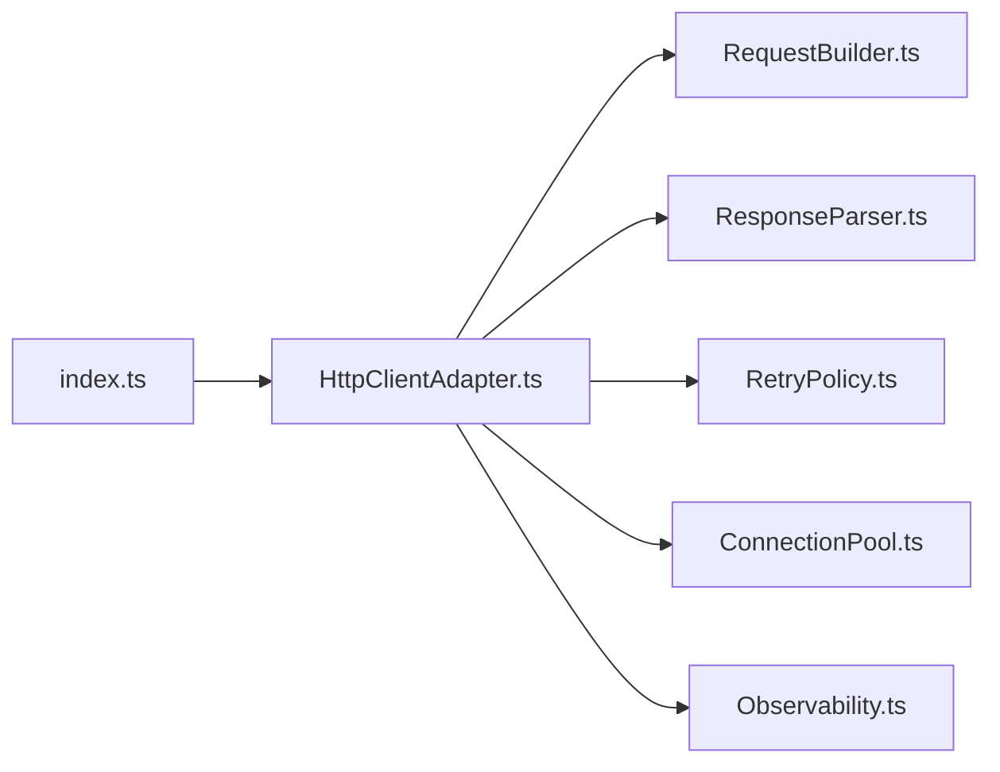

# HTTP客户端适配器

<cite>
**本文引用的文件**   
- [engine/packages/http-layer/src/index.ts](file://engine/packages/http-layer/src/index.ts)
- [engine/packages/http-layer/src/HttpClientAdapter.ts](file://engine/packages/http-layer/src/HttpClientAdapter.ts)
- [engine/packages/http-layer/src/RequestBuilder.ts](file://engine/packages/http-layer/src/RequestBuilder.ts)
- [engine/packages/http-layer/src/ResponseParser.ts](file://engine/packages/http-layer/src/ResponseParser.ts)
- [engine/packages/http-layer/src/RetryPolicy.ts](file://engine/packages/http-layer/src/RetryPolicy.ts)
- [engine/packages/http-layer/src/ConnectionPool.ts](file://engine/packages/http-layer/src/ConnectionPool.ts)
- [engine/packages/http-layer/src/Observability.ts](file://engine/packages/http-layer/src/Observability.ts)
- [engine/packages/http-layer/package.json](file://engine/packages/http-layer/package.json)
</cite>

## 目录
1. [简介](#简介)
2. [项目结构](#项目结构)
3. [核心组件](#核心组件)
4. [架构总览](#架构总览)
5. [详细组件分析](#详细组件分析)
6. [依赖关系分析](#依赖关系分析)
7. [性能考量](#性能考量)
8. [故障排查指南](#故障排查指南)
9. [结论](#结论)
10. [附录：使用示例与最佳实践](#附录使用示例与最佳实践)

## 简介
本技术文档面向KCoder的HTTP客户端适配器，聚焦以下目标：
- 深入解释HTTP请求构建器：URL拼接、查询参数处理、请求头设置、请求体序列化。
- 详细说明响应解析机制：JSON解析、XML处理、流式响应、错误状态码映射。
- 介绍重试机制：指数退避算法、最大重试次数配置、失败条件判断。
- 解释连接池管理：连接复用、超时控制、并发限制。
- 提供网络监控与日志记录功能的使用方法。
- 给出具体代码示例，展示如何发起不同类型的HTTP请求和处理各种响应场景。

## 项目结构
HTTP客户端适配器位于 engine/packages/http-layer 包中，采用分层与职责单一的设计原则，主要模块如下：
- 入口与对外API：index.ts
- 客户端适配层：HttpClientAdapter.ts
- 请求构建器：RequestBuilder.ts
- 响应解析器：ResponseParser.ts
- 重试策略：RetryPolicy.ts
- 连接池：ConnectionPool.ts
- 可观测性（监控与日志）：Observability.ts

图表来源
- [engine/packages/http-layer/src/index.ts](file://engine/packages/http-layer/src/index.ts)
- [engine/packages/http-layer/src/HttpClientAdapter.ts](file://engine/packages/http-layer/src/HttpClientAdapter.ts)
- [engine/packages/http-layer/src/RequestBuilder.ts](file://engine/packages/http-layer/src/RequestBuilder.ts)
- [engine/packages/http-layer/src/ResponseParser.ts](file://engine/packages/http-layer/src/ResponseParser.ts)
- [engine/packages/http-layer/src/RetryPolicy.ts](file://engine/packages/http-layer/src/RetryPolicy.ts)
- [engine/packages/http-layer/src/ConnectionPool.ts](file://engine/packages/http-layer/src/ConnectionPool.ts)
- [engine/packages/http-layer/src/Observability.ts](file://engine/packages/http-layer/src/Observability.ts)

章节来源
- [engine/packages/http-layer/src/index.ts](file://engine/packages/http-layer/src/index.ts)
- [engine/packages/http-layer/src/HttpClientAdapter.ts](file://engine/packages/http-layer/src/HttpClientAdapter.ts)
- [engine/packages/http-layer/src/RequestBuilder.ts](file://engine/packages/http-layer/src/RequestBuilder.ts)
- [engine/packages/http-layer/src/ResponseParser.ts](file://engine/packages/http-layer/src/ResponseParser.ts)
- [engine/packages/http-layer/src/RetryPolicy.ts](file://engine/packages/http-layer/src/RetryPolicy.ts)
- [engine/packages/http-layer/src/ConnectionPool.ts](file://engine/packages/http-layer/src/ConnectionPool.ts)
- [engine/packages/http-layer/src/Observability.ts](file://engine/packages/http-layer/src/Observability.ts)

## 核心组件
- HttpClientAdapter：对外暴露统一的HTTP调用接口，协调请求构建、重试、连接池与响应解析。
- RequestBuilder：负责将高层请求对象转换为底层传输所需的请求实例，包括URL拼接、查询参数编码、请求头合并、请求体序列化。
- ResponseParser：负责将底层响应转换为结构化结果，支持JSON、XML、流式响应，并映射错误状态码为领域异常。
- RetryPolicy：封装重试策略，支持指数退避、抖动、最大重试次数与失败条件判定。
- ConnectionPool：管理底层连接复用、空闲回收、超时控制与并发限制。
- Observability：提供指标上报、链路追踪与结构化日志输出。

章节来源
- [engine/packages/http-layer/src/HttpClientAdapter.ts](file://engine/packages/http-layer/src/HttpClientAdapter.ts)
- [engine/packages/http-layer/src/RequestBuilder.ts](file://engine/packages/http-layer/src/RequestBuilder.ts)
- [engine/packages/http-layer/src/ResponseParser.ts](file://engine/packages/http-layer/src/ResponseParser.ts)
- [engine/packages/http-layer/src/RetryPolicy.ts](file://engine/packages/http-layer/src/RetryPolicy.ts)
- [engine/packages/http-layer/src/ConnectionPool.ts](file://engine/packages/http-layer/src/ConnectionPool.ts)
- [engine/packages/http-layer/src/Observability.ts](file://engine/packages/http-layer/src/Observability.ts)

## 架构总览
整体流程从上层业务调用进入HttpClientAdapter，依次经过请求构建、重试包装、连接池获取连接、发送请求、响应解析与可观测性埋点，最终返回结构化结果或抛出领域异常。

图表来源
- [engine/packages/http-layer/src/HttpClientAdapter.ts](file://engine/packages/http-layer/src/HttpClientAdapter.ts)
- [engine/packages/http-layer/src/RequestBuilder.ts](file://engine/packages/http-layer/src/RequestBuilder.ts)
- [engine/packages/http-layer/src/ResponseParser.ts](file://engine/packages/http-layer/src/ResponseParser.ts)
- [engine/packages/http-layer/src/RetryPolicy.ts](file://engine/packages/http-layer/src/RetryPolicy.ts)
- [engine/packages/http-layer/src/ConnectionPool.ts](file://engine/packages/http-layer/src/ConnectionPool.ts)
- [engine/packages/http-layer/src/Observability.ts](file://engine/packages/http-layer/src/Observability.ts)

## 详细组件分析

### 请求构建器（RequestBuilder）
职责与要点：
- URL拼接：规范化基础路径、拼接路径段、避免重复斜杠、保留协议与主机名。
- 查询参数处理：对键值进行安全编码，过滤空值，保持顺序稳定。
- 请求头设置：合并默认头与用户头，覆盖冲突项，确保必要头存在（如Content-Type）。
- 请求体序列化：根据Content-Type选择JSON/XML/表单等序列化策略，处理Buffer/Stream/字符串/对象输入。

图表来源
- [engine/packages/http-layer/src/RequestBuilder.ts](file://engine/packages/http-layer/src/RequestBuilder.ts)

章节来源
- [engine/packages/http-layer/src/RequestBuilder.ts](file://engine/packages/http-layer/src/RequestBuilder.ts)

### 响应解析器（ResponseParser）
职责与要点：
- JSON解析：自动识别Content-Type，解析JSON并校验结构，失败时抛出语义化异常。
- XML处理：解析XML到结构化数据，支持命名空间与属性映射。
- 流式响应：当响应为流时，提供分块读取与聚合能力，支持背压与取消。
- 错误状态码映射：将HTTP状态码映射为领域错误类型，附带诊断信息（如请求ID、耗时）。

图表来源
- [engine/packages/http-layer/src/ResponseParser.ts](file://engine/packages/http-layer/src/ResponseParser.ts)

章节来源
- [engine/packages/http-layer/src/ResponseParser.ts](file://engine/packages/http-layer/src/ResponseParser.ts)

### 重试策略（RetryPolicy）
职责与要点：
- 指数退避：基于重试次数计算等待时间，支持抖动以避免雪崩。
- 最大重试次数：通过配置限制重试上限，防止无限重试。
- 失败条件判断：仅对可重试错误（如网络抖动、限流）执行重试，立即失败错误直接返回。

图表来源
- [engine/packages/http-layer/src/RetryPolicy.ts](file://engine/packages/http-layer/src/RetryPolicy.ts)

章节来源
- [engine/packages/http-layer/src/RetryPolicy.ts](file://engine/packages/http-layer/src/RetryPolicy.ts)

### 连接池（ConnectionPool）
职责与要点：
- 连接复用：按主机/端口/协议维度复用连接，减少握手开销。
- 超时控制：连接建立、读写、空闲超时可配置。
- 并发限制：限制同一主机的并发连接数，避免资源耗尽。
- 健康检查：定期检测连接可用性，剔除坏连接。

图表来源
- [engine/packages/http-layer/src/ConnectionPool.ts](file://engine/packages/http-layer/src/ConnectionPool.ts)

章节来源
- [engine/packages/http-layer/src/ConnectionPool.ts](file://engine/packages/http-layer/src/ConnectionPool.ts)

### 可观测性（Observability）
职责与要点：
- 指标上报：记录请求耗时、成功率、错误率、重试次数等。
- 链路追踪：为每次请求分配唯一TraceId，贯穿上下游。
- 结构化日志：输出关键事件（构建、发送、解析、重试、错误），便于定位问题。

图表来源
- [engine/packages/http-layer/src/Observability.ts](file://engine/packages/http-layer/src/Observability.ts)

章节来源
- [engine/packages/http-layer/src/Observability.ts](file://engine/packages/http-layer/src/Observability.ts)

### 客户端适配层（HttpClientAdapter）
职责与要点：
- 统一接口：提供get/post/put/delete/stream等方法。
- 编排流程：组合RequestBuilder、RetryPolicy、ConnectionPool、ResponseParser与Observability。
- 错误传播：将底层异常转换为领域异常，附带上下文信息。

图表来源
- [engine/packages/http-layer/src/HttpClientAdapter.ts](file://engine/packages/http-layer/src/HttpClientAdapter.ts)
- [engine/packages/http-layer/src/RequestBuilder.ts](file://engine/packages/http-layer/src/RequestBuilder.ts)
- [engine/packages/http-layer/src/ResponseParser.ts](file://engine/packages/http-layer/src/ResponseParser.ts)
- [engine/packages/http-layer/src/RetryPolicy.ts](file://engine/packages/http-layer/src/RetryPolicy.ts)
- [engine/packages/http-layer/src/ConnectionPool.ts](file://engine/packages/http-layer/src/ConnectionPool.ts)
- [engine/packages/http-layer/src/Observability.ts](file://engine/packages/http-layer/src/Observability.ts)

章节来源
- [engine/packages/http-layer/src/HttpClientAdapter.ts](file://engine/packages/http-layer/src/HttpClientAdapter.ts)

## 依赖关系分析
- 内部依赖：HttpClientAdapter依赖RequestBuilder、ResponseParser、RetryPolicy、ConnectionPool、Observability。
- 外部依赖：底层传输库（由ConnectionPool封装）、序列化库（JSON/XML）、指标与日志框架（由Observability抽象）。

图表来源
- [engine/packages/http-layer/src/index.ts](file://engine/packages/http-layer/src/index.ts)
- [engine/packages/http-layer/src/HttpClientAdapter.ts](file://engine/packages/http-layer/src/HttpClientAdapter.ts)
- [engine/packages/http-layer/src/RequestBuilder.ts](file://engine/packages/http-layer/src/RequestBuilder.ts)
- [engine/packages/http-layer/src/ResponseParser.ts](file://engine/packages/http-layer/src/ResponseParser.ts)
- [engine/packages/http-layer/src/RetryPolicy.ts](file://engine/packages/http-layer/src/RetryPolicy.ts)
- [engine/packages/http-layer/src/ConnectionPool.ts](file://engine/packages/http-layer/src/ConnectionPool.ts)
- [engine/packages/http-layer/src/Observability.ts](file://engine/packages/http-layer/src/Observability.ts)

章节来源
- [engine/packages/http-layer/src/index.ts](file://engine/packages/http-layer/src/index.ts)
- [engine/packages/http-layer/src/HttpClientAdapter.ts](file://engine/packages/http-layer/src/HttpClientAdapter.ts)

## 性能考量
- 连接复用：优先复用长连接，减少TCP/TLS握手成本。
- 并发控制：合理设置最大并发，避免服务端过载与本地资源争用。
- 超时调优：根据服务SLA调整连接、读、写超时，避免长时间阻塞。
- 序列化优化：大对象尽量使用流式传输；避免不必要的深拷贝。
- 重试谨慎：仅在幂等且可恢复的错误上启用重试，避免放大负载。

[本节为通用指导，不直接分析具体文件]

## 故障排查指南
- 常见问题定位：
  - 请求构建失败：检查URL规范、查询参数编码、请求头冲突。
  - 解析异常：确认Content-Type与实际内容一致，关注JSON/XML格式。
  - 重试风暴：观察重试间隔与抖动配置，必要时降低最大重试次数。
  - 连接泄漏：检查连接释放逻辑与超时配置。
- 可观测性辅助：
  - 通过TraceId关联一次请求的全链路日志与指标。
  - 关注错误状态码映射与诊断信息，快速定位上游问题。

章节来源
- [engine/packages/http-layer/src/ResponseParser.ts](file://engine/packages/http-layer/src/ResponseParser.ts)
- [engine/packages/http-layer/src/RetryPolicy.ts](file://engine/packages/http-layer/src/RetryPolicy.ts)
- [engine/packages/http-layer/src/ConnectionPool.ts](file://engine/packages/http-layer/src/ConnectionPool.ts)
- [engine/packages/http-layer/src/Observability.ts](file://engine/packages/http-layer/src/Observability.ts)

## 结论
HTTP客户端适配器通过清晰的职责划分与模块化设计，提供了健壮的请求构建、灵活的响应解析、可控的重试策略、高效的连接池管理与完善的可观测性能力。遵循本文档的配置与实践建议，可在复杂网络环境下获得稳定、高性能的HTTP通信体验。

[本节为总结，不直接分析具体文件]

## 附录：使用示例与最佳实践
以下为常见用法指引（以“代码片段路径”形式标注，不包含具体代码内容）：

- 发起GET请求并解析JSON
  - 参考路径：[engine/packages/http-layer/src/HttpClientAdapter.ts](file://engine/packages/http-layer/src/HttpClientAdapter.ts)
  - 关键点：URL拼接、查询参数编码、JSON解析、错误映射

- 发起POST请求并发送JSON体
  - 参考路径：[engine/packages/http-layer/src/RequestBuilder.ts](file://engine/packages/http-layer/src/RequestBuilder.ts)
  - 参考路径：[engine/packages/http-layer/src/ResponseParser.ts](file://engine/packages/http-layer/src/ResponseParser.ts)
  - 关键点：请求头设置、请求体序列化、响应解析

- 上传文件（二进制流）
  - 参考路径：[engine/packages/http-layer/src/RequestBuilder.ts](file://engine/packages/http-layer/src/RequestBuilder.ts)
  - 参考路径：[engine/packages/http-layer/src/ConnectionPool.ts](file://engine/packages/http-layer/src/ConnectionPool.ts)
  - 关键点：二进制/流处理、连接复用、超时控制

- 下载大文件（流式响应）
  - 参考路径：[engine/packages/http-layer/src/ResponseParser.ts](file://engine/packages/http-layer/src/ResponseParser.ts)
  - 参考路径：[engine/packages/http-layer/src/ConnectionPool.ts](file://engine/packages/http-layer/src/ConnectionPool.ts)
  - 关键点：流式解析、背压、取消与清理

- 处理XML响应
  - 参考路径：[engine/packages/http-layer/src/ResponseParser.ts](file://engine/packages/http-layer/src/ResponseParser.ts)
  - 关键点：XML解析、命名空间与属性映射

- 配置重试与退避
  - 参考路径：[engine/packages/http-layer/src/RetryPolicy.ts](file://engine/packages/http-layer/src/RetryPolicy.ts)
  - 关键点：最大重试次数、指数退避、抖动、失败条件

- 开启监控与日志
  - 参考路径：[engine/packages/http-layer/src/Observability.ts](file://engine/packages/http-layer/src/Observability.ts)
  - 关键点：指标上报、链路追踪、结构化日志

- 查看包依赖与版本
  - 参考路径：[engine/packages/http-layer/package.json](file://engine/packages/http-layer/package.json)
  - 关键点：第三方库版本、脚本命令

章节来源
- [engine/packages/http-layer/src/HttpClientAdapter.ts](file://engine/packages/http-layer/src/HttpClientAdapter.ts)
- [engine/packages/http-layer/src/RequestBuilder.ts](file://engine/packages/http-layer/src/RequestBuilder.ts)
- [engine/packages/http-layer/src/ResponseParser.ts](file://engine/packages/http-layer/src/ResponseParser.ts)
- [engine/packages/http-layer/src/RetryPolicy.ts](file://engine/packages/http-layer/src/RetryPolicy.ts)
- [engine/packages/http-layer/src/ConnectionPool.ts](file://engine/packages/http-layer/src/ConnectionPool.ts)
- [engine/packages/http-layer/src/Observability.ts](file://engine/packages/http-layer/src/Observability.ts)
- [engine/packages/http-layer/package.json](file://engine/packages/http-layer/package.json)