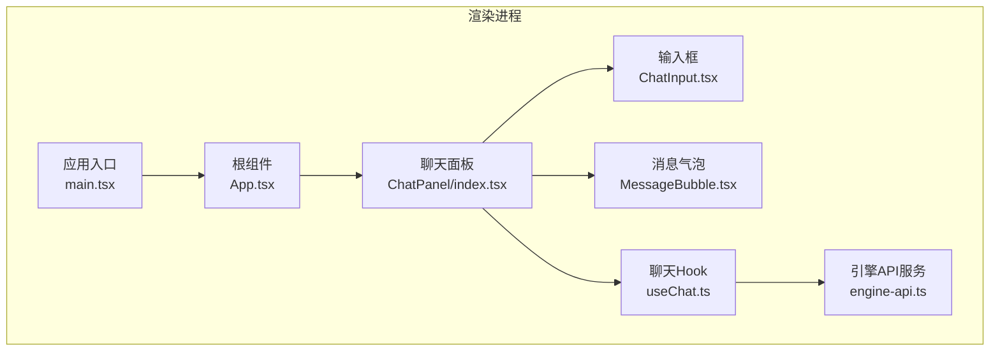
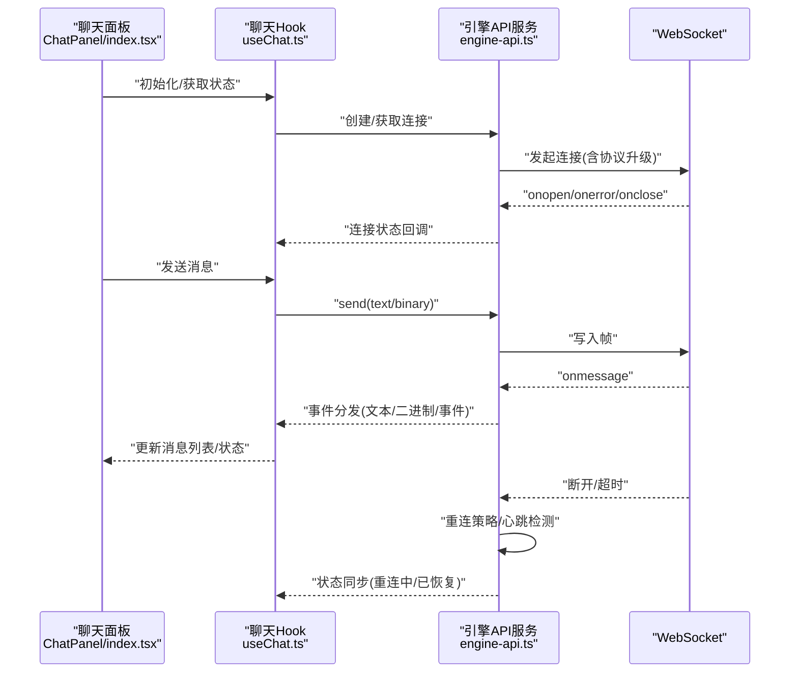
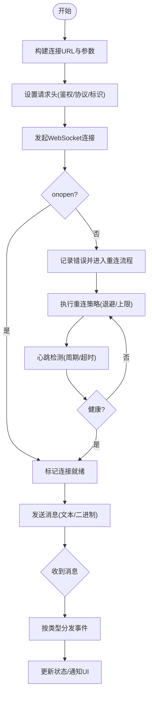
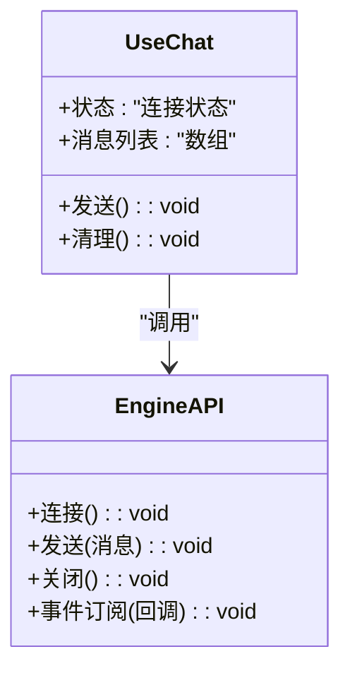
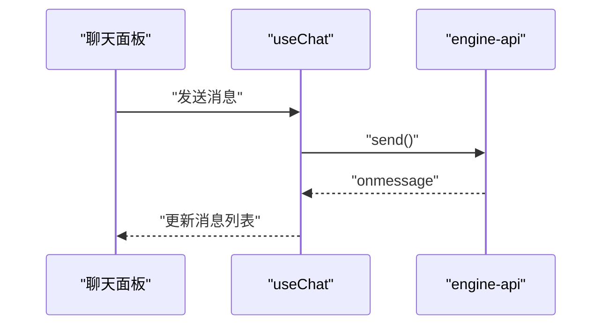
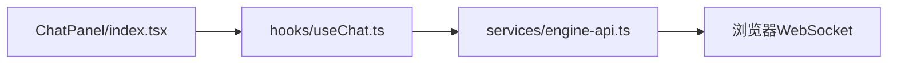

# WebSocket适配器

<cite>
**本文引用的文件**   
- [engine-api.ts](file://app/renderer/src/services/engine-api.ts)
- [useChat.ts](file://app/renderer/src/hooks/useChat.ts)
- [index.tsx](file://app/renderer/src/components/ChatPanel/index.tsx)
- [ChatInput.tsx](file://app/renderer/src/components/ChatPanel/ChatInput.tsx)
- [MessageBubble.tsx](file://app/renderer/src/components/ChatPanel/MessageBubble.tsx)
- [App.tsx](file://app/renderer/src/App.tsx)
- [main.tsx](file://app/renderer/src/main.tsx)
</cite>

## 目录
1. [简介](#简介)
2. [项目结构](#项目结构)
3. [核心组件](#核心组件)
4. [架构总览](#架构总览)
5. [详细组件分析](#详细组件分析)
6. [依赖关系分析](#依赖关系分析)
7. [性能考虑](#性能考虑)
8. [故障排查指南](#故障排查指南)
9. [结论](#结论)
10. [附录](#附录)

## 简介
本技术文档聚焦于KCoder的WebSocket适配器，围绕连接建立、握手与升级、消息收发机制、断线重连策略、心跳检测、连接池与多连接管理、安全配置以及集成使用模式进行系统化说明。文档以“渐进式复杂度”组织内容，既提供高层概览，也深入到关键实现细节，并辅以图示帮助理解。

## 项目结构
KCoder采用Electron + React的前端工程组织方式，WebSocket相关能力主要位于渲染进程的服务层与UI交互层：
- 服务层：封装WebSocket生命周期、事件分发、错误处理与重试逻辑
- UI层：通过React Hooks与组件消费服务层能力，完成聊天面板的消息展示与输入

**图表来源**
- [main.tsx:1-200](file://app/renderer/src/main.tsx#L1-L200)
- [App.tsx:1-200](file://app/renderer/src/App.tsx#L1-L200)
- [index.tsx:1-200](file://app/renderer/src/components/ChatPanel/index.tsx#L1-L200)
- [ChatInput.tsx:1-200](file://app/renderer/src/components/ChatPanel/ChatInput.tsx#L1-L200)
- [MessageBubble.tsx:1-200](file://app/renderer/src/components/ChatPanel/MessageBubble.tsx#L1-L200)
- [useChat.ts:1-200](file://app/renderer/src/hooks/useChat.ts#L1-L200)
- [engine-api.ts:1-200](file://app/renderer/src/services/engine-api.ts#L1-L200)

**章节来源**
- [main.tsx:1-200](file://app/renderer/src/main.tsx#L1-L200)
- [App.tsx:1-200](file://app/renderer/src/App.tsx#L1-L200)
- [index.tsx:1-200](file://app/renderer/src/components/ChatPanel/index.tsx#L1-L200)
- [ChatInput.tsx:1-200](file://app/renderer/src/components/ChatPanel/ChatInput.tsx#L1-L200)
- [MessageBubble.tsx:1-200](file://app/renderer/src/components/ChatPanel/MessageBubble.tsx#L1-L200)
- [useChat.ts:1-200](file://app/renderer/src/hooks/useChat.ts#L1-L200)
- [engine-api.ts:1-200](file://app/renderer/src/services/engine-api.ts#L1-L200)

## 核心组件
- 引擎API服务（engine-api.ts）：负责WebSocket实例化、连接参数配置、握手与升级、消息发送与接收、错误与状态回调、重连与心跳等核心能力
- 聊天Hook（useChat.ts）：在组件侧暴露连接状态、消息列表、发送动作，内部调用引擎API服务
- 聊天面板（ChatPanel/index.tsx）：组合输入框与消息气泡，订阅Hook状态，驱动用户交互
- 输入框（ChatInput.tsx）：收集用户输入，触发发送
- 消息气泡（MessageBubble.tsx）：渲染单条消息，支持文本与二进制预览

上述组件共同构成“UI → Hook → 服务 → WebSocket”的清晰分层，便于扩展与维护。

**章节来源**
- [engine-api.ts:1-200](file://app/renderer/src/services/engine-api.ts#L1-L200)
- [useChat.ts:1-200](file://app/renderer/src/hooks/useChat.ts#L1-L200)
- [index.tsx:1-200](file://app/renderer/src/components/ChatPanel/index.tsx#L1-L200)
- [ChatInput.tsx:1-200](file://app/renderer/src/components/ChatPanel/ChatInput.tsx#L1-L200)
- [MessageBubble.tsx:1-200](file://app/renderer/src/components/ChatPanel/MessageBubble.tsx#L1-L200)

## 架构总览
下图展示了从UI到WebSocket的端到端流程，包括连接建立、消息收发、错误与重连路径。

**图表来源**
- [index.tsx:1-200](file://app/renderer/src/components/ChatPanel/index.tsx#L1-L200)
- [useChat.ts:1-200](file://app/renderer/src/hooks/useChat.ts#L1-L200)
- [engine-api.ts:1-200](file://app/renderer/src/services/engine-api.ts#L1-L200)

## 详细组件分析

### 引擎API服务（engine-api.ts）
职责概述
- 连接管理：创建、销毁、状态跟踪、URL与参数组装
- 握手与升级：构建请求头、协议协商、证书与安全选项
- 消息通道：文本与二进制消息发送；事件驱动的消息分发
- 可靠性：断线重连、退避算法、最大重试次数、连接保活（心跳）
- 安全：TLS/SSL、鉴权头注入、权限控制点
- 可观测性：错误上报、日志、指标埋点

关键流程
- 连接建立与升级
  - 组装目标地址与查询参数
  - 设置请求头（鉴权、协议版本、客户端标识）
  - 发起连接并监听onopen/onerror/onclose
- 消息收发
  - 文本消息：序列化后发送
  - 二进制消息：按类型分派（如图片、文件片段）
  - 事件驱动：根据消息类型路由至对应处理器
- 断线重连
  - 指数退避或固定间隔策略
  - 最大重试上限与熔断保护
  - 重连期间队列缓冲与去抖
- 心跳检测
  - 周期性发送心跳包
  - 超时未响应则判定为不健康并触发重连
  - 健康检查回调用于上层状态同步

**图表来源**
- [engine-api.ts:1-200](file://app/renderer/src/services/engine-api.ts#L1-L200)

**章节来源**
- [engine-api.ts:1-200](file://app/renderer/src/services/engine-api.ts#L1-L200)

### 聊天Hook（useChat.ts）
职责概述
- 暴露连接状态（连接中/已连接/断开/重连中）
- 维护消息列表与滚动位置
- 封装发送动作，统一走引擎API服务
- 订阅服务层事件，驱动UI更新

典型用法
- 在组件中调用Hook获取状态与动作
- 将发送函数绑定到输入框提交事件
- 监听连接状态变化，显示提示或禁用输入

**图表来源**
- [useChat.ts:1-200](file://app/renderer/src/hooks/useChat.ts#L1-L200)
- [engine-api.ts:1-200](file://app/renderer/src/services/engine-api.ts#L1-L200)

**章节来源**
- [useChat.ts:1-200](file://app/renderer/src/hooks/useChat.ts#L1-L200)

### 聊天面板（ChatPanel/index.tsx）
职责概述
- 组合输入框与消息气泡
- 订阅Hook状态，渲染消息列表
- 处理用户交互（发送、清空、滚动）

交互流程
- 用户输入 → 触发发送 → Hook调用引擎API → 服务端返回 → Hook更新状态 → 面板刷新

**图表来源**
- [index.tsx:1-200](file://app/renderer/src/components/ChatPanel/index.tsx#L1-L200)
- [useChat.ts:1-200](file://app/renderer/src/hooks/useChat.ts#L1-L200)
- [engine-api.ts:1-200](file://app/renderer/src/services/engine-api.ts#L1-L200)

**章节来源**
- [index.tsx:1-200](file://app/renderer/src/components/ChatPanel/index.tsx#L1-L200)

### 输入框（ChatInput.tsx）
职责概述
- 收集用户输入
- 校验非空与长度限制
- 触发Hook的发送动作

**章节来源**
- [ChatInput.tsx:1-200](file://app/renderer/src/components/ChatPanel/ChatInput.tsx#L1-L200)

### 消息气泡（MessageBubble.tsx）
职责概述
- 渲染单条消息（文本/二进制）
- 对二进制数据提供基础预览（如缩略图或下载链接）
- 支持复制、删除等辅助操作

**章节来源**
- [MessageBubble.tsx:1-200](file://app/renderer/src/components/ChatPanel/MessageBubble.tsx#L1-L200)

### 应用入口与根组件
- main.tsx：应用启动、挂载根节点、全局错误边界
- App.tsx：布局与路由（如有）、上下文提供者、主题与配置

**章节来源**
- [main.tsx:1-200](file://app/renderer/src/main.tsx#L1-L200)
- [App.tsx:1-200](file://app/renderer/src/App.tsx#L1-L200)

## 依赖关系分析
- 组件层依赖Hook层，Hook层依赖服务层，服务层直接持有WebSocket实例
- 服务层可能依赖网络库、加密库（TLS/SSL）、鉴权中间件
- Hook层依赖React状态管理（useState/useEffect/useRef等）

**图表来源**
- [index.tsx:1-200](file://app/renderer/src/components/ChatPanel/index.tsx#L1-L200)
- [useChat.ts:1-200](file://app/renderer/src/hooks/useChat.ts#L1-L200)
- [engine-api.ts:1-200](file://app/renderer/src/services/engine-api.ts#L1-L200)

**章节来源**
- [index.tsx:1-200](file://app/renderer/src/components/ChatPanel/index.tsx#L1-L200)
- [useChat.ts:1-200](file://app/renderer/src/hooks/useChat.ts#L1-L200)
- [engine-api.ts:1-200](file://app/renderer/src/services/engine-api.ts#L1-L200)

## 性能考虑
- 批量消息合并：在高吞吐场景下，减少频繁状态更新，采用批处理与节流
- 二进制消息优化：分片传输、压缩、懒加载预览
- 连接复用：同一会话内复用WebSocket实例，避免频繁握手开销
- 背压与限流：当服务端处理慢时，客户端进行发送速率控制
- 内存管理：及时释放不再使用的消息与资源，防止泄漏

[本节为通用指导，无需代码来源]

## 故障排查指南
常见问题与定位要点
- 连接失败
  - 检查URL与端口、代理与跨域策略
  - 查看握手阶段错误码与响应头
  - 确认鉴权头是否携带且有效
- 频繁断线
  - 核对心跳间隔与超时阈值
  - 观察网络抖动与服务器负载
  - 检查重连退避策略是否合理
- 消息丢失或乱序
  - 确认服务端是否保证顺序与幂等
  - 客户端是否缓存并重放必要消息
- 二进制消息异常
  - 验证MIME类型与编码
  - 检查大小限制与分片策略

建议的调试手段
- 启用详细日志（连接、消息、错误、重连）
- 使用浏览器开发者工具的网络面板抓包
- 在服务端增加对应日志与指标

**章节来源**
- [engine-api.ts:1-200](file://app/renderer/src/services/engine-api.ts#L1-L200)

## 结论
KCoder的WebSocket适配器通过清晰的分层设计与完善的可靠性机制，实现了稳定的实时通信能力。服务层承担连接、消息、重连与心跳的核心职责，Hook层提供易用的接口给UI层，整体具备良好的可扩展性与可维护性。建议在后续迭代中持续完善可观测性、安全加固与性能优化。

[本节为总结，无需代码来源]

## 附录

### 连接建立与握手协议
- 目标地址：ws://或wss://，包含主机、端口、路径与查询参数
- 请求头：鉴权令牌、协议版本、客户端标识、语言与时区
- 升级过程：HTTP Upgrade到WebSocket，完成握手后进入双向通信

**章节来源**
- [engine-api.ts:1-200](file://app/renderer/src/services/engine-api.ts#L1-L200)

### 消息收发机制
- 文本消息：JSON或自定义协议，包含类型、载荷、时间戳与ID
- 二进制消息：按类型分派（图片、文件、音频），支持分片与进度
- 事件驱动：根据消息类型路由至不同处理器（如系统事件、业务事件）

**章节来源**
- [engine-api.ts:1-200](file://app/renderer/src/services/engine-api.ts#L1-L200)

### 断线重连策略
- 自动重连：指数退避或固定间隔，支持最大重试次数
- 连接状态同步：重连中、已恢复、不可用等状态反馈到UI
- 队列缓冲：重连期间暂存消息，恢复后有序发送

**章节来源**
- [engine-api.ts:1-200](file://app/renderer/src/services/engine-api.ts#L1-L200)

### 心跳检测与健康检查
- 心跳包格式：轻量级心跳帧，包含序列号与时间戳
- 超时检测：超过阈值未收到响应即判定不健康
- 健康检查：定期探测，结合重连策略提升可用性

**章节来源**
- [engine-api.ts:1-200](file://app/renderer/src/services/engine-api.ts#L1-L200)

### 连接池与多连接处理
- 连接池：按会话或功能域划分连接，避免相互影响
- 多连接：并行连接不同后端或服务，具备负载均衡与故障转移
- 资源回收：空闲连接回收与最大连接数限制

**章节来源**
- [engine-api.ts:1-200](file://app/renderer/src/services/engine-api.ts#L1-L200)

### 安全配置
- SSL/TLS：优先使用wss，配置证书与校验策略
- 身份验证：Bearer Token、Cookie或自定义鉴权头
- 权限控制：基于角色或资源的访问控制，服务端校验

**章节来源**
- [engine-api.ts:1-200](file://app/renderer/src/services/engine-api.ts#L1-L200)

### 集成与使用示例（路径指引）
- 在组件中引入Hook并使用
  - 参考：[useChat.ts:1-200](file://app/renderer/src/hooks/useChat.ts#L1-L200)
- 在聊天面板中组合输入与消息
  - 参考：[index.tsx:1-200](file://app/renderer/src/components/ChatPanel/index.tsx#L1-L200)
- 发送文本与二进制消息
  - 参考：[engine-api.ts:1-200](file://app/renderer/src/services/engine-api.ts#L1-L200)
- 监听连接状态与错误
  - 参考：[useChat.ts:1-200](file://app/renderer/src/hooks/useChat.ts#L1-L200)

[本节为使用指引，无需额外代码来源]