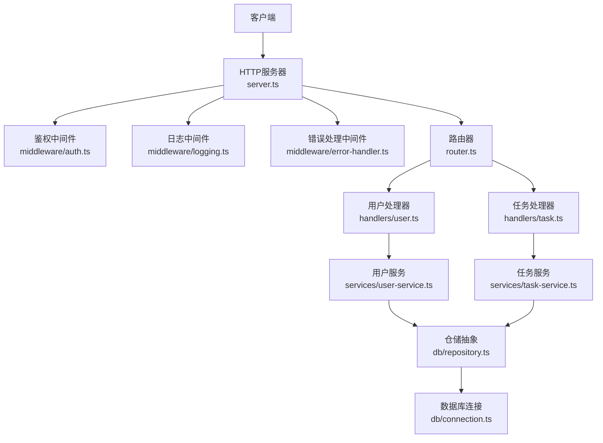
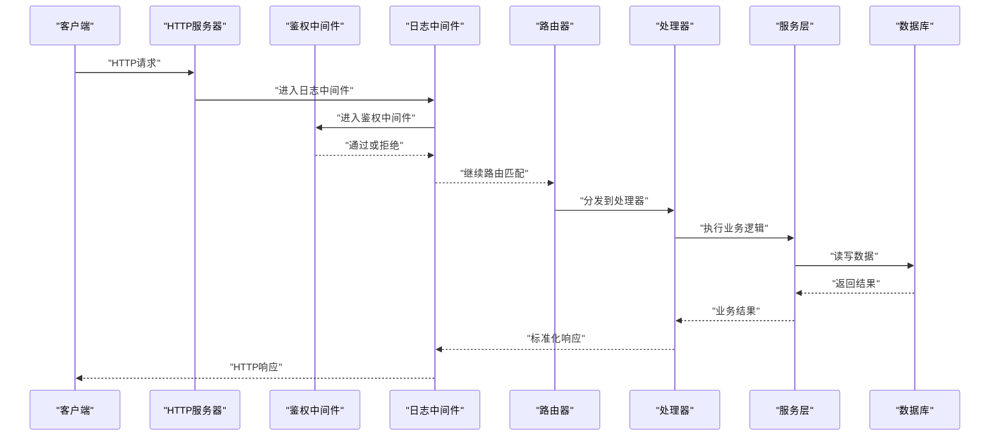
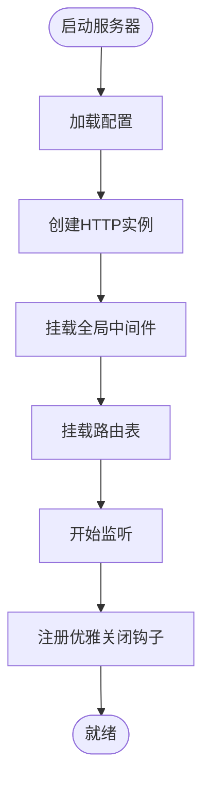
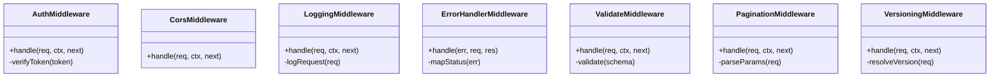
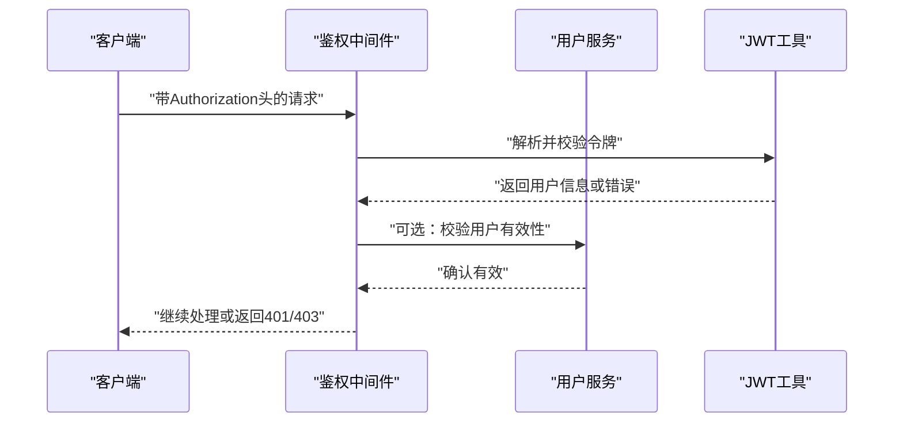
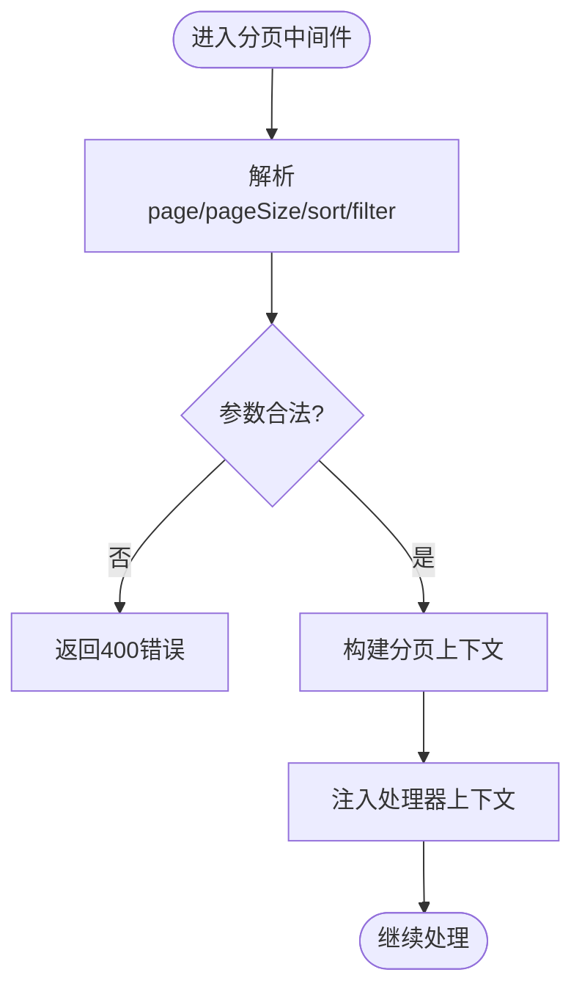
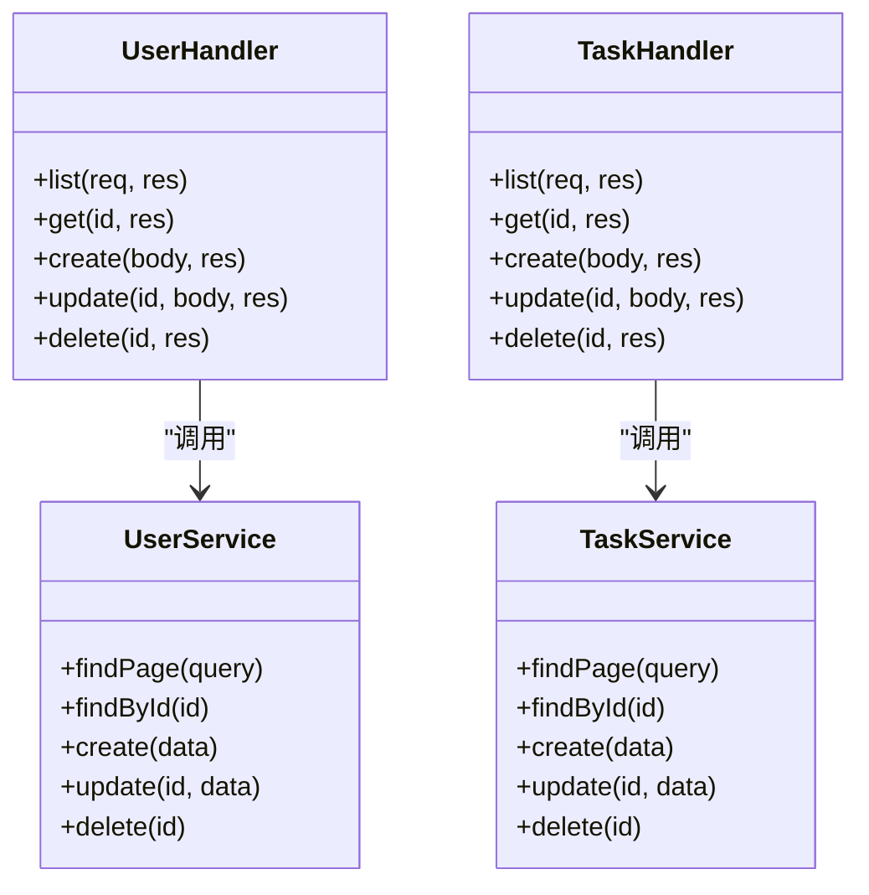
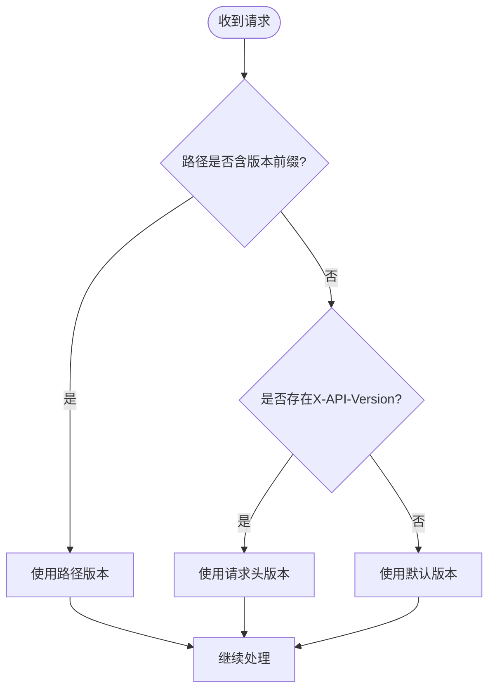
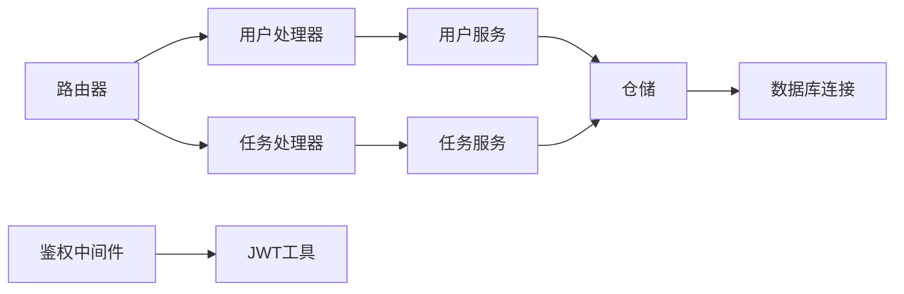

# REST API适配器

<cite>
**本文引用的文件**   
- [engine/packages/http-layer/src/server.ts](file://engine/packages/http-layer/src/server.ts)
- [engine/packages/http-layer/src/router.ts](file://engine/packages/http-layer/src/router.ts)
- [engine/packages/http-layer/src/middleware/auth.ts](file://engine/packages/http-layer/src/middleware/auth.ts)
- [engine/packages/http-layer/src/middleware/cors.ts](file://engine/packages/http-layer/src/middleware/cors.ts)
- [engine/packages/http-layer/src/middleware/logging.ts](file://engine/packages/http-layer/src/middleware/logging.ts)
- [engine/packages/http-layer/src/middleware/error-handler.ts](file://engine/packages/http-layer/src/middleware/error-handler.ts)
- [engine/packages/http-layer/src/middleware/validate.ts](file://engine/packages/http-layer/src/middleware/validate.ts)
- [engine/packages/http-layer/src/middleware/pagination.ts](file://engine/packages/http-layer/src/middleware/pagination.ts)
- [engine/packages/http-layer/src/middleware/versioning.ts](file://engine/packages/http-layer/src/middleware/versioning.ts)
- [engine/packages/http-layer/src/handlers/user.ts](file://engine/packages/http-layer/src/handlers/user.ts)
- [engine/packages/http-layer/src/handlers/task.ts](file://engine/packages/http-layer/src/handlers/task.ts)
- [engine/packages/http-layer/src/models/user.ts](file://engine/packages/http-layer/src/models/user.ts)
- [engine/packages/http-layer/src/models/task.ts](file://engine/packages/http-layer/src/models/task.ts)
- [engine/packages/http-layer/src/services/user-service.ts](file://engine/packages/http-layer/src/services/user-service.ts)
- [engine/packages/http-layer/src/services/task-service.ts](file://engine/packages/http-layer/src/services/task-service.ts)
- [engine/packages/http-layer/src/db/repository.ts](file://engine/packages/http-layer/src/db/repository.ts)
- [engine/packages/http-layer/src/db/connection.ts](file://engine/packages/http-layer/src/db/connection.ts)
- [engine/packages/http-layer/src/errors/api-error.ts](file://engine/packages/http-layer/src/errors/api-error.ts)
- [engine/packages/http-layer/src/utils/response.ts](file://engine/packages/http-layer/src/utils/response.ts)
- [engine/packages/http-layer/src/utils/jwt.ts](file://engine/packages/http-layer/src/utils/jwt.ts)
- [engine/packages/http-layer/src/config.ts](file://engine/packages/http-layer/src/config.ts)
- [engine/tests/http-server.test.ts](file://engine/tests/http-server.test.ts)
- [engine/tests/http-server-test-harness.ts](file://engine/tests/http-server-test-harness.ts)
</cite>

## 目录
1. [简介](#简介)
2. [项目结构](#项目结构)
3. [核心组件](#核心组件)
4. [架构总览](#架构总览)
5. [详细组件分析](#详细组件分析)
6. [依赖关系分析](#依赖关系分析)
7. [性能考虑](#性能考虑)
8. [故障排查指南](#故障排查指南)
9. [结论](#结论)
10. [附录](#附录)

## 简介
本技术文档面向KCoder的REST API适配器，聚焦HTTP服务器实现与API适配层。内容涵盖：
- HTTP服务器的路由注册机制、中间件管道与请求处理流程
- CRUD操作的封装模式（资源定义、参数验证、响应格式化、错误处理）
- 分页与过滤查询的实现（查询参数解析、数据库查询构建、性能优化策略）
- 认证授权机制（JWT令牌验证、权限检查、会话管理）
- API版本控制策略（URL路径版本化、请求头版本控制、向后兼容性保证）
- 扩展指南（新增API端点与自定义中间件的具体步骤）

## 项目结构
REST API适配器位于 engine/packages/http-layer 下，采用分层组织方式：
- server.ts：HTTP服务启动、监听端口、挂载根中间件与路由
- router.ts：路由表与路径到处理器的映射
- middleware/*：通用中间件（鉴权、CORS、日志、错误处理、校验、分页、版本控制）
- handlers/*：按资源划分的处理器（如用户、任务）
- models/*：数据模型与校验规则
- services/*：业务逻辑与服务编排
- db/*：数据库连接与仓储抽象
- errors/*：统一错误类型
- utils/*：工具函数（响应包装、JWT等）
- config.ts：配置项（端口、CORS、JWT密钥、分页默认值等）

图表来源
- [engine/packages/http-layer/src/server.ts](file://engine/packages/http-layer/src/server.ts)
- [engine/packages/http-layer/src/router.ts](file://engine/packages/http-layer/src/router.ts)
- [engine/packages/http-layer/src/middleware/auth.ts](file://engine/packages/http-layer/src/middleware/auth.ts)
- [engine/packages/http-layer/src/middleware/logging.ts](file://engine/packages/http-layer/src/middleware/logging.ts)
- [engine/packages/http-layer/src/middleware/error-handler.ts](file://engine/packages/http-layer/src/middleware/error-handler.ts)
- [engine/packages/http-layer/src/handlers/user.ts](file://engine/packages/http-layer/src/handlers/user.ts)
- [engine/packages/http-layer/src/handlers/task.ts](file://engine/packages/http-layer/src/handlers/task.ts)
- [engine/packages/http-layer/src/services/user-service.ts](file://engine/packages/http-layer/src/services/user-service.ts)
- [engine/packages/http-layer/src/services/task-service.ts](file://engine/packages/http-layer/src/services/task-service.ts)
- [engine/packages/http-layer/src/db/repository.ts](file://engine/packages/http-layer/src/db/repository.ts)
- [engine/packages/http-layer/src/db/connection.ts](file://engine/packages/http-layer/src/db/connection.ts)

章节来源
- [engine/packages/http-layer/src/server.ts](file://engine/packages/http-layer/src/server.ts)
- [engine/packages/http-layer/src/router.ts](file://engine/packages/http-layer/src/router.ts)
- [engine/packages/http-layer/src/config.ts](file://engine/packages/http-layer/src/config.ts)

## 核心组件
- HTTP服务器与生命周期
  - 负责创建HTTP实例、加载全局中间件、挂载路由、启动监听
  - 提供优雅关闭钩子，确保在进程退出时释放资源
- 路由系统
  - 集中式路由表，支持路径前缀、方法限定、处理器绑定
  - 支持动态段与查询参数透传
- 中间件管道
  - 顺序执行，可短路返回；支持上下文对象传递状态
  - 内置鉴权、CORS、日志、错误处理、校验、分页、版本控制
- 处理器与服务
  - 处理器仅做入参提取与出参包装，业务逻辑下沉至服务层
  - 服务层调用仓储进行数据访问，并编排领域逻辑
- 数据访问层
  - 仓储接口抽象，屏蔽底层SQL/ORM差异
  - 连接池管理与事务支持
- 错误与响应
  - 统一错误类型与HTTP状态码映射
  - 标准化响应体结构，便于前端消费

章节来源
- [engine/packages/http-layer/src/server.ts](file://engine/packages/http-layer/src/server.ts)
- [engine/packages/http-layer/src/router.ts](file://engine/packages/http-layer/src/router.ts)
- [engine/packages/http-layer/src/middleware/error-handler.ts](file://engine/packages/http-layer/src/middleware/error-handler.ts)
- [engine/packages/http-layer/src/utils/response.ts](file://engine/packages/http-layer/src/utils/response.ts)
- [engine/packages/http-layer/src/db/repository.ts](file://engine/packages/http-layer/src/db/repository.ts)

## 架构总览
下图展示了从请求进入到响应的完整链路，包括中间件链路与处理器-服务-仓储的调用关系。

图表来源
- [engine/packages/http-layer/src/server.ts](file://engine/packages/http-layer/src/server.ts)
- [engine/packages/http-layer/src/middleware/auth.ts](file://engine/packages/http-layer/src/middleware/auth.ts)
- [engine/packages/http-layer/src/middleware/logging.ts](file://engine/packages/http-layer/src/middleware/logging.ts)
- [engine/packages/http-layer/src/router.ts](file://engine/packages/http-layer/src/router.ts)
- [engine/packages/http-layer/src/handlers/user.ts](file://engine/packages/http-layer/src/handlers/user.ts)
- [engine/packages/http-layer/src/services/user-service.ts](file://engine/packages/http-layer/src/services/user-service.ts)
- [engine/packages/http-layer/src/db/repository.ts](file://engine/packages/http-layer/src/db/repository.ts)

## 详细组件分析

### HTTP服务器与路由注册
- 服务器初始化
  - 读取配置（端口、CORS、JWT密钥、分页默认值）
  - 创建HTTP实例并挂载全局中间件（CORS、日志、错误处理）
  - 挂载版本化前缀与路由表
  - 启动监听与优雅关闭
- 路由注册机制
  - 使用集中式路由表，声明路径与方法到处理器的映射
  - 支持路径前缀（如 /api/v1），便于版本控制
  - 支持动态段（如 :id）与查询参数自动注入
- 中间件管道
  - 顺序执行，支持短路返回
  - 每个中间件可读取/写入上下文对象（如用户信息、追踪ID）

图表来源
- [engine/packages/http-layer/src/server.ts](file://engine/packages/http-layer/src/server.ts)
- [engine/packages/http-layer/src/config.ts](file://engine/packages/http-layer/src/config.ts)
- [engine/packages/http-layer/src/router.ts](file://engine/packages/http-layer/src/router.ts)

章节来源
- [engine/packages/http-layer/src/server.ts](file://engine/packages/http-layer/src/server.ts)
- [engine/packages/http-layer/src/router.ts](file://engine/packages/http-layer/src/router.ts)
- [engine/packages/http-layer/src/config.ts](file://engine/packages/http-layer/src/config.ts)

### 中间件体系
- 鉴权中间件（auth）
  - 从请求头提取JWT令牌并进行签名校验
  - 将解码后的用户信息注入上下文，供后续处理器使用
  - 对未携带或无效令牌返回401
- CORS中间件（cors）
  - 设置允许的来源、方法与头部
  - 处理预检请求
- 日志中间件（logging）
  - 记录请求方法、路径、耗时与状态码
  - 为每次请求生成追踪ID
- 错误处理中间件（error-handler）
  - 捕获异常并转换为标准错误响应
  - 根据错误类型映射HTTP状态码
- 参数校验中间件（validate）
  - 基于模型定义对请求体/查询参数进行校验
  - 失败时返回400并附带字段级错误
- 分页中间件（pagination）
  - 解析 page、pageSize、sort、offset 等参数
  - 将分页上下文注入处理器，避免重复解析
- 版本控制中间件（versioning）
  - 支持URL路径版本化（/api/v1）与请求头版本控制（X-API-Version）
  - 将当前版本注入上下文，处理器据此选择行为

图表来源
- [engine/packages/http-layer/src/middleware/auth.ts](file://engine/packages/http-layer/src/middleware/auth.ts)
- [engine/packages/http-layer/src/middleware/cors.ts](file://engine/packages/http-layer/src/middleware/cors.ts)
- [engine/packages/http-layer/src/middleware/logging.ts](file://engine/packages/http-layer/src/middleware/logging.ts)
- [engine/packages/http-layer/src/middleware/error-handler.ts](file://engine/packages/http-layer/src/middleware/error-handler.ts)
- [engine/packages/http-layer/src/middleware/validate.ts](file://engine/packages/http-layer/src/middleware/validate.ts)
- [engine/packages/http-layer/src/middleware/pagination.ts](file://engine/packages/http-layer/src/middleware/pagination.ts)
- [engine/packages/http-layer/src/middleware/versioning.ts](file://engine/packages/http-layer/src/middleware/versioning.ts)

章节来源
- [engine/packages/http-layer/src/middleware/auth.ts](file://engine/packages/http-layer/src/middleware/auth.ts)
- [engine/packages/http-layer/src/middleware/cors.ts](file://engine/packages/http-layer/src/middleware/cors.ts)
- [engine/packages/http-layer/src/middleware/logging.ts](file://engine/packages/http-layer/src/middleware/logging.ts)
- [engine/packages/http-layer/src/middleware/error-handler.ts](file://engine/packages/http-layer/src/middleware/error-handler.ts)
- [engine/packages/http-layer/src/middleware/validate.ts](file://engine/packages/http-layer/src/middleware/validate.ts)
- [engine/packages/http-layer/src/middleware/pagination.ts](file://engine/packages/http-layer/src/middleware/pagination.ts)
- [engine/packages/http-layer/src/middleware/versioning.ts](file://engine/packages/http-layer/src/middleware/versioning.ts)

### 认证与授权机制
- JWT令牌验证
  - 从请求头提取令牌，校验签名与过期时间
  - 将用户标识与角色注入上下文
- 权限检查
  - 处理器或服务层依据上下文中的角色/权限进行决策
  - 未授权时返回403
- 会话管理
  - 无状态设计，不依赖服务端会话存储
  - 可通过刷新令牌机制延长有效期

图表来源
- [engine/packages/http-layer/src/middleware/auth.ts](file://engine/packages/http-layer/src/middleware/auth.ts)
- [engine/packages/http-layer/src/utils/jwt.ts](file://engine/packages/http-layer/src/utils/jwt.ts)
- [engine/packages/http-layer/src/services/user-service.ts](file://engine/packages/http-layer/src/services/user-service.ts)

章节来源
- [engine/packages/http-layer/src/middleware/auth.ts](file://engine/packages/http-layer/src/middleware/auth.ts)
- [engine/packages/http-layer/src/utils/jwt.ts](file://engine/packages/http-layer/src/utils/jwt.ts)

### 分页与过滤查询
- 查询参数解析
  - 支持 page、pageSize、sort、filter 等参数
  - 默认分页大小与最大页大小受配置限制
- 数据库查询构建
  - 将分页上下文转换为LIMIT/OFFSET或游标分页
  - 过滤条件拼接WHERE子句，排序字段白名单校验
- 性能优化策略
  - 索引建议：常用过滤与排序字段建立复合索引
  - 分页深度限制：防止大偏移量导致的性能问题
  - 缓存热点列表：结合Redis缓存高频查询结果

图表来源
- [engine/packages/http-layer/src/middleware/pagination.ts](file://engine/packages/http-layer/src/middleware/pagination.ts)
- [engine/packages/http-layer/src/db/repository.ts](file://engine/packages/http-layer/src/db/repository.ts)
- [engine/packages/http-layer/src/config.ts](file://engine/packages/http-layer/src/config.ts)

章节来源
- [engine/packages/http-layer/src/middleware/pagination.ts](file://engine/packages/http-layer/src/middleware/pagination.ts)
- [engine/packages/http-layer/src/db/repository.ts](file://engine/packages/http-layer/src/db/repository.ts)
- [engine/packages/http-layer/src/config.ts](file://engine/packages/http-layer/src/config.ts)

### CRUD操作封装模式
- 资源定义
  - 处理器按资源划分（如用户、任务），每个处理器包含增删改查端点
- 参数验证
  - 使用校验中间件与模型定义，对请求体与查询参数进行强校验
- 响应格式化
  - 统一响应包装器，包含数据、分页元信息与错误结构
- 错误处理
  - 统一错误类型与状态码映射，避免分散的错误分支

图表来源
- [engine/packages/http-layer/src/handlers/user.ts](file://engine/packages/http-layer/src/handlers/user.ts)
- [engine/packages/http-layer/src/handlers/task.ts](file://engine/packages/http-layer/src/handlers/task.ts)
- [engine/packages/http-layer/src/services/user-service.ts](file://engine/packages/http-layer/src/services/user-service.ts)
- [engine/packages/http-layer/src/services/task-service.ts](file://engine/packages/http-layer/src/services/task-service.ts)

章节来源
- [engine/packages/http-layer/src/handlers/user.ts](file://engine/packages/http-layer/src/handlers/user.ts)
- [engine/packages/http-layer/src/handlers/task.ts](file://engine/packages/http-layer/src/handlers/task.ts)
- [engine/packages/http-layer/src/services/user-service.ts](file://engine/packages/http-layer/src/services/user-service.ts)
- [engine/packages/http-layer/src/services/task-service.ts](file://engine/packages/http-layer/src/services/task-service.ts)
- [engine/packages/http-layer/src/models/user.ts](file://engine/packages/http-layer/src/models/user.ts)
- [engine/packages/http-layer/src/models/task.ts](file://engine/packages/http-layer/src/models/task.ts)
- [engine/packages/http-layer/src/utils/response.ts](file://engine/packages/http-layer/src/utils/response.ts)
- [engine/packages/http-layer/src/errors/api-error.ts](file://engine/packages/http-layer/src/errors/api-error.ts)

### API版本控制策略
- URL路径版本化
  - 所有API以 /api/v1 前缀暴露，便于平滑升级
- 请求头版本控制
  - 支持 X-API-Version 指定版本，用于灰度与兼容测试
- 向后兼容性保证
  - 新版本在不破坏旧接口的情况下增加字段或端点
  - 废弃字段保留一段时间并提供迁移提示

图表来源
- [engine/packages/http-layer/src/middleware/versioning.ts](file://engine/packages/http-layer/src/middleware/versioning.ts)
- [engine/packages/http-layer/src/router.ts](file://engine/packages/http-layer/src/router.ts)

章节来源
- [engine/packages/http-layer/src/middleware/versioning.ts](file://engine/packages/http-layer/src/middleware/versioning.ts)
- [engine/packages/http-layer/src/router.ts](file://engine/packages/http-layer/src/router.ts)

### 集成与扩展指南
- 新增API端点
  - 在对应处理器中实现CRUD方法
  - 在路由表中注册路径与方法映射
  - 如需校验，添加校验中间件与模型定义
- 自定义中间件
  - 实现统一的中间件签名（req, ctx, next）
  - 在服务器启动时挂载到合适位置
- 示例参考
  - 处理器与服务层的组合方式参见用户与任务模块
  - 鉴权与分页中间件的用法参见相应中间件文件

章节来源
- [engine/packages/http-layer/src/handlers/user.ts](file://engine/packages/http-layer/src/handlers/user.ts)
- [engine/packages/http-layer/src/handlers/task.ts](file://engine/packages/http-layer/src/handlers/task.ts)
- [engine/packages/http-layer/src/router.ts](file://engine/packages/http-layer/src/router.ts)
- [engine/packages/http-layer/src/middleware/auth.ts](file://engine/packages/http-layer/src/middleware/auth.ts)
- [engine/packages/http-layer/src/middleware/pagination.ts](file://engine/packages/http-layer/src/middleware/pagination.ts)

## 依赖关系分析
- 组件耦合与内聚
  - 处理器与服务层解耦，服务与仓储解耦，提升可测试性
  - 中间件之间职责单一，易于替换与组合
- 外部依赖与集成点
  - 数据库连接与事务由仓储层统一管理
  - JWT工具提供令牌签发与校验能力
- 潜在循环依赖
  - 通过仓储接口与服务层隔离，避免直接循环引用

图表来源
- [engine/packages/http-layer/src/router.ts](file://engine/packages/http-layer/src/router.ts)
- [engine/packages/http-layer/src/handlers/user.ts](file://engine/packages/http-layer/src/handlers/user.ts)
- [engine/packages/http-layer/src/handlers/task.ts](file://engine/packages/http-layer/src/handlers/task.ts)
- [engine/packages/http-layer/src/services/user-service.ts](file://engine/packages/http-layer/src/services/user-service.ts)
- [engine/packages/http-layer/src/services/task-service.ts](file://engine/packages/http-layer/src/services/task-service.ts)
- [engine/packages/http-layer/src/db/repository.ts](file://engine/packages/http-layer/src/db/repository.ts)
- [engine/packages/http-layer/src/db/connection.ts](file://engine/packages/http-layer/src/db/connection.ts)
- [engine/packages/http-layer/src/middleware/auth.ts](file://engine/packages/http-layer/src/middleware/auth.ts)
- [engine/packages/http-layer/src/utils/jwt.ts](file://engine/packages/http-layer/src/utils/jwt.ts)

章节来源
- [engine/packages/http-layer/src/router.ts](file://engine/packages/http-layer/src/router.ts)
- [engine/packages/http-layer/src/handlers/user.ts](file://engine/packages/http-layer/src/handlers/user.ts)
- [engine/packages/http-layer/src/handlers/task.ts](file://engine/packages/http-layer/src/handlers/task.ts)
- [engine/packages/http-layer/src/services/user-service.ts](file://engine/packages/http-layer/src/services/user-service.ts)
- [engine/packages/http-layer/src/services/task-service.ts](file://engine/packages/http-layer/src/services/task-service.ts)
- [engine/packages/http-layer/src/db/repository.ts](file://engine/packages/http-layer/src/db/repository.ts)
- [engine/packages/http-layer/src/db/connection.ts](file://engine/packages/http-layer/src/db/connection.ts)
- [engine/packages/http-layer/src/middleware/auth.ts](file://engine/packages/http-layer/src/middleware/auth.ts)
- [engine/packages/http-layer/src/utils/jwt.ts](file://engine/packages/http-layer/src/utils/jwt.ts)

## 性能考虑
- 连接池与并发
  - 合理配置数据库连接池大小，避免过多上下文切换
- 分页与索引
  - 对高频过滤与排序字段建立复合索引
  - 限制最大页大小，避免深分页带来的性能退化
- 缓存策略
  - 对只读且变化不频繁的数据使用缓存
  - 注意缓存失效与一致性策略
- 日志与观测
  - 生产环境降低日志级别，启用采样
  - 关键路径埋点，监控P95/P99延迟

[本节为通用指导，无需具体文件来源]

## 故障排查指南
- 常见问题定位
  - 401未认证：检查Authorization头与JWT密钥配置
  - 403未授权：检查用户角色与权限策略
  - 400参数错误：查看校验中间件返回的字段级错误
  - 500内部错误：查看错误处理中间件记录的堆栈
- 调试技巧
  - 开启详细日志，关注请求追踪ID
  - 使用测试夹具快速复现问题
- 参考测试用例
  - 端到端HTTP服务器测试与测试夹具

章节来源
- [engine/packages/http-layer/src/middleware/error-handler.ts](file://engine/packages/http-layer/src/middleware/error-handler.ts)
- [engine/packages/http-layer/src/middleware/auth.ts](file://engine/packages/http-layer/src/middleware/auth.ts)
- [engine/packages/http-layer/src/middleware/validate.ts](file://engine/packages/http-layer/src/middleware/validate.ts)
- [engine/tests/http-server.test.ts](file://engine/tests/http-server.test.ts)
- [engine/tests/http-server-test-harness.ts](file://engine/tests/http-server-test-harness.ts)

## 结论
本适配器通过清晰的分层与中间件机制，提供了可扩展、可维护的REST API能力。借助统一的错误与响应格式、完善的鉴权与版本控制策略，以及分页与过滤查询的最佳实践，能够快速支撑业务迭代与多版本共存。

[本节为总结性内容，无需具体文件来源]

## 附录
- 配置项说明
  - 端口、CORS、JWT密钥、分页默认值等
- 快速上手
  - 启动服务器、注册路由、编写处理器与服务
- 最佳实践清单
  - 参数校验前置、错误分类明确、分页深度限制、索引优化

章节来源
- [engine/packages/http-layer/src/config.ts](file://engine/packages/http-layer/src/config.ts)
- [engine/packages/http-layer/src/server.ts](file://engine/packages/http-layer/src/server.ts)
- [engine/packages/http-layer/src/router.ts](file://engine/packages/http-layer/src/router.ts)