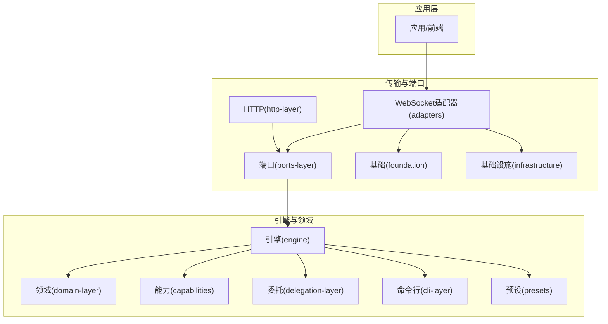
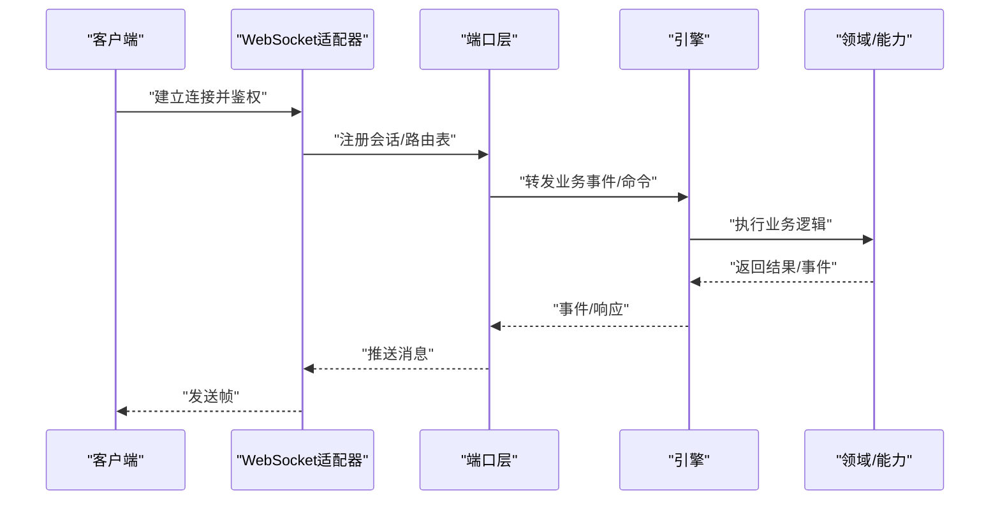
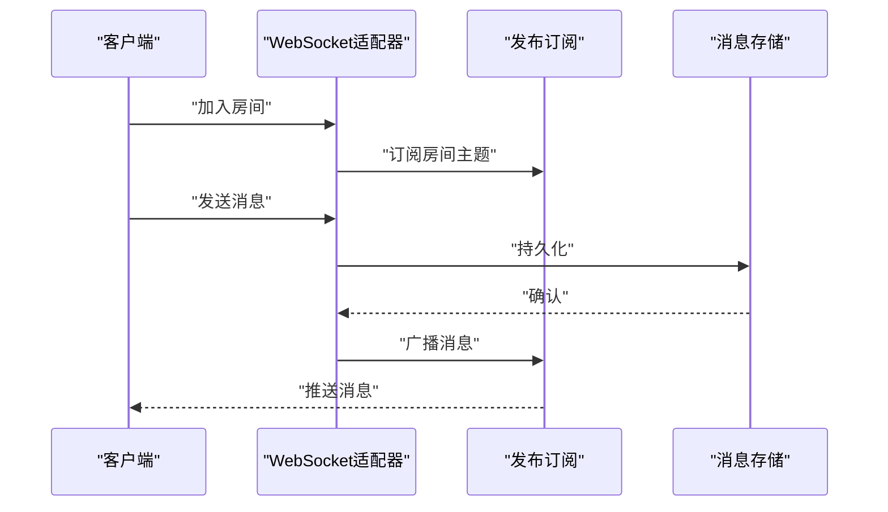
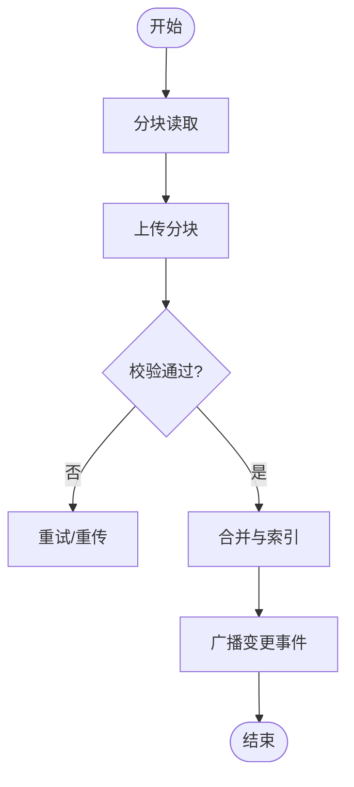
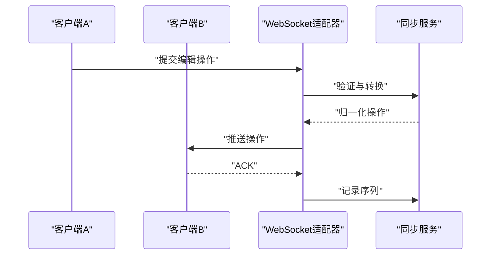
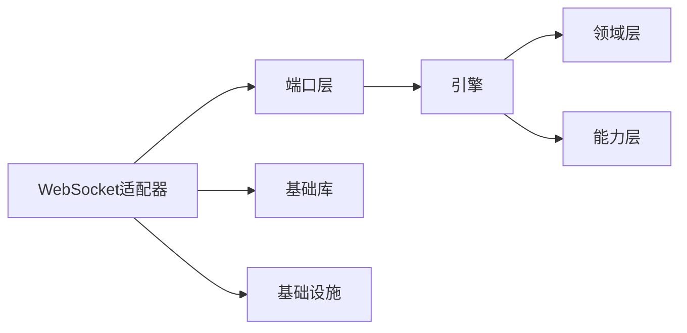

# WebSocket适配器

<cite>
**本文引用的文件**   
- [engine/packages/adapters/README.md](file://engine/packages/adapters/README.md)
- [engine/packages/ports-layer/README.md](file://engine/packages/ports-layer/README.md)
- [engine/packages/http-layer/README.md](file://engine/packages/http-layer/README.md)
- [engine/packages/foundation/README.md](file://engine/packages/foundation/README.md)
- [engine/packages/engine/README.md](file://engine/packages/engine/README.md)
- [engine/packages/domain-layer/README.md](file://engine/packages/domain-layer/README.md)
- [engine/packages/capabilities/README.md](file://engine/packages/capabilities/README.md)
- [engine/packages/delegation-layer/README.md](file://engine/packages/delegation-layer/README.md)
- [engine/packages/cli-layer/README.md](file://engine/packages/cli-layer/README.md)
- [engine/packages/presets/README.md](file://engine/packages/presets/README.md)
- [engine/packages/infrastructure/README.md](file://engine/packages/infrastructure/README.md)
</cite>

## 目录
1. [简介](#简介)
2. [项目结构](#项目结构)
3. [核心组件](#核心组件)
4. [架构总览](#架构总览)
5. [详细组件分析](#详细组件分析)
6. [依赖关系分析](#依赖关系分析)
7. [性能考虑](#性能考虑)
8. [故障排查指南](#故障排查指南)
9. [结论](#结论)
10. [附录](#附录)

## 简介
本技术文档聚焦于KCoder的WebSocket适配器，围绕以下目标展开：
- 连接管理：连接建立、心跳检测、断线重连、连接池管理
- 消息协议：消息格式定义、事件类型枚举、数据序列化与压缩传输
- 实时通信模式：发布订阅模型、房间管理、广播机制、点对点通信
- 状态同步：客户端状态维护、冲突解决、增量更新、离线同步
- 错误处理与恢复：网络异常、消息丢失恢复、连接降级
- 使用示例：实时聊天、文件同步、协作编辑

说明：当前仓库未包含具体的WebSocket实现源码。本文基于工程分层与包职责进行架构化分析与设计建议，所有图示为概念性示意，不直接映射到具体源文件。

## 项目结构
KCoder采用多包工作区组织，适配层位于engine/packages/adapters下，端口层在engine/packages/ports-layer，HTTP层在engine/packages/http-layer，基础设施与领域能力分别位于foundation、domain-layer、capabilities等包中。WebSocket适配器作为“适配器层”的一部分，负责将上层引擎与领域能力通过WebSocket协议暴露给外部客户端或进程间通信。

[无图表来源，因为该图为概念性结构示意]

## 核心组件
- 连接管理器：负责WebSocket生命周期（握手、鉴权、保活、重连、关闭）
- 消息编解码器：负责协议帧解析、事件类型分发、序列化/反序列化、可选压缩
- 路由与会话：按会话ID/用户ID路由消息，维护上下文与权限
- 发布订阅与房间：主题/频道抽象，支持广播与点对点转发
- 状态同步器：增量变更、冲突合并、离线队列与回放
- 监控与可观测性：指标、日志、追踪、健康检查

章节来源
- [engine/packages/adapters/README.md](file://engine/packages/adapters/README.md)
- [engine/packages/ports-layer/README.md](file://engine/packages/ports-layer/README.md)
- [engine/packages/http-layer/README.md](file://engine/packages/http-layer/README.md)
- [engine/packages/foundation/README.md](file://engine/packages/foundation/README.md)
- [engine/packages/engine/README.md](file://engine/packages/engine/README.md)
- [engine/packages/domain-layer/README.md](file://engine/packages/domain-layer/README.md)
- [engine/packages/capabilities/README.md](file://engine/packages/capabilities/README.md)
- [engine/packages/delegation-layer/README.md](file://engine/packages/delegation-layer/README.md)
- [engine/packages/cli-layer/README.md](file://engine/packages/cli-layer/README.md)
- [engine/packages/presets/README.md](file://engine/packages/presets/README.md)
- [engine/packages/infrastructure/README.md](file://engine/packages/infrastructure/README.md)

## 架构总览
WebSocket适配器处于传输边界，向上对接端口层与引擎，向下依托基础设施提供连接、缓冲、压缩、监控等能力。

[无图表来源，因为该图为概念性流程示意]

## 详细组件分析

### 连接管理
- 连接建立
  - 握手阶段：TLS终止、鉴权令牌校验、会话初始化、资源配额分配
  - 路由阶段：根据用户/租户/设备标识绑定路由键，加入默认房间
- 心跳检测
  - 双向心跳：Ping/Pong或KeepAlive帧；服务端侧空闲超时判定
  - 背压保护：心跳失败次数阈值触发快速失败
- 断线重连
  - 指数退避+抖动：避免雪崩
  - 幂等恢复：基于会话ID与序列号重建订阅与状态
- 连接池管理
  - 连接复用：按租户/会话维度复用底层连接
  - 容量控制：最大并发、内存占用、CPU使用率上限
  - 优雅关闭：等待出站队列清空、拒绝新请求、清理资源

章节来源
- [engine/packages/adapters/README.md](file://engine/packages/adapters/README.md)
- [engine/packages/infrastructure/README.md](file://engine/packages/infrastructure/README.md)

### 消息协议设计
- 消息格式
  - 头部：消息类型、版本、会话ID、序列号、时间戳、压缩标志
  - 载荷：JSON/二进制块，按类型区分
  - 尾部：签名/校验和（可选）
- 事件类型枚举
  - 系统类：连接、心跳、错误、告警
  - 业务类：聊天、文件变更、协作光标、操作指令
  - 控制类：订阅/取消订阅、房间加入/离开、限流提示
- 序列化与压缩
  - 文本消息：UTF-8 JSON，启用按需压缩
  - 二进制消息：分片与序号，支持断点续传
  - 压缩算法：gzip/zstd，按消息大小阈值开启
- 可靠性保障
  - 序列号与ACK：保证有序与去重
  - 重试与补偿：NACK触发重放
  - 流量整形：令牌桶/滑动窗口

章节来源
- [engine/packages/ports-layer/README.md](file://engine/packages/ports-layer/README.md)
- [engine/packages/foundation/README.md](file://engine/packages/foundation/README.md)

### 实时通信模式
- 发布订阅模型
  - 主题命名空间：按功能域划分，如 chat.room、files.sync、edit.collab
  - 订阅粒度：精确匹配、前缀匹配、通配符（谨慎使用）
- 房间管理
  - 动态创建/销毁，成员加入/离开通知
  - 房间级权限与可见性控制
- 广播机制
  - 单播、组播、全服广播
  - 广播扇出优化：就近路由、批量打包
- 点对点通信
  - 基于会话ID直连或经服务器中转
  - 端到端加密（可选）

章节来源
- [engine/packages/engine/README.md](file://engine/packages/engine/README.md)
- [engine/packages/domain-layer/README.md](file://engine/packages/domain-layer/README.md)

### 状态同步机制
- 客户端状态维护
  - 本地快照+增量日志，序列号对齐
  - 弱一致性优先，最终一致为目标
- 冲突解决
  - 操作型CRDT或OT策略
  - 字段级合并规则与优先级
- 增量更新
  - 差异帧、补丁式更新
  - 大对象分块传输
- 离线同步
  - 离线队列持久化
  - 上线后回放与冲突合并

章节来源
- [engine/packages/domain-layer/README.md](file://engine/packages/domain-layer/README.md)
- [engine/packages/capabilities/README.md](file://engine/packages/capabilities/README.md)

### 错误处理与恢复策略
- 网络异常
  - 分类：瞬时错误、永久错误、限流
  - 策略：重试、降级、熔断
- 消息丢失恢复
  - 基于序列号的缺口检测与补发
  - 幂等消费与去重
- 连接降级
  - 从WebSocket回退至长轮询或HTTP
  - 功能裁剪与只读模式

章节来源
- [engine/packages/infrastructure/README.md](file://engine/packages/infrastructure/README.md)
- [engine/packages/http-layer/README.md](file://engine/packages/http-layer/README.md)

### 使用示例

#### 实时聊天
- 场景要点
  - 房间：按会话/群组划分
  - 消息：文本/富文本/附件，带序列号与ACK
  - 历史：分页拉取与增量同步
- 交互流程

[无图表来源，因为该图为概念性流程示意]

#### 文件同步
- 场景要点
  - 分块上传、断点续传、哈希校验
  - 变更事件驱动下游同步
- 交互流程

[无图表来源，因为该图为概念性流程示意]

#### 协作编辑
- 场景要点
  - 操作转换/CRDT，光标共享，选区同步
  - 冲突自动合并与人工介入
- 交互流程

[无图表来源，因为该图为概念性流程示意]

## 依赖关系分析
- 适配器对端口层的依赖：通过端口抽象屏蔽传输细节，便于替换与测试
- 对基础设施的依赖：连接池、压缩、监控、配置中心
- 对引擎与领域的依赖：事件总线、能力接口、领域模型
- 潜在循环依赖：应避免适配器直接依赖引擎内部实现，仅通过端口与领域接口交互

[无图表来源，因为该图为概念性依赖示意]

## 性能考虑
- 连接与内存
  - 限制每连接内存占用，启用零拷贝路径
  - 批量写入与写合并
- 压缩与带宽
  - 按负载大小与CPU权衡选择压缩策略
  - 二进制大对象走独立通道
- 扇出与路由
  - 热点房间分片与局部广播
  - 异步派发与背压
- 可观测性
  - 关键指标：连接数、QPS、延迟分布、丢包率、重连率
  - 分布式追踪与采样

[本节为通用指导，无需章节来源]

## 故障排查指南
- 常见问题定位
  - 连接频繁断开：检查心跳间隔、超时阈值、网络抖动
  - 消息乱序/重复：核对序列号、ACK/NACK、去重策略
  - 房间消息丢失：确认订阅生效、扇出路径、存储落盘
  - 高延迟：观察压缩开销、扇出规模、GC停顿
- 诊断手段
  - 打开调试日志与追踪ID
  - 导出连接与消息指标
  - 复现最小用例与回放序列

章节来源
- [engine/packages/infrastructure/README.md](file://engine/packages/infrastructure/README.md)
- [engine/packages/foundation/README.md](file://engine/packages/foundation/README.md)

## 结论
WebSocket适配器在KCoder中承担实时传输与协议适配的关键职责。通过清晰的连接管理、稳健的消息协议、灵活的实时通信模式以及完善的错误恢复策略，可在复杂网络环境下提供稳定高效的实时体验。建议在落地时结合具体业务约束，完善监控与压测体系，持续优化性能与可用性。

[本节为总结性内容，无需章节来源]

## 附录
- 术语
  - 会话：一次客户端连接的上下文
  - 房间：一组订阅者的集合
  - 序列号：用于排序与去重的单调递增编号
- 参考包说明
  - 适配器层：对外协议适配与连接治理
  - 端口层：面向引擎的抽象接口
  - 基础设施：通用能力支撑
  - 引擎与领域：业务编排与模型

章节来源
- [engine/packages/adapters/README.md](file://engine/packages/adapters/README.md)
- [engine/packages/ports-layer/README.md](file://engine/packages/ports-layer/README.md)
- [engine/packages/infrastructure/README.md](file://engine/packages/infrastructure/README.md)
- [engine/packages/engine/README.md](file://engine/packages/engine/README.md)
- [engine/packages/domain-layer/README.md](file://engine/packages/domain-layer/README.md)