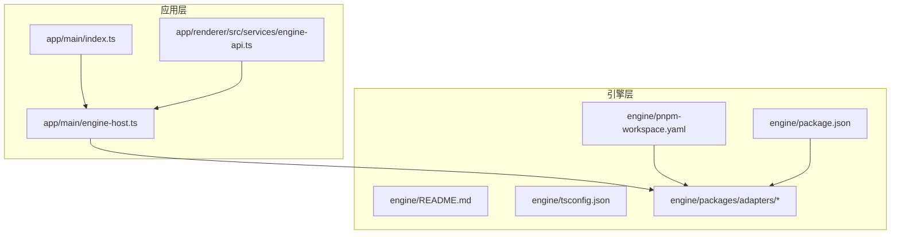
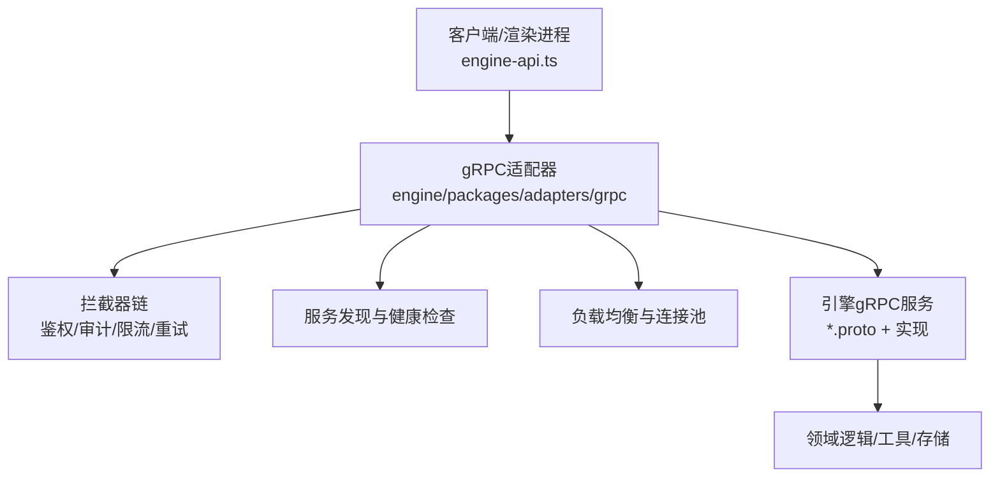
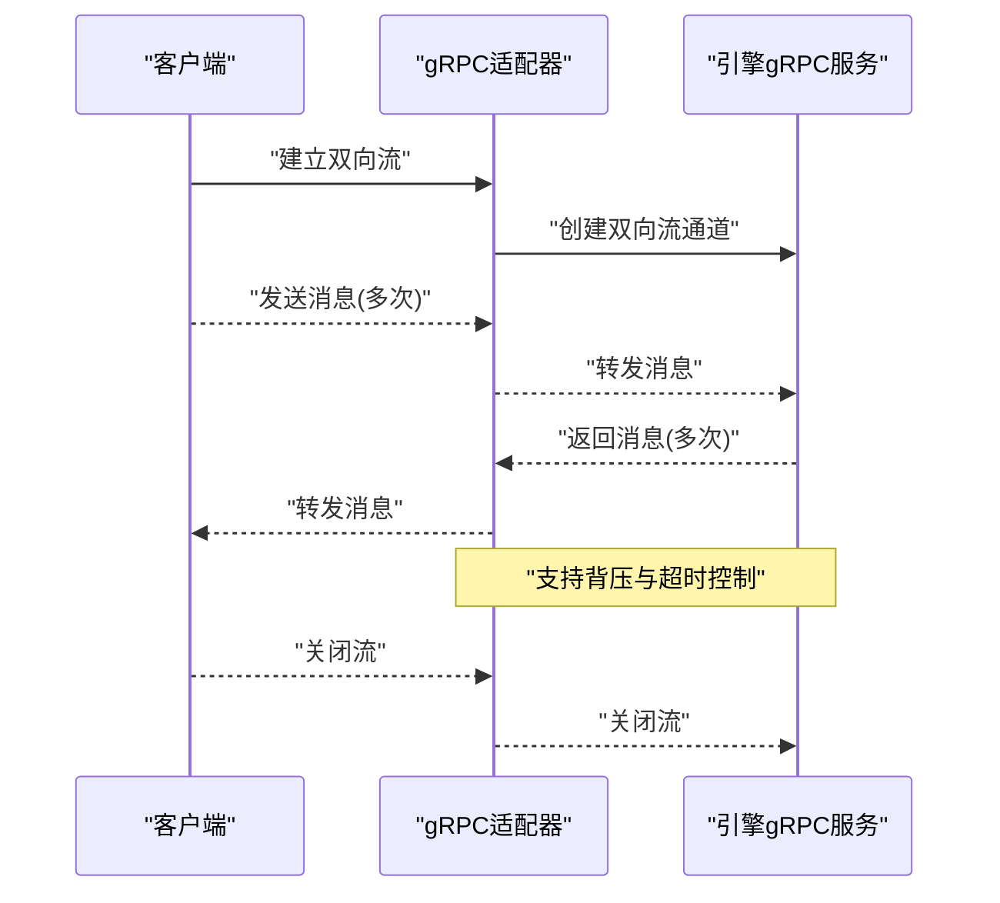
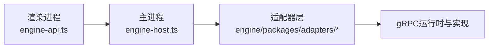

# gRPC适配器

<cite>
**本文引用的文件**   
- [engine/README.md](file://engine/README.md)
- [engine/package.json](file://engine/package.json)
- [engine/pnpm-workspace.yaml](file://engine/pnpm-workspace.yaml)
- [engine/tsconfig.json](file://engine/tsconfig.json)
- [app/main/index.ts](file://app/main/index.ts)
- [app/main/engine-host.ts](file://app/main/engine-host.ts)
- [app/renderer/src/services/engine-api.ts](file://app/renderer/src/services/engine-api.ts)
</cite>

## 目录
1. [简介](#简介)
2. [项目结构](#项目结构)
3. [核心组件](#核心组件)
4. [架构总览](#架构总览)
5. [详细组件分析](#详细组件分析)
6. [依赖关系分析](#依赖关系分析)
7. [性能考虑](#性能考虑)
8. [故障排查指南](#故障排查指南)
9. [结论](#结论)
10. [附录](#附录)

## 简介
本技术文档聚焦于KCoder的gRPC适配器，围绕以下目标展开：
- 解释gRPC服务定义（Protocol Buffers语法、消息类型、服务接口规范与版本管理策略）
- 说明服务实现架构（服务端点、流式处理、拦截器链、负载均衡）
- 介绍双向流式通信的使用场景与实现模式
- 阐述服务发现机制（注册、健康检查、故障转移、配置热更新）
- 提供性能优化技巧（连接复用、批量调用、超时控制、重试策略）
- 给出开发示例（如何新增gRPC服务与客户端调用）

需要特别说明的是：在当前仓库中未发现具体的gRPC协议定义文件（如.proto）或gRPC运行时代码。因此，本节与后续章节将基于仓库现有结构与工程化信息，结合通用gRPC最佳实践，给出适配层设计与落地建议，并在“详细组件分析”中以概念性图示呈现典型流程。

## 项目结构
仓库采用多包工作区组织，引擎端位于 engine/packages 下，应用端位于 app 目录。当前未包含gRPC相关的proto或服务实现文件，但可通过在 engine/packages/adapters 下引入gRPC适配器包来扩展能力。

图表来源
- [app/main/index.ts](file://app/main/index.ts)
- [app/main/engine-host.ts](file://app/main/engine-host.ts)
- [app/renderer/src/services/engine-api.ts](file://app/renderer/src/services/engine-api.ts)
- [engine/README.md](file://engine/README.md)
- [engine/package.json](file://engine/package.json)
- [engine/pnpm-workspace.yaml](file://engine/pnpm-workspace.yaml)
- [engine/tsconfig.json](file://engine/tsconfig.json)

章节来源
- [engine/README.md](file://engine/README.md)
- [engine/package.json](file://engine/package.json)
- [engine/pnpm-workspace.yaml](file://engine/pnpm-workspace.yaml)
- [engine/tsconfig.json](file://engine/tsconfig.json)
- [app/main/index.ts](file://app/main/index.ts)
- [app/main/engine-host.ts](file://app/main/engine-host.ts)
- [app/renderer/src/services/engine-api.ts](file://app/renderer/src/services/engine-api.ts)

## 核心组件
- 适配器定位：作为引擎对外暴露的统一通信边界，屏蔽底层传输细节（HTTP/gRPC等），向上提供稳定的API契约。
- 职责范围：
  - 协议适配：将上层请求转换为gRPC调用，或将gRPC响应映射为内部领域模型
  - 流式桥接：对客户端流、服务端流、双向流进行统一封装
  - 横切关注点：鉴权、审计、限流、重试、熔断、追踪、指标上报
  - 服务治理：注册、健康检查、故障转移、配置热更新
- 集成位置：
  - 应用侧通过渲染进程服务访问引擎能力
  - 主进程负责生命周期管理与跨进程通信
  - 引擎侧通过适配器包对外提供服务

章节来源
- [app/main/index.ts](file://app/main/index.ts)
- [app/main/engine-host.ts](file://app/main/engine-host.ts)
- [app/renderer/src/services/engine-api.ts](file://app/renderer/src/services/engine-api.ts)

## 架构总览
下图展示了一个典型的gRPC适配器分层架构：客户端通过适配器访问引擎提供的gRPC服务，适配器承担协议转换、拦截、治理与可观测性职责。

图表来源
- [app/renderer/src/services/engine-api.ts](file://app/renderer/src/services/engine-api.ts)
- [app/main/engine-host.ts](file://app/main/engine-host.ts)

## 详细组件分析

### Protocol Buffers与服务定义
- 设计原则
  - 语义稳定：字段使用数字编号，避免破坏性变更；新增字段默认兼容旧客户端
  - 明确版本：通过包名或消息前缀体现版本（例如 v1/v2），必要时保留废弃字段标记
  - 最小可用：仅暴露必要字段与方法，复杂聚合拆分为多个消息
- 常见约定
  - 命名：消息与字段使用小驼峰，枚举值使用大写下划线
  - 错误：统一错误码与错误消息结构，便于客户端解析
  - 时间与时区：使用RFC3339字符串或时间戳+时区元数据
- 版本管理策略
  - 向后兼容优先：新增可选字段、新增方法；删除字段需先标记废弃并保留一段时间
  - 并行演进：新版本以独立包或路径隔离，逐步迁移客户端
  - 兼容性测试：在CI中校验proto变更的兼容性

[本节为概念性说明，不直接分析具体源码文件]

### 服务实现架构
- 服务端点
  - 单轮调用：请求-响应模式，适合常规业务操作
  - 流式处理：
    - 客户端流：适用于分片上传、增量日志推送
    - 服务端流：适用于事件推送、进度流式返回
    - 双向流：适用于实时协作、交互式会话
- 拦截器链
  - 顺序：鉴权 -> 审计 -> 限流 -> 重试/熔断 -> 追踪 -> 业务处理
  - 异常：统一错误包装与状态码映射
- 负载均衡
  - 客户端侧选择：轮询/最少连接/一致性哈希
  - 连接复用：长连接池，按服务维度隔离
- 可观测性
  - 指标：QPS、延迟分布、错误率、连接数
  - 链路追踪：span上下文透传，关联上下游

[本节为概念性说明，不直接分析具体源码文件]

### 双向流式通信
- 使用场景
  - 实时协作编辑、增量同步
  - 任务进度与事件流
  - 交互式调试与遥测
- 实现模式
  - 客户端流：逐块发送，服务端累积后处理
  - 服务端流：服务端持续推送，客户端按需消费
  - 双向流：双方并发读写，注意背压与超时
- 错误与恢复
  - 断线重连、幂等键、去抖合并
  - 优雅关闭与资源释放

[此图为概念流程图，不直接映射到具体源码文件]

### 服务发现与治理
- 服务注册
  - 启动时向注册中心登记实例信息与元数据
  - 心跳保活，失败自动摘除
- 健康检查
  - 主动探测：周期性调用健康接口
  - 被动剔除：连续失败阈值触发下线
- 故障转移
  - 快速切换至备用实例
  - 局部降级与熔断保护
- 配置热更新
  - 监听配置变更，动态调整超时、重试、路由策略
  - 灰度发布与流量切分

[本节为概念性说明，不直接分析具体源码文件]

### 性能优化技巧
- 连接复用
  - 长连接池，按服务与租户维度隔离
  - 空闲回收与最大连接限制
- 批量调用
  - 聚合小请求，减少往返次数
  - 批大小与延迟容忍度的权衡
- 超时控制
  - 端到端超时、子调用超时分级
  - 合理设置读/写超时与KeepAlive
- 重试策略
  - 幂等方法可重试，非幂等方法禁止自动重试
  - 指数退避、抖动、预算上限与熔断联动

[本节为概念性说明，不直接分析具体源码文件]

### 开发示例：新增gRPC服务与客户端调用
- 步骤概览
  - 定义proto：声明包、消息、服务方法与流式语义
  - 生成代码：根据语言与框架生成客户端/服务端桩代码
  - 实现服务端：编写处理器逻辑，接入拦截器与可观测性
  - 实现客户端：构造连接、调用方法、处理流式响应
  - 集成适配器：将服务纳入适配器注册表，启用治理与监控
- 关键注意事项
  - 保持向后兼容，谨慎修改已有字段编号
  - 为流式方法设计合理的背压与超时
  - 为错误码与错误消息制定统一规范

[本节为概念性说明，不直接分析具体源码文件]

## 依赖关系分析
从现有工程结构看，应用层通过渲染进程服务与主进程交互，主进程再与引擎侧能力对接。gRPC适配器应置于引擎侧的适配器层，被主进程或引擎入口引用。

图表来源
- [app/renderer/src/services/engine-api.ts](file://app/renderer/src/services/engine-api.ts)
- [app/main/engine-host.ts](file://app/main/engine-host.ts)

章节来源
- [app/renderer/src/services/engine-api.ts](file://app/renderer/src/services/engine-api.ts)
- [app/main/engine-host.ts](file://app/main/engine-host.ts)

## 性能考虑
- 连接与并发
  - 合理设置并发度与队列长度，避免内存膨胀
  - 使用零拷贝序列化与压缩（如gzip/snappy）
- 流式优化
  - 控制消息粒度，避免过大消息导致阻塞
  - 使用背压信号协调生产与消费速率
- 资源管理
  - 严格释放流与连接，防止泄漏
  - 监控GC与CPU占用，识别热点路径

[本节为概念性说明，不直接分析具体源码文件]

## 故障排查指南
- 常见问题
  - 连接失败：检查网络可达、端口与证书配置
  - 超时频繁：评估后端处理能力与网络质量，调整超时与重试
  - 流中断：确认服务端是否主动关闭、客户端是否正确消费
- 诊断手段
  - 开启详细日志与链路追踪
  - 采集关键指标（延迟、错误率、连接数）
  - 回放问题场景，复现并定位根因
- 恢复策略
  - 快速回滚与降级
  - 隔离故障实例，逐步恢复流量

[本节为概念性说明，不直接分析具体源码文件]

## 结论
尽管当前仓库未包含gRPC相关的具体实现与协议定义，但通过在引擎适配器层引入gRPC适配器，可以构建高内聚、低耦合的服务边界。遵循Proto版本管理、流式通信模式、拦截器链与服务治理的最佳实践，能够显著提升系统的稳定性、可观测性与可扩展性。建议在后续迭代中逐步落地proto定义、服务端实现与客户端集成，并完善监控与告警体系。

[本节为总结性内容，不直接分析具体源码文件]

## 附录
- 参考文件
  - 引擎说明与工作区配置：[engine/README.md](file://engine/README.md)、[engine/pnpm-workspace.yaml](file://engine/pnpm-workspace.yaml)
  - 工程配置：[engine/package.json](file://engine/package.json)、[engine/tsconfig.json](file://engine/tsconfig.json)
  - 应用入口与引擎宿主：[app/main/index.ts](file://app/main/index.ts)、[app/main/engine-host.ts](file://app/main/engine-host.ts)
  - 渲染进程服务：[app/renderer/src/services/engine-api.ts](file://app/renderer/src/services/engine-api.ts)