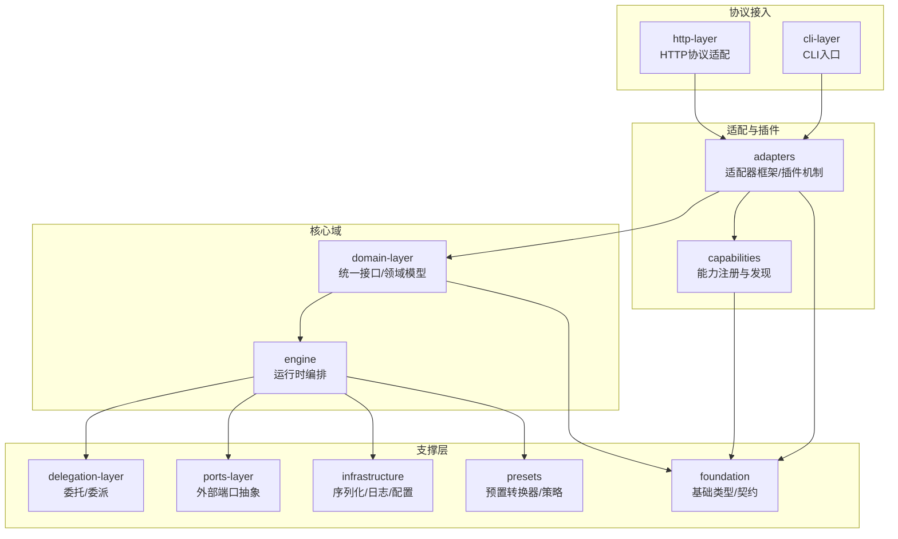
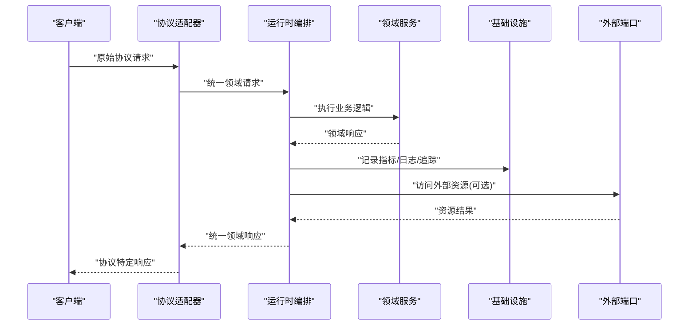
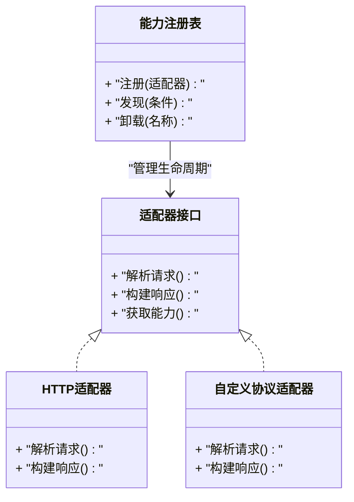
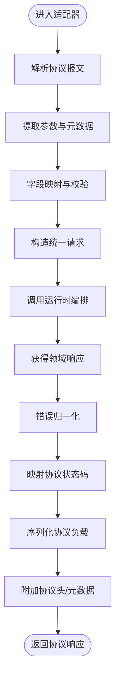
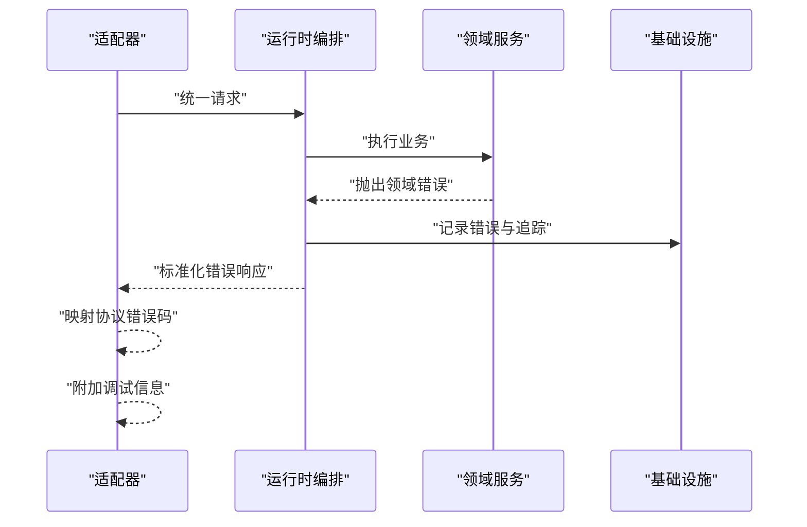
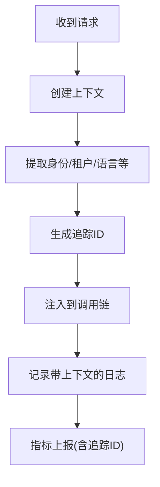
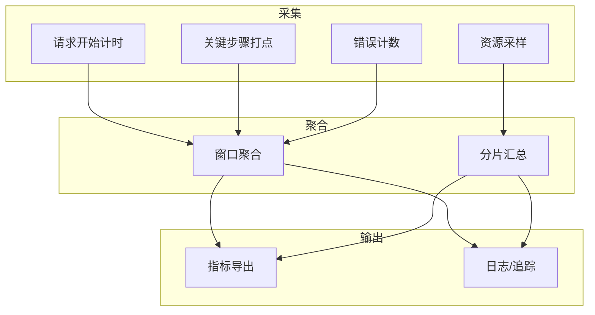
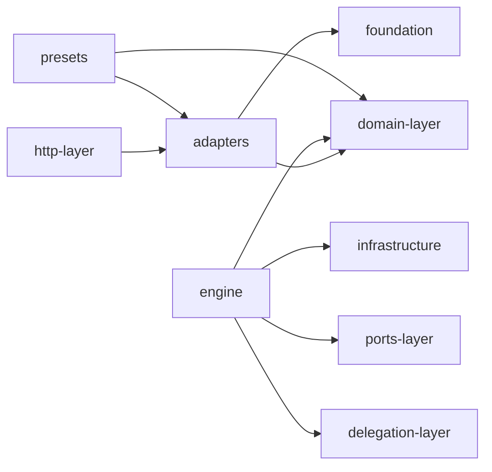

# 协议转换层

<cite>
**本文引用的文件**   
- [engine/README.md](file://engine/README.md)
- [engine/package.json](file://engine/package.json)
- [engine/pnpm-workspace.yaml](file://engine/pnpm-workspace.yaml)
- [engine/packages/http-layer/src/index.ts](file://engine/packages/http-layer/src/index.ts)
- [engine/packages/adapters/src/index.ts](file://engine/packages/adapters/src/index.ts)
- [engine/packages/domain-layer/src/index.ts](file://engine/packages/domain-layer/src/index.ts)
- [engine/packages/foundation/src/index.ts](file://engine/packages/foundation/src/index.ts)
- [engine/packages/engine/src/index.ts](file://engine/packages/engine/src/index.ts)
- [engine/packages/capabilities/src/index.ts](file://engine/packages/capabilities/src/index.ts)
- [engine/packages/delegation-layer/src/index.ts](file://engine/packages/delegation-layer/src/index.ts)
- [engine/packages/cli-layer/src/index.ts](file://engine/packages/cli-layer/src/index.ts)
- [engine/packages/ports-layer/src/index.ts](file://engine/packages/ports-layer/src/index.ts)
- [engine/packages/infrastructure/src/index.ts](file://engine/packages/infrastructure/src/index.ts)
- [engine/packages/presets/src/index.ts](file://engine/packages/presets/src/index.ts)
</cite>

## 目录
1. [简介](#简介)
2. [项目结构](#项目结构)
3. [核心组件](#核心组件)
4. [架构总览](#架构总览)
5. [详细组件分析](#详细组件分析)
6. [依赖关系分析](#依赖关系分析)
7. [性能考虑](#性能考虑)
8. [故障排查指南](#故障排查指南)
9. [结论](#结论)
10. [附录](#附录)

## 简介
本文件聚焦于KCoder引擎的“协议转换层”，围绕多协议适配、统一接口抽象、插件化与动态加载、请求响应转换、错误处理统一化、上下文传播、以及可观测性与统计等主题，提供系统化技术文档。目标读者既包括需要快速上手的集成者，也包括希望深入定制与扩展的高级用户。

## 项目结构
KCoder采用多包工作区组织，协议转换相关能力分布在多个子包中：
- http-layer：HTTP协议接入与适配
- adapters：通用适配器框架与协议插件机制
- domain-layer：领域模型与统一接口抽象
- foundation：基础类型、工具与公共契约
- engine：运行时编排与调度
- capabilities：能力注册与发现
- delegation-layer：委托与委派（用于跨协议调用）
- cli-layer：命令行入口（可用于本地调试与演示）
- ports-layer：外部端口抽象（如存储、网络、消息总线）
- infrastructure：基础设施实现（序列化、日志、配置等）
- presets：预置转换器与策略

图表来源
- [engine/packages/http-layer/src/index.ts](file://engine/packages/http-layer/src/index.ts)
- [engine/packages/adapters/src/index.ts](file://engine/packages/adapters/src/index.ts)
- [engine/packages/domain-layer/src/index.ts](file://engine/packages/domain-layer/src/index.ts)
- [engine/packages/foundation/src/index.ts](file://engine/packages/foundation/src/index.ts)
- [engine/packages/engine/src/index.ts](file://engine/packages/engine/src/index.ts)
- [engine/packages/capabilities/src/index.ts](file://engine/packages/capabilities/src/index.ts)
- [engine/packages/delegation-layer/src/index.ts](file://engine/packages/delegation-layer/src/index.ts)
- [engine/packages/cli-layer/src/index.ts](file://engine/packages/cli-layer/src/index.ts)
- [engine/packages/ports-layer/src/index.ts](file://engine/packages/ports-layer/src/index.ts)
- [engine/packages/infrastructure/src/index.ts](file://engine/packages/infrastructure/src/index.ts)
- [engine/packages/presets/src/index.ts](file://engine/packages/presets/src/index.ts)

章节来源
- [engine/README.md](file://engine/README.md)
- [engine/package.json](file://engine/package.json)
- [engine/pnpm-workspace.yaml](file://engine/pnpm-workspace.yaml)

## 核心组件
- 统一接口抽象（domain-layer）
  - 定义跨协议的统一请求/响应模型与操作语义，屏蔽底层协议差异。
  - 为上层业务与下层协议提供稳定契约，便于替换与扩展。
- 协议适配器与插件（adapters + capabilities）
  - 通过适配器将具体协议（如HTTP、事件流、RPC等）映射到统一接口。
  - 基于能力注册表进行插件发现与生命周期管理，支持热插拔与按需启用。
- 运行时编排（engine）
  - 负责请求路由、中间件链、上下文注入、错误收敛与结果包装。
  - 协调委托层与端口层，完成跨协议调用与资源访问。
- 基础设施（infrastructure + foundation）
  - 提供序列化、日志、追踪ID生成、配置读取等基础能力。
  - 标准化错误码与异常类型，确保跨层一致的错误语义。
- 预置转换器（presets）
  - 内置常用协议间的数据格式转换规则与参数绑定策略，开箱即用。

章节来源
- [engine/packages/domain-layer/src/index.ts](file://engine/packages/domain-layer/src/index.ts)
- [engine/packages/adapters/src/index.ts](file://engine/packages/adapters/src/index.ts)
- [engine/packages/capabilities/src/index.ts](file://engine/packages/capabilities/src/index.ts)
- [engine/packages/engine/src/index.ts](file://engine/packages/engine/src/index.ts)
- [engine/packages/infrastructure/src/index.ts](file://engine/packages/infrastructure/src/index.ts)
- [engine/packages/foundation/src/index.ts](file://engine/packages/foundation/src/index.ts)
- [engine/packages/presets/src/index.ts](file://engine/packages/presets/src/index.ts)

## 架构总览
协议转换层位于“接入层”和“核心域”之间，承担以下职责：
- 将不同协议的消息转换为统一的领域请求对象
- 在返回前将领域响应对象转换为协议特定的响应格式
- 贯穿式地维护请求上下文（身份、追踪ID、租户等）
- 统一错误语义并保留必要调试信息
- 暴露可观测性指标（耗时、吞吐、错误率、资源使用）

图表来源
- [engine/packages/adapters/src/index.ts](file://engine/packages/adapters/src/index.ts)
- [engine/packages/engine/src/index.ts](file://engine/packages/engine/src/index.ts)
- [engine/packages/domain-layer/src/index.ts](file://engine/packages/domain-layer/src/index.ts)
- [engine/packages/infrastructure/src/index.ts](file://engine/packages/infrastructure/src/index.ts)
- [engine/packages/ports-layer/src/index.ts](file://engine/packages/ports-layer/src/index.ts)

## 详细组件分析

### 统一接口抽象（领域模型）
- 设计要点
  - 以领域为中心定义请求/响应结构，避免直接暴露协议细节。
  - 对字段进行最小必要约束，允许协议层做额外校验与映射。
  - 为后续错误与上下文扩展预留扩展点。
- 典型职责
  - 定义统一的操作名、输入输出模式、元数据承载体。
  - 提供与协议无关的验证与序列化契约。

章节来源
- [engine/packages/domain-layer/src/index.ts](file://engine/packages/domain-layer/src/index.ts)
- [engine/packages/foundation/src/index.ts](file://engine/packages/foundation/src/index.ts)

### 协议适配器与插件机制
- 适配器职责
  - 解析协议报文，提取参数并构造统一领域请求。
  - 接收领域响应后，按协议规范封装响应头、状态码与负载。
- 插件机制
  - 通过能力注册表声明适配器能力，支持条件启用与版本兼容。
  - 支持动态加载：启动时扫描、或运行期根据配置/事件加载。
- 动态加载策略
  - 基于能力清单与依赖图进行拓扑排序加载。
  - 失败回退：单个适配器加载失败不影响其他适配器可用。

图表来源
- [engine/packages/adapters/src/index.ts](file://engine/packages/adapters/src/index.ts)
- [engine/packages/capabilities/src/index.ts](file://engine/packages/capabilities/src/index.ts)
- [engine/packages/http-layer/src/index.ts](file://engine/packages/http-layer/src/index.ts)

章节来源
- [engine/packages/adapters/src/index.ts](file://engine/packages/adapters/src/index.ts)
- [engine/packages/capabilities/src/index.ts](file://engine/packages/capabilities/src/index.ts)
- [engine/packages/http-layer/src/index.ts](file://engine/packages/http-layer/src/index.ts)

### 请求响应转换流程
- 入站转换
  - 协议报文 -> 参数提取 -> 字段映射 -> 校验 -> 构造统一请求
- 出站转换
  - 领域响应 -> 错误归一化 -> 协议状态码映射 -> 负载序列化 -> 附加协议头
- 参数绑定与结果包装
  - 支持路径、查询、头部、载荷等多源参数合并。
  - 结果包装包含标准元数据（追踪ID、耗时、幂等键等）。

图表来源
- [engine/packages/adapters/src/index.ts](file://engine/packages/adapters/src/index.ts)
- [engine/packages/engine/src/index.ts](file://engine/packages/engine/src/index.ts)
- [engine/packages/infrastructure/src/index.ts](file://engine/packages/infrastructure/src/index.ts)

章节来源
- [engine/packages/adapters/src/index.ts](file://engine/packages/adapters/src/index.ts)
- [engine/packages/engine/src/index.ts](file://engine/packages/engine/src/index.ts)
- [engine/packages/infrastructure/src/index.ts](file://engine/packages/infrastructure/src/index.ts)

### 错误处理统一化
- 错误码映射
  - 领域错误 -> 标准错误码 -> 协议错误码（如HTTP状态码）
- 异常转换
  - 捕获底层异常，转换为领域错误，避免泄漏实现细节。
- 错误信息标准化
  - 统一错误结构，包含code、message、traceId、details等。
- 调试信息保留
  - 在受控范围内保留堆栈、关联ID、诊断标签，便于排障。

图表来源
- [engine/packages/engine/src/index.ts](file://engine/packages/engine/src/index.ts)
- [engine/packages/infrastructure/src/index.ts](file://engine/packages/infrastructure/src/index.ts)

章节来源
- [engine/packages/engine/src/index.ts](file://engine/packages/engine/src/index.ts)
- [engine/packages/infrastructure/src/index.ts](file://engine/packages/infrastructure/src/index.ts)

### 上下文传递机制
- 请求上下文传播
  - 在适配器入口处创建上下文，贯穿整个调用链。
- 用户身份传递
  - 从认证头/令牌中提取身份，注入到领域层。
- 追踪ID生成
  - 为每个请求生成唯一追踪ID，贯穿日志与指标。
- 日志关联
  - 所有日志与指标附带追踪ID，便于端到端定位问题。

图表来源
- [engine/packages/infrastructure/src/index.ts](file://engine/packages/infrastructure/src/index.ts)
- [engine/packages/engine/src/index.ts](file://engine/packages/engine/src/index.ts)

章节来源
- [engine/packages/infrastructure/src/index.ts](file://engine/packages/infrastructure/src/index.ts)
- [engine/packages/engine/src/index.ts](file://engine/packages/engine/src/index.ts)

### 性能监控与统计
- 指标维度
  - 请求耗时（P50/P95/P99）、吞吐量（QPS）、错误率、重试次数、超时率。
- 资源使用跟踪
  - CPU/内存占用、GC停顿、外部IO延迟。
- 采样与降采样
  - 高流量场景下采用分层采样策略，平衡精度与开销。
- 可视化与告警
  - 指标导出至监控系统，结合阈值触发告警。

图表来源
- [engine/packages/infrastructure/src/index.ts](file://engine/packages/infrastructure/src/index.ts)
- [engine/packages/engine/src/index.ts](file://engine/packages/engine/src/index.ts)

章节来源
- [engine/packages/infrastructure/src/index.ts](file://engine/packages/infrastructure/src/index.ts)
- [engine/packages/engine/src/index.ts](file://engine/packages/engine/src/index.ts)

### 转换规则配置示例（说明性）
以下为配置项的结构化说明，用于指导如何编写与加载转换规则（不展示具体代码内容）：
- 全局开关
  - 启用/禁用某类协议转换
  - 默认错误策略（静默/抛错/降级）
- 协议级配置
  - 协议标识、版本、优先级
  - 参数来源顺序（路径 > 查询 > 头部 > 载荷）
  - 响应包装策略（是否包含元数据、是否压缩）
- 字段映射规则
  - 源字段 -> 目标字段
  - 类型转换函数引用
  - 缺失值默认策略
- 错误映射表
  - 领域错误码 -> 协议错误码
  - 异常类型 -> 错误类别
- 上下文注入规则
  - 身份来源（Header/Token/网关透传）
  - 追踪ID注入位置
  - 租户/环境隔离键

章节来源
- [engine/packages/presets/src/index.ts](file://engine/packages/presets/src/index.ts)
- [engine/packages/adapters/src/index.ts](file://engine/packages/adapters/src/index.ts)

### 自定义转换器开发指南（说明性）
- 开发步骤
  - 实现适配器接口：定义解析与构建方法
  - 注册能力：声明协议标识、版本、依赖
  - 编写转换规则：字段映射、类型转换、错误映射
  - 单元测试：覆盖边界与异常路径
- 最佳实践
  - 保持无副作用的纯转换逻辑
  - 明确错误语义，避免吞异常
  - 控制日志粒度，避免泄露敏感信息
  - 为高频路径添加性能基准测试
- 发布与加载
  - 打包为独立模块，遵循能力清单约定
  - 通过配置或事件驱动动态加载
  - 灰度发布与回滚策略

章节来源
- [engine/packages/adapters/src/index.ts](file://engine/packages/adapters/src/index.ts)
- [engine/packages/capabilities/src/index.ts](file://engine/packages/capabilities/src/index.ts)
- [engine/packages/presets/src/index.ts](file://engine/packages/presets/src/index.ts)

## 依赖关系分析
- 耦合与内聚
  - 适配器与领域层解耦，通过统一接口通信，提升内聚性。
  - 基础设施被广泛复用，需保证稳定性与向后兼容。
- 直接/间接依赖
  - http-layer 依赖 adapters 与 infrastructure
  - engine 依赖 domain-layer、infrastructure、ports-layer、delegation-layer
- 循环依赖检查
  - 通过分层与接口隔离避免环依赖
- 外部依赖与集成点
  - 序列化库、日志系统、指标导出器、配置中心

图表来源
- [engine/packages/http-layer/src/index.ts](file://engine/packages/http-layer/src/index.ts)
- [engine/packages/adapters/src/index.ts](file://engine/packages/adapters/src/index.ts)
- [engine/packages/domain-layer/src/index.ts](file://engine/packages/domain-layer/src/index.ts)
- [engine/packages/foundation/src/index.ts](file://engine/packages/foundation/src/index.ts)
- [engine/packages/engine/src/index.ts](file://engine/packages/engine/src/index.ts)
- [engine/packages/infrastructure/src/index.ts](file://engine/packages/infrastructure/src/index.ts)
- [engine/packages/ports-layer/src/index.ts](file://engine/packages/ports-layer/src/index.ts)
- [engine/packages/delegation-layer/src/index.ts](file://engine/packages/delegation-layer/src/index.ts)
- [engine/packages/presets/src/index.ts](file://engine/packages/presets/src/index.ts)

章节来源
- [engine/packages/http-layer/src/index.ts](file://engine/packages/http-layer/src/index.ts)
- [engine/packages/adapters/src/index.ts](file://engine/packages/adapters/src/index.ts)
- [engine/packages/domain-layer/src/index.ts](file://engine/packages/domain-layer/src/index.ts)
- [engine/packages/foundation/src/index.ts](file://engine/packages/foundation/src/index.ts)
- [engine/packages/engine/src/index.ts](file://engine/packages/engine/src/index.ts)
- [engine/packages/infrastructure/src/index.ts](file://engine/packages/infrastructure/src/index.ts)
- [engine/packages/ports-layer/src/index.ts](file://engine/packages/ports-layer/src/index.ts)
- [engine/packages/delegation-layer/src/index.ts](file://engine/packages/delegation-layer/src/index.ts)
- [engine/packages/presets/src/index.ts](file://engine/packages/presets/src/index.ts)

## 性能考虑
- 减少不必要的拷贝与序列化
- 批量处理与流水线并行
- 连接池与超时控制
- 缓存热点数据与只读配置
- 合理采样与异步上报指标

[本节为通用性能建议，无需源码引用]

## 故障排查指南
- 常见问题
  - 字段映射缺失导致参数绑定失败
  - 错误码未正确映射导致前端无法识别
  - 追踪ID未注入导致日志断链
- 定位步骤
  - 查看请求链路日志（含追踪ID）
  - 核对适配器能力清单与版本兼容性
  - 检查转换规则配置与默认值策略
- 恢复策略
  - 启用降级模式（返回最小可用响应）
  - 切换备用适配器或关闭非关键能力
  - 扩大采样范围收集更多诊断信息

章节来源
- [engine/packages/adapters/src/index.ts](file://engine/packages/adapters/src/index.ts)
- [engine/packages/infrastructure/src/index.ts](file://engine/packages/infrastructure/src/index.ts)
- [engine/packages/engine/src/index.ts](file://engine/packages/engine/src/index.ts)

## 结论
协议转换层通过统一接口抽象、适配器与插件机制、严格的错误与上下文治理，以及完善的可观测性，实现了多协议的高效接入与灵活扩展。借助预置转换器与清晰的自定义开发指南，团队可以快速落地新协议接入并保持系统一致性。

[本节为总结性内容，无需源码引用]

## 附录
- 术语
  - 适配器：将协议特定请求/响应转换为统一领域模型的组件
  - 能力：适配器对外声明的功能特性与版本信息
  - 追踪ID：贯穿一次请求的全局唯一标识
- 参考
  - 工作区与包清单见根配置与工作区文件

章节来源
- [engine/package.json](file://engine/package.json)
- [engine/pnpm-workspace.yaml](file://engine/pnpm-workspace.yaml)