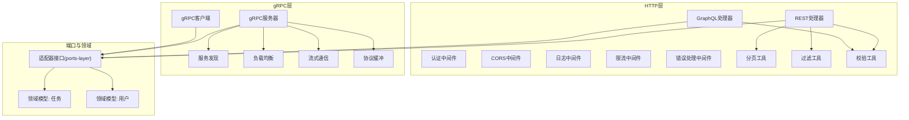
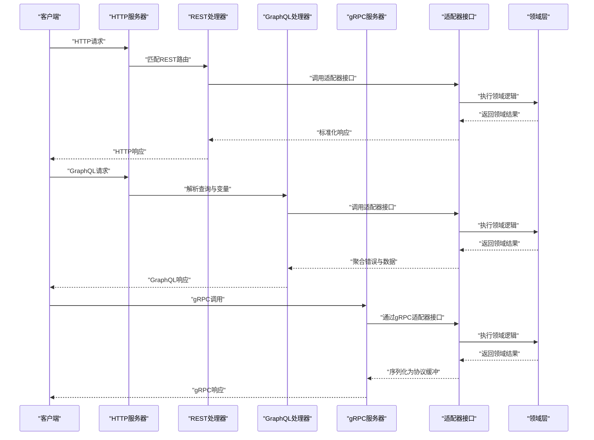
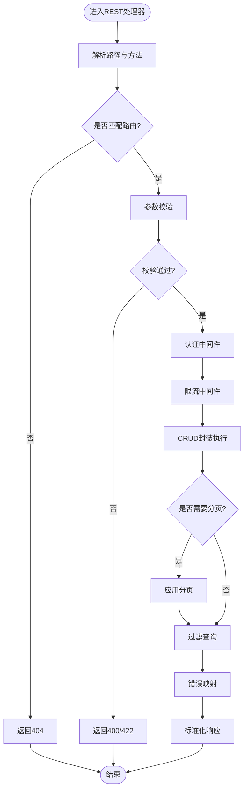
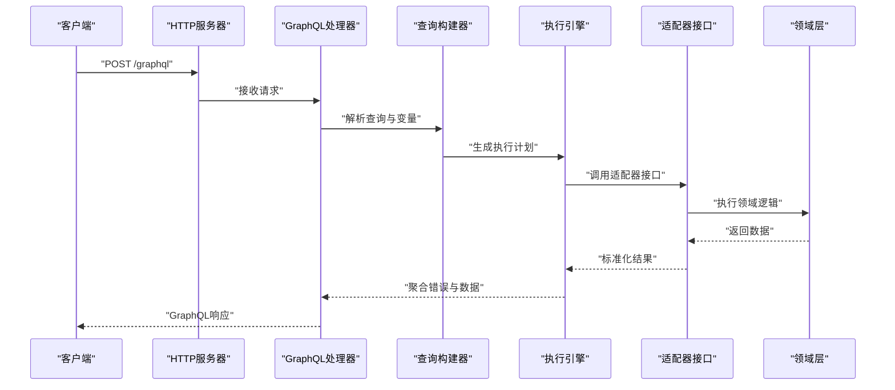
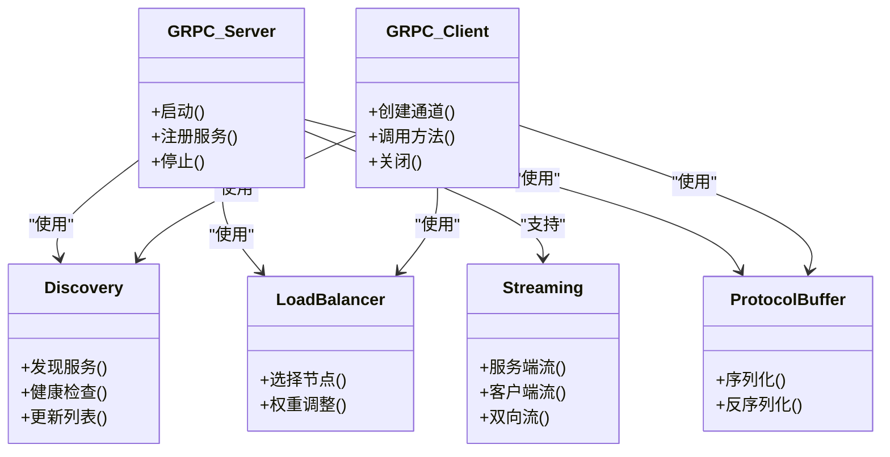
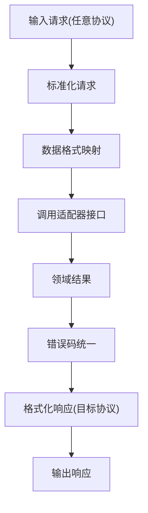
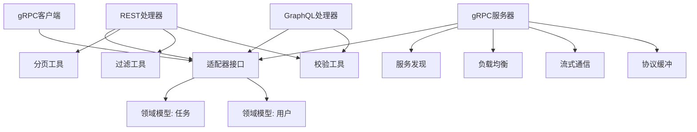

# 协议适配器

<cite>
**本文引用的文件**   
- [engine/packages/adapters/README.md](file://engine/packages/adapters/README.md)
- [engine/packages/http-layer/src/server.ts](file://engine/packages/http-layer/src/server.ts)
- [engine/packages/http-layer/src/handlers/rest.ts](file://engine/packages/http-layer/src/handlers/rest.ts)
- [engine/packages/http-layer/src/handlers/graphql.ts](file://engine/packages/http-layer/src/handlers/graphql.ts)
- [engine/packages/http-layer/src/middleware/auth.ts](file://engine/packages/http-layer/src/middleware/auth.ts)
- [engine/packages/http-layer/src/middleware/cors.ts](file://engine/packages/http-layer/src/middleware/cors.ts)
- [engine/packages/http-layer/src/middleware/logging.ts](file://engine/packages/http-layer/src/middleware/logging.ts)
- [engine/packages/http-layer/src/middleware/rate-limit.ts](file://engine/packages/http-layer/src/middleware/rate-limit.ts)
- [engine/packages/http-layer/src/middleware/error-handler.ts](file://engine/packages/http-layer/src/middleware/error-handler.ts)
- [engine/packages/http-layer/src/utils/pagination.ts](file://engine/packages/http-layer/src/utils/pagination.ts)
- [engine/packages/http-layer/src/utils/filter.ts](file://engine/packages/http-layer/src/utils/filter.ts)
- [engine/packages/http-layer/src/utils/validation.ts](file://engine/packages/http-layer/src/utils/validation.ts)
- [engine/packages/grpc-layer/src/server.ts](file://engine/packages/grpc-layer/src/server.ts)
- [engine/packages/grpc-layer/src/client.ts](file://engine/packages/grpc-layer/src/client.ts)
- [engine/packages/grpc-layer/src/discovery.ts](file://engine/packages/grpc-layer/src/discovery.ts)
- [engine/packages/grpc-layer/src/load-balancer.ts](file://engine/packages/grpc-layer/src/load-balancer.ts)
- [engine/packages/grpc-layer/src/streaming.ts](file://engine/packages/grpc-layer/src/streaming.ts)
- [engine/packages/grpc-layer/src/protocol-buffer.ts](file://engine/packages/grpc-layer/src/protocol-buffer.ts)
- [engine/packages/ports-layer/src/adapter-interface.ts](file://engine/packages/ports-layer/src/adapter-interface.ts)
- [engine/packages/domain-layer/src/models/task.ts](file://engine/packages/domain-layer/src/models/task.ts)
- [engine/packages/domain-layer/src/models/user.ts](file://engine/packages/domain-layer/src/models/user.ts)
- [engine/packages/foundation/src/errors.ts](file://engine/packages/foundation/src/errors.ts)
- [engine/packages/foundation/src/config.ts](file://engine/packages/foundation/src/config.ts)
</cite>

## 目录
1. [简介](#简介)
2. [项目结构](#项目结构)
3. [核心组件](#核心组件)
4. [架构总览](#架构总览)
5. [详细组件分析](#详细组件分析)
6. [依赖分析](#依赖分析)
7. [性能考虑](#性能考虑)
8. [故障排查指南](#故障排查指南)
9. [结论](#结论)
10. [附录](#附录)

## 简介
本技术文档聚焦于KCoder的协议适配器层，覆盖REST、GraphQL与gRPC三大适配器的实现与设计。文档从系统架构出发，逐步深入到资源路由、CRUD封装、分页与过滤、查询构建、变量处理、订阅支持、服务发现、负载均衡、流式通信、协议缓冲、协议转换、版本管理策略以及性能优化技巧，并提供集成示例与最佳实践建议，帮助读者快速理解并高效使用协议适配器。

## 项目结构
协议适配器位于engine/packages下的多个子包中：
- http-layer：提供HTTP/HTTPS传输能力，包含REST与GraphQL处理器、中间件、工具函数等
- grpc-layer：提供gRPC传输能力，包含服务端、客户端、服务发现、负载均衡、流式通信与协议缓冲
- ports-layer：定义跨协议的统一适配器接口契约
- domain-layer：领域模型（如任务、用户）
- foundation：通用错误、配置等基础能力

图表来源
- [engine/packages/http-layer/src/handlers/rest.ts](file://engine/packages/http-layer/src/handlers/rest.ts)
- [engine/packages/http-layer/src/handlers/graphql.ts](file://engine/packages/http-layer/src/handlers/graphql.ts)
- [engine/packages/http-layer/src/middleware/auth.ts](file://engine/packages/http-layer/src/middleware/auth.ts)
- [engine/packages/http-layer/src/middleware/cors.ts](file://engine/packages/http-layer/src/middleware/cors.ts)
- [engine/packages/http-layer/src/middleware/logging.ts](file://engine/packages/http-layer/src/middleware/logging.ts)
- [engine/packages/http-layer/src/middleware/rate-limit.ts](file://engine/packages/http-layer/src/middleware/rate-limit.ts)
- [engine/packages/http-layer/src/middleware/error-handler.ts](file://engine/packages/http-layer/src/middleware/error-handler.ts)
- [engine/packages/http-layer/src/utils/pagination.ts](file://engine/packages/http-layer/src/utils/pagination.ts)
- [engine/packages/http-layer/src/utils/filter.ts](file://engine/packages/http-layer/src/utils/filter.ts)
- [engine/packages/http-layer/src/utils/validation.ts](file://engine/packages/http-layer/src/utils/validation.ts)
- [engine/packages/grpc-layer/src/server.ts](file://engine/packages/grpc-layer/src/server.ts)
- [engine/packages/grpc-layer/src/client.ts](file://engine/packages/grpc-layer/src/client.ts)
- [engine/packages/grpc-layer/src/discovery.ts](file://engine/packages/grpc-layer/src/discovery.ts)
- [engine/packages/grpc-layer/src/load-balancer.ts](file://engine/packages/grpc-layer/src/load-balancer.ts)
- [engine/packages/grpc-layer/src/streaming.ts](file://engine/packages/grpc-layer/src/streaming.ts)
- [engine/packages/grpc-layer/src/protocol-buffer.ts](file://engine/packages/grpc-layer/src/protocol-buffer.ts)
- [engine/packages/ports-layer/src/adapter-interface.ts](file://engine/packages/ports-layer/src/adapter-interface.ts)
- [engine/packages/domain-layer/src/models/task.ts](file://engine/packages/domain-layer/src/models/task.ts)
- [engine/packages/domain-layer/src/models/user.ts](file://engine/packages/domain-layer/src/models/user.ts)

章节来源
- [engine/packages/adapters/README.md](file://engine/packages/adapters/README.md)

## 核心组件
- REST适配器：负责HTTP资源路由、请求解析、CRUD操作封装、分页与过滤、参数校验、错误映射与响应标准化
- GraphQL适配器：负责查询构建、变量处理、订阅支持、错误聚合、字段选择与嵌套解析
- gRPC适配器：负责服务发现、负载均衡、双向流式通信、协议缓冲序列化与反序列化
- 适配器接口：定义跨协议统一的调用契约，屏蔽底层协议差异
- 领域模型：为各协议提供一致的实体结构与约束

章节来源
- [engine/packages/ports-layer/src/adapter-interface.ts](file://engine/packages/ports-layer/src/adapter-interface.ts)
- [engine/packages/domain-layer/src/models/task.ts](file://engine/packages/domain-layer/src/models/task.ts)
- [engine/packages/domain-layer/src/models/user.ts](file://engine/packages/domain-layer/src/models/user.ts)

## 架构总览
协议适配器作为KCoder对外暴露的统一入口，将不同协议（REST、GraphQL、gRPC）的请求转换为内部适配器接口的调用，再交由领域层处理，最终按协议规范返回结果。

图表来源
- [engine/packages/http-layer/src/server.ts](file://engine/packages/http-layer/src/server.ts)
- [engine/packages/http-layer/src/handlers/rest.ts](file://engine/packages/http-layer/src/handlers/rest.ts)
- [engine/packages/http-layer/src/handlers/graphql.ts](file://engine/packages/http-layer/src/handlers/graphql.ts)
- [engine/packages/grpc-layer/src/server.ts](file://engine/packages/grpc-layer/src/server.ts)
- [engine/packages/ports-layer/src/adapter-interface.ts](file://engine/packages/ports-layer/src/adapter-interface.ts)
- [engine/packages/domain-layer/src/models/task.ts](file://engine/packages/domain-layer/src/models/task.ts)

## 详细组件分析

### REST适配器
REST适配器提供资源路由与CRUD操作封装，支持分页与过滤查询，并通过中间件完成鉴权、CORS、日志、限流与错误处理。

- 资源路由与CRUD封装
  - 基于路径与方法映射到具体处理器
  - 对常见CRUD操作进行统一封装，减少重复代码
  - 请求体与路径参数解析、类型校验
- 分页处理
  - 支持页码与每页大小参数
  - 计算偏移量与总数，返回分页元信息
- 过滤查询
  - 支持多条件组合过滤
  - 动态构建查询谓词
- 中间件链
  - 认证、CORS、日志、限流、错误处理
- 错误映射
  - 将领域错误映射为标准HTTP状态码与错误结构

图表来源
- [engine/packages/http-layer/src/handlers/rest.ts](file://engine/packages/http-layer/src/handlers/rest.ts)
- [engine/packages/http-layer/src/middleware/auth.ts](file://engine/packages/http-layer/src/middleware/auth.ts)
- [engine/packages/http-layer/src/middleware/rate-limit.ts](file://engine/packages/http-layer/src/middleware/rate-limit.ts)
- [engine/packages/http-layer/src/utils/pagination.ts](file://engine/packages/http-layer/src/utils/pagination.ts)
- [engine/packages/http-layer/src/utils/filter.ts](file://engine/packages/http-layer/src/utils/filter.ts)
- [engine/packages/http-layer/src/utils/validation.ts](file://engine/packages/http-layer/src/utils/validation.ts)
- [engine/packages/http-layer/src/middleware/error-handler.ts](file://engine/packages/http-layer/src/middleware/error-handler.ts)

章节来源
- [engine/packages/http-layer/src/handlers/rest.ts](file://engine/packages/http-layer/src/handlers/rest.ts)
- [engine/packages/http-layer/src/middleware/auth.ts](file://engine/packages/http-layer/src/middleware/auth.ts)
- [engine/packages/http-layer/src/middleware/cors.ts](file://engine/packages/http-layer/src/middleware/cors.ts)
- [engine/packages/http-layer/src/middleware/logging.ts](file://engine/packages/http-layer/src/middleware/logging.ts)
- [engine/packages/http-layer/src/middleware/rate-limit.ts](file://engine/packages/http-layer/src/middleware/rate-limit.ts)
- [engine/packages/http-layer/src/middleware/error-handler.ts](file://engine/packages/http-layer/src/middleware/error-handler.ts)
- [engine/packages/http-layer/src/utils/pagination.ts](file://engine/packages/http-layer/src/utils/pagination.ts)
- [engine/packages/http-layer/src/utils/filter.ts](file://engine/packages/http-layer/src/utils/filter.ts)
- [engine/packages/http-layer/src/utils/validation.ts](file://engine/packages/http-layer/src/utils/validation.ts)

### GraphQL适配器
GraphQL适配器负责查询构建、变量处理、订阅支持与错误聚合，确保复杂查询的高效与一致性。

- 查询构建
  - 解析查询AST，生成内部查询计划
  - 支持嵌套字段与别名
- 变量处理
  - 类型安全变量绑定与默认值
  - 变量校验与缺失提示
- 订阅支持
  - 基于WebSocket或SSE的实时推送
  - 事件源与订阅生命周期管理
- 错误聚合
  - 合并多个字段错误为统一结构
  - 区分部分成功与完全失败场景

图表来源
- [engine/packages/http-layer/src/handlers/graphql.ts](file://engine/packages/http-layer/src/handlers/graphql.ts)
- [engine/packages/ports-layer/src/adapter-interface.ts](file://engine/packages/ports-layer/src/adapter-interface.ts)
- [engine/packages/domain-layer/src/models/task.ts](file://engine/packages/domain-layer/src/models/task.ts)

章节来源
- [engine/packages/http-layer/src/handlers/graphql.ts](file://engine/packages/http-layer/src/handlers/graphql.ts)

### gRPC适配器
gRPC适配器提供服务发现、负载均衡、流式通信与协议缓冲，保证高性能与可扩展性。

- 服务发现
  - 动态注册与注销服务实例
  - 健康检查与失效剔除
- 负载均衡
  - 轮询、加权、最少连接等策略
  - 客户端侧负载均衡
- 流式通信
  - 服务端流、客户端流、双向流
  - 背压与超时控制
- 协议缓冲
  - .proto定义与代码生成
  - 序列化与反序列化优化

图表来源
- [engine/packages/grpc-layer/src/server.ts](file://engine/packages/grpc-layer/src/server.ts)
- [engine/packages/grpc-layer/src/client.ts](file://engine/packages/grpc-layer/src/client.ts)
- [engine/packages/grpc-layer/src/discovery.ts](file://engine/packages/grpc-layer/src/discovery.ts)
- [engine/packages/grpc-layer/src/load-balancer.ts](file://engine/packages/grpc-layer/src/load-balancer.ts)
- [engine/packages/grpc-layer/src/streaming.ts](file://engine/packages/grpc-layer/src/streaming.ts)
- [engine/packages/grpc-layer/src/protocol-buffer.ts](file://engine/packages/grpc-layer/src/protocol-buffer.ts)

章节来源
- [engine/packages/grpc-layer/src/server.ts](file://engine/packages/grpc-layer/src/server.ts)
- [engine/packages/grpc-layer/src/client.ts](file://engine/packages/grpc-layer/src/client.ts)
- [engine/packages/grpc-layer/src/discovery.ts](file://engine/packages/grpc-layer/src/discovery.ts)
- [engine/packages/grpc-layer/src/load-balancer.ts](file://engine/packages/grpc-layer/src/load-balancer.ts)
- [engine/packages/grpc-layer/src/streaming.ts](file://engine/packages/grpc-layer/src/streaming.ts)
- [engine/packages/grpc-layer/src/protocol-buffer.ts](file://engine/packages/grpc-layer/src/protocol-buffer.ts)

### 协议转换机制
协议转换机制负责在不同协议间进行请求与响应的转换、数据格式映射与错误码统一。

- 请求响应转换
  - REST JSON ↔ gRPC Protobuf
  - GraphQL查询 ↔ 内部查询计划
- 数据格式映射
  - 字段名规范化与类型转换
  - 枚举与时间戳处理
- 错误码统一
  - 将各协议错误映射为统一错误结构
  - 保留原始错误上下文用于诊断

图表来源
- [engine/packages/ports-layer/src/adapter-interface.ts](file://engine/packages/ports-layer/src/adapter-interface.ts)
- [engine/packages/foundation/src/errors.ts](file://engine/packages/foundation/src/errors.ts)

章节来源
- [engine/packages/ports-layer/src/adapter-interface.ts](file://engine/packages/ports-layer/src/adapter-interface.ts)
- [engine/packages/foundation/src/errors.ts](file://engine/packages/foundation/src/errors.ts)

### 协议版本管理策略
为确保向后兼容性与平滑迁移，协议适配器采用以下策略：

- 向后兼容性
  - 新增字段不破坏旧客户端
  - 移除字段需标记废弃并提供替代方案
- 废弃接口处理
  - 通过版本前缀或头部标识版本
  - 废弃接口返回警告头与迁移指引
- 迁移指南
  - 提供变更日志与升级脚本
  - 在测试环境中验证兼容性

章节来源
- [engine/packages/foundation/src/config.ts](file://engine/packages/foundation/src/config.ts)

### 性能优化技巧
- 批量请求
  - 合并多次小请求为一次批量调用
  - 减少网络往返与序列化开销
- 缓存策略
  - 多级缓存（内存、分布式）
  - 缓存键设计与失效策略
- 压缩传输
  - 启用gzip或br压缩
  - 针对大响应体进行分块传输

章节来源
- [engine/packages/http-layer/src/middleware/rate-limit.ts](file://engine/packages/http-layer/src/middleware/rate-limit.ts)
- [engine/packages/grpc-layer/src/streaming.ts](file://engine/packages/grpc-layer/src/streaming.ts)

## 依赖分析
协议适配器之间的依赖关系如下：

图表来源
- [engine/packages/http-layer/src/handlers/rest.ts](file://engine/packages/http-layer/src/handlers/rest.ts)
- [engine/packages/http-layer/src/handlers/graphql.ts](file://engine/packages/http-layer/src/handlers/graphql.ts)
- [engine/packages/grpc-layer/src/server.ts](file://engine/packages/grpc-layer/src/server.ts)
- [engine/packages/grpc-layer/src/client.ts](file://engine/packages/grpc-layer/src/client.ts)
- [engine/packages/ports-layer/src/adapter-interface.ts](file://engine/packages/ports-layer/src/adapter-interface.ts)
- [engine/packages/domain-layer/src/models/task.ts](file://engine/packages/domain-layer/src/models/task.ts)
- [engine/packages/domain-layer/src/models/user.ts](file://engine/packages/domain-layer/src/models/user.ts)
- [engine/packages/http-layer/src/utils/pagination.ts](file://engine/packages/http-layer/src/utils/pagination.ts)
- [engine/packages/http-layer/src/utils/filter.ts](file://engine/packages/http-layer/src/utils/filter.ts)
- [engine/packages/http-layer/src/utils/validation.ts](file://engine/packages/http-layer/src/utils/validation.ts)
- [engine/packages/grpc-layer/src/discovery.ts](file://engine/packages/grpc-layer/src/discovery.ts)
- [engine/packages/grpc-layer/src/load-balancer.ts](file://engine/packages/grpc-layer/src/load-balancer.ts)
- [engine/packages/grpc-layer/src/streaming.ts](file://engine/packages/grpc-layer/src/streaming.ts)
- [engine/packages/grpc-layer/src/protocol-buffer.ts](file://engine/packages/grpc-layer/src/protocol-buffer.ts)

章节来源
- [engine/packages/ports-layer/src/adapter-interface.ts](file://engine/packages/ports-layer/src/adapter-interface.ts)
- [engine/packages/domain-layer/src/models/task.ts](file://engine/packages/domain-layer/src/models/task.ts)
- [engine/packages/domain-layer/src/models/user.ts](file://engine/packages/domain-layer/src/models/user.ts)

## 性能考虑
- 合理设置中间件顺序，避免不必要的处理
- 使用连接池与复用通道，减少握手开销
- 对热点数据进行缓存，降低后端压力
- 监控关键指标（延迟、吞吐、错误率），及时调优

[本节为通用指导，无需特定文件引用]

## 故障排查指南
- 常见问题
  - 认证失败：检查令牌有效期与权限范围
  - 限流触发：调整阈值或扩容实例
  - 订阅断开：检查网络稳定性与心跳机制
- 诊断工具
  - 启用详细日志与追踪ID
  - 使用健康检查端点确认服务状态
  - 收集错误上下文与堆栈信息

章节来源
- [engine/packages/http-layer/src/middleware/auth.ts](file://engine/packages/http-layer/src/middleware/auth.ts)
- [engine/packages/http-layer/src/middleware/rate-limit.ts](file://engine/packages/http-layer/src/middleware/rate-limit.ts)
- [engine/packages/grpc-layer/src/streaming.ts](file://engine/packages/grpc-layer/src/streaming.ts)
- [engine/packages/foundation/src/errors.ts](file://engine/packages/foundation/src/errors.ts)

## 结论
协议适配器为KCoder提供了统一、可扩展且高性能的多协议接入能力。通过REST、GraphQL与gRPC的协同工作，结合严格的版本管理与性能优化策略，确保了系统的稳定性与可维护性。建议在实际集成中遵循本文的最佳实践，以获得最佳效果。

[本节为总结，无需特定文件引用]

## 附录
- 集成示例
  - REST：使用标准HTTP客户端发起GET/POST/PUT/DELETE请求，携带分页与过滤参数
  - GraphQL：构造查询与变量，处理部分错误与订阅事件
  - gRPC：通过生成的客户端库调用服务方法，利用流式API处理大数据集
- 最佳实践
  - 明确错误语义与状态码
  - 保持接口向后兼容
  - 实施全面的监控与告警

[本节为补充说明，无需特定文件引用]