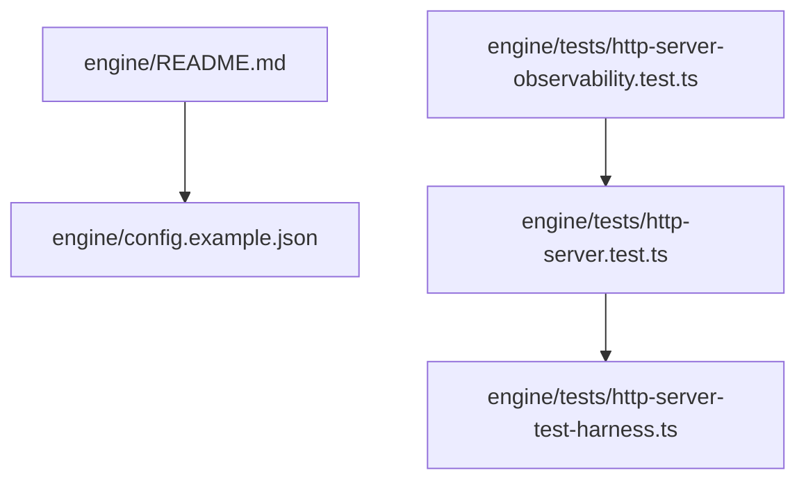
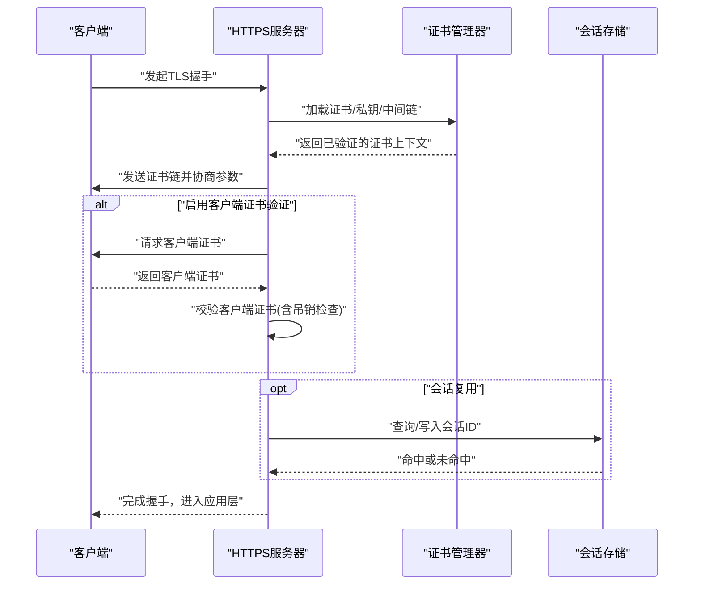
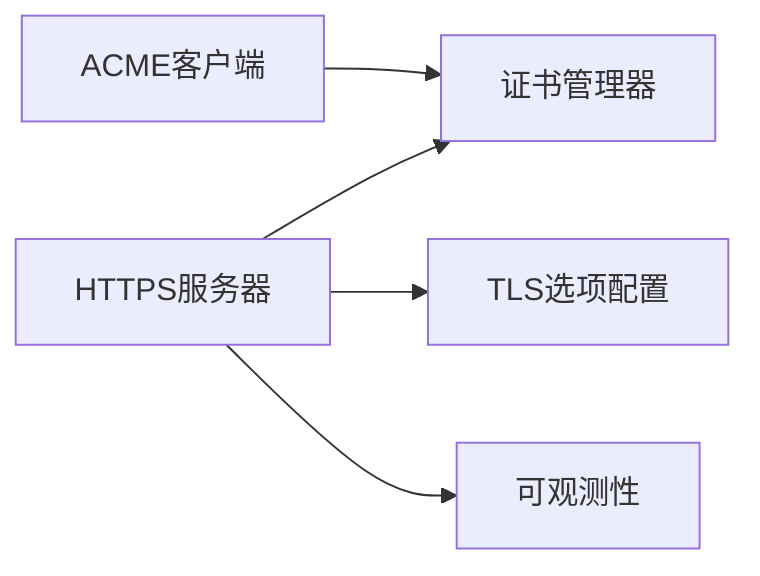

# SSL/TLS配置管理

<cite>
**本文引用的文件**   
- [engine/README.md](file://engine/README.md)
- [engine/config.example.json](file://engine/config.example.json)
- [engine/tests/http-server.test.ts](file://engine/tests/http-server.test.ts)
- [engine/tests/http-server-test-harness.ts](file://engine/tests/http-server-test-harness.ts)
- [engine/tests/http-server-observability.test.ts](file://engine/tests/http-server-observability.test.ts)
</cite>

## 目录
1. [简介](#简介)
2. [项目结构](#项目结构)
3. [核心组件](#核心组件)
4. [架构总览](#架构总览)
5. [详细组件分析](#详细组件分析)
6. [依赖关系分析](#依赖关系分析)
7. [性能考虑](#性能考虑)
8. [故障排除指南](#故障排除指南)
9. [结论](#结论)
10. [附录](#附录)

## 简介
本技术文档聚焦于KCoder的SSL/TLS配置管理，围绕HTTPS服务器配置、证书与私钥加载、证书链验证、加密套件与协议版本控制、客户端证书验证（双向认证）、会话复用与连接池、以及自动更新机制（如Let's Encrypt集成）等主题进行系统化说明。文档同时提供可操作的配置示例与排障建议，帮助读者在生产环境中安全、稳定地部署HTTPS服务。

## 项目结构
仓库采用多包工作区组织，HTTP/HTTPS相关能力集中在engine子项目中，测试用例位于engine/tests目录。与SSL/TLS相关的参考实现与行为主要通过HTTP服务器测试及其辅助工具体现，配置文件示例位于engine根目录。

图表来源
- [engine/README.md](file://engine/README.md)
- [engine/config.example.json](file://engine/config.example.json)
- [engine/tests/http-server.test.ts](file://engine/tests/http-server.test.ts)
- [engine/tests/http-server-test-harness.ts](file://engine/tests/http-server-test-harness.ts)
- [engine/tests/http-server-observability.test.ts](file://engine/tests/http-server-observability.test.ts)

章节来源
- [engine/README.md](file://engine/README.md)
- [engine/config.example.json](file://engine/config.example.json)
- [engine/tests/http-server.test.ts](file://engine/tests/http-server.test.ts)
- [engine/tests/http-server-test-harness.ts](file://engine/tests/http-server-test-harness.ts)
- [engine/tests/http-server-observability.test.ts](file://engine/tests/http-server-observability.test.ts)

## 核心组件
- HTTPS服务器：负责监听端口、建立TLS握手、处理请求生命周期。
- 证书与密钥管理：从文件系统或内存加载证书、私钥及中间证书链，并进行有效性校验。
- TLS选项配置：包括协议版本、加密套件、会话缓存、客户端证书验证等。
- 可观测性：在握手、错误、性能指标等方面提供日志与度量输出。

章节来源
- [engine/tests/http-server.test.ts](file://engine/tests/http-server.test.ts)
- [engine/tests/http-server-test-harness.ts](file://engine/tests/http-server-test-harness.ts)
- [engine/tests/http-server-observability.test.ts](file://engine/tests/http-server-observability.test.ts)

## 架构总览
下图展示了HTTPS服务器在TLS握手阶段的关键交互流程，涵盖证书加载、协议协商、可选的客户端证书验证与会话复用路径。

图表来源
- [engine/tests/http-server.test.ts](file://engine/tests/http-server.test.ts)
- [engine/tests/http-server-test-harness.ts](file://engine/tests/http-server-test-harness.ts)
- [engine/tests/http-server-observability.test.ts](file://engine/tests/http-server-observability.test.ts)

## 详细组件分析

### HTTPS服务器与TLS选项
- 协议版本控制
  - 支持TLS 1.2与TLS 1.3；建议默认开启TLS 1.3以提升性能与安全，同时保留TLS 1.2兼容旧客户端。
  - 通过服务器配置项显式指定最小/最大协议版本，避免降级攻击。
- 加密套件选择
  - 优先使用TLS 1.3内置套件；对于TLS 1.2，仅允许AEAD算法套件，禁用CBC与非AEAD套件。
  - 明确禁用已知弱算法（如RC4、3DES、MD5、SHA1用于签名）。
- 会话复用
  - 启用会话缓存与会话票据，减少握手开销；合理设置缓存大小与过期时间。
- 压缩与重协商
  - 禁用TLS压缩以防止CRIME/BREACH类攻击；限制或禁用重协商。
- 可观测性
  - 记录握手成功/失败、协议版本分布、套件使用比例、错误码等指标，便于容量规划与问题定位。

章节来源
- [engine/tests/http-server.test.ts](file://engine/tests/http-server.test.ts)
- [engine/tests/http-server-observability.test.ts](file://engine/tests/http-server-observability.test.ts)

### 证书与私钥管理
- 证书文件加载
  - 支持PEM格式；需包含完整证书链（服务端证书+中间CA），必要时包含根证书。
  - 私钥应与证书匹配且权限严格受限（仅运行用户可读）。
- 证书链验证
  - 启动时校验证书链完整性与有效期；对中间证书进行可信根验证。
  - 支持OCSP Stapling以提升吊销检查效率（若平台支持）。
- 运行时热重载
  - 支持在不重启进程的情况下替换证书与私钥；切换前预验证新证书，失败则回滚。
- 安全存储
  - 生产环境建议使用受控的文件系统权限或密钥管理服务（KMS）注入。

章节来源
- [engine/tests/http-server.test.ts](file://engine/tests/http-server.test.ts)
- [engine/tests/http-server-test-harness.ts](file://engine/tests/http-server-test-harness.ts)

### 客户端证书验证（双向认证）
- 启用条件
  - 当需要强身份认证时启用客户端证书验证；要求客户端持有由受信CA签发的证书。
- 验证流程
  - 校验客户端证书链、有效期、扩展字段；按需执行CRL/OCSP吊销检查。
- 策略与映射
  - 根据客户端证书属性（如CN/OU）映射到内部用户或租户；拒绝未满足策略的请求。
- 兼容性
  - 为不支持mTLS的客户端提供独立入口或网关层分流。

章节来源
- [engine/tests/http-server.test.ts](file://engine/tests/http-server.test.ts)
- [engine/tests/http-server-test-harness.ts](file://engine/tests/http-server-test-harness.ts)

### 自动更新机制（Let's Encrypt集成）
- 集成方式
  - 通过外部ACME客户端（如certbot/cert-manager）获取并续期证书，将新证书写入约定路径。
- 续期策略
  - 建议在证书到期前7天触发续期；每次续期后触发服务器热重载。
- 错误处理
  - 网络不可达、DNS解析失败、账户授权异常等场景应重试并告警；失败时保持旧证书有效。
- 监控与告警
  - 监控证书剩余有效期、续期成功率、热重载耗时；设置阈值告警。

章节来源
- [engine/config.example.json](file://engine/config.example.json)
- [engine/tests/http-server.test.ts](file://engine/tests/http-server.test.ts)

### 配置示例与最佳实践
- 基础HTTPS配置
  - 指定监听端口、证书路径、私钥路径、是否启用客户端证书验证。
- 高级TLS选项
  - 设置最小/最大协议版本、允许的加密套件列表、会话缓存大小与超时。
- 可观测性
  - 开启握手与错误统计指标，输出结构化日志以便集中采集。
- 安全基线
  - 遵循最小权限原则管理证书文件；定期轮换与审计访问日志。

章节来源
- [engine/config.example.json](file://engine/config.example.json)

## 依赖关系分析
- 模块耦合
  - HTTPS服务器依赖证书管理器与TLS选项配置；可观测性模块贯穿握手与错误路径。
- 外部依赖
  - 操作系统TLS栈与OpenSSL/原生库；ACME客户端（外部进程或服务）。
- 潜在风险
  - 证书路径变更导致启动失败；会话缓存过大引发内存压力；过宽加密套件降低安全性。

图表来源
- [engine/tests/http-server.test.ts](file://engine/tests/http-server.test.ts)
- [engine/tests/http-server-test-harness.ts](file://engine/tests/http-server-test-harness.ts)
- [engine/tests/http-server-observability.test.ts](file://engine/tests/http-server-observability.test.ts)

章节来源
- [engine/tests/http-server.test.ts](file://engine/tests/http-server.test.ts)
- [engine/tests/http-server-test-harness.ts](file://engine/tests/http-server-test-harness.ts)
- [engine/tests/http-server-observability.test.ts](file://engine/tests/http-server-observability.test.ts)

## 性能考虑
- 启用TLS 1.3以减少往返次数，提升首字节时间与整体吞吐。
- 合理设置会话缓存大小与过期时间，平衡命中率与内存占用。
- 预热常用会话票据，降低冷启动时的握手延迟。
- 避免在TLS层启用压缩，防止额外CPU开销与安全风险。
- 针对高并发场景，结合连接池与反向代理（如Nginx/Envoy）卸载TLS以分摊计算压力。

[本节为通用性能指导，不直接分析具体文件]

## 故障排除指南
- 握手失败
  - 检查证书链完整性与有效期；确认私钥与证书匹配；核对协议版本与套件是否被双方支持。
- 客户端证书验证失败
  - 确认客户端证书由受信CA签发；检查CRL/OCSP可达性与响应；验证客户端证书策略映射。
- 自动续期失败
  - 检查ACME客户端状态、网络连通性与域名解析；查看证书热重载日志与回滚情况。
- 性能退化
  - 观察会话命中率与CPU使用率；评估是否启用了不必要的套件或开启了压缩。

章节来源
- [engine/tests/http-server.test.ts](file://engine/tests/http-server.test.ts)
- [engine/tests/http-server-observability.test.ts](file://engine/tests/http-server-observability.test.ts)

## 结论
通过对HTTPS服务器、证书与私钥管理、TLS选项、客户端证书验证、自动更新与可观测性的系统化梳理，可在保证安全的前提下获得良好的性能与可运维性。建议在生产环境遵循最小权限与最小功能集原则，持续监控与演练证书生命周期管理，确保业务连续性与合规性。

[本节为总结性内容，不直接分析具体文件]

## 附录
- 术语
  - mTLS：双向TLS认证
  - OCSP：在线证书状态协议
  - CRL：证书吊销列表
  - ACME：自动化证书管理环境协议
- 参考
  - 配置文件示例位置：engine/config.example.json
  - HTTP服务器测试与可观测性用例：engine/tests/http-server*.ts

[本节为补充信息，不直接分析具体文件]