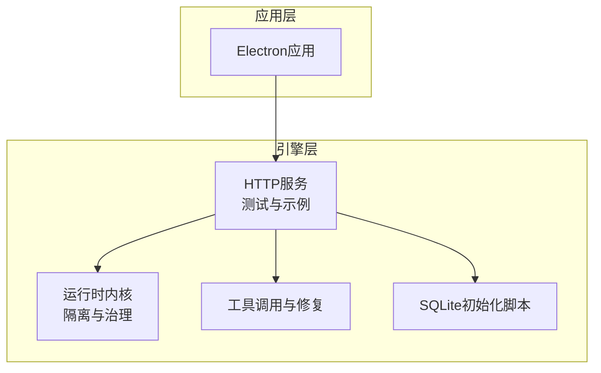
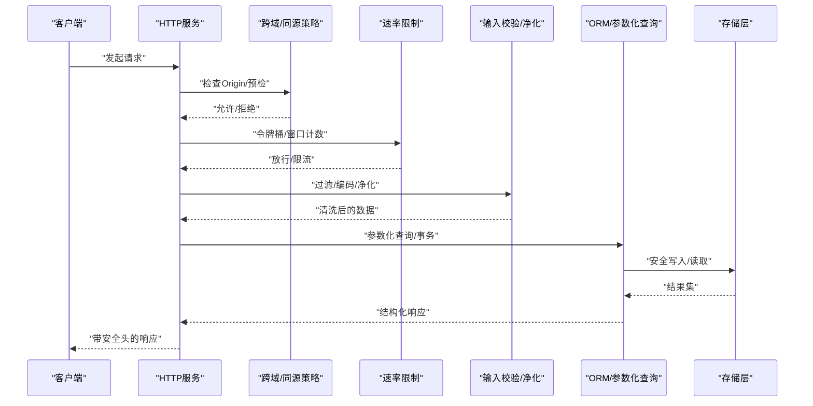
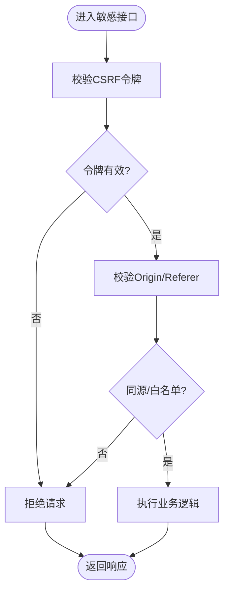
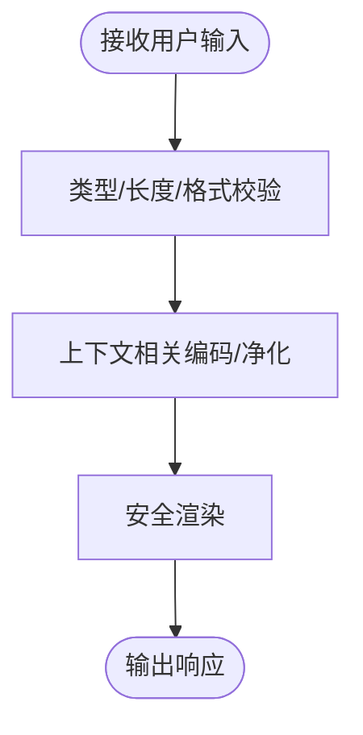
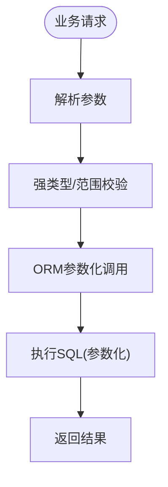
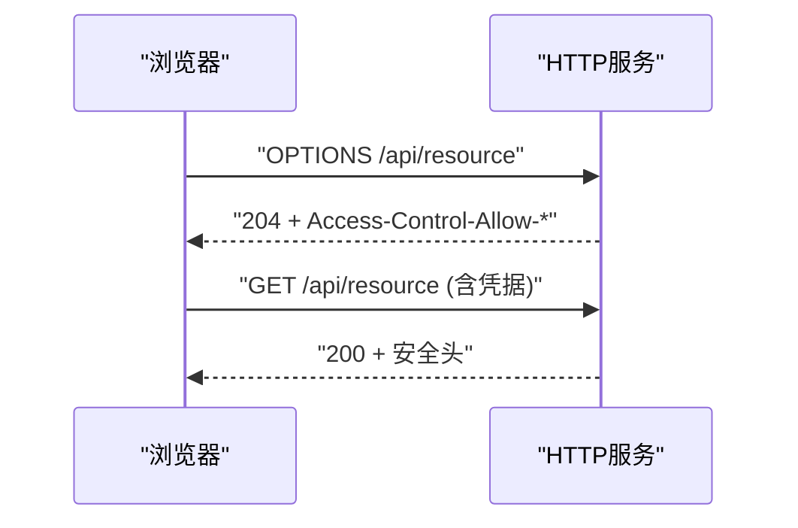
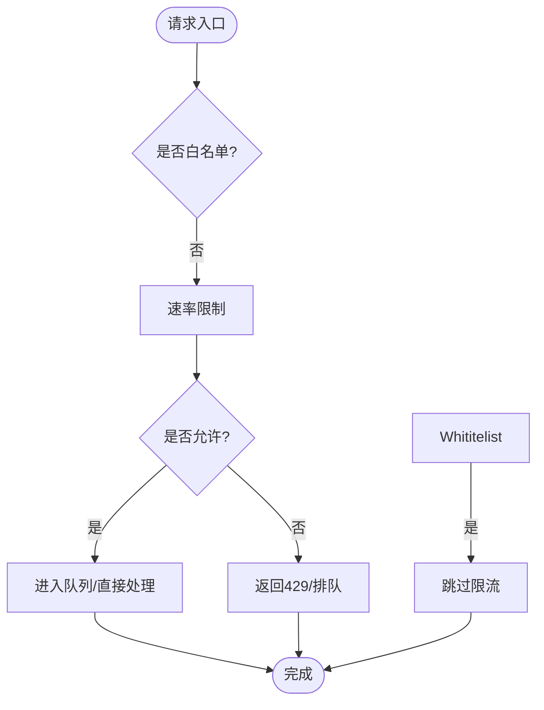
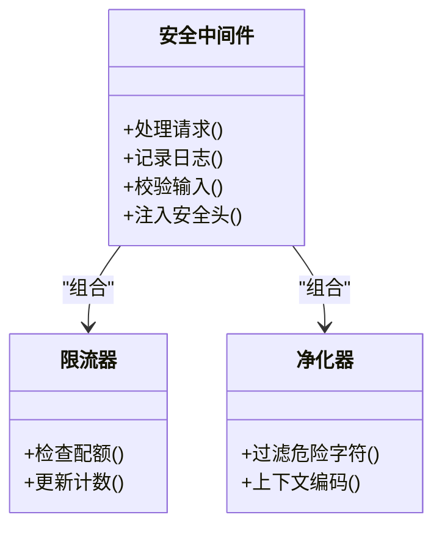
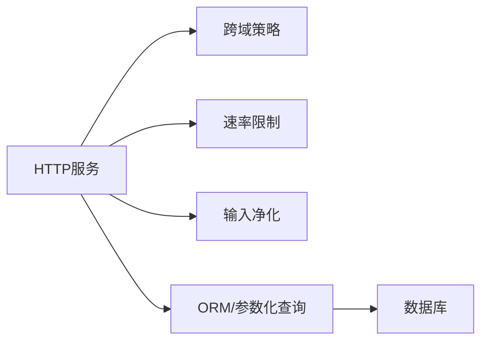

# 安全防护措施

<cite>
**本文引用的文件**   
- [engine/README.md](file://engine/README.md)
- [engine/config.example.json](file://engine/config.example.json)
- [engine/package.json](file://engine/package.json)
- [engine/tests/http-server.test.ts](file://engine/tests/http-server.test.ts)
- [engine/tests/http-server-test-harness.ts](file://engine/tests/http-server-test-harness.ts)
- [engine/tests/runtime-kernel-isolation.test.ts](file://engine/tests/runtime-kernel-isolation.test.ts)
- [engine/tests/tool-call-repair.test.ts](file://engine/tests/tool-call-repair.test.ts)
- [engine/tests/request-history-hygiene.test.ts](file://engine/tests/request-history-hygiene.test.ts)
- [engine/tests/serve.test.ts](file://engine/tests/serve.test.ts)
- [engine/scripts/prepare-sqlite.mjs](file://engine/scripts/prepare-sqlite.mjs)
</cite>

## 目录
1. [简介](#简介)
2. [项目结构](#项目结构)
3. [核心组件](#核心组件)
4. [架构总览](#架构总览)
5. [详细组件分析](#详细组件分析)
6. [依赖关系分析](#依赖关系分析)
7. [性能考虑](#性能考虑)
8. [故障排查指南](#故障排查指南)
9. [结论](#结论)
10. [附录](#附录)

## 简介
本技术文档聚焦于KCoder的安全防护措施，围绕CSRF、XSS、SQL注入、CORS、DDoS防护、安全头与安全中间件开发、漏洞扫描集成等主题进行系统化说明。文档基于仓库中HTTP服务测试与脚本等可验证材料进行分析，并结合工程实践给出落地建议与图示化流程，帮助读者快速理解并实施相应的安全策略。

## 项目结构
KCoder采用多包工作区组织，引擎层（engine）包含HTTP服务、运行时内核、工具调用、持久化等能力；应用层（app）为前端渲染与Electron宿主。安全相关实现主要分布在引擎层的HTTP与服务测试中，并通过配置与脚本支撑数据库初始化与运行环境。

图表来源
- [engine/tests/http-server.test.ts](file://engine/tests/http-server.test.ts)
- [engine/tests/runtime-kernel-isolation.test.ts](file://engine/tests/runtime-kernel-isolation.test.ts)
- [engine/tests/tool-call-repair.test.ts](file://engine/tests/tool-call-repair.test.ts)
- [engine/scripts/prepare-sqlite.mjs](file://engine/scripts/prepare-sqlite.mjs)

章节来源
- [engine/README.md](file://engine/README.md)
- [engine/package.json](file://engine/package.json)

## 核心组件
- HTTP服务与请求处理：通过测试用例覆盖典型HTTP场景，便于验证安全策略（如跨域、鉴权、限流）。
- 运行时内核隔离：对执行上下文进行隔离，降低越权与资源滥用风险。
- 工具调用修复：在工具调用路径上增加输入校验与错误恢复，减少注入与异常扩散。
- 持久化初始化：使用脚本准备SQLite数据库，确保存储层安全初始化。

章节来源
- [engine/tests/http-server.test.ts](file://engine/tests/http-server.test.ts)
- [engine/tests/runtime-kernel-isolation.test.ts](file://engine/tests/runtime-kernel-isolation.test.ts)
- [engine/tests/tool-call-repair.test.ts](file://engine/tests/tool-call-repair.test.ts)
- [engine/scripts/prepare-sqlite.mjs](file://engine/scripts/prepare-sqlite.mjs)

## 架构总览
下图展示KCoder在安全视角下的关键交互：客户端请求经HTTP服务进入，依次经过同源与跨域策略、安全头设置、速率限制、参数校验与ORM/参数化查询，最终到达业务逻辑与存储层。

图表来源
- [engine/tests/http-server.test.ts](file://engine/tests/http-server.test.ts)
- [engine/tests/request-history-hygiene.test.ts](file://engine/tests/request-history-hygiene.test.ts)

## 详细组件分析

### CSRF防护
- 令牌生成与验证
  - 建议在会话建立时生成一次性或短期有效的CSRF令牌，并在敏感操作前校验。
  - 将令牌置于请求体或自定义头部，避免仅依赖Cookie。
- 同源检查
  - 严格校验Referer与Origin，结合白名单域名策略。
- 跨域策略
  - 非简单请求需支持预检，谨慎暴露敏感头部。
- 最佳实践
  - 对状态变更接口强制要求CSRF令牌与Content-Type校验。
  - 结合SameSite Cookie属性与双提交模式增强防护。

章节来源
- [engine/tests/http-server.test.ts](file://engine/tests/http-server.test.ts)

### XSS防护
- 输入过滤与输出编码
  - 对所有用户输入进行类型与长度校验，输出到HTML/JS/CSS上下文时使用对应编码。
- Content-Security-Policy
  - 启用严格的CSP策略，限制脚本来源与内联脚本执行。
- DOM净化
  - 对富文本内容使用可信库进行DOM净化后再渲染。
- 防御要点
  - 避免使用innerHTML等不安全API，优先使用安全的模板引擎。

章节来源
- [engine/tests/http-server.test.ts](file://engine/tests/http-server.test.ts)

### SQL注入防护
- 参数化查询与ORM
  - 使用参数化查询或ORM的绑定变量机制，禁止字符串拼接SQL。
- 输入验证
  - 对ID、枚举、范围等字段进行强类型校验。
- 存储过程
  - 若使用存储过程，应传入参数而非拼接SQL片段。
- 最小权限
  - 数据库账户遵循最小权限原则，限制DDL/DML范围。

章节来源
- [engine/scripts/prepare-sqlite.mjs](file://engine/scripts/prepare-sqlite.mjs)

### CORS配置
- 跨域策略
  - 明确允许的源、方法与头部，避免使用通配符。
- 预检请求
  - 正确处理OPTIONS预检，缓存合理时间。
- 凭据处理
  - 仅在必要时允许凭据，并配合严格的源白名单。
- 动态CORS
  - 根据租户或环境动态计算允许源，避免硬编码。

章节来源
- [engine/tests/http-server.test.ts](file://engine/tests/http-server.test.ts)

### DDoS防护
- 速率限制
  - 基于IP/用户/接口的滑动窗口或令牌桶算法限制QPS。
- IP白名单
  - 对内部或可信来源放行，其他来源受限。
- 请求队列
  - 对高负载接口引入队列与背压，保护后端。
- 异常检测
  - 监控异常流量模式，自动触发降级或封禁。

章节来源
- [engine/tests/http-server.test.ts](file://engine/tests/http-server.test.ts)

### 安全头配置
- 推荐安全头
  - Strict-Transport-Security、X-Content-Type-Options、X-Frame-Options、Referrer-Policy、Permissions-Policy等。
- 部署建议
  - 在反向代理或网关统一设置，避免遗漏。

章节来源
- [engine/tests/http-server.test.ts](file://engine/tests/http-server.test.ts)

### 安全中间件开发
- 设计原则
  - 单一职责、可组合、可观测、可配置。
- 常见中间件
  - 日志审计、访问控制、输入净化、响应头注入、限流熔断。
- 测试策略
  - 针对边界条件与异常路径编写单测与集成测试。

章节来源
- [engine/tests/http-server.test.ts](file://engine/tests/http-server.test.ts)

### 漏洞扫描集成
- 静态扫描
  - 在CI中集成SAST工具，阻断高危问题合并。
- 依赖扫描
  - 定期扫描第三方依赖漏洞，及时升级。
- 动态扫描
  - 对预发环境进行DAST扫描，覆盖关键接口。
- 报告与修复
  - 建立工单流转与SLA，跟踪修复闭环。

章节来源
- [engine/package.json](file://engine/package.json)

## 依赖关系分析
- 组件耦合
  - HTTP服务依赖跨域策略、限流器、净化器与ORM层。
- 外部依赖
  - 数据库驱动、模板引擎、CSP与限流库等。
- 潜在循环
  - 中间件应避免相互引用导致循环依赖。

图表来源
- [engine/tests/http-server.test.ts](file://engine/tests/http-server.test.ts)
- [engine/scripts/prepare-sqlite.mjs](file://engine/scripts/prepare-sqlite.mjs)

章节来源
- [engine/package.json](file://engine/package.json)

## 性能考虑
- 限流与缓存
  - 合理使用缓存与CDN，减轻后端压力。
- 连接池
  - 数据库与外部服务连接复用，避免频繁创建销毁。
- 异步与批处理
  - 对耗时任务采用异步与批处理，提升吞吐。
- 监控与告警
  - 关注P99延迟、错误率与资源使用率。

[本节为通用指导，不直接分析具体文件]

## 故障排查指南
- 常见问题
  - 跨域失败：检查Origin白名单与预检响应头。
  - 限流过严：调整阈值与窗口大小，观察429比例。
  - 注入报错：确认参数化查询与输入校验是否生效。
- 诊断手段
  - 开启详细日志与追踪，定位请求链路。
  - 使用测试夹具复现问题，逐步缩小范围。

章节来源
- [engine/tests/http-server-test-harness.ts](file://engine/tests/http-server-test-harness.ts)
- [engine/tests/request-history-hygiene.test.ts](file://engine/tests/request-history-hygiene.test.ts)

## 结论
通过在HTTP服务层落实CSRF、XSS、SQL注入、CORS与DDoS防护，并配套安全头与安全中间件，KCoder可在生产环境中获得稳健的安全基线。建议持续集成漏洞扫描与自动化测试，形成“预防-检测-修复”的闭环。

[本节为总结性内容，不直接分析具体文件]

## 附录
- 参考配置
  - 示例配置文件用于定义服务行为与安全开关。
- 测试用例
  - 通过HTTP服务测试与隔离测试验证安全策略有效性。

章节来源
- [engine/config.example.json](file://engine/config.example.json)
- [engine/tests/runtime-kernel-isolation.test.ts](file://engine/tests/runtime-kernel-isolation.test.ts)
- [engine/tests/tool-call-repair.test.ts](file://engine/tests/tool-call-repair.test.ts)
- [engine/tests/serve.test.ts](file://engine/tests/serve.test.ts)