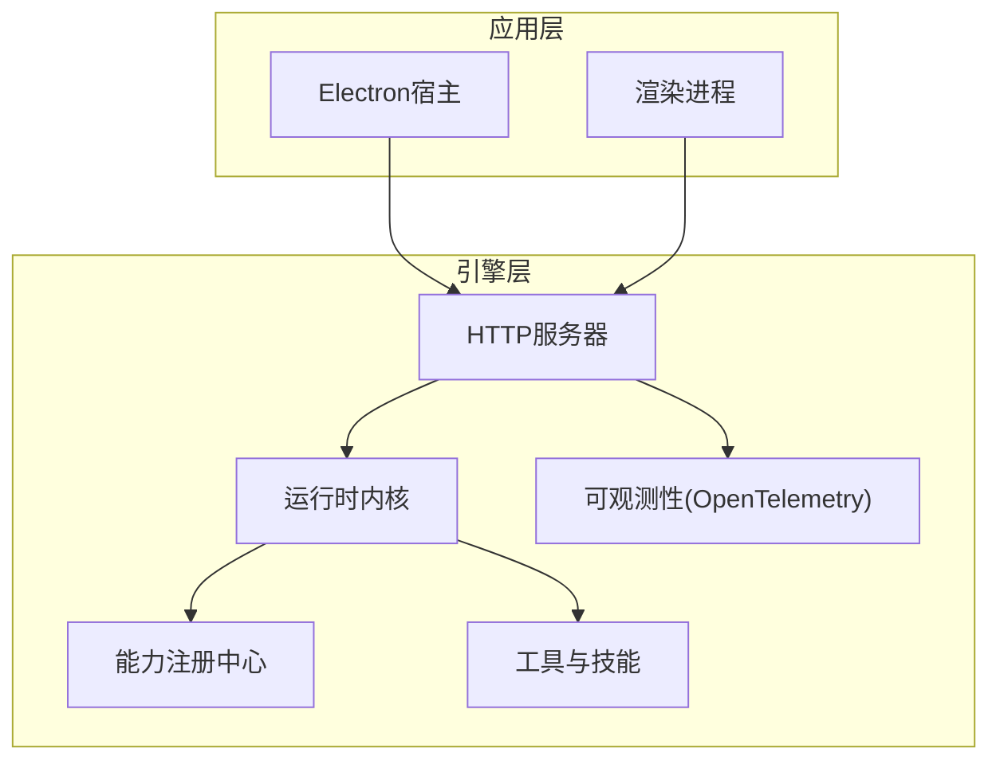
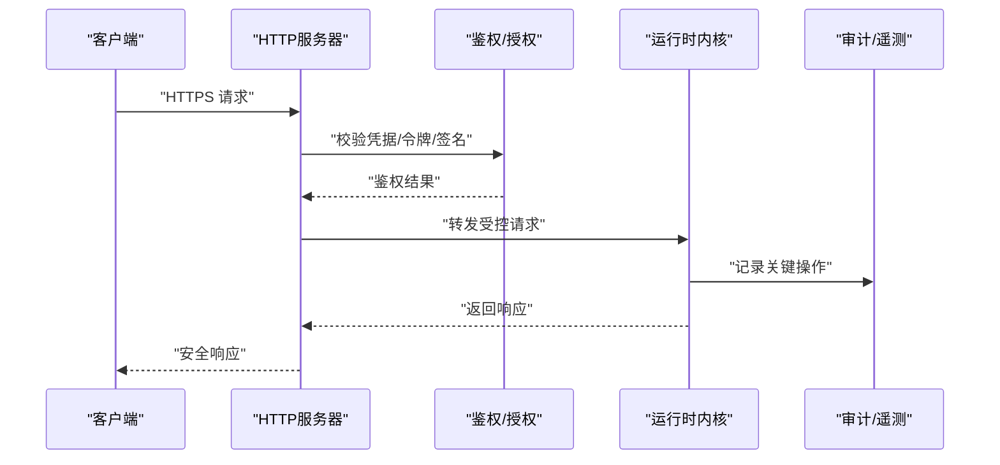
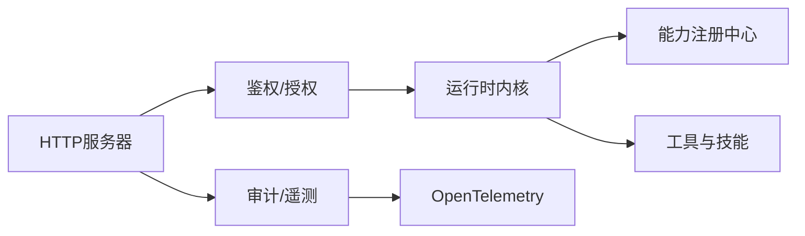

# 网络安全机制

<cite>
**本文引用的文件**   
- [engine/README.md](file://engine/README.md)
- [engine/config.example.json](file://engine/config.example.json)
- [engine/package.json](file://engine/package.json)
- [engine/tests/http-server.test.ts](file://engine/tests/http-server.test.ts)
- [engine/tests/http-server-test-harness.ts](file://engine/tests/http-server-test-harness.ts)
- [engine/tests/http-artifacts.test.ts](file://engine/tests/http-artifacts.test.ts)
- [engine/tests/runtime-kernel-provider-matrix.test.ts](file://engine/tests/runtime-kernel-provider-matrix.test.ts)
- [engine/tests/opentelemetry.test.ts](file://engine/tests/opentelemetry.test.ts)
- [engine/tests/command-audit.test.ts](file://engine/tests/command-audit.test.ts)
- [engine/tests/request-history-hygiene.test.ts](file://engine/tests/request-history-hygiene.test.ts)
</cite>

## 目录
1. [简介](#简介)
2. [项目结构](#项目结构)
3. [核心组件](#核心组件)
4. [架构总览](#架构总览)
5. [详细组件分析](#详细组件分析)
6. [依赖关系分析](#依赖关系分析)
7. [性能考虑](#性能考虑)
8. [故障排查指南](#故障排查指南)
9. [结论](#结论)
10. [附录](#附录)

## 简介
本技术文档聚焦于KCoder的网络安全机制，围绕以下主题展开：SSL/TLS配置与管理、身份认证与授权控制、请求签名与防重放、常见Web安全威胁防护（CSRF、XSS、SQL注入、CORS）、以及安全审计与日志记录。文档基于仓库中现有测试与示例配置进行归纳，旨在为开发者提供可操作的实践指导与排障参考。

## 项目结构
从仓库结构看，KCoder采用多包工程组织，引擎层位于 engine 目录，包含HTTP服务、运行时内核、能力注册、工具链等模块；前端渲染与Electron宿主在 app 目录。与安全相关的实现与验证主要分布在 engine 下的测试与示例配置中，例如HTTP服务器测试、OpenTelemetry遥测、命令审计、请求历史清理等。

[本节为概念性概述，不直接分析具体源文件]

## 核心组件
- HTTP服务器与中间件：负责接收外部请求、路由分发、基础安全策略（如CORS）与可观测性接入。
- 运行时内核：承载任务编排、能力调度与权限边界，是授权与审计的关键落点。
- 可观测性与审计：通过OpenTelemetry与命令审计记录关键操作，支撑安全事件追踪。
- 配置管理：集中化配置入口，便于统一开启TLS、鉴权与审计开关。

**章节来源**
- [engine/README.md](file://engine/README.md)
- [engine/config.example.json](file://engine/config.example.json)

## 架构总览
下图展示了KCoder在网络侧的安全相关交互路径：客户端经HTTPS访问HTTP服务器，服务器执行鉴权与授权后进入内核处理，期间贯穿审计与遥测。

[本图为概念性流程示意，未映射到具体源码文件]

## 详细组件分析

### SSL/TLS配置与管理
- 证书验证与协议版本控制：建议在HTTP服务器启动时启用TLS并限制最低协议版本，仅允许现代加密套件。证书应来自可信CA或内部PKI，并在部署环境以环境变量或配置文件注入。
- 加密套件选择：优先使用AEAD算法（如AES-GCM、ChaCha20-Poly1305），禁用已知弱套件与CBC模式。
- 会话复用与密钥轮换：合理设置会话缓存与超时，支持在线密钥轮换与证书热更新。

建议落地位置
- HTTP服务器初始化与监听处
- 配置文件中关于TLS的键值项

**章节来源**
- [engine/config.example.json](file://engine/config.example.json)
- [engine/tests/http-server.test.ts](file://engine/tests/http-server.test.ts)

### 身份认证机制
- API密钥管理：对服务端间调用或CLI场景，建议使用API密钥作为静态凭据，并通过请求头或查询参数传递，服务端进行白名单校验与速率限制。
- OAuth2集成：对外部用户登录或第三方资源访问，推荐采用OAuth2授权码流程，结合短生命周期Access Token与Refresh Token，必要时引入PKCE。
- JWT令牌处理：签发时绑定最小必要声明，设置过期时间，服务端校验签名、受众与发行者，拒绝过期或篡改令牌。
- 会话管理：对于浏览器端，使用HttpOnly、Secure、SameSite Cookie，配合短期会话ID与后端状态存储，避免敏感信息落入前端。

建议落地位置
- HTTP鉴权中间件
- 令牌签发与校验逻辑
- 会话存储与清理策略

**章节来源**
- [engine/tests/http-server.test.ts](file://engine/tests/http-server.test.ts)
- [engine/tests/http-server-test-harness.ts](file://engine/tests/http-server-test-harness.ts)

### 授权控制实现
- 基于角色的访问控制（RBAC）：在能力注册与工具调用入口处实施角色检查，确保仅具备相应角色的主体可调用特定能力。
- 细粒度权限验证：针对资源级访问（如文件、任务、模型提供者），在运行时内核中进行二次校验。
- 动态授权策略：将策略配置外置，支持热更新，结合审计记录进行策略效果评估与回滚。

建议落地位置
- 能力注册中心与工具分派器
- 运行时内核的权限拦截点
- 策略配置与加载模块

**章节来源**
- [engine/tests/runtime-kernel-provider-matrix.test.ts](file://engine/tests/runtime-kernel-provider-matrix.test.ts)

### 请求签名机制
- HMAC签名：对关键接口采用HMAC-SHA256签名，客户端使用共享密钥计算签名，服务端用相同密钥与算法校验。
- 时间戳验证：请求携带时间戳，服务端校验时间窗口（如±5分钟），拒绝过期请求。
- 防重放攻击：引入随机数（nonce）与去重表，结合时间窗口限制，防止同一请求被重复提交。

建议落地位置
- 通用签名校验中间件
- 时间戳与nonce校验逻辑
- 去重存储（内存或Redis）

**章节来源**
- [engine/tests/http-server.test.ts](file://engine/tests/http-server.test.ts)

### 网络安全防护
- CSRF防护：对状态变更接口强制同源校验与自定义Header校验，或使用SameSite Cookie策略。
- XSS防护：对所有输出进行上下文编码，启用内容安全策略（CSP），避免内联脚本与不安全来源。
- SQL注入防护：使用参数化查询与ORM，禁止拼接SQL字符串；对输入进行严格类型与长度校验。
- CORS配置：明确允许的源、方法与头部，生产环境关闭通配符，按域精细化放行。

建议落地位置
- HTTP中间件（CSRF、CORS、输入校验）
- 数据访问层（参数化查询）
- 前端渲染层（CSP与输出编码）

**章节来源**
- [engine/tests/http-server.test.ts](file://engine/tests/http-server.test.ts)

### 安全审计与日志记录
- OpenTelemetry集成：通过Traces与Metrics记录关键请求链路、错误率与延迟，辅助定位安全问题。
- 命令审计：对高风险命令执行进行持久化审计，包括执行主体、时间、参数摘要与结果状态。
- 请求历史清理：定期清理敏感请求历史，避免泄露与滥用。

建议落地位置
- 可观测性初始化与上报
- 审计写入与查询接口
- 定时清理任务

**章节来源**
- [engine/tests/opentelemetry.test.ts](file://engine/tests/opentelemetry.test.ts)
- [engine/tests/command-audit.test.ts](file://engine/tests/command-audit.test.ts)
- [engine/tests/request-history-hygiene.test.ts](file://engine/tests/request-history-hygiene.test.ts)

## 依赖关系分析
下图展示与网络安全相关的主要模块及其依赖关系。

**图表来源**
- [engine/tests/http-server.test.ts](file://engine/tests/http-server.test.ts)
- [engine/tests/runtime-kernel-provider-matrix.test.ts](file://engine/tests/runtime-kernel-provider-matrix.test.ts)
- [engine/tests/opentelemetry.test.ts](file://engine/tests/opentelemetry.test.ts)

**章节来源**
- [engine/tests/http-server.test.ts](file://engine/tests/http-server.test.ts)
- [engine/tests/runtime-kernel-provider-matrix.test.ts](file://engine/tests/runtime-kernel-provider-matrix.test.ts)
- [engine/tests/opentelemetry.test.ts](file://engine/tests/opentelemetry.test.ts)

## 性能考虑
- TLS握手开销：启用会话复用与连接池，减少握手次数；在高并发场景下考虑硬件加速。
- 鉴权与签名校验：尽量使用无状态校验（如JWT）与本地缓存，降低外部依赖延迟。
- 审计与遥测：异步上报与采样降频，避免阻塞主请求路径。
- 请求历史清理：后台任务批量清理，避免高峰时段影响。

[本节为通用性能建议，不直接分析具体源文件]

## 故障排查指南
- HTTPS无法建立：检查证书路径、私钥权限与协议版本配置；确认端口未被占用。
- 鉴权失败：核对API密钥/令牌格式、签名算法与时钟同步；查看鉴权中间件日志。
- 授权越权：复核RBAC策略与资源级权限规则；检查能力注册与工具调用入口的拦截点。
- 审计缺失：确认OpenTelemetry上报通道与审计写入是否成功；检查权限与磁盘空间。
- 请求历史泄露：确认清理任务是否运行；检查临时目录权限与保留策略。

**章节来源**
- [engine/tests/http-server.test.ts](file://engine/tests/http-server.test.ts)
- [engine/tests/opentelemetry.test.ts](file://engine/tests/opentelemetry.test.ts)
- [engine/tests/command-audit.test.ts](file://engine/tests/command-audit.test.ts)
- [engine/tests/request-history-hygiene.test.ts](file://engine/tests/request-history-hygiene.test.ts)

## 结论
KCoder的网络安全机制围绕“传输安全、身份与授权、请求完整性、威胁防护、审计可观测”五个维度构建。通过合理的TLS配置、严格的鉴权与授权策略、可靠的请求签名与防重放、全面的Web安全加固，以及完善的审计与遥测体系，可有效提升系统整体安全性与可运维性。

[本节为总结性内容，不直接分析具体源文件]

## 附录
- 最佳实践清单
  - 始终启用HTTPS，限制最低TLS版本与现代加密套件。
  - 使用最小权限原则配置API密钥与OAuth2范围。
  - 对关键接口启用HMAC签名与时间戳/nonce校验。
  - 全面启用CORS白名单与CSP策略。
  - 所有数据库访问使用参数化查询。
  - 审计与遥测全量覆盖关键路径，并定期审查。
- 常见漏洞防护要点
  - CSRF：SameSite Cookie + 自定义Header双重校验。
  - XSS：输出编码 + CSP + 禁用内联脚本。
  - SQL注入：参数化查询 + 输入校验 + ORM。
  - 重放攻击：时间窗口 + nonce去重 + 签名校验。

[本节为通用指导，不直接分析具体源文件]