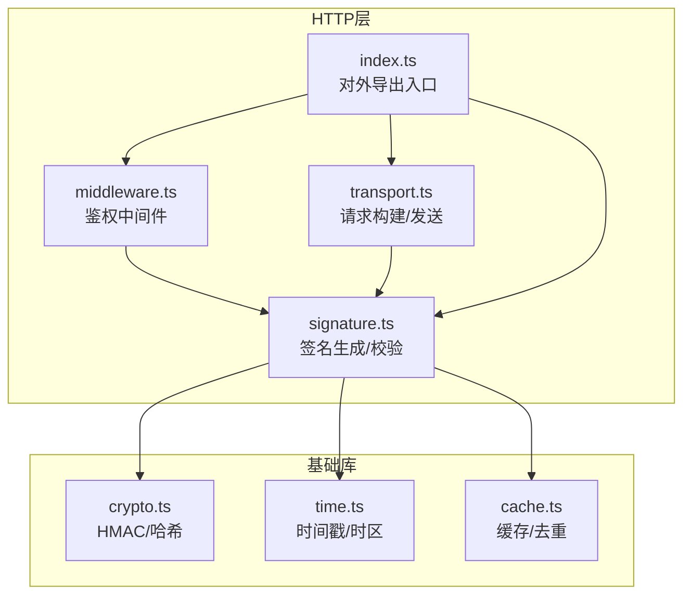
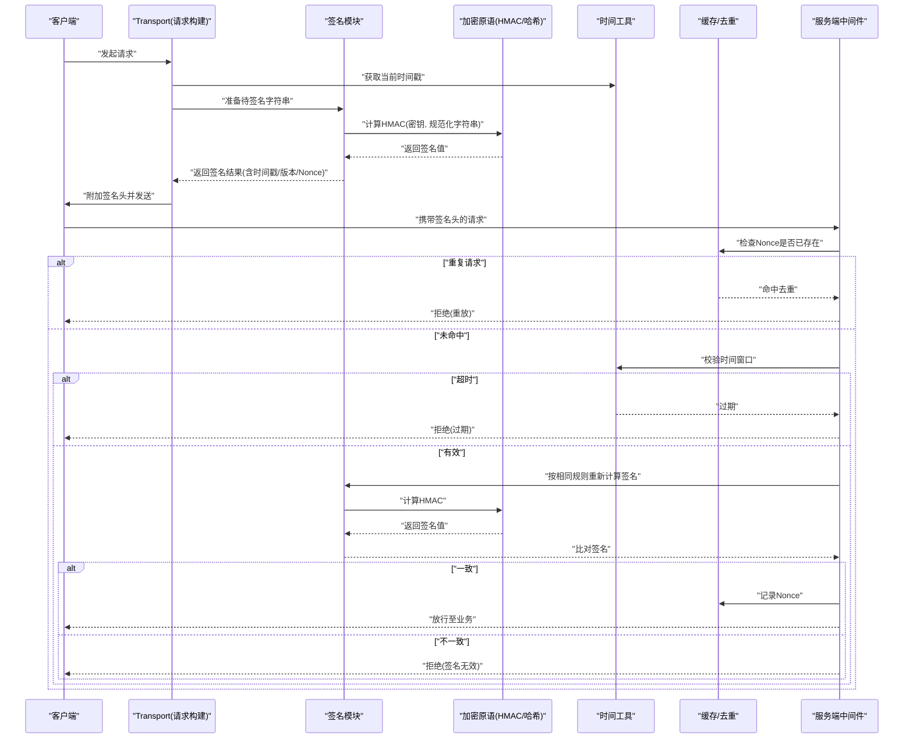
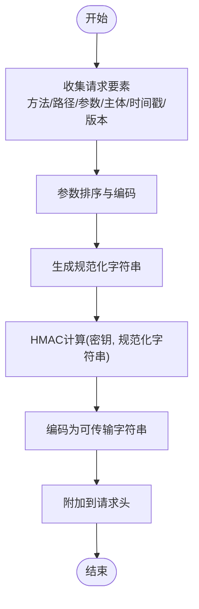
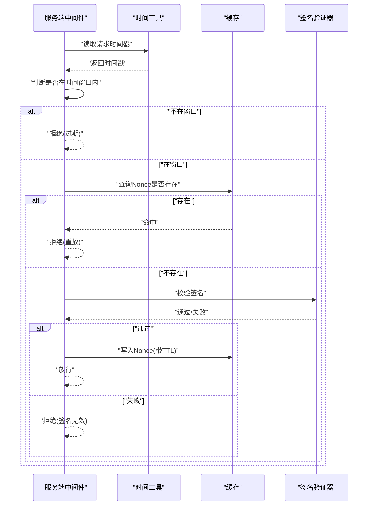
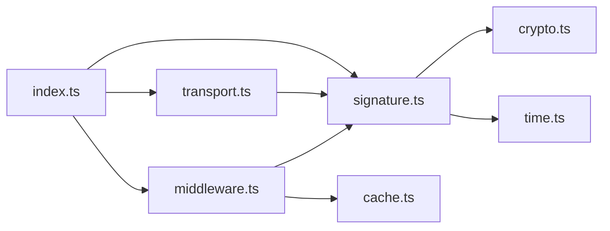

# 请求签名机制

<cite>
**本文引用的文件**   
- [engine/packages/http-layer/src/index.ts](file://engine/packages/http-layer/src/index.ts)
- [engine/packages/http-layer/src/signature.ts](file://engine/packages/http-layer/src/signature.ts)
- [engine/packages/http-layer/src/middleware.ts](file://engine/packages/http-layer/src/middleware.ts)
- [engine/packages/http-layer/src/transport.ts](file://engine/packages/http-layer/src/transport.ts)
- [engine/packages/foundation/src/crypto.ts](file://engine/packages/foundation/src/crypto.ts)
- [engine/packages/foundation/src/time.ts](file://engine/packages/foundation/src/time.ts)
- [engine/packages/foundation/src/cache.ts](file://engine/packages/foundation/src/cache.ts)
</cite>

## 目录
1. [简介](#简介)
2. [项目结构](#项目结构)
3. [核心组件](#核心组件)
4. [架构总览](#架构总览)
5. [详细组件分析](#详细组件分析)
6. [依赖关系分析](#依赖关系分析)
7. [性能考虑](#性能考虑)
8. [故障排查指南](#故障排查指南)
9. [结论](#结论)
10. [附录](#附录)

## 简介
本文件面向KCoder的请求签名机制，系统性说明HMAC签名算法的实现与使用、防重放攻击策略、请求完整性保护、签名格式规范以及客户端与服务端的集成方式。文档同时提供调试方法与性能优化建议，帮助读者快速落地并稳定运行。

## 项目结构
KCoder的签名相关能力主要分布在http-layer与foundation两个包中：
- http-layer：负责HTTP传输层、中间件、签名生成与校验、时间窗口控制、nonce去重等。
- foundation：提供底层加密原语（HMAC、哈希）、时间工具、缓存抽象等。

图表来源
- [engine/packages/http-layer/src/signature.ts](file://engine/packages/http-layer/src/signature.ts)
- [engine/packages/http-layer/src/middleware.ts](file://engine/packages/http-layer/src/middleware.ts)
- [engine/packages/http-layer/src/transport.ts](file://engine/packages/http-layer/src/transport.ts)
- [engine/packages/http-layer/src/index.ts](file://engine/packages/http-layer/src/index.ts)
- [engine/packages/foundation/src/crypto.ts](file://engine/packages/foundation/src/crypto.ts)
- [engine/packages/foundation/src/time.ts](file://engine/packages/foundation/src/time.ts)
- [engine/packages/foundation/src/cache.ts](file://engine/packages/foundation/src/cache.ts)

章节来源
- [engine/packages/http-layer/src/index.ts](file://engine/packages/http-layer/src/index.ts)
- [engine/packages/http-layer/src/signature.ts](file://engine/packages/http-layer/src/signature.ts)
- [engine/packages/http-layer/src/middleware.ts](file://engine/packages/http-layer/src/middleware.ts)
- [engine/packages/http-layer/src/transport.ts](file://engine/packages/http-layer/src/transport.ts)
- [engine/packages/foundation/src/crypto.ts](file://engine/packages/foundation/src/crypto.ts)
- [engine/packages/foundation/src/time.ts](file://engine/packages/foundation/src/time.ts)
- [engine/packages/foundation/src/cache.ts](file://engine/packages/foundation/src/cache.ts)

## 核心组件
- 签名生成器：基于HMAC对规范化后的请求进行摘要，输出签名串与必要元数据（如时间戳、版本、算法标识）。
- 签名验证器：在服务端复用相同规范化与HMAC计算流程，对比签名值以确认请求完整性与来源可信。
- 中间件：在请求进入业务逻辑前完成签名校验、时间窗口检查、nonce去重等安全策略。
- 传输封装：在构造出站请求时自动注入签名头部；在入站请求处理链中挂载中间件。
- 基础能力：HMAC/哈希实现、时间戳与时区处理、缓存与去重存储。

章节来源
- [engine/packages/http-layer/src/signature.ts](file://engine/packages/http-layer/src/signature.ts)
- [engine/packages/http-layer/src/middleware.ts](file://engine/packages/http-layer/src/middleware.ts)
- [engine/packages/http-layer/src/transport.ts](file://engine/packages/http-layer/src/transport.ts)
- [engine/packages/foundation/src/crypto.ts](file://engine/packages/foundation/src/crypto.ts)
- [engine/packages/foundation/src/time.ts](file://engine/packages/foundation/src/time.ts)
- [engine/packages/foundation/src/cache.ts](file://engine/packages/foundation/src/cache.ts)

## 架构总览
下图展示了客户端与服务端在签名与校验过程中的交互关系及关键组件职责。

图表来源
- [engine/packages/http-layer/src/transport.ts](file://engine/packages/http-layer/src/transport.ts)
- [engine/packages/http-layer/src/signature.ts](file://engine/packages/http-layer/src/signature.ts)
- [engine/packages/http-layer/src/middleware.ts](file://engine/packages/http-layer/src/middleware.ts)
- [engine/packages/foundation/src/crypto.ts](file://engine/packages/foundation/src/crypto.ts)
- [engine/packages/foundation/src/time.ts](file://engine/packages/foundation/src/time.ts)
- [engine/packages/foundation/src/cache.ts](file://engine/packages/foundation/src/cache.ts)

## 详细组件分析

### HMAC签名算法与签名格式
- 算法选择：采用HMAC（结合SHA系列哈希）作为消息认证码，确保请求完整性与来源可信。
- 规范化步骤：
  - 提取关键字段：方法、路径、查询参数、主体内容、时间戳、版本号、算法标识等。
  - 参数排序：对查询参数与表单字段按字典序排序，避免顺序差异导致签名不一致。
  - 编码方式：统一使用UTF-8编码，必要时对特殊字符进行URL编码或JSON序列化。
  - 拼接规则：将各部分按固定分隔符连接为“待签名字符串”。
- 签名生成：使用共享密钥对待签名字符串执行HMAC，得到二进制摘要后转为十六进制或Base64字符串。
- 签名头部：
  - 包含：签名值、时间戳、版本号、算法标识、可选的Nonce。
  - 命名约定：统一前缀，便于解析与扩展。
- 版本兼容：通过版本号字段支持多算法或多格式并存，服务端根据版本选择对应解析与校验策略。

章节来源
- [engine/packages/http-layer/src/signature.ts](file://engine/packages/http-layer/src/signature.ts)
- [engine/packages/foundation/src/crypto.ts](file://engine/packages/foundation/src/crypto.ts)

#### 签名生成流程图

图表来源
- [engine/packages/http-layer/src/signature.ts](file://engine/packages/http-layer/src/signature.ts)
- [engine/packages/foundation/src/crypto.ts](file://engine/packages/foundation/src/crypto.ts)

### 防重放攻击机制
- 时间戳验证：
  - 客户端附带当前时间戳。
  - 服务端校验时间戳是否在允许的时间窗口内（例如±若干秒），超出即拒绝。
- Nonce管理：
  - 每次请求生成唯一随机数（Nonce），随请求头一起提交。
  - 服务端维护短期缓存，记录最近时间窗口内的已用Nonce，重复则拒绝。
- 请求去重：
  - 基于“用户标识+时间窗口+Nonce”的组合键进行去重。
  - 缓存具备TTL，避免无限增长。
- 滑动窗口：
  - 服务端仅保留最近N秒的缓存条目，定期清理过期项。
  - 时间窗口大小需兼顾时钟漂移与网络延迟。

章节来源
- [engine/packages/http-layer/src/middleware.ts](file://engine/packages/http-layer/src/middleware.ts)
- [engine/packages/foundation/src/time.ts](file://engine/packages/foundation/src/time.ts)
- [engine/packages/foundation/src/cache.ts](file://engine/packages/foundation/src/cache.ts)

#### 防重放时序图

图表来源
- [engine/packages/http-layer/src/middleware.ts](file://engine/packages/http-layer/src/middleware.ts)
- [engine/packages/foundation/src/time.ts](file://engine/packages/foundation/src/time.ts)
- [engine/packages/foundation/src/cache.ts](file://engine/packages/foundation/src/cache.ts)

### 请求完整性保护
- 消息摘要：HMAC本身即为带密钥的消息摘要，能检测篡改与伪造。
- 数字签名：如需非对称场景，可在HMAC基础上叠加数字签名（由服务端私钥签名，客户端公钥验签），但本项目默认使用HMAC。
- 哈希校验：对主体内容进行哈希并在签名中包含其摘要，防止主体被替换。
- 篡改检测：任何字段（包括路径、参数、主体、时间戳）变化都会导致签名不匹配，从而被拒绝。

章节来源
- [engine/packages/http-layer/src/signature.ts](file://engine/packages/http-layer/src/signature.ts)
- [engine/packages/foundation/src/crypto.ts](file://engine/packages/foundation/src/crypto.ts)

### 密钥管理与配置
- 密钥来源：
  - 环境变量或配置文件加载。
  - 支持多租户/多应用隔离的密钥映射表。
- 密钥轮换：
  - 支持新旧密钥并行期，服务端可同时接受旧密钥生成的签名与新密钥生成的签名。
  - 通过版本号或密钥ID区分不同密钥。
- 安全存储：
  - 生产环境建议使用密钥管理服务或硬件安全模块。
  - 禁止硬编码与日志打印。

章节来源
- [engine/packages/http-layer/src/middleware.ts](file://engine/packages/http-layer/src/middleware.ts)
- [engine/packages/http-layer/src/signature.ts](file://engine/packages/http-layer/src/signature.ts)

### 客户端集成与使用方法
- 安装与导入：从http-layer入口导入签名与传输封装。
- 初始化：
  - 配置密钥、算法、时间偏移容忍度、时间窗口大小。
  - 设置Nonce生成策略（长度、熵源）。
- 发送请求：
  - 调用传输封装发送请求，自动注入签名头。
  - 支持批量请求：对每个请求独立生成时间戳与Nonce，保证幂等与时效性。
- 异步验证：
  - 服务端中间件可异步写入缓存与日志，避免阻塞主链路。
  - 对高并发场景可采用本地缓存+分布式缓存两级策略。

章节来源
- [engine/packages/http-layer/src/index.ts](file://engine/packages/http-layer/src/index.ts)
- [engine/packages/http-layer/src/transport.ts](file://engine/packages/http-layer/src/transport.ts)
- [engine/packages/http-layer/src/middleware.ts](file://engine/packages/http-layer/src/middleware.ts)

### 服务端验证流程
- 中间件拦截：
  - 解析签名头，提取时间戳、版本、算法、Nonce、签名值。
  - 校验时间窗口与Nonce去重。
  - 使用相同规范化规则与密钥重新计算签名并比对。
- 错误响应：
  - 明确区分“过期”、“重放”、“签名无效”等错误类型，便于客户端重试与排障。
- 可扩展点：
  - 支持自定义规范化策略、密钥解析器、缓存后端。

章节来源
- [engine/packages/http-layer/src/middleware.ts](file://engine/packages/http-layer/src/middleware.ts)
- [engine/packages/http-layer/src/signature.ts](file://engine/packages/http-layer/src/signature.ts)

## 依赖关系分析
- 低耦合设计：
  - signature.ts依赖foundation的crypto与time，屏蔽底层实现细节。
  - middleware.ts组合signature与cache，形成可插拔的安全策略。
  - transport.ts在出站侧注入签名，入站侧由中间件校验，职责清晰。
- 外部依赖：
  - 加密原语来自foundation/crypto.ts，便于替换算法或升级哈希。
  - 时间工具来自foundation/time.ts，统一时区与精度。
  - 缓存来自foundation/cache.ts，支持内存或外部存储。

图表来源
- [engine/packages/http-layer/src/signature.ts](file://engine/packages/http-layer/src/signature.ts)
- [engine/packages/http-layer/src/middleware.ts](file://engine/packages/http-layer/src/middleware.ts)
- [engine/packages/http-layer/src/transport.ts](file://engine/packages/http-layer/src/transport.ts)
- [engine/packages/http-layer/src/index.ts](file://engine/packages/http-layer/src/index.ts)
- [engine/packages/foundation/src/crypto.ts](file://engine/packages/foundation/src/crypto.ts)
- [engine/packages/foundation/src/time.ts](file://engine/packages/foundation/src/time.ts)
- [engine/packages/foundation/src/cache.ts](file://engine/packages/foundation/src/cache.ts)

章节来源
- [engine/packages/http-layer/src/index.ts](file://engine/packages/http-layer/src/index.ts)
- [engine/packages/http-layer/src/signature.ts](file://engine/packages/http-layer/src/signature.ts)
- [engine/packages/http-layer/src/middleware.ts](file://engine/packages/http-layer/src/middleware.ts)
- [engine/packages/http-layer/src/transport.ts](file://engine/packages/http-layer/src/transport.ts)
- [engine/packages/foundation/src/crypto.ts](file://engine/packages/foundation/src/crypto.ts)
- [engine/packages/foundation/src/time.ts](file://engine/packages/foundation/src/time.ts)
- [engine/packages/foundation/src/cache.ts](file://engine/packages/foundation/src/cache.ts)

## 性能考虑
- 减少重复计算：
  - 对同一请求多次访问时，利用缓存避免重复HMAC计算（仅在需要时）。
- 高效缓存：
  - 使用本地内存缓存降低跨进程开销，配合分布式缓存提升一致性。
  - 合理设置TTL与最大容量，避免内存泄漏。
- 时间同步：
  - 客户端与服务端保持NTP同步，减小时间窗口容忍度，降低误判率。
- 批量处理：
  - 批量请求时复用时间基准，但为每条请求生成独立Nonce，保证幂等。
- I/O优化：
  - 中间件中的缓存写入采用异步落盘或批处理，避免阻塞主线程。

[本节为通用性能指导，无需具体文件引用]

## 故障排查指南
- 常见错误与定位：
  - 签名无效：检查规范化规则、参数排序、编码方式、密钥是否正确。
  - 请求过期：核对系统时间与时区，调整时间窗口容忍度。
  - 重放拒绝：确认Nonce是否唯一且未被缓存命中。
- 日志与诊断：
  - 记录规范化字符串的关键片段（脱敏），便于复现问题。
  - 输出时间戳、版本、算法标识、Nonce等元数据。
- 回滚与降级：
  - 支持多密钥并行期，逐步切换新密钥。
  - 在异常情况下可临时放宽时间窗口或关闭严格去重（需谨慎）。

章节来源
- [engine/packages/http-layer/src/middleware.ts](file://engine/packages/http-layer/src/middleware.ts)
- [engine/packages/http-layer/src/signature.ts](file://engine/packages/http-layer/src/signature.ts)

## 结论
KCoder的请求签名机制以HMAC为核心，结合时间窗口与Nonce去重，提供了完整的请求完整性与防重放保护。通过清晰的模块化设计与可扩展的基础能力，既满足安全性要求，又具备良好的性能与可维护性。建议在部署时严格管理密钥、校准时间，并根据业务规模选择合适的缓存策略与时间窗口。

[本节为总结性内容，无需具体文件引用]

## 附录
- 术语解释：
  - HMAC：带密钥的哈希消息认证码，用于验证消息完整性与来源。
  - Nonce：一次性随机数，用于防止重放攻击。
  - 时间窗口：允许请求生效的时间范围，超过即视为过期。
- 最佳实践：
  - 始终对主体内容进行哈希并纳入签名。
  - 使用强随机源生成Nonce，避免碰撞。
  - 在生产环境启用严格的日志审计与告警。

[本节为概念性内容，无需具体文件引用]