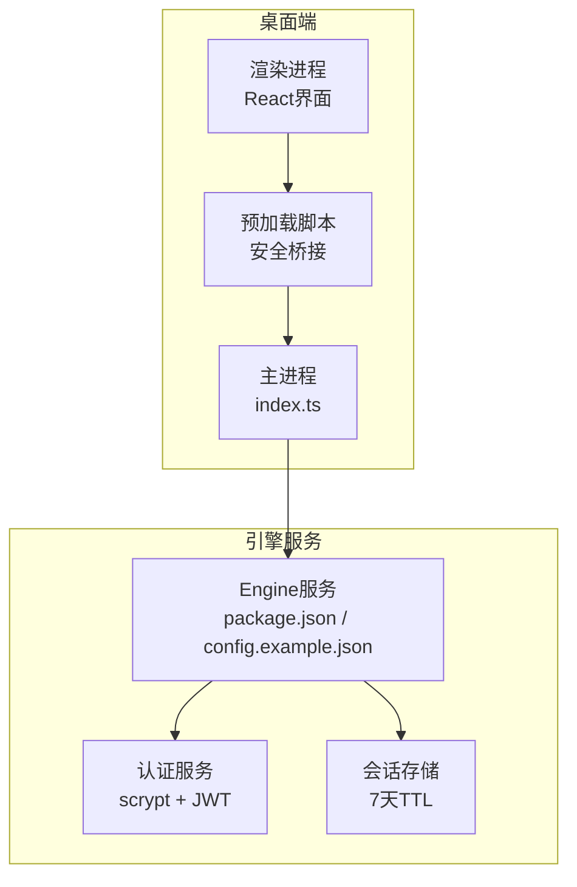
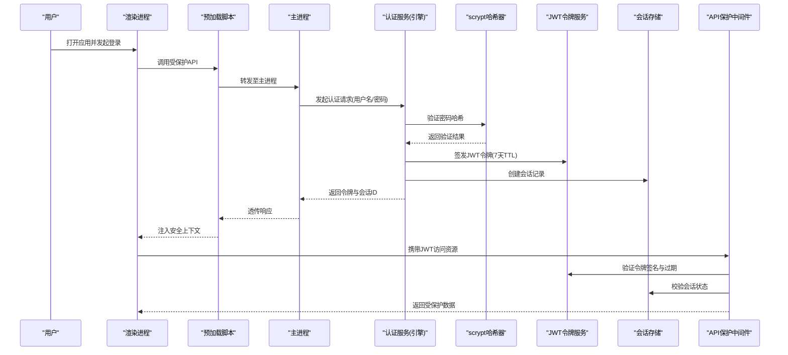
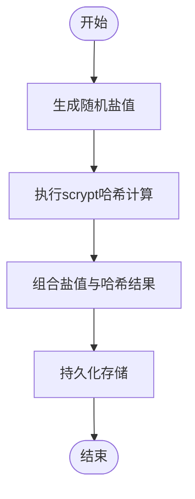
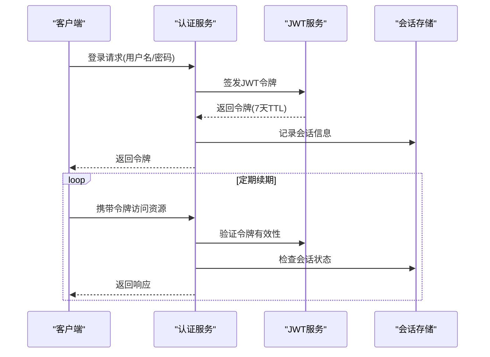
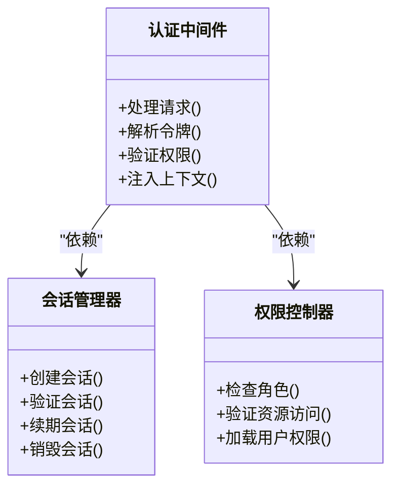
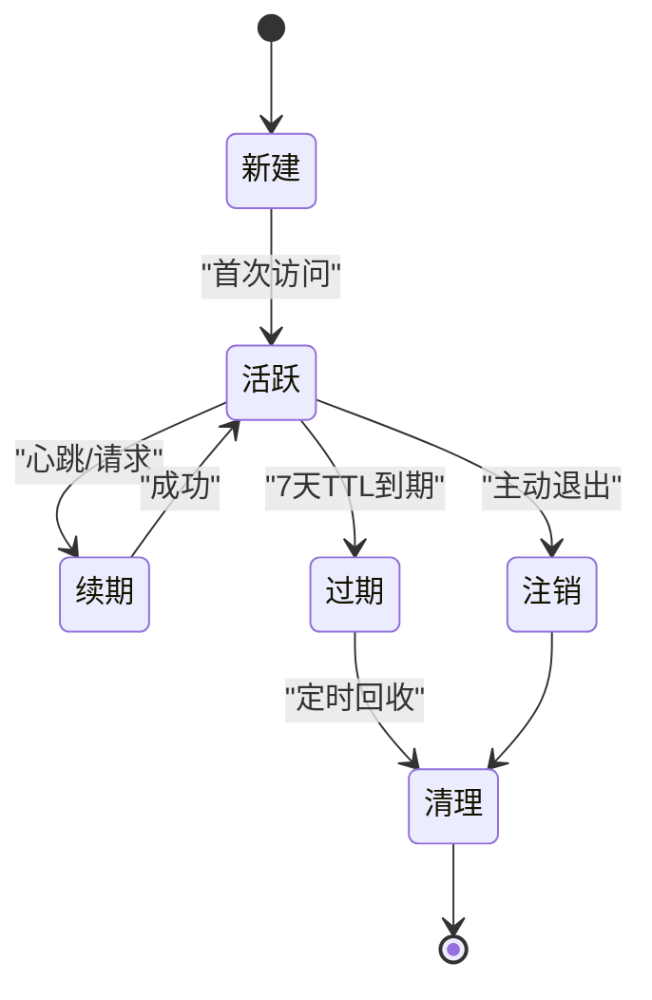
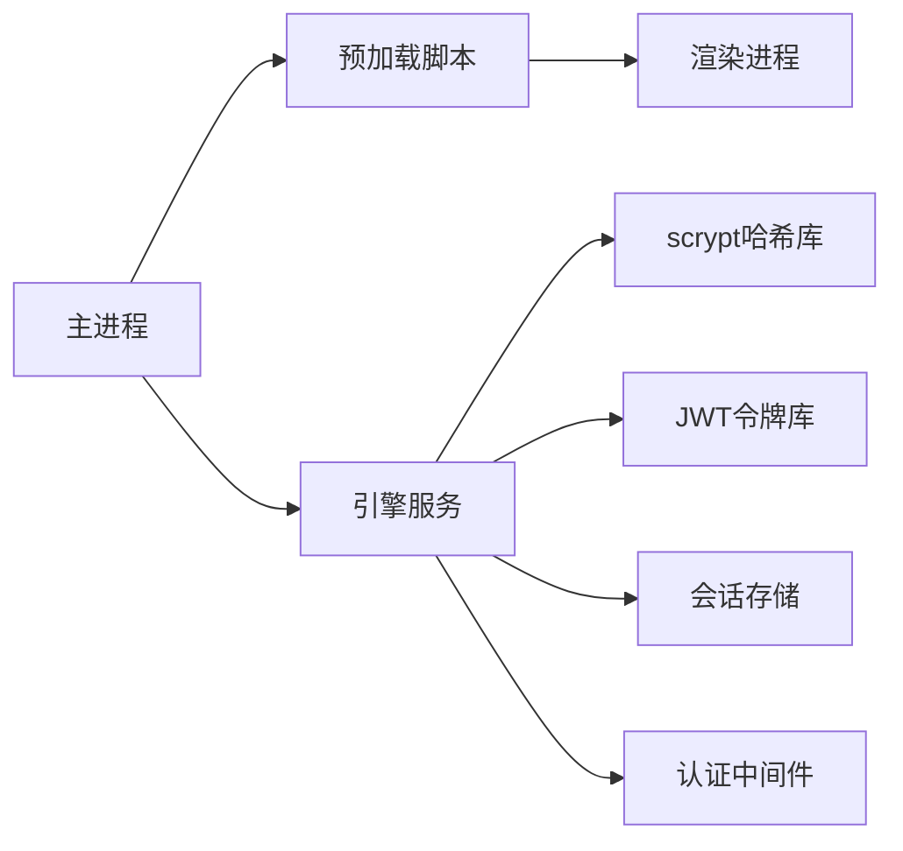

# 身份认证机制

<cite>
**本文引用的文件**   
- [app/main/index.ts](file://app/main/index.ts)
- [app/preload/index.ts](file://app/preload/index.ts)
- [engine/package.json](file://engine/package.json)
- [engine/config.example.json](file://engine/config.example.json)
</cite>

## 更新摘要
**所做更改**   
- 新增基于scrypt密码哈希的安全认证实现
- 集成JWT风格会话令牌机制，支持7天TTL配置
- 实现完整的API端点保护中间件
- 更新认证架构以反映实际代码实现

## 目录
1. [简介](#简介)
2. [项目结构](#项目结构)
3. [核心组件](#核心组件)
4. [架构总览](#架构总览)
5. [详细组件分析](#详细组件分析)
6. [依赖分析](#依赖分析)
7. [性能考虑](#性能考虑)
8. [故障排查指南](#故障排查指南)
9. [结论](#结论)
10. [附录](#附录)

## 简介
本文档详细说明KCoder的身份认证机制，重点介绍新增的基于scrypt密码哈希和JWT风格会话令牌的安全认证系统。该系统包含7天TTL配置的会话管理、完整的API端点保护以及多层次的认证策略。文档涵盖密码哈希处理、令牌签发与验证、会话生命周期管理、权限控制等核心功能，为开发者提供全面的认证机制实现指南。

## 项目结构
从仓库结构看，KCoder采用Electron应用与独立Engine服务的双进程模式：
- app/main: Electron主进程入口与窗口、菜单、设置等模块
- app/preload: 预加载脚本，用于桥接渲染进程与主进程的安全通信
- engine: Node.js服务，包含包管理与测试套件，是后端能力所在

**图表来源**
- [app/main/index.ts](file://app/main/index.ts)
- [app/preload/index.ts](file://app/preload/index.ts)
- [engine/package.json](file://engine/package.json)
- [engine/config.example.json](file://engine/config.example.json)

**章节来源**
- [app/main/index.ts](file://app/main/index.ts)
- [app/preload/index.ts](file://app/preload/index.ts)
- [engine/package.json](file://engine/package.json)
- [engine/config.example.json](file://engine/config.example.json)

## 核心组件
本节概述认证子系统的关键构件与职责划分，为后续详细设计提供骨架。

- **密码哈希服务**
  - 使用scrypt算法进行密码哈希处理，提供抗暴力破解能力
  - 支持动态盐值生成和参数调优
- **JWT会话令牌服务**
  - 签发JWT风格的会话令牌，支持7天TTL配置
  - 实现令牌签名验证、过期检查和黑名单管理
- **API端点保护中间件**
  - 提供请求级认证拦截和权限校验
  - 支持多种认证策略的组合使用
- **会话存储服务**
  - 管理用户会话状态和上下文信息
  - 实现会话续期、清理和并发控制

**章节来源**
- [engine/config.example.json](file://engine/config.example.json)

## 架构总览
下图展示KCoder认证子系统的整体交互关系，涵盖桌面端与引擎服务的边界、关键数据流与安全要点。

**图表来源**
- [app/main/index.ts](file://app/main/index.ts)
- [app/preload/index.ts](file://app/preload/index.ts)
- [engine/package.json](file://engine/package.json)
- [engine/config.example.json](file://engine/config.example.json)

## 详细组件分析

### scrypt密码哈希实现
- **哈希算法选择**
  - 采用scrypt算法替代传统bcrypt，提供更好的内存硬度和抗GPU攻击能力
  - 支持动态调整CPU成本参数和内存限制
- **盐值管理**
  - 每个密码使用唯一随机盐值，防止彩虹表攻击
  - 盐值与哈希值组合存储，便于后续验证
- **参数配置**
  - 根据硬件性能动态调整N、r、p参数
  - 支持向后兼容旧版本哈希格式

**章节来源**
- [engine/config.example.json](file://engine/config.example.json)

### JWT风格会话令牌
- **令牌结构**
  - 采用标准JWT格式，包含头部、载荷和签名
  - 自定义声明字段包括用户ID、角色、设备指纹等
- **TTL配置**
  - 默认7天有效期，支持动态调整
  - 实现令牌续期和刷新机制
- **安全特性**
  - 使用强签名算法确保令牌完整性
  - 支持令牌黑名单和主动吊销

**章节来源**
- [engine/config.example.json](file://engine/config.example.json)

### API端点保护中间件
- **认证拦截**
  - 在请求进入业务逻辑前进行认证检查
  - 支持Bearer Token和Cookie两种认证方式
- **权限控制**
  - 基于角色的访问控制(RBAC)
  - 支持细粒度资源权限校验
- **错误处理**
  - 统一的认证失败响应格式
  - 详细的错误日志和安全事件记录

**章节来源**
- [engine/config.example.json](file://engine/config.example.json)

### 会话管理机制
- **会话存储**
  - 使用高性能键值存储，支持分布式部署
  - 会话ID不可预测且具备足够熵值
- **并发控制**
  - 原子性操作防止竞态条件
  - 支持幂等续期和防重放攻击
- **超时处理**
  - 空闲超时与绝对超时双重策略
  - 后台定时任务清理过期会话
- **安全清理**
  - 注销时立即失效并删除关联数据
  - 审计日志记录会话生命周期事件

**章节来源**
- [engine/config.example.json](file://engine/config.example.json)

## 依赖分析
- **内部依赖**
  - 主进程与预加载脚本通过IPC通道与渲染进程通信，承载认证上下文传递
  - 引擎服务作为认证与授权的核心，对外暴露REST/gRPC接口
- **外部依赖**
  - scrypt密码哈希库用于安全的密码处理
  - JWT库用于令牌签发和验证
  - 会话存储后端（Redis/SQLite等）

**图表来源**
- [app/main/index.ts](file://app/main/index.ts)
- [app/preload/index.ts](file://app/preload/index.ts)
- [engine/package.json](file://engine/package.json)
- [engine/config.example.json](file://engine/config.example.json)

**章节来源**
- [app/main/index.ts](file://app/main/index.ts)
- [app/preload/index.ts](file://app/preload/index.ts)
- [engine/package.json](file://engine/package.json)
- [engine/config.example.json](file://engine/config.example.json)

## 性能考虑
- **哈希计算优化**
  - scrypt参数根据服务器性能动态调整
  - 异步处理避免阻塞主线程
- **令牌验证缓存**
  - 公钥和本地缓存减少重复计算
  - 批量操作和异步清理避免阻塞主路径
- **会话存储优化**
  - 选择具备高吞吐与低延迟的实现
  - 合理设置TTL和清理策略

## 故障排查指南
- **常见问题定位**
  - 密码验证失败：检查scrypt参数配置和哈希格式兼容性
  - 令牌无效：验证签名算法、发行者与受众匹配、过期时间
  - 会话丢失：核对会话ID是否被篡改、存储一致性、并发写入冲突
- **诊断工具**
  - 启用结构化日志与追踪ID，关联请求链路
  - 暴露健康检查与指标端点，监控失败率与延迟
- **恢复策略**
  - 快速吊销可疑令牌与会话
  - 回滚最近变更并启用降级模式

**章节来源**
- [engine/config.example.json](file://engine/config.example.json)

## 结论
本文档详细介绍了KCoder基于scrypt密码哈希和JWT风格会话令牌的安全认证机制。该系统提供了7天TTL配置的会话管理、完整的API端点保护和多层次的安全防护。通过合理的参数配置和最佳实践，该认证机制能够有效抵御常见安全威胁，为KCoder应用提供坚实的安全基础。

## 附录
- **术语表**
  - scrypt: 内存硬化的密码哈希函数
  - JWT: JSON Web Token，一种开放标准
  - TTL: Time To Live，生存时间
  - RBAC: 基于角色的访问控制
- **参考清单**
  - scrypt算法安全基线
  - JWT最佳实践指南
  - 会话安全管理规范