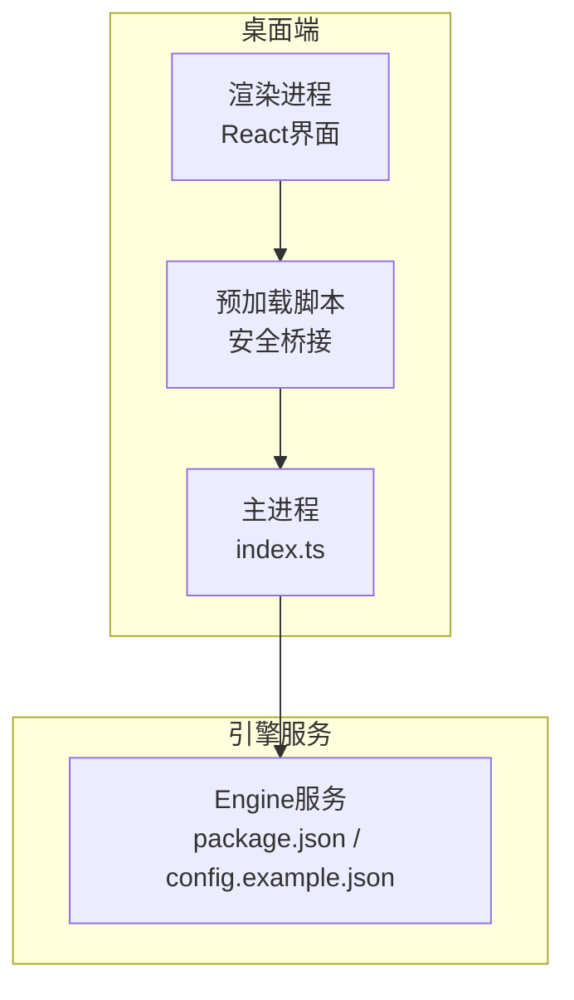
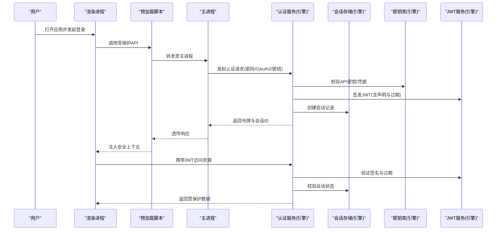
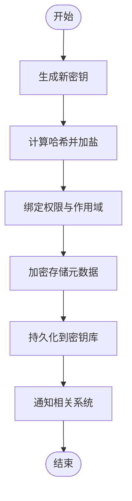
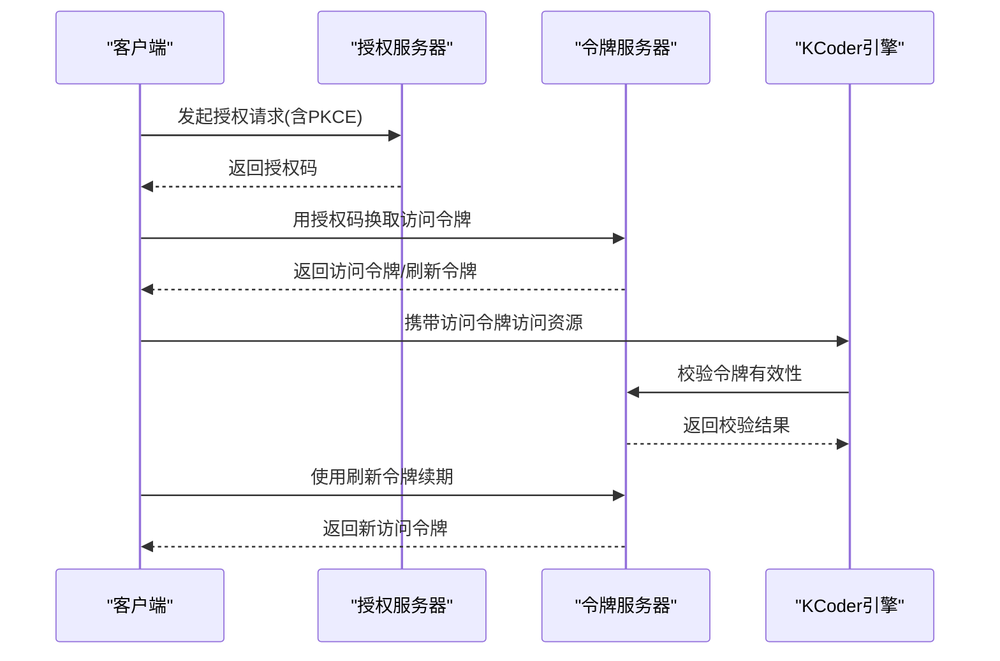
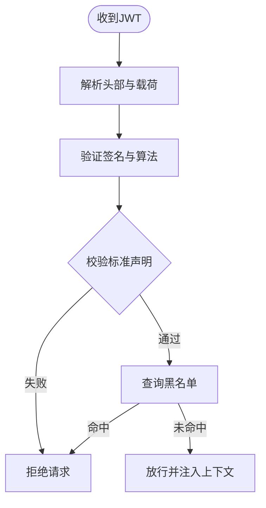
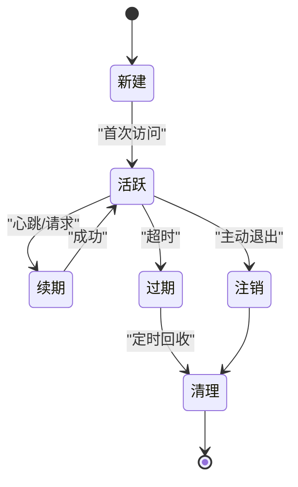
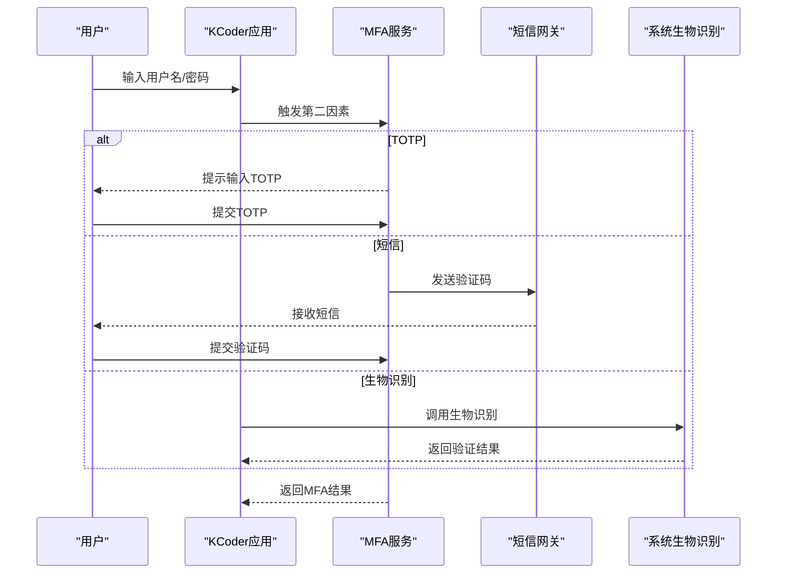
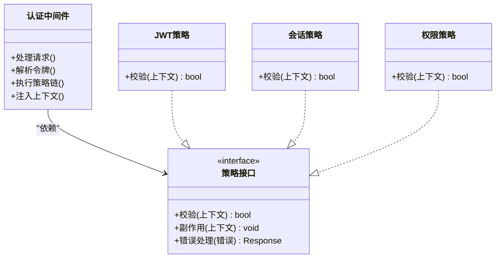
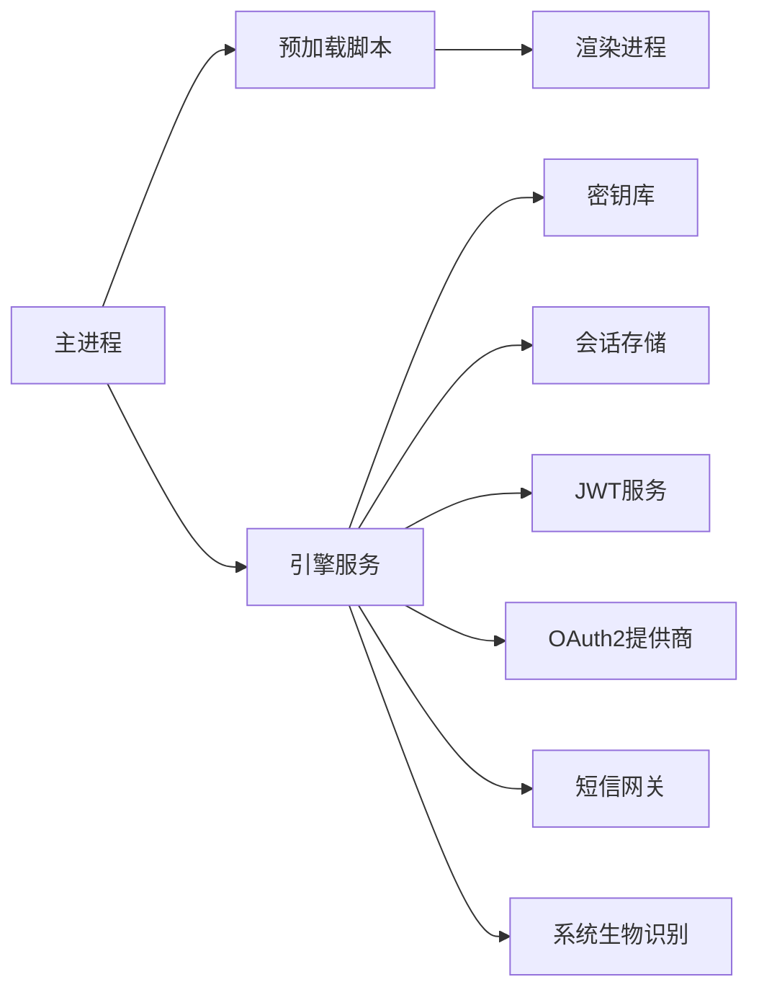

# 身份认证机制

<cite>
**本文引用的文件**   
- [app/main/index.ts](file://app/main/index.ts)
- [app/preload/index.ts](file://app/preload/index.ts)
- [engine/package.json](file://engine/package.json)
- [engine/config.example.json](file://engine/config.example.json)
</cite>

## 目录
1. [简介](#简介)
2. [项目结构](#项目结构)
3. [核心组件](#核心组件)
4. [架构总览](#架构总览)
5. [详细组件分析](#详细组件分析)
6. [依赖分析](#依赖分析)
7. [性能考虑](#性能考虑)
8. [故障排查指南](#故障排查指南)
9. [结论](#结论)
10. [附录](#附录)

## 简介
本文件面向KCoder的身份认证机制，目标是提供一份全面、可操作的技术文档。内容覆盖API密钥管理（生成、存储加密、权限绑定、轮换）、OAuth2集成（授权码/隐式/客户端凭证流程与令牌刷新）、JWT处理（签名验证、过期检查、自定义声明、黑名单）、会话管理（存储、并发控制、超时与安全清理）、多因素认证（TOTP、短信、生物识别），以及认证中间件与自定义策略的开发指南。

需要特别说明的是：在当前仓库中未发现已实现的认证相关源码或配置。因此，本文以“设计蓝图与实现指南”的形式给出，所有建议均基于通用安全实践与工程经验，便于在后续迭代中落地到KCoder的引擎与前端进程中。

## 项目结构
从仓库结构看，KCoder采用Electron应用与独立Engine服务的双进程模式：
- app/main: Electron主进程入口与窗口、菜单、设置等模块
- app/preload: 预加载脚本，用于桥接渲染进程与主进程的安全通信
- engine: Node.js服务，包含包管理与测试套件，是后端能力所在

图表来源
- [app/main/index.ts](file://app/main/index.ts)
- [app/preload/index.ts](file://app/preload/index.ts)
- [engine/package.json](file://engine/package.json)
- [engine/config.example.json](file://engine/config.example.json)

章节来源
- [app/main/index.ts](file://app/main/index.ts)
- [app/preload/index.ts](file://app/preload/index.ts)
- [engine/package.json](file://engine/package.json)
- [engine/config.example.json](file://engine/config.example.json)

## 核心组件
本节概述认证子系统的关键构件与职责划分，为后续详细设计提供骨架。

- API密钥管理服务
  - 负责密钥生命周期：生成、哈希存储、权限绑定、轮换与撤销
- OAuth2授权服务
  - 支持授权码、隐式、客户端凭证三种流程；统一令牌颁发与刷新
- JWT签发与校验服务
  - 负责签名算法选择、载荷构造、过期校验、黑名单查询
- 会话存储服务
  - 提供会话创建、更新、续期、清理与并发控制
- 多因素认证服务
  - 集成TOTP、短信验证码、生物识别（平台能力）
- 认证中间件与策略框架
  - 提供可插拔的认证策略与请求级鉴权中间件

章节来源
- [engine/config.example.json](file://engine/config.example.json)

## 架构总览
下图展示KCoder认证子系统的整体交互关系，涵盖桌面端与引擎服务的边界、关键数据流与安全要点。

图表来源
- [app/main/index.ts](file://app/main/index.ts)
- [app/preload/index.ts](file://app/preload/index.ts)
- [engine/package.json](file://engine/package.json)
- [engine/config.example.json](file://engine/config.example.json)

## 详细组件分析

### API密钥管理
- 密钥生成
  - 使用强随机源生成高熵字符串，长度与字符集满足安全基线
  - 可选前缀区分用途与环境（开发/生产）
- 存储加密
  - 仅存储密钥的单向哈希值；引入盐值与自适应哈希函数
  - 对敏感元数据（如创建时间、最后使用时间）进行加密存储
- 权限绑定
  - 将密钥与角色/作用域绑定，最小权限原则
  - 支持按资源维度细粒度授权
- 轮换策略
  - 支持计划内轮换与紧急吊销；旧密钥保留过渡期
  - 自动通知与审计日志记录

章节来源
- [engine/config.example.json](file://engine/config.example.json)

### OAuth2集成
- 授权码流程
  - 适用于有服务端的应用场景；通过重定向获取授权码后换取令牌
  - 强制PKCE以增强安全性
- 隐式流程
  - 适用于纯前端场景；不推荐但兼容旧系统；需严格限制作用域与短过期
- 客户端凭证流程
  - 适用于机器间通信；使用客户端ID与密钥直接换取令牌
- 令牌刷新
  - 支持刷新令牌轮转；失败时要求重新授权
  - 刷新频率与并发刷新需做去抖与幂等处理

章节来源
- [engine/config.example.json](file://engine/config.example.json)

### JWT令牌处理
- 签名验证
  - 选择安全的签名算法（如RS256/ES256），避免弱算法
  - 校验签名、发行者、受众、作用域等标准声明
- 过期检查
  - 拒绝过期令牌；支持时钟容差与本地时间同步
- 自定义声明
  - 扩展必要业务字段（如租户、角色、设备指纹）
  - 严格控制载荷大小与敏感信息暴露
- 黑名单管理
  - 支持短期吊销列表（内存+持久化）
  - 结合会话失效与主动吊销事件

章节来源
- [engine/config.example.json](file://engine/config.example.json)

### 会话管理机制
- 会话存储
  - 使用高性能键值存储（内存/Redis/SQLite）
  - 会话ID不可预测且定期轮换
- 并发控制
  - 原子性更新与写锁，防止竞态条件
  - 支持幂等续期与防重放
- 超时处理
  - 空闲超时与绝对超时双重策略
  - 后台定时任务清理过期会话
- 安全清理
  - 注销时立即失效并删除关联数据
  - 审计日志记录会话生命周期事件

章节来源
- [engine/config.example.json](file://engine/config.example.json)

### 多因素认证
- TOTP集成
  - 基于时间的一次性密码；支持二维码注册与备用码
- 短信验证
  - 发送一次性验证码；限频与风控策略
- 生物识别
  - 利用操作系统提供的生物识别能力（指纹/面容）
  - 作为第二因素或解锁本地缓存的辅助手段

章节来源
- [engine/config.example.json](file://engine/config.example.json)

### 认证中间件与自定义策略
- 中间件职责
  - 解析请求头中的令牌/会话标识
  - 执行策略链（JWT校验、会话校验、权限校验）
  - 注入安全上下文并统一错误响应
- 自定义策略
  - 定义策略接口（校验、副作用、错误处理）
  - 组合策略以实现复杂场景（如按租户隔离、按IP白名单）
- 开发指南
  - 遵循最小权限与无状态原则
  - 提供单元测试与集成测试用例
  - 输出结构化日志与指标

章节来源
- [engine/config.example.json](file://engine/config.example.json)

## 依赖分析
- 内部依赖
  - 主进程与预加载脚本通过IPC通道与渲染进程通信，承载认证上下文传递
  - 引擎服务作为认证与授权的核心，对外暴露REST/gRPC接口
- 外部依赖
  - 密钥库/令牌库/会话存储（可替换为不同实现）
  - 第三方OAuth2提供商与短信网关
  - 操作系统生物识别能力

图表来源
- [app/main/index.ts](file://app/main/index.ts)
- [app/preload/index.ts](file://app/preload/index.ts)
- [engine/package.json](file://engine/package.json)
- [engine/config.example.json](file://engine/config.example.json)

章节来源
- [app/main/index.ts](file://app/main/index.ts)
- [app/preload/index.ts](file://app/preload/index.ts)
- [engine/package.json](file://engine/package.json)
- [engine/config.example.json](file://engine/config.example.json)

## 性能考虑
- 令牌校验尽量无状态，优先使用公钥校验与本地缓存
- 会话存储选择具备高吞吐与低延迟的实现，必要时分层缓存
- 批量操作与异步清理避免阻塞主路径
- 合理设置超时与重试退避，降低雪崩风险

[本节为通用指导，无需具体文件引用]

## 故障排查指南
- 常见问题定位
  - 令牌无效：检查签名算法、发行者与受众匹配、过期时间与时钟同步
  - 会话丢失：核对会话ID是否被篡改、存储一致性、并发写入冲突
  - 权限不足：确认权限绑定与作用域范围是否正确
- 诊断工具
  - 启用结构化日志与追踪ID，关联请求链路
  - 暴露健康检查与指标端点，监控失败率与延迟
- 恢复策略
  - 快速吊销可疑令牌与会话
  - 回滚最近变更并启用降级模式

章节来源
- [engine/config.example.json](file://engine/config.example.json)

## 结论
本文提供了KCoder身份认证机制的系统化设计与实现指南，覆盖密钥管理、OAuth2、JWT、会话、多因素认证与中间件策略。建议在后续迭代中逐步落地上述方案，并通过完善的测试与观测体系保障安全与稳定性。

[本节为总结性内容，无需具体文件引用]

## 附录
- 术语表
  - PKCE: 用于增强授权码流程安全性的扩展
  - TOTP: 基于时间的一次性密码算法
  - 作用域: 限定令牌访问范围的字符串集合
- 参考清单
  - 安全基线与最佳实践（通用）
  - 各平台生物识别能力文档（通用）

[本节为补充信息，无需具体文件引用]