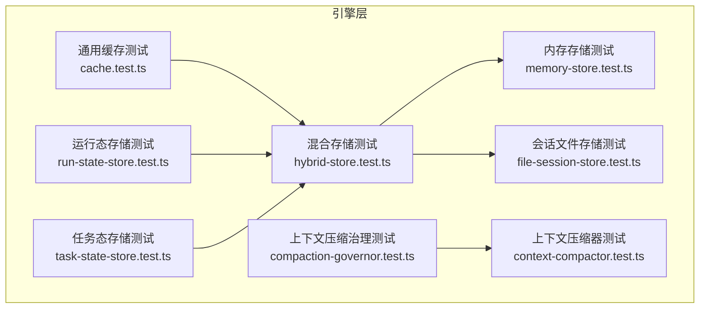
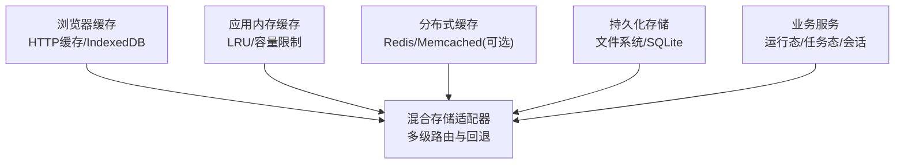
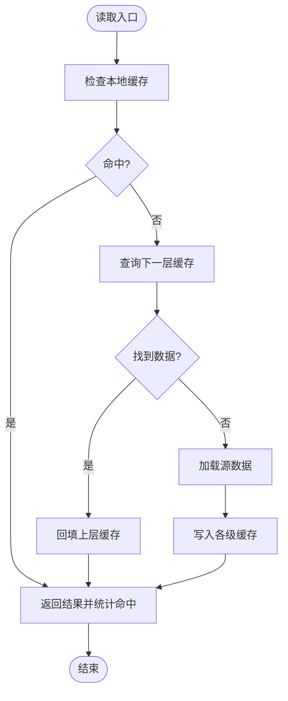
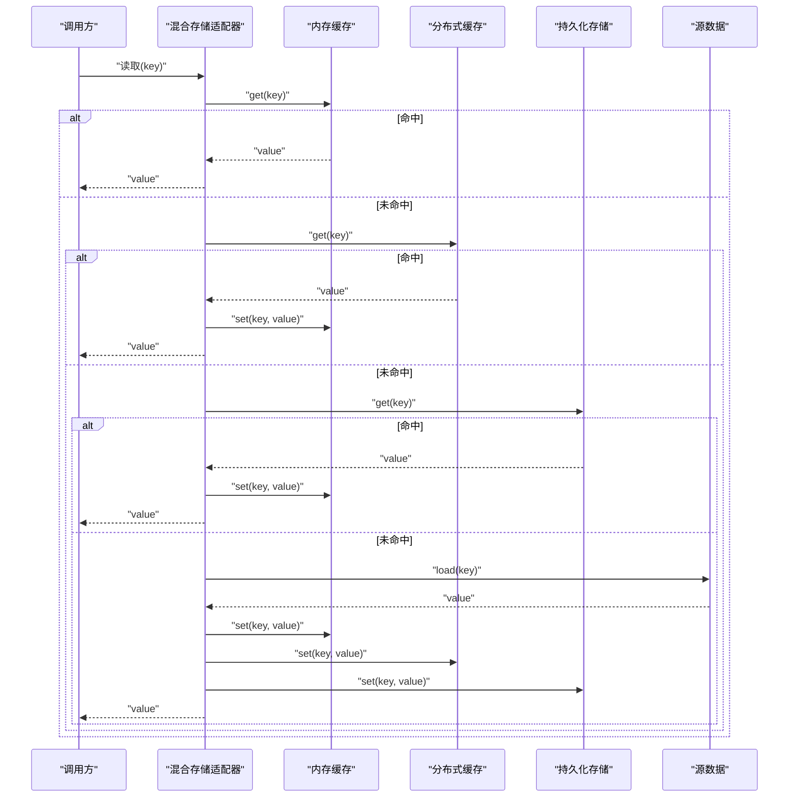
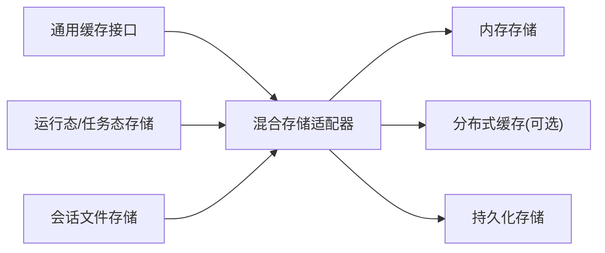

# 缓存策略

<cite>
**本文引用的文件**   
- [cache.test.ts](file://engine/tests/cache.test.ts)
- [hybrid-store.test.ts](file://engine/tests/hybrid-store.test.ts)
- [memory-store.test.ts](file://engine/tests/memory-store.test.ts)
- [run-state-store.test.ts](file://engine/tests/run-state-store.test.ts)
- [task-state-store.test.ts](file://engine/tests/task-state-store.test.ts)
- [file-session-store.test.ts](file://engine/tests/file-session-store.test.ts)
- [compaction-governor.test.ts](file://engine/tests/compaction-governor.test.ts)
- [context-compactor.test.ts](file://engine/tests/context-compactor.test.ts)
</cite>

## 目录
1. [简介](#简介)
2. [项目结构](#项目结构)
3. [核心组件](#核心组件)
4. [架构总览](#架构总览)
5. [详细组件分析](#详细组件分析)
6. [依赖关系分析](#依赖关系分析)
7. [性能考量](#性能考量)
8. [故障排查指南](#故障排查指南)
9. [结论](#结论)
10. [附录](#附录)

## 简介
本技术文档围绕KCoder的缓存策略，系统化阐述多级缓存架构（浏览器缓存、应用内存缓存、分布式缓存）的协同工作机制；深入说明缓存失效策略（TTL过期、LRU淘汰、主动失效通知）；介绍缓存预热与预取策略（热点预测、智能预加载、命中率优化）；解释缓存一致性保证（版本控制、冲突解决、数据同步）；并提供监控与调试工具的使用指南（命中率统计、内存使用分析、性能影响评估）。

由于仓库中未直接提供生产级缓存实现源码，本文以测试用例为线索，结合工程上下文进行架构化分析与最佳实践建议，帮助读者理解并落地一套可观测、可扩展、高一致性的多级缓存体系。

## 项目结构
从仓库结构看，缓存相关能力主要分布在引擎层（engine）的测试套件中，涉及通用缓存、混合存储、内存存储、运行态与任务态持久化、会话文件存储以及上下文压缩治理等主题。这些测试用例反映了系统对“内存+持久化”的多级存储抽象与组合方式，可作为构建多级缓存体系的参考基线。

图表来源
- [cache.test.ts](file://engine/tests/cache.test.ts)
- [hybrid-store.test.ts](file://engine/tests/hybrid-store.test.ts)
- [memory-store.test.ts](file://engine/tests/memory-store.test.ts)
- [run-state-store.test.ts](file://engine/tests/run-state-store.test.ts)
- [task-state-store.test.ts](file://engine/tests/task-state-store.test.ts)
- [file-session-store.test.ts](file://engine/tests/file-session-store.test.ts)
- [compaction-governor.test.ts](file://engine/tests/compaction-governor.test.ts)
- [context-compactor.test.ts](file://engine/tests/context-compactor.test.ts)

章节来源
- [cache.test.ts](file://engine/tests/cache.test.ts)
- [hybrid-store.test.ts](file://engine/tests/hybrid-store.test.ts)
- [memory-store.test.ts](file://engine/tests/memory-store.test.ts)
- [run-state-store.test.ts](file://engine/tests/run-state-store.test.ts)
- [task-state-store.test.ts](file://engine/tests/task-state-store.test.ts)
- [file-session-store.test.ts](file://engine/tests/file-session-store.test.ts)
- [compaction-governor.test.ts](file://engine/tests/compaction-governor.test.ts)
- [context-compactor.test.ts](file://engine/tests/context-compactor.test.ts)

## 核心组件
基于测试用例的覆盖范围，可将缓存相关核心组件归纳如下：
- 通用缓存接口与行为契约：定义统一的读写、过期、统计等能力，作为上层业务与底层存储的解耦点。
- 混合存储适配器：将内存缓存与持久化存储组合，形成“内存优先、持久化兜底”的多级缓存路径。
- 内存存储：提供高性能键值存取，支持容量上限与淘汰策略（如LRU）。
- 运行态/任务态存储：面向运行时状态与任务状态的持久化与恢复，保障崩溃恢复与跨进程一致性。
- 会话文件存储：将会话数据落盘，用于离线分析、审计与长生命周期数据的冷备。
- 上下文压缩与治理：在上下文增长到阈值时触发压缩或裁剪，降低缓存体积与I/O压力。

章节来源
- [cache.test.ts](file://engine/tests/cache.test.ts)
- [hybrid-store.test.ts](file://engine/tests/hybrid-store.test.ts)
- [memory-store.test.ts](file://engine/tests/memory-store.test.ts)
- [run-state-store.test.ts](file://engine/tests/run-state-store.test.ts)
- [task-state-store.test.ts](file://engine/tests/task-state-store.test.ts)
- [file-session-store.test.ts](file://engine/tests/file-session-store.test.ts)
- [compaction-governor.test.ts](file://engine/tests/compaction-governor.test.ts)
- [context-compactor.test.ts](file://engine/tests/context-compactor.test.ts)

## 架构总览
下图展示KCoder多级缓存的总体架构：浏览器端缓存负责静态资源与轻量配置；应用内存缓存承担热数据快速访问；分布式缓存（可选）用于多实例共享与跨会话复用；持久化层（文件/数据库）提供容灾与回放能力。混合存储适配器屏蔽底层差异，向上暴露统一API。

图表来源
- [hybrid-store.test.ts](file://engine/tests/hybrid-store.test.ts)
- [memory-store.test.ts](file://engine/tests/memory-store.test.ts)
- [file-session-store.test.ts](file://engine/tests/file-session-store.test.ts)
- [run-state-store.test.ts](file://engine/tests/run-state-store.test.ts)
- [task-state-store.test.ts](file://engine/tests/task-state-store.test.ts)

## 详细组件分析

### 通用缓存组件
- 职责边界
  - 提供统一的读/写/删除/统计接口。
  - 封装TTL语义与命中/未命中指标采集。
  - 为上层业务屏蔽具体存储实现。
- 关键能力
  - TTL过期：写入时携带过期时间，读取时校验是否过期。
  - LRU淘汰：达到容量上限时按最近最少使用原则淘汰。
  - 主动失效：支持按Key或前缀批量失效，便于发布期或事件驱动场景。
  - 统计与可观测性：记录命中率、延迟分布、淘汰次数等。
- 典型流程
  - 读取：检查本地命中→若未命中则回退至下一层→回填上层。
  - 写入：先写上层→异步下沉至下层→更新统计。
  - 失效：广播失效事件→各层清理对应条目。

图表来源
- [cache.test.ts](file://engine/tests/cache.test.ts)

章节来源
- [cache.test.ts](file://engine/tests/cache.test.ts)

### 混合存储适配器
- 设计要点
  - 多级路由：根据Key特征、访问频率、数据大小选择目标层级。
  - 回退策略：上层不可用或未命中时自动降级到下一层。
  - 一致性窗口：允许短暂不一致，通过版本号或时间戳在读取侧合并。
- 典型路径
  - 读路径：内存→分布式→持久化→源站。
  - 写路径：内存→异步落盘/分发至分布式。
  - 失效路径：事件驱动，逐层清理。
- 与上下文压缩联动
  - 当上下文过大时触发压缩，减少缓存占用与I/O开销。

图表来源
- [hybrid-store.test.ts](file://engine/tests/hybrid-store.test.ts)
- [memory-store.test.ts](file://engine/tests/memory-store.test.ts)
- [file-session-store.test.ts](file://engine/tests/file-session-store.test.ts)

章节来源
- [hybrid-store.test.ts](file://engine/tests/hybrid-store.test.ts)
- [memory-store.test.ts](file://engine/tests/memory-store.test.ts)
- [file-session-store.test.ts](file://engine/tests/file-session-store.test.ts)

### 内存存储组件
- 特性
  - 低延迟、高吞吐的键值存取。
  - 容量上限与LRU淘汰策略。
  - 支持批量操作与原子失效。
- 适用场景
  - 热点会话片段、模型提示词、中间计算结果。
- 注意事项
  - 内存占用需严格监控，避免OOM。
  - 大对象应序列化压缩后再入存。

章节来源
- [memory-store.test.ts](file://engine/tests/memory-store.test.ts)

### 运行态与任务态存储
- 运行态存储
  - 保存执行上下文、调度状态、中间产物，保障崩溃恢复与幂等重放。
- 任务态存储
  - 管理任务生命周期、依赖图、重试策略与结果聚合。
- 与缓存的关系
  - 运行态/任务态常作为“强一致”的数据源，缓存层在其之上做加速。
  - 变更时需及时失效相关缓存，避免脏读。

章节来源
- [run-state-store.test.ts](file://engine/tests/run-state-store.test.ts)
- [task-state-store.test.ts](file://engine/tests/task-state-store.test.ts)

### 会话文件存储
- 作用
  - 将会话数据持久化到文件，便于审计、回溯与离线分析。
- 与缓存协作
  - 冷数据落盘，热数据驻留内存；读取时按需加载。
- 可靠性
  - 原子写入、损坏检测与恢复机制。

章节来源
- [file-session-store.test.ts](file://engine/tests/file-session-store.test.ts)

### 上下文压缩与治理
- 目标
  - 控制上下文体积，提升缓存命中率与I/O效率。
- 策略
  - 定时或阈值触发压缩；保留关键信息，丢弃冗余历史。
  - 治理器协调压缩时机与资源占用。
- 收益
  - 降低内存与磁盘占用，缩短序列化/反序列化耗时。

章节来源
- [compaction-governor.test.ts](file://engine/tests/compaction-governor.test.ts)
- [context-compactor.test.ts](file://engine/tests/context-compactor.test.ts)

## 依赖关系分析
- 耦合与内聚
  - 混合存储适配器对内聚了多级路由与回退逻辑，对外仅暴露统一接口，降低业务耦合。
  - 内存存储与持久化存储通过适配器隔离，替换成本低。
- 外部依赖
  - 分布式缓存（可选）引入网络延迟与分区容忍问题，需在一致性窗口与可用性之间权衡。
  - 文件存储受限于磁盘IO，适合冷数据与归档。
- 潜在循环依赖
  - 应避免业务层直接依赖具体存储实现，统一通过适配器与接口交互。

图表来源
- [hybrid-store.test.ts](file://engine/tests/hybrid-store.test.ts)
- [memory-store.test.ts](file://engine/tests/memory-store.test.ts)
- [file-session-store.test.ts](file://engine/tests/file-session-store.test.ts)
- [run-state-store.test.ts](file://engine/tests/run-state-store.test.ts)
- [task-state-store.test.ts](file://engine/tests/task-state-store.test.ts)

章节来源
- [hybrid-store.test.ts](file://engine/tests/hybrid-store.test.ts)
- [memory-store.test.ts](file://engine/tests/memory-store.test.ts)
- [file-session-store.test.ts](file://engine/tests/file-session-store.test.ts)
- [run-state-store.test.ts](file://engine/tests/run-state-store.test.ts)
- [task-state-store.test.ts](file://engine/tests/task-state-store.test.ts)

## 性能考量
- 命中率优化
  - 合理设置TTL，避免过早失效导致频繁回源。
  - 热点数据常驻内存，冷数据落盘。
  - 预取与预热：基于访问模式预测热点，提前加载。
- 容量与淘汰
  - 内存上限与LRU参数调优，防止抖动与抖动放大。
  - 大对象分片与压缩，减少内存峰值。
- I/O与并发
  - 异步下沉与批处理，降低写放大。
  - 读路径尽量只读不锁，写路径采用无锁队列或分段锁。
- 一致性窗口
  - 允许短暂不一致，通过版本号/时间戳在读取侧合并，提高可用性。

[本节为通用指导，无需代码来源]

## 故障排查指南
- 常见问题定位
  - 命中率异常下降：检查TTL设置、热点变化、预热策略是否生效。
  - 内存飙升：确认LRU阈值、对象大小、是否存在泄漏。
  - 一致性错误：核对版本号/时间戳、失效广播是否送达。
  - 回源风暴：观察缓存击穿保护、限流与熔断策略。
- 监控指标
  - 命中率、P95/P99延迟、淘汰次数、回源率、内存占用、磁盘I/O。
- 调试手段
  - 开启详细日志与TraceID，关联一次请求的全链路。
  - 针对可疑Key进行采样与快照，对比不同层级数据。
  - 压测回归：模拟热点突增与突发流量，验证稳定性。

[本节为通用指导，无需代码来源]

## 结论
KCoder的缓存体系以“内存优先、持久化兜底、可选分布式共享”的多级架构为核心，通过混合存储适配器屏蔽底层差异，配合TTL/LRU/主动失效与上下文压缩治理，兼顾性能与一致性。建议在工程中完善监控与可观测性，建立预热与预取策略，持续优化命中率与资源占用，确保在高负载下的稳定表现。

[本节为总结性内容，无需代码来源]

## 附录
- 术语
  - TTL：生存时间，超过后视为过期。
  - LRU：最近最少使用，淘汰最久未被访问的条目。
  - 回源：缓存未命中时向下一层或源站获取数据。
  - 一致性窗口：允许短暂不一致的时间范围。
- 参考测试用例
  - 通用缓存、混合存储、内存存储、运行态/任务态存储、会话文件存储、上下文压缩与治理等测试用例覆盖了上述能力的设计意图与验收标准。

章节来源
- [cache.test.ts](file://engine/tests/cache.test.ts)
- [hybrid-store.test.ts](file://engine/tests/hybrid-store.test.ts)
- [memory-store.test.ts](file://engine/tests/memory-store.test.ts)
- [run-state-store.test.ts](file://engine/tests/run-state-store.test.ts)
- [task-state-store.test.ts](file://engine/tests/task-state-store.test.ts)
- [file-session-store.test.ts](file://engine/tests/file-session-store.test.ts)
- [compaction-governor.test.ts](file://engine/tests/compaction-governor.test.ts)
- [context-compactor.test.ts](file://engine/tests/context-compactor.test.ts)