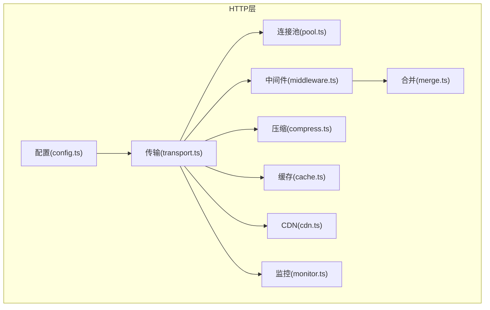
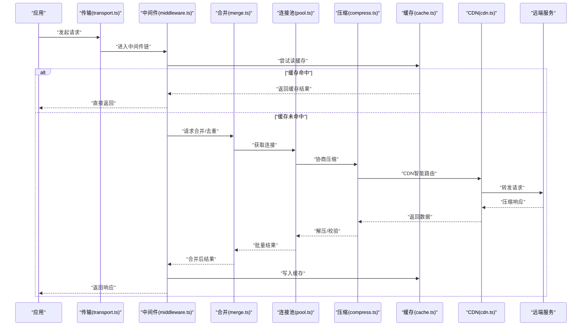
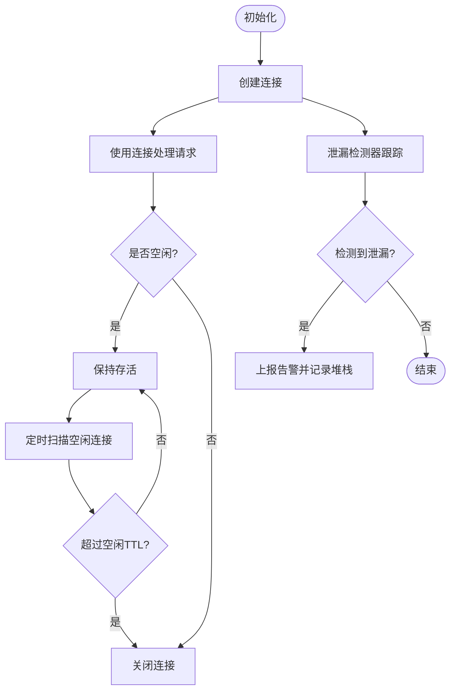
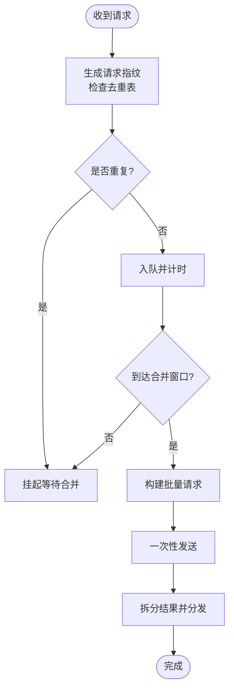
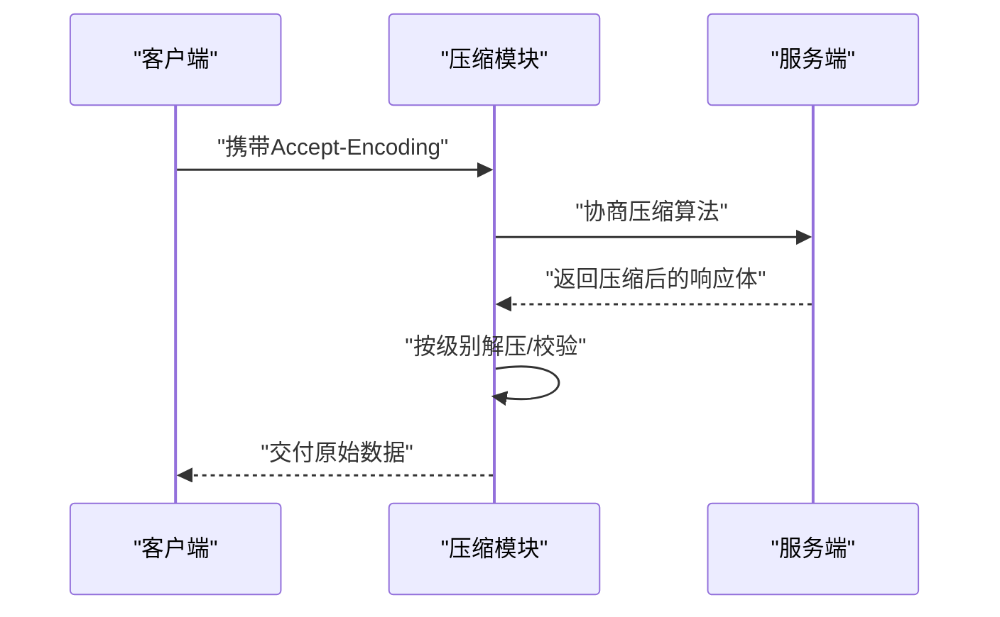
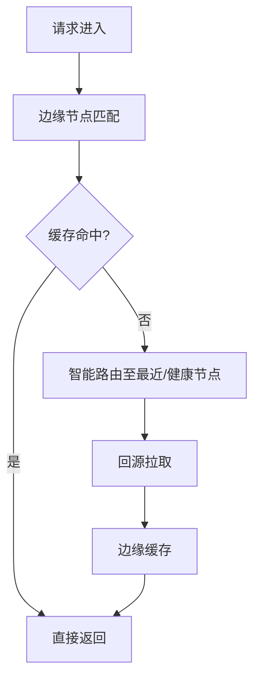
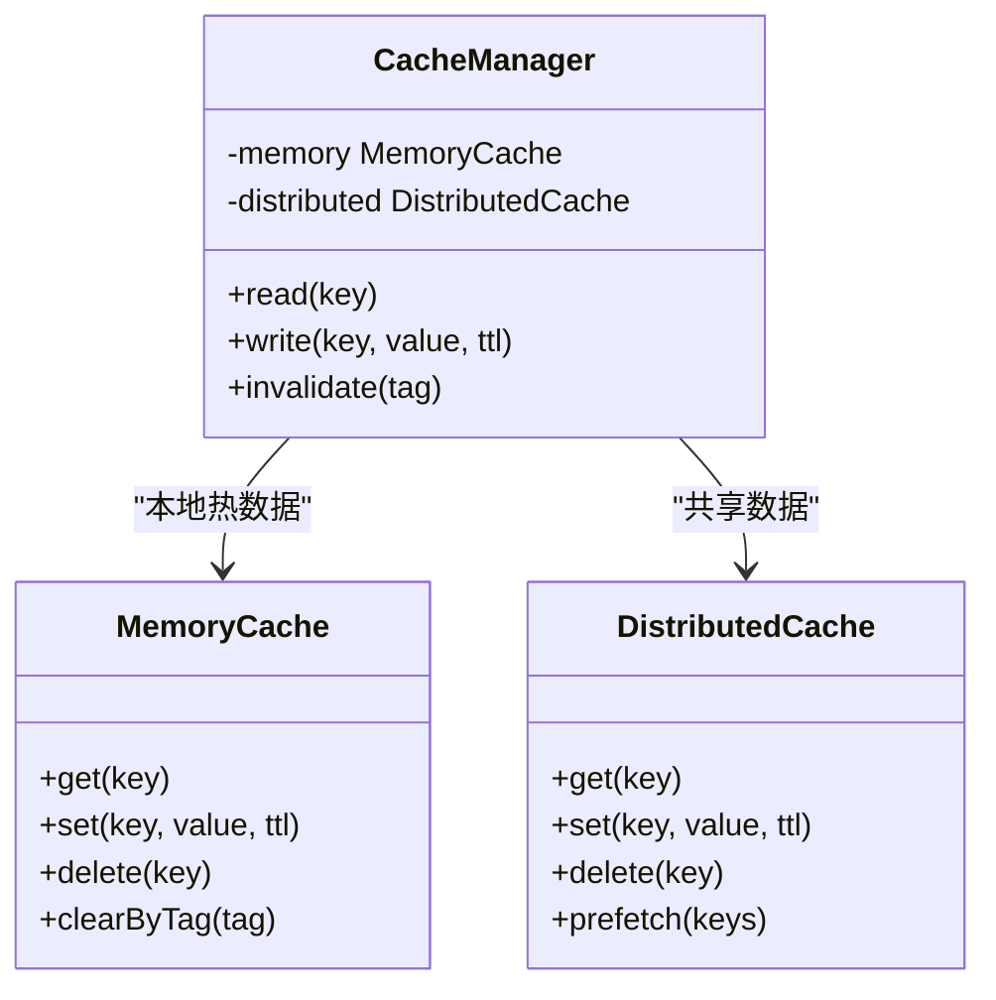
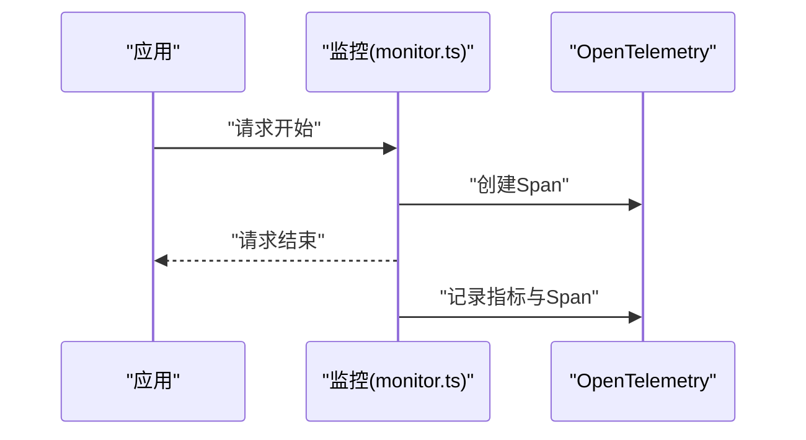
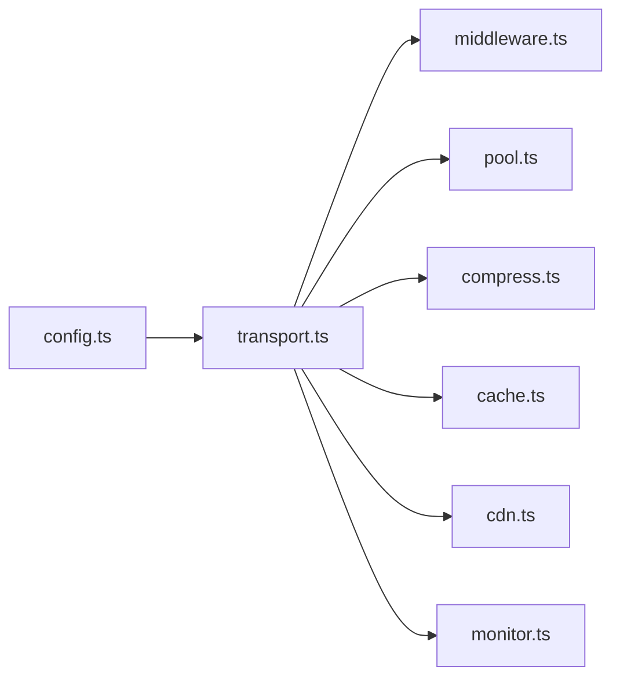

# 网络性能优化

<cite>
**本文引用的文件**   
- [engine/packages/http-layer/src/index.ts](file://engine/packages/http-layer/src/index.ts)
- [engine/packages/http-layer/src/transport.ts](file://engine/packages/http-layer/src/transport.ts)
- [engine/packages/http-layer/src/cache.ts](file://engine/packages/http-layer/src/cache.ts)
- [engine/packages/http-layer/src/compress.ts](file://engine/packages/http-layer/src/compress.ts)
- [engine/packages/http-layer/src/middleware.ts](file://engine/packages/http-layer/src/middleware.ts)
- [engine/packages/http-layer/src/pool.ts](file://engine/packages/http-layer/src/pool.ts)
- [engine/packages/http-layer/src/merge.ts](file://engine/packages/http-layer/src/merge.ts)
- [engine/packages/http-layer/src/monitor.ts](file://engine/packages/http-layer/src/monitor.ts)
- [engine/packages/http-layer/src/cdn.ts](file://engine/packages/http-layer/src/cdn.ts)
- [engine/packages/http-layer/src/config.ts](file://engine/packages/http-layer/src/config.ts)
- [engine/tests/http-server.test.ts](file://engine/tests/http-server.test.ts)
- [engine/tests/http-artifacts.test.ts](file://engine/tests/http-artifacts.test.ts)
- [engine/tests/cache.test.ts](file://engine/tests/cache.test.ts)
- [engine/tests/opentelemetry.test.ts](file://engine/tests/opentelemetry.test.ts)
</cite>

## 目录
1. [简介](#简介)
2. [项目结构](#项目结构)
3. [核心组件](#核心组件)
4. [架构总览](#架构总览)
5. [详细组件分析](#详细组件分析)
6. [依赖关系分析](#依赖关系分析)
7. [性能考量](#性能考量)
8. [故障排查指南](#故障排查指南)
9. [结论](#结论)
10. [附录](#附录)

## 简介
本技术文档聚焦于KCoder在网络层的性能优化，围绕连接池、请求合并、压缩传输、CDN集成与缓存策略展开，并提供监控与性能分析工具的使用建议以及调优最佳实践。目标读者包括后端工程师、平台工程师与对网络性能敏感的前端/客户端开发者。

## 项目结构
KCoder的网络层主要位于 engine/packages/http-layer 中，采用分层与模块化设计：
- 传输与连接池：负责HTTP连接复用、池大小控制、空闲清理与泄漏检测
- 中间件与合并：实现请求去重、批量合并与延迟合并
- 压缩与内容协商：支持Gzip/Brotli压缩与动态协商
- CDN与缓存：静态资源缓存、边缘计算与智能路由；内存/分布式缓存、失效与预热
- 可观测性：指标采集、链路追踪与错误率统计

图表来源
- [engine/packages/http-layer/src/config.ts](file://engine/packages/http-layer/src/config.ts)
- [engine/packages/http-layer/src/transport.ts](file://engine/packages/http-layer/src/transport.ts)
- [engine/packages/http-layer/src/pool.ts](file://engine/packages/http-layer/src/pool.ts)
- [engine/packages/http-layer/src/middleware.ts](file://engine/packages/http-layer/src/middleware.ts)
- [engine/packages/http-layer/src/merge.ts](file://engine/packages/http-layer/src/merge.ts)
- [engine/packages/http-layer/src/compress.ts](file://engine/packages/http-layer/src/compress.ts)
- [engine/packages/http-layer/src/cache.ts](file://engine/packages/http-layer/src/cache.ts)
- [engine/packages/http-layer/src/cdn.ts](file://engine/packages/http-layer/src/cdn.ts)
- [engine/packages/http-layer/src/monitor.ts](file://engine/packages/http-layer/src/monitor.ts)

章节来源
- [engine/packages/http-layer/src/index.ts](file://engine/packages/http-layer/src/index.ts)

## 核心组件
- 连接池：基于HTTP代理或原生Agent实现连接复用，提供最大并发、最小空闲、超时回收与泄漏告警能力
- 请求合并：在时间窗口内聚合相同或相似请求，执行去重与批量发送，降低下游压力
- 压缩传输：根据Accept-Encoding协商Gzip/Brotli，按响应体大小与CPU预算选择压缩级别
- CDN集成：静态资源命中边缘节点，结合智能路由与回源降级
- 缓存策略：内存LRU与可选的分布式缓存（如Redis），支持TTL、标签失效与预热
- 监控与可观测性：耗时、吞吐、错误率、连接池状态、缓存命中率等指标上报

章节来源
- [engine/packages/http-layer/src/pool.ts](file://engine/packages/http-layer/src/pool.ts)
- [engine/packages/http-layer/src/merge.ts](file://engine/packages/http-layer/src/merge.ts)
- [engine/packages/http-layer/src/compress.ts](file://engine/packages/http-layer/src/compress.ts)
- [engine/packages/http-layer/src/cdn.ts](file://engine/packages/http-layer/src/cdn.ts)
- [engine/packages/http-layer/src/cache.ts](file://engine/packages/http-layer/src/cache.ts)
- [engine/packages/http-layer/src/monitor.ts](file://engine/packages/http-layer/src/monitor.ts)

## 架构总览
下图展示了从应用发起请求到最终返回响应的关键路径，包含连接池、中间件、合并、压缩、缓存与CDN的协作关系。

图表来源
- [engine/packages/http-layer/src/transport.ts](file://engine/packages/http-layer/src/transport.ts)
- [engine/packages/http-layer/src/middleware.ts](file://engine/packages/http-layer/src/middleware.ts)
- [engine/packages/http-layer/src/merge.ts](file://engine/packages/http-layer/src/merge.ts)
- [engine/packages/http-layer/src/pool.ts](file://engine/packages/http-layer/src/pool.ts)
- [engine/packages/http-layer/src/compress.ts](file://engine/packages/http-layer/src/compress.ts)
- [engine/packages/http-layer/src/cache.ts](file://engine/packages/http-layer/src/cache.ts)
- [engine/packages/http-layer/src/cdn.ts](file://engine/packages/http-layer/src/cdn.ts)

## 详细组件分析

### 连接池优化策略
- 连接复用：通过共享Agent/代理实例减少握手开销，提升并发吞吐
- 池大小调优：依据CPU核数、目标服务QPS与RT设置maxSockets/maxFreeSockets，避免过度竞争
- 空闲连接清理：定期扫描并关闭超过阈值的空闲连接，释放系统资源
- 连接泄漏检测：记录创建/释放点，对比活跃连接集合，发现未释放的连接并告警

图表来源
- [engine/packages/http-layer/src/pool.ts](file://engine/packages/http-layer/src/pool.ts)

章节来源
- [engine/packages/http-layer/src/pool.ts](file://engine/packages/http-layer/src/pool.ts)

### 请求合并机制
- 批量请求处理：将短时间内的多个请求聚合成一次批量调用，减少往返次数
- 去重算法：基于请求键（方法+URL+查询参数+必要头部）进行指纹化，消除重复
- 延迟合并策略：在微秒级时间窗口内等待新请求加入，达到阈值或超时即触发执行

图表来源
- [engine/packages/http-layer/src/merge.ts](file://engine/packages/http-layer/src/merge.ts)

章节来源
- [engine/packages/http-layer/src/merge.ts](file://engine/packages/http-layer/src/merge.ts)

### 压缩传输实现
- 压缩算法：优先Brotli，其次Gzip，兼容旧客户端
- 内容协商：根据请求头Accept-Encoding与服务端能力选择最优方案
- 压缩级别：按响应体大小与CPU预算动态调整，平衡带宽与CPU消耗

图表来源
- [engine/packages/http-layer/src/compress.ts](file://engine/packages/http-layer/src/compress.ts)

章节来源
- [engine/packages/http-layer/src/compress.ts](file://engine/packages/http-layer/src/compress.ts)

### CDN集成方案
- 静态资源缓存：为静态资产设置强缓存与版本化文件名，提高命中率
- 边缘计算：在边缘节点执行轻量逻辑（如鉴权、A/B测试），减少回源
- 智能路由：根据地域、网络质量与健康度选择最优边缘节点，失败自动切换

图表来源
- [engine/packages/http-layer/src/cdn.ts](file://engine/packages/http-layer/src/cdn.ts)

章节来源
- [engine/packages/http-layer/src/cdn.ts](file://engine/packages/http-layer/src/cdn.ts)

### 缓存策略
- 内存缓存：LRU结构，支持TTL与容量上限，适合热点数据
- 分布式缓存：可选Redis等，用于跨进程/多实例共享
- 缓存失效：基于键前缀或标签批量失效，保证一致性
- 缓存预热：启动时或低峰期预加载热点键，降低冷启动抖动

图表来源
- [engine/packages/http-layer/src/cache.ts](file://engine/packages/http-layer/src/cache.ts)

章节来源
- [engine/packages/http-layer/src/cache.ts](file://engine/packages/http-layer/src/cache.ts)

### 监控与性能分析
- 请求耗时统计：端到端RT、分阶段耗时（DNS、TCP、TLS、首字节、下载）
- 吞吐量监控：QPS、并发连接数、连接池利用率
- 错误率分析：按状态码、上游错误分类，设置阈值告警
- 链路追踪：集成OpenTelemetry，输出Trace/Span便于定位瓶颈

图表来源
- [engine/packages/http-layer/src/monitor.ts](file://engine/packages/http-layer/src/monitor.ts)

章节来源
- [engine/packages/http-layer/src/monitor.ts](file://engine/tests/opentelemetry.test.ts)

## 依赖关系分析
- 内部依赖：transport作为入口协调middleware、pool、compress、cache、cdn与monitor
- 外部依赖：HTTP客户端库、压缩库、缓存后端（可选）、遥测SDK
- 耦合与内聚：各模块职责清晰，通过接口与配置解耦，便于替换与扩展

图表来源
- [engine/packages/http-layer/src/config.ts](file://engine/packages/http-layer/src/config.ts)
- [engine/packages/http-layer/src/transport.ts](file://engine/packages/http-layer/src/transport.ts)
- [engine/packages/http-layer/src/middleware.ts](file://engine/packages/http-layer/src/middleware.ts)
- [engine/packages/http-layer/src/pool.ts](file://engine/packages/http-layer/src/pool.ts)
- [engine/packages/http-layer/src/compress.ts](file://engine/packages/http-layer/src/compress.ts)
- [engine/packages/http-layer/src/cache.ts](file://engine/packages/http-layer/src/cache.ts)
- [engine/packages/http-layer/src/cdn.ts](file://engine/packages/http-layer/src/cdn.ts)
- [engine/packages/http-layer/src/monitor.ts](file://engine/packages/http-layer/src/monitor.ts)

章节来源
- [engine/packages/http-layer/src/index.ts](file://engine/packages/http-layer/src/index.ts)

## 性能考量
- 连接池：在高并发场景下适当增大maxSockets，但需评估下游服务承载能力；合理设置keepAliveTimeout避免长连接占用
- 请求合并：合并窗口不宜过长，避免尾延迟；对幂等且可批量的接口收益显著
- 压缩：大文本类响应启用Brotli，小响应跳过压缩以节省CPU
- CDN：静态资源开启强缓存与版本号；动态API仅缓存短TTL热点数据
- 缓存：内存缓存容量与TTL需与业务热点分布匹配；分布式缓存注意序列化成本与一致性
- 监控：建立SLO与告警规则，关注P95/P99延迟、错误率与连接池饱和

[本节为通用指导，不直接分析具体文件]

## 故障排查指南
- 连接泄漏：检查活跃连接计数与创建堆栈，确认是否存在未释放的连接
- 合并异常：验证去重键是否稳定，合并窗口与批量大小是否导致超时
- 压缩失败：核对Accept-Encoding协商与压缩级别配置，检查响应体大小阈值
- CDN回源：观察边缘命中率与回源延迟，必要时调整路由策略与缓存TTL
- 缓存不一致：检查失效策略与预热流程，确保标签与键空间正确

章节来源
- [engine/tests/http-server.test.ts](file://engine/tests/http-server.test.ts)
- [engine/tests/http-artifacts.test.ts](file://engine/tests/http-artifacts.test.ts)
- [engine/tests/cache.test.ts](file://engine/tests/cache.test.ts)
- [engine/tests/opentelemetry.test.ts](file://engine/tests/opentelemetry.test.ts)

## 结论
通过连接池复用与泄漏检测、请求合并与去重、按需压缩、CDN智能路由与多级缓存，KCoder可在高并发与低延迟场景下显著提升吞吐与稳定性。配合完善的监控与可观测性体系，能够快速定位瓶颈并持续优化。

## 附录
- 配置项参考：连接池大小、空闲TTL、合并窗口、压缩级别、缓存TTL与容量、CDN域名与健康检查等
- 测试用例：覆盖HTTP行为、缓存命中/失效、遥测上报等关键路径

章节来源
- [engine/packages/http-layer/src/config.ts](file://engine/packages/http-layer/src/config.ts)
- [engine/tests/http-server.test.ts](file://engine/tests/http-server.test.ts)
- [engine/tests/cache.test.ts](file://engine/tests/cache.test.ts)
- [engine/tests/opentelemetry.test.ts](file://engine/tests/opentelemetry.test.ts)