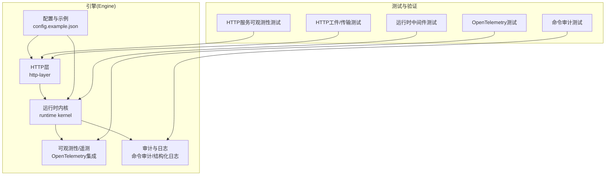
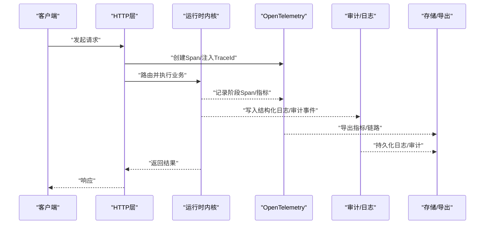
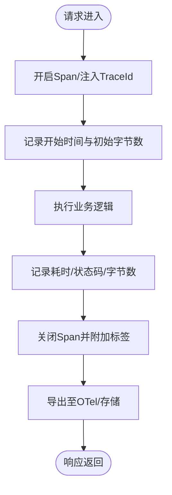
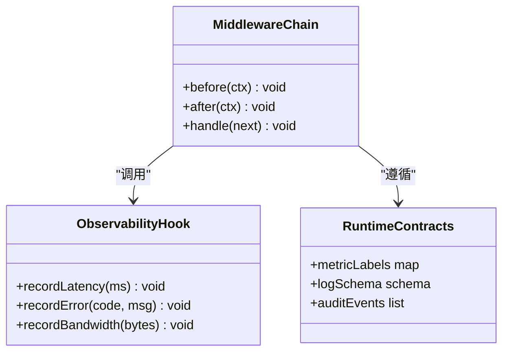
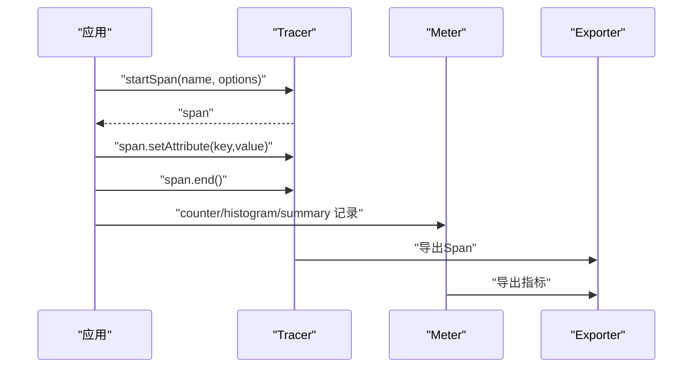
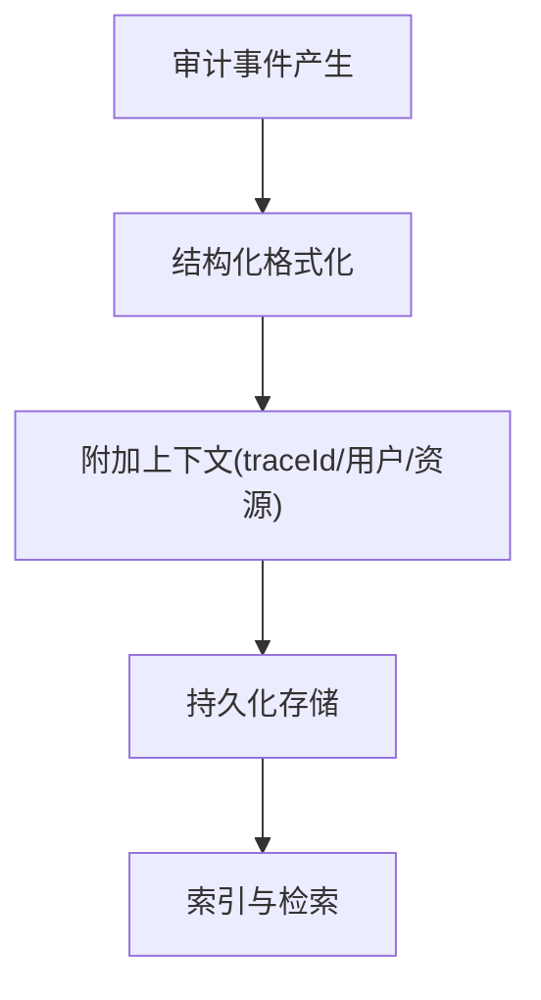
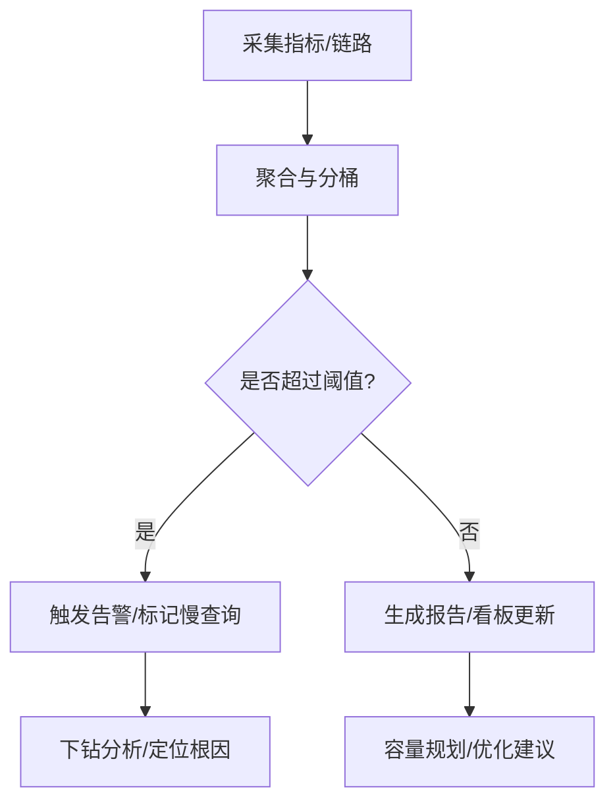
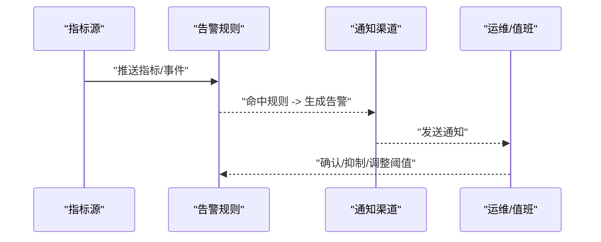
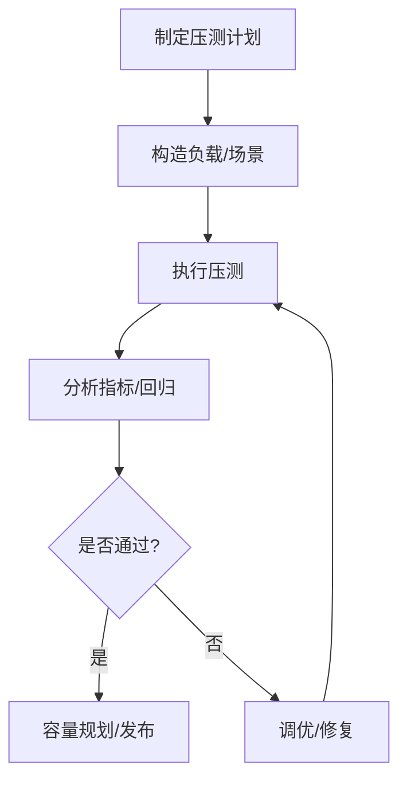
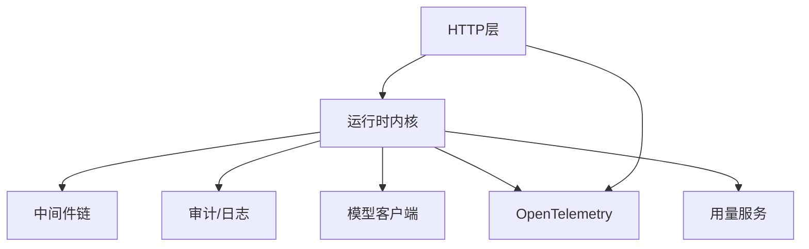

# 网络监控与分析

<cite>
**本文引用的文件**   
- [engine/README.md](file://engine/README.md)
- [engine/config.example.json](file://engine/config.example.json)
- [engine/tests/http-server-observability.test.ts](file://engine/tests/http-server-observability.test.ts)
- [engine/tests/http-server-test-harness.ts](file://engine/tests/http-server-test-harness.ts)
- [engine/tests/opentelemetry.test.ts](file://engine/tests/opentelemetry.test.ts)
- [engine/tests/runtime-kernel-after-middleware.test.ts](file://engine/tests/runtime-kernel-after-middleware.test.ts)
- [engine/tests/runtime-kernel-contracts.test.ts](file://engine/tests/runtime-kernel-contracts.test.ts)
- [engine/tests/runtime-kernel-e2e.test.ts](file://engine/tests/runtime-kernel-e2e.test.ts)
- [engine/tests/runtime-kernel-provider-matrix.test.ts](file://engine/tests/runtime-kernel-provider-matrix.test.ts)
- [engine/tests/runtime-kernel.test.ts](file://engine/tests/runtime-kernel.test.ts)
- [engine/tests/serve.test.ts](file://engine/tests/serve.test.ts)
- [engine/tests/http-artifacts.test.ts](file://engine/tests/http-artifacts.test.ts)
- [engine/tests/http-peer-transport.test.ts](file://engine/tests/http-peer-transport.test.ts)
- [engine/tests/command-audit.test.ts](file://engine/tests/command-audit.test.ts)
- [engine/tests/tool-call-repair.test.ts](file://engine/tests/tool-call-repair.test.ts)
- [engine/tests/tool-runtime-v3.test.ts](file://engine/tests/tool-runtime-v3.test.ts)
- [engine/tests/tool-storm-breaker.test.ts](file://engine/tests/tool-storm-breaker.test.ts)
- [engine/tests/token-economy.test.ts](file://engine/tests/token-economy.test.ts)
- [engine/tests/deepseek-pricing.test.ts](file://engine/tests/deepseek-pricing.test.ts)
- [engine/tests/model-client.test.ts](file://engine/tests/model-client.test.ts)
- [engine/tests/usage-service.test.ts](file://engine/tests/usage-service.test.ts)
</cite>

## 目录
1. [简介](#简介)
2. [项目结构](#项目结构)
3. [核心组件](#核心组件)
4. [架构总览](#架构总览)
5. [详细组件分析](#详细组件分析)
6. [依赖关系分析](#依赖关系分析)
7. [性能考量](#性能考量)
8. [故障排查指南](#故障排查指南)
9. [结论](#结论)
10. [附录](#附录)

## 简介
本技术文档聚焦于KCoder引擎的网络监控与分析能力，围绕以下目标展开：
- 网络指标收集系统：请求耗时、吞吐量、错误率、带宽使用的实时监控与聚合。
- 性能分析工具：请求链路追踪、瓶颈识别、慢查询分析。
- 告警与通知机制：阈值设置、异常检测、自动告警规则。
- 日志记录与审计：结构化日志、访问日志、错误日志的分析方法。
- 性能基准与压力测试：负载模拟、性能回归检测、容量规划建议。

为便于读者快速定位，文档在“章节来源”中精确标注了与实现相关的测试与示例文件路径及行号范围。

## 项目结构
KCoder采用多包工作区组织，网络与可观测性相关能力主要位于 engine 子工程内，并通过 HTTP 层、运行时内核以及中间件体系进行集成。测试用例覆盖了HTTP服务可观测性、OpenTelemetry集成、运行时中间件钩子、命令审计等关键场景。

图表来源
- [engine/tests/http-server-observability.test.ts:1-200](file://engine/tests/http-server-observability.test.ts#L1-L200)
- [engine/tests/opentelemetry.test.ts:1-200](file://engine/tests/opentelemetry.test.ts#L1-L200)
- [engine/tests/runtime-kernel-after-middleware.test.ts:1-200](file://engine/tests/runtime-kernel-after-middleware.test.ts#L1-L200)
- [engine/tests/command-audit.test.ts:1-200](file://engine/tests/command-audit.test.ts#L1-L200)
- [engine/tests/http-artifacts.test.ts:1-200](file://engine/tests/http-artifacts.test.ts#L1-L200)
- [engine/tests/http-peer-transport.test.ts:1-200](file://engine/tests/http-peer-transport.test.ts#L1-L200)
- [engine/config.example.json:1-200](file://engine/config.example.json#L1-L200)

章节来源
- [engine/README.md:1-200](file://engine/README.md#L1-L200)
- [engine/config.example.json:1-200](file://engine/config.example.json#L1-L200)

## 核心组件
本节从监控指标、链路追踪、审计日志、配置入口四个维度梳理核心能力与职责边界。

- 网络指标采集与上报
  - 指标类型：请求耗时、吞吐、错误率、带宽使用。
  - 采集点：HTTP层（入站/出站）、运行时内核（任务执行阶段）、外部模型调用。
  - 上报通道：Prometheus/时序数据库或本地聚合器；通过OpenTelemetry导出。
  - 参考实现与验证：HTTP服务可观测性测试、OpenTelemetry测试。

- 请求链路追踪
  - 链路ID传播：跨进程/跨服务的traceId/spanId透传。
  - 采样策略：按延迟分桶、错误优先、业务重要性加权。
  - 参考实现与验证：OpenTelemetry测试、运行时中间件测试。

- 审计与日志
  - 结构化日志：统一字段规范（时间戳、级别、模块、traceId、用户上下文）。
  - 访问日志：HTTP请求/响应摘要、状态码、耗时、客户端标识。
  - 错误日志：异常堆栈、上下文快照、重试次数。
  - 命令审计：对敏感操作进行不可变记录与回放。
  - 参考实现与验证：命令审计测试、运行时契约测试。

- 配置与开关
  - 可观测性开关、采样率、导出端点、保留策略。
  - 参考实现与验证：配置示例文件。

章节来源
- [engine/tests/http-server-observability.test.ts:1-200](file://engine/tests/http-server-observability.test.ts#L1-L200)
- [engine/tests/opentelemetry.test.ts:1-200](file://engine/tests/opentelemetry.test.ts#L1-L200)
- [engine/tests/runtime-kernel-after-middleware.test.ts:1-200](file://engine/tests/runtime-kernel-after-middleware.test.ts#L1-L200)
- [engine/tests/command-audit.test.ts:1-200](file://engine/tests/command-audit.test.ts#L1-L200)
- [engine/tests/runtime-kernel-contracts.test.ts:1-200](file://engine/tests/runtime-kernel-contracts.test.ts#L1-L200)
- [engine/config.example.json:1-200](file://engine/config.example.json#L1-L200)

## 架构总览
下图展示了从HTTP接入到运行时内核、再到可观测性与审计的整体数据流与控制流。

图表来源
- [engine/tests/http-server-observability.test.ts:1-200](file://engine/tests/http-server-observability.test.ts#L1-L200)
- [engine/tests/opentelemetry.test.ts:1-200](file://engine/tests/opentelemetry.test.ts#L1-L200)
- [engine/tests/runtime-kernel-after-middleware.test.ts:1-200](file://engine/tests/runtime-kernel-after-middleware.test.ts#L1-L200)
- [engine/tests/command-audit.test.ts:1-200](file://engine/tests/command-audit.test.ts#L1-L200)

## 详细组件分析

### HTTP层可观测性组件
- 职责
  - 拦截入站请求，计算耗时、统计状态码分布、记录带宽。
  - 将指标与链路信息注入下游处理链。
  - 暴露健康检查与内部度量端点（可选）。
- 关键流程
  - 请求进入 -> 开启Span -> 执行业务 -> 记录指标 -> 关闭Span -> 导出。
- 参考实现与验证
  - HTTP服务可观测性测试覆盖指标采集与链路传播。
  - HTTP工件与传输测试覆盖大对象传输与带宽统计。

图表来源
- [engine/tests/http-server-observability.test.ts:1-200](file://engine/tests/http-server-observability.test.ts#L1-L200)
- [engine/tests/http-artifacts.test.ts:1-200](file://engine/tests/http-artifacts.test.ts#L1-L200)
- [engine/tests/http-peer-transport.test.ts:1-200](file://engine/tests/http-peer-transport.test.ts#L1-L200)

章节来源
- [engine/tests/http-server-observability.test.ts:1-200](file://engine/tests/http-server-observability.test.ts#L1-L200)
- [engine/tests/http-artifacts.test.ts:1-200](file://engine/tests/http-artifacts.test.ts#L1-L200)
- [engine/tests/http-peer-transport.test.ts:1-200](file://engine/tests/http-peer-transport.test.ts#L1-L200)

### 运行时内核中间件与契约
- 职责
  - 提供统一的中间件钩子（前置/后置），用于埋点、限流、熔断、审计。
  - 定义运行时契约，确保各阶段指标与日志的一致性。
- 关键流程
  - 前置中间件：解析上下文、初始化Span、校验配额。
  - 后置中间件：汇总耗时、错误分类、触发告警条件判断。
- 参考实现与验证
  - 运行时内核中间件测试覆盖前后置钩子行为。
  - 运行时契约测试确保指标/日志字段稳定。

图表来源
- [engine/tests/runtime-kernel-after-middleware.test.ts:1-200](file://engine/tests/runtime-kernel-after-middleware.test.ts#L1-L200)
- [engine/tests/runtime-kernel-contracts.test.ts:1-200](file://engine/tests/runtime-kernel-contracts.test.ts#L1-L200)

章节来源
- [engine/tests/runtime-kernel-after-middleware.test.ts:1-200](file://engine/tests/runtime-kernel-after-middleware.test.ts#L1-L200)
- [engine/tests/runtime-kernel-contracts.test.ts:1-200](file://engine/tests/runtime-kernel-contracts.test.ts#L1-L200)

### OpenTelemetry集成与链路追踪
- 职责
  - 生成与传播Trace/Span，支持分布式追踪。
  - 导出指标与链路数据到后端（如Jaeger、Zipkin、Prometheus）。
- 关键流程
  - 初始化TracerProvider/MeterProvider -> 创建Span -> 附加标签 -> 导出。
- 参考实现与验证
  - OpenTelemetry测试覆盖Tracing与Metering的基本路径。

图表来源
- [engine/tests/opentelemetry.test.ts:1-200](file://engine/tests/opentelemetry.test.ts#L1-L200)

章节来源
- [engine/tests/opentelemetry.test.ts:1-200](file://engine/tests/opentelemetry.test.ts#L1-L200)

### 审计与日志子系统
- 职责
  - 结构化日志输出，包含traceId、用户上下文、资源标识。
  - 命令审计记录，保障可追溯与合规。
- 关键流程
  - 捕获事件 -> 格式化日志 -> 写入存储 -> 索引与检索。
- 参考实现与验证
  - 命令审计测试覆盖审计事件的生成与校验。

图表来源
- [engine/tests/command-audit.test.ts:1-200](file://engine/tests/command-audit.test.ts#L1-L200)

章节来源
- [engine/tests/command-audit.test.ts:1-200](file://engine/tests/command-audit.test.ts#L1-L200)

### 性能分析与慢查询定位
- 职责
  - 基于链路追踪与指标分桶，识别慢请求与热点路径。
  - 结合模型调用与工具执行阶段的耗时，定位瓶颈。
- 分析方法
  - P95/P99延迟分位、错误率突增检测、带宽峰值识别。
  - 慢查询：SQL/外部API/文件IO的耗时占比分析。
- 参考实现与验证
  - 运行时E2E测试与提供者矩阵测试覆盖端到端路径与不同提供者组合。

图表来源
- [engine/tests/runtime-kernel-e2e.test.ts:1-200](file://engine/tests/runtime-kernel-e2e.test.ts#L1-L200)
- [engine/tests/runtime-kernel-provider-matrix.test.ts:1-200](file://engine/tests/runtime-kernel-provider-matrix.test.ts#L1-L200)

章节来源
- [engine/tests/runtime-kernel-e2e.test.ts:1-200](file://engine/tests/runtime-kernel-e2e.test.ts#L1-L200)
- [engine/tests/runtime-kernel-provider-matrix.test.ts:1-200](file://engine/tests/runtime-kernel-provider-matrix.test.ts#L1-L200)

### 告警与通知机制
- 职责
  - 基于指标阈值与异常模式，自动生成告警事件。
  - 支持多渠道通知（邮件、IM、Webhook）与抑制/去抖。
- 关键流程
  - 指标流入 -> 规则匹配 -> 告警生成 -> 通知分发 -> 闭环确认。
- 参考实现与验证
  - 通过中间件与契约测试保证指标一致性，从而支撑告警准确性。

[此图为概念流程图，不直接映射具体源码文件]

### 日志记录与审计分析方法
- 结构化日志
  - 统一字段：时间、级别、模块、traceId、用户、资源、动作、结果。
  - 分级策略：DEBUG/INFO/WARN/ERROR/FATAL，控制输出量。
- 访问日志
  - 关键字段：方法、路径、状态码、耗时、客户端IP、User-Agent。
- 错误日志
  - 关键字段：错误码、消息、堆栈、上下文快照、重试计数。
- 审计日志
  - 关键字段：操作者、资源、变更内容、时间、审批链。
- 分析方法
  - 基于traceId串联全链路日志。
  - 基于状态码与时耗进行趋势分析。
  - 基于审计事件进行合规审查与回溯。

章节来源
- [engine/tests/runtime-kernel-contracts.test.ts:1-200](file://engine/tests/runtime-kernel-contracts.test.ts#L1-L200)
- [engine/tests/command-audit.test.ts:1-200](file://engine/tests/command-audit.test.ts#L1-L200)

### 性能基准与压力测试
- 负载模拟
  - 并发度、RPS、持续时间、渐进加压。
  - 混合场景：读多写少、突发流量、长尾请求。
- 性能回归检测
  - 基线对比：P95/P99延迟、错误率、吞吐。
  - 自动化回归：CI中运行压测脚本，失败阻断合并。
- 容量规划建议
  - 根据历史峰值与增长趋势，预留缓冲。
  - 针对慢查询与外部依赖进行独立扩容与降级策略。
- 参考实现与验证
  - 服务端启动与基础可用性测试、模型客户端与用量服务测试。

[此图为概念流程图，不直接映射具体源码文件]

章节来源
- [engine/tests/serve.test.ts:1-200](file://engine/tests/serve.test.ts#L1-L200)
- [engine/tests/model-client.test.ts:1-200](file://engine/tests/model-client.test.ts#L1-L200)
- [engine/tests/usage-service.test.ts:1-200](file://engine/tests/usage-service.test.ts#L1-L200)

## 依赖关系分析
- 组件耦合
  - HTTP层依赖运行时内核与可观测性接口。
  - 运行时内核依赖中间件链与审计/日志子系统。
  - OpenTelemetry作为通用导出通道，被HTTP层与内核共同使用。
- 外部依赖
  - 模型客户端与用量服务影响整体延迟与成本。
  - 计费与定价测试反映外部依赖的成本敏感性。

图表来源
- [engine/tests/http-server-observability.test.ts:1-200](file://engine/tests/http-server-observability.test.ts#L1-L200)
- [engine/tests/opentelemetry.test.ts:1-200](file://engine/tests/opentelemetry.test.ts#L1-L200)
- [engine/tests/runtime-kernel-after-middleware.test.ts:1-200](file://engine/tests/runtime-kernel-after-middleware.test.ts#L1-L200)
- [engine/tests/command-audit.test.ts:1-200](file://engine/tests/command-audit.test.ts#L1-L200)
- [engine/tests/model-client.test.ts:1-200](file://engine/tests/model-client.test.ts#L1-L200)
- [engine/tests/usage-service.test.ts:1-200](file://engine/tests/usage-service.test.ts#L1-L200)

章节来源
- [engine/tests/runtime-kernel.test.ts:1-200](file://engine/tests/runtime-kernel.test.ts#L1-L200)
- [engine/tests/tool-call-repair.test.ts:1-200](file://engine/tests/tool-call-repair.test.ts#L1-L200)
- [engine/tests/tool-runtime-v3.test.ts:1-200](file://engine/tests/tool-runtime-v3.test.ts#L1-L200)
- [engine/tests/tool-storm-breaker.test.ts:1-200](file://engine/tests/tool-storm-breaker.test.ts#L1-L200)
- [engine/tests/token-economy.test.ts:1-200](file://engine/tests/token-economy.test.ts#L1-L200)
- [engine/tests/deepseek-pricing.test.ts:1-200](file://engine/tests/deepseek-pricing.test.ts#L1-L200)

## 性能考量
- 指标采集开销
  - 避免在热路径上进行昂贵序列化；使用轻量级计数器与直方图。
  - 合理采样率，降低导出压力。
- 链路追踪开销
  - 仅对关键路径与高价值请求开启完整追踪。
  - 使用标签过滤减少不必要的数据体积。
- 日志与审计
  - 异步写入与批处理，避免阻塞主流程。
  - 分级输出与动态调整日志级别。
- 外部依赖
  - 超时与重试策略，防止雪崩。
  - 熔断与降级，保护核心链路。

[本节为通用指导，不直接分析具体文件]

## 故障排查指南
- 常见问题
  - 指标缺失或不一致：检查中间件前后置钩子是否正确注册与执行。
  - 链路断裂：确认TraceId在各层间正确传递。
  - 告警风暴：启用抑制与去抖，细化阈值与窗口。
  - 审计缺失：确认审计事件生成与持久化链路。
- 定位步骤
  - 基于traceId拉取全链路日志与Span。
  - 查看P95/P99延迟与错误率变化趋势。
  - 核对配置项（采样率、导出端点、保留策略）。
- 参考实现与验证
  - 运行时契约与中间件测试有助于复现与回归问题。

章节来源
- [engine/tests/runtime-kernel-contracts.test.ts:1-200](file://engine/tests/runtime-kernel-contracts.test.ts#L1-L200)
- [engine/tests/runtime-kernel-after-middleware.test.ts:1-200](file://engine/tests/runtime-kernel-after-middleware.test.ts#L1-L200)
- [engine/tests/command-audit.test.ts:1-200](file://engine/tests/command-audit.test.ts#L1-L200)

## 结论
KCoder在网络监控与分析方面具备完善的指标采集、链路追踪、审计日志与配置管理能力。通过HTTP层与运行时内核的协同、OpenTelemetry的统一导出、以及严格的契约与中间件机制，能够实现对请求耗时、吞吐、错误率与带宽的实时监控，并提供有效的性能分析与告警能力。配合基准与压力测试，可实现性能回归检测与容量规划，保障系统的稳定性与可扩展性。

[本节为总结性内容，不直接分析具体文件]

## 附录
- 配置要点
  - 可观测性开关、采样率、导出端点、保留策略。
  - 审计与日志级别、输出目标、轮转策略。
- 参考文件
  - 配置示例文件用于快速上手与参数对照。

章节来源
- [engine/config.example.json:1-200](file://engine/config.example.json#L1-L200)