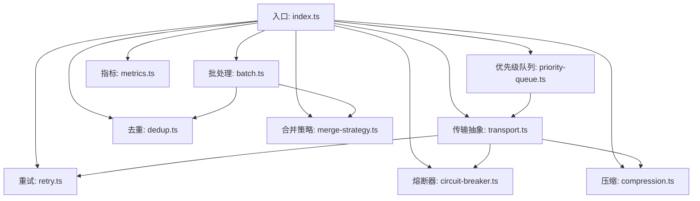
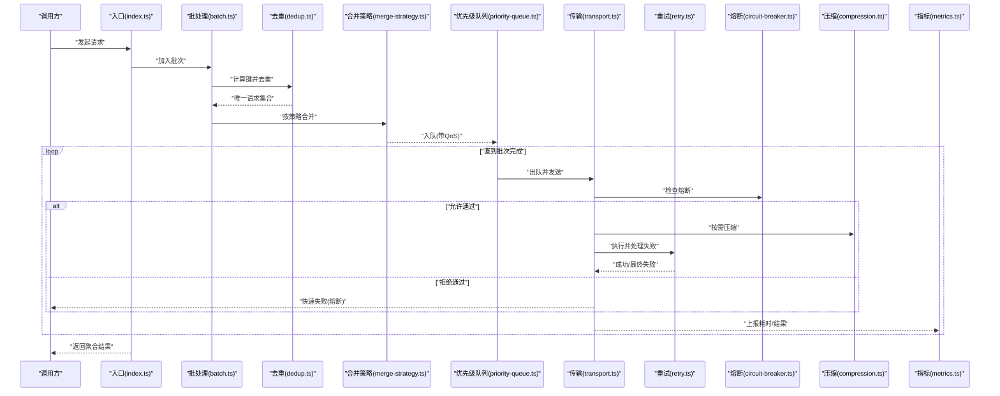
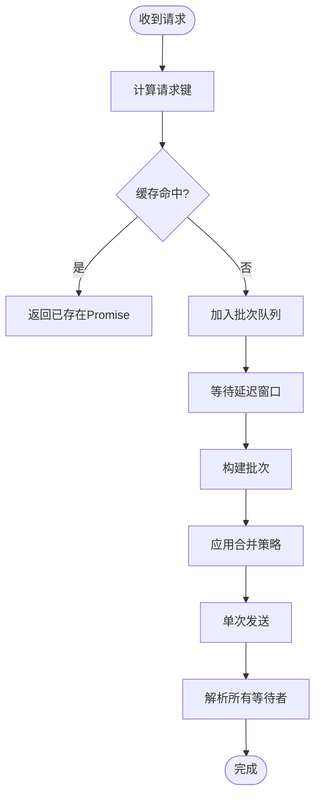
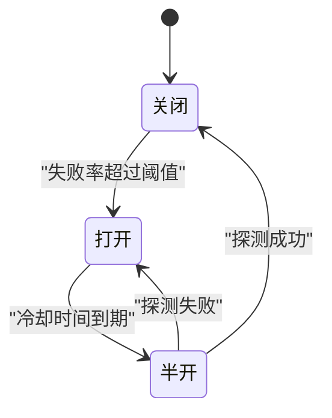
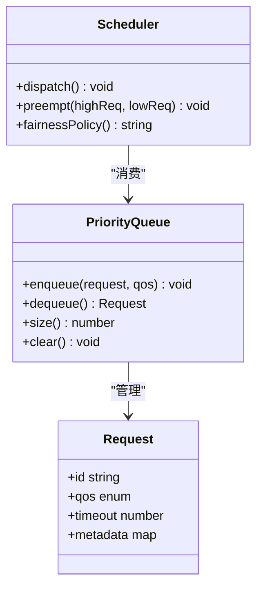
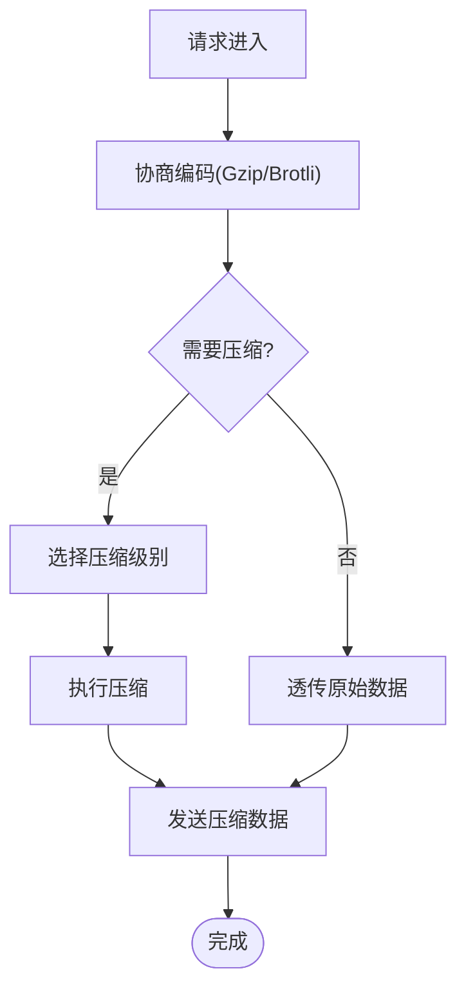
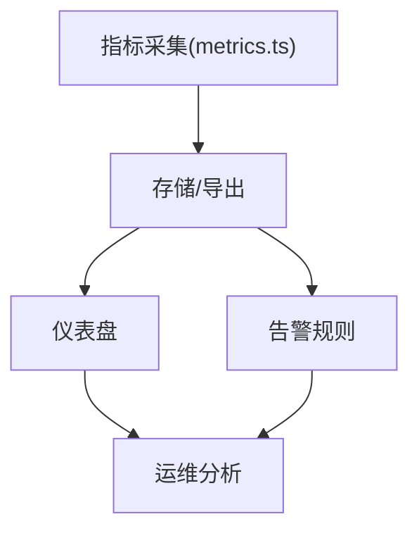
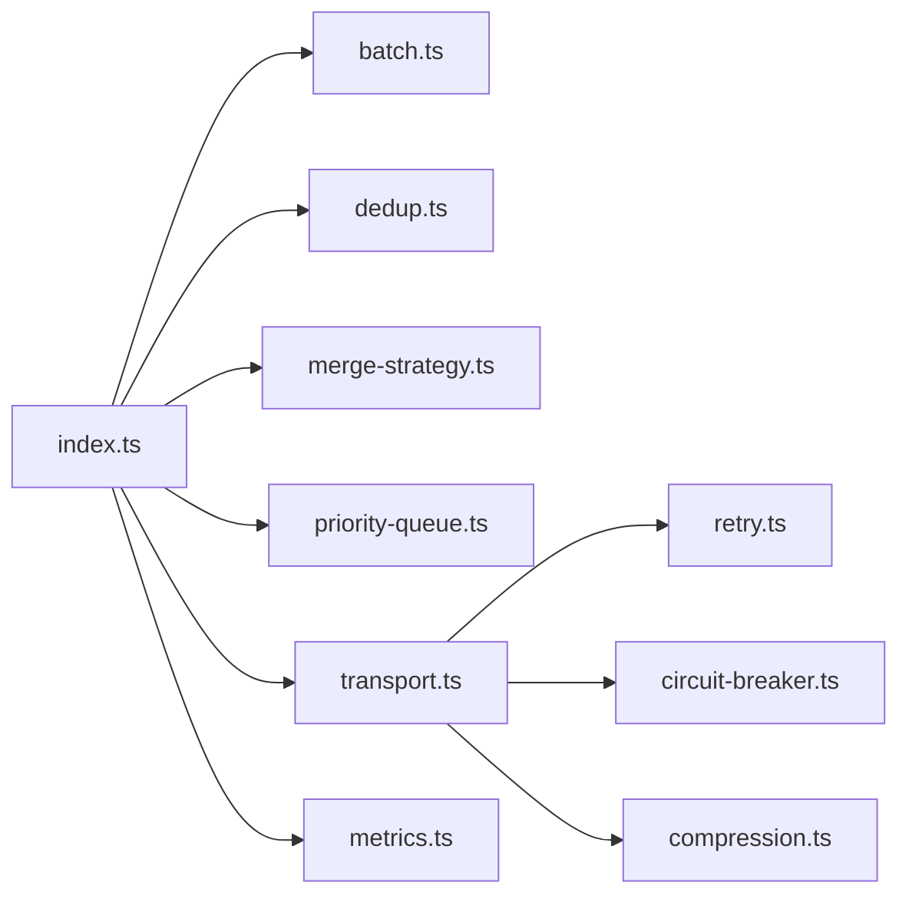

# 请求优化策略

<cite>
**本文引用的文件**   
- [engine/packages/http-layer/src/index.ts](file://engine/packages/http-layer/src/index.ts)
- [engine/packages/http-layer/src/transport.ts](file://engine/packages/http-layer/src/transport.ts)
- [engine/packages/http-layer/src/retry.ts](file://engine/packages/http-layer/src/retry.ts)
- [engine/packages/http-layer/src/circuit-breaker.ts](file://engine/packages/http-layer/src/circuit-breaker.ts)
- [engine/packages/http-layer/src/priority-queue.ts](file://engine/packages/http-layer/src/priority-queue.ts)
- [engine/packages/http-layer/src/compression.ts](file://engine/packages/http-layer/src/compression.ts)
- [engine/packages/http-layer/src/metrics.ts](file://engine/packages/http-layer/src/metrics.ts)
- [engine/packages/http-layer/src/batch.ts](file://engine/packages/http-layer/src/batch.ts)
- [engine/packages/http-layer/src/dedup.ts](file://engine/packages/http-layer/src/dedup.ts)
- [engine/packages/http-layer/src/merge-strategy.ts](file://engine/packages/http-layer/src/merge-strategy.ts)
</cite>

## 目录
1. [简介](#简介)
2. [项目结构](#项目结构)
3. [核心组件](#核心组件)
4. [架构总览](#架构总览)
5. [详细组件分析](#详细组件分析)
6. [依赖关系分析](#依赖关系分析)
7. [性能考量](#性能考量)
8. [故障排查指南](#故障排查指南)
9. [结论](#结论)
10. [附录](#附录)

## 简介
本技术文档聚焦于KCoder在HTTP层对请求的优化策略，覆盖以下关键主题：
- 请求合并机制：批量处理、去重算法与延迟合并策略
- 重试与熔断：指数退避、失败率统计与熔断器状态管理
- 优先级调度：QoS分类、资源抢占与公平调度
- 压缩传输：Gzip/Brotli支持、内容协商与动态压缩级别
- 监控与分析：耗时统计、成功率分析与瓶颈识别

目标读者包括后端工程师、平台集成人员与运维同学。文档以代码级实现为依据，辅以可视化图示，帮助快速理解并落地相关能力。

## 项目结构
KCoder的请求优化主要位于http-layer包中，围绕“发送—合并—去重—调度—重试—熔断—压缩—观测”形成闭环。下图给出模块划分与职责概览。

图表来源
- [engine/packages/http-layer/src/index.ts](file://engine/packages/http-layer/src/index.ts)
- [engine/packages/http-layer/src/transport.ts](file://engine/packages/http-layer/src/transport.ts)
- [engine/packages/http-layer/src/batch.ts](file://engine/packages/http-layer/src/batch.ts)
- [engine/packages/http-layer/src/dedup.ts](file://engine/packages/http-layer/src/dedup.ts)
- [engine/packages/http-layer/src/merge-strategy.ts](file://engine/packages/http-layer/src/merge-strategy.ts)
- [engine/packages/http-layer/src/priority-queue.ts](file://engine/packages/http-layer/src/priority-queue.ts)
- [engine/packages/http-layer/src/retry.ts](file://engine/packages/http-layer/src/retry.ts)
- [engine/packages/http-layer/src/circuit-breaker.ts](file://engine/packages/http-layer/src/circuit-breaker.ts)
- [engine/packages/http-layer/src/compression.ts](file://engine/packages/http-layer/src/compression.ts)
- [engine/packages/http-layer/src/metrics.ts](file://engine/packages/http-layer/src/metrics.ts)

章节来源
- [engine/packages/http-layer/src/index.ts](file://engine/packages/http-layer/src/index.ts)
- [engine/packages/http-layer/src/transport.ts](file://engine/packages/http-layer/src/transport.ts)

## 核心组件
本节概述各组件的职责与交互方式，为后续深入分析奠定基础。

- 入口与编排（index.ts）
  - 负责组合批处理、去重、合并策略、优先级队列、重试、熔断、压缩与指标上报等能力，对外暴露统一的请求发送接口。
- 传输抽象（transport.ts）
  - 封装底层网络IO细节，提供统一发送契约；内部串联重试、熔断与压缩逻辑。
- 批处理（batch.ts）
  - 将短时间内到达的多个请求聚合为一次批量调用，降低往返开销。
- 去重（dedup.ts）
  - 基于请求键（如URL+方法+关键头体哈希）进行重复请求识别与合并。
- 合并策略（merge-strategy.ts）
  - 定义不同场景下的合并规则（如按时间窗口、按路由或按业务域）。
- 优先级队列（priority-queue.ts）
  - 根据QoS等级组织待执行请求，支持抢占与公平调度。
- 重试（retry.ts）
  - 实现指数退避与抖动，结合失败率统计控制重试上限。
- 熔断器（circuit-breaker.ts）
  - 维护半开/关闭/打开状态，依据错误率与采样窗口决定是否放行。
- 压缩（compression.ts）
  - 支持Gzip/Brotli，依据响应头协商与配置动态调整压缩级别。
- 指标（metrics.ts）
  - 采集耗时、吞吐、成功率、熔断与重试次数等关键指标，供监控面板使用。

章节来源
- [engine/packages/http-layer/src/index.ts](file://engine/packages/http-layer/src/index.ts)
- [engine/packages/http-layer/src/transport.ts](file://engine/packages/http-layer/src/transport.ts)
- [engine/packages/http-layer/src/batch.ts](file://engine/packages/http-layer/src/batch.ts)
- [engine/packages/http-layer/src/dedup.ts](file://engine/packages/http-layer/src/dedup.ts)
- [engine/packages/http-layer/src/merge-strategy.ts](file://engine/packages/http-layer/src/merge-strategy.ts)
- [engine/packages/http-layer/src/priority-queue.ts](file://engine/packages/http-layer/src/priority-queue.ts)
- [engine/packages/http-layer/src/retry.ts](file://engine/packages/http-layer/src/retry.ts)
- [engine/packages/http-layer/src/circuit-breaker.ts](file://engine/packages/http-layer/src/circuit-breaker.ts)
- [engine/packages/http-layer/src/compression.ts](file://engine/packages/http-layer/src/compression.ts)
- [engine/packages/http-layer/src/metrics.ts](file://engine/packages/http-layer/src/metrics.ts)

## 架构总览
下图展示一次典型请求从进入系统到返回的全链路流程，体现合并、去重、优先级、重试、熔断与压缩的协作关系。

图表来源
- [engine/packages/http-layer/src/index.ts](file://engine/packages/http-layer/src/index.ts)
- [engine/packages/http-layer/src/batch.ts](file://engine/packages/http-layer/src/batch.ts)
- [engine/packages/http-layer/src/dedup.ts](file://engine/packages/http-layer/src/dedup.ts)
- [engine/packages/http-layer/src/merge-strategy.ts](file://engine/packages/http-layer/src/merge-strategy.ts)
- [engine/packages/http-layer/src/priority-queue.ts](file://engine/packages/http-layer/src/priority-queue.ts)
- [engine/packages/http-layer/src/transport.ts](file://engine/packages/http-layer/src/transport.ts)
- [engine/packages/http-layer/src/retry.ts](file://engine/packages/http-layer/src/retry.ts)
- [engine/packages/http-layer/src/circuit-breaker.ts](file://engine/packages/http-layer/src/circuit-breaker.ts)
- [engine/packages/http-layer/src/compression.ts](file://engine/packages/http-layer/src/compression.ts)
- [engine/packages/http-layer/src/metrics.ts](file://engine/packages/http-layer/src/metrics.ts)

## 详细组件分析

### 请求合并机制（批量、去重、延迟合并）
- 批量处理
  - 将短时间窗口内的请求聚合成一批，减少连接建立与协议开销。
  - 批次大小与时间窗口可配置，避免过大导致尾延迟上升。
- 去重算法
  - 基于请求标识（如路径、方法、关键头与体摘要）生成稳定键，命中则复用同一Promise。
  - 支持TTL过期清理，防止内存泄漏。
- 延迟合并策略
  - 采用微延迟窗口收集，提高合并命中率；同时保证最坏情况下的延迟上界。
  - 合并策略可按路由、租户或业务域隔离，避免跨域污染。

图表来源
- [engine/packages/http-layer/src/batch.ts](file://engine/packages/http-layer/src/batch.ts)
- [engine/packages/http-layer/src/dedup.ts](file://engine/packages/http-layer/src/dedup.ts)
- [engine/packages/http-layer/src/merge-strategy.ts](file://engine/packages/http-layer/src/merge-strategy.ts)

章节来源
- [engine/packages/http-layer/src/batch.ts](file://engine/packages/http-layer/src/batch.ts)
- [engine/packages/http-layer/src/dedup.ts](file://engine/packages/http-layer/src/dedup.ts)
- [engine/packages/http-layer/src/merge-strategy.ts](file://engine/packages/http-layer/src/merge-strategy.ts)

### 重试与熔断机制（指数退避、失败率统计、状态管理）
- 指数退避
  - 首次失败后等待时间按指数增长，并叠加随机抖动以降低雪崩风险。
  - 最大重试次数与最大等待时间可配置，避免无限重试。
- 失败率统计
  - 滑动窗口内统计失败比例，作为熔断决策输入。
  - 支持按端点维度独立统计，避免全局误判。
- 熔断器状态管理
  - 关闭：正常放行；打开：快速失败；半开：试探性放行少量请求验证恢复。
  - 状态切换阈值与探测间隔可配置。

图表来源
- [engine/packages/http-layer/src/retry.ts](file://engine/packages/http-layer/src/retry.ts)
- [engine/packages/http-layer/src/circuit-breaker.ts](file://engine/packages/http-layer/src/circuit-breaker.ts)

章节来源
- [engine/packages/http-layer/src/retry.ts](file://engine/packages/http-layer/src/retry.ts)
- [engine/packages/http-layer/src/circuit-breaker.ts](file://engine/packages/http-layer/src/circuit-breaker.ts)

### 请求优先级调度（QoS分类、资源抢占、公平调度）
- QoS分类
  - 将请求划分为高/中/低优先级，对应不同的超时、并发与重试策略。
- 资源抢占
  - 高优先级请求可打断低优先级任务，确保关键路径SLA。
- 公平调度
  - 同优先级内采用轮询或加权公平队列，避免饥饿。

图表来源
- [engine/packages/http-layer/src/priority-queue.ts](file://engine/packages/http-layer/src/priority-queue.ts)

章节来源
- [engine/packages/http-layer/src/priority-queue.ts](file://engine/packages/http-layer/src/priority-queue.ts)

### 请求压缩传输（Gzip/Brotli、内容协商、动态级别）
- 压缩算法
  - 支持Gzip与Brotli，客户端与服务端协商选择最优算法。
- 内容协商
  - 依据Accept-Encoding与服务器能力决定是否启用压缩及具体算法。
- 动态压缩级别
  - 根据CPU负载与带宽状况动态调整压缩级别，平衡CPU与带宽成本。

图表来源
- [engine/packages/http-layer/src/compression.ts](file://engine/packages/http-layer/src/compression.ts)

章节来源
- [engine/packages/http-layer/src/compression.ts](file://engine/packages/http-layer/src/compression.ts)

### 监控与分析工具（耗时、成功率、瓶颈识别）
- 指标采集
  - 记录端到端耗时、分阶段耗时、成功率、重试次数、熔断触发次数、压缩比等。
- 可视化与告警
  - 将指标导出至监控系统，设置阈值告警，定位热点端点与异常时段。
- 瓶颈识别
  - 结合P95/P99耗时与吞吐曲线，识别上游限流、下游慢查询或压缩CPU峰值。

图表来源
- [engine/packages/http-layer/src/metrics.ts](file://engine/packages/http-layer/src/metrics.ts)

章节来源
- [engine/packages/http-layer/src/metrics.ts](file://engine/packages/http-layer/src/metrics.ts)

## 依赖关系分析
下图展示各模块之间的直接依赖关系，便于评估耦合度与潜在循环依赖。

图表来源
- [engine/packages/http-layer/src/index.ts](file://engine/packages/http-layer/src/index.ts)
- [engine/packages/http-layer/src/transport.ts](file://engine/packages/http-layer/src/transport.ts)
- [engine/packages/http-layer/src/batch.ts](file://engine/packages/http-layer/src/batch.ts)
- [engine/packages/http-layer/src/dedup.ts](file://engine/packages/http-layer/src/dedup.ts)
- [engine/packages/http-layer/src/merge-strategy.ts](file://engine/packages/http-layer/src/merge-strategy.ts)
- [engine/packages/http-layer/src/priority-queue.ts](file://engine/packages/http-layer/src/priority-queue.ts)
- [engine/packages/http-layer/src/retry.ts](file://engine/packages/http-layer/src/retry.ts)
- [engine/packages/http-layer/src/circuit-breaker.ts](file://engine/packages/http-layer/src/circuit-breaker.ts)
- [engine/packages/http-layer/src/compression.ts](file://engine/packages/http-layer/src/compression.ts)
- [engine/packages/http-layer/src/metrics.ts](file://engine/packages/http-layer/src/metrics.ts)

章节来源
- [engine/packages/http-layer/src/index.ts](file://engine/packages/http-layer/src/index.ts)
- [engine/packages/http-layer/src/transport.ts](file://engine/packages/http-layer/src/transport.ts)

## 性能考量
- 合并窗口调优
  - 增大窗口提升合并率但增加尾延迟；建议按业务SLA与流量模型校准。
- 去重键设计
  - 键需稳定且区分度高，避免误去重；必要时引入版本或签名字段。
- 重试与熔断参数
  - 合理设置最大重试次数、退避上限与熔断阈值，避免放大故障面。
- 压缩级别自适应
  - 在高CPU占用时降级压缩级别，保障整体吞吐与延迟稳定性。
- 优先级与公平性
  - 高优先级配额与抢占阈值需谨慎设定，避免低优先级饥饿。

[本节为通用指导，不直接分析具体文件]

## 故障排查指南
- 现象：大量请求被快速拒绝
  - 检查熔断器状态是否为“打开”，查看失败率统计窗口与阈值配置。
- 现象：重试风暴
  - 确认指数退避与抖动是否生效，检查最大重试次数与等待上限。
- 现象：合并率低
  - 核查去重键是否过于敏感，调整延迟窗口与合并策略。
- 现象：CPU飙升
  - 观察压缩级别与压缩算法选择，适当降低级别或切换算法。
- 现象：高延迟端点增多
  - 结合指标面板定位P95/P99异常，检查上游限流与下游依赖健康度。

章节来源
- [engine/packages/http-layer/src/circuit-breaker.ts](file://engine/packages/http-layer/src/circuit-breaker.ts)
- [engine/packages/http-layer/src/retry.ts](file://engine/packages/http-layer/src/retry.ts)
- [engine/packages/http-layer/src/batch.ts](file://engine/packages/http-layer/src/batch.ts)
- [engine/packages/http-layer/src/dedup.ts](file://engine/packages/http-layer/src/dedup.ts)
- [engine/packages/http-layer/src/compression.ts](file://engine/packages/http-layer/src/compression.ts)
- [engine/packages/http-layer/src/metrics.ts](file://engine/packages/http-layer/src/metrics.ts)

## 结论
KCoder的HTTP层通过“合并—去重—优先级—重试—熔断—压缩—观测”的组合拳，显著降低了网络与计算开销，提升了吞吐与稳定性。建议在上线前结合真实流量进行压测与参数校准，并持续通过指标面板跟踪效果，逐步迭代优化。

[本节为总结性内容，不直接分析具体文件]

## 附录
- 术语
  - QoS：服务质量等级
  - TTL：生存时间
  - P95/P99：延迟分布的分位值
- 参考实现位置
  - 入口与编排：[engine/packages/http-layer/src/index.ts](file://engine/packages/http-layer/src/index.ts)
  - 传输与中间件链：[engine/packages/http-layer/src/transport.ts](file://engine/packages/http-layer/src/transport.ts)
  - 批处理与去重：[engine/packages/http-layer/src/batch.ts](file://engine/packages/http-layer/src/batch.ts)、[engine/packages/http-layer/src/dedup.ts](file://engine/packages/http-layer/src/dedup.ts)
  - 合并策略：[engine/packages/http-layer/src/merge-strategy.ts](file://engine/packages/http-layer/src/merge-strategy.ts)
  - 优先级队列：[engine/packages/http-layer/src/priority-queue.ts](file://engine/packages/http-layer/src/priority-queue.ts)
  - 重试与熔断：[engine/packages/http-layer/src/retry.ts](file://engine/packages/http-layer/src/retry.ts)、[engine/packages/http-layer/src/circuit-breaker.ts](file://engine/packages/http-layer/src/circuit-breaker.ts)
  - 压缩与指标：[engine/packages/http-layer/src/compression.ts](file://engine/packages/http-layer/src/compression.ts)、[engine/packages/http-layer/src/metrics.ts](file://engine/packages/http-layer/src/metrics.ts)