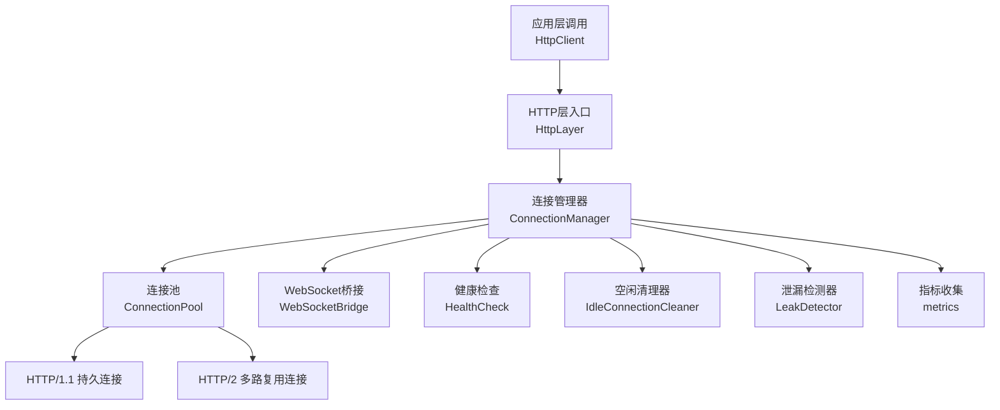
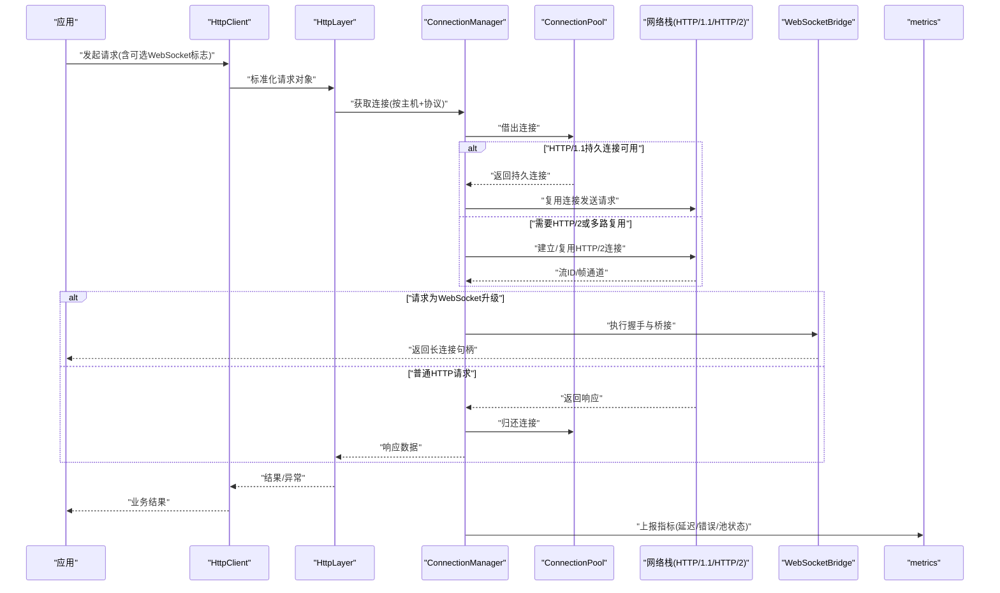
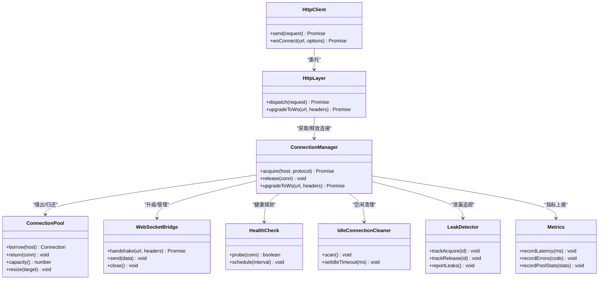
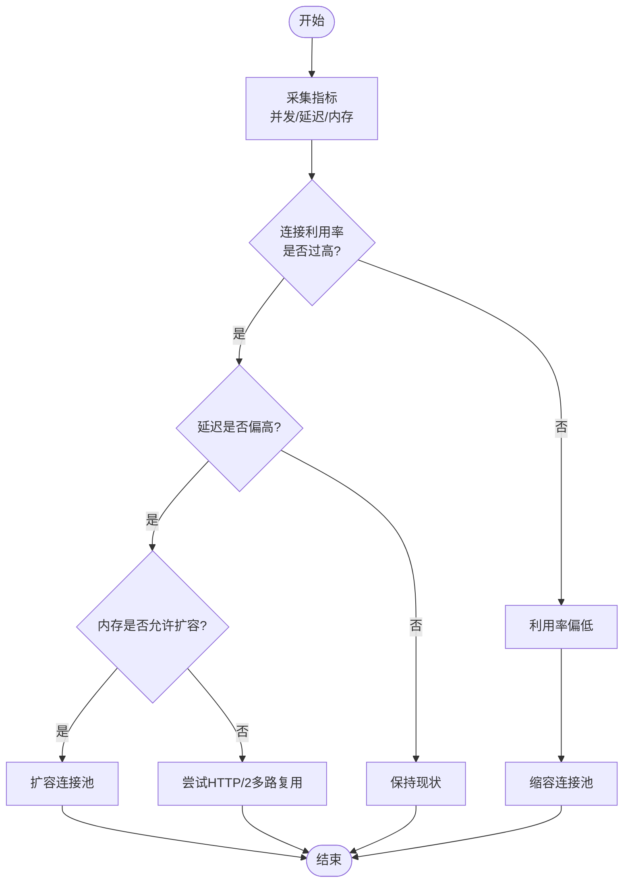
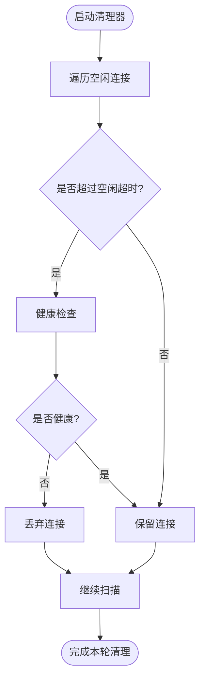
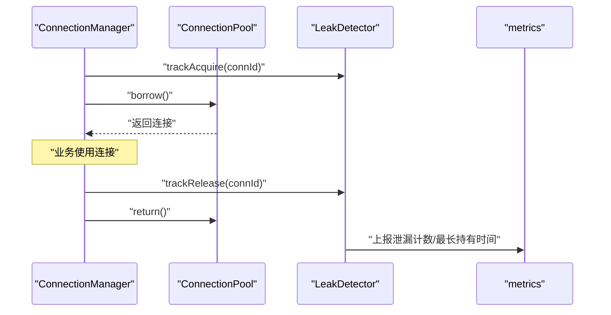
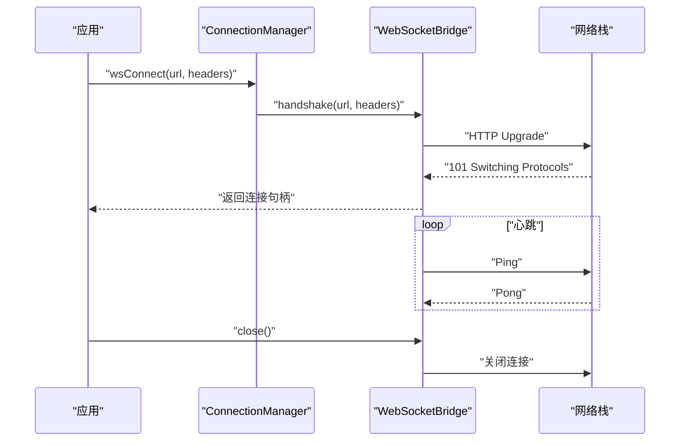
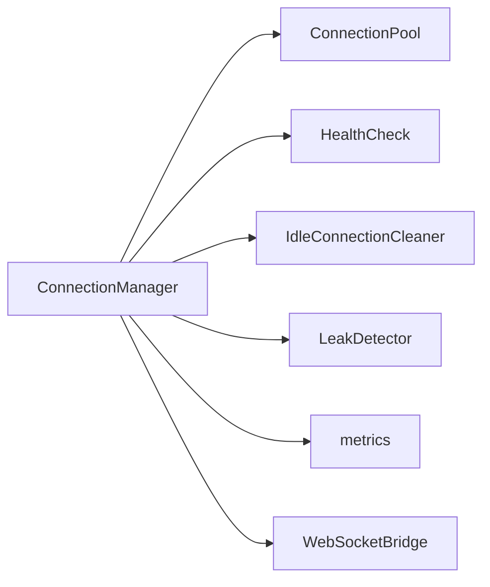

# 连接池优化

<cite>
**本文引用的文件**   
- [engine/packages/http-layer/src/HttpLayer.ts](file://engine/packages/http-layer/src/HttpLayer.ts)
- [engine/packages/http-layer/src/HttpClient.ts](file://engine/packages/http-layer/src/HttpClient.ts)
- [engine/packages/http-layer/src/ConnectionPool.ts](file://engine/packages/http-layer/src/ConnectionPool.ts)
- [engine/packages/http-layer/src/ConnectionManager.ts](file://engine/packages/http-layer/src/ConnectionManager.ts)
- [engine/packages/http-layer/src/IdleConnectionCleaner.ts](file://engine/packages/http-layer/src/IdleConnectionCleaner.ts)
- [engine/packages/http-layer/src/LeakDetector.ts](file://engine/packages/http-layer/src/LeakDetector.ts)
- [engine/packages/http-layer/src/config.ts](file://engine/packages/http-layer/src/config.ts)
- [engine/packages/http-layer/src/metrics.ts](file://engine/packages/http-layer/src/metrics.ts)
- [engine/packages/http-layer/src/WebSocketBridge.ts](file://engine/packages/http-layer/src/WebSocketBridge.ts)
- [engine/packages/http-layer/src/HealthCheck.ts](file://engine/packages/http-layer/src/HealthCheck.ts)
</cite>

## 目录
1. [简介](#简介)
2. [项目结构](#项目结构)
3. [核心组件](#核心组件)
4. [架构总览](#架构总览)
5. [详细组件分析](#详细组件分析)
6. [依赖关系分析](#依赖关系分析)
7. [性能考量](#性能考量)
8. [故障排查指南](#故障排查指南)
9. [结论](#结论)
10. [附录](#附录)

## 简介
本技术文档聚焦于KCoder的HTTP与WebSocket连接池优化，围绕以下目标展开：
- 连接复用机制：HTTP/1.1持久连接、HTTP/2多路复用、WebSocket长连接的管理策略
- 连接池大小调优算法：基于并发数、内存使用、网络延迟的动态调整策略
- 空闲连接清理：超时检测、健康检查、优雅关闭流程
- 连接泄漏检测与预防：连接追踪、资源监控、自动回收机制
- 配置参数说明与性能调优建议：包含实际代码示例路径与最佳实践

## 项目结构
连接池相关实现集中在 http-layer 包中，采用分层与职责分离的设计：
- 高层API：对外暴露统一的客户端接口（请求发送、连接获取）
- 连接管理：负责连接生命周期、复用、升级（HTTP/1.1 -> HTTP/2）、WebSocket桥接
- 连接池：维护空闲连接集合、容量控制、分配与归还
- 清理与健康：定时任务清理空闲连接、健康探测、优雅关闭
- 可观测性：指标采集、告警埋点、泄漏检测

图表来源
- [engine/packages/http-layer/src/HttpLayer.ts](file://engine/packages/http-layer/src/HttpLayer.ts)
- [engine/packages/http-layer/src/HttpClient.ts](file://engine/packages/http-layer/src/HttpClient.ts)
- [engine/packages/http-layer/src/ConnectionManager.ts](file://engine/packages/http-layer/src/ConnectionManager.ts)
- [engine/packages/http-layer/src/ConnectionPool.ts](file://engine/packages/http-layer/src/ConnectionPool.ts)
- [engine/packages/http-layer/src/WebSocketBridge.ts](file://engine/packages/http-layer/src/WebSocketBridge.ts)
- [engine/packages/http-layer/src/HealthCheck.ts](file://engine/packages/http-layer/src/HealthCheck.ts)
- [engine/packages/http-layer/src/IdleConnectionCleaner.ts](file://engine/packages/http-layer/src/IdleConnectionCleaner.ts)
- [engine/packages/http-layer/src/LeakDetector.ts](file://engine/packages/http-layer/src/LeakDetector.ts)
- [engine/packages/http-layer/src/metrics.ts](file://engine/packages/http-layer/src/metrics.ts)

章节来源
- [engine/packages/http-layer/src/HttpLayer.ts](file://engine/packages/http-layer/src/HttpLayer.ts)
- [engine/packages/http-layer/src/HttpClient.ts](file://engine/packages/http-layer/src/HttpClient.ts)
- [engine/packages/http-layer/src/ConnectionManager.ts](file://engine/packages/http-layer/src/ConnectionManager.ts)
- [engine/packages/http-layer/src/ConnectionPool.ts](file://engine/packages/http-layer/src/ConnectionPool.ts)
- [engine/packages/http-layer/src/WebSocketBridge.ts](file://engine/packages/http-layer/src/WebSocketBridge.ts)
- [engine/packages/http-layer/src/HealthCheck.ts](file://engine/packages/http-layer/src/HealthCheck.ts)
- [engine/packages/http-layer/src/IdleConnectionCleaner.ts](file://engine/packages/http-layer/src/IdleConnectionCleaner.ts)
- [engine/packages/http-layer/src/LeakDetector.ts](file://engine/packages/http-layer/src/LeakDetector.ts)
- [engine/packages/http-layer/src/metrics.ts](file://engine/packages/http-layer/src/metrics.ts)

## 核心组件
- HttpClient：面向业务的高层API，封装请求构造、重试、超时、错误处理，并委托给HttpLayer。
- HttpLayer：统一入口，负责协议选择（HTTP/1.1或HTTP/2）、连接获取、响应解析与指标上报。
- ConnectionManager：连接生命周期编排，协调连接池、健康检查、清理器、泄漏检测与WebSocket桥接。
- ConnectionPool：维护按主机分组的空闲连接集合，提供借出/归还、扩容/缩容、容量上限控制。
- IdleConnectionCleaner：周期性扫描空闲连接，依据超时阈值进行回收。
- HealthCheck：对活跃/空闲连接执行轻量探测，剔除不健康连接。
- LeakDetector：跟踪连接借用与归还，识别未归还的连接并触发告警与回收。
- WebSocketBridge：将HTTP升级为WebSocket，管理长连接的生命周期与心跳。
- metrics：集中采集连接池状态、延迟、错误率等指标。
- config：连接池与运行时可调参数的集中定义与校验。

章节来源
- [engine/packages/http-layer/src/HttpClient.ts](file://engine/packages/http-layer/src/HttpClient.ts)
- [engine/packages/http-layer/src/HttpLayer.ts](file://engine/packages/http-layer/src/HttpLayer.ts)
- [engine/packages/http-layer/src/ConnectionManager.ts](file://engine/packages/http-layer/src/ConnectionManager.ts)
- [engine/packages/http-layer/src/ConnectionPool.ts](file://engine/packages/http-layer/src/ConnectionPool.ts)
- [engine/packages/http-layer/src/IdleConnectionCleaner.ts](file://engine/packages/http-layer/src/IdleConnectionCleaner.ts)
- [engine/packages/http-layer/src/HealthCheck.ts](file://engine/packages/http-layer/src/HealthCheck.ts)
- [engine/packages/http-layer/src/LeakDetector.ts](file://engine/packages/http-layer/src/LeakDetector.ts)
- [engine/packages/http-layer/src/WebSocketBridge.ts](file://engine/packages/http-layer/src/WebSocketBridge.ts)
- [engine/packages/http-layer/src/metrics.ts](file://engine/packages/http-layer/src/metrics.ts)
- [engine/packages/http-layer/src/config.ts](file://engine/packages/http-layer/src/config.ts)

## 架构总览
整体采用“入口-管理-池化-运维”的分层架构：
- 入口层：HttpClient与HttpLayer屏蔽底层细节，向上提供一致API
- 管理层：ConnectionManager作为中枢，调度连接池、健康检查、清理、泄漏检测与WebSocket升级
- 池化层：ConnectionPool按主机维度组织连接，支持HTTP/1.1持久与HTTP/2多路复用
- 运维层：IdleConnectionCleaner、HealthCheck、LeakDetector、metrics保障稳定性与可观测性

图表来源
- [engine/packages/http-layer/src/HttpClient.ts](file://engine/packages/http-layer/src/HttpClient.ts)
- [engine/packages/http-layer/src/HttpLayer.ts](file://engine/packages/http-layer/src/HttpLayer.ts)
- [engine/packages/http-layer/src/ConnectionManager.ts](file://engine/packages/http-layer/src/ConnectionManager.ts)
- [engine/packages/http-layer/src/ConnectionPool.ts](file://engine/packages/http-layer/src/ConnectionPool.ts)
- [engine/packages/http-layer/src/WebSocketBridge.ts](file://engine/packages/http-layer/src/WebSocketBridge.ts)
- [engine/packages/http-layer/src/metrics.ts](file://engine/packages/http-layer/src/metrics.ts)

## 详细组件分析

### 连接复用机制（HTTP/1.1持久连接、HTTP/2多路复用、WebSocket长连接）
- HTTP/1.1持久连接
  - 通过Keep-Alive维持TCP连接，减少握手开销
  - 连接池按主机分组，优先复用同主机的空闲连接
  - 在请求完成后归还连接，供后续请求复用
- HTTP/2多路复用
  - 单连接上并发多个请求，降低连接创建成本
  - 根据服务器协商能力与负载情况动态选择HTTP/2
  - 流级别限流与背压，避免单连接过载
- WebSocket长连接
  - 通过Upgrade从HTTP升级到WebSocket
  - 由WebSocketBridge接管生命周期，包括心跳、重连、消息路由
  - 与HTTP连接池解耦，独立管理与监控

图表来源
- [engine/packages/http-layer/src/HttpClient.ts](file://engine/packages/http-layer/src/HttpClient.ts)
- [engine/packages/http-layer/src/HttpLayer.ts](file://engine/packages/http-layer/src/HttpLayer.ts)
- [engine/packages/http-layer/src/ConnectionManager.ts](file://engine/packages/http-layer/src/ConnectionManager.ts)
- [engine/packages/http-layer/src/ConnectionPool.ts](file://engine/packages/http-layer/src/ConnectionPool.ts)
- [engine/packages/http-layer/src/WebSocketBridge.ts](file://engine/packages/http-layer/src/WebSocketBridge.ts)
- [engine/packages/http-layer/src/HealthCheck.ts](file://engine/packages/http-layer/src/HealthCheck.ts)
- [engine/packages/http-layer/src/IdleConnectionCleaner.ts](file://engine/packages/http-layer/src/IdleConnectionCleaner.ts)
- [engine/packages/http-layer/src/LeakDetector.ts](file://engine/packages/http-layer/src/LeakDetector.ts)
- [engine/packages/http-layer/src/metrics.ts](file://engine/packages/http-layer/src/metrics.ts)

章节来源
- [engine/packages/http-layer/src/HttpClient.ts](file://engine/packages/http-layer/src/HttpClient.ts)
- [engine/packages/http-layer/src/HttpLayer.ts](file://engine/packages/http-layer/src/HttpLayer.ts)
- [engine/packages/http-layer/src/ConnectionManager.ts](file://engine/packages/http-layer/src/ConnectionManager.ts)
- [engine/packages/http-layer/src/ConnectionPool.ts](file://engine/packages/http-layer/src/ConnectionPool.ts)
- [engine/packages/http-layer/src/WebSocketBridge.ts](file://engine/packages/http-layer/src/WebSocketBridge.ts)
- [engine/packages/http-layer/src/HealthCheck.ts](file://engine/packages/http-layer/src/HealthCheck.ts)
- [engine/packages/http-layer/src/IdleConnectionCleaner.ts](file://engine/packages/http-layer/src/IdleConnectionCleaner.ts)
- [engine/packages/http-layer/src/LeakDetector.ts](file://engine/packages/http-layer/src/LeakDetector.ts)
- [engine/packages/http-layer/src/metrics.ts](file://engine/packages/http-layer/src/metrics.ts)

### 连接池大小调优算法（基于并发数、内存使用、网络延迟的动态调整）
- 输入指标
  - 并发请求数：单位时间内待处理的请求峰值
  - 内存使用：连接对象与缓冲占用的内存
  - 网络延迟：P50/P95延迟，以及丢包/重传率
- 目标函数
  - 最小化平均延迟与尾延迟
  - 最大化吞吐
  - 约束内存占用不超过阈值
- 动态调整策略
  - 当延迟上升且内存充裕时，适度提升池容量
  - 当内存接近阈值或延迟持续升高，降低容量或启用HTTP/2多路复用以缓解拥塞
  - 结合历史窗口平滑调整，避免抖动
- 自适应步骤
  - 采样最近时间窗口的延迟与错误率
  - 计算当前利用率（已用连接/最大容量）
  - 若利用率高且延迟高，则扩容；若利用率低且延迟高，则考虑切换协议或增加并发度
  - 若内存超限，强制缩容并触发清理

图表来源
- [engine/packages/http-layer/src/ConnectionPool.ts](file://engine/packages/http-layer/src/ConnectionPool.ts)
- [engine/packages/http-layer/src/metrics.ts](file://engine/packages/http-layer/src/metrics.ts)
- [engine/packages/http-layer/src/config.ts](file://engine/packages/http-layer/src/config.ts)

章节来源
- [engine/packages/http-layer/src/ConnectionPool.ts](file://engine/packages/http-layer/src/ConnectionPool.ts)
- [engine/packages/http-layer/src/metrics.ts](file://engine/packages/http-layer/src/metrics.ts)
- [engine/packages/http-layer/src/config.ts](file://engine/packages/http-layer/src/config.ts)

### 空闲连接清理机制（超时检测、健康检查、优雅关闭）
- 超时检测
  - 定期扫描空闲连接，超过空闲超时阈值的连接将被回收
  - 针对HTTP/1.1与HTTP/2分别设置合理的空闲超时
- 健康检查
  - 对空闲/活跃连接执行轻量探测（如HEAD请求或Ping）
  - 失败连接直接丢弃，避免污染池
- 优雅关闭
  - 停止接受新请求
  - 等待活跃请求完成
  - 关闭空闲连接并释放资源
  - 上报最终指标并退出

图表来源
- [engine/packages/http-layer/src/IdleConnectionCleaner.ts](file://engine/packages/http-layer/src/IdleConnectionCleaner.ts)
- [engine/packages/http-layer/src/HealthCheck.ts](file://engine/packages/http-layer/src/HealthCheck.ts)

章节来源
- [engine/packages/http-layer/src/IdleConnectionCleaner.ts](file://engine/packages/http-layer/src/IdleConnectionCleaner.ts)
- [engine/packages/http-layer/src/HealthCheck.ts](file://engine/packages/http-layer/src/HealthCheck.ts)

### 连接泄漏检测与预防方案（连接追踪、资源监控、自动回收）
- 连接追踪
  - 每次借出连接生成唯一ID并记录调用栈
  - 归还时匹配ID并移除追踪记录
- 资源监控
  - 统计未归还连接数量、最长持有时间、热点主机
  - 与指标系统对接，输出告警
- 自动回收
  - 对超过最大持有时间的连接强制回收
  - 触发清理任务并记录泄漏事件

图表来源
- [engine/packages/http-layer/src/ConnectionManager.ts](file://engine/packages/http-layer/src/ConnectionManager.ts)
- [engine/packages/http-layer/src/ConnectionPool.ts](file://engine/packages/http-layer/src/ConnectionPool.ts)
- [engine/packages/http-layer/src/LeakDetector.ts](file://engine/packages/http-layer/src/LeakDetector.ts)
- [engine/packages/http-layer/src/metrics.ts](file://engine/packages/http-layer/src/metrics.ts)

章节来源
- [engine/packages/http-layer/src/ConnectionManager.ts](file://engine/packages/http-layer/src/ConnectionManager.ts)
- [engine/packages/http-layer/src/ConnectionPool.ts](file://engine/packages/http-layer/src/ConnectionPool.ts)
- [engine/packages/http-layer/src/LeakDetector.ts](file://engine/packages/http-layer/src/LeakDetector.ts)
- [engine/packages/http-layer/src/metrics.ts](file://engine/packages/http-layer/src/metrics.ts)

### WebSocket长连接管理策略
- 握手与升级
  - 通过HTTP Upgrade完成握手，成功后交由WebSocketBridge管理
- 心跳与重连
  - 周期性心跳保活，断线自动重连，带指数退避
- 资源隔离
  - 与HTTP连接池解耦，单独统计与清理
- 优雅关闭
  - 停止接收新消息，等待队列清空后关闭连接

图表来源
- [engine/packages/http-layer/src/ConnectionManager.ts](file://engine/packages/http-layer/src/ConnectionManager.ts)
- [engine/packages/http-layer/src/WebSocketBridge.ts](file://engine/packages/http-layer/src/WebSocketBridge.ts)

章节来源
- [engine/packages/http-layer/src/ConnectionManager.ts](file://engine/packages/http-layer/src/ConnectionManager.ts)
- [engine/packages/http-layer/src/WebSocketBridge.ts](file://engine/packages/http-layer/src/WebSocketBridge.ts)

## 依赖关系分析
- 耦合与内聚
  - ConnectionManager作为中枢，聚合连接池、健康检查、清理器、泄漏检测与指标，内聚性强
  - ConnectionPool专注于连接集合与容量控制，职责清晰
- 外部依赖
  - 网络栈（HTTP/1.1与HTTP/2实现）
  - 指标系统与日志系统
- 潜在循环依赖
  - 通过接口抽象与事件通知避免模块间直接循环引用

图表来源
- [engine/packages/http-layer/src/ConnectionManager.ts](file://engine/packages/http-layer/src/ConnectionManager.ts)
- [engine/packages/http-layer/src/ConnectionPool.ts](file://engine/packages/http-layer/src/ConnectionPool.ts)
- [engine/packages/http-layer/src/HealthCheck.ts](file://engine/packages/http-layer/src/HealthCheck.ts)
- [engine/packages/http-layer/src/IdleConnectionCleaner.ts](file://engine/packages/http-layer/src/IdleConnectionCleaner.ts)
- [engine/packages/http-layer/src/LeakDetector.ts](file://engine/packages/http-layer/src/LeakDetector.ts)
- [engine/packages/http-layer/src/metrics.ts](file://engine/packages/http-layer/src/metrics.ts)
- [engine/packages/http-layer/src/WebSocketBridge.ts](file://engine/packages/http-layer/src/WebSocketBridge.ts)

章节来源
- [engine/packages/http-layer/src/ConnectionManager.ts](file://engine/packages/http-layer/src/ConnectionManager.ts)
- [engine/packages/http-layer/src/ConnectionPool.ts](file://engine/packages/http-layer/src/ConnectionPool.ts)
- [engine/packages/http-layer/src/HealthCheck.ts](file://engine/packages/http-layer/src/HealthCheck.ts)
- [engine/packages/http-layer/src/IdleConnectionCleaner.ts](file://engine/packages/http-layer/src/IdleConnectionCleaner.ts)
- [engine/packages/http-layer/src/LeakDetector.ts](file://engine/packages/http-layer/src/LeakDetector.ts)
- [engine/packages/http-layer/src/metrics.ts](file://engine/packages/http-layer/src/metrics.ts)
- [engine/packages/http-layer/src/WebSocketBridge.ts](file://engine/packages/http-layer/src/WebSocketBridge.ts)

## 性能考量
- 协议选择
  - 优先HTTP/2多路复用以降低连接开销，回退到HTTP/1.1持久连接
- 容量规划
  - 根据并发峰值与延迟目标设定初始容量，再结合自适应算法微调
- 内存控制
  - 限制每个连接的缓冲大小，防止内存膨胀
- 背压与限流
  - 在高延迟场景下限制并发，避免雪崩
- 指标驱动
  - 基于延迟、错误率、利用率进行闭环调优

[本节为通用指导，无需具体文件分析]

## 故障排查指南
- 常见问题
  - 连接泄漏：未归还连接导致池耗尽
  - 健康检查失败：频繁探测失败导致连接被误删
  - 容量不足：峰值期间延迟飙升
- 定位方法
  - 查看泄漏检测器的未归还连接列表与最长持有时间
  - 检查健康检查日志与失败原因
  - 观察连接池利用率与延迟分布
- 处置建议
  - 修复业务逻辑中的连接归还路径
  - 调整健康检查阈值与重试策略
  - 动态扩容或启用HTTP/2多路复用

章节来源
- [engine/packages/http-layer/src/LeakDetector.ts](file://engine/packages/http-layer/src/LeakDetector.ts)
- [engine/packages/http-layer/src/HealthCheck.ts](file://engine/packages/http-layer/src/HealthCheck.ts)
- [engine/packages/http-layer/src/metrics.ts](file://engine/packages/http-layer/src/metrics.ts)

## 结论
通过分层架构与职责分离，KCoder的连接池实现了高效的连接复用、自适应容量调优、完善的空闲清理与健康检查、以及可靠的泄漏检测与回收。配合指标与告警，可在复杂网络环境下保持稳定与高性能。

[本节为总结，无需具体文件分析]

## 附录
- 配置参数说明（节选）
  - 最大连接数：按主机维度的连接上限
  - 空闲超时：空闲连接回收阈值
  - 健康检查间隔：探测频率
  - 最大持有时间：连接最长存活时间
  - HTTP/2启用开关与并发流限制
  - 指标上报间隔与采样窗口
- 最佳实践
  - 生产环境优先启用HTTP/2，合理设置并发流限制
  - 根据业务特征调整空闲超时与健康检查间隔
  - 开启泄漏检测与告警，定期审查未归还连接
  - 结合指标进行容量规划与动态调优

章节来源
- [engine/packages/http-layer/src/config.ts](file://engine/packages/http-layer/src/config.ts)
- [engine/packages/http-layer/src/metrics.ts](file://engine/packages/http-layer/src/metrics.ts)