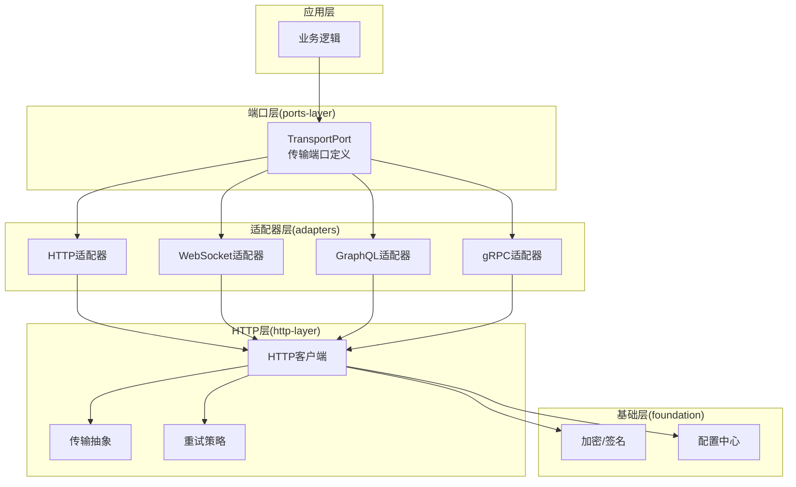
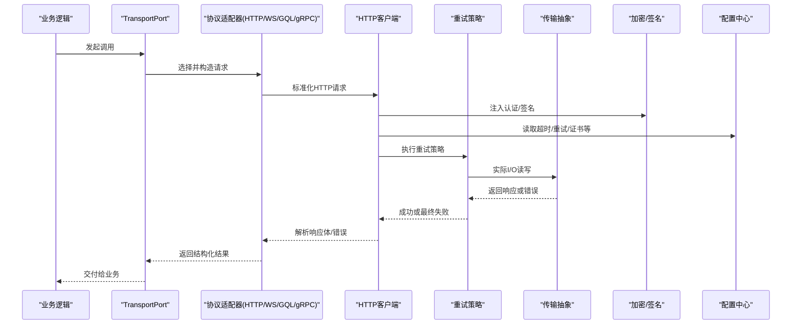
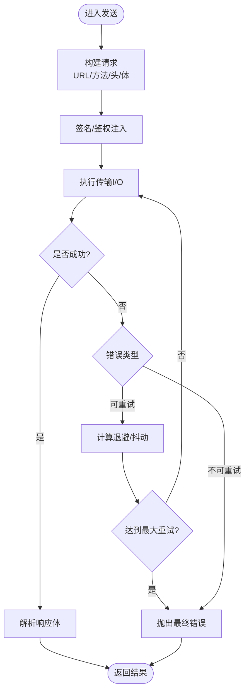
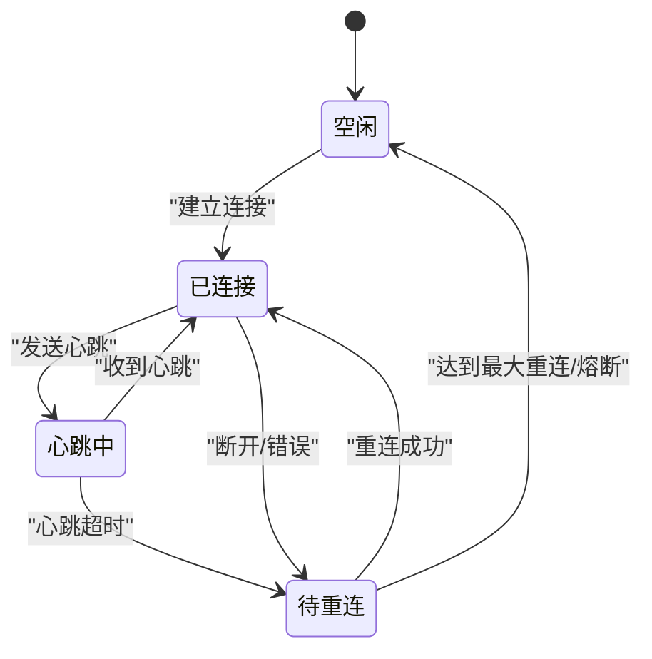
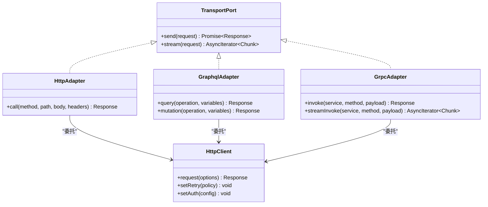
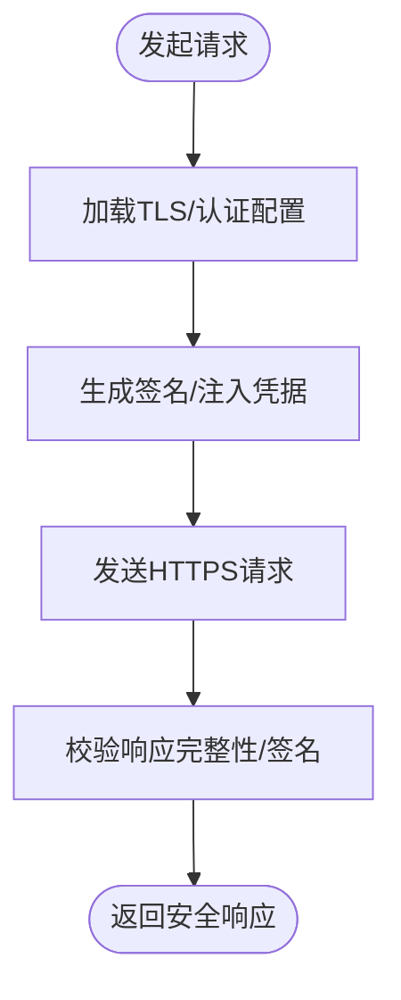
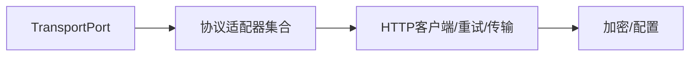

# 网络适配器

<cite>
**本文引用的文件**   
- [engine/packages/http-layer/src/index.ts](file://engine/packages/http-layer/src/index.ts)
- [engine/packages/http-layer/src/client.ts](file://engine/packages/http-layer/src/client.ts)
- [engine/packages/http-layer/src/retry.ts](file://engine/packages/http-layer/src/retry.ts)
- [engine/packages/http-layer/src/transport.ts](file://engine/packages/http-layer/src/transport.ts)
- [engine/packages/adapters/src/http-adapter.ts](file://engine/packages/adapters/src/http-adapter.ts)
- [engine/packages/adapters/src/ws-adapter.ts](file://engine/packages/adapters/src/ws-adapter.ts)
- [engine/packages/adapters/src/grpc-adapter.ts](file://engine/packages/adapters/src/grpc-adapter.ts)
- [engine/packages/adapters/src/graphql-adapter.ts](file://engine/packages/adapters/src/graphql-adapter.ts)
- [engine/packages/foundation/src/crypto.ts](file://engine/packages/foundation/src/crypto.ts)
- [engine/packages/foundation/src/config.ts](file://engine/packages/foundation/src/config.ts)
- [engine/packages/ports-layer/src/transport-port.ts](file://engine/packages/ports-layer/src/transport-port.ts)
- [engine/tests/http-peer-transport.test.ts](file://engine/tests/http-peer-transport.test.ts)
- [engine/tests/http-server-observability.test.ts](file://engine/tests/http-server-observability.test.ts)
</cite>

## 目录
1. [简介](#简介)
2. [项目结构](#项目结构)
3. [核心组件](#核心组件)
4. [架构总览](#架构总览)
5. [详细组件分析](#详细组件分析)
6. [依赖关系分析](#依赖关系分析)
7. [性能考虑](#性能考虑)
8. [故障排查指南](#故障排查指南)
9. [结论](#结论)
10. [附录](#附录)

## 简介
本技术文档面向KCoder的网络适配器，聚焦以下目标：
- HTTP客户端适配器的实现细节：请求构建、响应解析、错误处理与重试机制。
- WebSocket连接管理：连接建立、消息收发、断线重连与心跳检测。
- 多协议统一封装：REST API、GraphQL、gRPC的协议适配器设计与调用路径。
- 安全机制：SSL/TLS配置、身份认证、授权控制、请求签名。
- 性能优化：连接池、请求合并、压缩传输、CDN集成策略。
- 监控与调试：可观测性指标、日志与诊断工具的使用建议。

## 项目结构
本项目采用分层与插件化设计，网络相关能力主要分布在以下包中：
- http-layer：HTTP客户端、传输抽象、重试策略等通用能力。
- adapters：面向上层业务的多协议适配器（HTTP、WebSocket、GraphQL、gRPC）。
- foundation：基础能力（加密、配置、常量等）。
- ports-layer：对外暴露的端口/接口定义，供上层编排使用。
- tests：针对HTTP传输与可观测性的测试用例，用于验证行为与回归。

图表来源
- [engine/packages/ports-layer/src/transport-port.ts](file://engine/packages/ports-layer/src/transport-port.ts)
- [engine/packages/adapters/src/http-adapter.ts](file://engine/packages/adapters/src/http-adapter.ts)
- [engine/packages/adapters/src/ws-adapter.ts](file://engine/packages/adapters/src/ws-adapter.ts)
- [engine/packages/adapters/src/graphql-adapter.ts](file://engine/packages/adapters/src/graphql-adapter.ts)
- [engine/packages/adapters/src/grpc-adapter.ts](file://engine/packages/adapters/src/grpc-adapter.ts)
- [engine/packages/http-layer/src/index.ts](file://engine/packages/http-layer/src/index.ts)
- [engine/packages/http-layer/src/client.ts](file://engine/packages/http-layer/src/client.ts)
- [engine/packages/http-layer/src/transport.ts](file://engine/packages/http-layer/src/transport.ts)
- [engine/packages/http-layer/src/retry.ts](file://engine/packages/http-layer/src/retry.ts)
- [engine/packages/foundation/src/crypto.ts](file://engine/packages/foundation/src/crypto.ts)
- [engine/packages/foundation/src/config.ts](file://engine/packages/foundation/src/config.ts)

章节来源
- [engine/packages/http-layer/src/index.ts](file://engine/packages/http-layer/src/index.ts)
- [engine/packages/http-layer/src/client.ts](file://engine/packages/http-layer/src/client.ts)
- [engine/packages/http-layer/src/transport.ts](file://engine/packages/http-layer/src/transport.ts)
- [engine/packages/http-layer/src/retry.ts](file://engine/packages/http-layer/src/retry.ts)
- [engine/packages/adapters/src/http-adapter.ts](file://engine/packages/adapters/src/http-adapter.ts)
- [engine/packages/adapters/src/ws-adapter.ts](file://engine/packages/adapters/src/ws-adapter.ts)
- [engine/packages/adapters/src/graphql-adapter.ts](file://engine/packages/adapters/src/graphql-adapter.ts)
- [engine/packages/adapters/src/grpc-adapter.ts](file://engine/packages/adapters/src/grpc-adapter.ts)
- [engine/packages/foundation/src/crypto.ts](file://engine/packages/foundation/src/crypto.ts)
- [engine/packages/foundation/src/config.ts](file://engine/packages/foundation/src/config.ts)
- [engine/packages/ports-layer/src/transport-port.ts](file://engine/packages/ports-layer/src/transport-port.ts)

## 核心组件
- HTTP客户端：负责请求构建、序列化、鉴权头注入、压缩与重试；提供统一的发送与接收接口。
- 传输抽象：屏蔽底层差异（Node/浏览器），统一I/O语义。
- 重试策略：支持指数退避、抖动、最大重试次数与可重试状态码判定。
- 协议适配器：将不同协议（REST/GraphQL/gRPC）的请求转换为HTTP层的标准调用。
- WebSocket适配器：维护长连接、心跳、自动重连与消息路由。
- 安全模块：提供TLS配置、签名生成与校验、凭据注入。
- 配置中心：集中管理端点、超时、重试、证书、代理等参数。

章节来源
- [engine/packages/http-layer/src/client.ts](file://engine/packages/http-layer/src/client.ts)
- [engine/packages/http-layer/src/transport.ts](file://engine/packages/http-layer/src/transport.ts)
- [engine/packages/http-layer/src/retry.ts](file://engine/packages/http-layer/src/retry.ts)
- [engine/packages/adapters/src/http-adapter.ts](file://engine/packages/adapters/src/http-adapter.ts)
- [engine/packages/adapters/src/ws-adapter.ts](file://engine/packages/adapters/src/ws-adapter.ts)
- [engine/packages/adapters/src/graphql-adapter.ts](file://engine/packages/adapters/src/graphql-adapter.ts)
- [engine/packages/adapters/src/grpc-adapter.ts](file://engine/packages/adapters/src/grpc-adapter.ts)
- [engine/packages/foundation/src/crypto.ts](file://engine/packages/foundation/src/crypto.ts)
- [engine/packages/foundation/src/config.ts](file://engine/packages/foundation/src/config.ts)

## 架构总览
下图展示了从业务到网络的端到端调用路径，以及各层职责边界。

图表来源
- [engine/packages/ports-layer/src/transport-port.ts](file://engine/packages/ports-layer/src/transport-port.ts)
- [engine/packages/adapters/src/http-adapter.ts](file://engine/packages/adapters/src/http-adapter.ts)
- [engine/packages/adapters/src/ws-adapter.ts](file://engine/packages/adapters/src/ws-adapter.ts)
- [engine/packages/adapters/src/graphql-adapter.ts](file://engine/packages/adapters/src/graphql-adapter.ts)
- [engine/packages/adapters/src/grpc-adapter.ts](file://engine/packages/adapters/src/grpc-adapter.ts)
- [engine/packages/http-layer/src/client.ts](file://engine/packages/http-layer/src/client.ts)
- [engine/packages/http-layer/src/retry.ts](file://engine/packages/http-layer/src/retry.ts)
- [engine/packages/http-layer/src/transport.ts](file://engine/packages/http-layer/src/transport.ts)
- [engine/packages/foundation/src/crypto.ts](file://engine/packages/foundation/src/crypto.ts)
- [engine/packages/foundation/src/config.ts](file://engine/packages/foundation/src/config.ts)

## 详细组件分析

### HTTP客户端适配器
- 请求构建
  - 基于URL、方法、头部、查询参数与请求体组装标准HTTP请求。
  - 根据内容类型进行序列化（JSON/表单/二进制）。
  - 注入通用头部（如用户代理、追踪ID、语言偏好等）。
- 响应解析
  - 按Content-Type解析响应体为对象/流/字节数组。
  - 对错误响应映射为统一错误模型（含状态码、错误码、消息、堆栈）。
- 错误处理
  - 区分网络错误、超时、服务端错误与业务错误。
  - 记录上下文信息（请求ID、耗时、端点、重试次数）。
- 重试机制
  - 支持指数退避与随机抖动。
  - 仅对幂等方法与特定状态码触发重试。
  - 可配置最大重试次数与单次重试延迟上限。

图表来源
- [engine/packages/http-layer/src/client.ts](file://engine/packages/http-layer/src/client.ts)
- [engine/packages/http-layer/src/retry.ts](file://engine/packages/http-layer/src/retry.ts)
- [engine/packages/http-layer/src/transport.ts](file://engine/packages/http-layer/src/transport.ts)
- [engine/packages/foundation/src/crypto.ts](file://engine/packages/foundation/src/crypto.ts)

章节来源
- [engine/packages/http-layer/src/client.ts](file://engine/packages/http-layer/src/client.ts)
- [engine/packages/http-layer/src/retry.ts](file://engine/packages/http-layer/src/retry.ts)
- [engine/packages/http-layer/src/transport.ts](file://engine/packages/http-layer/src/transport.ts)
- [engine/packages/foundation/src/crypto.ts](file://engine/packages/foundation/src/crypto.ts)

### WebSocket连接管理
- 连接建立
  - 基于配置中的端点与协议（ws/wss）创建连接。
  - 在握手阶段注入认证头与自定义协议标识。
- 消息收发
  - 提供发送与订阅接口，支持文本/二进制帧。
  - 内部维护消息ID与回调队列，保证有序与超时回收。
- 断线重连
  - 监听关闭事件，按退避策略自动重连。
  - 支持最大重连次数与全局熔断保护。
- 心跳检测
  - 周期性发送心跳帧，未收到心跳则判定异常并触发重连。
  - 心跳间隔与超时阈值可配置。

图表来源
- [engine/packages/adapters/src/ws-adapter.ts](file://engine/packages/adapters/src/ws-adapter.ts)
- [engine/packages/http-layer/src/transport.ts](file://engine/packages/http-layer/src/transport.ts)

章节来源
- [engine/packages/adapters/src/ws-adapter.ts](file://engine/packages/adapters/src/ws-adapter.ts)
- [engine/packages/http-layer/src/transport.ts](file://engine/packages/http-layer/src/transport.ts)

### 多协议适配器（REST/GraphQL/gRPC）
- REST API适配器
  - 将REST资源映射为HTTP方法，自动拼接路径与查询参数。
  - 支持分页、过滤与批量操作的统一封装。
- GraphQL适配器
  - 将查询/变更转为POST JSON负载，附带操作名与变量。
  - 支持内联片段与缓存键生成。
- gRPC适配器
  - 通过HTTP/2通道承载gRPC-over-HTTP，统一序列化与元数据传递。
  - 支持流式调用的半双工模式。

图表来源
- [engine/packages/ports-layer/src/transport-port.ts](file://engine/packages/ports-layer/src/transport-port.ts)
- [engine/packages/adapters/src/http-adapter.ts](file://engine/packages/adapters/src/http-adapter.ts)
- [engine/packages/adapters/src/graphql-adapter.ts](file://engine/packages/adapters/src/graphql-adapter.ts)
- [engine/packages/adapters/src/grpc-adapter.ts](file://engine/packages/adapters/src/grpc-adapter.ts)
- [engine/packages/http-layer/src/client.ts](file://engine/packages/http-layer/src/client.ts)

章节来源
- [engine/packages/ports-layer/src/transport-port.ts](file://engine/packages/ports-layer/src/transport-port.ts)
- [engine/packages/adapters/src/http-adapter.ts](file://engine/packages/adapters/src/http-adapter.ts)
- [engine/packages/adapters/src/graphql-adapter.ts](file://engine/packages/adapters/src/graphql-adapter.ts)
- [engine/packages/adapters/src/grpc-adapter.ts](file://engine/packages/adapters/src/grpc-adapter.ts)
- [engine/packages/http-layer/src/client.ts](file://engine/packages/http-layer/src/client.ts)

### 安全机制
- SSL/TLS配置
  - 支持自定义CA证书、客户端证书与密码套件选择。
  - 支持SNI与ALPN协商。
- 身份认证
  - 支持Bearer Token、API Key、双向TLS等多种方式。
  - 支持动态刷新令牌与失效回退。
- 授权控制
  - 基于角色/权限的访问控制，结合网关或后端校验。
- 请求签名
  - 对关键请求进行HMAC签名，包含时间戳与随机数防重放。
  - 服务端侧校验签名与时间窗口。

图表来源
- [engine/packages/foundation/src/crypto.ts](file://engine/packages/foundation/src/crypto.ts)
- [engine/packages/foundation/src/config.ts](file://engine/packages/foundation/src/config.ts)
- [engine/packages/http-layer/src/client.ts](file://engine/packages/http-layer/src/client.ts)

章节来源
- [engine/packages/foundation/src/crypto.ts](file://engine/packages/foundation/src/crypto.ts)
- [engine/packages/foundation/src/config.ts](file://engine/packages/foundation/src/config.ts)
- [engine/packages/http-layer/src/client.ts](file://engine/packages/http-layer/src/client.ts)

## 依赖关系分析
- 耦合与内聚
  - 适配器层对HTTP层低耦合，通过TransportPort统一入口，便于替换实现。
  - 重试与传输解耦，便于独立扩展与测试。
- 外部依赖
  - TLS/加密由foundation提供，避免在各层重复实现。
  - 配置集中管理，减少硬编码与分散配置。
- 循环依赖
  - 当前分层清晰，未发现直接循环依赖。

图表来源
- [engine/packages/ports-layer/src/transport-port.ts](file://engine/packages/ports-layer/src/transport-port.ts)
- [engine/packages/adapters/src/http-adapter.ts](file://engine/packages/adapters/src/http-adapter.ts)
- [engine/packages/adapters/src/ws-adapter.ts](file://engine/packages/adapters/src/ws-adapter.ts)
- [engine/packages/adapters/src/graphql-adapter.ts](file://engine/packages/adapters/src/graphql-adapter.ts)
- [engine/packages/adapters/src/grpc-adapter.ts](file://engine/packages/adapters/src/grpc-adapter.ts)
- [engine/packages/http-layer/src/client.ts](file://engine/packages/http-layer/src/client.ts)
- [engine/packages/http-layer/src/retry.ts](file://engine/packages/http-layer/src/retry.ts)
- [engine/packages/http-layer/src/transport.ts](file://engine/packages/http-layer/src/transport.ts)
- [engine/packages/foundation/src/crypto.ts](file://engine/packages/foundation/src/crypto.ts)
- [engine/packages/foundation/src/config.ts](file://engine/packages/foundation/src/config.ts)

章节来源
- [engine/packages/ports-layer/src/transport-port.ts](file://engine/packages/ports-layer/src/transport-port.ts)
- [engine/packages/adapters/src/http-adapter.ts](file://engine/packages/adapters/src/http-adapter.ts)
- [engine/packages/adapters/src/ws-adapter.ts](file://engine/packages/adapters/src/ws-adapter.ts)
- [engine/packages/adapters/src/graphql-adapter.ts](file://engine/packages/adapters/src/graphql-adapter.ts)
- [engine/packages/adapters/src/grpc-adapter.ts](file://engine/packages/adapters/src/grpc-adapter.ts)
- [engine/packages/http-layer/src/client.ts](file://engine/packages/http-layer/src/client.ts)
- [engine/packages/http-layer/src/retry.ts](file://engine/packages/http-layer/src/retry.ts)
- [engine/packages/http-layer/src/transport.ts](file://engine/packages/http-layer/src/transport.ts)
- [engine/packages/foundation/src/crypto.ts](file://engine/packages/foundation/src/crypto.ts)
- [engine/packages/foundation/src/config.ts](file://engine/packages/foundation/src/config.ts)

## 性能考虑
- 连接池
  - 复用TCP/HTTP连接，降低握手开销。
  - 合理设置最大并发与空闲回收策略。
- 请求合并
  - 对短周期内的相同请求进行去重与合并，减少冗余流量。
- 压缩传输
  - 启用Gzip/Brotli压缩，降低带宽占用。
- CDN集成
  - 静态资源与只读接口优先走CDN，提升命中率与延迟表现。
- 超时与背压
  - 细粒度设置连接、读写与整体超时。
  - 对下游过载场景实施限流与快速失败。

[本节为通用指导，不直接分析具体文件]

## 故障排查指南
- 常见问题定位
  - 连接失败：检查TLS证书、代理与DNS解析。
  - 鉴权失败：确认Token有效期、签名算法与时钟同步。
  - 频繁重试：观察状态码分布与退避参数是否合理。
  - WebSocket不稳定：关注心跳间隔、超时阈值与重连策略。
- 可观测性与日志
  - 记录请求ID、耗时、状态码、错误码与重试次数。
  - 输出链路追踪标签，便于跨服务定位问题。
- 测试与回归
  - 使用现有测试用例验证传输与可观测性行为。

章节来源
- [engine/tests/http-peer-transport.test.ts](file://engine/tests/http-peer-transport.test.ts)
- [engine/tests/http-server-observability.test.ts](file://engine/tests/http-server-observability.test.ts)

## 结论
KCoder的网络适配器通过分层与插件化设计，实现了HTTP客户端、WebSocket管理与多协议适配的统一封装。借助重试、安全与配置中心，系统在可靠性与安全性方面具备良好基础。配合连接池、压缩与CDN等优化手段，可在复杂网络环境下保持高可用与高性能。建议在上线前完善监控与告警，持续跟踪关键指标并进行容量规划。

[本节为总结性内容，不直接分析具体文件]

## 附录
- 术语
  - 传输：指底层I/O抽象，屏蔽平台差异。
  - 适配器：将上层协议调用转换为HTTP层标准请求。
  - 重试策略：决定何时重试与如何退避的规则。
- 参考实现路径
  - HTTP客户端与重试：见http-layer相关文件。
  - 协议适配器：见adapters下对应适配器文件。
  - 安全与配置：见foundation下的crypto与config文件。
  - 端口定义：见ports-layer的transport-port文件。

[本节为补充说明，不直接分析具体文件]