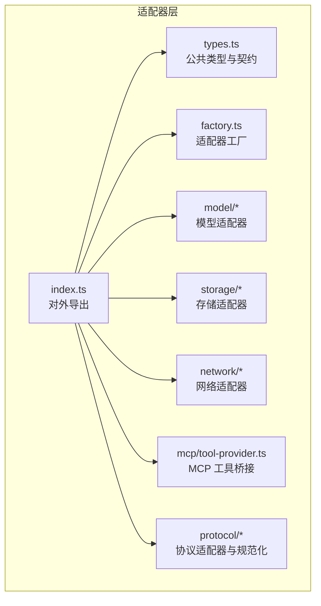
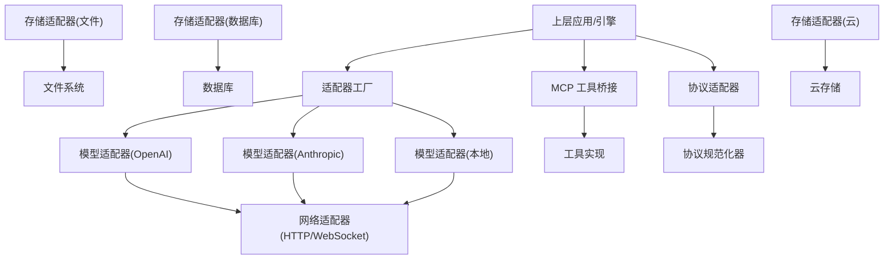
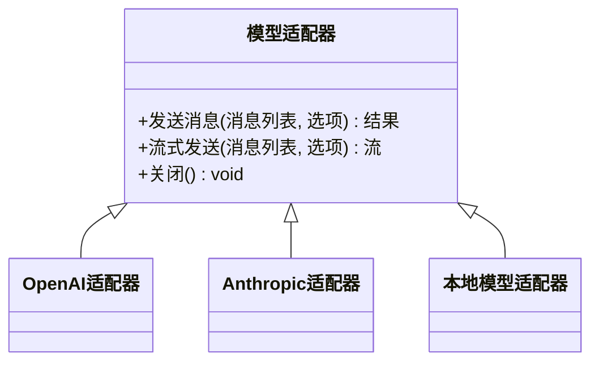
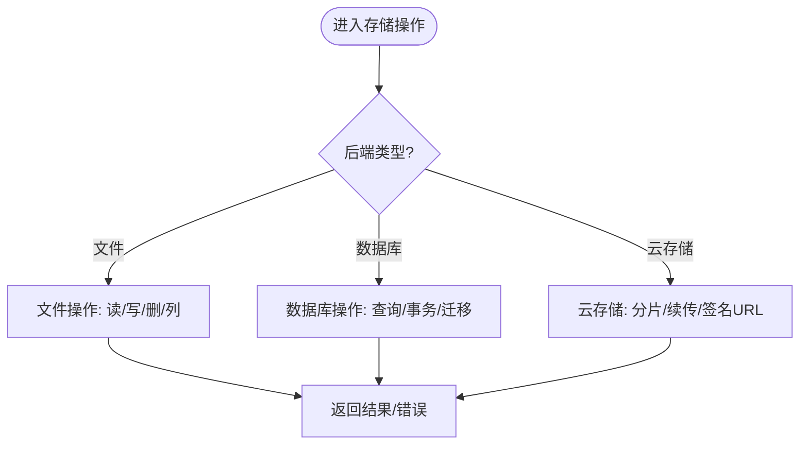
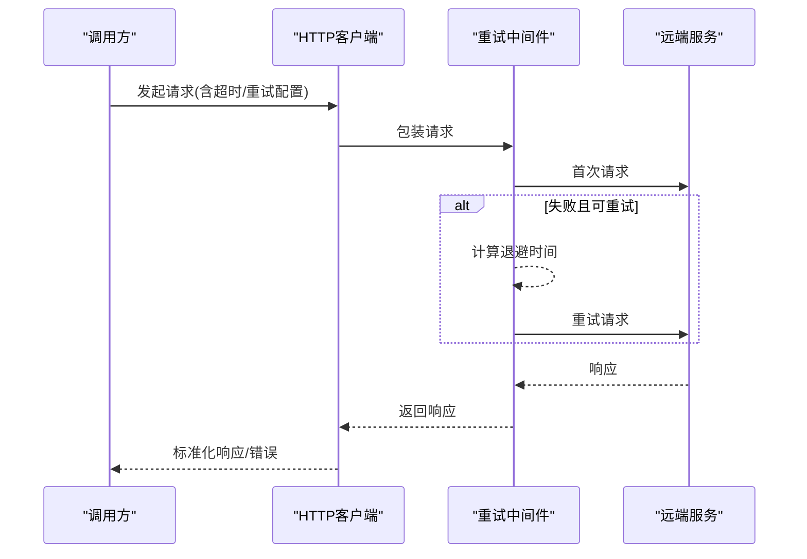
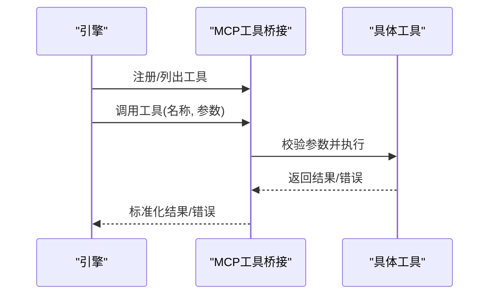
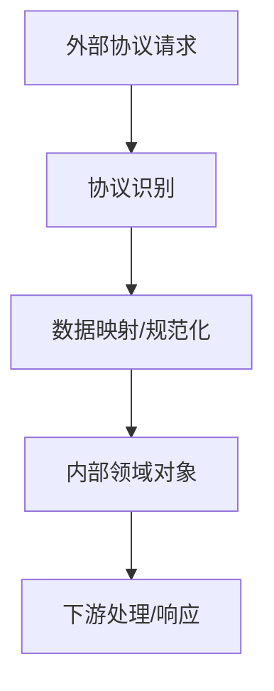
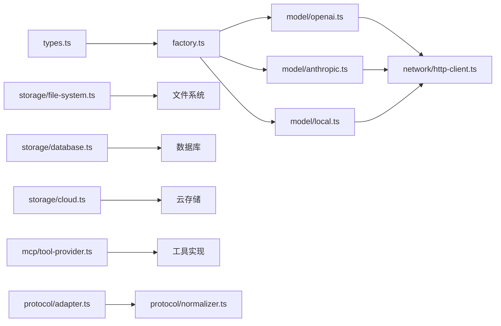

# 适配器层

<cite>
**本文引用的文件**   
- [engine/packages/adapters/README.md](file://engine/packages/adapters/README.md)
- [engine/packages/adapters/src/index.ts](file://engine/packages/adapters/src/index.ts)
- [engine/packages/adapters/src/factory.ts](file://engine/packages/adapters/src/factory.ts)
- [engine/packages/adapters/src/types.ts](file://engine/packages/adapters/src/types.ts)
- [engine/packages/adapters/src/model/openai.ts](file://engine/packages/adapters/src/model/openai.ts)
- [engine/packages/adapters/src/model/anthropic.ts](file://engine/packages/adapters/src/model/anthropic.ts)
- [engine/packages/adapters/src/model/local.ts](file://engine/packages/adapters/src/model/local.ts)
- [engine/packages/adapters/src/storage/file-system.ts](file://engine/packages/adapters/src/storage/file-system.ts)
- [engine/packages/adapters/src/storage/database.ts](file://engine/packages/adapters/src/storage/database.ts)
- [engine/packages/adapters/src/storage/cloud.ts](file://engine/packages/adapters/src/storage/cloud.ts)
- [engine/packages/adapters/src/network/http-client.ts](file://engine/packages/adapters/src/network/http-client.ts)
- [engine/packages/adapters/src/network/websocket.ts](file://engine/packages/adapters/src/network/websocket.ts)
- [engine/packages/adapters/src/network/retry.ts](file://engine/packages/adapters/src/network/retry.ts)
- [engine/packages/adapters/src/mcp/tool-provider.ts](file://engine/packages/adapters/src/mcp/tool-provider.ts)
- [engine/packages/adapters/src/protocol/adapter.ts](file://engine/packages/adapters/src/protocol/adapter.ts)
- [engine/packages/adapters/src/protocol/normalizer.ts](file://engine/packages/adapters/src/protocol/normalizer.ts)
- [engine/tests/mcp-tool-provider.test.ts](file://engine/tests/mcp-tool-provider.test.ts)
- [engine/tests/model-client.test.ts](file://engine/tests/model-client.test.ts)
- [engine/tests/http-artifacts.test.ts](file://engine/tests/http-artifacts.test.ts)
- [engine/tests/http-peer-transport.test.ts](file://engine/tests/http-peer-transport.test.ts)
</cite>

## 目录
1. [简介](#简介)
2. [项目结构](#项目结构)
3. [核心组件](#核心组件)
4. [架构总览](#架构总览)
5. [详细组件分析](#详细组件分析)
6. [依赖关系分析](#依赖关系分析)
7. [性能考虑](#性能考虑)
8. [故障排查指南](#故障排查指南)
9. [结论](#结论)
10. [附录：新适配器开发指南](#附录新适配器开发指南)

## 简介
本文件为 KCoder 引擎的“适配器层”提供全面技术文档。适配器层通过抽象接口与统一封装，屏蔽底层差异，使上层业务（如对话、工具执行、持久化）无需关心具体实现细节。本文覆盖以下主题：
- 适配器模式在模型、存储、网络、协议等维度的实现
- LLM 提供商集成（OpenAI、Anthropic、本地模型）的统一接口
- 存储适配器的多后端统一访问（文件系统、数据库、云存储）
- 网络适配器的 HTTP 客户端、WebSocket、重试与超时控制
- MCP（Model Context Protocol）工具集成方式
- 协议适配器的设计与数据映射
- 新适配器开发规范、测试方法与部署流程
- 性能优化与错误处理最佳实践

## 项目结构
适配器层位于 engine/packages/adapters 下，按能力域划分模块：
- model：LLM 模型适配器（OpenAI、Anthropic、本地模型等）
- storage：存储适配器（文件系统、数据库、云存储）
- network：网络适配器（HTTP、WebSocket、重试、超时）
- mcp：MCP 工具提供者桥接
- protocol：协议适配器与规范化器
- factory：适配器工厂，负责根据配置创建具体适配器实例
- types：公共类型定义与契约
- index：对外导出入口

图表来源
- [engine/packages/adapters/src/index.ts](file://engine/packages/adapters/src/index.ts)
- [engine/packages/adapters/src/factory.ts](file://engine/packages/adapters/src/factory.ts)
- [engine/packages/adapters/src/types.ts](file://engine/packages/adapters/src/types.ts)

章节来源
- [engine/packages/adapters/README.md](file://engine/packages/adapters/README.md)
- [engine/packages/adapters/src/index.ts](file://engine/packages/adapters/src/index.ts)

## 核心组件
- 公共类型与契约（types.ts）：定义模型调用、消息、工具、存储键值、网络请求/响应、MCP 事件等统一数据结构，确保各适配器遵循一致接口。
- 适配器工厂（factory.ts）：依据运行时配置或环境变量动态选择并创建具体适配器实例，支持热插拔与扩展。
- 模型适配器（model/*）：对 OpenAI、Anthropic、本地模型等进行统一封装，暴露一致的对话/补全/流式输出接口。
- 存储适配器（storage/*）：统一文件、数据库、云存储的读写语义，提供事务、幂等、版本化等通用能力。
- 网络适配器（network/*）：封装 HTTP 客户端、WebSocket 连接、重试退避、超时控制、可观测性埋点。
- MCP 工具桥接（mcp/tool-provider.ts）：将 MCP 工具注册到引擎工具调度器，完成参数校验、结果归一化与错误传播。
- 协议适配器（protocol/*）：对不同上游协议的请求/响应进行转换与映射，保证内部领域对象一致性。

章节来源
- [engine/packages/adapters/src/types.ts](file://engine/packages/adapters/src/types.ts)
- [engine/packages/adapters/src/factory.ts](file://engine/packages/adapters/src/factory.ts)
- [engine/packages/adapters/src/model/openai.ts](file://engine/packages/adapters/src/model/openai.ts)
- [engine/packages/adapters/src/model/anthropic.ts](file://engine/packages/adapters/src/model/anthropic.ts)
- [engine/packages/adapters/src/model/local.ts](file://engine/packages/adapters/src/model/local.ts)
- [engine/packages/adapters/src/storage/file-system.ts](file://engine/packages/adapters/src/storage/file-system.ts)
- [engine/packages/adapters/src/storage/database.ts](file://engine/packages/adapters/src/storage/database.ts)
- [engine/packages/adapters/src/storage/cloud.ts](file://engine/packages/adapters/src/storage/cloud.ts)
- [engine/packages/adapters/src/network/http-client.ts](file://engine/packages/adapters/src/network/http-client.ts)
- [engine/packages/adapters/src/network/websocket.ts](file://engine/packages/adapters/src/network/websocket.ts)
- [engine/packages/adapters/src/network/retry.ts](file://engine/packages/adapters/src/network/retry.ts)
- [engine/packages/adapters/src/mcp/tool-provider.ts](file://engine/packages/adapters/src/mcp/tool-provider.ts)
- [engine/packages/adapters/src/protocol/adapter.ts](file://engine/packages/adapters/src/protocol/adapter.ts)
- [engine/packages/adapters/src/protocol/normalizer.ts](file://engine/packages/adapters/src/protocol/normalizer.ts)

## 架构总览
适配器层采用分层与组合设计：
- 上层通过工厂获取具体适配器实例
- 模型适配器依赖网络适配器发起远程调用
- 存储适配器可复用网络适配器用于云存储
- MCP 工具桥接基于统一的工具描述与执行契约
- 协议适配器作为边界，将外部协议转换为内部领域对象

图表来源
- [engine/packages/adapters/src/factory.ts](file://engine/packages/adapters/src/factory.ts)
- [engine/packages/adapters/src/model/openai.ts](file://engine/packages/adapters/src/model/openai.ts)
- [engine/packages/adapters/src/model/anthropic.ts](file://engine/packages/adapters/src/model/anthropic.ts)
- [engine/packages/adapters/src/model/local.ts](file://engine/packages/adapters/src/model/local.ts)
- [engine/packages/adapters/src/network/http-client.ts](file://engine/packages/adapters/src/network/http-client.ts)
- [engine/packages/adapters/src/network/websocket.ts](file://engine/packages/adapters/src/network/websocket.ts)
- [engine/packages/adapters/src/storage/file-system.ts](file://engine/packages/adapters/src/storage/file-system.ts)
- [engine/packages/adapters/src/storage/database.ts](file://engine/packages/adapters/src/storage/database.ts)
- [engine/packages/adapters/src/storage/cloud.ts](file://engine/packages/adapters/src/storage/cloud.ts)
- [engine/packages/adapters/src/mcp/tool-provider.ts](file://engine/packages/adapters/src/mcp/tool-provider.ts)
- [engine/packages/adapters/src/protocol/adapter.ts](file://engine/packages/adapters/src/protocol/adapter.ts)
- [engine/packages/adapters/src/protocol/normalizer.ts](file://engine/packages/adapters/src/protocol/normalizer.ts)

## 详细组件分析

### 模型适配器（LLM 提供商集成）
- 统一接口：所有模型适配器暴露一致的对话/补全/流式输出方法，输入输出均使用公共类型。
- OpenAI 适配器：封装 API Key、模型名、温度、最大 token 等参数；处理分页、速率限制与错误码映射。
- Anthropic 适配器：适配其消息格式、系统提示、工具调用返回结构；对齐内部工具调用语义。
- 本地模型适配器：对接本地推理服务（如 vLLM、Ollama），支持流式与非流式两种模式。
- 工厂选择：根据配置中的 provider 字段与鉴权信息，动态创建对应模型适配器实例。

图表来源
- [engine/packages/adapters/src/model/openai.ts](file://engine/packages/adapters/src/model/openai.ts)
- [engine/packages/adapters/src/model/anthropic.ts](file://engine/packages/adapters/src/model/anthropic.ts)
- [engine/packages/adapters/src/model/local.ts](file://engine/packages/adapters/src/model/local.ts)

章节来源
- [engine/packages/adapters/src/model/openai.ts](file://engine/packages/adapters/src/model/openai.ts)
- [engine/packages/adapters/src/model/anthropic.ts](file://engine/packages/adapters/src/model/anthropic.ts)
- [engine/packages/adapters/src/model/local.ts](file://engine/packages/adapters/src/model/local.ts)
- [engine/packages/adapters/src/factory.ts](file://engine/packages/adapters/src/factory.ts)

### 存储适配器（多后端统一访问）
- 统一接口：提供 get/set/delete/list/exists 等基础操作，支持批量与条件查询。
- 文件系统：以路径为键，支持目录遍历、元数据写入、原子写入与回滚。
- 数据库：基于 SQL/NoSQL 抽象，提供连接池、事务、索引与迁移脚本。
- 云存储：封装 S3/OSS 等对象存储，支持分片上传、断点续传、签名 URL。
- 错误与一致性：统一错误码、幂等键、版本号与冲突解决策略。

图表来源
- [engine/packages/adapters/src/storage/file-system.ts](file://engine/packages/adapters/src/storage/file-system.ts)
- [engine/packages/adapters/src/storage/database.ts](file://engine/packages/adapters/src/storage/database.ts)
- [engine/packages/adapters/src/storage/cloud.ts](file://engine/packages/adapters/src/storage/cloud.ts)

章节来源
- [engine/packages/adapters/src/storage/file-system.ts](file://engine/packages/adapters/src/storage/file-system.ts)
- [engine/packages/adapters/src/storage/database.ts](file://engine/packages/adapters/src/storage/database.ts)
- [engine/packages/adapters/src/storage/cloud.ts](file://engine/packages/adapters/src/storage/cloud.ts)

### 网络适配器（HTTP、WebSocket、重试、超时）
- HTTP 客户端：封装请求构建、鉴权头注入、响应解析、错误分类与日志。
- WebSocket：管理连接生命周期、心跳保活、重连与消息编解码。
- 重试机制：指数退避、抖动、最大重试次数、可重试状态码判定。
- 超时控制：连接超时、读取超时、整体超时与取消令牌。
- 可观测性：请求追踪、指标上报与采样。

图表来源
- [engine/packages/adapters/src/network/http-client.ts](file://engine/packages/adapters/src/network/http-client.ts)
- [engine/packages/adapters/src/network/retry.ts](file://engine/packages/adapters/src/network/retry.ts)
- [engine/packages/adapters/src/network/websocket.ts](file://engine/packages/adapters/src/network/websocket.ts)

章节来源
- [engine/packages/adapters/src/network/http-client.ts](file://engine/packages/adapters/src/network/http-client.ts)
- [engine/packages/adapters/src/network/websocket.ts](file://engine/packages/adapters/src/network/websocket.ts)
- [engine/packages/adapters/src/network/retry.ts](file://engine/packages/adapters/src/network/retry.ts)

### MCP（Model Context Protocol）工具集成
- 工具发现：扫描 MCP 工具清单，注册到引擎工具调度器。
- 参数校验：基于 JSON Schema 校验入参，缺失/类型错误快速失败。
- 结果归一化：将不同工具的输出映射到统一结果结构。
- 错误传播：将 MCP 错误码映射到引擎错误模型，便于上层处理。
- 测试验证：通过单元测试覆盖工具注册、调用与异常路径。

图表来源
- [engine/packages/adapters/src/mcp/tool-provider.ts](file://engine/packages/adapters/src/mcp/tool-provider.ts)

章节来源
- [engine/packages/adapters/src/mcp/tool-provider.ts](file://engine/packages/adapters/src/mcp/tool-provider.ts)
- [engine/tests/mcp-tool-provider.test.ts](file://engine/tests/mcp-tool-provider.test.ts)

### 协议适配器（协议转换与数据映射）
- 协议识别：根据请求头/路径/内容协商识别上游协议。
- 数据映射：将外部协议的消息体转换为内部领域对象，反之亦然。
- 规范化器：对字段命名、枚举值、时间戳等做统一规范化。
- 兼容层：保留旧版协议兼容逻辑，逐步迁移。

图表来源
- [engine/packages/adapters/src/protocol/adapter.ts](file://engine/packages/adapters/src/protocol/adapter.ts)
- [engine/packages/adapters/src/protocol/normalizer.ts](file://engine/packages/adapters/src/protocol/normalizer.ts)

章节来源
- [engine/packages/adapters/src/protocol/adapter.ts](file://engine/packages/adapters/src/protocol/adapter.ts)
- [engine/packages/adapters/src/protocol/normalizer.ts](file://engine/packages/adapters/src/protocol/normalizer.ts)

## 依赖关系分析
- 低耦合高内聚：每个适配器仅依赖必要的网络/存储基础设施，避免跨域耦合。
- 工厂集中装配：通过工厂统一管理实例创建与依赖注入，降低散点配置。
- 外部依赖：HTTP 库、数据库驱动、云 SDK 等通过适配器隔离，便于替换与测试。
- 循环依赖检查：模块间单向依赖，无环引用。

图表来源
- [engine/packages/adapters/src/types.ts](file://engine/packages/adapters/src/types.ts)
- [engine/packages/adapters/src/factory.ts](file://engine/packages/adapters/src/factory.ts)
- [engine/packages/adapters/src/model/openai.ts](file://engine/packages/adapters/src/model/openai.ts)
- [engine/packages/adapters/src/model/anthropic.ts](file://engine/packages/adapters/src/model/anthropic.ts)
- [engine/packages/adapters/src/model/local.ts](file://engine/packages/adapters/src/model/local.ts)
- [engine/packages/adapters/src/network/http-client.ts](file://engine/packages/adapters/src/network/http-client.ts)
- [engine/packages/adapters/src/storage/file-system.ts](file://engine/packages/adapters/src/storage/file-system.ts)
- [engine/packages/adapters/src/storage/database.ts](file://engine/packages/adapters/src/storage/database.ts)
- [engine/packages/adapters/src/storage/cloud.ts](file://engine/packages/adapters/src/storage/cloud.ts)
- [engine/packages/adapters/src/mcp/tool-provider.ts](file://engine/packages/adapters/src/mcp/tool-provider.ts)
- [engine/packages/adapters/src/protocol/adapter.ts](file://engine/packages/adapters/src/protocol/adapter.ts)
- [engine/packages/adapters/src/protocol/normalizer.ts](file://engine/packages/adapters/src/protocol/normalizer.ts)

章节来源
- [engine/packages/adapters/src/factory.ts](file://engine/packages/adapters/src/factory.ts)
- [engine/packages/adapters/src/types.ts](file://engine/packages/adapters/src/types.ts)

## 性能考虑
- 连接复用：HTTP 客户端启用连接池与 Keep-Alive，减少握手开销。
- 并发控制：模型调用与 I/O 操作设置并发上限，避免资源耗尽。
- 流式处理：大文本/长上下文优先使用流式传输，降低内存峰值。
- 缓存策略：热点数据（如工具清单、模型元数据）加入本地缓存。
- 重试与退避：合理设置最大重试次数与退避上限，避免雪崩。
- 超时与取消：为长耗时任务设置超时与取消令牌，及时释放资源。
- 序列化优化：减少不必要的深拷贝与序列化，按需裁剪字段。

[本节为通用指导，不直接分析具体文件]

## 故障排查指南
- 模型调用失败：检查鉴权、配额、速率限制与错误码映射；查看网络适配器日志与重试计数。
- 存储不一致：确认幂等键与版本号；对比不同后端的最终一致性行为。
- MCP 工具不可用：核对工具清单与参数 Schema；定位工具执行异常堆栈。
- 协议不兼容：比对规范化器规则与上游协议变更；开启调试日志观察映射过程。
- 参考测试用例：
  - 模型客户端与错误路径：[engine/tests/model-client.test.ts](file://engine/tests/model-client.test.ts)
  - HTTP 工件与传输：[engine/tests/http-artifacts.test.ts](file://engine/tests/http-artifacts.test.ts)、[engine/tests/http-peer-transport.test.ts](file://engine/tests/http-peer-transport.test.ts)
  - MCP 工具提供者：[engine/tests/mcp-tool-provider.test.ts](file://engine/tests/mcp-tool-provider.test.ts)

章节来源
- [engine/tests/model-client.test.ts](file://engine/tests/model-client.test.ts)
- [engine/tests/http-artifacts.test.ts](file://engine/tests/http-artifacts.test.ts)
- [engine/tests/http-peer-transport.test.ts](file://engine/tests/http-peer-transport.test.ts)
- [engine/tests/mcp-tool-provider.test.ts](file://engine/tests/mcp-tool-provider.test.ts)

## 结论
适配器层通过清晰的抽象与工厂装配，实现了模型、存储、网络、协议与 MCP 工具的解耦与可扩展。统一的类型契约与规范化器确保了跨实现的稳定性，配合完善的测试与可观测性，为 KCoder 的多后端接入提供了坚实基础。

[本节为总结性内容，不直接分析具体文件]

## 附录：新适配器开发指南
- 接口规范
  - 明确职责边界与输入输出类型，遵循 types.ts 中定义的契约。
  - 若新增模型适配器，需实现一致的发送/流式/关闭方法，并处理鉴权与错误映射。
  - 若新增存储适配器，需提供完整的 CRUD 与事务语义，保证幂等与一致性。
- 依赖与装配
  - 在 factory.ts 中注册新的适配器类型与创建逻辑，支持从配置/环境变量加载。
  - 保持对网络/存储基础设施的单向依赖，避免反向引入。
- 测试方法
  - 编写单元与集成测试，覆盖正常路径、异常路径与边界条件。
  - 针对网络与外部依赖，使用 Mock 或 Test Harness 隔离。
  - 参考现有测试：模型客户端、HTTP 传输、MCP 工具提供者。
- 部署流程
  - 更新 README 与对外导出 index.ts，确保新适配器可被上层消费。
  - 在 CI 中增加相应测试与覆盖率门禁。
  - 发布前进行端到端验证，包括多环境配置切换与回滚演练。
- 最佳实践
  - 错误处理：区分可重试与不可重试错误，记录结构化日志。
  - 性能优化：启用连接复用、流式传输、缓存与并发控制。
  - 可观测性：添加关键指标与追踪 ID，便于问题定位。

[本节为通用指导，不直接分析具体文件]