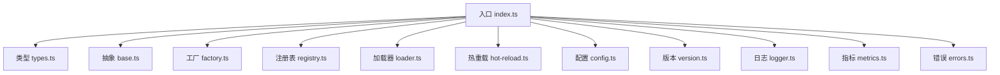
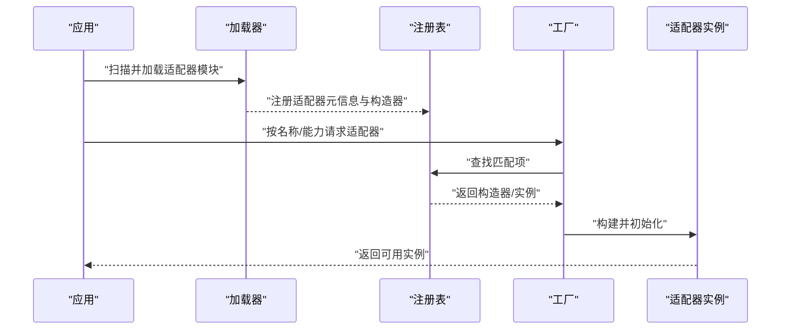
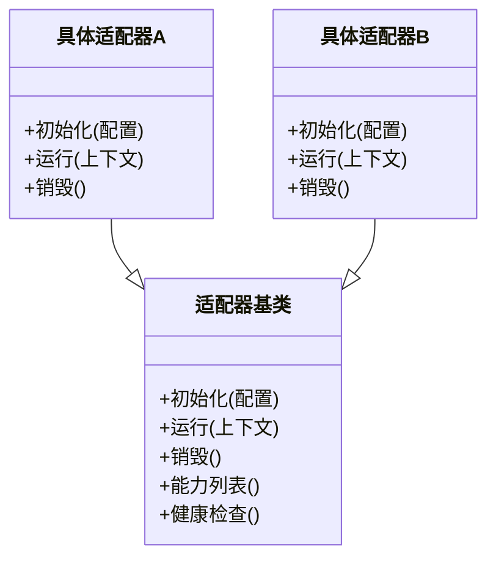
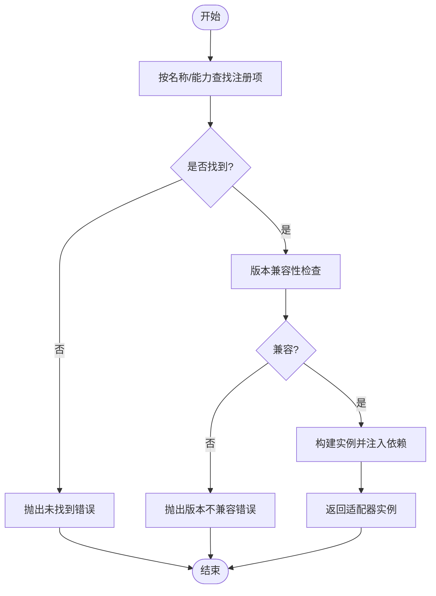
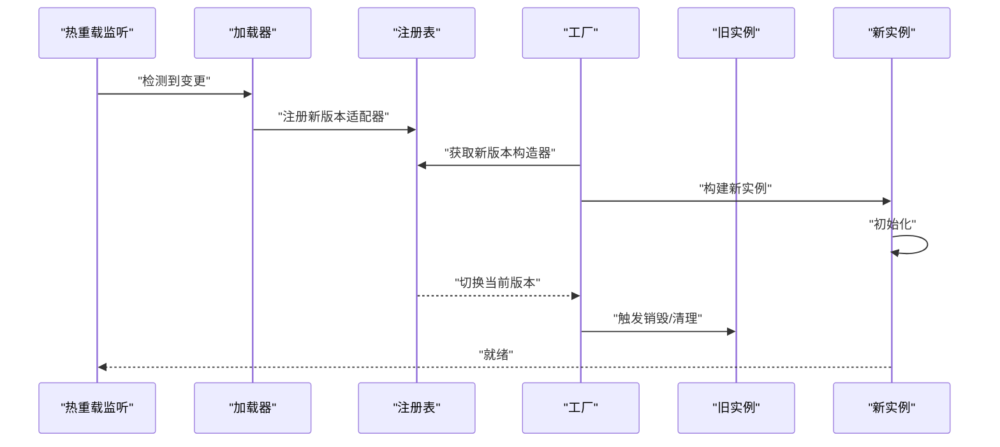
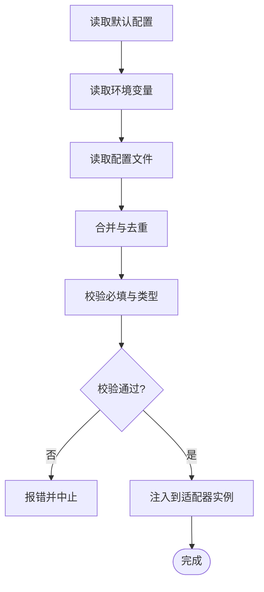
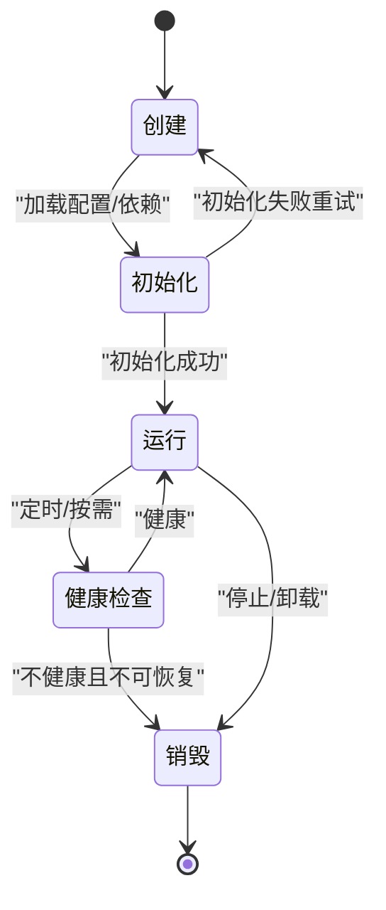
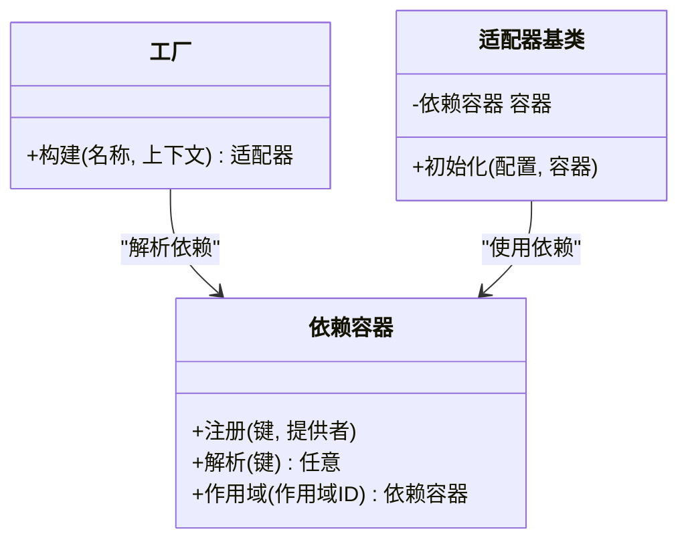
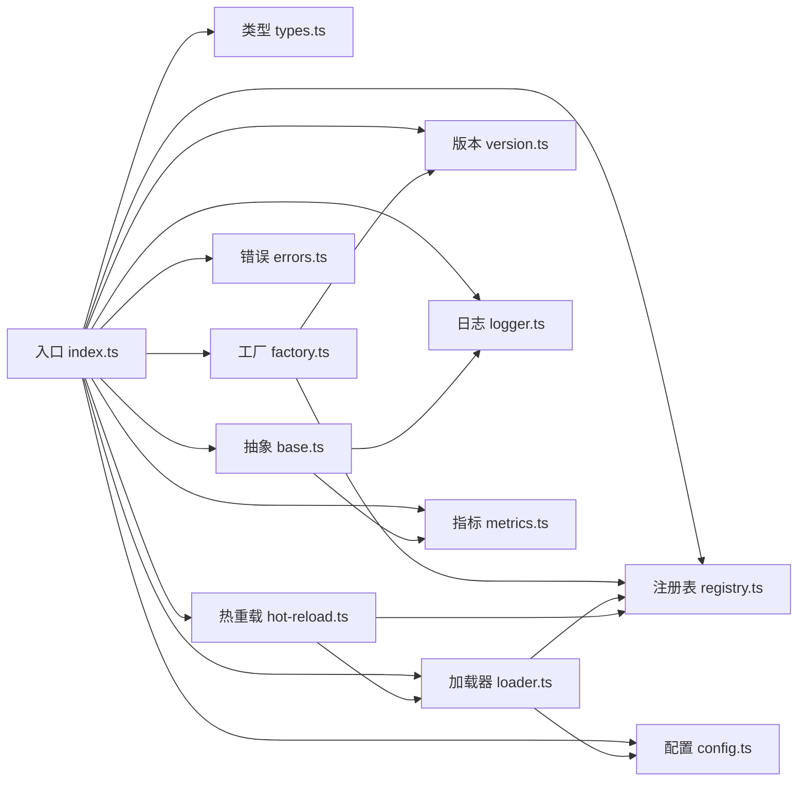

# 适配器模式设计

<cite>
**本文引用的文件**   
- [engine/packages/adapters/README.md](file://engine/packages/adapters/README.md)
- [engine/packages/adapters/src/index.ts](file://engine/packages/adapters/src/index.ts)
- [engine/packages/adapters/src/base.ts](file://engine/packages/adapters/src/base.ts)
- [engine/packages/adapters/src/factory.ts](file://engine/packages/adapters/src/factory.ts)
- [engine/packages/adapters/src/loader.ts](file://engine/packages/adapters/src/loader.ts)
- [engine/packages/adapters/src/types.ts](file://engine/packages/adapters/src/types.ts)
- [engine/packages/adapters/src/registry.ts](file://engine/packages/adapters/src/registry.ts)
- [engine/packages/adapters/src/config.ts](file://engine/packages/adapters/src/config.ts)
- [engine/packages/adapters/src/errors.ts](file://engine/packages/adapters/src/errors.ts)
- [engine/packages/adapters/src/metrics.ts](file://engine/packages/adapters/src/metrics.ts)
- [engine/packages/adapters/src/logger.ts](file://engine/packages/adapters/src/logger.ts)
- [engine/packages/adapters/src/version.ts](file://engine/packages/adapters/src/version.ts)
- [engine/packages/adapters/src/hot-reload.ts](file://engine/packages/adapters/src/hot-reload.ts)
</cite>

## 目录
1. [引言](#引言)
2. [项目结构](#项目结构)
3. [核心组件](#核心组件)
4. [架构总览](#架构总览)
5. [详细组件分析](#详细组件分析)
6. [依赖分析](#依赖分析)
7. [性能考虑](#性能考虑)
8. [故障排查指南](#故障排查指南)
9. [结论](#结论)
10. [附录](#附录) 

## 引言
本文件围绕KCoder引擎中的“适配器模式”设计，系统性阐述抽象接口定义、适配器基类、工厂与注册发现机制、生命周期管理、依赖注入、配置加载策略、动态加载与热重载、版本兼容性检查，以及开发最佳实践（错误处理、日志记录、性能监控）。文档旨在帮助开发者快速理解并扩展新的适配器实现。

## 项目结构
适配器子系统位于 engine/packages/adapters 下，采用分层与职责分离的组织方式：
- 类型与契约：types.ts
- 抽象接口与基类：base.ts
- 工厂与注册表：factory.ts、registry.ts
- 加载器与热重载：loader.ts、hot-reload.ts
- 配置与版本：config.ts、version.ts
- 可观测性：logger.ts、metrics.ts
- 错误模型：errors.ts
- 入口聚合：index.ts

图表来源
- [engine/packages/adapters/src/index.ts](file://engine/packages/adapters/src/index.ts)
- [engine/packages/adapters/src/types.ts](file://engine/packages/adapters/src/types.ts)
- [engine/packages/adapters/src/base.ts](file://engine/packages/adapters/src/base.ts)
- [engine/packages/adapters/src/factory.ts](file://engine/packages/adapters/src/factory.ts)
- [engine/packages/adapters/src/registry.ts](file://engine/packages/adapters/src/registry.ts)
- [engine/packages/adapters/src/loader.ts](file://engine/packages/adapters/src/loader.ts)
- [engine/packages/adapters/src/hot-reload.ts](file://engine/packages/adapters/src/hot-reload.ts)
- [engine/packages/adapters/src/config.ts](file://engine/packages/adapters/src/config.ts)
- [engine/packages/adapters/src/version.ts](file://engine/packages/adapters/src/version.ts)
- [engine/packages/adapters/src/logger.ts](file://engine/packages/adapters/src/logger.ts)
- [engine/packages/adapters/src/metrics.ts](file://engine/packages/adapters/src/metrics.ts)
- [engine/packages/adapters/src/errors.ts](file://engine/packages/adapters/src/errors.ts)

章节来源
- [engine/packages/adapters/README.md](file://engine/packages/adapters/README.md)
- [engine/packages/adapters/src/index.ts](file://engine/packages/adapters/src/index.ts)

## 核心组件
- 抽象接口与能力契约：在 types.ts 中定义适配器对外暴露的能力边界与数据契约，确保上层调用与具体实现解耦。
- 适配器基类：在 base.ts 提供通用生命周期钩子、默认行为与可覆写方法，降低重复实现成本。
- 工厂与注册表：factory.ts 负责按名称或元信息创建实例；registry.ts 维护已注册适配器的清单与查找逻辑。
- 加载器与热重载：loader.ts 负责从文件系统或包管理器动态发现与加载适配器模块；hot-reload.ts 支持运行时替换与平滑重启。
- 配置与版本：config.ts 提供配置读取与校验；version.ts 提供语义化版本解析与兼容性判断。
- 可观测性与错误：logger.ts、metrics.ts 提供结构化日志与指标上报；errors.ts 统一错误类型与消息。

章节来源
- [engine/packages/adapters/src/types.ts](file://engine/packages/adapters/src/types.ts)
- [engine/packages/adapters/src/base.ts](file://engine/packages/adapters/src/base.ts)
- [engine/packages/adapters/src/factory.ts](file://engine/packages/adapters/src/factory.ts)
- [engine/packages/adapters/src/registry.ts](file://engine/packages/adapters/src/registry.ts)
- [engine/packages/adapters/src/loader.ts](file://engine/packages/adapters/src/loader.ts)
- [engine/packages/adapters/src/hot-reload.ts](file://engine/packages/adapters/src/hot-reload.ts)
- [engine/packages/adapters/src/config.ts](file://engine/packages/adapters/src/config.ts)
- [engine/packages/adapters/src/version.ts](file://engine/packages/adapters/src/version.ts)
- [engine/packages/adapters/src/logger.ts](file://engine/packages/adapters/src/logger.ts)
- [engine/packages/adapters/src/metrics.ts](file://engine/packages/adapters/src/metrics.ts)
- [engine/packages/adapters/src/errors.ts](file://engine/packages/adapters/src/errors.ts)

## 架构总览
适配器子系统通过“接口-基类-工厂-注册表-加载器”的协作，实现插件化的可扩展能力。启动时由加载器扫描并加载适配器模块，注册到注册表；业务侧通过工厂获取适配器实例，并在生命周期内执行初始化、运行与销毁。

图表来源
- [engine/packages/adapters/src/loader.ts](file://engine/packages/adapters/src/loader.ts)
- [engine/packages/adapters/src/registry.ts](file://engine/packages/adapters/src/registry.ts)
- [engine/packages/adapters/src/factory.ts](file://engine/packages/adapters/src/factory.ts)

## 详细组件分析

### 抽象接口与基类
- 抽象接口：定义适配器必须实现的方法集合与输入输出契约，包括能力声明、配置结构、事件与状态等。
- 基类：封装通用流程，如初始化顺序、资源清理、默认日志与指标埋点、错误包装等，子类仅需关注差异化逻辑。

图表来源
- [engine/packages/adapters/src/base.ts](file://engine/packages/adapters/src/base.ts)
- [engine/packages/adapters/src/types.ts](file://engine/packages/adapters/src/types.ts)

章节来源
- [engine/packages/adapters/src/base.ts](file://engine/packages/adapters/src/base.ts)
- [engine/packages/adapters/src/types.ts](file://engine/packages/adapters/src/types.ts)

### 工厂与注册表
- 注册表：集中管理适配器元数据（名称、版本、能力、构造器），提供按名称、能力或版本范围的查询。
- 工厂：根据请求参数选择合适注册项，完成实例化与依赖注入，必要时进行版本兼容校验。

图表来源
- [engine/packages/adapters/src/registry.ts](file://engine/packages/adapters/src/registry.ts)
- [engine/packages/adapters/src/factory.ts](file://engine/packages/adapters/src/factory.ts)
- [engine/packages/adapters/src/version.ts](file://engine/packages/adapters/src/version.ts)

章节来源
- [engine/packages/adapters/src/registry.ts](file://engine/packages/adapters/src/registry.ts)
- [engine/packages/adapters/src/factory.ts](file://engine/packages/adapters/src/factory.ts)
- [engine/packages/adapters/src/version.ts](file://engine/packages/adapters/src/version.ts)

### 加载器与热重载
- 加载器：从指定路径或包描述中扫描适配器模块，解析其导出对象，验证必要字段后交由注册表登记。
- 热重载：监听模块变更或收到信号后，卸载旧实例、重建新实例并平滑切换，保证服务可用性。

图表来源
- [engine/packages/adapters/src/loader.ts](file://engine/packages/adapters/src/loader.ts)
- [engine/packages/adapters/src/hot-reload.ts](file://engine/packages/adapters/src/hot-reload.ts)
- [engine/packages/adapters/src/registry.ts](file://engine/packages/adapters/src/registry.ts)
- [engine/packages/adapters/src/factory.ts](file://engine/packages/adapters/src/factory.ts)

章节来源
- [engine/packages/adapters/src/loader.ts](file://engine/packages/adapters/src/loader.ts)
- [engine/packages/adapters/src/hot-reload.ts](file://engine/packages/adapters/src/hot-reload.ts)

### 配置加载策略
- 配置来源优先级：默认配置 < 环境变量 < 配置文件 < 运行时覆盖。
- 配置校验：在加载阶段对必填字段、类型与范围进行校验，失败则拒绝启动或回退到安全默认值。
- 配置注入：将最终合并后的配置注入到适配器实例，避免硬编码。

图表来源
- [engine/packages/adapters/src/config.ts](file://engine/packages/adapters/src/config.ts)

章节来源
- [engine/packages/adapters/src/config.ts](file://engine/packages/adapters/src/config.ts)

### 生命周期管理
- 生命周期阶段：创建 -> 初始化 -> 运行 -> 健康检查 -> 销毁。
- 钩子与容错：每个阶段提供钩子用于扩展；异常被捕获并转换为标准错误类型，同时记录日志与指标。

图表来源
- [engine/packages/adapters/src/base.ts](file://engine/packages/adapters/src/base.ts)
- [engine/packages/adapters/src/errors.ts](file://engine/packages/adapters/src/errors.ts)

章节来源
- [engine/packages/adapters/src/base.ts](file://engine/packages/adapters/src/base.ts)
- [engine/packages/adapters/src/errors.ts](file://engine/packages/adapters/src/errors.ts)

### 依赖注入机制
- 容器与提供者：通过轻量级容器将外部依赖（如HTTP客户端、存储、配置）以键值形式注册。
- 解析与装配：工厂在构建适配器时自动解析所需依赖，若缺失则抛出明确的依赖缺失错误。
- 作用域：支持单例与作用域实例，避免不必要的重复创建。

图表来源
- [engine/packages/adapters/src/factory.ts](file://engine/packages/adapters/src/factory.ts)
- [engine/packages/adapters/src/base.ts](file://engine/packages/adapters/src/base.ts)

章节来源
- [engine/packages/adapters/src/factory.ts](file://engine/packages/adapters/src/factory.ts)
- [engine/packages/adapters/src/base.ts](file://engine/packages/adapters/src/base.ts)

### 错误处理
- 统一错误模型：定义基础错误类型与分类（配置错误、版本不兼容、依赖缺失、运行时错误等）。
- 错误传播：在关键路径上捕获并包装为统一错误，附带上下文与堆栈，便于定位。
- 降级与恢复：在可恢复场景下提供重试、回退或熔断策略。

章节来源
- [engine/packages/adapters/src/errors.ts](file://engine/packages/adapters/src/errors.ts)

### 日志记录
- 结构化日志：包含时间戳、级别、适配器名称、上下文键值对。
- 分级输出：调试、信息、警告、错误等级别控制，避免生产环境噪声。
- 关联追踪：为每次请求/任务生成追踪ID，贯穿日志与指标。

章节来源
- [engine/packages/adapters/src/logger.ts](file://engine/packages/adapters/src/logger.ts)

### 性能监控
- 指标采集：耗时、成功率、错误率、队列长度、内存占用等。
- 采样与聚合：高吞吐场景下采用采样与聚合减少开销。
- 告警阈值：超过阈值触发告警，辅助容量规划与问题定位。

章节来源
- [engine/packages/adapters/src/metrics.ts](file://engine/packages/adapters/src/metrics.ts)

### 版本兼容性检查
- 语义化版本：遵循主版本破坏性变更、次版本向后兼容、补丁版本修复的原则。
- 兼容性矩阵：在注册表中声明最小/最大兼容范围，工厂在构建前进行校验。
- 升级策略：支持灰度发布与逐步放量，结合热重载实现零停机升级。

章节来源
- [engine/packages/adapters/src/version.ts](file://engine/packages/adapters/src/version.ts)
- [engine/packages/adapters/src/registry.ts](file://engine/packages/adapters/src/registry.ts)

## 依赖分析
适配器子系统内部耦合关系清晰：入口聚合各模块；加载器依赖注册表与配置；工厂依赖注册表与版本模块；基类依赖日志与指标；热重载依赖加载器与注册表。

图表来源
- [engine/packages/adapters/src/index.ts](file://engine/packages/adapters/src/index.ts)
- [engine/packages/adapters/src/factory.ts](file://engine/packages/adapters/src/factory.ts)
- [engine/packages/adapters/src/registry.ts](file://engine/packages/adapters/src/registry.ts)
- [engine/packages/adapters/src/loader.ts](file://engine/packages/adapters/src/loader.ts)
- [engine/packages/adapters/src/hot-reload.ts](file://engine/packages/adapters/src/hot-reload.ts)
- [engine/packages/adapters/src/config.ts](file://engine/packages/adapters/src/config.ts)
- [engine/packages/adapters/src/version.ts](file://engine/packages/adapters/src/version.ts)
- [engine/packages/adapters/src/base.ts](file://engine/packages/adapters/src/base.ts)
- [engine/packages/adapters/src/logger.ts](file://engine/packages/adapters/src/logger.ts)
- [engine/packages/adapters/src/metrics.ts](file://engine/packages/adapters/src/metrics.ts)

章节来源
- [engine/packages/adapters/src/index.ts](file://engine/packages/adapters/src/index.ts)

## 性能考虑
- 延迟加载：仅在首次使用时加载适配器模块，减少冷启动开销。
- 连接复用：对外部资源的连接池与缓存，避免频繁建立/释放。
- 异步与批处理：I/O密集操作采用异步与批量提交，降低阻塞。
- 指标采样：在高QPS场景下启用自适应采样，平衡精度与开销。
- 内存管理：及时释放临时对象与大对象引用，避免泄漏。

[本节为通用指导，无需代码来源]

## 故障排查指南
- 常见问题
  - 适配器未找到：检查注册表是否成功登记，确认名称与能力匹配。
  - 版本不兼容：核对最小/最大兼容范围，调整版本号或升级依赖。
  - 依赖缺失：确认依赖容器是否正确注册对应键值。
  - 配置错误：查看配置校验日志，修正必填字段与类型。
  - 热重载失败：检查模块变更事件与新旧实例切换流程。
- 诊断步骤
  - 开启调试日志，定位错误发生位置与上下文。
  - 查看指标面板，识别异常峰值与慢调用。
  - 复现最小用例，隔离问题范围。
  - 使用追踪ID串联日志与指标，形成完整链路视图。

章节来源
- [engine/packages/adapters/src/errors.ts](file://engine/packages/adapters/src/errors.ts)
- [engine/packages/adapters/src/logger.ts](file://engine/packages/adapters/src/logger.ts)
- [engine/packages/adapters/src/metrics.ts](file://engine/packages/adapters/src/metrics.ts)

## 结论
通过抽象接口、基类、工厂与注册表的协同，KCoder的适配器子系统实现了高内聚、低耦合的可扩展架构。配合加载器与热重载，系统具备动态演进能力；借助配置、版本与可观测性模块，保障了稳定性与可运维性。遵循本文的最佳实践，可高效地开发、集成与维护新的适配器。

[本节为总结，无需代码来源]

## 附录

### 适配器开发最佳实践
- 明确能力边界：在类型契约中清晰定义输入输出与副作用。
- 最小实现原则：优先继承基类，仅覆写必要方法。
- 健壮的错误处理：区分可恢复与不可恢复错误，提供重试与回退。
- 完整的日志与指标：记录关键路径与异常，设置合理阈值。
- 配置驱动：避免硬编码，所有可调参数外置化。
- 版本治理：遵循语义化版本，提前评估破坏性变更影响。
- 测试先行：编写单元与集成测试，覆盖正常与异常路径。

[本节为通用指导，无需代码来源]

### 从零开始创建新适配器（端到端流程）
- 定义能力与数据结构：在类型文件中新增接口与数据模型。
- 实现适配器类：继承基类，实现初始化、运行与销毁逻辑。
- 注册适配器：在注册表中登记名称、版本、能力与构造器。
- 配置与依赖：在配置文件中声明参数，在容器中注册依赖。
- 加载与发现：确保加载器能扫描到新适配器模块。
- 版本与兼容性：设置合适的版本范围，并通过工厂校验。
- 可观测性：接入日志与指标，完善错误处理。
- 热重载验证：修改实现后验证平滑切换与资源清理。

章节来源
- [engine/packages/adapters/src/types.ts](file://engine/packages/adapters/src/types.ts)
- [engine/packages/adapters/src/base.ts](file://engine/packages/adapters/src/base.ts)
- [engine/packages/adapters/src/registry.ts](file://engine/packages/adapters/src/registry.ts)
- [engine/packages/adapters/src/factory.ts](file://engine/packages/adapters/src/factory.ts)
- [engine/packages/adapters/src/loader.ts](file://engine/packages/adapters/src/loader.ts)
- [engine/packages/adapters/src/config.ts](file://engine/packages/adapters/src/config.ts)
- [engine/packages/adapters/src/version.ts](file://engine/packages/adapters/src/version.ts)
- [engine/packages/adapters/src/logger.ts](file://engine/packages/adapters/src/logger.ts)
- [engine/packages/adapters/src/metrics.ts](file://engine/packages/adapters/src/metrics.ts)
- [engine/packages/adapters/src/errors.ts](file://engine/packages/adapters/src/errors.ts)
- [engine/packages/adapters/src/hot-reload.ts](file://engine/packages/adapters/src/hot-reload.ts)