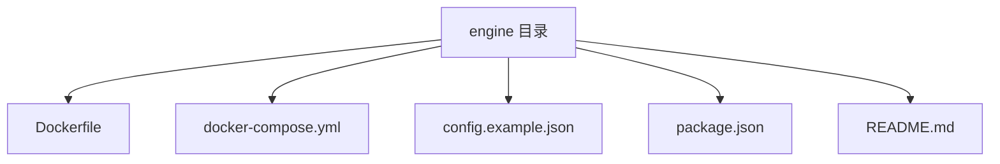
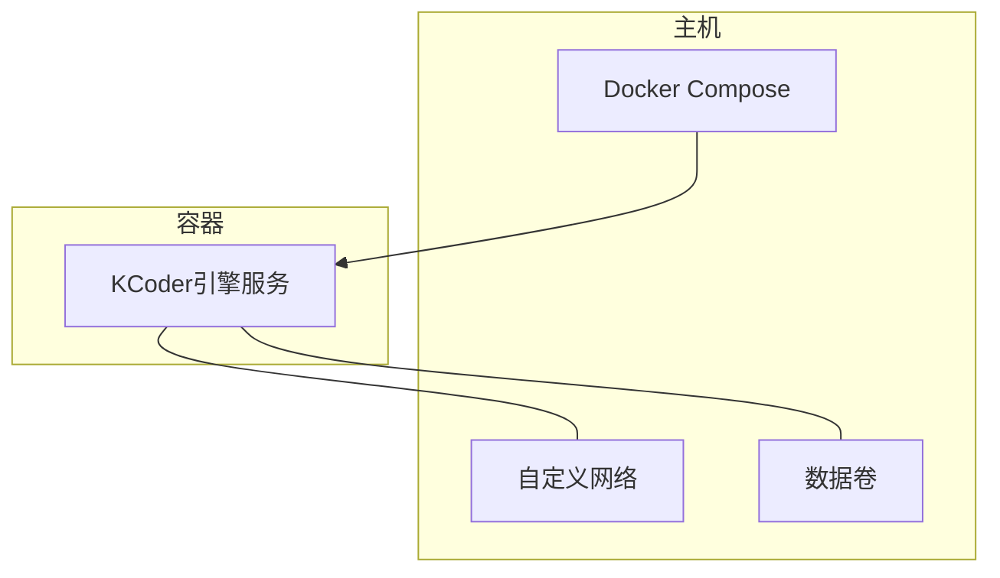
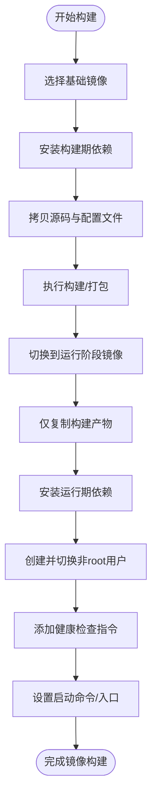
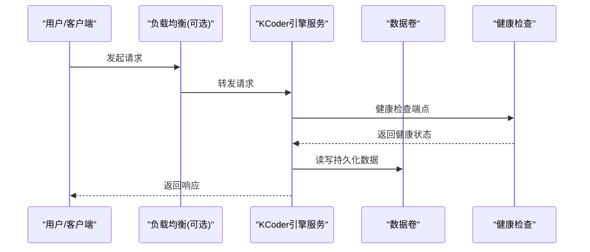
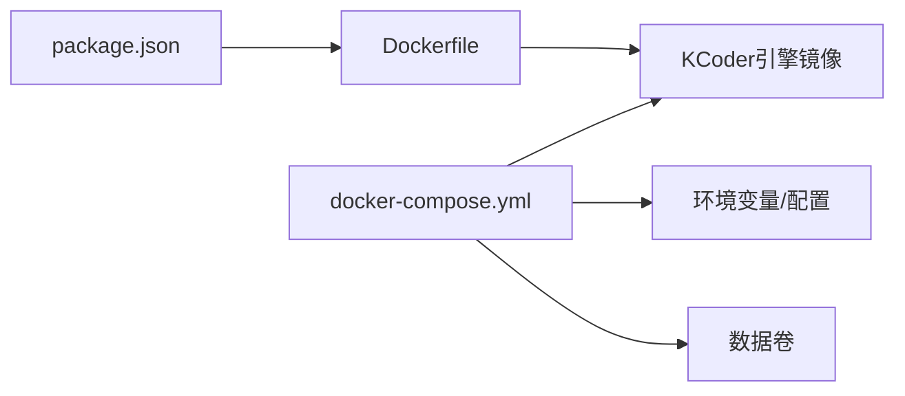

# Docker容器化

<cite>
**本文引用的文件**   
- [engine/Dockerfile](file://engine/Dockerfile)
- [engine/docker-compose.yml](file://engine/docker-compose.yml)
- [engine/config.example.json](file://engine/config.example.json)
- [engine/package.json](file://engine/package.json)
- [engine/README.md](file://engine/README.md)
</cite>

## 目录
1. [简介](#简介)
2. [项目结构](#项目结构)
3. [核心组件](#核心组件)
4. [架构总览](#架构总览)
5. [详细组件分析](#详细组件分析)
6. [依赖关系分析](#依赖关系分析)
7. [性能考虑](#性能考虑)
8. [故障排查指南](#故障排查指南)
9. [结论](#结论)
10. [附录](#附录)

## 简介
本文件面向KCoder引擎的Docker容器化部署，覆盖镜像构建、编排配置、环境管理、生产部署、监控与日志、安全加固以及故障排查等主题。文档以仓库中现有的Docker相关资产为依据，结合通用最佳实践给出可操作的指导，帮助读者在本地与生产环境中稳定运行KCoder引擎。

## 项目结构
与容器化直接相关的工程位于 engine 子目录，关键文件包括：
- 镜像构建定义：engine/Dockerfile
- 服务编排：engine/docker-compose.yml
- 示例配置：engine/config.example.json
- 脚本入口与依赖：engine/package.json
- 说明文档：engine/README.md

**图表来源**
- [engine/Dockerfile](file://engine/Dockerfile)
- [engine/docker-compose.yml](file://engine/docker-compose.yml)
- [engine/config.example.json](file://engine/config.example.json)
- [engine/package.json](file://engine/package.json)
- [engine/README.md](file://engine/README.md)

**章节来源**
- [engine/Dockerfile](file://engine/Dockerfile)
- [engine/docker-compose.yml](file://engine/docker-compose.yml)
- [engine/config.example.json](file://engine/config.example.json)
- [engine/package.json](file://engine/package.json)
- [engine/README.md](file://engine/README.md)

## 核心组件
- 镜像构建（Dockerfile）
  - 负责安装运行时依赖、拷贝源码与产物、暴露端口、设置启动命令等。
  - 建议采用多阶段构建以减少最终镜像体积；使用非root用户运行以提升安全性。
- 服务编排（docker-compose.yml）
  - 定义KCoder引擎服务、网络、数据卷、环境变量与健康检查等。
  - 支持开发环境与生产环境的差异化配置。
- 应用配置（config.example.json）
  - 提供默认配置项参考，可通过挂载或环境变量注入到容器中。
- 应用入口与依赖（package.json）
  - 声明Node.js版本、构建与运行脚本，作为镜像构建的基础依据。

**章节来源**
- [engine/Dockerfile](file://engine/Dockerfile)
- [engine/docker-compose.yml](file://engine/docker-compose.yml)
- [engine/config.example.json](file://engine/config.example.json)
- [engine/package.json](file://engine/package.json)

## 架构总览
下图展示基于Compose的单机部署拓扑，包含KCoder引擎服务、持久化数据卷与外部网络访问路径。

**图表来源**
- [engine/docker-compose.yml](file://engine/docker-compose.yml)

## 详细组件分析

### 镜像构建（Dockerfile）
- 构建目标
  - 生成最小可用镜像，仅包含运行期所需依赖与二进制/静态资源。
- 多阶段构建建议
  - 构建阶段：安装构建依赖、执行编译与打包。
  - 运行阶段：仅复制必要产物，安装运行时依赖，切换非root用户。
- 缓存优化
  - 将依赖安装与源码拷贝分层，利用Docker层缓存加速重复构建。
- 安全加固
  - 使用精简基础镜像（如Alpine或官方slim变体）。
  - 避免在镜像中保留敏感信息；定期更新基础镜像与系统包。
  - 以非root用户运行进程，限制文件系统写入范围。
- 健康检查
  - 在镜像内集成轻量HTTP探针或CLI探测，供编排器进行存活与就绪检查。

**图表来源**
- [engine/Dockerfile](file://engine/Dockerfile)

**章节来源**
- [engine/Dockerfile](file://engine/Dockerfile)

### 编排配置（docker-compose.yml）
- 服务定义
  - 为KCoder引擎定义服务名、镜像、端口映射、环境变量、数据卷与健康检查。
- 网络配置
  - 使用自定义网络隔离服务间通信，便于扩展数据库或其他辅助服务。
- 数据卷挂载
  - 将引擎工作目录、会话/任务状态、模型缓存等持久化至宿主机或云盘。
- 环境变量管理
  - 通过 .env 文件或 compose 的 env_file 注入配置，避免硬编码。
- 健康检查
  - 配置存活探针与就绪探针，确保流量仅在服务就绪后进入。

**图表来源**
- [engine/docker-compose.yml](file://engine/docker-compose.yml)

**章节来源**
- [engine/docker-compose.yml](file://engine/docker-compose.yml)

### 应用配置（config.example.json）
- 用途
  - 提供默认配置项参考，用于初始化引擎行为（如模型接入、工具能力、存储路径等）。
- 注入方式
  - 通过数据卷挂载到容器指定路径，或在启动时由入口脚本合并环境变量。
- 注意事项
  - 生产环境应使用受控的配置源（如密钥管理服务），避免明文存放敏感信息。

**章节来源**
- [engine/config.example.json](file://engine/config.example.json)

### 应用入口与依赖（package.json）
- 作用
  - 声明Node.js版本、构建与运行脚本，作为镜像构建与运行的依据。
- 与容器化的关联
  - 镜像构建需匹配其指定的Node.js版本与包管理器；运行阶段仅保留运行期依赖。

**章节来源**
- [engine/package.json](file://engine/package.json)

## 依赖关系分析
- 内部依赖
  - Dockerfile 依赖 package.json 中的脚本与依赖声明。
  - docker-compose.yml 依赖 Dockerfile 产出的镜像，并通过数据卷与环境变量驱动应用行为。
- 外部依赖
  - 运行时可能依赖外部模型API、对象存储或消息队列等，需在编排中通过环境变量或网络策略控制访问。

**图表来源**
- [engine/Dockerfile](file://engine/Dockerfile)
- [engine/docker-compose.yml](file://engine/docker-compose.yml)
- [engine/package.json](file://engine/package.json)

**章节来源**
- [engine/Dockerfile](file://engine/Dockerfile)
- [engine/docker-compose.yml](file://engine/docker-compose.yml)
- [engine/package.json](file://engine/package.json)

## 性能考虑
- 镜像体积
  - 使用多阶段构建与精简基础镜像，剔除构建期依赖与调试工具。
- 启动速度
  - 预装运行期依赖，启用Docker层缓存；必要时对大体积数据进行懒加载。
- I/O优化
  - 将热路径（如会话、缓存）挂载到高性能卷；避免在容器内频繁写临时文件。
- 并发与资源
  - 根据CPU与内存配额调整进程数与线程池；合理设置超时与重试策略。
- 网络
  - 减少跨网段调用；对外部API调用增加连接复用与限流。

[本节为通用指导，不直接分析具体文件]

## 故障排查指南
- 常见问题定位
  - 镜像构建失败：检查基础镜像版本、依赖安装顺序与缓存命中情况。
  - 容器无法启动：核对端口占用、环境变量缺失、配置文件路径与权限。
  - 健康检查失败：确认探针端点可达、依赖服务连通性与资源配额。
- 日志收集
  - 使用Docker内置日志驱动或集中式日志系统（如Filebeat/Fluent Bit）采集标准输出与错误日志。
- 指标采集
  - 暴露Prometheus指标端点，配合Exporter与Grafana进行可视化。
- 告警配置
  - 针对高错误率、慢查询、资源耗尽等阈值配置告警规则。
- 回滚策略
  - 基于镜像标签进行灰度发布与快速回滚；保持数据卷兼容性与迁移脚本。

[本节为通用指导，不直接分析具体文件]

## 结论
通过合理的镜像构建、编排与环境管理，KCoder引擎可在开发与生产环境中实现一致、可观测且安全的运行体验。建议在生产环境引入集群编排平台（如Kubernetes）、统一配置与密钥管理、集中式日志与监控体系，并持续进行安全扫描与基线加固。

[本节为总结性内容，不直接分析具体文件]

## 附录
- 参考文档
  - 项目说明：engine/README.md

**章节来源**
- [engine/README.md](file://engine/README.md)