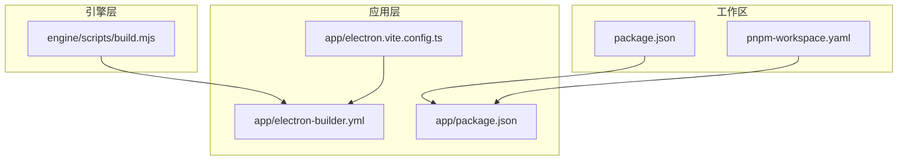
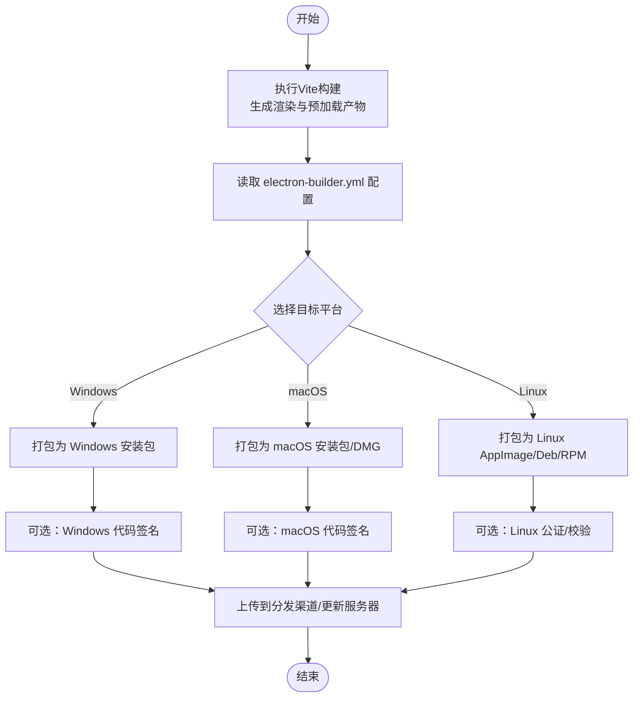
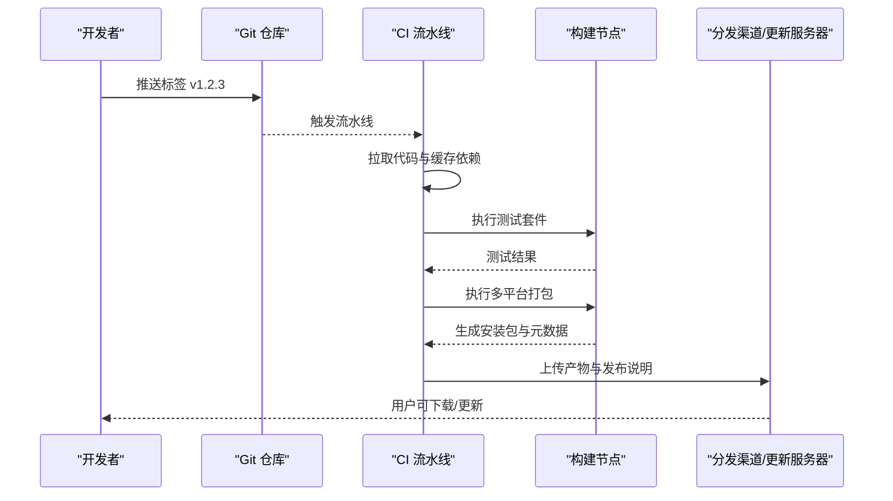
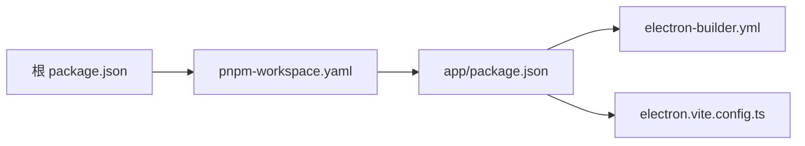

# 打包发布

<cite>
**本文引用的文件**   
- [app/electron-builder.yml](file://app/electron-builder.yml)
- [app/package.json](file://app/package.json)
- [app/electron.vite.config.ts](file://app/electron.vite.config.ts)
- [package.json](file://package.json)
- [pnpm-workspace.yaml](file://pnpm-workspace.yaml)
</cite>

## 目录
1. [简介](#简介)
2. [项目结构](#项目结构)
3. [核心组件](#核心组件)
4. [架构总览](#架构总览)
5. [详细组件分析](#详细组件分析)
6. [依赖分析](#依赖分析)
7. [性能考虑](#性能考虑)
8. [故障排查指南](#故障排查指南)
9. [结论](#结论)
10. [附录](#附录)

## 简介
本文件面向KCoder项目的打包与发布，聚焦于Electron Builder在多平台（Windows、macOS、Linux）的构建与分发实践。内容涵盖：
- Electron Builder配置与使用
- 多平台打包与代码签名
- 安装包定制
- 版本管理策略（语义化版本、变更日志、标签）
- 多渠道分发（应用商店、直接下载、自动更新服务器）
- CI/CD流水线集成（自动化测试、构建触发、发布流程）
- 打包优化技巧（体积压缩、依赖精简、启动时间优化）
- 发布前质量检查与验证流程

## 项目结构
KCoder采用monorepo组织方式，前端与主进程位于app目录，引擎与工具脚本位于engine目录。打包相关的关键配置集中在app目录下：
- app/electron-builder.yml：Electron Builder打包配置
- app/package.json：应用元数据与脚本入口
- app/electron.vite.config.ts：Vite构建配置（影响产物结构与路径）
- 根级package.json与pnpm-workspace.yaml：工作区与顶层脚本定义

图表来源
- [app/electron-builder.yml](file://app/electron-builder.yml)
- [app/package.json](file://app/package.json)
- [app/electron.vite.config.ts](file://app/electron.vite.config.ts)
- [package.json](file://package.json)
- [pnpm-workspace.yaml](file://pnpm-workspace.yaml)

章节来源
- [app/electron-builder.yml](file://app/electron-builder.yml)
- [app/package.json](file://app/package.json)
- [app/electron.vite.config.ts](file://app/electron.vite.config.ts)
- [package.json](file://package.json)
- [pnpm-workspace.yaml](file://pnpm-workspace.yaml)

## 核心组件
- 打包配置中心：app/electron-builder.yml，集中声明目标平台、输出目录、图标、签名、安装器选项、自动更新源等。
- 应用元数据与脚本：app/package.json，提供应用名称、版本、描述、图标、打包脚本入口等。
- 构建管线：app/electron.vite.config.ts，控制渲染进程与预加载脚本的构建产物，间接影响打包体积与路径解析。
- 工作区与顶层脚本：package.json与pnpm-workspace.yaml，统一依赖管理与命令编排，便于在CI中复用。

章节来源
- [app/electron-builder.yml](file://app/electron-builder.yml)
- [app/package.json](file://app/package.json)
- [app/electron.vite.config.ts](file://app/electron.vite.config.ts)
- [package.json](file://package.json)
- [pnpm-workspace.yaml](file://pnpm-workspace.yaml)

## 架构总览
下图展示从源码到可分发包的整体流程：Vite构建渲染与预加载产物，Electron Builder读取electron-builder.yml进行打包、签名、生成各平台安装包，并上传至分发渠道或自动更新服务器。

图表来源
- [app/electron-builder.yml](file://app/electron-builder.yml)
- [app/electron.vite.config.ts](file://app/electron.vite.config.ts)
- [app/package.json](file://app/package.json)

## 详细组件分析

### Electron Builder 配置与使用
- 配置文件位置：app/electron-builder.yml
- 关键能力
  - 多平台打包：支持Windows、macOS、Linux
  - 输出目录与产物命名：通过配置项控制
  - 图标与资源：设置应用图标、内置资源
  - 代码签名：Windows与macOS签名证书与参数
  - 安装器选项：安装向导、快捷方式、卸载行为
  - 自动更新：配置更新服务器地址与校验规则
- 使用方式
  - 本地开发：通过npm/yarn/pnpm脚本调用electron-builder
  - CI环境：注入环境变量（如签名凭据、更新密钥），执行打包与上传

章节来源
- [app/electron-builder.yml](file://app/electron-builder.yml)
- [app/package.json](file://app/package.json)

### 多平台打包（Windows、macOS、Linux）
- Windows
  - 产物类型：通常为NSIS安装包
  - 签名：使用可信CA证书进行代码签名，提升用户信任度
  - 注意事项：确保依赖库兼容x64/ARM64；处理UAC提示与管理员权限
- macOS
  - 产物类型：DMG或pkg
  - 签名与公证：需对App与框架进行签名，并进行Apple公证
  - 注意事项：沙盒与权限声明；App Store提交需遵循额外规范
- Linux
  - 产物类型：AppImage、deb、rpm
  - 依赖：系统库与运行时兼容性；包管理器依赖声明
  - 注意事项：桌面环境差异（GNOME/KDE/XFCE）与图标主题

章节来源
- [app/electron-builder.yml](file://app/electron-builder.yml)

### 代码签名与证书管理
- Windows
  - 证书格式：PFX/P12
  - 配置要点：证书路径、密码、时间戳服务器
  - 安全建议：将证书与密码放入CI密钥库，避免明文
- macOS
  - 证书与钥匙串：开发者证书、分发证书、公证密钥
  - 配置要点：签名身份、钥匙串路径、公证API凭据
- Linux
  - 通常无需签名，但可进行完整性校验与仓库签名

章节来源
- [app/electron-builder.yml](file://app/electron-builder.yml)

### 安装包定制
- 安装器界面：自定义欢迎页、许可协议、安装进度
- 快捷方式与卸载：桌面/开始菜单快捷方式、卸载程序行为
- 资源嵌入：图标、背景图、内嵌文档
- 平台特定选项：Windows注册表项、macOS Info.plist字段、Linux .desktop文件

章节来源
- [app/electron-builder.yml](file://app/electron-builder.yml)

### 版本管理策略
- 语义化版本控制
  - 版本号格式：主版本.次版本.修订版本
  - 变更原则：新功能递增次版本，修复递增修订版本，破坏性变更递增主版本
- 变更日志生成
  - 自动生成：基于Git标签与提交信息生成CHANGELOG
  - 人工维护：重要变更补充说明与迁移指引
- 发布标签管理
  - Git标签：vX.Y.Z对应发布版本
  - 分支策略：main用于稳定版，release分支用于发布准备

章节来源
- [app/package.json](file://app/package.json)
- [package.json](file://package.json)

### 多渠道分发配置
- 应用商店发布
  - Windows：Microsoft Store（需要额外清单与证书）
  - macOS：Mac App Store（需要公证与上架流程）
  - Linux：发行版仓库（需满足包规范与依赖）
- 直接下载
  - 静态托管：GitHub Releases、对象存储（S3/OSS）
  - 访问控制：私有链接、防盗链、带宽限制
- 自动更新服务器
  - 更新源：HTTPS服务返回最新版本的元数据与下载地址
  - 校验机制：签名校验、哈希校验、回滚策略
  - 灰度发布：按渠道或百分比推送新版本

章节来源
- [app/electron-builder.yml](file://app/electron-builder.yml)

### CI/CD流水线集成
- 触发条件
  - 推送标签：v*触发全平台打包与发布
  - 合并到main：触发预览构建与测试
- 自动化测试
  - 单元测试与集成测试：在构建前执行，失败则中止
  - 冒烟测试：对生成的安装包进行基础功能验证
- 构建与发布
  - 并行构建：多平台同时构建，缩短流水线时长
  - 缓存依赖：利用pnpm缓存加速依赖安装
  - 上传产物：构建完成后上传到分发渠道或更新服务器
- 安全与凭据
  - 密钥管理：使用CI密钥库存储签名证书与API令牌
  - 最小权限：仅授予必要的访问权限

图表来源
- [app/electron-builder.yml](file://app/electron-builder.yml)
- [app/package.json](file://app/package.json)
- [package.json](file://package.json)

章节来源
- [app/electron-builder.yml](file://app/electron-builder.yml)
- [app/package.json](file://app/package.json)
- [package.json](file://package.json)

### 打包优化技巧
- 体积压缩
  - 启用资源压缩：图片、字体、二进制文件压缩
  - 移除无用资源：清理调试符号、示例文件、文档
  - 按需引入：减少第三方库体积，使用tree-shaking
- 依赖精简
  - 生产依赖隔离：区分开发与生产依赖
  - 原生模块裁剪：仅包含必要平台原生依赖
  - 共享依赖：在monorepo中共享公共依赖，减少重复
- 启动时间优化
  - 懒加载：延迟加载非关键模块
  - 预编译：使用预构建产物减少首次运行开销
  - 资源预热：关键资源提前加载，降低首屏等待

章节来源
- [app/electron.vite.config.ts](file://app/electron.vite.config.ts)
- [app/package.json](file://app/package.json)

### 发布前的质量检查与验证流程
- 静态检查
  - 代码风格与类型检查：ESLint、TypeScript编译
  - 依赖漏洞扫描：检测已知安全问题
- 功能验证
  - 自动化测试：覆盖核心功能与边界场景
  - 安装包冒烟：在各平台安装后执行基本操作验证
- 安全与合规
  - 签名验证：确认签名有效且未过期
  - 隐私与权限：检查敏感权限与数据收集行为
- 回归与回滚
  - 灰度发布：先对小范围用户开放
  - 快速回滚：保留旧版本元数据与下载链接

章节来源
- [app/electron-builder.yml](file://app/electron-builder.yml)
- [app/package.json](file://app/package.json)

## 依赖分析
- 工作区依赖
  - pnpm-workspace.yaml定义子包与工作区规则
  - 根级package.json提供统一脚本与依赖版本锁定
- 应用依赖
  - app/package.json声明Electron、Builder、Vite等构建依赖
  - 构建产物由Vite生成，再由Electron Builder封装

图表来源
- [package.json](file://package.json)
- [pnpm-workspace.yaml](file://pnpm-workspace.yaml)
- [app/package.json](file://app/package.json)
- [app/electron-builder.yml](file://app/electron-builder.yml)
- [app/electron.vite.config.ts](file://app/electron.vite.config.ts)

章节来源
- [package.json](file://package.json)
- [pnpm-workspace.yaml](file://pnpm-workspace.yaml)
- [app/package.json](file://app/package.json)
- [app/electron-builder.yml](file://app/electron-builder.yml)
- [app/electron.vite.config.ts](file://app/electron.vite.config.ts)

## 性能考虑
- 构建阶段
  - 并行任务：充分利用多核CPU并行构建与测试
  - 增量构建：缓存中间产物，缩短二次构建时间
- 运行阶段
  - 内存占用：监控主进程与渲染进程内存峰值
  - I/O优化：减少磁盘读写，使用内存映射与缓冲
- 网络阶段
  - 更新元数据压缩：减小下载体积
  - CDN加速：就近分发安装包与更新包

[本节为通用指导，不直接分析具体文件]

## 故障排查指南
- 常见错误
  - 签名失败：检查证书有效期、密码、时间戳服务器可达性
  - 平台依赖缺失：安装系统库或调整构建环境
  - 自动更新失败：核对更新服务器URL、元数据格式、签名校验
- 诊断方法
  - 启用详细日志：查看构建与打包过程输出
  - 最小复现：剥离非必要依赖与资源，定位问题根源
  - 跨平台对比：在不同环境中复现，识别平台差异
- 恢复策略
  - 回退版本：使用上一个稳定版本继续提供服务
  - 临时降级：关闭自动更新，引导用户手动下载安装包

章节来源
- [app/electron-builder.yml](file://app/electron-builder.yml)
- [app/package.json](file://app/package.json)

## 结论
通过合理的Electron Builder配置与CI/CD集成，KCoder可实现高效、稳定的多平台打包与发布。结合严格的版本管理与质量检查，能够保障用户体验与安全性。持续优化构建与运行性能，有助于提升整体交付效率与应用表现。

[本节为总结性内容，不直接分析具体文件]

## 附录
- 术语解释
  - 语义化版本：遵循MAJOR.MINOR.PATCH的版本号约定
  - 代码签名：使用数字证书对软件进行签名，证明来源与完整性
  - 自动更新：客户端定期检查并下载新版本的机制
- 参考路径
  - 打包配置：app/electron-builder.yml
  - 应用脚本：app/package.json
  - 构建配置：app/electron.vite.config.ts
  - 工作区：package.json、pnpm-workspace.yaml

[本节为补充信息，不直接分析具体文件]