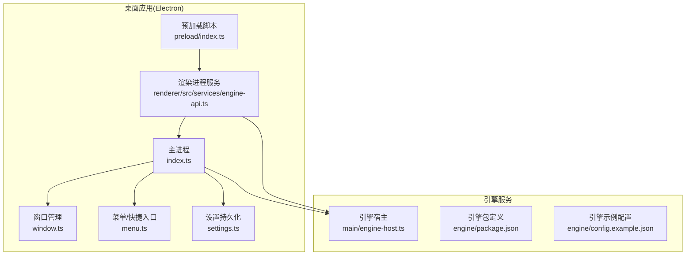
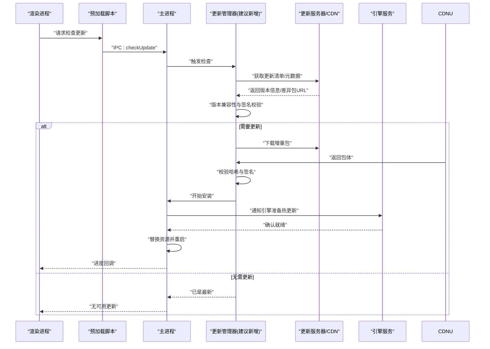
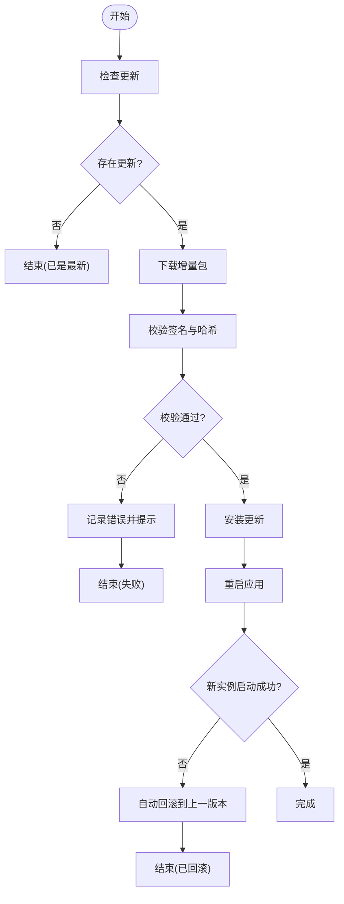
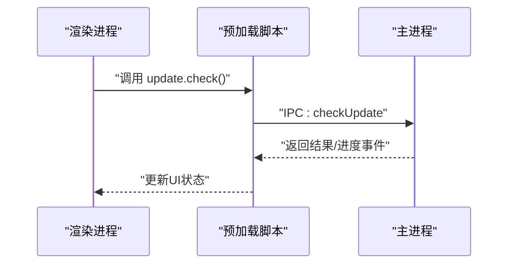
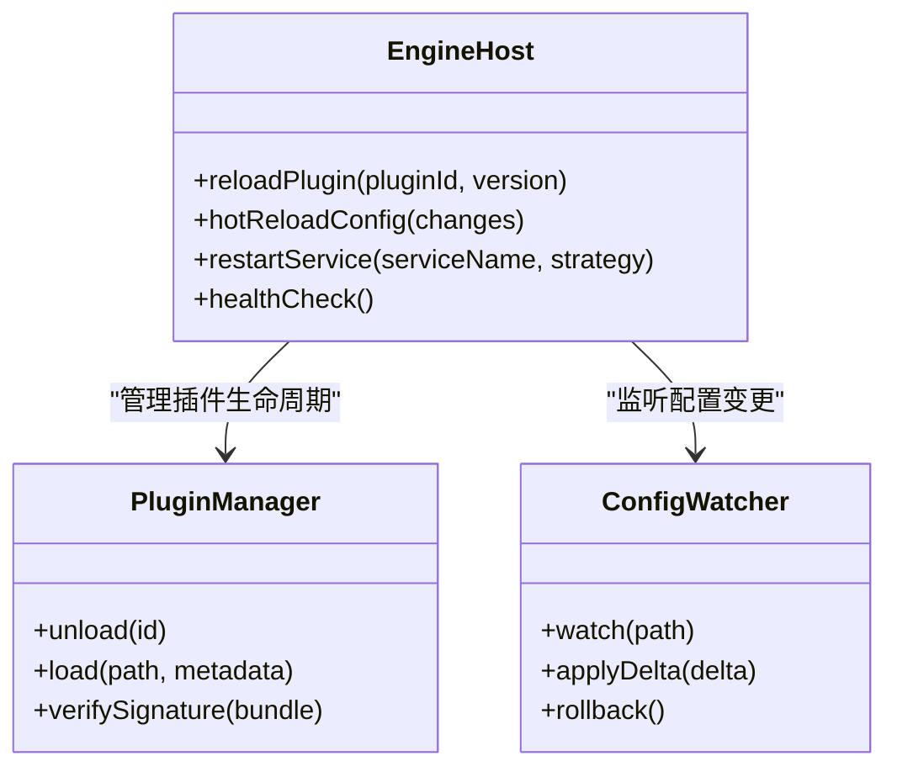
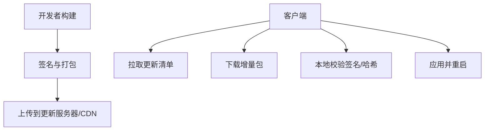
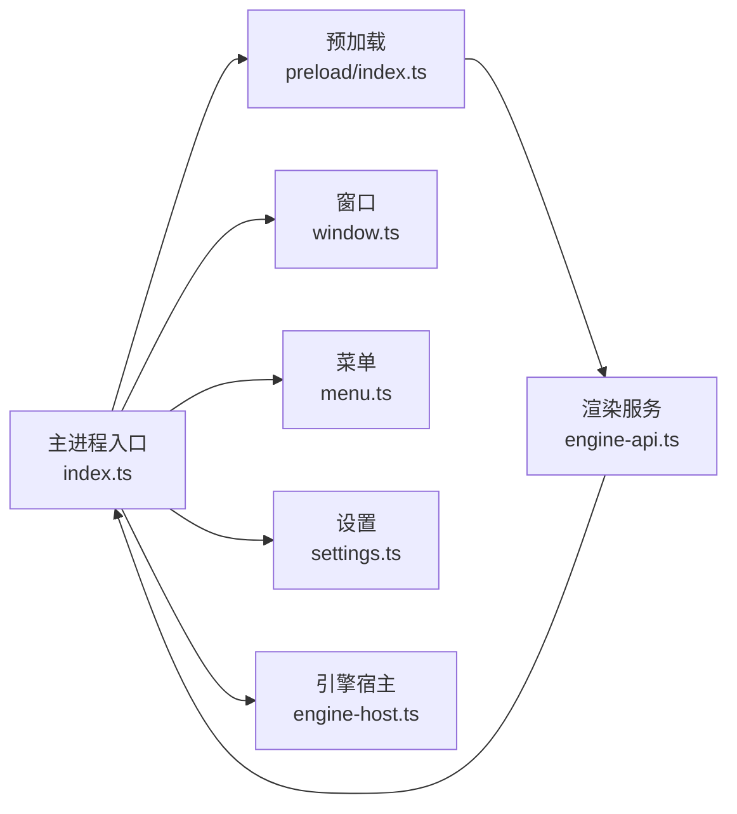

# 更新机制

<cite>
**本文引用的文件**   
- [app/main/index.ts](file://app/main/index.ts)
- [app/main/engine-host.ts](file://app/main/engine-host.ts)
- [app/main/settings.ts](file://app/main/settings.ts)
- [app/main/menu.ts](file://app/main/menu.ts)
- [app/main/window.ts](file://app/main/window.ts)
- [app/preload/index.ts](file://app/preload/index.ts)
- [app/renderer/src/services/engine-api.ts](file://app/renderer/src/services/engine-api.ts)
- [app/electron-builder.yml](file://app/electron-builder.yml)
- [engine/package.json](file://engine/package.json)
- [engine/config.example.json](file://engine/config.example.json)
</cite>

## 目录
1. [简介](#简介)
2. [项目结构](#项目结构)
3. [核心组件](#核心组件)
4. [架构总览](#架构总览)
5. [详细组件分析](#详细组件分析)
6. [依赖关系分析](#依赖关系分析)
7. [性能考虑](#性能考虑)
8. [故障排查指南](#故障排查指南)
9. [结论](#结论)
10. [附录](#附录)

## 简介
本文件面向KCoder项目的“更新机制”，覆盖以下目标：
- 桌面应用自动更新：检查、增量更新、回滚策略
- 引擎服务热更新：插件热重载、配置热更新、服务重启策略
- 更新流程设计：版本兼容性检查、更新包验证、安装进度反馈
- 更新服务器配置与管理：更新源配置、CDN加速、灰度发布
- 失败处理：重试机制、手动回滚、紧急修复
- 安全与权限：签名校验、完整性校验、最小权限原则

说明：当前仓库未包含完整的自动更新实现代码，本文基于现有入口与配置文件进行架构化设计与建议，确保可落地且与现有工程结构一致。

## 项目结构
KCoder采用Electron多进程架构（主进程/预加载/渲染进程）与独立的引擎服务（Node.js）。更新相关的关键位置包括：
- 主进程入口与窗口管理：用于触发更新检查、下载、安装与重启
- 预加载脚本：向渲染进程暴露安全的IPC接口
- 渲染进程服务：调用主进程能力并展示进度
- Electron构建配置：打包产物与分发渠道
- 引擎服务：提供运行时能力，支持热重载与配置热更新

图表来源
- [app/main/index.ts](file://app/main/index.ts)
- [app/main/window.ts](file://app/main/window.ts)
- [app/main/menu.ts](file://app/main/menu.ts)
- [app/main/settings.ts](file://app/main/settings.ts)
- [app/preload/index.ts](file://app/preload/index.ts)
- [app/renderer/src/services/engine-api.ts](file://app/renderer/src/services/engine-api.ts)
- [app/main/engine-host.ts](file://app/main/engine-host.ts)
- [engine/package.json](file://engine/package.json)
- [engine/config.example.json](file://engine/config.example.json)

章节来源
- [app/main/index.ts](file://app/main/index.ts)
- [app/main/engine-host.ts](file://app/main/engine-host.ts)
- [app/main/settings.ts](file://app/main/settings.ts)
- [app/main/menu.ts](file://app/main/menu.ts)
- [app/main/window.ts](file://app/main/window.ts)
- [app/preload/index.ts](file://app/preload/index.ts)
- [app/renderer/src/services/engine-api.ts](file://app/renderer/src/services/engine-api.ts)
- [app/electron-builder.yml](file://app/electron-builder.yml)
- [engine/package.json](file://engine/package.json)
- [engine/config.example.json](file://engine/config.example.json)

## 核心组件
- 主进程更新管理器（建议新增模块）
  - 职责：定时或事件驱动的检查更新、下载增量包、校验签名与哈希、执行安装与重启、记录日志与状态
  - 关键能力：版本比较、增量补丁生成/应用、回滚快照、失败重试、进度上报
- 预加载IPC桥接
  - 职责：将更新能力以安全API暴露给渲染进程，避免直接访问敏感系统API
- 渲染进程更新UI
  - 职责：展示检查、下载、安装进度；用户交互（立即重启/稍后提醒）；错误提示与帮助链接
- 引擎热更新器（建议新增模块）
  - 职责：监听配置变更、动态加载/卸载插件、平滑重启受影响的子服务
- 构建与分发配置
  - 职责：配置更新源、签名、增量包策略、CDN与灰度通道

章节来源
- [app/main/index.ts](file://app/main/index.ts)
- [app/preload/index.ts](file://app/preload/index.ts)
- [app/renderer/src/services/engine-api.ts](file://app/renderer/src/services/engine-api.ts)
- [app/electron-builder.yml](file://app/electron-builder.yml)

## 架构总览
下图展示了从“检查更新”到“安装完成并重启”的端到端流程，以及引擎服务的并行热更新路径。

图表来源
- [app/main/index.ts](file://app/main/index.ts)
- [app/preload/index.ts](file://app/preload/index.ts)
- [app/renderer/src/services/engine-api.ts](file://app/renderer/src/services/engine-api.ts)
- [app/main/engine-host.ts](file://app/main/engine-host.ts)

## 详细组件分析

### 桌面应用自动更新（主进程侧）
- 更新检查
  - 触发时机：启动时、用户主动检查、后台定时任务
  - 数据来源：更新服务器的清单与元数据（版本号、平台、架构、是否强制更新等）
- 增量更新
  - 策略：基于二进制差异的增量包，减少带宽与时间
  - 校验：对增量包进行完整性校验与数字签名验证
- 安装与重启
  - 安装阶段：解压/合并增量包至工作目录
  - 重启策略：优雅关闭主进程与引擎服务，再拉起新版本
- 回滚策略
  - 快照：在更新前创建工作目录快照或保留上一版本目录
  - 自动回滚：新版本启动失败时，自动切换回旧版本并上报错误
  - 手动回滚：通过设置面板或菜单触发回滚

图表来源
- [app/main/index.ts](file://app/main/index.ts)
- [app/main/settings.ts](file://app/main/settings.ts)

章节来源
- [app/main/index.ts](file://app/main/index.ts)
- [app/main/settings.ts](file://app/main/settings.ts)

### 预加载与渲染进程（IPC与UI）
- IPC桥接
  - 预加载脚本暴露安全的更新API（如检查、下载、安装、取消、进度查询）
  - 限制方法名与参数范围，防止注入风险
- 渲染进程UI
  - 显示进度条、剩余时间估算、错误码与帮助链接
  - 提供“立即重启”“稍后提醒”“跳过此版本”等操作

图表来源
- [app/preload/index.ts](file://app/preload/index.ts)
- [app/renderer/src/services/engine-api.ts](file://app/renderer/src/services/engine-api.ts)

章节来源
- [app/preload/index.ts](file://app/preload/index.ts)
- [app/renderer/src/services/engine-api.ts](file://app/renderer/src/services/engine-api.ts)

### 引擎服务热更新
- 插件热重载
  - 监听插件目录变更或收到主进程指令后，按需卸载旧插件并加载新版本
  - 保持会话与上下文一致性，必要时进行迁移
- 配置热更新
  - 监听配置文件的增量变更，应用变更后仅重启受影响的服务组件
- 服务重启策略
  - 平滑重启：先停止接收新请求，等待活跃请求完成，再重启
  - 健康检查：重启后自检，失败则回滚配置与插件

图表来源
- [app/main/engine-host.ts](file://app/main/engine-host.ts)
- [engine/package.json](file://engine/package.json)
- [engine/config.example.json](file://engine/config.example.json)

章节来源
- [app/main/engine-host.ts](file://app/main/engine-host.ts)
- [engine/package.json](file://engine/package.json)
- [engine/config.example.json](file://engine/config.example.json)

### 更新服务器与分发配置
- 更新源配置
  - 清单格式：包含版本、平台、架构、是否需要强制更新、增量包URL、签名信息等
  - 灰度发布：按用户ID、渠道或百分比控制可见性
- CDN加速
  - 使用CDN缓存静态资源与增量包，提升全球下载速度
- 构建与签名
  - 使用electron-builder配置更新源、签名证书与增量包策略

图表来源
- [app/electron-builder.yml](file://app/electron-builder.yml)

章节来源
- [app/electron-builder.yml](file://app/electron-builder.yml)

## 依赖关系分析
- 主进程与预加载/渲染进程的耦合点集中在IPC接口
- 主进程与引擎服务通过进程间通信或本地HTTP/管道协作
- 构建配置影响最终产物与更新分发行为

图表来源
- [app/main/index.ts](file://app/main/index.ts)
- [app/main/window.ts](file://app/main/window.ts)
- [app/main/menu.ts](file://app/main/menu.ts)
- [app/main/settings.ts](file://app/main/settings.ts)
- [app/preload/index.ts](file://app/preload/index.ts)
- [app/renderer/src/services/engine-api.ts](file://app/renderer/src/services/engine-api.ts)
- [app/main/engine-host.ts](file://app/main/engine-host.ts)

章节来源
- [app/main/index.ts](file://app/main/index.ts)
- [app/main/window.ts](file://app/main/window.ts)
- [app/main/menu.ts](file://app/main/menu.ts)
- [app/main/settings.ts](file://app/main/settings.ts)
- [app/preload/index.ts](file://app/preload/index.ts)
- [app/renderer/src/services/engine-api.ts](file://app/renderer/src/services/engine-api.ts)
- [app/main/engine-host.ts](file://app/main/engine-host.ts)

## 性能考虑
- 增量更新优先：显著降低带宽与安装时间
- 并发下载与分块校验：提高大体积资源的下载效率
- 冷启动优化：更新完成后延迟非关键初始化，缩短首次启动耗时
- 引擎热更新：按需重启，避免全量重启带来的抖动

## 故障排查指南
- 常见错误与定位
  - 网络异常：检查更新源可达性与CDN状态
  - 签名/哈希不匹配：核对证书与构建流水线
  - 磁盘空间不足：清理临时目录或扩容
  - 权限问题：确保应用具备写入安装目录的权限
- 重试与回滚
  - 指数退避重试：针对网络抖动与服务器限流
  - 自动回滚：新版本启动失败时恢复上一版本
  - 手动回滚：通过设置或菜单触发
- 日志与诊断
  - 记录更新检查、下载、校验、安装各阶段的日志
  - 收集崩溃堆栈与环境信息，便于复现与修复

章节来源
- [app/main/settings.ts](file://app/main/settings.ts)
- [app/main/menu.ts](file://app/main/menu.ts)

## 结论
本文基于KCoder现有工程结构，提出了完整的更新机制设计方案，涵盖桌面应用的自动更新与引擎服务的热更新，明确了版本兼容、包校验、进度反馈、灰度发布与安全加固等关键环节。建议在后续迭代中逐步落地上述模块，并通过测试与监控保障更新的稳定性与用户体验。

## 附录
- 术语
  - 增量更新：仅传输与上次版本差异的部分
  - 灰度发布：按条件逐步放量，降低风险
  - 热更新：在不中断服务的情况下完成更新
- 参考配置
  - 构建与分发：[app/electron-builder.yml](file://app/electron-builder.yml)
  - 引擎示例配置：[engine/config.example.json](file://engine/config.example.json)
  - 引擎包定义：[engine/package.json](file://engine/package.json)