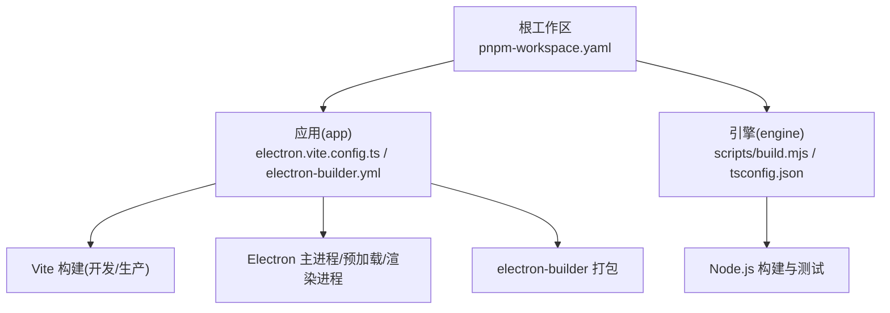
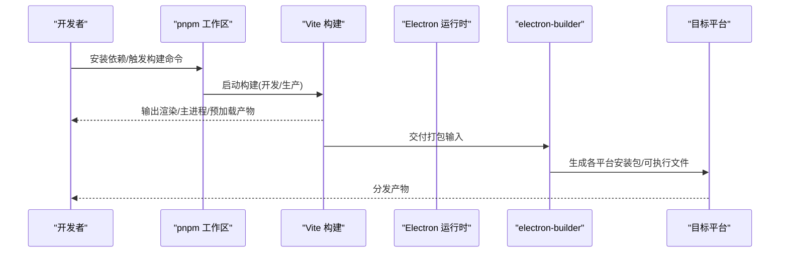
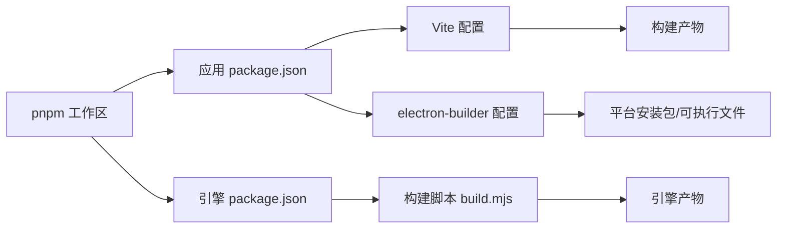

# 构建配置

<cite>
**本文引用的文件**   
- [package.json](file://package.json)
- [pnpm-workspace.yaml](file://pnpm-workspace.yaml)
- [tsconfig.json](file://tsconfig.json)
- [app/package.json](file://app/package.json)
- [app/electron.vite.config.ts](file://app/electron.vite.config.ts)
- [app/tsconfig.json](file://app/tsconfig.json)
- [app/electron-builder.yml](file://app/electron-builder.yml)
- [engine/package.json](file://engine/package.json)
- [engine/pnpm-workspace.yaml](file://engine/pnpm-workspace.yaml)
- [engine/tsconfig.json](file://engine/tsconfig.json)
- [engine/scripts/build.mjs](file://engine/scripts/build.mjs)
</cite>

## 目录
1. [简介](#简介)
2. [项目结构](#项目结构)
3. [核心组件](#核心组件)
4. [架构总览](#架构总览)
5. [详细组件分析](#详细组件分析)
6. [依赖关系分析](#依赖关系分析)
7. [性能考虑](#性能考虑)
8. [故障排查指南](#故障排查指南)
9. [结论](#结论)
10. [附录](#附录)

## 简介
本文件面向KCoder项目的构建与打包，聚焦以下目标：
- Electron + Vite 的构建配置说明（多平台编译、代码分割、资源优化）
- TypeScript 编译配置（路径映射、模块解析、类型检查）
- Monorepo 构建流程（包依赖管理、并行构建、增量编译）
- 构建脚本实现（自定义任务、环境变量注入、产物处理）
- 构建性能优化建议（缓存策略、并行执行、内存优化）
- 常见构建问题排查与解决方案

## 项目结构
KCoder采用Monorepo组织方式，顶层使用pnpm workspace统一管理应用与引擎两个子工程。应用层基于Electron + Vite进行开发与打包；引擎层为独立的Node.js工程，提供可复用的能力与工具链。

图表来源
- [pnpm-workspace.yaml](file://pnpm-workspace.yaml)
- [app/electron.vite.config.ts](file://app/electron.vite.config.ts)
- [app/electron-builder.yml](file://app/electron-builder.yml)
- [engine/scripts/build.mjs](file://engine/scripts/build.mjs)

章节来源
- [pnpm-workspace.yaml](file://pnpm-workspace.yaml)
- [app/electron.vite.config.ts](file://app/electron.vite.config.ts)
- [app/electron-builder.yml](file://app/electron-builder.yml)
- [engine/scripts/build.mjs](file://engine/scripts/build.mjs)

## 核心组件
- 应用构建管线
  - Vite负责渲染进程与静态资源的构建，支持热更新与按需打包。
  - Electron主进程与预加载脚本由Vite统一构建并输出到指定目录。
  - electron-builder根据配置文件生成各平台安装包与分发产物。
- 引擎构建管线
  - 通过自定义脚本编排TypeScript编译、产物整理与测试验证等步骤。
- 共享配置
  - 顶层与子工程分别维护tsconfig.json以适配不同运行环境与模块边界。
  - pnpm-workspace.yaml定义包间依赖与工作区规则。

章节来源
- [app/electron.vite.config.ts](file://app/electron.vite.config.ts)
- [app/electron-builder.yml](file://app/electron-builder.yml)
- [engine/scripts/build.mjs](file://engine/scripts/build.mjs)
- [app/tsconfig.json](file://app/tsconfig.json)
- [engine/tsconfig.json](file://engine/tsconfig.json)
- [pnpm-workspace.yaml](file://pnpm-workspace.yaml)

## 架构总览
下图展示了从源码到最终产物的端到端构建流程，涵盖开发、生产构建与跨平台打包。

图表来源
- [app/electron.vite.config.ts](file://app/electron.vite.config.ts)
- [app/electron-builder.yml](file://app/electron-builder.yml)
- [pnpm-workspace.yaml](file://pnpm-workspace.yaml)

## 详细组件分析

### Electron + Vite 构建配置
- 构建入口与模式
  - 通过Vite配置定义主进程、预加载与渲染进程的构建入口与输出目录。
  - 支持开发模式与生产模式的差异化配置（如调试开关、资源路径、压缩选项）。
- 多平台编译
  - 借助electron-builder在配置中声明目标平台与架构，统一产出Windows/macOS/Linux安装包或可执行文件。
  - 可在构建阶段注入平台相关变量，驱动条件编译逻辑。
- 代码分割策略
  - 针对大型页面或第三方库启用动态导入，减少首屏体积。
  - 将稳定依赖与业务代码分离，提升浏览器缓存命中率。
- 资源优化
  - 图片、字体等资源启用压缩与按需转换。
  - 静态资源按内容哈希命名，配合CDN或离线包场景进行版本管理。

章节来源
- [app/electron.vite.config.ts](file://app/electron.vite.config.ts)
- [app/electron-builder.yml](file://app/electron-builder.yml)

### TypeScript 编译配置
- 路径映射与模块解析
  - 使用路径别名简化深层模块引用，提高可读性与可维护性。
  - 配置模块解析策略，确保跨包引用与外部依赖的正确解析。
- 类型检查选项
  - 开启严格类型检查，包括空值检查、函数参数校验、返回类型推断等。
  - 针对第三方库引入必要的类型声明，避免类型丢失。
- 多工程协同
  - 顶层tsconfig.json提供通用基础配置，子工程继承并覆盖特定选项。
  - 通过include/exclude精准控制参与编译的文件范围，缩短编译时间。

章节来源
- [tsconfig.json](file://tsconfig.json)
- [app/tsconfig.json](file://app/tsconfig.json)
- [engine/tsconfig.json](file://engine/tsconfig.json)

### Monorepo 构建流程
- 包依赖管理
  - 使用pnpm工作区统一管理应用与引擎的依赖，避免重复安装与版本冲突。
  - 通过workspace协议引用本地包，保证开发联调与构建一致性。
- 并行构建
  - 利用pnpm的并行能力同时构建多个包，缩短整体构建时长。
  - 对无相互依赖的包优先并行执行，有依赖关系的包按拓扑顺序构建。
- 增量编译
  - 结合Vite与TypeScript的增量机制，仅重新编译变更文件与受影响模块。
  - 合理划分包粒度，降低无效重建范围。

章节来源
- [pnpm-workspace.yaml](file://pnpm-workspace.yaml)
- [app/package.json](file://app/package.json)
- [engine/package.json](file://engine/package.json)

### 构建脚本实现
- 自定义构建任务
  - 引擎侧通过脚本编排编译、产物整理、测试验证等步骤，形成一致的CI流水线。
  - 支持可选步骤开关，便于在不同环境灵活裁剪构建流程。
- 环境变量注入
  - 在构建前注入平台、版本、分支等信息，供运行时与日志系统使用。
  - 区分开发/测试/生产环境的不同变量集，保障安全与可观测性。
- 构建产物处理
  - 统一输出目录结构，便于后续归档、签名与发布。
  - 生成元数据文件（如版本、提交哈希），用于追踪与回滚。

章节来源
- [engine/scripts/build.mjs](file://engine/scripts/build.mjs)
- [engine/package.json](file://engine/package.json)

## 依赖关系分析
下图展示关键构建组件之间的依赖关系与调用方向。

图表来源
- [pnpm-workspace.yaml](file://pnpm-workspace.yaml)
- [app/package.json](file://app/package.json)
- [engine/package.json](file://engine/package.json)
- [app/electron.vite.config.ts](file://app/electron.vite.config.ts)
- [app/electron-builder.yml](file://app/electron-builder.yml)
- [engine/scripts/build.mjs](file://engine/scripts/build.mjs)

章节来源
- [pnpm-workspace.yaml](file://pnpm-workspace.yaml)
- [app/package.json](file://app/package.json)
- [engine/package.json](file://engine/package.json)
- [app/electron.vite.config.ts](file://app/electron.vite.config.ts)
- [app/electron-builder.yml](file://app/electron-builder.yml)
- [engine/scripts/build.mjs](file://engine/scripts/build.mjs)

## 性能考虑
- 缓存策略
  - 启用Vite依赖预构建与模块缓存，减少冷启动与首次构建时间。
  - 在CI中缓存node_modules与构建中间产物，加速流水线。
- 并行执行
  - 使用pnpm并行构建多个独立包，最大化CPU利用率。
  - 将耗时任务（如类型检查、测试）拆分到独立阶段，避免阻塞主构建。
- 内存优化
  - 调整Node进程内存上限，避免大项目在低内存环境下OOM。
  - 限制并发构建数量，平衡速度与稳定性。
- 增量与选择性构建
  - 仅构建变更包与受影响的下游包，减少不必要的工作量。
  - 对静态资源进行分块与懒加载，降低首屏压力。

[本节为通用指导，不直接分析具体文件]

## 故障排查指南
- 依赖解析失败
  - 确认pnpm工作区配置是否正确包含所有子工程。
  - 检查包间依赖是否使用workspace协议，避免版本不一致。
- 构建产物缺失或路径错误
  - 核对Vite输出目录与electron-builder输入目录的一致性。
  - 检查环境变量注入是否影响资源路径解析。
- 类型检查报错
  - 确认tsconfig.include/exclude范围，避免遗漏必要文件或误包含无关文件。
  - 为第三方库补充类型声明或关闭不必要的严格检查项。
- 打包失败或签名问题
  - 检查electron-builder平台与架构配置是否与当前环境匹配。
  - 确认证书与密钥配置正确，权限充足。
- 构建缓慢或内存溢出
  - 调整并发度与内存上限，观察构建日志定位瓶颈。
  - 启用增量构建与缓存，减少重复计算。

章节来源
- [pnpm-workspace.yaml](file://pnpm-workspace.yaml)
- [app/electron.vite.config.ts](file://app/electron.vite.config.ts)
- [app/electron-builder.yml](file://app/electron-builder.yml)
- [app/tsconfig.json](file://app/tsconfig.json)
- [engine/tsconfig.json](file://engine/tsconfig.json)
- [engine/scripts/build.mjs](file://engine/scripts/build.mjs)

## 结论
KCoder采用清晰的Monorepo结构与分层构建管线，结合Vite与electron-builder实现了高效的开发与打包体验。通过合理的TypeScript配置、依赖管理与脚本编排，能够在保证质量的同时显著提升构建性能。建议在CI中固化缓存与并行策略，持续监控构建指标，逐步优化关键路径。

[本节为总结性内容，不直接分析具体文件]

## 附录
- 常用命令参考
  - 安装依赖：在工作区根目录执行pnpm install
  - 应用开发：进入app目录，使用Vite启动开发服务器
  - 应用构建：执行生产构建命令，生成dist产物
  - 应用打包：调用electron-builder生成各平台安装包
  - 引擎构建：执行engine/scripts/build.mjs完成编译与验证
- 关键配置文件清单
  - 工作区与包配置：pnpm-workspace.yaml、app/package.json、engine/package.json
  - 构建配置：app/electron.vite.config.ts、app/electron-builder.yml
  - 类型配置：tsconfig.json、app/tsconfig.json、engine/tsconfig.json
  - 构建脚本：engine/scripts/build.mjs

章节来源
- [pnpm-workspace.yaml](file://pnpm-workspace.yaml)
- [app/package.json](file://app/package.json)
- [engine/package.json](file://engine/package.json)
- [app/electron.vite.config.ts](file://app/electron.vite.config.ts)
- [app/electron-builder.yml](file://app/electron-builder.yml)
- [tsconfig.json](file://tsconfig.json)
- [app/tsconfig.json](file://app/tsconfig.json)
- [engine/tsconfig.json](file://engine/tsconfig.json)
- [engine/scripts/build.mjs](file://engine/scripts/build.mjs)