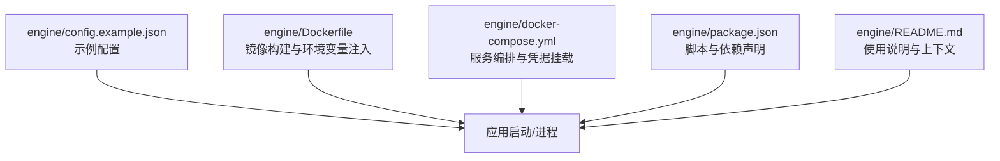
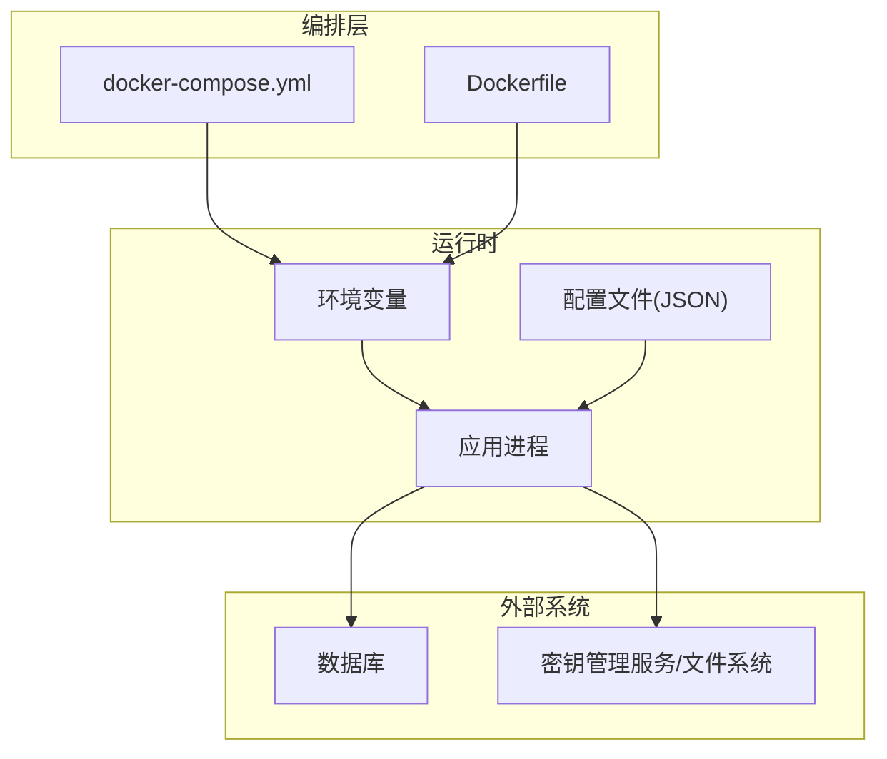
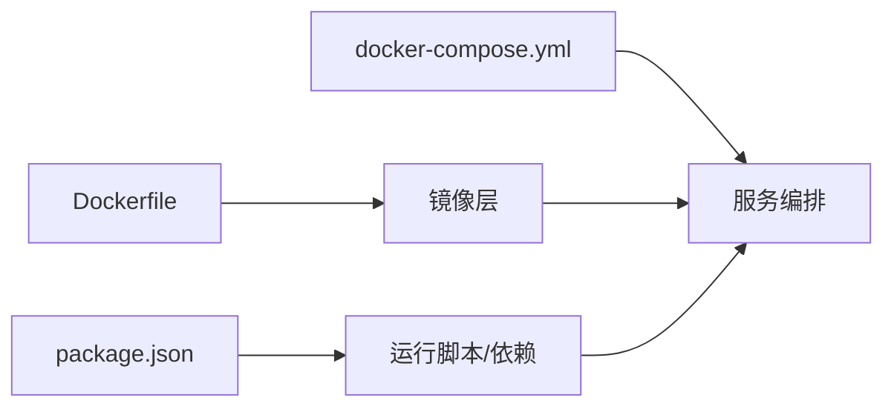

# 生产环境配置

<cite>
**本文引用的文件**   
- [config.example.json](file://engine/config.example.json)
- [Dockerfile](file://engine/Dockerfile)
- [docker-compose.yml](file://engine/docker-compose.yml)
- [package.json](file://engine/package.json)
- [README.md](file://engine/README.md)
</cite>

## 目录
1. [简介](#简介)
2. [项目结构](#项目结构)
3. [核心组件](#核心组件)
4. [架构总览](#架构总览)
5. [详细组件分析](#详细组件分析)
6. [依赖分析](#依赖分析)
7. [性能考虑](#性能考虑)
8. [故障排查指南](#故障排查指南)
9. [结论](#结论)
10. [附录](#附录)

## 简介
本文件面向KCoder的生产环境，聚焦“配置管理”主题：环境变量与配置文件的使用、敏感信息保护、配置优先级、JSON配置结构与校验、默认值管理、密钥管理（加密存储、访问控制、轮换）、数据库连接（连接池、主从复制、故障转移）、网络优化（代理、SSL、防火墙）、配置审计与变更流程、以及热加载与动态调整能力。文档以仓库中现有工程资产为依据进行说明，并在无法直接定位到具体实现时给出通用实践建议。

## 项目结构
KCoder采用多包工作区组织，引擎侧包含示例配置、容器化构建与编排脚本等关键资产，便于在生产环境中落地配置策略。

图表来源
- [config.example.json](file://engine/config.example.json)
- [Dockerfile](file://engine/Dockerfile)
- [docker-compose.yml](file://engine/docker-compose.yml)
- [package.json](file://engine/package.json)
- [README.md](file://engine/README.md)

章节来源
- [config.example.json](file://engine/config.example.json)
- [Dockerfile](file://engine/Dockerfile)
- [docker-compose.yml](file://engine/docker-compose.yml)
- [package.json](file://engine/package.json)
- [README.md](file://engine/README.md)

## 核心组件
- 配置入口与示例
  - 通过示例配置文件提供键名与结构参考，用于指导实际部署时的配置项定义与取值范围。
- 容器化与编排
  - Dockerfile负责镜像构建阶段的环境准备；docker-compose.yml负责服务编排、端口映射、卷挂载与凭据注入。
- 脚本与依赖
  - package.json集中声明运行期脚本与依赖，便于在CI/CD或本地复现一致的运行环境。

章节来源
- [config.example.json](file://engine/config.example.json)
- [Dockerfile](file://engine/Dockerfile)
- [docker-compose.yml](file://engine/docker-compose.yml)
- [package.json](file://engine/package.json)

## 架构总览
下图展示生产环境中的配置来源与注入路径：环境变量优先于配置文件，编排层将凭据以安全方式注入到运行时。

图表来源
- [docker-compose.yml](file://engine/docker-compose.yml)
- [Dockerfile](file://engine/Dockerfile)
- [config.example.json](file://engine/config.example.json)

## 详细组件分析

### 环境变量与配置优先级
- 推荐优先级（从高到低）
  1) 运行时环境变量（由编排层注入）
  2) 配置文件（JSON）
  3) 代码内默认值
- 覆盖策略
  - 同一键在不同来源出现时，高优先级覆盖低优先级。
  - 对布尔型、数值型、数组/对象类型需确保类型一致性，避免隐式转换导致行为异常。
- 最佳实践
  - 使用命名空间前缀区分模块（如 ENGINE_、DB_、NET_）。
  - 在编排层集中注入，避免硬编码到镜像或代码中。

章节来源
- [docker-compose.yml](file://engine/docker-compose.yml)
- [Dockerfile](file://engine/Dockerfile)
- [config.example.json](file://engine/config.example.json)

### JSON配置文件结构与验证
- 结构建议
  - 根级按功能域划分（例如：database、network、security、observability）。
  - 每个域下明确必填项、可选项、默认值与取值范围。
- 验证策略
  - 启动时执行一次配置校验，失败则中止进程并输出清晰错误信息。
  - 对枚举值进行白名单校验，对URL/端口/路径进行格式校验。
- 默认值管理
  - 仅对非敏感、稳定且安全的参数设置默认值；敏感项不设置默认值，强制显式配置。
- 版本兼容
  - 为配置引入schema版本字段，支持向后兼容的迁移逻辑。

章节来源
- [config.example.json](file://engine/config.example.json)

### 敏感信息与密钥管理
- 存储位置
  - 生产环境禁止将密钥写入镜像或代码仓库；通过编排层挂载只读卷或使用专用密钥服务。
- 访问控制
  - 最小权限原则：仅目标进程可读取对应密钥文件；操作系统层面限制文件权限。
- 轮换策略
  - 定期轮换密钥；支持双密钥并行期，保证平滑过渡。
  - 若应用支持热重载，可在不重启的情况下切换新密钥。
- 审计与告警
  - 记录密钥访问日志（不含明文），对异常访问触发告警。

章节来源
- [docker-compose.yml](file://engine/docker-compose.yml)
- [Dockerfile](file://engine/Dockerfile)

### 数据库连接配置
- 连接池
  - 根据并发与延迟目标设定最大连接数、空闲回收时间、获取超时等。
  - 监控连接池利用率与等待队列长度，作为容量规划依据。
- 主从复制
  - 写节点与读节点分离；读请求路由至从库，写请求路由至主库。
  - 配置健康检查与自动重连，降低抖动影响。
- 故障转移
  - 主库不可用时，具备降级策略（如限流、只读模式、缓存兜底）。
  - 切换后重新建立连接池，避免长尾延迟。

章节来源
- [config.example.json](file://engine/config.example.json)

### 网络配置优化
- 代理设置
  - 对外部HTTP/HTTPS请求统一经代理出口；配置重试与超时策略。
- SSL/TLS
  - 启用强密码套件与最新协议版本；证书与私钥通过安全通道注入。
- 防火墙规则
  - 仅开放必要端口；限制源IP白名单；对出站流量进行域名/IP白名单管控。

章节来源
- [docker-compose.yml](file://engine/docker-compose.yml)
- [Dockerfile](file://engine/Dockerfile)

### 配置审计与变更管理
- 基线与版本化
  - 所有配置变更纳入版本控制；变更单关联配置diff与回滚方案。
- 审批与发布
  - 关键配置变更需双人复核；灰度发布与快速回滚机制必备。
- 审计日志
  - 记录配置加载结果、生效版本、变更人、时间戳与原因。

章节来源
- [docker-compose.yml](file://engine/docker-compose.yml)
- [Dockerfile](file://engine/Dockerfile)

### 配置热加载与动态调整
- 热加载时机
  - 监听配置变更事件，在不中断请求的前提下更新内存态配置。
- 安全边界
  - 仅允许非敏感、幂等的配置项热更新；涉及连接池、TLS、认证等关键项建议重启生效。
- 观测性
  - 暴露配置版本与生效状态指标，便于追踪与回溯。

章节来源
- [config.example.json](file://engine/config.example.json)

## 依赖分析
- 构建与运行依赖
  - 通过package.json声明运行脚本与依赖，确保构建产物与运行环境一致。
- 容器化依赖
  - Dockerfile定义基础镜像、安装步骤与入口；docker-compose.yml定义服务间依赖与数据卷。

图表来源
- [package.json](file://engine/package.json)
- [Dockerfile](file://engine/Dockerfile)
- [docker-compose.yml](file://engine/docker-compose.yml)

章节来源
- [package.json](file://engine/package.json)
- [Dockerfile](file://engine/Dockerfile)
- [docker-compose.yml](file://engine/docker-compose.yml)

## 性能考虑
- 配置加载
  - 启动时一次性加载并校验配置，避免重复I/O；对大对象进行懒加载。
- 连接池调优
  - 结合压测数据确定连接池大小与超时阈值，避免过度争用或资源浪费。
- 网络栈
  - 合理设置TCP参数、连接复用与重试退避，降低尾部延迟。

[本节为通用指导，无需源码引用]

## 故障排查指南
- 常见问题
  - 配置缺失或类型不匹配：检查环境变量与JSON是否一致，确认默认值策略。
  - 密钥不可读：核对文件权限与挂载路径，确认最小权限策略。
  - 数据库连接失败：检查连接串、认证凭据、网络可达性与防火墙规则。
  - TLS握手失败：确认证书链完整、主机名匹配与协议版本。
- 诊断手段
  - 打印配置摘要（脱敏）与版本信息；收集连接池与网络指标；查看编排层日志。

章节来源
- [docker-compose.yml](file://engine/docker-compose.yml)
- [Dockerfile](file://engine/Dockerfile)
- [config.example.json](file://engine/config.example.json)

## 结论
生产环境的配置管理应以“安全、可观测、可回滚”为核心原则。通过环境变量优先、JSON结构化配置、严格的校验与默认值策略、完善的密钥管理与网络优化，并结合编排与审计流程，可显著提升系统的稳定性与可维护性。

[本节为总结性内容，无需源码引用]

## 附录
- 术语
  - 环境变量：进程启动时注入的键值对。
  - 配置热加载：运行时动态更新配置而不重启进程。
  - 连接池：复用数据库连接的集合，减少建连开销。
- 参考
  - README.md提供项目背景与使用说明，有助于理解配置项的业务含义。

章节来源
- [README.md](file://engine/README.md)