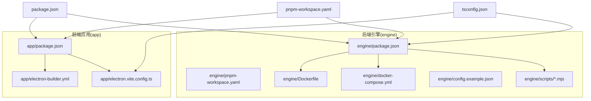
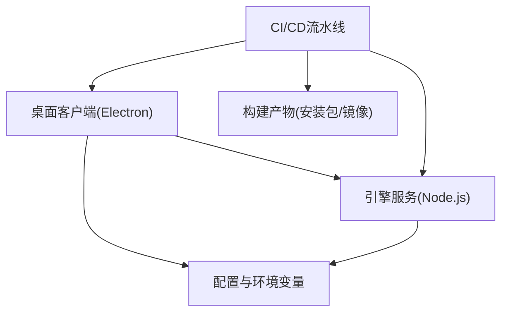
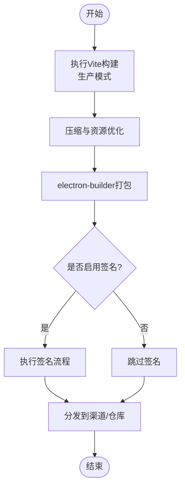
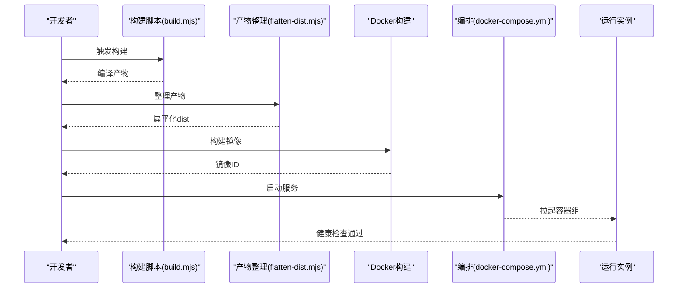
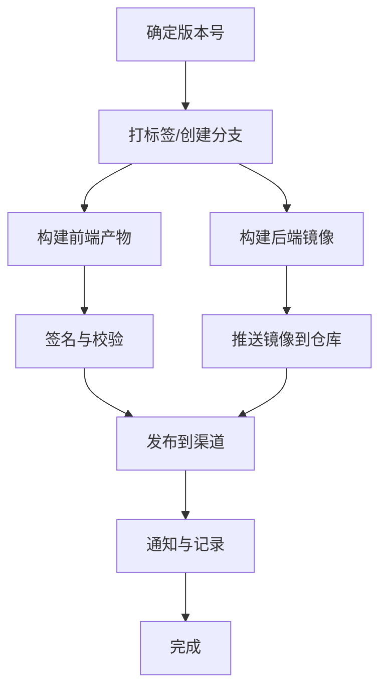
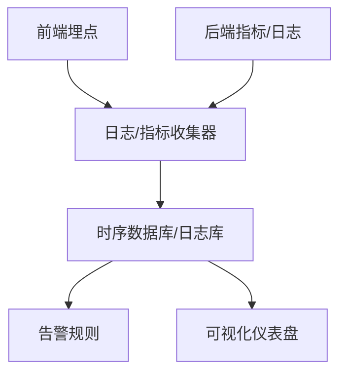
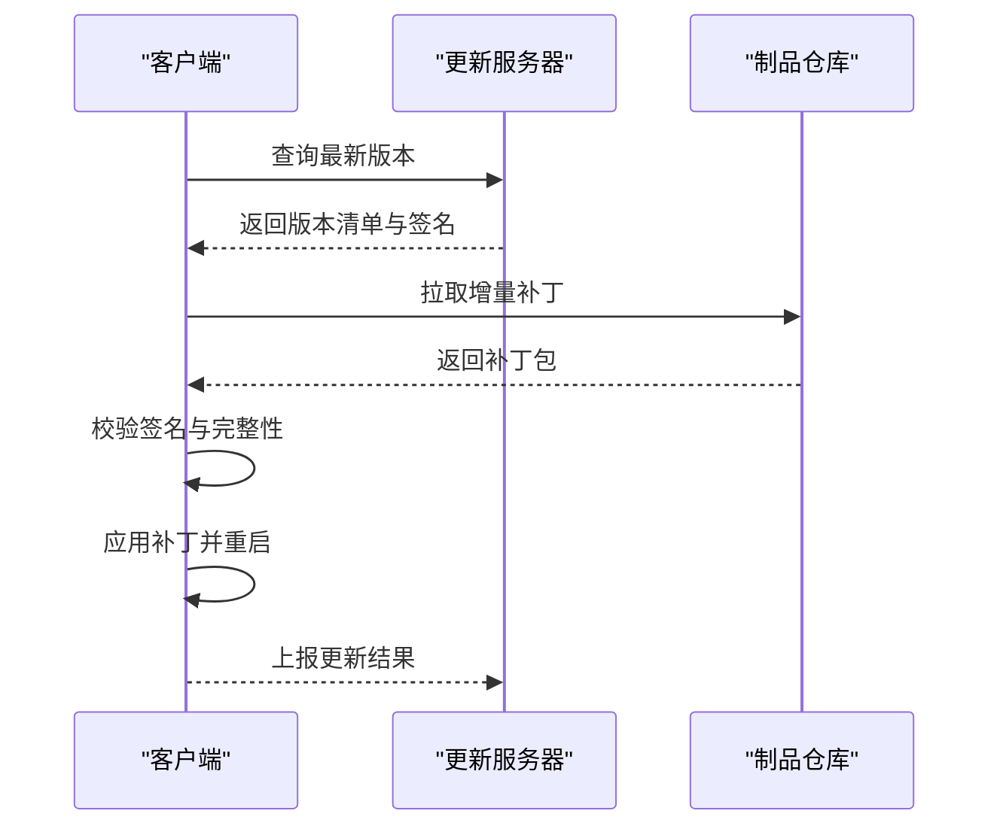
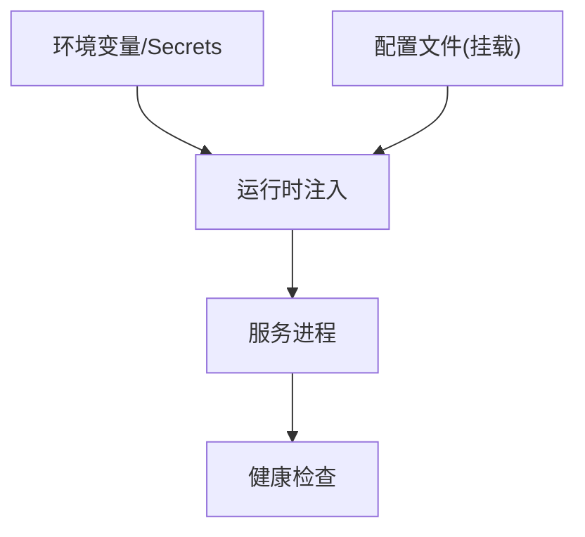
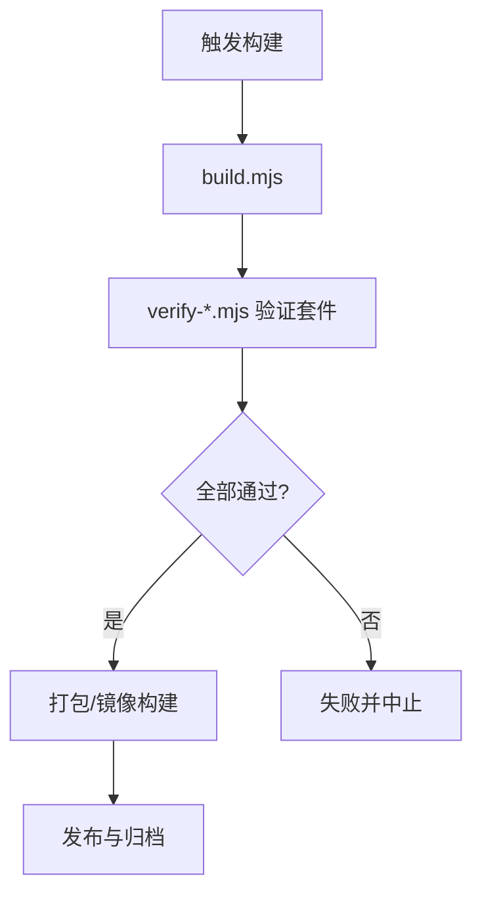
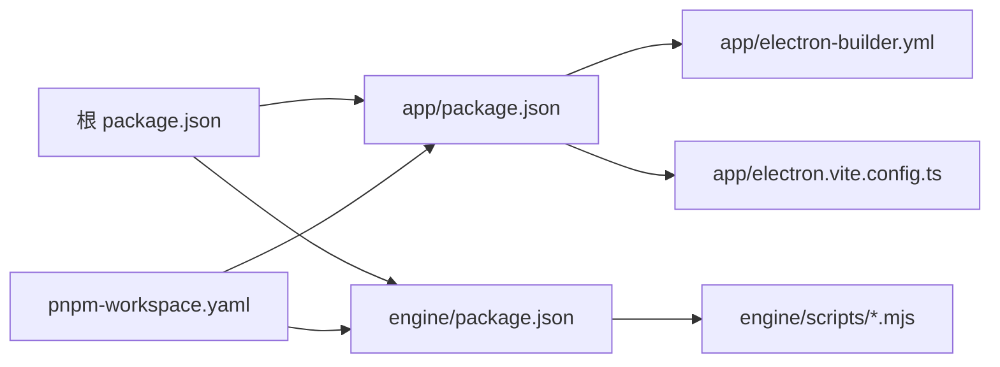

# 部署运维

<cite>
**本文引用的文件**   
- [app/electron-builder.yml](file://app/electron-builder.yml)
- [app/electron.vite.config.ts](file://app/electron.vite.config.ts)
- [app/package.json](file://app/package.json)
- [engine/Dockerfile](file://engine/Dockerfile)
- [engine/docker-compose.yml](file://engine/docker-compose.yml)
- [engine/config.example.json](file://engine/config.example.json)
- [engine/scripts/build.mjs](file://engine/scripts/build.mjs)
- [engine/scripts/flatten-dist.mjs](file://engine/scripts/flatten-dist.mjs)
- [engine/scripts/migrate-packages.mjs](file://engine/scripts/migrate-packages.mjs)
- [engine/scripts/scaffold-packages.mjs](file://engine/scripts/scaffold-packages.mjs)
- [engine/scripts/verify-core-sync.mjs](file://engine/scripts/verify-core-sync.mjs)
- [engine/scripts/verify-crash-recovery.mjs](file://engine/scripts/verify-crash-recovery.mjs)
- [engine/scripts/verify-evented-a2a.mjs](file://engine/scripts/verify-evented-a2a.mjs)
- [engine/scripts/verify-sqlite.mjs](file://engine/scripts/verify-sqlite.mjs)
- [engine/scripts/transcript-diff.mjs](file://engine/scripts/transcript-diff.mjs)
- [engine/package.json](file://engine/package.json)
- [engine/pnpm-workspace.yaml](file://engine/pnpm-workspace.yaml)
- [engine/tsconfig.json](file://engine/tsconfig.json)
- [engine/vitest.config.ts](file://engine/vitest.config.ts)
- [package.json](file://package.json)
- [pnpm-workspace.yaml](file://pnpm-workspace.yaml)
- [tsconfig.json](file://tsconfig.json)
</cite>

## 目录
1. [简介](#简介)
2. [项目结构](#项目结构)
3. [核心组件](#核心组件)
4. [架构总览](#架构总览)
5. [详细组件分析](#详细组件分析)
6. [依赖分析](#依赖分析)
7. [性能考虑](#性能考虑)
8. [故障排查指南](#故障排查指南)
9. [结论](#结论)
10. [附录](#附录)

## 简介
本文件面向KCoder项目的运维与发布团队，覆盖构建配置、多平台打包、代码压缩与资源优化、版本管理与签名校验、Docker容器化与服务编排、监控告警、更新机制（自动/增量/回滚）、生产环境配置管理、容量规划与性能调优、安全加固、灾备与恢复以及自动化脚本与工具链等主题。文档以仓库现有构建与工程配置为依据，给出可落地的流程建议与最佳实践。

## 项目结构
KCoder采用前后端分离的Monorepo结构：
- app：基于Electron的前端应用，使用Vite进行构建，electron-builder负责桌面端打包与分发。
- engine：后端引擎服务，提供Node.js运行时能力，包含Dockerfile与docker-compose用于容器化部署，并提供一系列构建与验证脚本。

图表来源
- [app/package.json](file://app/package.json)
- [app/electron-builder.yml](file://app/electron-builder.yml)
- [app/electron.vite.config.ts](file://app/electron.vite.config.ts)
- [engine/package.json](file://engine/package.json)
- [engine/pnpm-workspace.yaml](file://engine/pnpm-workspace.yaml)
- [engine/Dockerfile](file://engine/Dockerfile)
- [engine/docker-compose.yml](file://engine/docker-compose.yml)
- [engine/config.example.json](file://engine/config.example.json)
- [engine/scripts/build.mjs](file://engine/scripts/build.mjs)
- [package.json](file://package.json)
- [pnpm-workspace.yaml](file://pnpm-workspace.yaml)
- [tsconfig.json](file://tsconfig.json)

章节来源
- [package.json](file://package.json)
- [pnpm-workspace.yaml](file://pnpm-workspace.yaml)
- [tsconfig.json](file://tsconfig.json)
- [app/package.json](file://app/package.json)
- [app/electron-builder.yml](file://app/electron-builder.yml)
- [app/electron.vite.config.ts](file://app/electron.vite.config.ts)
- [engine/package.json](file://engine/package.json)
- [engine/pnpm-workspace.yaml](file://engine/pnpm-workspace.yaml)
- [engine/Dockerfile](file://engine/Dockerfile)
- [engine/docker-compose.yml](file://engine/docker-compose.yml)
- [engine/config.example.json](file://engine/config.example.json)
- [engine/scripts/build.mjs](file://engine/scripts/build.mjs)

## 核心组件
- 前端构建与打包
  - Vite构建配置：定义开发/生产构建行为、插件与输出产物。
  - electron-builder配置：定义多平台打包目标、图标、签名、渠道与产物命名规则。
  - 包脚本：封装构建、预览、打包命令，便于本地与CI执行。
- 后端引擎构建与容器化
  - 工作区与脚本：通过workspace与scripts实现多包构建、产物整理与测试验证。
  - Docker镜像：提供多阶段构建与最小化运行镜像。
  - 服务编排：docker-compose定义服务、端口映射、环境变量与数据卷。
  - 示例配置：提供默认配置模板，指导生产环境参数注入。

章节来源
- [app/electron.vite.config.ts](file://app/electron.vite.config.ts)
- [app/electron-builder.yml](file://app/electron-builder.yml)
- [app/package.json](file://app/package.json)
- [engine/package.json](file://engine/package.json)
- [engine/pnpm-workspace.yaml](file://engine/pnpm-workspace.yaml)
- [engine/Dockerfile](file://engine/Dockerfile)
- [engine/docker-compose.yml](file://engine/docker-compose.yml)
- [engine/config.example.json](file://engine/config.example.json)
- [engine/scripts/build.mjs](file://engine/scripts/build.mjs)

## 架构总览
KCoder由“桌面客户端 + 引擎服务”组成。桌面端通过Electron运行，内部集成或调用引擎服务；引擎服务以Node.js进程运行，支持容器化部署。

[此图为概念性架构图，不直接映射具体源码文件]

## 详细组件分析

### 前端构建与打包（Electron + Vite）
- 构建入口与产物
  - Vite配置文件定义构建模式、插件链与输出目录，影响最终打包体积与加载性能。
  - electron-builder根据YAML配置生成各平台安装包，并支持签名与渠道分发。
- 多平台打包
  - 通过electron-builder配置指定目标平台（Windows/macOS/Linux），统一产物命名与元数据。
- 代码压缩与资源优化
  - 在生产模式下启用压缩与Tree Shaking，减少JS/CSS体积。
  - 静态资源按需加载与缓存策略，结合浏览器/系统缓存提升首屏性能。
- 版本号与签名
  - 版本号来源于包描述或构建时注入，确保与制品一致。
  - 签名配置在打包器中声明，配合密钥库完成可信发布。
- 渠道分发
  - 按平台与架构产出不同通道包，便于灰度与A/B测试。

图表来源
- [app/electron.vite.config.ts](file://app/electron.vite.config.ts)
- [app/electron-builder.yml](file://app/electron-builder.yml)
- [app/package.json](file://app/package.json)

章节来源
- [app/electron.vite.config.ts](file://app/electron.vite.config.ts)
- [app/electron-builder.yml](file://app/electron-builder.yml)
- [app/package.json](file://app/package.json)

### 后端引擎构建与容器化
- 构建与产物整理
  - 使用工作区脚本聚合多包构建，并通过专用脚本将产物扁平化，便于打包与部署。
- Docker镜像构建
  - 多阶段构建分离依赖安装与运行环境，减小镜像体积。
  - 暴露必要端口，挂载配置与数据卷，支持热重载或外部配置注入。
- 服务编排
  - docker-compose定义服务、网络、端口映射、环境变量与持久化存储。
- 配置管理
  - 提供示例配置文件，生产环境通过环境变量或挂载文件覆盖默认值。

图表来源
- [engine/scripts/build.mjs](file://engine/scripts/build.mjs)
- [engine/scripts/flatten-dist.mjs](file://engine/scripts/flatten-dist.mjs)
- [engine/Dockerfile](file://engine/Dockerfile)
- [engine/docker-compose.yml](file://engine/docker-compose.yml)

章节来源
- [engine/scripts/build.mjs](file://engine/scripts/build.mjs)
- [engine/scripts/flatten-dist.mjs](file://engine/scripts/flatten-dist.mjs)
- [engine/Dockerfile](file://engine/Dockerfile)
- [engine/docker-compose.yml](file://engine/docker-compose.yml)
- [engine/config.example.json](file://engine/config.example.json)
- [engine/package.json](file://engine/package.json)
- [engine/pnpm-workspace.yaml](file://engine/pnpm-workspace.yaml)

### 版本管理与发布流程
- 版本号管理
  - 前端：版本号来源于包描述或构建注入，确保安装包与制品一致。
  - 后端：镜像标签与制品名携带版本信息，便于追踪与回滚。
- 签名与校验
  - 桌面端安装包启用签名，发布前进行完整性校验。
  - 镜像层与制品哈希记录，供下载后校验。
- 渠道分发
  - 按平台/架构产出不同通道包，支持灰度与回滚。
  - 制品仓库管理版本快照与稳定版分支。

[此图为概念性流程图，不直接映射具体源码文件]

### 监控告警系统
- 指标采集
  - 在服务侧暴露关键指标（请求量、错误率、延迟、资源使用）。
  - 前端埋点收集用户行为与异常上报。
- 日志收集
  - 结构化日志输出至标准输出，由容器日志驱动收集。
  - 集中式日志平台进行检索与分析。
- 错误追踪
  - 捕获未处理异常与边界错误，附带上下文信息。
  - 建立错误分级与告警阈值。
- 可视化与告警
  - 仪表盘展示核心指标，设置阈值触发告警。
  - 多渠道通知（邮件、IM、短信）。

[此图为概念性架构图，不直接映射具体源码文件]

### 更新机制（自动/增量/回滚）
- 自动更新
  - 客户端定时检查新版本，拉取差异包并静默安装。
  - 服务端提供版本清单与签名校验接口。
- 增量更新
  - 计算差异补丁，仅传输变更部分，降低带宽与时间成本。
- 回滚策略
  - 保留上一稳定版本，出现异常快速切换。
  - 灰度发布与流量切分，逐步放量。

[此图为概念性序列图，不直接映射具体源码文件]

### 生产环境配置管理
- 环境变量
  - 通过容器环境变量注入敏感信息与运行时开关。
  - 区分开发、预发、生产环境配置集。
- 配置文件
  - 使用示例配置作为基线，生产环境通过挂载文件或ConfigMap覆盖。
- 密钥管理
  - 使用密钥管理服务或平台原生Secrets，避免硬编码。
  - 定期轮换与访问审计。

[此图为概念性流程图，不直接映射具体源码文件]

### 运维最佳实践
- 容量规划
  - 基于峰值QPS与CPU/内存占用估算节点数与规格。
  - 预留扩容缓冲，支持水平扩展。
- 性能调优
  - 调整连接池、线程池与GC参数。
  - 开启HTTP/2与Gzip/Brotli压缩。
- 故障恢复
  - 健康检查与自愈重启。
  - 优雅停机与限流降级。

[本节为通用指导，不直接分析具体文件]

### 安全加固措施
- 网络安全
  - 最小权限原则，限制入站端口与出站域名。
  - 使用TLS终止与证书轮换。
- 数据加密
  - 传输加密与静态数据加密。
  - 敏感字段脱敏与最小可见性。
- 访问控制
  - 身份认证与授权，细粒度权限控制。
  - 审计日志与操作留痕。

[本节为通用指导，不直接分析具体文件]

### 灾备方案与灾难恢复
- 备份策略
  - 定期全量与增量备份，异地容灾。
  - 备份数据加密与完整性校验。
- 恢复演练
  - 制定RTO/RPO目标，定期演练恢复流程。
  - 自动化恢复脚本与一键切换。

[本节为通用指导，不直接分析具体文件]

### 运维自动化脚本与工具链
- 构建与验证脚本
  - 构建脚本：聚合多包构建与产物准备。
  - 产物整理：将分散产物合并为可部署形态。
  - 迁移与脚手架：辅助包初始化与迁移任务。
  - 验证脚本：核心同步、崩溃恢复、事件循环、SQLite等关键路径验证。
- 测试与质量门禁
  - 单元测试与集成测试，失败阻断发布。
  - 覆盖率与静态检查要求。

图表来源
- [engine/scripts/build.mjs](file://engine/scripts/build.mjs)
- [engine/scripts/verify-core-sync.mjs](file://engine/scripts/verify-core-sync.mjs)
- [engine/scripts/verify-crash-recovery.mjs](file://engine/scripts/verify-crash-recovery.mjs)
- [engine/scripts/verify-evented-a2a.mjs](file://engine/scripts/verify-evented-a2a.mjs)
- [engine/scripts/verify-sqlite.mjs](file://engine/scripts/verify-sqlite.mjs)
- [engine/scripts/flatten-dist.mjs](file://engine/scripts/flatten-dist.mjs)
- [engine/scripts/migrate-packages.mjs](file://engine/scripts/migrate-packages.mjs)
- [engine/scripts/scaffold-packages.mjs](file://engine/scripts/scaffold-packages.mjs)
- [engine/scripts/transcript-diff.mjs](file://engine/scripts/transcript-diff.mjs)

章节来源
- [engine/scripts/build.mjs](file://engine/scripts/build.mjs)
- [engine/scripts/flatten-dist.mjs](file://engine/scripts/flatten-dist.mjs)
- [engine/scripts/migrate-packages.mjs](file://engine/scripts/migrate-packages.mjs)
- [engine/scripts/scaffold-packages.mjs](file://engine/scripts/scaffold-packages.mjs)
- [engine/scripts/verify-core-sync.mjs](file://engine/scripts/verify-core-sync.mjs)
- [engine/scripts/verify-crash-recovery.mjs](file://engine/scripts/verify-crash-recovery.mjs)
- [engine/scripts/verify-evented-a2a.mjs](file://engine/scripts/verify-evented-a2a.mjs)
- [engine/scripts/verify-sqlite.mjs](file://engine/scripts/verify-sqlite.mjs)
- [engine/scripts/transcript-diff.mjs](file://engine/scripts/transcript-diff.mjs)

## 依赖分析
- Monorepo与工作区
  - 根级与子模块均定义包与工作区，统一依赖管理与构建。
- 前端依赖
  - Electron生态与Vite构建链，依赖打包器与插件体系。
- 后端依赖
  - Node.js运行时与多包工作区，脚本驱动构建与验证。

图表来源
- [package.json](file://package.json)
- [pnpm-workspace.yaml](file://pnpm-workspace.yaml)
- [app/package.json](file://app/package.json)
- [app/electron-builder.yml](file://app/electron-builder.yml)
- [app/electron.vite.config.ts](file://app/electron.vite.config.ts)
- [engine/package.json](file://engine/package.json)
- [engine/scripts/build.mjs](file://engine/scripts/build.mjs)

章节来源
- [package.json](file://package.json)
- [pnpm-workspace.yaml](file://pnpm-workspace.yaml)
- [app/package.json](file://app/package.json)
- [engine/package.json](file://engine/package.json)

## 性能考虑
- 前端
  - 启用生产压缩与懒加载，减少首屏体积。
  - 静态资源缓存与CDN加速。
- 后端
  - 合理设置并发与连接池，避免资源争用。
  - 日志采样与异步写入，降低I/O开销。
- 容器
  - 镜像分层优化，复用基础镜像层。
  - 资源限制与弹性伸缩。

[本节为通用指导，不直接分析具体文件]

## 故障排查指南
- 构建失败
  - 检查工作区依赖与脚本执行顺序。
  - 查看构建日志定位缺失依赖或路径问题。
- 打包失败
  - 确认签名配置与密钥可用。
  - 检查平台特定依赖与权限。
- 服务不可用
  - 检查健康检查与端口占用。
  - 查看容器日志与指标异常。
- 版本不一致
  - 核对制品标签与运行镜像版本。
  - 确认配置与环境变量生效。

章节来源
- [engine/scripts/build.mjs](file://engine/scripts/build.mjs)
- [engine/Dockerfile](file://engine/Dockerfile)
- [engine/docker-compose.yml](file://engine/docker-compose.yml)
- [app/electron-builder.yml](file://app/electron-builder.yml)

## 结论
通过对KCoder的构建、打包、容器化与脚本体系的梳理，可以形成标准化的发布与运维流程。建议在CI中固化构建与验证步骤，完善监控与告警，落实安全与灾备策略，持续优化性能与稳定性。

[本节为总结性内容，不直接分析具体文件]

## 附录
- 常用命令参考
  - 前端构建与打包：参考前端包脚本。
  - 后端构建与镜像：参考后端包脚本与Dockerfile。
  - 服务编排：参考docker-compose配置。
- 配置清单
  - 环境变量与配置文件项，参考示例配置与编排文件。

章节来源
- [app/package.json](file://app/package.json)
- [engine/package.json](file://engine/package.json)
- [engine/Dockerfile](file://engine/Dockerfile)
- [engine/docker-compose.yml](file://engine/docker-compose.yml)
- [engine/config.example.json](file://engine/config.example.json)