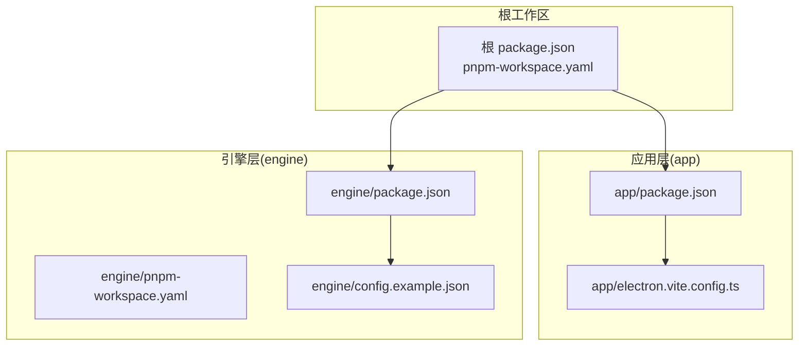
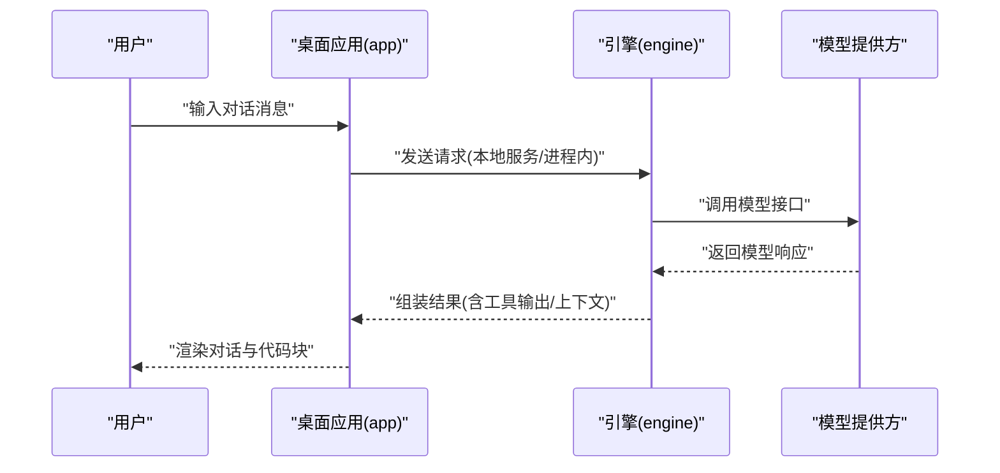
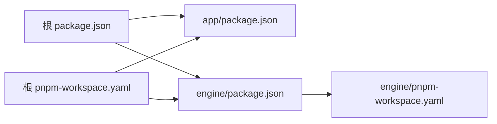

# 快速开始

<cite>
**本文引用的文件**   
- [package.json](file://package.json)
- [pnpm-workspace.yaml](file://pnpm-workspace.yaml)
- [tsconfig.json](file://tsconfig.json)
- [app/package.json](file://app/package.json)
- [app/electron.vite.config.ts](file://app/electron.vite.config.ts)
- [engine/package.json](file://engine/package.json)
- [engine/pnpm-workspace.yaml](file://engine/pnpm-workspace.yaml)
- [engine/config.example.json](file://engine/config.example.json)
- [engine/README.md](file://engine/README.md)
</cite>

## 目录
1. [简介](#简介)
2. [项目结构](#项目结构)
3. [核心组件](#核心组件)
4. [架构总览](#架构总览)
5. [详细组件分析](#详细组件分析)
6. [依赖分析](#依赖分析)
7. [性能考虑](#性能考虑)
8. [故障排除指南](#故障排除指南)
9. [结论](#结论)
10. [附录](#附录)

## 简介
本指南面向首次接触 KCoder 的用户，帮助你在最短时间内完成环境准备、克隆与安装、配置与启动，并通过一个简单示例体验 AI 对话能力。KCoder 采用多包工作区（Monorepo）组织，包含前端桌面应用（Electron + Vite + React）与后端引擎（Engine），两者通过进程内或本地服务方式协作。

## 项目结构
仓库为顶层 Monorepo，使用 pnpm workspace 管理多个子包：
- app：桌面端渲染层与 Electron 主进程入口，基于 Vite 构建，提供聊天面板、设置面板等 UI。
- engine：AI 引擎核心，提供模型适配、工具执行、会话管理等能力，并附带示例配置与脚本。

图表来源
- [package.json:1-200](file://package.json#L1-L200)
- [pnpm-workspace.yaml:1-200](file://pnpm-workspace.yaml#L1-L200)
- [app/package.json:1-200](file://app/package.json#L1-L200)
- [app/electron.vite.config.ts:1-200](file://app/electron.vite.config.ts#L1-L200)
- [engine/package.json:1-200](file://engine/package.json#L1-L200)
- [engine/pnpm-workspace.yaml:1-200](file://engine/pnpm-workspace.yaml#L1-L200)
- [engine/config.example.json:1-200](file://engine/config.example.json#L1-L200)

章节来源
- [package.json:1-200](file://package.json#L1-L200)
- [pnpm-workspace.yaml:1-200](file://pnpm-workspace.yaml#L1-L200)
- [app/package.json:1-200](file://app/package.json#L1-L200)
- [engine/package.json:1-200](file://engine/package.json#L1-L200)
- [engine/pnpm-workspace.yaml:1-200](file://engine/pnpm-workspace.yaml#L1-L200)

## 核心组件
- 应用层（app）
  - 使用 electron-vite 进行开发构建与打包，提供 Electron 主进程与渲染进程。
  - 提供聊天面板、代码块渲染、状态栏等 UI 组件。
- 引擎层（engine）
  - 提供 AI 推理编排、工具调用、技能（skills）、HTTP 服务等能力。
  - 提供示例配置文件与测试套件，便于本地验证与扩展。

章节来源
- [app/electron.vite.config.ts:1-200](file://app/electron.vite.config.ts#L1-L200)
- [engine/README.md:1-200](file://engine/README.md#L1-L200)

## 架构总览
下图展示了从用户交互到 AI 响应的整体流程：用户在桌面应用中输入消息，应用将请求转发至引擎，引擎协调模型与工具生成结果后返回给前端展示。

图表来源
- [app/electron.vite.config.ts:1-200](file://app/electron.vite.config.ts#L1-L200)
- [engine/README.md:1-200](file://engine/README.md#L1-L200)

## 详细组件分析

### 环境与依赖准备
- Node.js 版本要求
  - 请查看根与工作区配置以确认当前推荐的 Node.js 版本范围。
- 安装 pnpm
  - 建议使用 pnpm 作为包管理器，确保与 pnpm-lock.yaml 一致。
- 全局依赖
  - 若需要构建或运行引擎的特定系统依赖，请参考引擎 README 中的说明。

章节来源
- [package.json:1-200](file://package.json#L1-L200)
- [pnpm-workspace.yaml:1-200](file://pnpm-workspace.yaml#L1-L200)
- [engine/README.md:1-200](file://engine/README.md#L1-L200)

### 克隆与安装
- 克隆仓库
  - 使用 Git 将仓库克隆到本地。
- 安装依赖
  - 在仓库根目录执行 pnpm 安装命令，自动解析顶层与子包的工作区依赖。
- 初始化 TypeScript 配置
  - 根目录 tsconfig.json 定义了跨包的编译选项，无需额外操作即可使用。

章节来源
- [package.json:1-200](file://package.json#L1-L200)
- [pnpm-workspace.yaml:1-200](file://pnpm-workspace.yaml#L1-L200)
- [tsconfig.json:1-200](file://tsconfig.json#L1-L200)

### 引擎配置
- 复制示例配置
  - 将 engine/config.example.json 复制为实际配置文件（例如 config.json），并按需填写模型 API Key、地址等参数。
- 校验配置
  - 参考引擎 README 中的“配置”章节，了解各字段含义与必填项。

章节来源
- [engine/config.example.json:1-200](file://engine/config.example.json#L1-L200)
- [engine/README.md:1-200](file://engine/README.md#L1-L200)

### 启动开发环境
- 启动应用（Electron + Vite）
  - 在根目录执行开发命令，通常由根 package.json 的 scripts 定义；也可进入 app 子包执行其开发命令。
- 启动引擎
  - 在 engine 子包中执行对应的开发或启动命令，确保本地服务可用。
- 联调
  - 应用默认会连接本地引擎服务，若端口不一致，请在应用侧配置中调整。

章节来源
- [package.json:1-200](file://package.json#L1-L200)
- [app/package.json:1-200](file://app/package.json#L1-L200)
- [engine/package.json:1-200](file://engine/package.json#L1-L200)

### 启动生产环境
- 构建产物
  - 在根目录执行构建命令，生成 app 与 engine 的发布包。
- 打包桌面应用
  - 使用 electron-builder 进行打包（配置位于 app/electron-builder.yml）。
- 运行
  - 运行打包后的可执行程序，或通过引擎提供的发布脚本启动服务。

章节来源
- [package.json:1-200](file://package.json#L1-L200)
- [app/electron.vite.config.ts:1-200](file://app/electron.vite.config.ts#L1-L200)
- [engine/package.json:1-200](file://engine/package.json#L1-L200)

### 第一个 AI 对话示例
- 前置条件
  - 已完成环境准备、依赖安装与引擎配置。
- 操作步骤
  - 启动引擎服务。
  - 启动桌面应用。
  - 在聊天面板中输入一条简短消息（如“你好，帮我写一段排序算法”）。
  - 观察引擎返回的文本与代码块渲染效果。
- 预期结果
  - 应用成功显示模型回复，并在聊天界面中呈现结构化内容。

章节来源
- [engine/README.md:1-200](file://engine/README.md#L1-L200)
- [app/electron.vite.config.ts:1-200](file://app/electron.vite.config.ts#L1-L200)

## 依赖分析
- 顶层工作区
  - 根 package.json 与 pnpm-workspace.yaml 声明了所有子包路径，统一安装与脚本入口。
- 应用依赖
  - app/package.json 包含 Electron、Vite、React 等相关依赖与构建脚本。
- 引擎依赖
  - engine/package.json 与 engine/pnpm-workspace.yaml 管理引擎内部子包与脚本。

图表来源
- [package.json:1-200](file://package.json#L1-L200)
- [pnpm-workspace.yaml:1-200](file://pnpm-workspace.yaml#L1-L200)
- [app/package.json:1-200](file://app/package.json#L1-L200)
- [engine/package.json:1-200](file://engine/package.json#L1-L200)
- [engine/pnpm-workspace.yaml:1-200](file://engine/pnpm-workspace.yaml#L1-L200)

章节来源
- [package.json:1-200](file://package.json#L1-L200)
- [pnpm-workspace.yaml:1-200](file://pnpm-workspace.yaml#L1-L200)
- [app/package.json:1-200](file://app/package.json#L1-L200)
- [engine/package.json:1-200](file://engine/package.json#L1-L200)
- [engine/pnpm-workspace.yaml:1-200](file://engine/pnpm-workspace.yaml#L1-L200)

## 性能考虑
- 合理设置并发与缓存
  - 使用 pnpm 的缓存机制加速依赖安装；必要时调整并行度。
- 按需启用功能
  - 在生产环境中关闭不必要的调试日志与热重载，减少资源占用。
- 模型调用优化
  - 根据场景选择合适的模型与参数，避免过长的上下文导致延迟上升。

[本节为通用建议，不直接分析具体文件]

## 故障排除指南
- 无法找到 Node.js 或版本不匹配
  - 检查当前 Node.js 版本是否符合工作区要求；必要时使用 nvm 切换版本。
- pnpm 安装失败
  - 清理缓存并重试；确认网络可达与镜像源配置正确。
- 引擎启动失败
  - 检查 engine/config.example.json 复制后的配置文件是否完整；核对模型 API Key 与地址。
- 应用无法连接引擎
  - 确认引擎服务已启动且端口与应用的配置一致；检查防火墙与安全软件拦截。
- 构建或打包报错
  - 查看对应子包的错误日志；确保系统级依赖已安装；尝试删除 node_modules 与锁文件后重装。

章节来源
- [engine/README.md:1-200](file://engine/README.md#L1-L200)
- [engine/config.example.json:1-200](file://engine/config.example.json#L1-L200)

## 结论
通过以上步骤，你应能顺利完成 KCoder 的环境准备、安装与启动，并体验一次完整的 AI 对话。建议在后续使用中逐步熟悉引擎的配置与扩展点，结合团队规范制定最佳实践。

[本节为总结性内容，不直接分析具体文件]

## 附录
- 常用命令速查
  - 安装依赖：在根目录执行 pnpm install。
  - 启动开发：在根目录或 app/engine 子包执行对应开发脚本。
  - 构建与打包：在根目录执行构建脚本，随后按提示运行打包命令。
- 参考文档
  - 引擎 README 提供了更详细的配置与使用说明，建议优先阅读。

章节来源
- [package.json:1-200](file://package.json#L1-L200)
- [engine/README.md:1-200](file://engine/README.md#L1-L200)