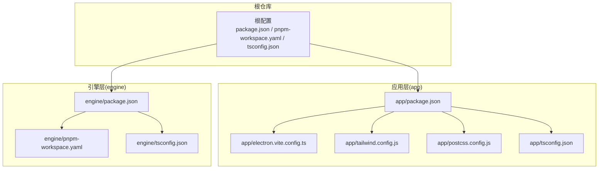
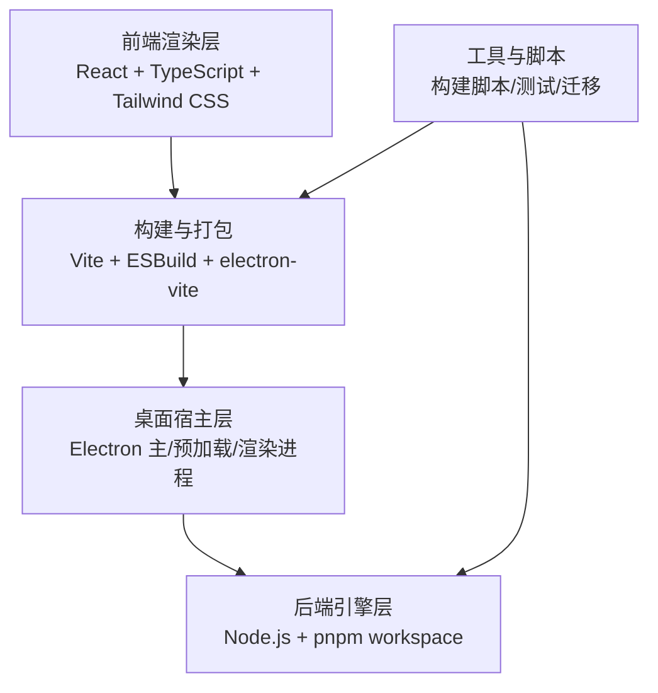
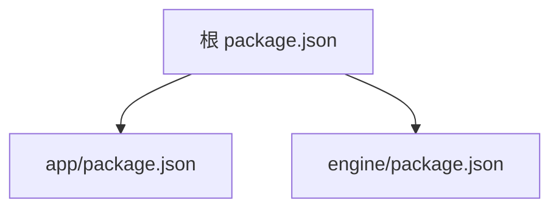

# 技术栈

<cite>
**本文引用的文件**   
- [package.json](file://package.json)
- [pnpm-workspace.yaml](file://pnpm-workspace.yaml)
- [tsconfig.json](file://tsconfig.json)
- [app/package.json](file://app/package.json)
- [app/electron.vite.config.ts](file://app/electron.vite.config.ts)
- [app/tailwind.config.js](file://app/tailwind.config.js)
- [app/postcss.config.js](file://app/postcss.config.js)
- [app/tsconfig.json](file://app/tsconfig.json)
- [engine/package.json](file://engine/package.json)
- [engine/pnpm-workspace.yaml](file://engine/pnpm-workspace.yaml)
- [engine/tsconfig.json](file://engine/tsconfig.json)
</cite>

## 目录
1. [简介](#简介)
2. [项目结构](#项目结构)
3. [核心组件](#核心组件)
4. [架构总览](#架构总览)
5. [详细组件分析](#详细组件分析)
6. [依赖分析](#依赖分析)
7. [性能考量](#性能考量)
8. [故障排查指南](#故障排查指南)
9. [结论](#结论)
10. [附录](#附录)

## 简介
本章节面向KCoder项目的技术栈说明，聚焦于前端、桌面应用框架、构建工具与后端引擎等核心技术选型，解释其优势与适用性；同时阐述Monorepo架构的优势与管理策略，给出版本兼容性要求、依赖管理策略与技术债务建议，并提供技术架构图以展示各组件的层次关系与交互模式。

## 项目结构
KCoder采用顶层Monorepo组织方式，包含两个主要子工程：
- app：基于Electron + Vite的前端渲染进程与主进程工程，使用React + TypeScript + Tailwind CSS进行UI开发。
- engine：基于Node.js的后端引擎工程，内部通过pnpm workspace进一步拆分为多个packages，形成领域分层与能力扩展体系。

图表来源
- [package.json:1-200](file://package.json#L1-L200)
- [pnpm-workspace.yaml:1-200](file://pnpm-workspace.yaml#L1-L200)
- [tsconfig.json:1-200](file://tsconfig.json#L1-L200)
- [app/package.json:1-200](file://app/package.json#L1-L200)
- [app/electron.vite.config.ts:1-200](file://app/electron.vite.config.ts#L1-L200)
- [app/tailwind.config.js:1-200](file://app/tailwind.config.js#L1-L200)
- [app/postcss.config.js:1-200](file://app/postcss.config.js#L1-L200)
- [app/tsconfig.json:1-200](file://app/tsconfig.json#L1-L200)
- [engine/package.json:1-200](file://engine/package.json#L1-L200)
- [engine/pnpm-workspace.yaml:1-200](file://engine/pnpm-workspace.yaml#L1-L200)
- [engine/tsconfig.json:1-200](file://engine/tsconfig.json#L1-L200)

章节来源
- [package.json:1-200](file://package.json#L1-L200)
- [pnpm-workspace.yaml:1-200](file://pnpm-workspace.yaml#L1-L200)
- [tsconfig.json:1-200](file://tsconfig.json#L1-L200)
- [app/package.json:1-200](file://app/package.json#L1-L200)
- [engine/package.json:1-200](file://engine/package.json#L1-L200)

## 核心组件
本节从技术栈维度对关键组件进行说明，并给出选择理由与优势。

- 前端技术栈（React + TypeScript + Tailwind CSS）
  - React提供声明式UI与生态成熟度，适合复杂交互界面。
  - TypeScript增强类型安全与可维护性，提升大型工程协作效率。
  - Tailwind CSS以原子化样式方案提高开发效率与一致性，配合PostCSS实现按需优化。
  - 参考路径：[app/package.json](file://app/package.json)、[app/tailwind.config.js](file://app/tailwind.config.js)、[app/postcss.config.js](file://app/postcss.config.js)

- 桌面应用框架（Electron）
  - Electron将Web技术与原生能力结合，便于复用Web前端代码并访问系统资源。
  - 参考路径：[app/package.json](file://app/package.json)

- 构建工具（Vite + ESBuild）
  - Vite作为现代构建器，具备快速冷启动与热更新能力；ESBuild用于极速打包与转换。
  - Electron集成通过electron-vite配置驱动多进程构建。
  - 参考路径：[app/electron.vite.config.ts](file://app/electron.vite.config.ts)、[app/package.json](file://app/package.json)

- 后端引擎（Node.js）
  - Node.js提供高性能I/O与丰富的NPM生态，适合服务端逻辑与工具链。
  - 引擎内部采用pnpm workspace进行多包管理，支持模块化与领域分层。
  - 参考路径：[engine/package.json](file://engine/package.json)、[engine/pnpm-workspace.yaml](file://engine/pnpm-workspace.yaml)

- Monorepo架构（pnpm workspaces）
  - 统一依赖管理、共享脚本与跨包引用，提升团队协作与发布流程一致性。
  - 参考路径：[pnpm-workspace.yaml](file://pnpm-workspace.yaml)、[engine/pnpm-workspace.yaml](file://engine/pnpm-workspace.yaml)

章节来源
- [app/package.json:1-200](file://app/package.json#L1-L200)
- [app/electron.vite.config.ts:1-200](file://app/electron.vite.config.ts#L1-L200)
- [app/tailwind.config.js:1-200](file://app/tailwind.config.js#L1-L200)
- [app/postcss.config.js:1-200](file://app/postcss.config.js#L1-L200)
- [engine/package.json:1-200](file://engine/package.json#L1-L200)
- [engine/pnpm-workspace.yaml:1-200](file://engine/pnpm-workspace.yaml#L1-L200)
- [pnpm-workspace.yaml:1-200](file://pnpm-workspace.yaml#L1-L200)

## 架构总览
下图展示了KCoder的整体技术架构，包括前端渲染层、桌面宿主层、构建链路以及后端引擎层的职责划分与交互关系。

图表来源
- [app/electron.vite.config.ts:1-200](file://app/electron.vite.config.ts#L1-L200)
- [app/package.json:1-200](file://app/package.json#L1-L200)
- [engine/package.json:1-200](file://engine/package.json#L1-L200)

## 详细组件分析

### 前端渲染层（React + TypeScript + Tailwind CSS）
- 角色与职责
  - 负责用户界面与交互逻辑，通过TypeScript保证类型安全，使用Tailwind CSS进行样式管理。
- 关键配置
  - Tailwind与PostCSS配置位于app目录，确保样式编译与优化。
- 典型流程
  - 源码编写 → Vite开发服务器 → 浏览器渲染；生产构建由ESBuild加速打包。
- 参考路径
  - [app/tailwind.config.js](file://app/tailwind.config.js)
  - [app/postcss.config.js](file://app/postcss.config.js)
  - [app/package.json](file://app/package.json)

章节来源
- [app/tailwind.config.js:1-200](file://app/tailwind.config.js#L1-L200)
- [app/postcss.config.js:1-200](file://app/postcss.config.js#L1-L200)
- [app/package.json:1-200](file://app/package.json#L1-L200)

### 桌面宿主层（Electron）
- 角色与职责
  - 提供原生窗口、菜单、文件系统与进程间通信能力，承载渲染进程。
- 构建集成
  - 通过electron-vite协调主进程与渲染进程的构建与运行。
- 参考路径
  - [app/electron.vite.config.ts](file://app/electron.vite.config.ts)
  - [app/package.json](file://app/package.json)

章节来源
- [app/electron.vite.config.ts:1-200](file://app/electron.vite.config.ts#L1-L200)
- [app/package.json:1-200](file://app/package.json#L1-L200)

### 构建工具链（Vite + ESBuild）
- 角色与职责
  - Vite负责开发体验与模块解析，ESBuild负责快速打包与转换。
- 关键特性
  - 增量构建、HMR、插件生态、并行处理。
- 参考路径
  - [app/electron.vite.config.ts](file://app/electron.vite.config.ts)
  - [app/package.json](file://app/package.json)

章节来源
- [app/electron.vite.config.ts:1-200](file://app/electron.vite.config.ts#L1-L200)
- [app/package.json:1-200](file://app/package.json#L1-L200)

### 后端引擎（Node.js + pnpm workspace）
- 角色与职责
  - 提供业务逻辑、服务编排、工具链与可扩展能力；内部按领域分层组织为多个packages。
- 工作区管理
  - 使用pnpm workspace统一管理依赖、脚本与版本，支持跨包引用与独立测试。
- 参考路径
  - [engine/package.json](file://engine/package.json)
  - [engine/pnpm-workspace.yaml](file://engine/pnpm-workspace.yaml)

章节来源
- [engine/package.json:1-200](file://engine/package.json#L1-L200)
- [engine/pnpm-workspace.yaml:1-200](file://engine/pnpm-workspace.yaml#L1-L200)

### Monorepo架构与管理策略
- 优势
  - 统一依赖与版本控制、共享脚本与配置、跨包重构与测试更便捷。
- 管理策略
  - 根级pnpm-workspace定义子工程范围；各子工程保留自身package.json与tsconfig，保持边界清晰。
- 参考路径
  - [pnpm-workspace.yaml](file://pnpm-workspace.yaml)
  - [engine/pnpm-workspace.yaml](file://engine/pnpm-workspace.yaml)
  - [tsconfig.json](file://tsconfig.json)
  - [app/tsconfig.json](file://app/tsconfig.json)
  - [engine/tsconfig.json](file://engine/tsconfig.json)

章节来源
- [pnpm-workspace.yaml:1-200](file://pnpm-workspace.yaml#L1-L200)
- [engine/pnpm-workspace.yaml:1-200](file://engine/pnpm-workspace.yaml#L1-L200)
- [tsconfig.json:1-200](file://tsconfig.json#L1-L200)
- [app/tsconfig.json:1-200](file://app/tsconfig.json#L1-L200)
- [engine/tsconfig.json:1-200](file://engine/tsconfig.json#L1-L200)

## 依赖分析
- 依赖层级
  - 根仓库聚合所有子工程，定义全局脚本与工作区规则。
  - app与engine各自维护依赖与构建配置，避免耦合。
- 外部依赖
  - 前端依赖集中在app/package.json；引擎依赖集中在engine/package.json。
- 参考路径
  - [package.json](file://package.json)
  - [app/package.json](file://app/package.json)
  - [engine/package.json](file://engine/package.json)

图表来源
- [package.json:1-200](file://package.json#L1-L200)
- [app/package.json:1-200](file://app/package.json#L1-L200)
- [engine/package.json:1-200](file://engine/package.json#L1-L200)

章节来源
- [package.json:1-200](file://package.json#L1-L200)
- [app/package.json:1-200](file://app/package.json#L1-L200)
- [engine/package.json:1-200](file://engine/package.json#L1-L200)

## 性能考量
- 构建性能
  - 使用Vite与ESBuild组合，显著提升开发与构建速度；合理拆分包与按需引入可减少体积。
- 运行时性能
  - 前端采用React与Tailwind CSS，注意组件粒度与样式去重；Electron主进程避免阻塞事件循环。
- 引擎性能
  - Node.js I/O密集型任务建议使用异步与非阻塞模型；在engine内通过workspace隔离热点模块，便于单独优化与基准测试。

## 故障排查指南
- 构建问题
  - 检查Vite与electron-vite配置是否正确；确认Tailwind与PostCSS插件顺序与版本兼容。
  - 参考路径：[app/electron.vite.config.ts](file://app/electron.vite.config.ts)、[app/tailwind.config.js](file://app/tailwind.config.js)、[app/postcss.config.js](file://app/postcss.config.js)
- 依赖冲突
  - 使用pnpm校验依赖树；在根或子工程执行依赖安装与锁定文件同步。
  - 参考路径：[pnpm-workspace.yaml](file://pnpm-workspace.yaml)、[engine/pnpm-workspace.yaml](file://engine/pnpm-workspace.yaml)
- 运行时错误
  - 区分渲染进程与主进程日志；在Electron中启用调试端口定位问题。
  - 参考路径：[app/package.json](file://app/package.json)

章节来源
- [app/electron.vite.config.ts:1-200](file://app/electron.vite.config.ts#L1-L200)
- [app/tailwind.config.js:1-200](file://app/tailwind.config.js#L1-L200)
- [app/postcss.config.js:1-200](file://app/postcss.config.js#L1-L200)
- [pnpm-workspace.yaml:1-200](file://pnpm-workspace.yaml#L1-L200)
- [engine/pnpm-workspace.yaml:1-200](file://engine/pnpm-workspace.yaml#L1-L200)
- [app/package.json:1-200](file://app/package.json#L1-L200)

## 结论
KCoder采用现代化的前端与桌面应用技术栈，结合Vite与ESBuild的高效构建链路，以及Node.js后端的灵活扩展能力，形成了清晰的层次结构与良好的可维护性。通过pnpm workspace实现的Monorepo管理策略，提升了团队协作效率与发布一致性。建议在后续迭代中持续完善版本治理与依赖审计，逐步降低技术债务。

## 附录

### 版本兼容性要求
- Node.js
  - 需满足engine与app的最低版本要求，具体以各package.json中的engines字段为准。
  - 参考路径：[engine/package.json](file://engine/package.json)、[app/package.json](file://app/package.json)
- TypeScript
  - 根与子工程的tsconfig应保持一致的target与module设置，避免编译差异。
  - 参考路径：[tsconfig.json](file://tsconfig.json)、[app/tsconfig.json](file://app/tsconfig.json)、[engine/tsconfig.json](file://engine/tsconfig.json)
- 构建工具
  - Vite与electron-vite版本需与Electron主版本匹配，避免API不兼容。
  - 参考路径：[app/electron.vite.config.ts](file://app/electron.vite.config.ts)、[app/package.json](file://app/package.json)

章节来源
- [engine/package.json:1-200](file://engine/package.json#L1-L200)
- [app/package.json:1-200](file://app/package.json#L1-L200)
- [tsconfig.json:1-200](file://tsconfig.json#L1-L200)
- [app/tsconfig.json:1-200](file://app/tsconfig.json#L1-L200)
- [engine/tsconfig.json:1-200](file://engine/tsconfig.json#L1-L200)
- [app/electron.vite.config.ts:1-200](file://app/electron.vite.config.ts#L1-L200)

### 依赖管理策略
- 工作区规则
  - 根pnpm-workspace定义子工程范围；engine内部再按领域拆分packages。
  - 参考路径：[pnpm-workspace.yaml](file://pnpm-workspace.yaml)、[engine/pnpm-workspace.yaml](file://engine/pnpm-workspace.yaml)
- 依赖锁定
  - 使用pnpm-lock.yaml确保一致性与可重现构建。
  - 参考路径：[pnpm-lock.yaml](file://pnpm-lock.yaml)
- 公共依赖
  - 将通用工具与类型定义抽取至共享包，减少重复与维护成本。
  - 参考路径：[engine/package.json](file://engine/package.json)

章节来源
- [pnpm-workspace.yaml:1-200](file://pnpm-workspace.yaml#L1-L200)
- [engine/pnpm-workspace.yaml:1-200](file://engine/pnpm-workspace.yaml#L1-L200)
- [pnpm-lock.yaml:1-200](file://pnpm-lock.yaml#L1-L200)
- [engine/package.json:1-200](file://engine/package.json#L1-L200)

### 技术债务说明与建议
- 配置分散
  - 多配置文件（Vite、Tailwind、PostCSS、TSConfig）需定期对齐，避免漂移。
  - 参考路径：[app/electron.vite.config.ts](file://app/electron.vite.config.ts)、[app/tailwind.config.js](file://app/tailwind.config.js)、[app/postcss.config.js](file://app/postcss.config.js)、[app/tsconfig.json](file://app/tsconfig.json)
- 依赖升级
  - 建立自动化依赖扫描与升级流程，关注安全漏洞与重大变更。
  - 参考路径：[package.json](file://package.json)、[app/package.json](file://app/package.json)、[engine/package.json](file://engine/package.json)
- 文档与规范
  - 补充README与贡献指南，明确编码规范与提交约定，降低协作成本。
  - 参考路径：[engine/README.md](file://engine/README.md)

章节来源
- [app/electron.vite.config.ts:1-200](file://app/electron.vite.config.ts#L1-L200)
- [app/tailwind.config.js:1-200](file://app/tailwind.config.js#L1-L200)
- [app/postcss.config.js:1-200](file://app/postcss.config.js#L1-L200)
- [app/tsconfig.json:1-200](file://app/tsconfig.json#L1-L200)
- [package.json:1-200](file://package.json#L1-L200)
- [app/package.json:1-200](file://app/package.json#L1-L200)
- [engine/package.json:1-200](file://engine/package.json#L1-L200)
- [engine/README.md:1-200](file://engine/README.md#L1-L200)