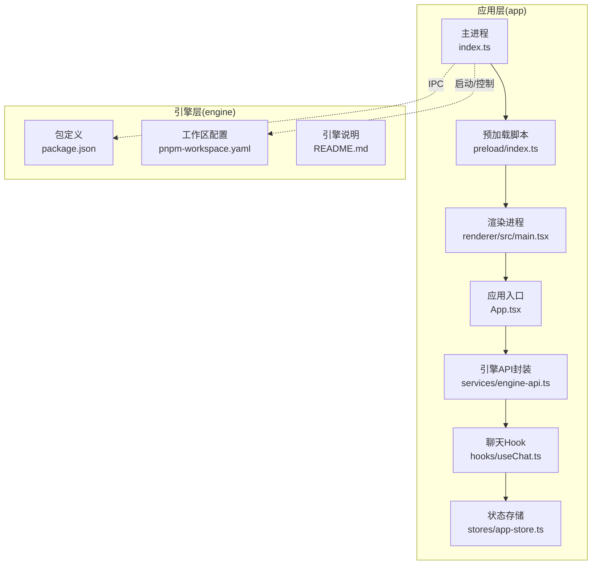
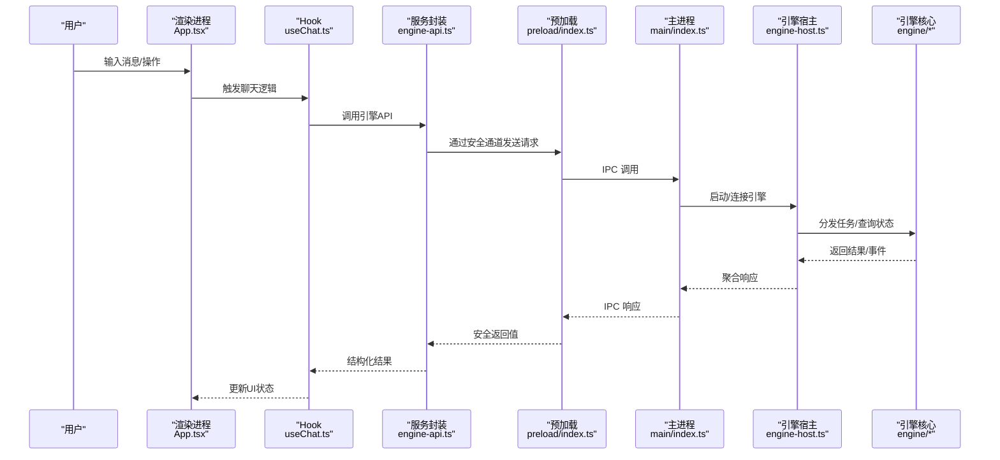
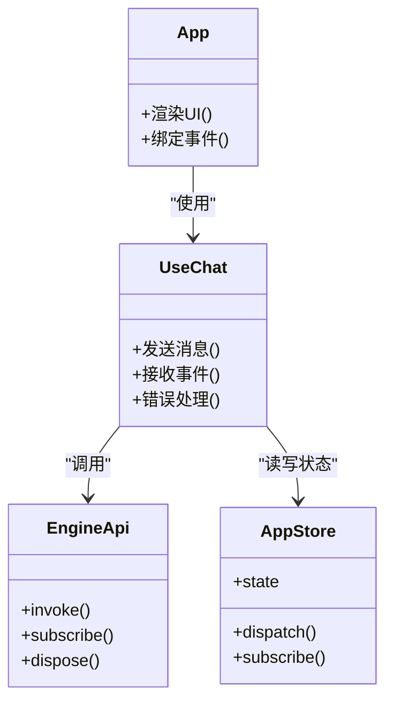
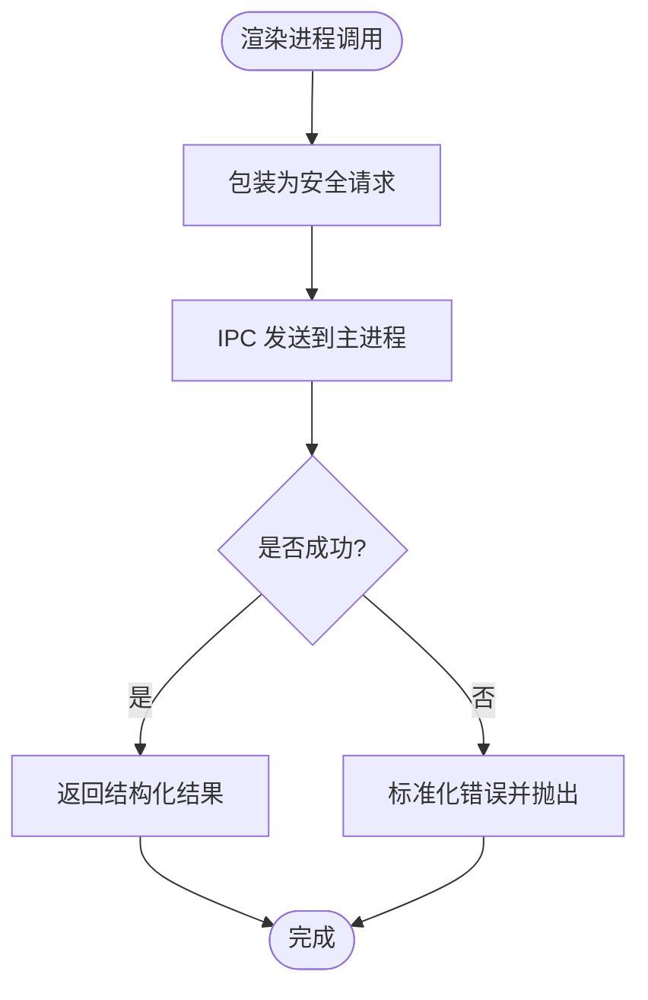
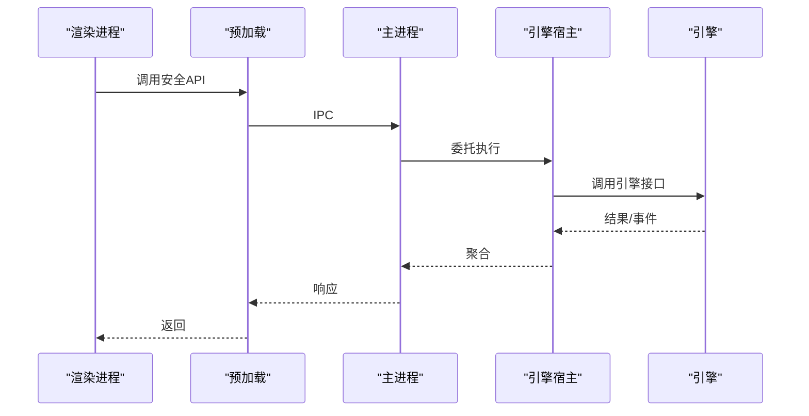
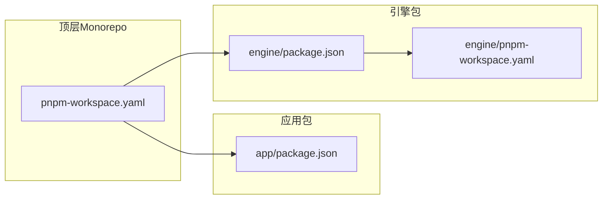

# 架构概览

<cite>
**本文引用的文件**   
- [app/main/index.ts](file://app/main/index.ts)
- [app/main/engine-host.ts](file://app/main/engine-host.ts)
- [app/main/window.ts](file://app/main/window.ts)
- [app/main/menu.ts](file://app/main/menu.ts)
- [app/main/settings.ts](file://app/main/settings.ts)
- [app/preload/index.ts](file://app/preload/index.ts)
- [app/renderer/src/main.tsx](file://app/renderer/src/main.tsx)
- [app/renderer/src/App.tsx](file://app/renderer/src/App.tsx)
- [app/renderer/src/services/engine-api.ts](file://app/renderer/src/services/engine-api.ts)
- [app/renderer/src/hooks/useChat.ts](file://app/renderer/src/hooks/useChat.ts)
- [app/renderer/src/stores/app-store.ts](file://app/renderer/src/stores/app-store.ts)
- [engine/package.json](file://engine/package.json)
- [engine/pnpm-workspace.yaml](file://engine/pnpm-workspace.yaml)
- [engine/README.md](file://engine/README.md)
</cite>

## 目录
1. [简介](#简介)
2. [项目结构](#项目结构)
3. [核心组件](#核心组件)
4. [架构总览](#架构总览)
5. [详细组件分析](#详细组件分析)
6. [依赖分析](#依赖分析)
7. [性能考量](#性能考量)
8. [故障排查指南](#故障排查指南)
9. [结论](#结论)
10. [附录](#附录)

## 简介
本概览面向KCoder项目的整体架构，重点阐述：
- Electron主进程与渲染进程的分离职责与通信边界
- AI引擎的分层架构（表现层、适配层、能力层、领域层、基础设施层）
- Monorepo多包管理策略（app与engine的职责边界）
- 关键数据流与控制流图
- 扩展点设计与插件机制
- 架构决策的技术考量与权衡

## 项目结构
仓库采用顶层Monorepo组织，包含两个主要子工程：
- app：Electron桌面应用，负责UI渲染、用户交互、与AI引擎的桥接
- engine：AI引擎核心，采用分层与多包拆分，提供可插拔的能力与协议适配

图表来源
- [app/main/index.ts:1-200](file://app/main/index.ts#L1-L200)
- [app/preload/index.ts:1-200](file://app/preload/index.ts#L1-L200)
- [app/renderer/src/main.tsx:1-200](file://app/renderer/src/main.tsx#L1-L200)
- [app/renderer/src/App.tsx:1-200](file://app/renderer/src/App.tsx#L1-L200)
- [app/renderer/src/services/engine-api.ts:1-200](file://app/renderer/src/services/engine-api.ts#L1-L200)
- [app/renderer/src/hooks/useChat.ts:1-200](file://app/renderer/src/hooks/useChat.ts#L1-L200)
- [app/renderer/src/stores/app-store.ts:1-200](file://app/renderer/src/stores/app-store.ts#L1-L200)
- [engine/package.json:1-200](file://engine/package.json#L1-L200)
- [engine/pnpm-workspace.yaml:1-200](file://engine/pnpm-workspace.yaml#L1-L200)
- [engine/README.md:1-200](file://engine/README.md#L1-L200)

章节来源
- [app/main/index.ts:1-200](file://app/main/index.ts#L1-L200)
- [app/preload/index.ts:1-200](file://app/preload/index.ts#L1-L200)
- [app/renderer/src/main.tsx:1-200](file://app/renderer/src/main.tsx#L1-L200)
- [app/renderer/src/App.tsx:1-200](file://app/renderer/src/App.tsx#L1-L200)
- [app/renderer/src/services/engine-api.ts:1-200](file://app/renderer/src/services/engine-api.ts#L1-L200)
- [app/renderer/src/hooks/useChat.ts:1-200](file://app/renderer/src/hooks/useChat.ts#L1-L200)
- [app/renderer/src/stores/app-store.ts:1-200](file://app/renderer/src/stores/app-store.ts#L1-L200)
- [engine/package.json:1-200](file://engine/package.json#L1-L200)
- [engine/pnpm-workspace.yaml:1-200](file://engine/pnpm-workspace.yaml#L1-L200)
- [engine/README.md:1-200](file://engine/README.md#L1-L200)

## 核心组件
- 主进程（Electron Main）
  - 生命周期管理、窗口创建、菜单与设置、与引擎的集成与托管
  - 通过IPC暴露安全API给渲染进程
- 预加载脚本（Preload）
  - 在隔离环境中注入受限API，作为渲染进程与主进程之间的安全桥梁
- 渲染进程（Renderer）
  - React UI、状态管理、业务Hook、对引擎API的调用封装
- 引擎（Engine）
  - 多包分层架构，提供AI推理编排、工具执行、持久化、HTTP服务、MCP/HTTP传输等能力
  - 通过CLI或HTTP接口被主进程驱动

章节来源
- [app/main/index.ts:1-200](file://app/main/index.ts#L1-L200)
- [app/main/engine-host.ts:1-200](file://app/main/engine-host.ts#L1-L200)
- [app/main/window.ts:1-200](file://app/main/window.ts#L1-L200)
- [app/main/menu.ts:1-200](file://app/main/menu.ts#L1-L200)
- [app/main/settings.ts:1-200](file://app/main/settings.ts#L1-L200)
- [app/preload/index.ts:1-200](file://app/preload/index.ts#L1-L200)
- [app/renderer/src/services/engine-api.ts:1-200](file://app/renderer/src/services/engine-api.ts#L1-L200)
- [engine/README.md:1-200](file://engine/README.md#L1-L200)

## 架构总览
下图展示从用户输入到AI引擎执行的端到端流程，以及引擎内部的分层协作。

图表来源
- [app/renderer/src/App.tsx:1-200](file://app/renderer/src/App.tsx#L1-L200)
- [app/renderer/src/hooks/useChat.ts:1-200](file://app/renderer/src/hooks/useChat.ts#L1-L200)
- [app/renderer/src/services/engine-api.ts:1-200](file://app/renderer/src/services/engine-api.ts#L1-L200)
- [app/preload/index.ts:1-200](file://app/preload/index.ts#L1-L200)
- [app/main/index.ts:1-200](file://app/main/index.ts#L1-L200)
- [app/main/engine-host.ts:1-200](file://app/main/engine-host.ts#L1-L200)
- [engine/README.md:1-200](file://engine/README.md#L1-L200)

## 详细组件分析

### 表现层（渲染进程）
- 职责
  - 呈现界面、处理用户交互、维护本地状态
  - 将业务意图转化为对“引擎API”的调用
- 关键模块
  - App.tsx：应用根组件与路由/布局
  - useChat.ts：聊天相关状态与副作用
  - engine-api.ts：对主进程IPC的统一封装
  - app-store.ts：全局状态容器
- 交互关系
  - 组件 -> Hook -> 服务封装 -> 预加载 -> 主进程

图表来源
- [app/renderer/src/App.tsx:1-200](file://app/renderer/src/App.tsx#L1-L200)
- [app/renderer/src/hooks/useChat.ts:1-200](file://app/renderer/src/hooks/useChat.ts#L1-L200)
- [app/renderer/src/services/engine-api.ts:1-200](file://app/renderer/src/services/engine-api.ts#L1-L200)
- [app/renderer/src/stores/app-store.ts:1-200](file://app/renderer/src/stores/app-store.ts#L1-L200)

章节来源
- [app/renderer/src/App.tsx:1-200](file://app/renderer/src/App.tsx#L1-L200)
- [app/renderer/src/hooks/useChat.ts:1-200](file://app/renderer/src/hooks/useChat.ts#L1-L200)
- [app/renderer/src/services/engine-api.ts:1-200](file://app/renderer/src/services/engine-api.ts#L1-L200)
- [app/renderer/src/stores/app-store.ts:1-200](file://app/renderer/src/stores/app-store.ts#L1-L200)

### 适配层（预加载与IPC桥）
- 职责
  - 在隔离环境下暴露最小必要API
  - 统一序列化/反序列化IPC消息，屏蔽底层细节
- 关键点
  - 白名单式API注入，避免直接访问Node/Electron API
  - 错误传播与重试策略

图表来源
- [app/preload/index.ts:1-200](file://app/preload/index.ts#L1-L200)
- [app/renderer/src/services/engine-api.ts:1-200](file://app/renderer/src/services/engine-api.ts#L1-L200)

章节来源
- [app/preload/index.ts:1-200](file://app/preload/index.ts#L1-L200)
- [app/renderer/src/services/engine-api.ts:1-200](file://app/renderer/src/services/engine-api.ts#L1-L200)

### 能力层（主进程与引擎宿主）
- 职责
  - 管理引擎生命周期（启动、停止、重启）
  - 转发渲染进程请求至引擎，聚合结果
  - 提供系统级能力（窗口、菜单、设置）
- 关键点
  - 引擎宿主负责与engine包的对接（CLI/HTTP/进程内）
  - 主进程集中处理权限、资源与并发

图表来源
- [app/main/index.ts:1-200](file://app/main/index.ts#L1-L200)
- [app/main/engine-host.ts:1-200](file://app/main/engine-host.ts#L1-L200)
- [app/main/window.ts:1-200](file://app/main/window.ts#L1-L200)
- [app/main/menu.ts:1-200](file://app/main/menu.ts#L1-L200)
- [app/main/settings.ts:1-200](file://app/main/settings.ts#L1-L200)

章节来源
- [app/main/index.ts:1-200](file://app/main/index.ts#L1-L200)
- [app/main/engine-host.ts:1-200](file://app/main/engine-host.ts#L1-L200)
- [app/main/window.ts:1-200](file://app/main/window.ts#L1-L200)
- [app/main/menu.ts:1-200](file://app/main/menu.ts#L1-L200)
- [app/main/settings.ts:1-200](file://app/main/settings.ts#L1-L200)

### 领域层（引擎核心）
- 职责
  - 定义领域模型、业务流程、规则与约束
  - 编排AI推理、工具调用、计划与循环治理
- 关键点
  - 通过端口/适配器解耦外部依赖
  - 以事件/状态机驱动长时任务

章节来源
- [engine/README.md:1-200](file://engine/README.md#L1-L200)

### 基础设施层（引擎基础能力）
- 职责
  - 提供持久化、网络、日志、遥测、配置、CLI等通用能力
  - 支撑上层能力与领域层的稳定运行
- 关键点
  - 可替换实现（如不同存储后端、传输协议）

章节来源
- [engine/README.md:1-200](file://engine/README.md#L1-L200)

### 扩展点与插件机制
- 设计要点
  - 通过能力注册表与协议抽象，允许新增模型提供商、工具、技能与传输方式
  - 插件以声明式清单+运行时发现的方式接入
- 典型扩展点
  - 模型客户端适配器
  - 工具提供者（MCP/HTTP/Web）
  - 技能（Skill）与命令注册
  - 中间件与治理策略（预算、压缩、循环治理）

章节来源
- [engine/README.md:1-200](file://engine/README.md#L1-L200)

## 依赖分析
- 包管理与工作区
  - 顶层pnpm工作区协调app与engine
  - engine内部按分层拆分为多个包（adapters/capabilities/domain-layer/infrastructure等）
- 耦合与内聚
  - app仅依赖engine提供的稳定接口（IPC/HTTP），降低版本耦合
  - engine内部通过端口/适配器解耦外部依赖，提升内聚性

图表来源
- [engine/pnpm-workspace.yaml:1-200](file://engine/pnpm-workspace.yaml#L1-L200)
- [engine/package.json:1-200](file://engine/package.json#L1-L200)

章节来源
- [engine/pnpm-workspace.yaml:1-200](file://engine/pnpm-workspace.yaml#L1-L200)
- [engine/package.json:1-200](file://engine/package.json#L1-L200)

## 性能考量
- 渲染进程轻量化：复杂计算下沉至引擎，减少主线程阻塞
- IPC批处理与节流：合并高频消息，避免频繁跨进程通信
- 引擎侧异步与背压：长时任务采用事件驱动与队列，防止内存膨胀
- 缓存与增量更新：对热点数据与结果进行缓存，减少重复计算
- 资源隔离：不同会话/任务使用独立上下文，避免相互干扰

[本节为通用指导，不直接分析具体文件]

## 故障排查指南
- 常见问题定位
  - IPC失败：检查预加载注入的API与主进程处理器是否匹配
  - 引擎未就绪：确认主进程是否正确启动/连接引擎宿主
  - 渲染状态异常：查看Hook与服务封装的错误分支与重试逻辑
- 建议步骤
  - 启用调试日志与遥测
  - 复现路径最小化，逐步隔离问题域
  - 验证配置项与权限设置

章节来源
- [app/preload/index.ts:1-200](file://app/preload/index.ts#L1-L200)
- [app/main/index.ts:1-200](file://app/main/index.ts#L1-L200)
- [app/main/engine-host.ts:1-200](file://app/main/engine-host.ts#L1-L200)
- [app/renderer/src/services/engine-api.ts:1-200](file://app/renderer/src/services/engine-api.ts#L1-L200)

## 结论
KCoder采用清晰的进程分离与分层架构：
- 表现层专注交互与状态，适配层保障安全与稳定，能力层统筹系统资源，领域层承载核心业务，基础设施层提供通用能力
- Monorepo策略使app与engine职责清晰、演进独立
- 通过扩展点与插件机制，系统具备良好的可插拔性与可扩展性
- 建议在后续迭代中持续完善遥测、契约测试与回归用例，进一步提升稳定性与可观测性

[本节为总结性内容，不直接分析具体文件]

## 附录
- 术语
  - 主进程：Electron中拥有完整Node能力的进程
  - 渲染进程：负责UI渲染的Web环境进程
  - 预加载脚本：在渲染进程中注入受限API的安全桥梁
  - 引擎宿主：在主进程中负责与引擎交互的组件
- 参考
  - 引擎说明文档与工作区配置用于理解分层与包划分

章节来源
- [engine/README.md:1-200](file://engine/README.md#L1-L200)
- [engine/pnpm-workspace.yaml:1-200](file://engine/pnpm-workspace.yaml#L1-L200)