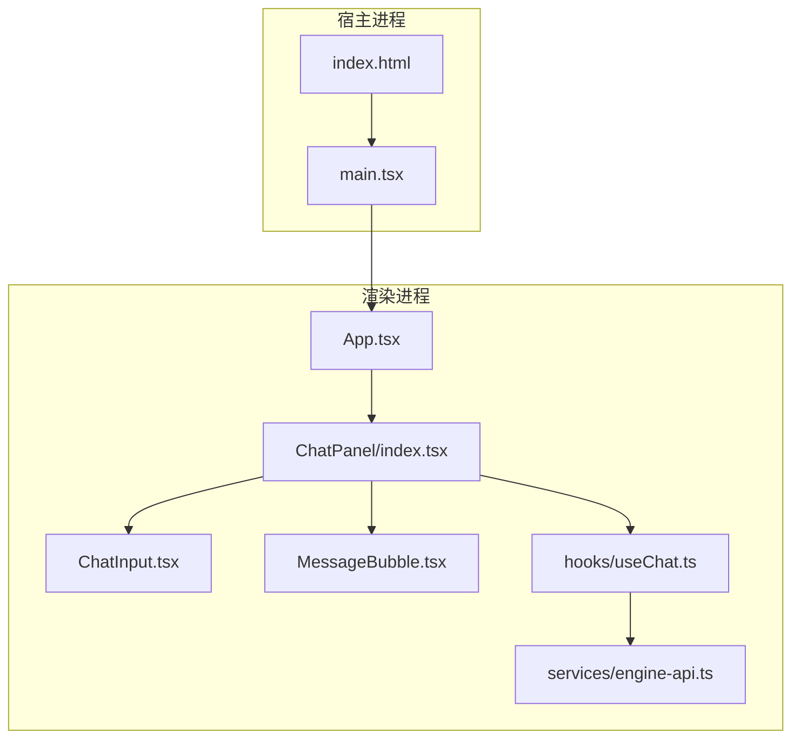
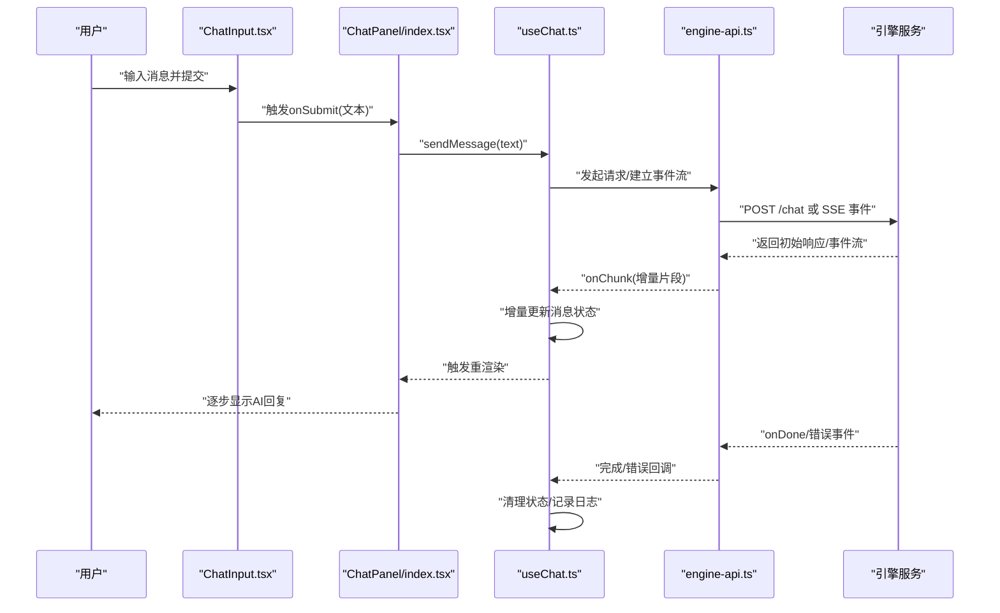
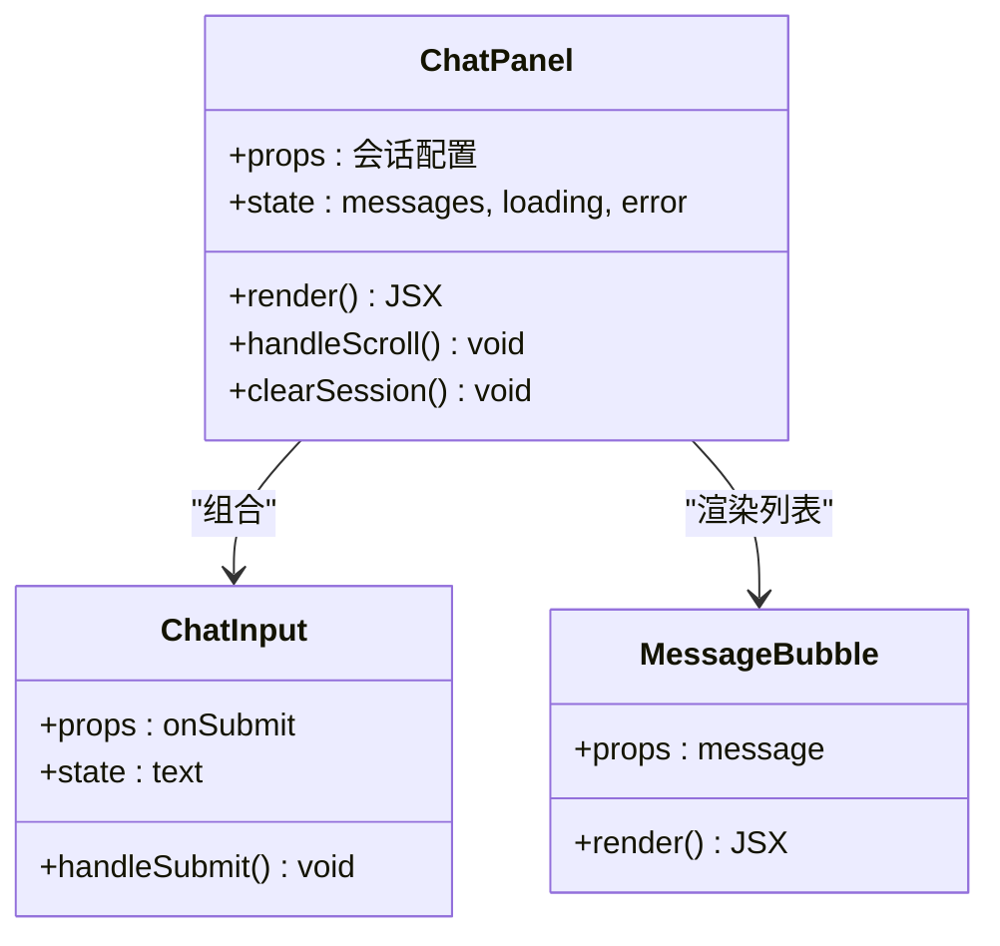
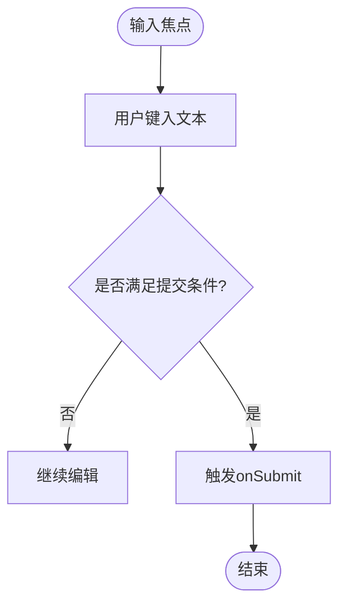
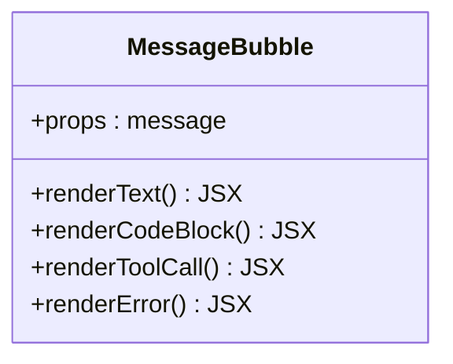
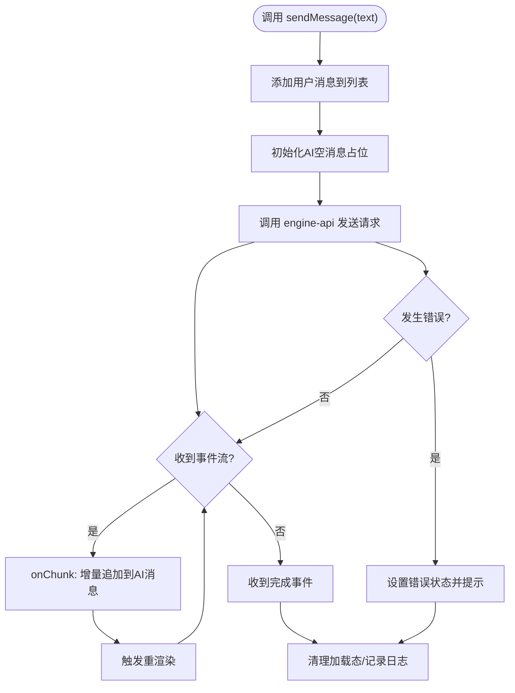
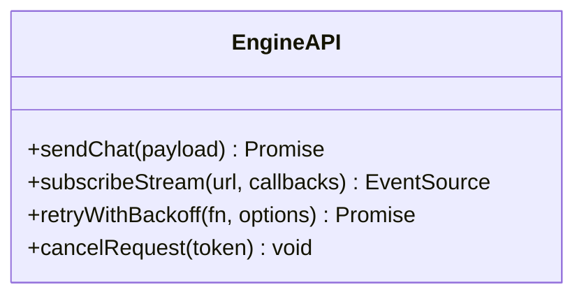
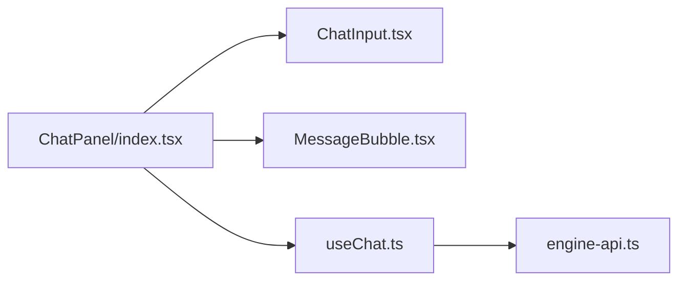

# AI智能对话系统

<cite>
**本文引用的文件**   
- [ChatPanel/index.tsx](file://app/renderer/src/components/ChatPanel/index.tsx)
- [ChatInput.tsx](file://app/renderer/src/components/ChatPanel/ChatInput.tsx)
- [MessageBubble.tsx](file://app/renderer/src/components/ChatPanel/MessageBubble.tsx)
- [useChat.ts](file://app/renderer/src/hooks/useChat.ts)
- [engine-api.ts](file://app/renderer/src/services/engine-api.ts)
- [App.tsx](file://app/renderer/src/App.tsx)
- [main.tsx](file://app/renderer/src/main.tsx)
- [index.html](file://app/renderer/index.html)
</cite>

## 目录
1. [简介](#简介)
2. [项目结构](#项目结构)
3. [核心组件](#核心组件)
4. [架构总览](#架构总览)
5. [详细组件分析](#详细组件分析)
6. [依赖关系分析](#依赖关系分析)
7. [性能考虑](#性能考虑)
8. [故障排查指南](#故障排查指南)
9. [结论](#结论)
10. [附录](#附录)

## 简介
本技术文档围绕KCoder的AI智能对话系统，聚焦聊天界面与消息处理链路。内容涵盖：
- 聊天界面组件架构：ChatPanel、ChatInput、MessageBubble等核心组件的职责与协作方式
- 消息处理流程：从用户输入到AI响应的完整数据流转
- 流式响应机制：基于事件流的增量渲染与状态更新
- 会话状态管理：使用React Hooks进行本地状态与副作用管理
- 实时通信协议：与服务端引擎的HTTP长连接或SSE风格事件流交互
- 错误处理策略：网络异常、服务端错误、渲染错误的统一处理
- 性能优化方案：增量渲染、防抖节流、虚拟滚动、缓存策略
- 扩展指南：如何接入新的AI模型提供商与自定义消息类型

## 项目结构
前端采用Electron + React + TypeScript技术栈，聊天功能位于renderer进程。关键目录与职责如下：
- components/ChatPanel：聊天面板及其子组件（输入框、消息气泡）
- hooks/useChat：封装聊天相关的状态与逻辑（发送、接收、流式更新、错误处理）
- services/engine-api：与后端引擎API的通信封装（请求、事件流、重试）
- App.tsx：应用根组件，挂载聊天面板
- main.tsx：入口文件，初始化React应用
- index.html：页面模板

图表来源
- [App.tsx](file://app/renderer/src/App.tsx)
- [ChatPanel/index.tsx](file://app/renderer/src/components/ChatPanel/index.tsx)
- [ChatInput.tsx](file://app/renderer/src/components/ChatPanel/ChatInput.tsx)
- [MessageBubble.tsx](file://app/renderer/src/components/ChatPanel/MessageBubble.tsx)
- [useChat.ts](file://app/renderer/src/hooks/useChat.ts)
- [engine-api.ts](file://app/renderer/src/services/engine-api.ts)
- [main.tsx](file://app/renderer/src/main.tsx)
- [index.html](file://app/renderer/index.html)

章节来源
- [App.tsx](file://app/renderer/src/App.tsx)
- [ChatPanel/index.tsx](file://app/renderer/src/components/ChatPanel/index.tsx)
- [ChatInput.tsx](file://app/renderer/src/components/ChatPanel/ChatInput.tsx)
- [MessageBubble.tsx](file://app/renderer/src/components/ChatPanel/MessageBubble.tsx)
- [useChat.ts](file://app/renderer/src/hooks/useChat.ts)
- [engine-api.ts](file://app/renderer/src/services/engine-api.ts)
- [main.tsx](file://app/renderer/src/main.tsx)
- [index.html](file://app/renderer/index.html)

## 核心组件
- ChatPanel：负责会话列表展示、消息渲染容器、布局与滚动控制；聚合useChat提供的状态与方法，并组合ChatInput与MessageBubble
- ChatInput：负责用户输入、校验、提交；支持快捷键与基础富文本能力（如换行、粘贴）
- MessageBubble：负责单条消息的渲染，包括文本、代码块、工具调用结果等；根据消息类型切换渲染策略
- useChat：封装聊天状态（消息列表、加载态、错误）、发送逻辑、流式增量更新、重试与取消
- engine-api：封装与引擎服务的通信，提供发送消息、订阅事件流、错误与超时处理

章节来源
- [ChatPanel/index.tsx](file://app/renderer/src/components/ChatPanel/index.tsx)
- [ChatInput.tsx](file://app/renderer/src/components/ChatPanel/ChatInput.tsx)
- [MessageBubble.tsx](file://app/renderer/src/components/ChatPanel/MessageBubble.tsx)
- [useChat.ts](file://app/renderer/src/hooks/useChat.ts)
- [engine-api.ts](file://app/renderer/src/services/engine-api.ts)

## 架构总览
下图展示了从用户输入到AI响应的端到端流程，包含UI层、状态层与通信层的交互。

图表来源
- [ChatInput.tsx](file://app/renderer/src/components/ChatPanel/ChatInput.tsx)
- [ChatPanel/index.tsx](file://app/renderer/src/components/ChatPanel/index.tsx)
- [useChat.ts](file://app/renderer/src/hooks/useChat.ts)
- [engine-api.ts](file://app/renderer/src/services/engine-api.ts)

## 详细组件分析

### ChatPanel组件分析
- 职责
  - 维护会话上下文与消息容器
  - 组合ChatInput与MessageBubble
  - 监听滚动位置，必要时实现虚拟滚动
  - 暴露对外方法（清空会话、切换主题等）
- 关键状态
  - 消息列表、当前会话ID、加载态、错误信息
- 与useChat的协作
  - 通过useChat提供的sendMessage、messages、error等状态与方法驱动渲染

图表来源
- [ChatPanel/index.tsx](file://app/renderer/src/components/ChatPanel/index.tsx)
- [ChatInput.tsx](file://app/renderer/src/components/ChatPanel/ChatInput.tsx)
- [MessageBubble.tsx](file://app/renderer/src/components/ChatPanel/MessageBubble.tsx)

章节来源
- [ChatPanel/index.tsx](file://app/renderer/src/components/ChatPanel/index.tsx)

### ChatInput组件分析
- 职责
  - 收集用户输入，执行基础校验（非空、长度限制）
  - 处理键盘事件（Enter提交、Shift+Enter换行）
  - 将有效输入传递给父级ChatPanel
- 可访问性与体验
  - 支持粘贴图片/文本、自动聚焦、占位符提示

图表来源
- [ChatInput.tsx](file://app/renderer/src/components/ChatPanel/ChatInput.tsx)

章节来源
- [ChatInput.tsx](file://app/renderer/src/components/ChatPanel/ChatInput.tsx)

### MessageBubble组件分析
- 职责
  - 根据消息类型渲染不同内容（文本、代码块、工具调用结果、错误信息等）
  - 支持复制代码、折叠展开、链接跳转等交互
- 可扩展性
  - 通过消息类型枚举与渲染器映射，新增类型无需改动主渲染逻辑

图表来源
- [MessageBubble.tsx](file://app/renderer/src/components/ChatPanel/MessageBubble.tsx)

章节来源
- [MessageBubble.tsx](file://app/renderer/src/components/ChatPanel/MessageBubble.tsx)

### useChat钩子分析
- 职责
  - 管理消息列表、加载态、错误态
  - 封装sendMessage：创建用户消息、发起请求、订阅事件流、增量更新、收尾
  - 提供重试、取消、清空会话等方法
- 流式更新
  - 通过事件流onChunk增量追加到当前AI消息，避免整段替换导致的闪烁
- 错误处理
  - 捕获网络错误、超时、服务端错误，设置error状态并提示用户

图表来源
- [useChat.ts](file://app/renderer/src/hooks/useChat.ts)
- [engine-api.ts](file://app/renderer/src/services/engine-api.ts)

章节来源
- [useChat.ts](file://app/renderer/src/hooks/useChat.ts)
- [engine-api.ts](file://app/renderer/src/services/engine-api.ts)

### engine-api服务分析
- 职责
  - 封装与引擎服务的HTTP/SSE通信
  - 提供sendChat、subscribeStream、retryWithBackoff等能力
  - 统一错误码映射、超时控制、取消令牌
- 集成点
  - 被useChat调用，作为唯一外部通信出口，便于后续替换为WebSocket或其他协议

图表来源
- [engine-api.ts](file://app/renderer/src/services/engine-api.ts)

章节来源
- [engine-api.ts](file://app/renderer/src/services/engine-api.ts)

## 依赖关系分析
- 组件耦合
  - ChatPanel依赖useChat与子组件，职责清晰，内聚度高
  - ChatInput与MessageBubble为无状态或弱状态组件，易于测试与复用
- 外部依赖
  - engine-api作为通信抽象，屏蔽底层协议细节，降低上层耦合
- 可能的循环依赖
  - 当前结构未出现循环导入；建议保持hooks与services单向依赖

图表来源
- [ChatPanel/index.tsx](file://app/renderer/src/components/ChatPanel/index.tsx)
- [ChatInput.tsx](file://app/renderer/src/components/ChatPanel/ChatInput.tsx)
- [MessageBubble.tsx](file://app/renderer/src/components/ChatPanel/MessageBubble.tsx)
- [useChat.ts](file://app/renderer/src/hooks/useChat.ts)
- [engine-api.ts](file://app/renderer/src/services/engine-api.ts)

章节来源
- [ChatPanel/index.tsx](file://app/renderer/src/components/ChatPanel/index.tsx)
- [ChatInput.tsx](file://app/renderer/src/components/ChatPanel/ChatInput.tsx)
- [MessageBubble.tsx](file://app/renderer/src/components/ChatPanel/MessageBubble.tsx)
- [useChat.ts](file://app/renderer/src/hooks/useChat.ts)
- [engine-api.ts](file://app/renderer/src/services/engine-api.ts)

## 性能考虑
- 增量渲染
  - 使用onChunk对AI消息进行追加而非整段替换，减少DOM重排
- 虚拟滚动
  - 当消息数量较大时，仅渲染可视区域的消息项，降低内存占用
- 防抖与节流
  - 对输入框变更与滚动事件进行节流，避免频繁计算
- 缓存策略
  - 对历史会话与常用资源进行本地缓存，减少重复请求
- 取消与重试
  - 使用取消令牌中断旧请求；指数退避重试提升稳定性

[本节为通用指导，不直接分析具体文件]

## 故障排查指南
- 常见问题
  - 网络错误：检查engine-api的错误映射与重试策略
  - 流式中断：确认事件流关闭与清理逻辑是否正确
  - 渲染卡顿：检查是否使用了虚拟滚动与增量更新
- 定位步骤
  - 在useChat中打印关键状态变化与时间戳
  - 在engine-api中记录请求URL、状态码与响应头
  - 在MessageBubble中对未知消息类型输出警告日志
- 恢复策略
  - 提供“重试”按钮，允许用户手动重新发送
  - 支持“清空会话”，重置状态后继续对话

章节来源
- [useChat.ts](file://app/renderer/src/hooks/useChat.ts)
- [engine-api.ts](file://app/renderer/src/services/engine-api.ts)
- [MessageBubble.tsx](file://app/renderer/src/components/ChatPanel/MessageBubble.tsx)

## 结论
本系统通过清晰的组件分层与状态管理，实现了流畅的AI对话体验。ChatPanel、ChatInput、MessageBubble各司其职，useChat集中管理会话逻辑，engine-api统一通信抽象。结合流式响应、错误处理与性能优化，整体具备良好的可扩展性与可维护性。

[本节为总结，不直接分析具体文件]

## 附录

### 集成指南：扩展新的AI模型提供商
- 目标
  - 在不修改上层组件的前提下，接入新的模型提供商
- 步骤
  - 在engine-api中新增适配函数，封装新提供商的请求与事件流
  - 在useChat中通过配置选择不同适配器
  - 在MessageBubble中新增对应消息类型的渲染器（如需）
- 注意事项
  - 统一错误码与超时参数
  - 保证事件流格式一致（onChunk/onDone）

章节来源
- [engine-api.ts](file://app/renderer/src/services/engine-api.ts)
- [useChat.ts](file://app/renderer/src/hooks/useChat.ts)
- [MessageBubble.tsx](file://app/renderer/src/components/ChatPanel/MessageBubble.tsx)

### 自定义消息类型
- 定义消息类型枚举与数据结构
- 在MessageBubble中添加渲染分支
- 在useChat中确保增量更新能正确合并新字段
- 在engine-api中透传新字段至服务端

章节来源
- [MessageBubble.tsx](file://app/renderer/src/components/ChatPanel/MessageBubble.tsx)
- [useChat.ts](file://app/renderer/src/hooks/useChat.ts)
- [engine-api.ts](file://app/renderer/src/services/engine-api.ts)