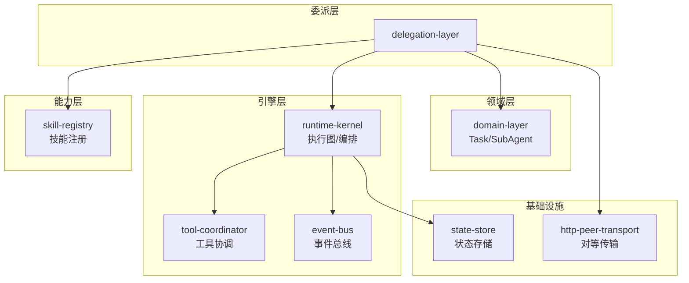
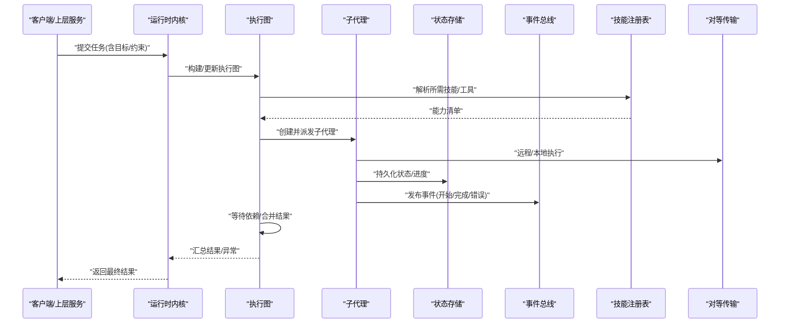
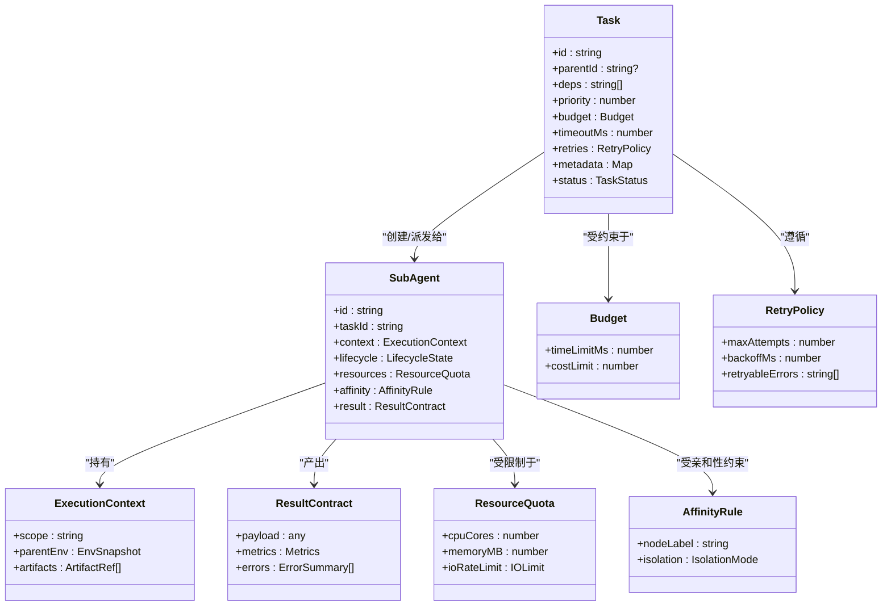
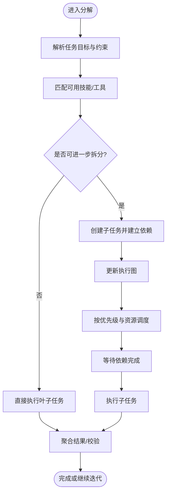
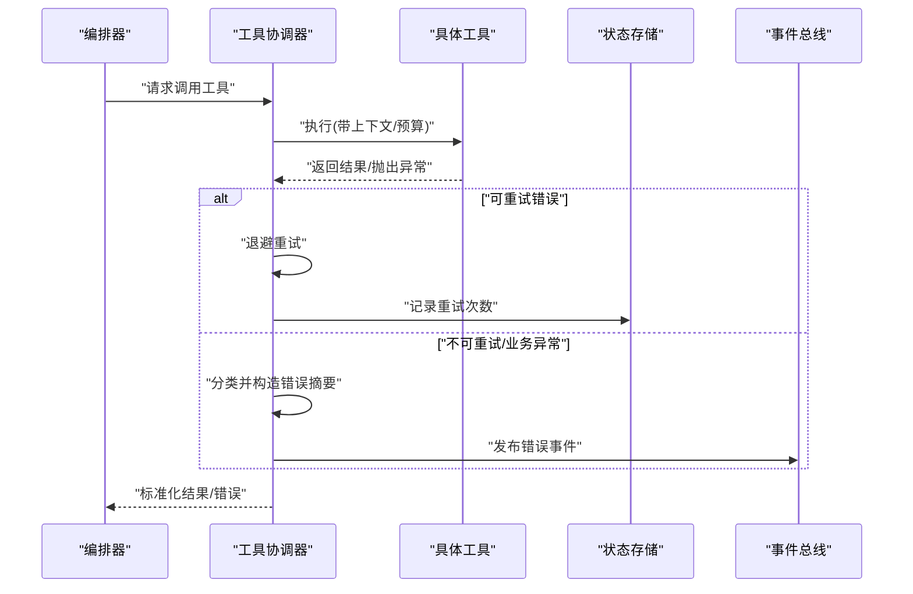
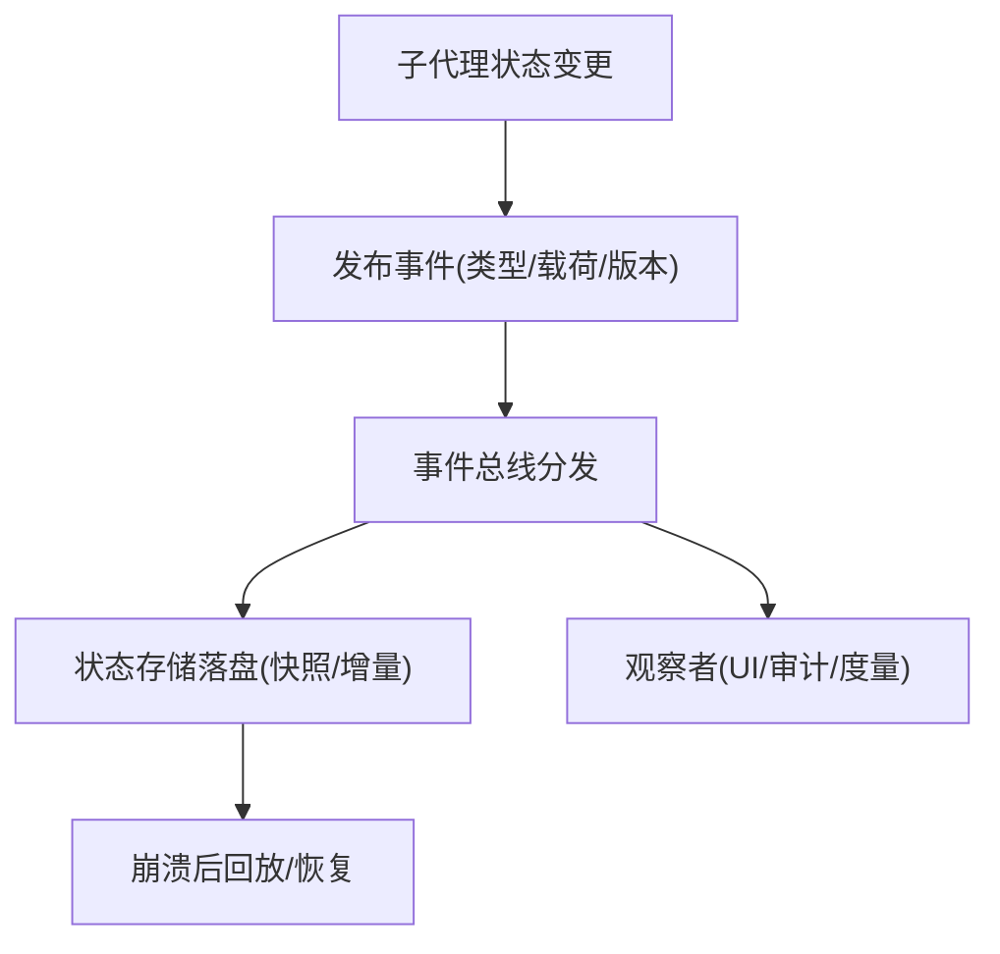
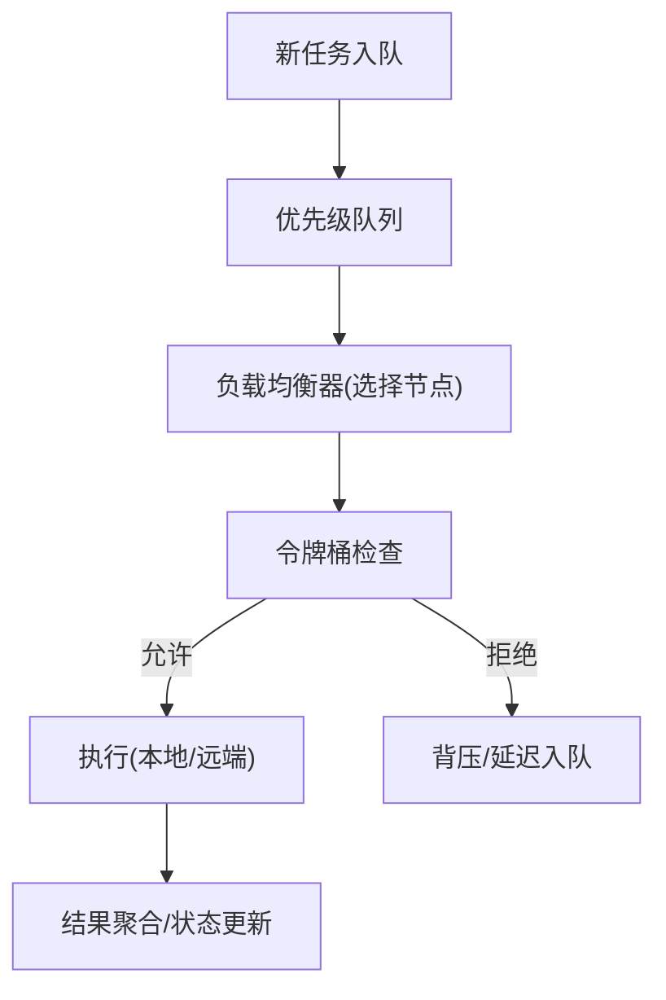
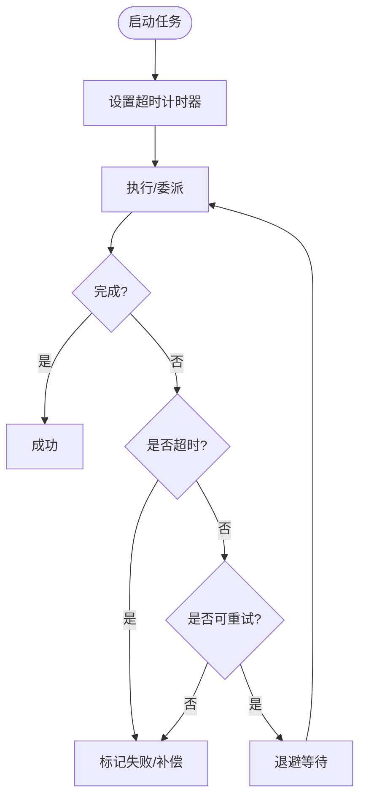
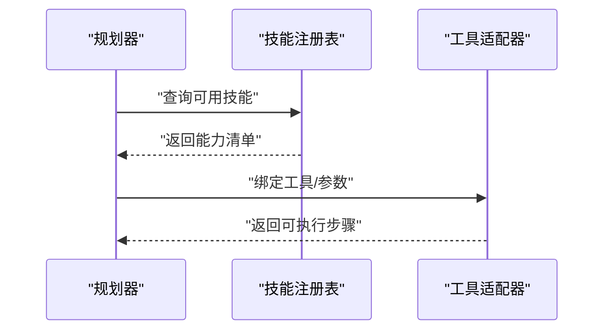
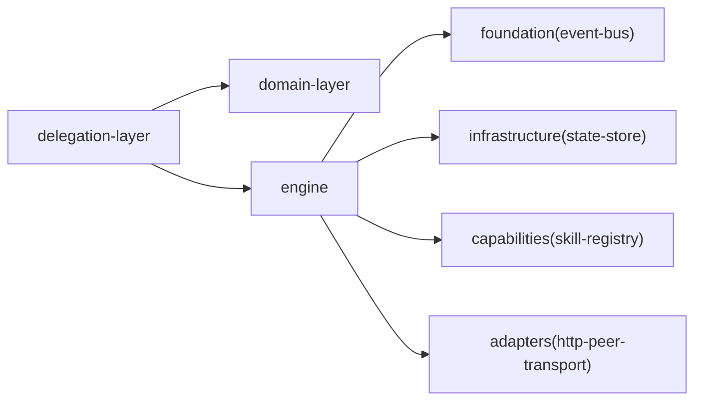

# 任务委派系统

<cite>
**本文引用的文件**   
- [engine/packages/delegation-layer/README.md](file://engine/packages/delegation-layer/README.md)
- [engine/packages/domain-layer/src/task.ts](file://engine/packages/domain-layer/src/task.ts)
- [engine/packages/domain-layer/src/subagent.ts](file://engine/packages/domain-layer/src/subagent.ts)
- [engine/packages/engine/src/runtime-kernel.ts](file://engine/packages/engine/src/runtime-kernel.ts)
- [engine/packages/engine/src/execution-graph.ts](file://engine/packages/engine/src/execution-graph.ts)
- [engine/packages/engine/src/tool-coordinator.ts](file://engine/packages/engine/src/tool-coordinator.ts)
- [engine/packages/foundation/src/event-bus.ts](file://engine/packages/foundation/src/event-bus.ts)
- [engine/packages/infrastructure/src/state-store.ts](file://engine/packages/infrastructure/src/state-store.ts)
- [engine/packages/capabilities/src/skill-registry.ts](file://engine/packages/capabilities/src/skill-registry.ts)
- [engine/packages/adapters/src/http-peer-transport.ts](file://engine/packages/adapters/src/http-peer-transport.ts)
- [engine/tests/delegation-runtime.test.ts](file://engine/tests/delegation-runtime.test.ts)
- [engine/tests/child-agent-executor.test.ts](file://engine/tests/child-agent-executor.test.ts)
- [engine/tests/execution-graph.test.ts](file://engine/tests/execution-graph.test.ts)
- [engine/tests/tool-coordinator-runtime.test.ts](file://engine/tests/tool-coordinator-runtime.test.ts)
</cite>

## 目录
1. [简介](#简介)
2. [项目结构](#项目结构)
3. [核心组件](#核心组件)
4. [架构总览](#架构总览)
5. [详细组件分析](#详细组件分析)
6. [依赖关系分析](#依赖关系分析)
7. [性能与并发](#性能与并发)
8. [故障排查指南](#故障排查指南)
9. [结论](#结论)
10. [附录](#附录)

## 简介
本技术文档面向KCoder的任务委派子系统，聚焦多代理协作、任务分解算法、子代理生命周期管理、状态同步、并发控制、负载均衡、复杂任务拆解模式、结果聚合、错误恢复、优先级与资源调度、超时处理、配置项与监控指标、以及与技能系统的集成与扩展点。文档以代码仓库中的实际实现为依据，提供架构图、时序图、流程图与类图，帮助读者从高层到细节全面理解该子系统的设计与运行方式。

## 项目结构
任务委派系统位于 engine 工作区中，采用分层与模块化组织：
- delegation-layer：委派层，负责任务拆分、委派策略、子代理编排与结果汇聚
- domain-layer：领域模型，定义任务、子代理、执行上下文等核心实体
- engine：运行时内核，承载执行图、工具协调、事件总线、持久化与治理
- foundation：基础能力（事件总线、日志、度量）
- infrastructure：基础设施（状态存储、传输、序列化）
- capabilities：能力注册与技能发现
- adapters：外部通信适配（如HTTP对等节点）

图表来源
- [engine/packages/delegation-layer/README.md](file://engine/packages/delegation-layer/README.md)
- [engine/packages/domain-layer/src/task.ts](file://engine/packages/domain-layer/src/task.ts)
- [engine/packages/domain-layer/src/subagent.ts](file://engine/packages/domain-layer/src/subagent.ts)
- [engine/packages/engine/src/runtime-kernel.ts](file://engine/packages/engine/src/runtime-kernel.ts)
- [engine/packages/engine/src/execution-graph.ts](file://engine/packages/engine/src/execution-graph.ts)
- [engine/packages/engine/src/tool-coordinator.ts](file://engine/packages/engine/src/tool-coordinator.ts)
- [engine/packages/foundation/src/event-bus.ts](file://engine/packages/foundation/src/event-bus.ts)
- [engine/packages/infrastructure/src/state-store.ts](file://engine/packages/infrastructure/src/state-store.ts)
- [engine/packages/capabilities/src/skill-registry.ts](file://engine/packages/capabilities/src/skill-registry.ts)
- [engine/packages/adapters/src/http-peer-transport.ts](file://engine/packages/adapters/src/http-peer-transport.ts)

章节来源
- [engine/packages/delegation-layer/README.md](file://engine/packages/delegation-layer/README.md)
- [engine/packages/domain-layer/src/task.ts](file://engine/packages/domain-layer/src/task.ts)
- [engine/packages/domain-layer/src/subagent.ts](file://engine/packages/domain-layer/src/subagent.ts)
- [engine/packages/engine/src/runtime-kernel.ts](file://engine/packages/engine/src/runtime-kernel.ts)
- [engine/packages/engine/src/execution-graph.ts](file://engine/packages/engine/src/execution-graph.ts)
- [engine/packages/engine/src/tool-coordinator.ts](file://engine/packages/engine/src/tool-coordinator.ts)
- [engine/packages/foundation/src/event-bus.ts](file://engine/packages/foundation/src/event-bus.ts)
- [engine/packages/infrastructure/src/state-store.ts](file://engine/packages/infrastructure/src/state-store.ts)
- [engine/packages/capabilities/src/skill-registry.ts](file://engine/packages/capabilities/src/skill-registry.ts)
- [engine/packages/adapters/src/http-peer-transport.ts](file://engine/packages/adapters/src/http-peer-transport.ts)

## 核心组件
- 任务与子代理模型：定义任务的元数据、依赖、优先级、预算与状态；子代理封装执行单元、生命周期与结果契约。
- 执行图与编排：将任务拆分为有向无环图（DAG），按拓扑顺序与资源约束并行执行，支持重试与回滚。
- 工具协调器：统一调度工具调用，处理参数校验、结果归一化、错误分类与补偿。
- 事件总线：跨进程/线程的事件发布订阅，用于状态同步、进度上报与可观测性。
- 状态存储：持久化任务与子代理状态，支持断点续跑与一致性快照。
- 技能注册表：动态发现与加载技能，为任务委派提供能力映射与路由。
- 对等传输：基于HTTP的远程子代理通信，支持分片与幂等。

章节来源
- [engine/packages/domain-layer/src/task.ts](file://engine/packages/domain-layer/src/task.ts)
- [engine/packages/domain-layer/src/subagent.ts](file://engine/packages/domain-layer/src/subagent.ts)
- [engine/packages/engine/src/execution-graph.ts](file://engine/packages/engine/src/execution-graph.ts)
- [engine/packages/engine/src/tool-coordinator.ts](file://engine/packages/engine/src/tool-coordinator.ts)
- [engine/packages/foundation/src/event-bus.ts](file://engine/packages/foundation/src/event-bus.ts)
- [engine/packages/infrastructure/src/state-store.ts](file://engine/packages/infrastructure/src/state-store.ts)
- [engine/packages/capabilities/src/skill-registry.ts](file://engine/packages/capabilities/src/skill-registry.ts)
- [engine/packages/adapters/src/http-peer-transport.ts](file://engine/packages/adapters/src/http-peer-transport.ts)

## 架构总览
任务委派系统围绕“计划—分解—委派—执行—聚合”的主循环构建，结合事件驱动与持久化保障可靠性。

图表来源
- [engine/packages/engine/src/runtime-kernel.ts](file://engine/packages/engine/src/runtime-kernel.ts)
- [engine/packages/engine/src/execution-graph.ts](file://engine/packages/engine/src/execution-graph.ts)
- [engine/packages/capabilities/src/skill-registry.ts](file://engine/packages/capabilities/src/skill-registry.ts)
- [engine/packages/infrastructure/src/state-store.ts](file://engine/packages/infrastructure/src/state-store.ts)
- [engine/packages/foundation/src/event-bus.ts](file://engine/packages/foundation/src/event-bus.ts)
- [engine/packages/adapters/src/http-peer-transport.ts](file://engine/packages/adapters/src/http-peer-transport.ts)

## 详细组件分析

### 任务与子代理模型
- 任务实体包含：唯一标识、父任务、依赖集合、优先级、预算（时间/成本）、超时、重试策略、标签与元数据。
- 子代理实体包含：执行上下文、输入输出契约、生命周期状态机、资源配额、亲和性与隔离策略。
- 状态机涵盖：待分配、已分配、运行中、成功、失败、取消、超时、重试中。

图表来源
- [engine/packages/domain-layer/src/task.ts](file://engine/packages/domain-layer/src/task.ts)
- [engine/packages/domain-layer/src/subagent.ts](file://engine/packages/domain-layer/src/subagent.ts)

章节来源
- [engine/packages/domain-layer/src/task.ts](file://engine/packages/domain-layer/src/task.ts)
- [engine/packages/domain-layer/src/subagent.ts](file://engine/packages/domain-layer/src/subagent.ts)

### 执行图与任务分解算法
- DAG构建：根据任务依赖关系生成有向无环图，支持条件分支与并行扇出。
- 分解策略：自上而下递归拆分，依据技能匹配与资源可用性选择最优切分方案。
- 调度策略：拓扑排序+优先级队列，结合资源池容量进行并发度控制。
- 结果聚合：按依赖门控收集子任务结果，支持部分成功与短路失败。

图表来源
- [engine/packages/engine/src/execution-graph.ts](file://engine/packages/engine/src/execution-graph.ts)
- [engine/packages/engine/src/runtime-kernel.ts](file://engine/packages/engine/src/runtime-kernel.ts)

章节来源
- [engine/packages/engine/src/execution-graph.ts](file://engine/packages/engine/src/execution-graph.ts)
- [engine/packages/engine/src/runtime-kernel.ts](file://engine/packages/engine/src/runtime-kernel.ts)

### 工具协调器与错误恢复
- 工具调用：统一入口，负责参数校验、鉴权、限流与计费。
- 错误分类：区分可重试、不可重试与业务异常，触发不同恢复路径。
- 补偿机制：对副作用操作提供撤销/补偿钩子，保证事务性。
- 熔断与降级：在错误率阈值下快速失败，避免雪崩。

图表来源
- [engine/packages/engine/src/tool-coordinator.ts](file://engine/packages/engine/src/tool-coordinator.ts)
- [engine/packages/infrastructure/src/state-store.ts](file://engine/packages/infrastructure/src/state-store.ts)
- [engine/packages/foundation/src/event-bus.ts](file://engine/packages/foundation/src/event-bus.ts)

章节来源
- [engine/packages/engine/src/tool-coordinator.ts](file://engine/packages/engine/src/tool-coordinator.ts)

### 状态同步与持久化
- 事件驱动：通过事件总线广播任务/子代理状态变更，消费者包括UI、审计、度量。
- 持久化：关键状态写入状态存储，支持快照与回放，确保崩溃恢复。
- 一致性：使用乐观锁或版本号避免并发写冲突。

图表来源
- [engine/packages/foundation/src/event-bus.ts](file://engine/packages/foundation/src/event-bus.ts)
- [engine/packages/infrastructure/src/state-store.ts](file://engine/packages/infrastructure/src/state-store.ts)

章节来源
- [engine/packages/foundation/src/event-bus.ts](file://engine/packages/foundation/src/event-bus.ts)
- [engine/packages/infrastructure/src/state-store.ts](file://engine/packages/infrastructure/src/state-store.ts)

### 并发控制与负载均衡
- 并发控制：基于令牌桶/信号量限制全局并发度，防止资源耗尽。
- 负载均衡：按节点负载、延迟与亲和性规则选择执行位置（本地/远端）。
- 背压：当下游处理能力不足时，上游降低生产速率。

图表来源
- [engine/packages/engine/src/runtime-kernel.ts](file://engine/packages/engine/src/runtime-kernel.ts)
- [engine/packages/adapters/src/http-peer-transport.ts](file://engine/packages/adapters/src/http-peer-transport.ts)

章节来源
- [engine/packages/engine/src/runtime-kernel.ts](file://engine/packages/engine/src/runtime-kernel.ts)
- [engine/packages/adapters/src/http-peer-transport.ts](file://engine/packages/adapters/src/http-peer-transport.ts)

### 超时与重试策略
- 任务级超时：超过阈值自动标记失败并触发补偿。
- 子任务超时：细粒度控制，避免长尾影响整体SLA。
- 重试策略：指数退避、抖动、最大尝试次数与可重试错误白名单。

图表来源
- [engine/packages/domain-layer/src/task.ts](file://engine/packages/domain-layer/src/task.ts)
- [engine/packages/domain-layer/src/subagent.ts](file://engine/packages/domain-layer/src/subagent.ts)

章节来源
- [engine/packages/domain-layer/src/task.ts](file://engine/packages/domain-layer/src/task.ts)
- [engine/packages/domain-layer/src/subagent.ts](file://engine/packages/domain-layer/src/subagent.ts)

### 与技能系统的集成与扩展点
- 技能注册：通过注册表动态发现技能，提供能力描述、输入输出契约与路由信息。
- 能力映射：任务分解阶段根据需求匹配技能，生成可执行步骤。
- 扩展点：自定义技能提供者、工具适配器、结果处理器与审计插件。

图表来源
- [engine/packages/capabilities/src/skill-registry.ts](file://engine/packages/capabilities/src/skill-registry.ts)

章节来源
- [engine/packages/capabilities/src/skill-registry.ts](file://engine/packages/capabilities/src/skill-registry.ts)

## 依赖关系分析
- 模块耦合：委派层依赖领域模型与引擎内核；引擎内核依赖事件总线、状态存储与工具协调器；能力层与适配器作为横向支撑。
- 外部依赖：HTTP对等传输用于分布式子代理；技能注册表可能对接外部市场或本地目录。
- 潜在环路：应避免在事件回调中直接修改被监听对象的状态，必要时使用异步批处理。

图表来源
- [engine/packages/delegation-layer/README.md](file://engine/packages/delegation-layer/README.md)
- [engine/packages/engine/src/runtime-kernel.ts](file://engine/packages/engine/src/runtime-kernel.ts)
- [engine/packages/foundation/src/event-bus.ts](file://engine/packages/foundation/src/event-bus.ts)
- [engine/packages/infrastructure/src/state-store.ts](file://engine/packages/infrastructure/src/state-store.ts)
- [engine/packages/capabilities/src/skill-registry.ts](file://engine/packages/capabilities/src/skill-registry.ts)
- [engine/packages/adapters/src/http-peer-transport.ts](file://engine/packages/adapters/src/http-peer-transport.ts)

章节来源
- [engine/packages/delegation-layer/README.md](file://engine/packages/delegation-layer/README.md)
- [engine/packages/engine/src/runtime-kernel.ts](file://engine/packages/engine/src/runtime-kernel.ts)
- [engine/packages/foundation/src/event-bus.ts](file://engine/packages/foundation/src/event-bus.ts)
- [engine/packages/infrastructure/src/state-store.ts](file://engine/packages/infrastructure/src/state-store.ts)
- [engine/packages/capabilities/src/skill-registry.ts](file://engine/packages/capabilities/src/skill-registry.ts)
- [engine/packages/adapters/src/http-peer-transport.ts](file://engine/packages/adapters/src/http-peer-transport.ts)

## 性能与并发
- 吞吐优化：合理设置全局并发度与每节点并发上限，避免上下文切换开销过大。
- 内存控制：限制中间结果大小，启用流式传输与大对象外存化。
- 缓存与去重：对幂等操作启用结果缓存，减少重复计算。
- 监控指标：建议采集任务排队时长、执行时长、重试次数、错误率、资源利用率与端到端延迟。

[本节为通用指导，不直接分析具体文件]

## 故障排查指南
- 常见问题
  - 任务卡住：检查事件总线消费是否阻塞、状态存储写入是否成功、是否存在死锁。
  - 频繁重试：确认错误分类与可重试白名单是否正确，调整退避策略。
  - 超时过多：评估资源配额与并发度，优化慢依赖或引入熔断。
  - 结果不一致：核对幂等键与版本号，确保状态存储的乐观锁生效。
- 定位手段
  - 查看事件流水与状态快照，回放关键路径。
  - 开启调试日志与追踪ID，关联上下游调用链。
  - 使用测试用例复现：参考相关测试脚本验证边界场景。

章节来源
- [engine/tests/delegation-runtime.test.ts](file://engine/tests/delegation-runtime.test.ts)
- [engine/tests/child-agent-executor.test.ts](file://engine/tests/child-agent-executor.test.ts)
- [engine/tests/execution-graph.test.ts](file://engine/tests/execution-graph.test.ts)
- [engine/tests/tool-coordinator-runtime.test.ts](file://engine/tests/tool-coordinator-runtime.test.ts)

## 结论
KCoder的任务委派系统通过清晰的领域模型、可插拔的技能体系与稳健的运行时内核，实现了高内聚、低耦合的多代理协作架构。借助执行图、事件总线与持久化，系统在可扩展性、可靠性与可观测性方面具备良好基础。配合合理的并发控制、负载均衡与错误恢复策略，可在复杂工程场景中稳定交付高质量结果。

[本节为总结性内容，不直接分析具体文件]

## 附录
- 配置项建议
  - 全局并发度、单节点并发上限
  - 默认超时与重试策略
  - 资源配额默认值
  - 事件采样率与日志级别
  - 技能注册源与刷新间隔
- 监控指标建议
  - 任务维度：排队时长、执行时长、重试次数、错误码分布
  - 资源维度：CPU/内存/IO占用、网络延迟
  - 质量维度：结果一致性、回滚成功率
- 扩展点清单
  - 自定义技能提供者
  - 工具适配器与结果处理器
  - 审计与合规插件
  - 负载均衡策略实现

[本节为补充说明，不直接分析具体文件]